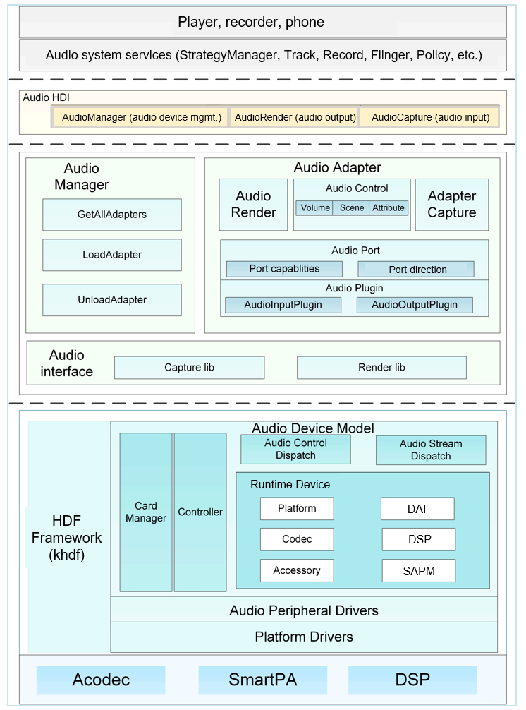
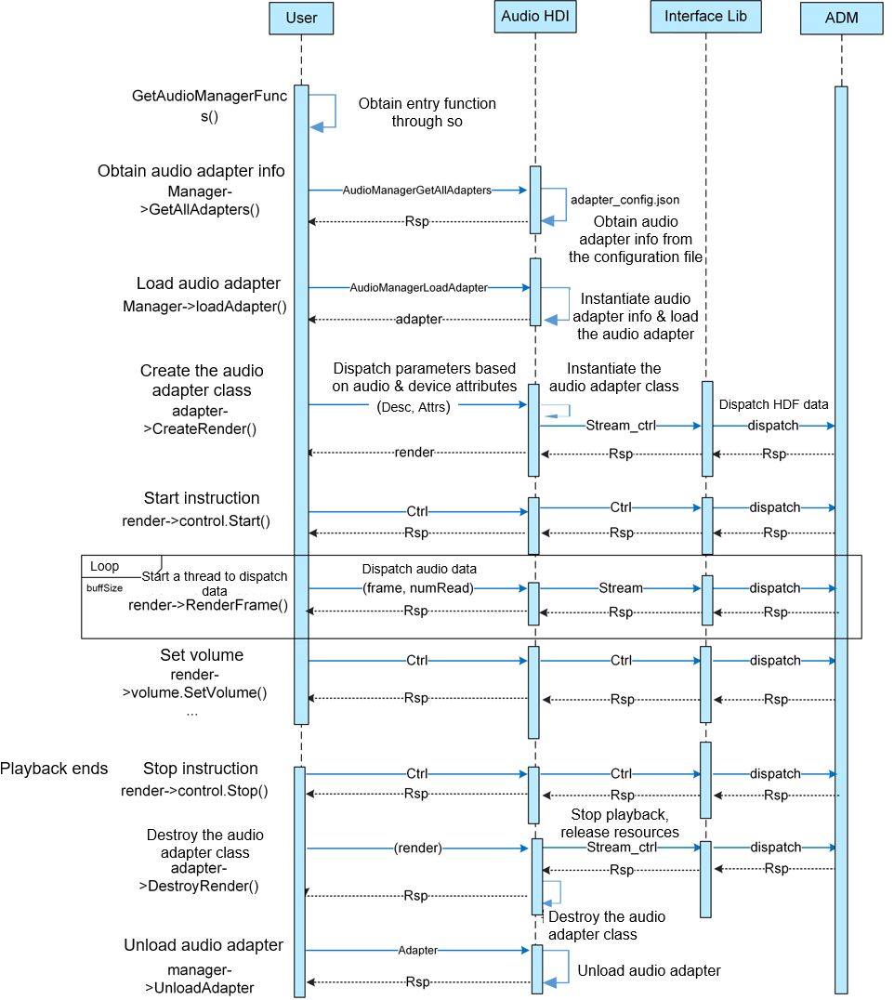
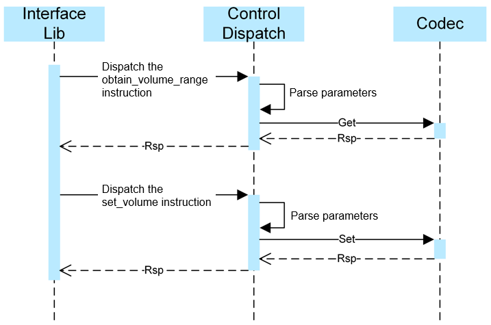
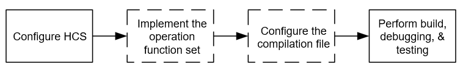
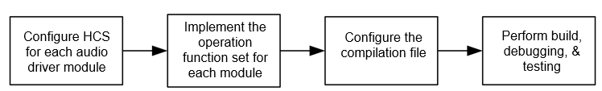
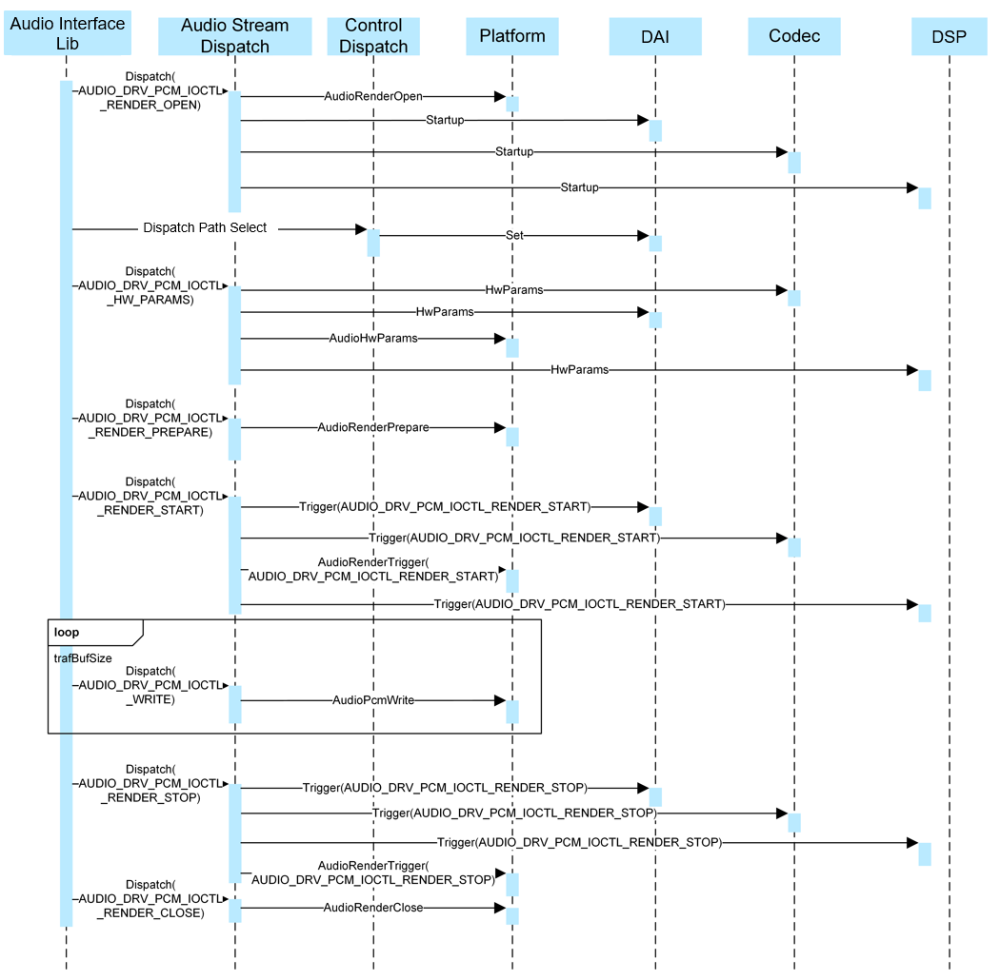

# Audio

- **[Audio Driver Overview](#section1000)**

- **[Audio Driver Architecture](#section2000)**

- **[Audio Driver Development](#section3000)**

    - **[Audio ADM Architecture](#section3100)**
        - [Startup Process](#section3111)
        - [Playback Process](#section3112)
        - [Control Process](#section3113)

    - **[Audio Driver Development Procedure](#section3200)**
        - [Development on the Existing Platform](#section3221)
        - [Development on a New Platform](#section3222)

- **[Audio Driver Development Examples](#section4000)**
    - [Codec Driver Development Example](#section4100)
        - [Filling in Codec Data Structures](#section4111)
        - [Initializing codecDevice and codecDai Devices](#section4112)
        - [Implementing the Codec Operation Function Set](#section4113)
        - [Registering and Binding Codec to HDF](#section4114)
        - [Configuring HCS](#section4115)
    - [Accessory Driver Development Example](#section4200)
        - [Filling in Accessory Data Structures](#section4221)
        - [Initializing accessoryDevice and accessoryDai Devices](#section4222)
        - [Implementing the Accessory Operation Function Set](#section4223)
        - [Registering and Binding Accessory to HDF](#section4224)
        - [Configuring HCS](#section4225)
    - [Platform Driver Development Example](#section4300)
        - [Filling in Platform Data Structures](#section4331)
        - [Initializing the dmaDevice Device](#section4332)
        - [Implementing the DMA Operation Function Set](#section4333)
        - [Registering and Binding Platform to HDF](#sectionsection4334)
        - [Configuring HCS](#section4335)
    - [DAI Driver Development Example](#section4400)
        - [Filling in DAI Data Structures](#section4441)
        - [Initializing the daiDevice Device](#section4442)
        - [Implementing the DAI Operation Function Set](#section4443)
        - [Registering and Binding DAI to HDF](#section4444)
        - [Configuring HCS](#section4445)
    - [Adding Compilation Configuration to Makefile](#section4500)
    - [Source Code Structure and Directory](#section4600)

- **[Development Procedure and Example Using HAL](#section5000)**
    - [Development Procedure](#section5100)
    - [Development Example](#section5200)

- **[Summary](#section9999)**

# Audio Driver Overview<a name="section1000"></a>

A multimedia system is an indispensable part in Internet of Things (IoT) devices. Audio is an important module of the multimedia system, and building an audio driver model is particularly important in development.

This document describes the audio driver architecture and functional components and how to develop the audio driver based on the Hardware Driver Foundation (HDF). Chip vendors can develop their own drivers and Hardware abstraction layer (HAL) API invocation based on the driver architecture.


# Audio Driver Architecture<a name="section2000"></a>

The audio driver architecture is implemented based on the [HDF](https://device.harmonyos.com/en/docs/documentation/guide/driver-hdf-overview-0000001051715456). The audio driver architecture is as follows:


The driver architecture consists of the following:
- Hardware Device Interface (HDI) adapter: implements the audio HAL driver (HDI adaptation) and provides hardware driver capability interfaces for the audio service (frameworks). The HDI adapter provides interface objects such as Audio Manager, Audio Adapter, Audio Control, Audio Capture and Audio Render.
- Audio interface lib: works with the audio driver model in the kernel to control audio hardware, read recording data, and write playback data. It contains **Stream\_ctrl\_common**, which is used to interact with the audio HDI adapter layer.
- Audio Driver Model (ADM): serves the multimedia audio subsystem and enables system developers to develop applications based on scenarios. With ADM, codec and DSP device vendors can adapt their driver code based on the unified interfaces provided by the ADM and implement quick development and easy adaptation to the OpenHarmony system.
- Audio Control Dispatch: receives control instructions from the library layer and distributes the control instructions to the driver layer.
- Audio Stream Dispatch: receives data from the library layer and distributes the data to the driver layer.

- Card Manager: performs management of multiple audio cards. Each audio adapter consists of the digital audio interface (DAI), Platform, Codec, Accessory, DSP and Smart Audio Power Manager (SAPM) modules.
- Platform Driver: servers as the driver adaptation layer.
- Smart Audio Power Manager (SAPM): optimizes the power consumption policy of the ADM.

# Audio Driver Development<a name="section3000"></a>

The following uses the Hi3516D V300 as an example to describe how to develop drivers based on the audio driver architecture.

## Audio ADM Architecture<a name="section3100"></a>
The audio driver provides the **hdf\_audio\_render**, **hdf\_audio\_capture** and **hdf\_audio\_control** services for the HDI layer. The driver service nodes in the **dev** directory of the development board are as follows:

```c
# ls -l hdf_audio*
crw-rw---- 1 system system 248, 6 1970-01-01 00:00 hdf_audio_capture // Audio data recording streaming service.
crw-rw---- 1 system system 248,   4 1970-01-01 00:00 hdf_audio_codec_dev0 // Name of audio adapter device 0.
crw-rw---- 1 system system 248,   4 1970-01-01 00:00 hdf_audio_codec_dev1 // Name of audio adapter device 1.
crw-rw---- 1 system system 248, 5 1970-01-01 00:00 hdf_audio_control // Audio control streaming service.
crw-rw---- 1 system system 248,   7 1970-01-01 00:00 hdf_audio_render     // Audio data playback streaming service.
```

The audio adapter devices have the following driver services:

hdf\_audio\_codec\_dev0
- **dma\_service\_0**: DMA service
- **dai_service**: CPU DAI service
- **codec\_service\_0**: codec service (built-in codec)
- **dsp\_service\_0**: DSP service (optional)

hdf\_audio\_codec\_dev1
- **dma\_service\_0**: DMA service
- **dai_service**: CPU DAI service
- **codec\_service\_1**: accessory service (SmartPA)
- **dsp\_service\_0**: DSP service (optional)

### Startup Process<a name="section3111"></a>


1. When the system starts, the Platform, Codec, Accessory, DSP and DAI drivers of the audio module are loaded first. Each driver obtains the configuration information from its configuration file and saves the obtained information to the data structures.

2. Each driver module calls the ADM registration interface to add itself to the linked list of the driver module.

3. The ADM reads the hdf\_audio\_driver\_0 and hdf\_audio\_driver\_1 configuration and loads the devices of each module.

4. The ADM module initializes each module device by calling the initialization API of each module.

5. Add the initialized audio devices to the cardManager linked list.

### Playback Process<a name="section3112"></a>

1. The Interface Lib dispatches the **Render Open** instruction through the service launched by the driver for handling the playback streaming (referred to as driver service hereinafter). Upon receiving the instruction, the Stream Dispatch service calls the API of each module to deliver the instruction.

2. The Interface Lib dispatches a path select instruction through the control service. Upon receiving the instruction, the Control Dispatch service calls the DAI API to set the path.

3. The Interface Lib dispatches hardware parameters through the driver service. Upon receiving the parameters, the Stream Dispatch service calls the API of each module to set hardware parameters.

4. The Interface Lib dispatches the start playing instruction through the driver service. Upon receiving the instruction, the Stream Dispatch service calls the API of each module to perform related settings for each module.

5. The Interface Lib dispatches audio data through the driver service. Upon receiving the data, the Stream Dispatch service calls the **Platform AudioPcmWrite** API to send the audio data to direct memory access (DMA).

6. The Interface Lib dispatches the stop playing instruction through the driver service. Upon receiving the instruction, the Stream Dispatch service calls the stop API of each module to perform related settings for each module.

7. The Interface Lib dispatches the **Render Close** instruction through the driver service. Upon receiving the instruction, the Stream Dispatch service calls the **Platform AudioRenderClose** API to release resources.

### Control Process<a name="section3113"></a>



1. When the volume needs to be adjusted, the Interface Lib dispatches the instruction for obtaining the volume range through the control service. Upon receiving the instruction, the Control Dispatch service parses the instruction and calls **get()** of the Codec module to obtain the volume range.
2. The Interface Lib dispatches the instruction for setting the volume through the control service. Upon receiving the instruction, the Control Dispatch service parses the instruction and calls **Set()** of the Codec module to set the volume.

## Audio Driver Development Procedure<a name="section3200"></a>

### Development on the Existing Platform<a name="section3221"></a>

The following figure shows the driver development process for adapting the ADM to the codec or accessory (SmartPA) of the existing platform (Hi3516D V300).



- Add register information to the private HDF configuration source (HCS) of codec or smartPA based on the chip description.

- If the workflow of the newly added codec or SmartPA is the same as that of the existing codec or SmartPA, you do not need to implement the operation function set or configure the compilation file for the newly added codec or SmartPA.


- Perform build, debugging, and testing.

### Development on a New Platform<a name="section3222"></a>

The following figure shows the driver development process of the ADM on a new platform.



The audio-related drivers codec (optional), DAI, DMA, DSP (optional), and SmartPA (optional) need to be adapted to the new platform.

- Add register information of each module driver to the private configuration file of each module according to the chip description.

- Implement the operation function set of each module.

- Modify the compilation file of the audio module.

- Perform build, debugging, and testing.


# Audio Driver Development Examples<a name="section4000"></a>

Code path: **drivers/peripheral/audio**

The following uses Hi3516D V300 as an example to describe how to develop the audio codec driver, accessory driver, DAI driver, and platform driver.

## Codec Driver Development Example<a name="section4100"></a>
Code path: **drivers/peripheral/audio/chipsets/hi3516dv300/codec**

The major steps for developing the codec driver are as follows:
1. Define and fill in a codec instance.
2. Implement callbacks for the codec instance.
3. Register and bind the codec instance to the HDF.
4. Configure the HCS and makefile.

### Filling in Codec Data Structures<a name="section4111"></a>

Fill in the following data structures for the codec module:

- **g_codecData**: operation function set and private data set of the codec device.

- **g_codecDaiDeviceOps**: codecDai operation function set, including APIs for starting transmission and setting parameters.

- **g_codecDaiData**: operation function set and private data set of the digital audio interface of the codec.

```c
struct CodecData g_codecData = {
  .Init = CodecDeviceInit,     // Initialize the codec device (need to be implemented for a new platform).
  .Read = AudioDeviceReadReg, // Read the register (already implemented in the existing framework and no adaptation needed).
  .Write = AudioDeviceWriteReg, // Write the register (already implemented in the existing framework and no adaptation needed).
};

struct AudioDaiOps g_codecDaiDeviceOps = {
  .Startup = CodecDaiStartup, // Start transmission (need to be implemented for a new platform).
  .HwParams = CodecDaiHwParams, // Set parameters (need to be implemented for a new platform).
};

struct DaiData g_codecDaiData = {
  .DaiInit = CodecDaiDeviceInit,  // Initialize the codecdai device (need to be implemented for a new platform).
  .ops = &g_codecDaiDeviceOps, // codecdai operation functions.
};
```

### Initializing CodecDevice and CodecDai Devices<a name="section4112"></a>

**CODECDeviceInit** sets audio input/audio output (AIAO), initializes registers, inserts **g_audioControls** into the controller linked list, initializes the power management, and selects a path.

```c
int32_t CodecDeviceInit(struct AudioCard *audioCard, struct CodecDevice *codec)
{
  	...
	/* Register set() and get() of the AIAO module on the Hi3516 platform.*/
	CodecSetCtlFunc(codec->devData, AudioCodecAiaoGetCtrlOps, AudioCodecAiaoSetCtrlOps)
  	...
	/* Hi3516 codec register IoRemap*/
	CodecHalSysInit();
  	...
	/* Initialize the codec registers of the Hi3516 platform.*/
	CodecRegDefaultInit(codec->devData->regCfgGroup);
  	...
	/* Insert g_audioControls of the Hi3516 platform to the controller linked list.*/
  	AudioAddControls(audioCard, codec->devData->controls, codec->devData->numControls);
  	...
	/* Load the codec of the Hi3516 platform to the SAPM.*/
	AudioSapmNewComponents(audioCard, codec->devData->sapmComponents, codec->devData->numSapmComponent);
  	...
	/* Insert the codec of the Hi3516 platform to the audioRoutes linked list.*/
  	AudioSapmAddRoutes(audioCard, g_audioRoutes, HDF_ARRAY_SIZE(g_audioRoutes);
   	...
	AudioSapmNewControls(audioCard);
  	...
	/* Hi3516 codec power management*/
  	AudioSapmSleep(audioCard);
   	...
   	return HDF_SUCCESS;
}
```

**CodecDaiDeviceInit** initializes codecDai. This API is not used on the Hi3516 and is reserved.

```c
int32_t CodecDaiDeviceInit(struct AudioCard *card, const struct DaiDevice *device)

{
  	...
	AUDIO_DRIVER_LOG_DEBUG("codec dai device name: %s\n", device->devDaiName);
  	(void)card;
  	return HDF_SUCCESS;
}
```

### Implementing the Codec Operation Function Set<a name="section4113"></a>

The codec module is encapsulated with the **read()** and **write()** functions of the read and write registers at the operating system abstraction layer (OSAL).

If the new platform cannot use the OSAL read and write functions to operate registers, the developer should implement the **read()** and **write()**.

```c
int32_t AudioDeviceReadReg(unsigned long virtualAddress, uint32_t reg, uint32_t *val)
{
  ...
  *val = OSAL_READL((void *)((uintptr_t)(virtualAddress + reg)));
  return HDF_SUCCESS;
}

int32_t AudioDeviceWriteReg(unsigned long virtualAddress, uint32_t reg, uint32_t value)
{
  OSAL_WRITEL(value, (void *)((uintptr_t)(virtualAddress + reg)));
  return HDF_SUCCESS;
}
```

**CodecDaiStartup** completes startup settings.

```c
int32_t CodecDaiStartup(const struct AudioCard *card, const struct DaiDevice *device)
{
  int32_t ret;
  ...
  (void)card;
  ret = CodecSetAdcTuneEnable(device->devData->regCfgGroup);
  ...
  return HDF_SUCCESS;
}
```

**CodecDaiHwParams** sets parameters, including the sampling rate and bit width.

```c
int32_t CodecDaiHwParams(const struct AudioCard *card, const struct AudioPcmHwParams *param)
{
  unsigned int bitWidth;
  struct CodecDaiParamsVal codecDaiParamsVal;
  ...
  int ret = AudioFramatToBitWidth(param->format, &bitWidth);
  ...
  codecDaiParamsVal.frequencyVal = param->rate;
  codecDaiParamsVal.formatVal = bitWidth;
  ret = CodecDaiParamsUpdate(card->rtd->codecDai->devData->regCfgGroup, codecDaiParamsVal);
  ...
  return HDF_SUCCESS;
}
```

### Registering and Binding Codec to HDF<a name="section4114"></a>

This process depends on the driver implementation mode of the HDF. For details, see [HDF](https://gitee.com/openharmony/docs/blob/master/en/device-dev/driver/driver-hdf.md).

Fill in the **g&#95;codecDriverEntry** structure. Ensure that the value of **moduleName** is the same as that in **device_info.hcs**. Implement the pointers to the **Bind**, **Init**, and **Release** functions.

drivers/peripheral/audio/chipsets/hi3516dv300/codec/src/hi3516_codec_adapter.c

```c
struct HdfDriverEntry g_codecDriverEntry = {
   .moduleVersion = 1,
   .moduleName = "CODEC_HI3516",
   .Bind = CodecDriverBind,
   .Init = CodecDriverInit,
   .Release = CodecDriverRelease,
};
HDF_INIT(g_codecDriverEntry);
```

**CodecDriverBind** binds the device in the HDF to the codec and registers the codec service with the HDF.

```c
static int32_t CodecDriverBind(struct HdfDeviceObject *device)
{
  struct CodecHost *codecHost = (struct CodecHost *)OsalMemCalloc(sizeof(*codecHost));
  ...
  codecHost->device = device;
  device->service = &codecHost->service;
  return HDF_SUCCESS;
}
```

**CodecDriverInit** obtains the codec service name and private register configuration, and inserts them into the linked list by using **AudioRegisterCodec**.

```c
static int32_t CodecDriverInit(struct HdfDeviceObject *device)
{
  ...
  CodecGetConfigInfo(device, &g_codecData);
  CodecSetConfigInfo(&g_codecData, &g_codecDaiData);
  CodecGetServiceName(device, &g_codecData.drvCodecName);
  CodecGetDaiName(device, &g_codecDaiData.drvDaiName);
  AudioRegisterCodec(device, &g_codecData, &g_codecDaiData);
  ...
  return HDF_SUCCESS;
}
```

**CodecDriverRelease** releases driver resources.

```c
static void CodecDriverRelease(struct HdfDeviceObject *device)
{
   codecHost = (struct CodecHost *)device->service;
   OsalMemFree(codecHost);
}
```

### Configuring HCS<a name="section4115"></a>

Configure the driver node, loading sequence, and service name in the .hcs file. For details about the HCS syntax, see [Driver Configuration Management](https://gitee.com/openharmony/docs/blob/master/en/device-dev/driver/driver-hdf-manage.md) in the HDF.

Path of the standard-system configuration file:

**vendor/hisilicon/Hi3516DV300/hdf_config/khdf/**

Path of the small-system configuration file:

**vendor/hisilicon/hispark&#95;taurus/hdf_config/**

**Configuring Codec Device Information in device_info.hcs**

Add codec node configuration. Modify **moduleName** in the configuration file. The value must be the same as **moduleName** in the **HdfDriverEntry** structure. Generally, the value should present the hardware platform, for example, **moduleName = "CODEC_HI3516"**.

The code snippet is as follows:

```c
     audio :: host {
      device_codec :: device {
         device0 :: deviceNode {
           policy = 1; // The codec module provides services only for the kernel.
           priority = 50; // The codec module must be loaded before the load of the HDF_AUDIO module.
           preload = 0;
           permission = 0666;
           moduleName = "CODEC_HI3516"; // The value must be the same as moduleName in HdfDriverEntry.
           serviceName = "codec_service_0"; // Name of the service provided externally.
           deviceMatchAttr = "hdf_codec_driver"; // Name of the private attribute, which is used to match the corresponding private data (including the register configuration).
         }
       }
```

**Configuring Dependencies in audio_config.hcs**

Configure dependencies between the codec, platform, DAI, DSP, and accessory for the audio_card device.

The code snippet is as follows:

```c
root {
    platfrom {
        ...
        controller_0x120c1001 :: card_controller {
            // Set the private data attribute name, which must be the same as deviceMatchAttr in device_info.hcs.
            match_attr = "hdf_audio_driver_1"; 
            serviceName = "hdf_audio_smartpa_dev0"; // Name of the service provided externally.
            accessoryName = "codec_service_1"; // External codec service name.
            platformName = "dma_service_0"; // DMA service.
            cpuDaiName = "dai_service"; // CPU DAI service.
            accessoryDaiName = "accessory_dai"; // External DAI.
            dspName = "dsp_service_0"; // DSP service name.
            dspDaiName = "dsp_dai"; // DSP DAI
        }
    }
}
```

**Configuring Private Registers in codec_config.hcs**

The configuration matches **deviceMatchAttr** of the codec configured in **device_info.hcs**. It includes the register configuration.

Binding the control function configuration is to configure the control functions and their register parameters in the .hcs file according to unified structure specifications. The configuration can be obtained and parsed, and added to the controller linked list.

- **regConfig**: register and control function configuration

- **ctrlParamsSeqConfig**: control function register configuration

- **daiStartupSeqConfig**: DAI startup configuration

- **daiParamsSeqConfig**: playback parameter configuration

- **resetSeqConfig**: reset process register configuration

- **initSeqConfig**: initialization process register configuration

- **controlsConfig**: control function configuration. The **array index** (specific service scenario) and **iface** (same as the HAL) are of fixed values.

```
array index
0: Main Playback Volume
1: Main Capture Volume
2: Playback Mute
3: Capture Mute
4: Mic Left Gain
5: Mic Right Gain
6: External Codec Enable
7: Internally Codec Enable
8: Render Channel Mode
9: Capture Channel Mode
iface
0: virtual dac device
1: virtual adc device
2: virtual adc device
3: virtual mixer device
4: Codec device
5: PGA device
6: AIAO device
```

**ctrlParamsSeqConfig**: control function register configuration. The **item** sequence corresponds to the **item** sequence in **controlsConfig**, indicating the register configuration corresponding to a function.

```c
 root {
    platfrom {
        template codec_controller {
            match_attr = "";
            serviceName = "";
            codecDaiName = "";
        }
        controller_0x120c1030 :: codec_controller {
            match_attr = "hdf_codec_driver";
            serviceName = "codec_service_0";
            codecDaiName = "codec_dai";
            
	        /* Base address of the Hi3516 register*/
            idInfo {
                chipName = "hi3516"; // Codec name
                chipIdRegister = 0x113c0000; // Codec base address
                chipIdSize = 0x1000;        // Codec address offset
            }
            
	       /* Register configuration, including configuration of registers*/
            regConfig {                
               /*  reg: register address
                    rreg: register address
                    shift: shift bits
                    rshift: rshift bits
                    min: min value
                    max: max value
                    mask: mask of value
                    invert: enum InvertVal 0-uninvert 1-invert
                    value: value
                */

                /* reg, value */
                initSeqConfig = [
                    0x14,    0x04000002,
                    0x18,    0xFD200004,
                    0x1C,    0x00180018,
                    0x20,    0x83830028,
                    0x24,    0x00005C5C,
                    0x28,    0x00130000,
                    0x30,    0xFF035A00,
                    0x34,    0x08000001,
                    0x38,    0x06062424,
                    0x3C,    0x1E1EC001,
                    0x14,    0x04000002
                ];            
                
                /* control function config 
                   array index, iface, enable*/
                controlsConfig = [
                    0,  0,  0,  
                    1,  1,  1,
                    2,  0,  1,
                    3,  1,  1,
                    4,  2,  1,
                    5,  2,  1,
                    8,  6,  0,
                    9,  6,  0,
                ];                
                /* control function register config 
                   reg, rreg, shift, rshift, min, max, mask, invert, value */
                ctrlParamsSeqConfig = [
                    0x3c, 0x3c, 24, 24, 0x0, 0x57, 0x7F, 1, 0,   //"Main Capture Volume"
                    0x38, 0x38, 31, 31, 0x0, 0x1, 0x1, 0, 0,     //"Playback Mute"
                    0x3c, 0x3c, 31, 31, 0x0, 0x1, 0x1, 0, 0,      //"Capture Mute"
                    0x20, 0x20, 16, 16, 0x0, 0xF, 0x1F, 0, 0,     //"Mic Left Gain"
                    0x20, 0x20, 24, 24, 0x0, 0xF, 0x1F, 0, 0,     //"Mic Right Gain"
                    0x2000, 0x2000, 16, 16, 0x0, 0x7, 0x7, 0, 0,  //"Render Channel Mode"
                    0x1000, 0x1000, 16, 16, 0x0, 0x7, 0x7, 0, 0  //"Captrue Channel Mode"
                ];

                /* After the upper layer delivers parameters, write audio-related data to registers.
	               reg, rreg, shift, rshift, min, max, mask, invert, value */
                daiParamsSeqConfig = [  
                    0x30, 0x30, 13, 13, 0x0, 0x1F, 0x1F, 0, 0x0,    // i2s_frequency
                    0x1C, 0x1C, 6, 6, 0x0, 0x3, 0x3, 0, 0x0,       // adc_mode_sel
                    0x30, 0x30, 22, 22, 0x0, 0x3, 0x3, 0, 0x0,     // i2s_datawith
                ];

                /* Configuration of the power management function register.
                   reg, rreg, shift, rshift, min, max, mask, invert, value */
                ctrlSapmParamsSeqConfig = [  
                    0x20, 0x20, 23, 23, 0x0, 0x1, 0x1, 0, 0,  //LPGA MIC 0 -- connect MIC
                    0x20, 0x20, 31, 31, 0x0, 0x1, 0x1, 0, 0,  //RPGA MIC 0 -- connect MIC
                    0x30, 0x30, 27, 27, 0x0, 0x1, 0x1, 0, 0,  //dacl to dacr mixer
                    0x30, 0x30, 26, 26, 0x0, 0x1, 0x1, 0, 0  //dacr to dacl mixer
                ];

        		/*
                 Power management component configuration
                 componentName: function name, {"ADCL", "ADCR", "DACL", "DACR", "LPGA", "RPGA", "SPKL", "SPKR", "MIC"} array index.
                 sapmType,compNameIndex,reg, mask,shift,invert, kcontrolNews,kcontrolsNum
                */
                sapmComponent = [ 
                    10,  0,  0x20,  0x1,  15,  1,  0,  0,    //ADCL
                    10,  1,  0x20,  0x1,  14,  1,  0,  0,    //ADCR
                    11,  2,  0x14,  0x1,  11,  1,  0,  0,    //DACL
                    11,  3,  0x14,  0x1,  12,  1,  0,  0,    //DACR
                    8,   4,  0x20,  0x1,  13,  1,  1,  1,    //LPGA
                    8,   5,  0x20,  0x1,  12,  1,  2,  1,    //RPGA
                    15,  6,  0,     0x1,  0,   0,  3,  1,    //SPKL
                    15,  7,  0,     0x1,  0,   0,  4,  1,    //SPKR
                    0,   8,  0,     0x1,  0,   0,  0,  0     //MIC
                ];
                
	          /* Power management function configuration
                   array index,  iface,  enable
              */ 
                sapmConfig = [
        	        0,    5,    1,
                    1,    5,    1,
                    2,    0,    1,
                    3,    0,    1
                ];
            }
        }
    }
}
```

Read the .hcs files in the C code to obtain register configuration.

```c
static int32_t CodecDriverInit(struct HdfDeviceObject *device)
{
  ...
  CodecGetConfigInfo(device, &g_codecData) ;
  CodecSetConfigInfo(&g_codecData, &g_codecDaiData);
  ...
  return HDF_SUCCESS;
} 
```

When the codec is registered, the input parameter **device** contains controller_0x120c1030 node information. You only need to parse the node to obtain the configuration information.

```c
int32_t CodecGetConfigInfo(const struct HdfDeviceObject *device, struct CodecData *codecData)
{
  codecData->regConfig = (struct AudioRegCfgData *)OsalMemCalloc(sizeof(*(codecData->regConfig)));
  CodecGetRegConfig(device, codecData->regConfig);
  return HDF_SUCCESS;
}
```

Obtain the node configuration to configure the node.

```c
int32_t CodecGetRegConfig(const struct HdfDeviceObject *device, struct AudioRegCfgData *configData)
{
    ...
    drsOps = DeviceResourceGetIfaceInstance(HDF_CONFIG_SOURCE);
    ...
    idNode = drsOps->GetChildNode(root, "idInfo");
    ParseAudioAttr(drsOps, idNode, &configData->audioIdInfo);
    regCfgNode = drsOps->GetChildNode(root, "regConfig");
    ...
    DEV_RES_NODE_FOR_EACH_ATTR(regCfgNode, regAttr) {
    ...
    return HDF_SUCCESS;
}
```

Obtain and use the configuration of the **regConfig** node. After the configuration files are parsed, the register information in the code can be directly updated.

```c
int32_t CodecDeviceInit(struct AudioCard *audioCard, struct CodecDevice *codec)
{
...
    if (CodecRegDefaultInit(codec->devData->regCfgGroup) != HDF_SUCCESS) {
        AUDIO_DRIVER_LOG_ERR("CodecRegDefaultInit failed.");
        return HDF_FAILURE;
    }
...
    return HDF_SUCCESS;
}
```


## Accessory Driver Development Example<a name="section4200"></a>
Code path: **drivers/peripheral/audio/chipsets/tfa9879/accessory**

SmartPA is a type of accessory driver. The SmartPA development procedure is similar to the codec development procedure.
1. Define and fill in an accessory instance.
2. Implement callbacks for the accessory instance.
3. Register and bind the accessory instance to the HDF.
4. Configure the HCS and makefile.

### Filling in Accessory Data Structures<a name="section4221"></a>

Fill in the following data structures for the accessory module:

- **g_tfa9879Data**: operation function set of the accessory device. It contains the configuration in the .hcs file, and defines and maps the methods for initializing the accessory device and reading and writing registers.

- **g_tfa9879DaiDeviceOps**: data set of the DAI of the accessory device. It defines and maps the driver name, initialization, and operation set of the data access interface of the accessory device.

- **g_tfa9879DaiData**: data set of the DAI of the accessory device. It defines and maps the driver name, initialization, and operation set of the data access interface of the accessory device.

```c
struct AccessoryData g_tfa9879Data = {
    .Init = Tfa9879DeviceInit,
    .Read = AccessoryDeviceRegRead,
    .Write = AccessoryDeviceRegWrite,
};

struct AudioDaiOps g_tfa9879DaiDeviceOps = {
    .Startup = Tfa9879DaiStartup,
    .HwParams = Tfa9879DaiHwParams,
};

struct DaiData g_tfa9879DaiData = {
    .drvDaiName = "accessory_dai",
    .DaiInit = Tfa9879DaiDeviceInit,
    .ops = &g_tfa9879DaiDeviceOps,
};
```

### Initializing accessoryDevice and accessoryDai Devices<a name="section4222"></a>

As the entry function for device initialization, **Tfa9879DeviceInit** sets the address of the SmartPA I2C device, obtains configuration data, initializes (including resets) the device registers, and adds the control function to the controller linked list. The current demo also includes the initialization of the registers related to the Hi3516D V300 device, such as initialization of GPIO pins.

```c
int32_t Tfa9879DeviceInit(struct AudioCard *audioCard, const struct AccessoryDevice *device)
{
    int32_t ret;
    ...
    g_accessoryTransferData.i2cDevAddr = TFA9879_I2C_DEV_ADDR;  // 0x6D
    // Obtain configuration data.
    ret = AccessoryDeviceCfgGet(device->devData, &g_accessoryTransferData);
    ...
    // Initialize GPIO pins.
    ret = Hi35xxGpioPinInit();
    ...
    // Initialize device registers.
    ret = AccessoryDeviceCtrlRegInit();
    ...
    // Bind the control function configuration.
    ret = AudioAddControls(audioCard, g_accessoryTransferData.accessoryControls,
                           g_accessoryTransferData.accessoryCfgCtrlCount);
    ...
}
```

**AccessoryI2cReadWrite** reads and writes I2C registers.

```c
int32_t AccessoryI2cReadWrite(struct AudioAddrConfig *regAttr, uint16_t rwFlag)
{
    int32_t ret;
    DevHandle i2cHandle;
    int16_t transferMsgCount = 1;
    uint8_t regs[I2C_REG_LEN];
    struct I2cMsg msgs[I2C_MSG_NUM];
    ...
    i2cHandle = I2cOpen(I2C_BUS_NUM);
    ...
    if (rwFlag == I2C_FLAG_READ) {
        transferMsgCount = I2C_MSG_NUM;
    }
    ret = AccessoryI2cMsgFill(regAttr, rwFlag, regs, msgs);
    ...
    ret = I2cTransfer(i2cHandle, msgs, transferMsgCount);
    ...
    AccessoryI2cRelease(msgs, transferMsgCount, i2cHandle);
    return HDF_SUCCESS;
}
```

### Implementing the Accessory Operation Function Set<a name="section4223"></a>

The callbacks **AccessoryDeviceRegRead** and **AccessoryDeviceRegWrite** invokes **AccessoryI2cReadWrite** to read and write the control register values.

```c
int32_t AccessoryDeviceRegRead(const struct AccessoryDevice *codec, uint32_t reg, uint32_t *val)
{
    int32_t ret;
    struct AudioAddrConfig regAttr;
    ...
    (void)codec;
    regAttr.addr = (uint8_t)reg;
    regAttr.value = 0;
    ret = AccessoryI2cReadWrite(&regAttr, I2C_FLAG_READ);
    if (ret != HDF_SUCCESS) {
        AUDIO_DRIVER_LOG_ERR("failed.");
        return HDF_FAILURE;
    }
    *val = regAttr.value;
    ...
    return HDF_SUCCESS;
}

int32_t AccessoryDeviceRegWrite(const struct AccessoryDevice *codec, uint32_t reg, uint32_t value)
{
    int32_t ret;
    struct AudioAddrConfig regAttr;
    (void)codec;
    regAttr.addr = (uint8_t)reg;
    regAttr.value = (uint16_t)value;
    ret = AccessoryI2cReadWrite(&regAttr, 0);
    ...
    return HDF_SUCCESS;
}
```

**Tfa9879DaiStartup** performs startup settings. The code snippet is as follows:

```c
int32_t Tfa9879DaiStartup(const struct AudioCard *card, const struct DaiDevice *device)
{
    int ret;
    (void)card;
	(void)device;
	// Set the working status of SmartPA.
    ret = Tfa9879WorkStatusEnable();
    ...
    return HDF_SUCCESS;
}

```

**Tfa9879DaiHwParams** delivers playback parameters. The code snippet is as follows:

```c
int32_t Tfa9879DaiHwParams(const struct AudioCard *card, const struct AudioPcmHwParams *param)
{
    int32_t ret;
    uint16_t frequency, bitWidth;
    struct DaiParamsVal daiParamsVal;
    (void)card;
	...
	// Set the sampling rate.
    ret = AcessoryDeviceFrequencyParse(param->rate, &frequency);
	...
	// Set the bit width.
    ret = Tfa9879FormatParse(param->format, &bitWidth);
    ...
    daiParamsVal.frequencyVal = frequency;
    daiParamsVal.formatVal = bitWidth;
	daiParamsVal.channelVal = param->channels; // Set the audio channel.
    ret = AccessoryDaiParamsUpdate(daiParamsVal);
    ...
    return HDF_SUCCESS;
}
```

### Registering and Binding Accessory to HDF<a name="section4224"></a>

This process depends on the driver implementation mode of the HDF. For details, see [HDF](https://gitee.com/openharmony/docs/blob/master/en/device-dev/driver/driver-hdf.md).

Fill in the **g&#95;tfa9879DriverEntry** structure. Ensure that the value of **moduleName** is the same as that in **device_info.hcs**. Implement the pointers to the **Bind**, **Init**, and **Release** functions.

drivers/peripheral/audio/chipsets/tfa9879/accessory/src/tfa9879_accessory_adapter.c

```c
static int32_t Tfa9879DriverBind(struct HdfDeviceObject *device)
{
    (void)device;
    AUDIO_DRIVER_LOG_INFO("success!");
    return HDF_SUCCESS;
}

static int32_t Tfa9879DriverInit(struct HdfDeviceObject *device)
{
    int32_t ret;
    ...
    // Obtain configuration data from .hcs files.
    ret = AccessoryGetConfigInfo(device, &g_tfa9879Data); 
    ...
    ret = ret = GetServiceName(device);
    ...
    ret = AudioRegisterAccessory(device, &g_tfa9879Data, &g_tfa9879DaiData);
    ....
    return HDF_SUCCESS;
}

/* HdfDriverEntry definitions */
struct HdfDriverEntry g_tfa9879DriverEntry = {
    .moduleVersion = 1,
    .moduleName = "CODEC_TFA9879",
    .Bind = Tfa9879DriverBind,
    .Init = Tfa9879DriverInit,
    .Release = NULL,
};
HDF_INIT(g_tfa9879DriverEntry);
```

### Configuring HCS<a name="section4225"></a>

For details about the configuration process, see [Configuring HCS](#section4115) in **Codec Driver Development Example**.


## Platform Driver Development Example<a name="section4300"></a>
Code path: **drivers/peripheral/audio/chipsets/hi3516dv300/soc**

In audio driver development, platform is configured to adapt to the DMA driver. The major steps for developing the platform driver are as follows:
1. Define and fill in a platform instance.
2. Implement callbacks for the platform instance.
3. Register and bind the platform instance to the HDF.
4. Configure the HCS and makefile.

### Filling in Platform Data Structures<a name="section4331"></a>

Fill in the following structures for the platform module:

- **g_platformData**: private configuration of the platform device, including the initialization and operation functions of the platform device.

- **g_dmaDeviceOps**: DMA device operation function set, including the encapsulation of some common DMA APIs.

```c
struct AudioDmaOps g_dmaDeviceOps = {
    .DmaBufAlloc = Hi3516DmaBufAlloc,             // Apply for memory for the DMA device.
    .DmaBufFree = Hi3516DmaBufFree,               // Releases the memory of the DMA device.
    .DmaRequestChannel = Hi3516DmaRequestChannel, // Request a DMA channel.
    .DmaConfigChannel = Hi3516DmaConfigChannel,   // Configure the DMA channel.
    .DmaPrep = Hi3516DmaPrep,                     // Prepare for DMA.
    .DmaSubmit = Hi3516DmaSubmit,                 // Submit a DMA request. 
    .DmaPending = Hi3516DmaPending,               // Pend DMA.
    .DmaPause = Hi3516DmaPause,                   // Pause or stop DMA.
    .DmaResume = Hi3516DmaResume,                 // Resume DMA.
    .DmaPointer = Hi3516DmaPointer,               // Obtain the current playing or recording position.
};

struct PlatformData g_platformData = {
    .PlatformInit = AudioDmaDeviceInit, // Initialize the DMA device.
    .ops = &g_dmaDeviceOps,
};
```

### Initializing the dmaDevice Device<a name="section4332"></a>

**AudioDmaDeviceInit** initializes the device, including setting the Hi3516 AIAO module.

```c
int32_t AudioDmaDeviceInit(const struct AudioCard *card, const struct PlatformDevice *platformDevice)
{
... 
    AiaoHalSysInit();
    /* PIN MUX */
    AiaoSysPinMux();
    /* CLK reset */
    AiaoClockReset();
    /* aiao init */
    AiaoDeviceInit(chnId);
...
    return HDF_SUCCESS;
}
```

### Implementing the DMA Operation Function Set<a name="section4333"></a>

The DMA device operation function set includes the encapsulation of DMA common APIs. If the common APIs cannot meet development requirements, you can implement new DMA callbacks.

```c
int32_t Hi3516DmaBufAlloc(struct PlatformData *data, const enum AudioStreamType streamType);
int32_t Hi3516DmaBufFree(struct PlatformData *data, const enum AudioStreamType streamType);
int32_t Hi3516DmaRequestChannel(const struct PlatformData *data);
int32_t Hi3516DmaConfigChannel(const struct PlatformData *data);
int32_t Hi3516DmaPrep(const struct PlatformData *data);
int32_t Hi3516DmaSubmit(const struct PlatformData *data);
int32_t Hi3516DmaPending(struct PlatformData *data);
int32_t Hi3516DmaPause(struct PlatformData *data);
int32_t Hi3516DmaResume(const struct PlatformData *data);
int32_t Hi3516DmaPointer(struct PlatformData *data, uint32_t *pointer);
```

### Registering and Binding Platform to HDF<a name="section4334"></a>

This process depends on the driver implementation mode of the HDF. For details, see [HDF](https://gitee.com/openharmony/docs/blob/master/en/device-dev/driver/driver-hdf.md).

- Fill in the **g&#95;platformDriverEntry** structure.
- Ensure that the value of **moduleName** is the same as that in **device_info.hcs**.
- Implement the pointers to the **Bind**, **Init**, and **Release** functions.

drivers/peripheral/audio/chipsets/hi3516dv300/soc/src/hi3516_dma_adapter.c

```c
static int32_t Hi3516DmaDriverInit(struct HdfDeviceObject *device)
{
...
    OsalMutexInit(&g_platformData.renderBufInfo.buffMutex);
    OsalMutexInit(&g_platformData.captureBufInfo.buffMutex);
    g_platformData.platformInitFlag = false;
    ret = AudioSocRegisterPlatform(device, &g_platformData);
...
    return HDF_SUCCESS;
}

static void Hi3516DmaDriverRelease(struct HdfDeviceObject *device)
{
    struct PlatformHost *platformHost = NULL;
...
    platformHost = (struct PlatformHost *)device->service;
...
    OsalMutexDestroy(&g_platformData.renderBufInfo.buffMutex);
    OsalMutexDestroy(&g_platformData.captureBufInfo.buffMutex);
    OsalMemFree(platformHost);
}

/* HdfDriverEntry definitions */
struct HdfDriverEntry g_platformDriverEntry = {
    .moduleVersion = 1,
    .moduleName = "DMA_HI3516",
    .Bind = Hi3516DmaDriverBind,
    .Init = Hi3516DmaDriverInit,
    .Release = Hi3516DmaDriverRelease,
};
HDF_INIT(g_platformDriverEntry);
```

### Configuring HCS<a name="section4335"></a>

For details about the configuration process, see [Configuring HCS](#section4115) in **Codec Driver Development Example**.


## DAI Driver Development Example<a name="section4400"></a>
Code path: **drivers/peripheral/audio/chipsets/hi3516dv300/soc**

The major steps for developing the DAI driver are as follows:
1. Define and fill in a DAI instance.
2. Implement callbacks for the DAI instance.
3. Register and bind the DAI instance to the HDF.
4. Configure the HCS and makefile.

### Filling in DAI Data Structures<a name="section4441"></a>

Fill in the following structures for the DAI module:

- **g_daiData**: private configuration of the DAI device, including the initialization of the DAI device, read/write of registers, and operation functions.

- **g_daiDeviceOps**: DAI device operation function set, including setting DAI parameters and triggering and starting the DAI device.

```c
struct AudioDaiOps g_daiDeviceOps = {
    .HwParams = DaiHwParams,
    .Trigger = DaiTrigger,
    .Startup = DaiStartup,
};

struct DaiData g_daiData = {
    .DaiInit = DaiDeviceInit,
    .Read = AudioDeviceReadReg,
    .Write = AudioDeviceWriteReg,
    .ops = &g_daiDeviceOps,
};
```

### Initializing the daiDevice Device<a name="section4442"></a>

**DaiDeviceInit** initializes DAI configuration and adds the information to the controller linked list.

```c
int32_t DaiDeviceInit(struct AudioCard *audioCard, const struct DaiDevice *dai)
{
...
    struct DaiData *data = dai->devData;
    struct AudioRegCfgData *regConfig = dai->devData->regConfig;
...
    g_regCodecBase = OsalIoRemap(CODEC_REG_BASE, CODEC_MAX_REG_SIZE);
...
    data->regVirtualAddr = (uintptr_t)g_regCodecBase;
    DaiSetConfigInfo(data);
    AudioAddControls(audioCard, data->controls, data->numControls);
	I2c6PinInit();
...
    data->daiInitFlag = true;
    return HDF_SUCCESS;
}
```

### Implementing the DAI Operation Function Set<a name="section4443"></a>

**AudioDeviceReadReg** and **AudioDeviceWriteReg** are not used on the Hi3516 and are reserved.

**DaiHwParams** sets PCM stream information.

```c
int32_t DaiHwParams(const struct AudioCard *card, const struct AudioPcmHwParams *param)
{
    uint32_t bitWidth;
    struct DaiDevice *device = card->rtd->cpuDai;
...
    DaiCheckSampleRate(param->rate);
    struct DaiData *data = DaiDataFromCard(card);
    data->pcmInfo.channels = param->channels;
...
    AudioFramatToBitWidth(param->format, &bitWidth);
...
    data->pcmInfo.bitWidth = bitWidth;
    data->pcmInfo.rate = param->rate;
    data->pcmInfo.streamType = param->streamType;
    data->regVirtualAddr = (uintptr_t)g_regDaiBase;
...
	DaiParamsUpdate(device);
    data->regVirtualAddr = (uintptr_t)g_regCodecBase;
    return HDF_SUCCESS;
}
```

**DaiTrigger** is not used on the Hi3516 and is reserved.

**DaiStartup** updates the register configuration and configures the I2S.

```c
int32_t DaiStartup(const struct AudioCard *card, const struct DaiDevice *device)
{
    struct AudioMixerControl *regCfgItem = NULL;
...
    regCfgItem = device->devData->regConfig->audioRegParams[AUDIO_DAI_STARTUP_PATAM_GROUP]->regCfgItem;
    itemNum = device->devData->regConfig->audioRegParams[AUDIO_DAI_STARTUP_PATAM_GROUP]->itemNum;

    device->devData->regVirtualAddr = (uintptr_t)g_regDaiBase;
    for (int i = 0; i < itemNum; i++) {
        int ret = AudioUpdateDaiRegBits(device, &regCfgItem[i], regCfgItem[i].value);
        if (ret != HDF_SUCCESS) {
            AUDIO_DRIVER_LOG_ERR("set frequency fail.");
            return HDF_FAILURE;
        }
    }
    device->devData->regVirtualAddr = (uintptr_t)g_regCodecBase;

    if (I2sPinInit() != HDF_SUCCESS) {
        AUDIO_DRIVER_LOG_ERR("I2sPinInit fail.");
    }

    return HDF_SUCCESS;
}
```

### Registering and Binding DAI to HDF<a name="section4444"></a>

This process depends on the driver implementation mode of the HDF. For details, see [HDF](https://gitee.com/openharmony/docs/blob/master/en/device-dev/driver/driver-hdf.md).

- Fill in the **g_daiDriverEntry** structure.
- Ensure that the value of **moduleName** is the same as that in **device_info.hcs**.
- Implement the pointers to the **Bind**, **Init**, and **Release** functions.

drivers/peripheral/audio/chipsets/hi3516dv300/soc/src/hi3516_dai_adapter.c

```c
static int32_t DaiDriverBind(struct HdfDeviceObject *device)
{
...
    struct DaiHost *daiHost = (struct DaiHost *)OsalMemCalloc(sizeof(*daiHost));
...
    daiHost->device = device;
    device->service = &daiHost->service;
    g_daiData.daiInitFlag = false;
...
    return HDF_SUCCESS;
}

static int32_t DaiDriverInit(struct HdfDeviceObject *device)
{
...
    DaiGetConfigInfo(device, &g_daiData);
    DaiGetServiceName(device);
...
    OsalMutexInit(&g_daiData.mutex);
    AudioSocRegisterDai(device, &g_daiData);
...
    return HDF_SUCCESS;
}

static void DaiDriverRelease(struct HdfDeviceObject *device)
{
...
    OsalMutexDestroy(&g_daiData.mutex);
...
    struct DaiHost *daiHost = (struct DaiHost *)device->service;
...
    OsalMemFree(daiHost);
}

/* HdfDriverEntry definitions */
struct HdfDriverEntry g_daiDriverEntry = {
    .moduleVersion = 1,
    .moduleName = "DAI_HI3516",
    .Bind = DaiDriverBind,
    .Init = DaiDriverInit,
    .Release = DaiDriverRelease,
};
HDF_INIT(g_daiDriverEntry);
```

### Configuring HCS<a name="section4445"></a>

For details about the configuration process, see [Configuring HCS](#section4115) in **Codec Driver Development Example**.


## Adding Compilation Configuration to Makefile<a name="section4500"></a>

Add the newly added files to the **Makefile** file to link them to the kernel image.

Standard system (Linux): **drivers/adapter/khdf/linux/model/audio/Makefile**

```makefile
obj-$(CONFIG_DRIVERS_HDF_AUDIO_CODEC) += \
$(KHDF_AUDIO_HI3516DV300_DIR)/../tfa9879/accessory/src/tfa9879_accessory_adapter.o \
$(KHDF_AUDIO_HI3516DV300_DIR)/../tfa9879/accessory/src/tfa9879_accessory_impl.o \
$(KHDF_AUDIO_HI3516DV300_DIR)/codec/src/hi3516_codec_adapter.o \
$(KHDF_AUDIO_HI3516DV300_DIR)/codec/src/hi3516_codec_impl.o \
$(KHDF_AUDIO_HI3516DV300_DIR)/codec/src/hi3516_codec_ops.o \
$(KHDF_AUDIO_HI3516DV300_DIR)/dsp/src/dsp_adapter.o \
$(KHDF_AUDIO_HI3516DV300_DIR)/soc/src/hi3516_dai_adapter.o \
$(KHDF_AUDIO_HI3516DV300_DIR)/soc/src/hi3516_dai_ops.o \
$(KHDF_AUDIO_HI3516DV300_DIR)/soc/src/hi3516_aiao_impl.o \
$(KHDF_AUDIO_HI3516DV300_DIR)/soc/src/hi3516_dma_ops.o \
$(KHDF_AUDIO_HI3516DV300_DIR)/soc/src/hi3516_dma_adapter.o \
$(KHDF_AUDIO_HI3516DV300_DIR)/codec/src/hi3516_codec_adapter.o
```

Small system (LiteOS): **drivers/adapter/khdf/liteos/model/audio/Makefile**

```makefile
LOCAL_SRCS += \
$(KHDF_AUDIO_HI3516DV300_DIR)/../tfa9879/accessory/src/tfa9879_accessory_adapter.c \
$(KHDF_AUDIO_HI3516DV300_DIR)/../tfa9879/accessory/src/tfa9879_accessory_impl.c \
$(KHDF_AUDIO_HI3516DV300_DIR)/codec/src/hi3516_codec_adapter.c \
$(KHDF_AUDIO_HI3516DV300_DIR)/codec/src/hi3516_codec_impl.c \
$(KHDF_AUDIO_HI3516DV300_DIR)/codec/src/hi3516_codec_ops.c \
$(KHDF_AUDIO_HI3516DV300_DIR)/dsp/src/dsp_adapter.c \
$(KHDF_AUDIO_HI3516DV300_DIR)/soc/src/hi3516_dai_adapter.c \
$(KHDF_AUDIO_HI3516DV300_DIR)/soc/src/hi3516_dai_ops.c \
$(KHDF_AUDIO_HI3516DV300_DIR)/soc/src/hi3516_aiao_impl.c \
$(KHDF_AUDIO_HI3516DV300_DIR)/soc/src/hi3516_dma_ops.c \
$(KHDF_AUDIO_HI3516DV300_DIR)/soc/src/hi3516_dma_adapter.c
```


## Source Code Structure and Directory<a name="section4600"></a>

The development example implements the functions in the header file of the driver interface. The following uses Hi3516 as an example to describe the directory structure. 

Path of the driver implementation sample code: **drivers/peripheral/audio/chipsets**

```
├── hi3516dv300
│   ├── codec
│   │   ├── include
│   │   │   ├── hi3516_codec_impl.h
│   │   │   └── hi3516_codec_ops.h
│   │   ├── src
│   │   │   ├── hi3516_codec_adapter.c  // Codec driver entry
│   │   │   ├── hi3516_codec_impl.c     // Implement codec hardware operations
│   │   │   └── hi3516_codec_ops.c      // Implement codec driver APIs
│   │   └── test
│   │       └── unittest
│   ├── dsp
│   │   └── include
│   │       └── dsp_ops.h          
│   │   └── src
│   │       └── dsp_adapter.c           // DSP driver entry
│   │       └── dsp_ops.c             
│   └── soc
│       ├── include
│       │   ├── hi3516_aiao_impl.h
│       │   ├── hi3516_dai_ops.h
│       │   └── hi3516_dma_ops.h
│       ├── src
│       │   ├── hi3516_aiao_impl.c
│       │   ├── hi3516_dai_adapter.c   // DAI driver entry
│       │   ├── hi3516_dai_ops.c
│       │   ├── hi3516_dma_adapter.c   // DMA driver entry
│       │   └── hi3516_dma_ops.c
│       └── test
│           └── unittest
└── tfa9879
    └── accessory
        ├── include
        │   └── tfa9879_accessory_impl.h
        └── src
            ├── tfa9879_accessory_adapter.c  // Accessory driver entry 
            └── tfa9879_accessory_impl.c
```

HCS Files and Directory

```
Standard system:
vendor/hisilicon/Hi3516DV300/
└── hdf_config
    └── khdf
        ├── audio
        │   ├── audio_config.hcs
        │   ├── codec_config.hcs
        │   ├── dai_config.hcs
        │   ├── dma_config.hcs
        │   └── dsp_config.hcs
        ├── device_info
        │   └── device_info.hcs
        └── hdf.hcs

Small system:
vendor/hisilicon/hispark_taurus/
├── config.json
└── hdf_config
    ├── audio
    │   ├── audio_config.hcs
    │   ├── codec_config.hcs
    │   ├── dai_config.hcs
    │   ├── dma_config.hcs
    │   └── dsp_config.hcs
    ├── device_info
    │   └── device_info.hcs
    └── hdf.hcs
```


# Development Procedure and Example Using HAL<a name="section5000"></a>
Code path: **drivers/peripheral/audio/hal**

## Development Procedure<a name="section5100"></a>



1. Call **GetAudioManagerFuncs()** to obtain functions.

2. Call **GetAllAdapters()** to obtain information about the supported audio adapters and call **LoadAdapter()** load the corresponding audio adapter.

3. Create an audio player class by calling **CreateRender()** or create a recorder class and deliver audio attributes.

4. Call the methods mounted to the created audio player class to call **render->control.Start()** and **render->RenderFrame()** to dispatch the start instruction and deliver audio data cyclically.

5. During the playback, call **render->control.Pause()**, **render->control.Resume()** or **render->volume.SetVolume()** to control the audio player service, for example, pausing the playback, resume the playback, and adjusting the volume.

6. After the audio player service is complete, stop the playback, destroy the audio player class, and unload the audio adapter.

    1. render->control.Stop();

    2. adapter->DestroyRender();

    3. manager->UnloadAdapter();

## Development Example<a name="section5200"></a>

```c
#include <string.h>
#include <stdio.h>
#include "audio_types.h"
#include <pthread.h>
#include "audio_manager.h"

 /* Open the dynamic link to the so library. */
char *soPathHdi = "/system/lib/libhdi_audio.z.so";  
void *g_handle = dlopen(soPathHdi , 1);

int32_t FrameStart(void *param)
{
...
    /* Send audio data cyclically.*/
    do {
        readSize = (remainingDataSize > bufferSize) ? bufferSize : remainingDataSize;
        numRead = fread(frame, 1, readSize, g_file);
        if (numRead > 0) {
            ret = render->RenderFrame(render, frame, numRead, &replyBytes);
            if (ret == HDF_ERR_INVALID_OBJECT) {
                LOG_FUN_ERR("Render already stop!");
                break;
            }
            remainingDataSize -= numRead;
        }
        /* Pause the playback and wait.*/
        while (g_waitSleep) {
            printf("music pause now.\n");
            pthread_cond_wait(&g_functionCond, &g_mutex);
            printf("music resume now.\n");
        }
    } while (!g_closeEnd && numRead > 0 && remainingDataSize > 0);
...
}

static void *hal_main()
{
    /* Map and call the entry function.*/
    struct AudioManager *(*getAudioManager)() =
    (struct AudioManager *(*)())(dlsym(g_handle, "GetAudioManagerFuncs"));
    struct AudioManager *manager = getAudioManager();
    
    /* Obtain the audio adapter list.*/
    struct AudioAdapterDescriptor *descs = NULL;
    int32_t size = 0;
    int32_t ret = manager->GetAllAdapters(manager, &descs, &size);

    /* Locate the audio adapter and port based on the specified audio adapter name and port description.*/
    enum AudioPortDirection port = PORT_OUT;  // The port type OUT means to play the audio.
    struct AudioPort renderPort;
    char * adapterNameCase = "usb";
    int32_t index = SwitchAdapter(descs, adapterNameCase, port, &renderPort, size);

    /* Load the audio adapter based on the matched audio adapter information.*/
    struct AudioAdapter *adapter = NULL;
    struct AudioAdapterDescriptor *desc = &descs[index];  // obtain the device based on the matched audio adapter information.
    manager->LoadAdapter(manager, desc, &adapter); // Load the audio card and obtain the audio card instance.

    /* Create an audio player class.*/
    struct AudioRender *render;
    struct AudioDeviceDescriptor devDesc;  
    struct AudioSampleAttributes attrs;
    InitDevDesc(&devDesc, renderPort.portId);  // Initialize device parameters.
    WavHeadAnalysis(g_file, &attrs);  // Parse the audio file to set attributes.
    adapter->CreateRender(adapter, &devDesc, &attrs, &render);

    /* Deliver the number of the audio to be played.*/
    render->control.Start((AudioHandle)render);   // Dispatch the start instruction and prepare for the action.
    pthread_create(&g_tids, NULL, (void *)(&FrameStart), &g_str); // Start the thread to play the audio clip. 

    /* Control instructions*/
    render->control.Pause((AudioHandle)render);  // Pause the playback. 
    render->control.Resume((AudioHandle)render); // Resume the playback.
    render->volume.SetVolume((AudioHandle)render, 0.5); // Set the volume.

     /* Stop playback and destroy the audio player class.*/
    render->control.Stop((AudioHandle)render);
    adapter->DestroyRender(adapter, render);
     /* Unload the audio adapter.*/
    manager->UnloadAdapter(manager, adapter);
}
```

 

# Summary<a name="section9999"></a>

This document provides all the key adaptations involved in the driver development based on the audio driver architecture. It elaborates how to adapt the audio driver and use HDI APIs. You can easily develop your audio drivers based on the chip you use by referring to this document.
