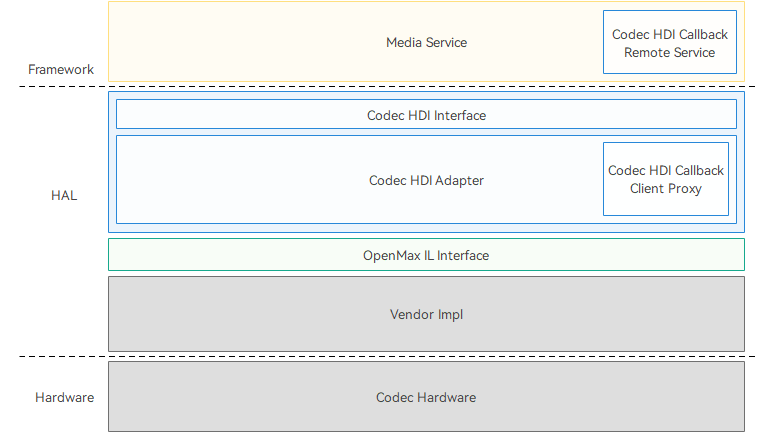

# Codec

## Overview
### Function

The OpenHarmony codec Hardware Device Interface (HDI) driver framework implements the video hardware codec driver based on OpenMAX. It provides APIs for the upper-layer media services to obtain component encoding and decoding capabilities, create a component, set parameters, transfer data, and destroy a component. The codec driver can encode video data in YUV or RGB format to H.264 or H.265 format, and decode raw stream data from H.264 or H.265 format to YUV or RGB format. This document describes the codec functionality developed based on the OpenHarmony Hardware Driver Foundation (HDF).

The codec HDI driver framework is implemented based on the HDF. The figure below shows the codec HDI driver framework.

**Figure 1** Codec HDI driver framework



- Codec HDI Callback Remote Service: an anonymous callback service used to process callbacks.
- Codec HDI: provides standard APIs based on OpenMAX. The upper layer services call the APIs to implement hardware encoding and decoding.
- Codec HDI Adapter: HDI implementation layer, which implements HDI APIs and interacts with OpenMAX Integration layer (IL).
- OpenMAX IL interface: provides OpenMAX IL APIs to directly interact with the codec HDI driver.
- Vendor Impl: vendor adaptation layer, which is the OpenMAX implementation layer adapted by each vendor.
- Codec Hardware: hardware decoding device.

### Basic Concepts
Before you get started, understand the following concepts:

- Sampling rate

    The number of samples taken from continuous signals every second to form discrete signals, in Hz.

- OpenMAX IL

    A standardized media component interface to enable applications and media frameworks to interact with multimedia codecs and supported components in a unified manner.

- Frame rate

    Number of frames of images transmitted per second, or the number of times that a GPU can refresh images per second. A higher frame rate indicates smoother motion, while a lower frame rate means choppier motion and blurry footage.

- Bit rate

    Number of bits transmitted or processed per unit of time, generally in kbit/s. A higher bit rate indicates clearer image, while a lower bit rate means blurry image with artifacts.

- Component

    An OpenMAX IL component, which is an abstraction of modules in video streams. The components in this document refer to codec components used for video encoding and decoding.

### Constraints

The codec HDI applies only to the standard system.

For more details, see [OpenMAX IL](https://www.khronos.org/api/openmax/il).

## Development Guidelines

### When to Use
The codec module implements hardware encoding and decoding of video data. It converts raw stream data such as H.264 data into YUV or RGB data, and converts YUV or RGB data into data formats such as H.264.

### Available APIs

- icodec_component_manager.h

  | API                                                                                                                                                      | Description                     |
  | -------------------------------------------------------------------------------------------------------------------------------------------------------------- | ------------------------------|
  | int32_t CreateComponent(sptr<ICodecComponent>& component, uint32_t& componentId,<br>const std::string& compName, int64_t appData, const sptr<ICodecCallback>& callbacks) | Creates a codec component instance.            |
  | int32_t DestoryComponent(uint32_t componentId)                                                                | Destroys a codec component instance.                 |

- icodec_component.h

  | API                                                    | Description              |
  | ------------------------------------------------------------ | ---------------------- |
  | int32_t SendCommand(CodecCommandType cmd, uint32_t param, const std::vector<int8_t>& cmdData) | Sends commands to a component.        |
  | int32_t GetParameter(uint32_t index, const std::vector<int8_t>& inParamStruct, std::vector<int8_t>& outParamStruct) | Obtains component parameter settings.      |
  | int32_t SetParameter(uint32_t index, const std::vector<int8_t>& paramStruct) | Sets component parameters.    |
  | int32_t GetState(CodecStateType& state)                      | Obtains the component status.        |
  | int32_t UseBuffer(uint32_t portIndex, const OmxCodecBuffer& inBuffer, OmxCodecBuffer& outBuffer) | Requests a port buffer for the component.  |
  | int32_t FreeBuffer(uint32_t portIndex, const OmxCodecBuffer& buffer) | Releases the buffer.            |
  | int32_t EmptyThisBuffer(const OmxCodecBuffer& buffer)        | Empties this buffer.|
  | int32_t FillThisBuffer(const OmxCodecBuffer& buffer)         | Fills this buffer.  |

- icodec_callback.h

  | API                                                    | Description                          |
  | ------------------------------------------------------------ | ---------------------------------- |
  | int32_t EventHandler(CodecEventType event, const EventInfo& info) | Called to report an event.                          |
  | int32_t EmptyBufferDone(int64_t appData, const OmxCodecBuffer& buffer) | Called to report an event indicating that the encoding or decoding in the input buffer is complete.|
  | int32_t FillBufferDone(int64_t appData, const OmxCodecBuffer& buffer) | Called to report an event indicating that the output buffer is filled.            |

For more information, see [codec](https://gitee.com/openharmony/drivers_peripheral/tree/master/codec).

### Development Procedure
The codec HDI driver development procedure is as follows:

#### Registering and Initializing the Driver
Define the **HdfDriverEntry** structure (which defines the driver initialization method) and fill in the **g_codeccomponentmanagerDriverEntry** structure to implement the pointers in **Bind()**, **Init()**, and **Release()**.

```c
static struct HdfDriverEntry g_codeccomponentmanagerDriverEntry = {
    .moduleVersion = 1,
    .moduleName = "codec_component_manager_service",
    .Bind = HdfCodecComponentManagerDriverBind,
    .Init = HdfCodecComponentManagerDriverInit,
    .Release = HdfCodecComponentManagerDriverRelease,
}; // Register the HdfDriverEntry structure of the codec HDI with the HDF.
```

- **HdfCodecComponentManagerDriverBind**: binds the device in the HDF to the **HdfCodecComponentManagerHost** and registers the codec service with the HDF.

    ```c
    static int HdfCodecComponentManagerDriverBind(struct HdfDeviceObject *deviceObject)
    {
        CODEC_LOGI("HdfCodecComponentManagerDriverBind enter");
    
        auto *hdfCodecComponentManagerHost = new (std::nothrow) HdfCodecComponentManagerHost;
        if (hdfCodecComponentManagerHost == nullptr) {
            CODEC_LOGE("failed to create create HdfCodecComponentManagerHost object");
            return HDF_FAILURE;
        }
    
        hdfCodecComponentManagerHost->ioService.Dispatch = CodecComponentManagerDriverDispatch;
        hdfCodecComponentManagerHost->ioService.Open = NULL;
        hdfCodecComponentManagerHost->ioService.Release = NULL;
    
        auto serviceImpl = ICodecComponentManager::Get(true);
        if (serviceImpl == nullptr) {
            CODEC_LOGE("failed to get of implement service");
            delete hdfCodecComponentManagerHost;
            return HDF_FAILURE;
        }
    
        hdfCodecComponentManagerHost->stub =
            OHOS::HDI::ObjectCollector::GetInstance().GetOrNewObject(serviceImpl, ICodecComponentManager::GetDescriptor());
        if (hdfCodecComponentManagerHost->stub == nullptr) {
            CODEC_LOGE("failed to get stub object");
            delete hdfCodecComponentManagerHost;
            return HDF_FAILURE;
        }
    
        deviceObject->service = &hdfCodecComponentManagerHost->ioService;
        return HDF_SUCCESS;
    }
    ```

- **HdfCodecComponentManagerDriverInit**: loads the attribute configuration in the HDF Configuration Source (HCS).

    ```c
    static int HdfCodecComponentManagerDriverInit(struct HdfDeviceObject *deviceObject)
    {
        CODEC_LOGI("HdfCodecComponentManagerDriverInit enter");
        if (DevHostRegisterDumpHost(CodecDfxService::DevCodecHostDump) != HDF_SUCCESS) {
            CODEC_LOGE("DevHostRegisterDumpHost error!");
        }
        return HDF_SUCCESS;
    }
    ```
    
- **HdfCodecComponentTypeDriverRelease**: releases the driver instance.

    ```c
    static void HdfCodecComponentManagerDriverRelease(struct HdfDeviceObject *deviceObject)
    {
        CODEC_LOGI("HdfCodecComponentManagerDriverRelease enter");
        if (deviceObject->service == nullptr) {
            CODEC_LOGE("HdfCodecComponentManagerDriverRelease not initted");
            return;
        }
    
        auto *hdfCodecComponentManagerHost =
            CONTAINER_OF(deviceObject->service, struct HdfCodecComponentManagerHost, ioService);
        delete hdfCodecComponentManagerHost;
    }
    ```

#### Driver HCS
The HCS consists of the following:

- Device configuration
- Configuration of the supported components

You need to configure the driver node, loading sequence, and service name. For details about the HCS syntax, see [Configuration Management](driver-hdf-manage.md).

The following uses the RK3568 development board as an example. The configuration files of the standard system are in the
**vendor/hihope/rk3568/hdf_config/uhdf/** directory.

1. Configure the device.

    Add the **codec_component_manager_service** configuration to **codec_host** in **device_info.hcs**. The following is an example:
    ```c
    codec :: host {
        hostName = "codec_host";
        priority = 50;
        gid = ["codec_host", "uhdf_driver", "vendor_mpp_driver"];
        codec_omx_idl_device :: device {
            device0 :: deviceNode {
                policy = 2;                                       // Automatic loading, not lazy loading.
                priority = 100;                                   // Priority.
                moduleName = "libcodec_driver.z.so";              // Dynamic library of the driver.
                serviceName = "codec_component_manager_service"; // Service name of the driver.
                deviceMatchAttr = "media_codec_capabilities";    // Attribute configuration.
            }
        }
    }
    ```

2. Configure supported components.

    Add the component configuration to the **media_codec\media_codec_capabilities.hcs** file. The following is an example:
    ```c
    /* Explanation to the node name HDF_video_hw_enc_avc_rk:
    **
    **    HDF____________video__________________hw____________________enc____________avc_______rk
    **     |               |                    |                      |              |        |
    ** HDF or OMX    video or audio    hardware or software    encoder or decoder    MIME    vendor
    */
    HDF_video_hw_enc_avc_rk {
        role = 1;                                           // Role of the audio and video codec.
        type = 1;                                           // Codec type.
        name = "OMX.rk.video_encoder.avc";                  // Component name.
        supportProfiles = [1, 32768, 2, 32768, 8, 32768]; // Supported profiles.
        maxInst = 4;                                        // Maximum number of instances.
        isSoftwareCodec = false;                            // Whether it is software codec.
        processModeMask = [];                               // Codec processing mode.
        capsMask = [0x01];                                  // CodecCapsMask configuration.
        minBitRate = 1;                                     // Minimum bit rate.
        maxBitRate = 40000000;                              // Maximum bit rate.
        minWidth = 176;                                     // Minimum video width.
        minHeight = 144;;                                   // Minimum video height.
        maxWidth = 1920;                                   // Maximum video width.
        maxHeight = 1088;                                   // Maximum video height.
        widthAlignment = 16;                                // Horizontal alignment.
        heightAlignment = 8;                                // Vertical alignment.
        minBlockCount = 0xFFFFFFFF;
        maxBlockCount = 0xFFFFFFFF;
        minBlocksPerSecond = 0xFFFFFFFF;
        maxBlocksPerSecond = 0xFFFFFFFF;
        blockSizeWidth = 0xFFFFFFFF;
        blockSizeHeight = 0xFFFFFFFF;
        supportPixelFmts = [28, 24, 20, 12];                // List of colors supported by the display.
        measuredFrameRate = [320, 240, 165, 165, 720, 480, 149, 149, 1280, 720, 73, 73, 1920, 1080, 18, 18];
        bitRateMode = [1, 2];                                // Bit rate mode.
        minFrameRate = 0;                                // Frame rate.
        maxFrameRate = 0;
    }
    ```

### Development Example
After completing codec module driver adaptation, use the HDI APIs provided by the codec module for further development. The codec HDI provides the following features:

1. Provides codec HDI APIs for video services to implement encoding and decoding for video services.
2. Provides standard interfaces for device developers to ensure that the OEM vendors comply with the HDI adapter standard. This promises a healthy evolution of the ecosystem.

The development procedure is as follows:

1. Initialize the driver, including initializing the instances, callbacks, and component.
2. Set codec parameters and information such as the video width, height, and bit rate.
3. Apply for input and output buffers.
4. Flip codec buffers, enable the component to enter the **CODEC_STATE_EXECUTING** state, and process the callbacks.
5. Deinitialize the interface instance, destroy the buffers, close the component, and releases all interface instances.

#### Initializing the Driver
Initialize the interface instance and callbacks, and create a component.
```cpp
// Initialize the codec HDI ComponentManager instance.
omxMgr_ = ICodecComponentManager::Get(false);
if ((omxMgr_ == nullptr)) {
    HDF_LOGE("%{public}s omxMgr_ is null", __func__);
    return false;
}
// Initialize the callback.
callback_ = new CodecHdiCallback(shared_from_this());
if ((callback_ == nullptr)) {
    HDF_LOGE("%{public}s callback_ is null", __func__);
    return false;
}
// Create a component instance.
err = omxMgr_->CreateComponent(client_, componentId_, compName, reinterpret_cast<int64_t>(this), callback_);
if (err != HDF_SUCCESS) {
    HDF_LOGE("%{public}s failed to CreateComponent", __func__);
    return false;
}
```

#### Setting Codec Parameters and Configuration
Set the width and height of the input and output data, input data format, and output data format.
```cpp
// Set the width and height of the input image.
OMX_PARAM_PORTDEFINITIONTYPE param;
if (util_->InitParam(param) != HDF_SUCCESS) {
    return HDF_FAILURE;
}
param.nPortIndex = static_cast<uint32_t>(PortIndex::PORT_INDEX_INPUT);

std::vector<int8_t> inVec, outVec;
util_->ObjectToVector(param, inVec);
auto err = client_->GetParameter(OMX_IndexParamPortDefinition, inVec, outVec);
if (err != HDF_SUCCESS) {
    HDF_LOGE("%{public}s failed  PortIndex::PORT_INDEX_INPUT, index is OMX_IndexParamPortDefinition", __func__);
    return err;
}
util_->VectorToObject(outVec, param);

HDF_LOGI("PortIndex::PORT_INDEX_INPUT: eCompressionFormat = %{public}d, eColorFormat = %{public}d ",
         param.format.video.eCompressionFormat, param.format.video.eColorFormat);
util_->setParmValue(param, width_, height_, stride_);
util_->ObjectToVector(param, inVec);
err = client_->SetParameter(OMX_IndexParamPortDefinition, inVec);
if (err != HDF_SUCCESS) {
    HDF_LOGE("%{public}s failed with PortIndex::PORT_INDEX_INPUT, index is OMX_IndexParamPortDefinition", __func__);
    return err;
}
// Set the output width, height, and format.
if (util_->InitParam(param) != HDF_SUCCESS) {
    return HDF_FAILURE;
}
param.nPortIndex = static_cast<uint32_t>(PortIndex::PORT_INDEX_OUTPUT);
util_->ObjectToVector(param, inVec);
err = client_->GetParameter(OMX_IndexParamPortDefinition, inVec, outVec);
if (err != HDF_SUCCESS) {
    HDF_LOGE("%{public}s failed with PortIndex::PORT_INDEX_OUTPUT, index is OMX_IndexParamPortDefinition",
             __func__);
    return err;
}
util_->VectorToObject(outVec, param);

HDF_LOGI("PortIndex::PORT_INDEX_OUTPUT eCompressionFormat = %{public}d, eColorFormat=%{public}d",
         param.format.video.eCompressionFormat, param.format.video.eColorFormat);
util_->setParmValue(param, width_, height_, stride_);
param.format.video.eColorFormat = AV_COLOR_FORMAT; // Set the output data format to YUV420SP.
err = client_->SetParameter(OMX_IndexParamPortDefinition, inVec);
if (err != HDF_SUCCESS) {
    HDF_LOGE("%{public}s failed  with PortIndex::PORT_INDEX_OUTPUT, index is OMX_IndexParamPortDefinition",
             __func__);
    return err;
}
// Set the input data format to H.264/H.265.
OMX_VIDEO_PARAM_PORTFORMATTYPE param;
if (util_->InitParam(param) != HDF_SUCCESS) {
    return false;
}
param.nPortIndex = (uint32_t)PortIndex::PORT_INDEX_INPUT;
std::vector<int8_t> inVec, outVec;
util_->ObjectToVector(param, inVec);
auto err = client_->GetParameter(OMX_IndexParamVideoPortFormat, inVec, outVec);
if (err != HDF_SUCCESS) {
    HDF_LOGE("%{public}s failed with PortIndex::PORT_INDEX_INPUT", __func__);
    return false;
}
util_->VectorToObject(outVec, param);

HDF_LOGI("set Format PortIndex::PORT_INDEX_INPUT eCompressionFormat = %{public}d, eColorFormat=%{public}d",
         param.eCompressionFormat, param.eColorFormat);
param.xFramerate = FRAME // Set the frame rate to 30.
if (codecMime_ == codecMime::AVC) {
    param.eCompressionFormat = OMX_VIDEO_CodingAVC;  // H264
} else {
    param.eCompressionFormat = (OMX_VIDEO_CODINGTYPE)CODEC_OMX_VIDEO_CodingHEVC;  // H265
}

util_->ObjectToVector(param, inVec);
err = client_->SetParameter(OMX_IndexParamVideoPortFormat, inVec);
if (err != HDF_SUCCESS) {
    HDF_LOGE("%{public}s failed  with PortIndex::PORT_INDEX_INPUT", __func__);
    return false;
}
```

#### Applying for Input and Output Buffers
Perform the following steps:

1. Use **UseBuffer()** to apply for input and output buffers and save the buffer IDs. The buffer IDs can be used for subsequent buffer flipping.
2. Check whether the corresponding port is enabled. If not, enable the port first.
3. Use **SendCommand()** to change the component status to **CODEC_STATE_IDLE**, and wait until the operation result is obtained.
```cpp
// Apply for the input buffer.
auto err = UseBufferOnPort(PortIndex::PORT_INDEX_INPUT);
if (err != HDF_SUCCESS) {
    HDF_LOGE("%{public}s UseBufferOnPort PortIndex::PORT_INDEX_INPUT error", __func__);
    return false;
}
// Apply for the output buffer.
err = UseBufferOnPort(PortIndex::PORT_INDEX_OUTPUT);
if (err != HDF_SUCCESS) {
    HDF_LOGE("%{public}s UseBufferOnPort PortIndex::PORT_INDEX_OUTPUT error", __func__);
    return false;
}
// Enable the component to enter the OMX_StateIdle state.
std::vector<int8_t> cmdData;
auto err = client_->SendCommand(CODEC_COMMAND_STATE_SET, CODEC_STATE_IDLE, cmdData);
if (err != HDF_SUCCESS) {
    HDF_LOGE("%{public}s failed to SendCommand with CODEC_COMMAND_STATE_SET:CODEC_STATE_IDLE", __func__);
    return false;
}
```

Implement **UseBufferOnPort()** as follows:

```cpp
int32_t CodecHdiDecode::UseBufferOnPort(PortIndex portIndex)
{
    HDF_LOGI("%{public}s enter, portIndex = %{public}d", __func__, portIndex);
    int bufferSize = 0;
    int bufferCount = 0;
    bool PortEnable = false;
    // Obtain parameters of the port buffer.
    OMX_PARAM_PORTDEFINITIONTYPE param;
    if (util_->InitParam(param) != HDF_SUCCESS) {
        return HDF_FAILURE;
    }
    param.nPortIndex = static_cast<OMX_U32>(portIndex);

    std::vector<int8_t> inVec, outVec;
    util_->ObjectToVector(param, inVec);
    auto err = client_->GetParameter(OMX_IndexParamPortDefinition, inVec, outVec);
    if (err != HDF_SUCCESS) {
        HDF_LOGE("%{public}s failed to GetParameter with OMX_IndexParamPortDefinition : portIndex[%{public}d]",
                 __func__, portIndex);
        return err;
    }
    util_->VectorToObject(outVec, param);

    bufferSize = param.nBufferSize;
    bufferCount = param.nBufferCountActual;
    portEnable = param.bEnabled;
    HDF_LOGI("buffer index [%{public}d], buffer size [%{public}d], "
             "buffer count [%{public}d], portEnable[%{public}d], ret [%{public}d]",
             portIndex, bufferSize, bufferCount, portEnable, err);
    // Set the port buffer.
    if (useBufferHandle_ && portIndex == PortIndex::PORT_INDEX_OUTPUT) {
        err = UseBufferHandle(bufferCount, bufferSize);
    } else {
        err = UseBufferOnPort(portIndex, bufferCount, bufferSize);
    }
    // Check whether the port is available.
    if (!portEnable) {
        err = client_->SendCommand(CODEC_COMMAND_PORT_ENABLE, static_cast<uint32_t>(portIndex), {});
        if (err != HDF_SUCCESS) {
            HDF_LOGE("%{public}s SendCommand OMX_CommandPortEnable::PortIndex::PORT_INDEX_INPUT error", __func__);
            return err;
        }
    }
    return HDF_SUCCESS;
}

int32_t CodecHdiDecode::UseBufferOnPort(PortIndex portIndex, int bufferCount, int bufferSize)
{
    if (bufferCount <= 0 || bufferSize <= 0) {
        HDF_LOGE("UseBufferOnPort bufferCount <= 0 or bufferSize <= 0");
        return HDF_ERR_INVALID_PARAM;
    }
    for (int i = 0; i < bufferCount; i++) {
        std::shared_ptr<OmxCodecBuffer> omxBuffer = std::make_shared<OmxCodecBuffer>();
        omxBuffer->size = sizeof(OmxCodecBuffer);
        omxBuffer->version.s.nVersionMajor = 1;
        omxBuffer->bufferType = CODEC_BUFFER_TYPE_AVSHARE_MEM_FD;
        int fd = AshmemCreate(0, bufferSize);
        shared_ptr<Ashmem> sharedMem = make_shared<Ashmem>(fd, bufferSize);
        omxBuffer->fd = fd;
        omxBuffer->bufferhandle = nullptr;
        omxBuffer->allocLen = bufferSize;
        omxBuffer->fenceFd = -1;
        omxBuffer->pts = 0;
        omxBuffer->flag = 0;

        if (portIndex == PortIndex::PORT_INDEX_INPUT) {
            omxBuffer->type = READ_ONLY_TYPE;  // ReadOnly
            sharedMem->MapReadAndWriteAshmem();
        } else {
            omxBuffer->type = READ_WRITE_TYPE;
            sharedMem->MapReadOnlyAshmem();
        }
        OmxCodecBuffer outBuffer;
        auto err = client_->UseBuffer((uint32_t)portIndex, *omxBuffer.get(), outBuffer);
        if (err != HDF_SUCCESS) {
            HDF_LOGE("%{public}s failed to UseBuffer with  portIndex[%{public}d]", __func__, portIndex);
            sharedMem->UnmapAshmem();
            sharedMem->CloseAshmem();
            sharedMem = nullptr;
            return err;
        }
        omxBuffer->bufferId = outBuffer.bufferId;
        omxBuffer->fd = -1;
        HDF_LOGI("UseBuffer returned bufferID [%{public}d]", omxBuffer->bufferId);

        std::shared_ptr<BufferInfo> bufferInfo = std::make_shared<BufferInfo>();
        bufferInfo->omxBuffer = omxBuffer;
        bufferInfo->avSharedPtr = sharedMem;
        bufferInfo->portIndex = portIndex;
        omxBuffers_.emplace(std::make_pair(omxBuffer->bufferId, bufferInfo));
        if (portIndex == PortIndex::PORT_INDEX_INPUT) {
            unUsedInBuffers_.push_back(omxBuffer->bufferId);
        } else {
            unUsedOutBuffers_.push_back(omxBuffer->bufferId);
        }
    }

    return HDF_SUCCESS;
}
```

#### Codec Buffer Flipping
Set the component to the **CODEC_STATE_EXECUTING** state, fill the input buffer, read data from the output buffer, and flip the buffers.

```cpp
// Set the component to the OMX_StateExecuting state and start buffer flipping.
HDF_LOGI("...command to CODEC_STATE_EXECUTING....");
auto err = client_->SendCommand(CODEC_COMMAND_STATE_SET, CODEC_STATE_EXECUTING, {});
if (err != HDF_SUCCESS) {
    HDF_LOGE("%{public}s failed to SendCommand with CODEC_COMMAND_STATE_SET:CODEC_STATE_IDLE", __func__);
    return;
}
// Set the output buffer to fill.
if (!FillAllTheBuffer()) {
    HDF_LOGE("%{public}s FillAllTheBuffer error", __func__);
    return;
}
// Fill the input buffer.
auto t1 = std::chrono::system_clock::now();
bool eosFlag = false;
while (!eosFlag) {
    if (this->exit_) {
        break;
    }
    int bufferID = GetFreeBufferId();
    if (bufferID < 0) {
        usleep(10000);  // 10000 for wait 10ms
        continue;
    }
    auto iter = omxBuffers_.find(bufferID);
    if (iter == omxBuffers_.end()) {
        continue;
    }
    auto bufferInfo = iter->second;
    void *sharedAddr = const_cast<void *>(bufferInfo->avSharedPtr->ReadFromAshmem(0, 0));
    eosFlag = this->ReadOnePacket(fpIn_, static_cast<char *>(sharedAddr), bufferInfo->omxBuffer->filledLen);
    bufferInfo->omxBuffer->offset = 0;
    if (eosFlag) {
        bufferInfo->omxBuffer->flag = OMX_BUFFERFLAG_EOS;
    }
    err = client_->EmptyThisBuffer(*bufferInfo->omxBuffer.get());
    if (err != HDF_SUCCESS) {
        HDF_LOGE("%{public}s EmptyThisBuffer error", __func__);
        return;
    }
}
// Wait.
while (!this->exit_) {
    usleep(10000);  // 10000 for wait 10ms
}
// Enable the component to enter the OMX_StateIdle state after decoding.
auto t2 = std::chrono::system_clock::now();
std::chrono::duration<double> diff = t2 - t1;
HDF_LOGI("cost %{public}f, count=%{public}d", diff.count(), count_);
(void)client_->SendCommand(CODEC_COMMAND_STATE_SET, CODEC_STATE_IDLE, {});
return;
}
```

The RK3568 development board does not support data framing during the decoding process. Therefore, you need to manually divide the data into frames from code 0x000001 or 0x00000001 and sent the frames to the server for processing. The sample code is as follows:

```cpp
// Read a file by frame.
bool CodecHdiDecode::ReadOnePacket(FILE *fp, char *buf, uint32_t &filledCount)
{
    // Read the start code.
    size_t t = fread(buf, 1, START_CODE_SIZE_FRAME, fp);
    if (t < START_CODE_SIZE_FRAME) {
        return true;
    }
    char *temp = buf;
    temp += START_CODE_SIZE_FRAME;
    bool ret = true;
    while (!feof(fp)) {
        (void)fread(temp, 1, 1, fp);
        if (*temp != START_CODE) {
            temp++;
            continue;
        }
        // Check the start code.
        if ((temp[START_CODE_OFFSET_ONE] == 0) && (temp[START_CODE_OFFSET_SEC] == 0) &&
            (temp[START_CODE_OFFSET_THIRD] == 0)) {
            fseek(fp, -START_CODE_SIZE_FRAME, SEEK_CUR);
            temp -= (START_CODE_SIZE_FRAME - 1);
            ret = false;
            break;
            }
        if ((temp[START_CODE_OFFSET_ONE] == 0) && (temp[START_CODE_OFFSET_SEC] == 0)) {
            fseek(fp, -START_CODE_SIZE_SLICE, SEEK_CUR);
            temp -= (START_CODE_SIZE_SLICE - 1);
            ret = false;
            break;
        }
        temp++;
    }
    filledCount = (temp - buf);
    return ret;
}
```

The codec HDI provides the following callbacks:

- **EventHandler**: Called when a command is executed. For example, when the command for changing the component state from **CODEC_STATE_IDLE** to **CODEC_STATE_EXECUTING** is executed, this callback is invoked to return the result.
- **EmptyBufferDone**: Called when the input data is consumed. If the client needs to fill data to encode or decode, it must call **EmptyThisBuffer()** again.
- **FillBufferDone**: Called when the output data is filled. If the client needs to read the encoded or decoded data, it must call **FillThisBuffer()** again.

```cpp
// EmptyBufferDone example
int32_t CodecHdiDecode::OnEmptyBufferDone(const struct OmxCodecBuffer &buffer)
{
    HDF_LOGI("OnEmptyBufferDone, bufferId [%{public}d]", buffer.bufferId);
    unique_lock<mutex> ulk(lockInputBuffers_);
    unUsedInBuffers_.push_back(buffer.bufferId);
    return HDF_SUCCESS;
}
// FillBufferDone example
int32_t CodecHdiDecode::OnFillBufferDone(const struct OmxCodecBuffer &buffer)
{
    HDF_LOGI("OnFillBufferDone, bufferId [%{public}d]", buffer.bufferId);
    if (exit_) {
        return HDF_SUCCESS;
    }

    auto iter = omxBuffers_.find(buffer.bufferId);
    if ((iter == omxBuffers_.end()) || (iter->second == nullptr)) {
        return HDF_SUCCESS;
    }
    count_++;
    // read buffer
    auto bufferInfo = iter->second;
    if (bufferInfo->avSharedPtr != nullptr) {
        const void *addr = bufferInfo->avSharedPtr->ReadFromAshmem(buffer.filledLen, buffer.offset);
        (void)fwrite(addr, 1, buffer.filledLen, fpOut_);
    } else if (bufferInfo->bufferHandle != nullptr && gralloc_ != nullptr) {
        gralloc_->Mmap(*bufferInfo->bufferHandle);
        (void)fwrite(bufferInfo->bufferHandle->virAddr, 1, buffer.filledLen, fpOut_);
        gralloc_->Unmap(*bufferInfo->bufferHandle);
    }

    (void)fflush(fpOut_);
    if (buffer.flag == OMX_BUFFERFLAG_EOS) {
        // end
        exit_ = true;
        HDF_LOGI("OnFillBufferDone the END coming");
        return HDF_SUCCESS;
    }
    // call fillthisbuffer again
    auto err = client_->FillThisBuffer(*bufferInfo->omxBuffer.get());
    if (err != HDF_SUCCESS) {
        HDF_LOGE("%{public}s FillThisBuffer error", __func__);
        return HDF_SUCCESS;
    }
    return HDF_SUCCESS;
}
// EventHandler example
int32_t CodecHdiDecode::EventHandler(CodecEventType event, const EventInfo &info)
{
    switch (event) {
        case CODEC_EVENT_CMD_COMPLETE: {
            CodecCommandType cmd = (CodecCommandType)info.data1;
            if (CODEC_COMMAND_STATE_SET == cmd) {
                HDF_LOGI("CODEC_COMMAND_STATE_SET reached, status is %{public}d", info.data2);
                this->OnStatusChanged();
            }
            break;
        }
        case OMX_EventPortSettingsChanged: {
            HDF_LOGI("OMX_EventPortSeetingsChanged reached");
            this->HandleEventPortSettingsChanged(info.data1, info.data2);
        }

        default:
            break;
    }

    return HDF_SUCCESS;
}
```

#### Destroying a Component
Change the component state to **CODEC_STATE_IDLE**, release the input and output buffers, change the component state to **CODEC_STATE_LOADED**, and call **DestoryComponent** to destroy the component.

##### Example of Releasing Buffers

```cpp
// Change the component state to OMX_StateLoaded.
client_->SendCommand(CODEC_COMMAND_STATE_SET, CODEC_STATE_LOADED, {});

// Release all buffers in use.
auto iter = omxBuffers_.begin();
while (iter != omxBuffers_.end()) {
    auto bufferInfo = iter->second;
    iter = omxBuffers_.erase(iter);
    (void)client_->FreeBuffer((uint32_t)bufferInfo->portIndex, *bufferInfo->omxBuffer.get());
    bufferInfo = nullptr;
}

unUsedInBuffers_.clear();
unUsedOutBuffers_.clear();

// After the buffers are released, the component enters the OMX_StateLoaded state.
CodecStateType status = CODEC_STATE_INVALID;
int32_t err = HDF_SUCCESS;
int32_t tryCount = 3;
do {
    err = client_->GetState(status);
    if (err != HDF_SUCCESS) {
        HDF_LOGE("%s GetState error [%{public}x]", __func__, err);
        break;
    }
    if (status != CODEC_STATE_LOADED) {
        HDF_LOGI("Wait for OMX_StateLoaded status");
        this->WaitForStatusChanged();
    }
    tryCount--;
} while ((status != CODEC_STATE_LOADED) && (tryCount > 0));
```

##### Example of Destroying a Component Instance

```cpp
// Destroy a component instance.
void CodecHdiDecode::Release()
{
    omxMgr_->DestoryComponent(componentId_);
    client_ = nullptr;
    callback_ = nullptr;
    omxMgr_ = nullptr;
}
```

# FAQs

## Green Screens Displayed During the Decoding Process

**Symptom**

Green screens are displayed during the decoding process.

**Possible Causes**

OpenMAX does not support framing.

**Solution**

When **EmptyThisBuffer** is call, only one frame can be passed in at a time.

## Only Green Screen Displayed During the Decoding Process

**Symptom**

Decoding fails, and all the frames decoded cannot be played.

**Possible Causes**

For the data in AVCC format, the first frame to be processed must be extra_data.

**Solution**

Write sps and pps to the buffer in extra_data format, and set the buffer flag to **OMX_BUFFERFLAG_EXTRADATA**.

## Failed to Play the Encoded Video

**Symptom**

After the generated video stream (H.264 stream) is written to a file, the video stream cannot be played by FFplay.

**Possible Causes**

1. The **xFramerate** parameter of the output port is incorrectly set.
2. The **OMX_VIDEO_PARAM_AVCTYPE** parameter is correctly set.

**Solution**

View the **codec_host** log generated during encoding, search for "encode params init settings", and check for incorrect parameters. If **framerate** is **0**, **xFramerate** is incorrectly set. In this case, move the frame rate leftwards by 16 bits. <br>In other cases, correct the setting of **OMX_VIDEO_PARAM_AVCTYPE**. 


# Reference

For more information, see [codec](https://gitee.com/openharmony/drivers_peripheral/tree/master/codec).
