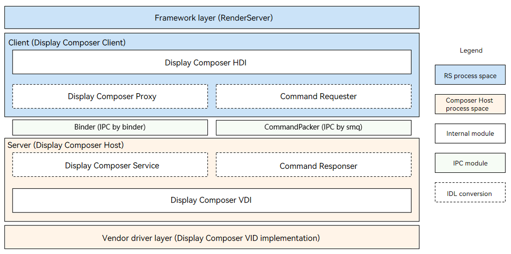
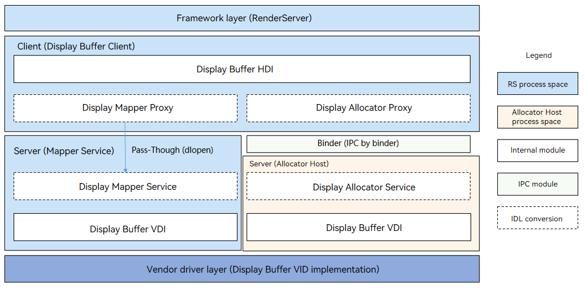

# Display VDI

## Overview
The display vendor device interface (VDI) is provided for chip vendor devices to access to the OpenHarmony display driver framework model.
The display VDI interface consists of the following:

- Composer: implements layer composition and display.
- Buffer: implements allocation and release of the surface buffer.

### Composer

**Figure 1** Display composer HDI architecture



The framework model consists of the following layers:

+ Framework layer: interacts with the HDI implementation layer to implements composition and display of layers and manages hardware devices of the display module.
+ HDI implementation layer: implements the OpenHarmony Composer HDI interface.
+ Vendor driver layer: supports multi-platform adaptation by shielding the differences between underlying chips and OSs.

### Buffer

**Figure 2** Display buffer HDI architecture



The framework model consists of the following layers:

+ Framework layer: interacts with the HDI implementation layer to implements allocation and release of graphics buffers.
+ HDI implementation layer: implements the OpenHarmony buffer HDI interface.
+ Vendor driver layer: supports multi-platform adaptation by shielding the differences between underlying chips and OSs.


## Development Guidelines

### Composer

#### Available APIs

You can obtain the VDI declaration file **/drivers/peripheral/display/composer/hdi_service/include/idisplay_composer_vdi.h** from [https://gitee.com/openharmony/drivers_peripheral/tree/master/display/composer](https://gitee.com/openharmony/drivers_peripheral/tree/master/display/composer).
- idisplay_composer_vdi.h

  | API                                                    | Description                                         |
  | ------------------------------------------------------------ | ------------------------------------------------------------ |
  | int32_t RegHotPlugCallback(HotPlugCallback cb, void* data) | Registers a callback for a hot plug event. |
  | int32_t GetDisplayCapability(uint32_t devId, DisplayCapability& info) | Obtains the capability set of a display device. |
  | int32_t GetDisplaySupportedModes(uint32_t devId, std::vector\<DisplayModeInfo\>& modes) | Obtains the supported display modes of a display device. |
  | int32_t GetDisplayMode(uint32_t devId, uint32_t& modeId) | Obtains the current display mode of a display device. |
  | int32_t SetDisplayMode(uint32_t devId, uint32_t modeId) | Sets the display mode of a display device. |
  | int32_t GetDisplayPowerStatus(uint32_t devId, DispPowerStatus& status) | Obtains the power status of a display device. |
  | int32_t SetDisplayPowerStatus(uint32_t devId, DispPowerStatus status) | Sets the power status of a display device. |
  | int32_t GetDisplayBacklight(uint32_t devId, uint32_t& level) | Obtains the backlight value of a display device. |
  | int32_t SetDisplayBacklight(uint32_t devId, uint32_t level) | Sets the backlight value for a display device. |
  | int32_t GetDisplayProperty(uint32_t devId, uint32_t id, uint64_t& value) | Obtains a property of a display device. |
  | int32_t GetDisplayCompChange(uint32_t devId, std::vector\<uint32_t\>& layers, std::vector\<int32_t\>& types) | Obtains the layer whose composition type is changed for a display device. |
  | int32_t SetDisplayClientCrop(uint32_t devId, const IRect& rect) | Sets the cropping area of a display device. |
  | int32_t SetDisplayClientBuffer(uint32_t devId, const BufferHandle& buffer, int32_t fence) | Sets the display buffer of the display device. |
  | int32_t SetDisplayClientDamage(uint32_t devId, std::vector\<IRect\>& rects) | Sets the dirty region of a display device. |
  | int32_t SetDisplayVsyncEnabled(uint32_t devId, bool enabled) | Enables the vertical sync signal. |
  | int32_t RegDisplayVBlankCallback(uint32_t devId, VBlankCallback cb, void* data) | Registers a VBlank event callback. |
  | int32_t GetDisplayReleaseFence(uint32_t devId, std::vector\<uint32_t\>& layers, std::vector\<int32_t\>& fences) | Obtains the display layer fence. |
  | int32_t CreateVirtualDisplay(uint32_t width, uint32_t height, int32_t& format, uint32_t& devId) | Creates a virtual display device. |
  | int32_t DestroyVirtualDisplay(uint32_t devId) | Destroys a virtual display device. |
  | int32_t SetVirtualDisplayBuffer(uint32_t devId, const BufferHandle& buffer, const int32_t fence) | Sets the output buffer of a virtual display. |
  | int32_t SetDisplayProperty(uint32_t devId, uint32_t id, uint64_t value) | Sets a property for a display device. |
  | int32_t Commit(uint32_t devId, int32_t& fence) | Commits a composition request. |
  | int32_t CreateLayer(uint32_t devId, const LayerInfo& layerInfo, uint32_t& layerId) | Creates a layer. |
  | int32_t DestroyLayer(uint32_t devId, uint32_t layerId) | Destroys a layer. |
  | int32_t PrepareDisplayLayers(uint32_t devId, bool& needFlushFb) | Prepares the layers to display. |
  | int32_t SetLayerAlpha(uint32_t devId, uint32_t layerId, const LayerAlpha& alpha) | Sets the alpha value of a layer. |
  | int32_t SetLayerRegion(uint32_t devId, uint32_t layerId, const IRect& rect) | Sets the region for a layer. |
  | int32_t SetLayerCrop(uint32_t devId, uint32_t layerId, const IRect& rect) | Sets the cropping area for a layer. |
  | int32_t SetLayerZorder(uint32_t devId, uint32_t layerId, uint32_t zorder) | Sets the Z-axis order for a layer. |
  | int32_t SetLayerPreMulti(uint32_t devId, uint32_t layerId, bool preMul) | Sets the premultiplication for a layer. |
  | int32_t SetLayerTransformMode(uint32_t devId, uint32_t layerId, TransformType type) | Sets the transform mode for a layer. |
  | int32_t SetLayerDirtyRegion(uint32_t devId, uint32_t layerId, const std::vector\<IRect\>& rects) | Sets the dirty region of a layer. |
  | int32_t SetLayerVisibleRegion(uint32_t devId, uint32_t layerId, std::vector\<IRect\>& rects) | Sets the visible region of a layer. |
  | int32_t SetLayerBuffer(uint32_t devId, uint32_t layerId, const BufferHandle& buffer, int32_t fence) | Sets the buffer for a layer. |
  | int32_t SetLayerCompositionType(uint32_t devId, uint32_t layerId, CompositionType type) | Sets the expected composition type for the client. |
  | int32_t SetLayerBlendType(uint32_t devId, uint32_t layerId, BlendType type) | Sets the blend type for a layer. |
  | int32_t SetLayerMaskInfo(uint32_t devId, uint32_t layerId, const MaskInfo maskInfo) | Sets the layer mask information. |
  | int32_t SetLayerColor(uint32_t devId, uint32_t layerId, const LayerColor& layerColor) | Sets the color for a layer. |

#### How to Develop
The following walks you through on how to implement the rk3568 composer VDI.

1. Implement the composer VDI APIs.

Implement the APIs defined in **idisplay_composer_vdi.h**.

```c++
  class DisplayComposerVdiImpl : public IDisplayComposerVdi {
  public:
      DisplayComposerVdiImpl();
      virtual ~DisplayComposerVdiImpl();
      virtual int32_t RegHotPlugCallback(HotPlugCallback cb, void* data) override;
      virtual int32_t GetDisplayCapability(uint32_t devId, DisplayCapability& info) override;
      virtual int32_t GetDisplaySupportedModes(uint32_t devId, std::vector<DisplayModeInfo>& modes) override;
      virtual int32_t GetDisplayMode(uint32_t devId, uint32_t& modeId) override;
      virtual int32_t SetDisplayMode(uint32_t devId, uint32_t modeId) override;
      virtual int32_t GetDisplayPowerStatus(uint32_t devId, DispPowerStatus& status) override;
      virtual int32_t SetDisplayPowerStatus(uint32_t devId, DispPowerStatus status) override;
      virtual int32_t GetDisplayBacklight(uint32_t devId, uint32_t& level) override;
      virtual int32_t SetDisplayBacklight(uint32_t devId, uint32_t level) override;
      virtual int32_t GetDisplayProperty(uint32_t devId, uint32_t id, uint64_t& value) override;
      virtual int32_t GetDisplayCompChange(uint32_t devId, std::vector<uint32_t>& layers,
          std::vector<int32_t>& types) override;
      virtual int32_t SetDisplayClientCrop(uint32_t devId, const IRect& rect) override;
      virtual int32_t SetDisplayClientBuffer(uint32_t devId, const BufferHandle& buffer, int32_t fence) override;
      virtual int32_t SetDisplayClientDamage(uint32_t devId, std::vector<IRect>& rects) override;
      virtual int32_t SetDisplayVsyncEnabled(uint32_t devId, bool enabled) override;
      virtual int32_t RegDisplayVBlankCallback(uint32_t devId, VBlankCallback cb, void* data) override;
      virtual int32_t GetDisplayReleaseFence(uint32_t devId, std::vector<uint32_t>& layers,
          std::vector<int32_t>& fences) override;
      virtual int32_t CreateVirtualDisplay(uint32_t width, uint32_t height, int32_t& format, uint32_t& devId) override;
      virtual int32_t DestroyVirtualDisplay(uint32_t devId) override;
      virtual int32_t SetVirtualDisplayBuffer(uint32_t devId, const BufferHandle& buffer, const int32_t fence) override;
      virtual int32_t SetDisplayProperty(uint32_t devId, uint32_t id, uint64_t value) override;
      virtual int32_t Commit(uint32_t devId, int32_t& fence) override;
      virtual int32_t CreateLayer(uint32_t devId, const LayerInfo& layerInfo, uint32_t& layerId) override;
      virtual int32_t DestroyLayer(uint32_t devId, uint32_t layerId) override;
      virtual int32_t PrepareDisplayLayers(uint32_t devId, bool& needFlushFb) override;
      virtual int32_t SetLayerAlpha(uint32_t devId, uint32_t layerId, const LayerAlpha& alpha) override;
      virtual int32_t SetLayerRegion(uint32_t devId, uint32_t layerId, const IRect& rect) override;
      virtual int32_t SetLayerCrop(uint32_t devId, uint32_t layerId, const IRect& rect) override;
      virtual int32_t SetLayerZorder(uint32_t devId, uint32_t layerId, uint32_t zorder) override;
      virtual int32_t SetLayerPreMulti(uint32_t devId, uint32_t layerId, bool preMul) override;
      virtual int32_t SetLayerTransformMode(uint32_t devId, uint32_t layerId, TransformType type) override;
      virtual int32_t SetLayerDirtyRegion(uint32_t devId, uint32_t layerId, const std::vector<IRect>& rects) override;
      virtual int32_t SetLayerVisibleRegion(uint32_t devId, uint32_t layerId, std::vector<IRect>& rects) override;
      virtual int32_t SetLayerBuffer(uint32_t devId, uint32_t layerId,
          const BufferHandle& buffer, int32_t fence) override;
      virtual int32_t SetLayerCompositionType(uint32_t devId, uint32_t layerId, CompositionType type) override;
      virtual int32_t SetLayerBlendType(uint32_t devId, uint32_t layerId, BlendType type) override;
      virtual int32_t SetLayerMaskInfo(uint32_t devId, uint32_t layerId, const MaskInfo maskInfo) override;
      virtual int32_t SetLayerColor(uint32_t devId, uint32_t layerId, const LayerColor& layerColor) override;
  };
  using CreateComposerVdiFunc = IDisplayComposerVdi* (*)();
  using DestroyComposerVdiFunc = void (*)(IDisplayComposerVdi* vdi);
  extern "C" IDisplayComposerVdi* CreateComposerVdi();
  extern "C" void DestroyComposerVdi(IDisplayComposerVdi* vdi);
```

2. Build a shared library.

Build a shared library named **libdisplay_composer_vdi_impl.z.so**. Write the **BUILD.gn** file. You can obtain the **BUILD.gn** file of rk3568 from [https://gitee.com/openharmony/device_soc_rockchip/blob/master/rk3568/hardware/display/BUILD.gn](https://gitee.com/openharmony/device_soc_rockchip/blob/master/rk3568/hardware/display/BUILD.gn).

```
  ohos_shared_library("libdisplay_composer_vdi_impl") {
    sources = [ "src/display_device/display_composer_vdi_impl.cpp" ]

    include_dirs = [
      "src/display_device",
      "${root_path}/drivers/peripheral/display/utils/include",
      "${root_path}/drivers/interface/display/composer",
      "${root_path}/drivers/peripheral/display/composer/hdi_service/include",
      "${root_path}/drivers/interface/display/composer/hdifd_parcelable",
    ]

    deps = [ ":display_composer_vendor" ]

    external_deps = [
      "c_utils:utils",
      "drivers_interface_display:display_composer_idl_headers",
      "graphic_chipsetsdk:buffer_handle",
      "hilog:libhilog",
      "ipc:ipc_single",
    ]

    install_enable = true
    install_images = [ chipset_base_dir ]
    subsystem_name = "hdf"
    part_name = "rockchip_products"
  }
```
In the root directory of your project, run the following command to build the share library:

```
  ./build.sh -p rk3568 -T display_composer_model
```
Then, you can find **libdisplay_composer_vdi_impl.z.so** in the **out/rk3568/hdf/rockchip_products** directory.

#### Development Example

A default VDI implementation is provided for your reference. For details, see **drivers/peripheral/display/composer/vdi_base** at [https://gitee.com/openharmony/drivers_peripheral/tree/master/display/composer/vdi_base](https://gitee.com/openharmony/drivers_peripheral/tree/master/display/composer/vdi_base).

### Buffer

#### Available APIs

You can obtain the VDI declaration file **/drivers/peripheral/display/buffer/hdi_service/include/idisplay_buffer_vdi.h** from [https://gitee.com/openharmony/drivers_peripheral/tree/master/display/buffer](https://gitee.com/openharmony/drivers_peripheral/tree/master/display/buffer).
- idisplay_composer_vdi.h

  | API                                                    | Description                                         |
  | ------------------------------------------------------------ | ------------------------------------------------------------ |
  | int32_t AllocMem(const AllocInfo& info, BufferHandle*& handle) | Allocates a buffer. |
  | void FreeMem(const BufferHandle& handle) | Releases a buffer. |
  | void* Mmap(const BufferHandle& handle) | Maps a buffer to the memory. |
  | int32_t Unmap(const BufferHandle& handle) | Unmaps a buffer. |
  | int32_t FlushCache(const BufferHandle& handle) | Flushes a buffer. |
  | int32_t InvalidateCache(const BufferHandle& handle) | Invalidates a buffer. |
  | int32_t IsSupportedAlloc(const std::vector<VerifyAllocInfo>& infos, std::vector<bool>& supporteds) | Checks whether the requested buffer can be allocated. |
  | int32_t RegisterBuffer(const BufferHandle& handle) | Registers a buffer. |
  | int32_t GetMetadata(const BufferHandle& handle, uint32_t key, std::vector<uint8_t>& value) | Obtains the metadata of a buffer. |
  | int32_t ListMetadataKeys(const BufferHandle& handle, std::vector<uint32_t>& keys) | Lists the keys of the metadata. |
  | int32_t EraseMetadataKey(const BufferHandle& handle, uint32_t key) | Erases the metadata of the specified key. |

#### How to Develop
The following walks you through on how to implement the rk3568 buffer VDI.

1. Implement the buffer VDI APIs.

   Implement the APIs defined in **idisplay_buffer_vdi.h**.

```c++
  class DisplayBufferVdiImpl : public IDisplayBufferVdi {
  public:
      DisplayBufferVdiImpl();
      virtual ~DisplayBufferVdiImpl();

      virtual int32_t AllocMem(const AllocInfo& info, BufferHandle*& handle) const override;
      virtual void FreeMem(const BufferHandle& handle) const override;
      virtual void *Mmap(const BufferHandle& handle) const override;
      virtual int32_t Unmap(const BufferHandle& handle) const override;
      virtual int32_t FlushCache(const BufferHandle& handle) const override;
      virtual int32_t InvalidateCache(const BufferHandle& handle) const override;
      virtual int32_t IsSupportedAlloc(const std::vector<VerifyAllocInfo>& infos,
          std::vector<bool>& supporteds) const override;
      virtual int32_t RegisterBuffer(const BufferHandle& handle) override;
      virtual int32_t SetMetadata(const BufferHandle& handle, uint32_t key, const std::vector<uint8_t>& value) override;
      virtual int32_t GetMetadata(const BufferHandle& handle, uint32_t key, std::vector<uint8_t>& value) override;
      virtual int32_t ListMetadataKeys(const BufferHandle& handle, std::vector<uint32_t>& keys) override;
      virtual int32_t EraseMetadataKey(const BufferHandle& handle, uint32_t key) override;
  };
  using CreateDisplayBufferVdiFunc = IDisplayBufferVdi* (*)();
  using DestroyDisplayBufferVdiFunc = void (*)(IDisplayBufferVdi* vdi);
  extern "C" IDisplayBufferVdi* CreateDisplayBufferVdi();
  extern "C" void DestroyDisplayBufferVdi(IDisplayBufferVdi* vdi);
```

2. Build a shared library.

   Build a shared library named **libdisplay_buffer_vdi_impl.z.so**. Write the **BUILD.gn** file. You can obtain the **BUILD.gn** file of rk3568 from [https://gitee.com/openharmony/device_soc_rockchip/blob/master/rk3568/hardware/display/BUILD.gn](https://gitee.com/openharmony/device_soc_rockchip/blob/master/rk3568/hardware/display/BUILD.gn).

```
  ohos_shared_library("libdisplay_buffer_vdi_impl") {
    sources = [ "src/display_gralloc/display_buffer_vdi_impl.cpp" ]

    public_configs = [ ":libdisplay_buffer_vdi_impl_config" ]

    include_dirs = [
      "./src/display_gralloc",
      "${root_path}/drivers/peripheral/base",
      "${root_path}/drivers/interface/display/composer/hdifd_parcelable",
      "${root_path}/drivers/interface/display/buffer",
      "${root_path}/drivers/peripheral/display/utils/include",
      "${root_path}/drivers/peripheral/display/buffer/hdi_service/include",
    ]

    output_name = "libdisplay_buffer_vdi_impl"
    cflags = [
      "-DGRALLOC_GBM_SUPPORT",
      "-Wno-macro-redefined",
    ]
    deps = [ ":libdisplay_buffer_vendor" ]

    external_deps = [
      "c_utils:utils",
      "drivers_interface_display:display_buffer_idl_headers",
      "drivers_interface_display:display_composer_idl_headers",
      "hdf_core:libhdf_utils",
      "hilog:libhilog",
      "ipc:ipc_single",
    ]

    install_enable = true
    install_images = [ chipset_base_dir ]
    innerapi_tags = [ "passthrough" ]
    subsystem_name = "hdf"
    part_name = "rockchip_products"
  }
```

In the root directory of your project, run the following command to build the share library:

```
  ./build.sh -p rk3568 -T display_buffer_model
```
Then, you can find **libdisplay_buffer_vdi_impl.z.so** in the **out/rk3568/hdf/rockchip_products** directory.

#### Development Example

A default VDI implementation is provided for your reference. For details, see **drivers/peripheral/display/buffer/vdi_base** at [https://gitee.com/openharmony/drivers_peripheral/tree/master/display/buffer/vdi_base](https://gitee.com/openharmony/drivers_peripheral/tree/master/display/buffer/vdi_base).
