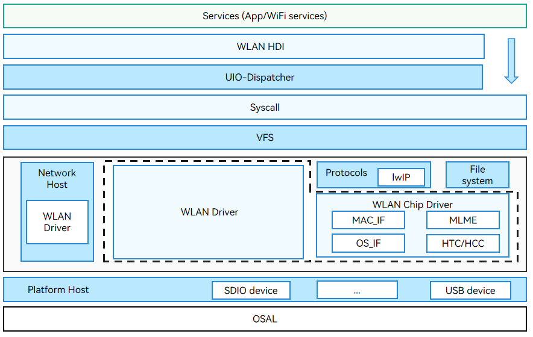
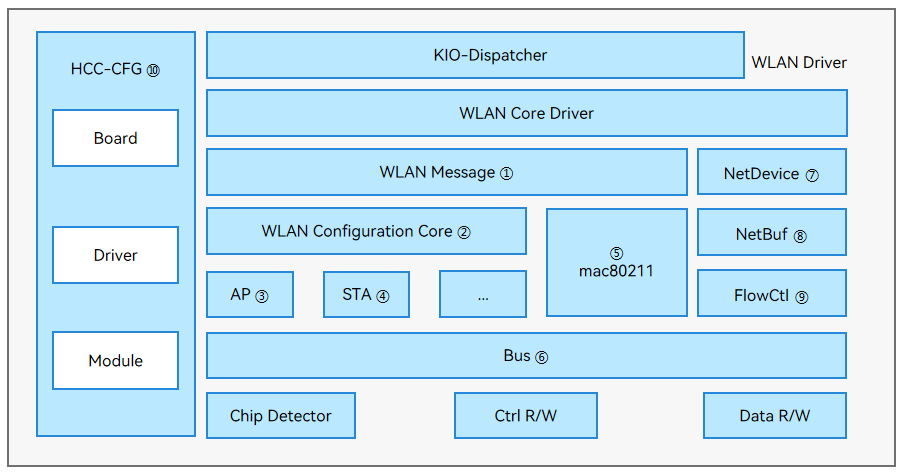
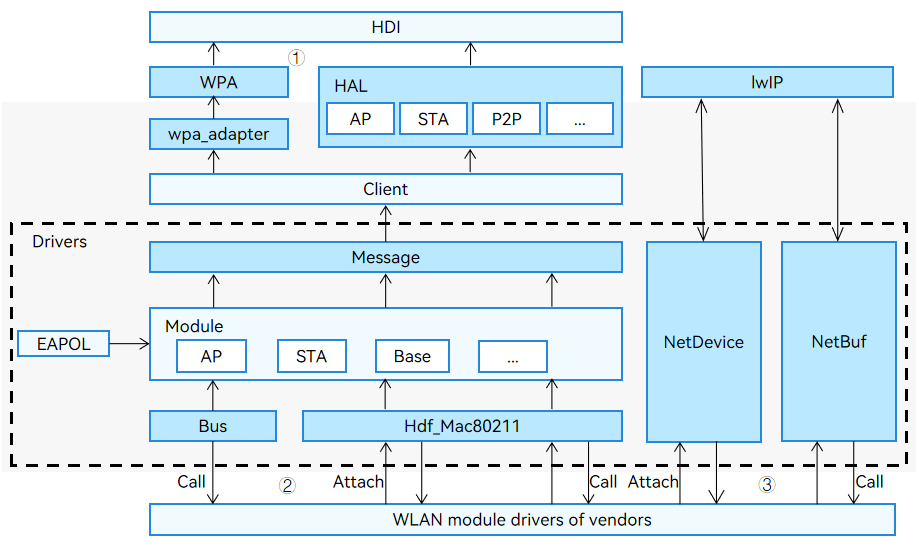

# WLAN


## Overview

### WLAN

The Wireless Local Area Network (WLAN) Driver module in OpenHarmony is developed based on the Hardware Driver Foundation (HDF). It provides cross-OS porting, self-adaptation to component differences, and module assembly and building.

### Working Principles

You can adapt your driver code based on the unified interfaces provided by the WLAN module. The WLAN module provides:

- A unified underlying interface to implement capabilities, such as setting up or closing a WLAN hotspot, scanning hotspots, and connecting to or disconnecting from a hotspot.
- A unified interface to the Hardware Device Interface (HDI) layer to implement capabilities, such as setting or obtaining the device Media Access Control (MAC) address and setting the transmit power.

The figure below shows the WLAN architecture. The WLAN Driver module implements startup loading, parses configuration files, and provides bus abstraction APIs. The WLAN Chip Driver module provides the MAC Sublayer Management Entity (MLME).

  **Figure 1** WLAN architecture

  

  The figure below shows the WLAN driver architecture.

  **Figure 2** WLAN driver architecture

  

The WLAN driver consists of the following modules:

1. WLAN Message: provides an independent interface for each service or a composite service interface for multiple dependent services. It can run in the user mode, kernel mode, and MCU to implement complete decoupling between components.

2. WLAN Configuration Core: parses WLAN configuration files.

3. Access point (AP): provides a WLAN access interface for devices.

4. Station (STA): a terminal that accesses the WLAN system.

5. mac80211: defines MAC-layer interfaces for underlying drivers.

6. Bus: provides a unified bus abstract interface for the upper layer. It shields the differences between different kernels by calling the Secure Digital Input Output (SDIO) interfaces provided by the platform layer and encapsulating the adapted USB and PCIe interfaces. It also encapsulates different types of bus operations in a unified manner to shield differences between different chipsets. The complete bus driving capabilities provided by the bus module help simplify and streamline the development of different chip vendors.

7. NetDevice: creates dedicated network devices to shield differences between OSs, provides unified interfaces for Wi-Fi drivers, unified HDF NetDevice data structure, and unified management, registration, and deregistration capabilities, and connects to the Linux network device layer on mini-, small-, standard, and large-system devices.

8. NetBuf: encapsulates the unified data structure of the Linux or LiteOS native network data buffer and the operation interfaces for network data.

9. FlowCtl: processes data based on the priority when the data volume is too large.

10. HCC-CFG: configures WLAN parameters, including the board configuration, driver configuration, and module configuration.

The relationships between the main modules are as follows:

1. The WLAN driver works with HCC-CFG and WLAN Configuration Core to parse and load configuration files.

2. The WLAN Message module distributes user-mode messages to the AP and STA by component.

3. Commands are delivered to mac80211, and then forwarded by the Bus module to the WLAN chip firmware.

4. The protocol stack works with the NetDevice, NetBuf, and FlowCtl modules to exchange data flows.

## Development Guidelines

### Available APIs

The WLAN module provides the following types of APIs:

1. Hardware Device Interface (HDI) and Hardware Abstraction Layer (HAL) APIs for upper-layer services

2. APIs for vendors

3. WLAN APIs directly called by drivers

  **Figure 3** WLAN driver APIs

  


- The WLAN module provides HAL APIs for upper-layer services (applicable to small and mini systems). **Table 2** and **Table 3** describe some APIs.

    **Table 1** wifi_hal.h

  | API| Description|
  | -------- | -------- |
  | int32_t WifiConstruct(struct IWiFi \*\*wifiInstance)| Creates an **IWiFi** instance with basic capabilities.|
  | int32_t WifiDestruct(struct IWiFi \*\*wifiInstance)| Destroys an **IWiFi** instance.|
  | int32_t (\*start)(struct IWiFi \*)| Creates a channel between the HAL and the driver and obtains the NICs supported by the driver.|
  | int32_t (\*stop)(struct IWiFi \*)| Stops the channel between the HAL and the driver.|

    **Table 2** wifi_hal_base_feature.h

  | API| Description|
  | -------- | -------- |
  | int32_t (\*getFeatureType)(const struct IWiFiBaseFeature \*)| Obtains the feature type.|
  | int32_t (\*setMacAddress)(const struct IWiFiBaseFeature \*, unsigned char \*, uint8_t)| Sets the MAC address.|
  | int32_t (\*getDeviceMacAddress)(const struct IWiFiBaseFeature \*, unsigned char \*, uint8_t)| Obtains the device MAC address.|
  | int32_t (\*setTxPower)(const struct IWiFiBaseFeature \*, int32_t)| Sets the transmit power.|

- The WLAN Driver module also provides APIs that you need to fill in the implementation. **Table 4** describes some APIs.

    **Table 3** net_device.h

  | API| Description|
  | -------- | -------- |
  | int32_t (\*init)(struct NetDevice \*netDev)| Initializes a network device.|
  | struct NetDevStats \*(\*getStats)(struct NetDevice \*netDev)| Obtains the state of a network device.|
  | int32_t (\*setMacAddr)(struct NetDevice \*netDev, void \*addr)| Sets the MAC address.|
  | void (\*deInit)(struct NetDevice \*netDev)| Deinitializes a network device.|
  | int32_t (\*open)(struct NetDevice \*netDev)| Opens a network device.|
  | int32_t (\*stop)(struct NetDevice \*netDev)| Stops a network device.|

- The WLAN Driver module provides APIs that you can directly use to create or release a **WifiModule**, connect to or disconnect from a WLAN hotspot, request or release a **NetBuf**, and convert between the **pbuf** structure of Lightweight IP (lwIP) and a **NetBuf**.

  Tables 5 to 7 describe the APIs.

    **Table 4** wifi_module.h

  | API| Description|
  | -------- | -------- |
  | struct WifiModule \*WifiModuleCreate(const struct HdfConfigWifiModuleConfig \*config)| Creates a **WifiModule**.|
  | void WifiModuleDelete(struct WifiModule \*module)| Deletes a **WifiModule** and releases its data.|
  | int32_t DelFeature(struct WifiModule \*module, uint16_t featureType)| Deletes a feature from a **WifiModule**.|
  | int32_t AddFeature(struct WifiModule \*module, uint16_t featureType, struct WifiFeature \*featureData)| Adds a feature to a **WifiModule**.|

    **Table 5** wifi_mac80211_ops.h

  | API| Description|
  | -------- | -------- |
  | int32_t (\*startAp)(NetDevice \*netDev)| Starts an AP.|
  | int32_t (\*stopAp)(NetDevice \*netDev)| Stops an AP.|
  | int32_t (\*connect)(NetDevice \*netDev, WifiConnectParams \*param)| Connects to a hotspot.|
  | int32_t (\*disconnect)(NetDevice \*netDev, uint16_t reasonCode)| Disconnects from a hotspot.|

    **Table 6** hdf_netbuf.h

  | API| Description|
  | -------- | -------- |
  | static inline void NetBufQueueInit(struct NetBufQueue \*q)| Initializes a **NetBuf** queue.|
  | struct NetBuf \*NetBufAlloc(uint32_t size)| Allocates a **NetBuf**.|
  | void NetBufFree(struct NetBuf \*nb) | Releases a **NetBuf**.|
  | struct NetBuf \*Pbuf2NetBuf(const struct NetDevice \*netdev, struct pbuf \*lwipBuf)| Converts the **pbuf** structure of lwIP to a **NetBuf**.|
  | struct pbuf \*NetBuf2Pbuf(const struct NetBuf \*nb)| Converts a **NetBuf** to the **pbuf** structure of lwIP.|

### How to Develop
#### WLAN Framework Adaptation

The WLAN driver framework developed based on the HDF and Platform framework provides a unified driver model regardless of the OS and system on a chip (SoC). When developing your WLAN driver, you need to configure data based on the WLAN driver framework.
**Development Procedure**

1. Configure hardware (such as modules and chips) parameters in the **wlan_platform.hcs** file. The HDF parses the file to generate structure objects with full configuration.

2. Implement initialization and deinitialization of the WLAN module (such as initialize and deinitialize the WLAN chip and WLAN chip driver).

3. Implement the delivery of control flow commands.

4. Implement event reporting.

**Development Example**

The following uses the Hi3881 WLAN chip as an example to describe how to initialize a WLAN module.

1. Configure the HDF configuration source (HCS) for the driver.

   The HCS includes device configuration and component configuration.

   - Device configuration

     The configuration file contains the power supply, reset, and bus configuration.

     Configuration file path: **vendor/<vendor name>/<device name >/hdf_config/khdf/wifi**

     Configure device parameters in **wlan_platform.hcs** based on the device you use. The following is an example of WLAN platform configuration.
        ```text
        hisi :& deviceList {
            device0 :: deviceInst {
                deviceInstId = 0;
                powers {
                    power0 {
                        powerSeqDelay = 0;  /* Power sequence delay. */
                        powerType = 1;      /* Power supply type. The value 0 indicates that the device is always on. The value 1 indicates power supply through GPIO. */
                        gpioId = 1;         /* GPIO pin number. */
                        activeLevel=1;      /* Active level. The value 0 indicates low level, and 1 indicates high level. */
                    }
                    power1 {
                        powerSeqDelay = 0;  /* Power sequence delay. */
                        powerType = 0;      /* Power supply type. The value 0 indicates that the device is always on. The value 1 indicates power supply through GPIO. */
                    }
                }
                reset {
                    resetType = 0;         /* Reset type. The value 0 indicates that reset is dynamically determined, and 1 indicates reset through GPIO. */
                    gpioId = 2;           /* GPIO pin number. */
                    activeLevel=1;        /* Active level. The value 0 indicates low level, and 1 indicates high level. */
                    resetHoldTime = 30;   /* Hold time (ms) after a reset. */
                }
                bootUpTimeout = 30;       /* Boot timeout duration (ms). */
                bus {
                    busEnable = 1;        /* Whether to initialize the bus. The value 1 means to initialize the bus; the value 0 means the opposite. */
                    busType = 0;         /* Bus type. The value 0 indicates SDIO. */
                    busId = 2;           /* Bus number. */
                    funcNum = [1];       /* SDIO function number. */
                    timeout = 1000;      /* Timeout duration for data read/write. */
                    blockSize = 512;     /* Size of the data block to read or write. */
                }
            }
        }
        ```
   - Component configuration

     Add a configuration file **wlan_chip_.hcs** for each chip, for example, **wlan_chip_hi3881.hcs**, and configure related parameters. The following is a configuration example of hi3881.
        ```text
        root {
            wlan_config {
                hi3881 :& chipList {
                    chipHi3881 :: chipInst {
                        match_attr = "hdf_wlan_chips_hi3881"; /* Attribute used to match the chip. */
                        chipName = "hi3881";                  /* WLAN chip name. */
                        bus {
                            vendorId = 0x0296;                /* Vendor ID. */
                            deviceId = [0x5347];              /* Device ID. */
                        }
                    }
                }
            }
        }
        ```

2. Hook the **init** and **deinit** functions of the WLAN chip and WLAN chip driver.
   - Implementing the driver adaptation entry function

     Define a variable of the HdfDriverEntry type based on the chip to hook functions of **Bind()**, **Init()**, and **Release()**. Call **HDF_INIT** to register the driver entry with the HDF. During driver loading, the HDF calls the **Bind** function and then the **Init** function to load the driver. If **Init()** fails to be called, the HDF calls **Release()** to release driver resources.
     ```c
     struct HdfDriverEntry g_hdfHisiChipEntry = {
        .moduleVersion = 1,
        .Bind = HdfWlanHisiDriverBind,
        .Init = HdfWlanHisiChipDriverInit,
        .Release = HdfWlanHisiChipRelease,
        .moduleName = "HDF_WLAN_CHIPS"
     };

     HDF_INIT(g_hdfHisiChipEntry);
     ```

   - Registering the functions for initializing the chip and chip driver
     
     Hook the chip initialization function to **InitChip()** and the chip deinitialization function to **DeinitChip()**.

     Hook the chip driver initialization function to **Build()** and the chip driver deinitialization function to **Release()**.

     ```c
     /* Register WLAN chip functions. */
     static int32_t HDFWlanRegHisiDriverFactory(void)
     {
         static struct HdfChipDriverFactory tmpFactory = { 0 };
         struct HdfChipDriverManager *driverMgr = NULL;
         driverMgr = HdfWlanGetChipDriverMgr();
         if (driverMgr == NULL) {
             HDF_LOGE("%s fail: driverMgr is NULL!", __func__);
             return HDF_FAILURE;
         }
         tmpFactory.driverName = HI3881_DRIVER_NAME;
         tmpFactory.GetMaxIFCount = GetHi3881GetMaxIFCount;
         tmpFactory.InitChip = InitHi3881Chip;
         tmpFactory.DeinitChip = DeinitHi3881Chip;
         tmpFactory.Build = BuildHi3881Driver;
         tmpFactory.Release = ReleaseHi3881Driver;
         tmpFactory.ReleaseFactory = NULL;
         if (driverMgr->RegChipDriver(&tmpFactory) != HDF_SUCCESS) {
             HDF_LOGE("%s fail: driverMgr is NULL!", __func__);
             return HDF_FAILURE;
         }

         return HDF_SUCCESS;
     }

     static int32_t HdfWlanHisiChipDriverInit(struct HdfDeviceObject *device)
     {
         (void)device;
         return HDFWlanRegHisiDriverFactory();
     }
     ```

   - Initializing and deinitializing the chip
     ```c
     /* Function for initializing the WLAN chip. */
     int32_t InitHi3881Chip(struct HdfWlanDevice *device)
     {
         uint8_t maxPortCount = 3;
         int32_t ret = HI_SUCCESS;
         uint8_t maxRetryCount = 3;
         if (device == NULL || device->bus == NULL) {
             HDF_LOGE("%s:NULL ptr!", __func__);
             return HI_FAIL;
         }

         do {
             if (ret != HI_SUCCESS) {
                 if (device->reset != NULL && device->reset->Reset != NULL) {
                     device->reset->Reset(device->reset);
                 }
                 HDF_LOGE("%s:Retry init hi3881!last ret=%d", __func__, ret);
             }
             ret = hi_wifi_init(maxPortCount, device->bus);
         } while (ret != 0 && --maxRetryCount > 0);

         if (ret != 0) {
             HDF_LOGE("%s:Init hi3881 driver failed!", __func__);
             return ret;
         }
         return HI_SUCCESS;
     }

     /* Function for deinitializing the WLAN chip. */
     int32_t DeinitHi3881Chip(struct HdfWlanDevice *device)
     {
         (void)device;
         int32_t ret = hi_wifi_deinit();
         if (ret != 0) {
             HDF_LOGE("%s:Deinit failed!ret=%d", __func__, ret);
         }
         return ret;
     }
     ```
   - Initializing and deinitializing the chip driver
     ```c
     /* Hook the functions of the WLAN chip driver, mac80211, and chip. */
     static struct HdfChipDriver *BuildHi3881Driver(struct HdfWlanDevice *device, uint8_t ifIndex)
     {
         struct HdfChipDriver *specificDriver = NULL;
         if (device == NULL) {
             HDF_LOGE("%s fail: channel is NULL!", __func__);
             return NULL;
         }
         (void)ifIndex;
         specificDriver = (struct HdfChipDriver *)OsalMemCalloc(sizeof(struct HdfChipDriver));
         if (specificDriver == NULL) {
             HDF_LOGE("%s fail: OsalMemCalloc fail!", __func__);
             return NULL;
         }
         if (memset_s(specificDriver, sizeof(struct HdfChipDriver), 0, sizeof(struct HdfChipDriver)) != EOK) {
             HDF_LOGE("%s fail: memset_s fail!", __func__);
             OsalMemFree(specificDriver);
             return NULL;
         }

         if (strcpy_s(specificDriver->name, MAX_WIFI_COMPONENT_NAME_LEN, HI3881_DRIVER_NAME) != EOK) {
             HDF_LOGE("%s fail: strcpy_s fail!", __func__);
             OsalMemFree(specificDriver);
             return NULL;
         }
         specificDriver->init = Hi3881Init;
         specificDriver->deinit = Hi3881Deinit;

         HiMac80211Init(specificDriver);

         return specificDriver;
     }

     /* Release the WLAN chip driver. */
     static void ReleaseHi3881Driver(struct HdfChipDriver *chipDriver)
     {
         if (chipDriver == NULL) {
             return;
         }
         if (strcmp(chipDriver->name, HI3881_DRIVER_NAME) != 0) {
             HDF_LOGE("%s:Not my driver!", __func__);
             return;
         }
         OsalMemFree(chipDriver);
     }

     /* Function for initializing the WLAN chip driver. */
     int32_t Hi3881Init(struct HdfChipDriver *chipDriver, struct NetDevice *netDevice)
     {
         hi_u16 mode;
         int32_t ret;
         nl80211_iftype_uint8 type;
         (void)chipDriver;
         HDF_LOGI("%s: start...", __func__);
         mode = wal_get_vap_mode();
         if (mode >= WAL_WIFI_MODE_BUTT) {
             oam_error_log1(0, 0, "wal_init_drv_netdev:: invalid mode[%d]", mode);
             return HI_FAIL;
         }
         if (mode == WAL_WIFI_MODE_STA) {
             type = NL80211_IFTYPE_STATION;
     #ifdef _PRE_WLAN_FEATURE_P2P
             if (InitNetdev(netDevice, NL80211_IFTYPE_P2P_DEVICE) != HI_SUCCESS) {
                 return HI_FAIL;
             }
     #endif
         } else if (mode == WAL_WIFI_MODE_AP) {
             type = NL80211_IFTYPE_AP;
         } else {
             oam_error_log1(0, 0, "wal_init_drv_netdev:: invalid mode[%d]", mode);
             return HI_FAIL;
         }
         ret = wal_init_drv_wlan_netdev(type, WAL_PHY_MODE_11N, netDevice);
         if (ret != HI_SUCCESS) {
             oam_error_log2(0, OAM_SF_ANY, "wal_init_drv_netdev %s failed.l_return:%d\n", netDevice->name, ret);
         }
         return ret;
     }

     /* Function for deinitializing the WLAN chip driver. */
     int32_t Hi3881Deinit(struct HdfChipDriver *chipDriver, struct NetDevice *netDevice)
     {
         int32_t ret;
         (void)chipDriver;
         ret = DeinitNetdev(NL80211_IFTYPE_P2P_DEVICE);
         if (ret != HI_SUCCESS) {
             oam_error_log1(0, OAM_SF_ANY, "Hi3881Deinit: DeinitNetdev p2p device fail, ret = %d\n",  ret);
             return ret;
         }
         return wal_deinit_drv_wlan_netdev(netDevice);
     }

     ```

     During the chip initialization process, call **NetDeviceInit()** to initialize a network device, call **NetDeviceAdd()** to add the network device to a protocol stack, and hook function pointers of **netdev**.

     ```c
     hi_s32 wal_init_drv_wlan_netdev(nl80211_iftype_uint8 type, wal_phy_mode mode, oal_net_device_stru *netdev)
     {
         hi_char *ac_mode_str = NULL;
         hi_s32 ret;
         if (oal_unlikely(netdev == HI_NULL)) {
             oam_error_log0(0, OAM_SF_ANY, "{netdev is null!}");
             return HI_ERR_CODE_PTR_NULL;
         }

         do {
             /* Initialize the network device. */
             ret = wal_init_netdev(type, netdev);
             if (ret != HI_SUCCESS) {
                 break;
             }

             ret = wal_init_netif(type, netdev);
             if (ret != HI_SUCCESS) {
                 break;
             }
             ac_mode_str = "11bgn";
             if (mode == WAL_PHY_MODE_11G) {
                 ac_mode_str = "11bg";
             } else if (mode == WAL_PHY_MODE_11B) {
                 ac_mode_str = "11b";
             }

             ret = wal_ioctl_set_mode(netdev, ac_mode_str);
         } while (false);

         if (ret != HI_SUCCESS) {
             wal_deinit_wlan_vap(netdev);
             oal_net_unregister_netdev(netdev);
             oal_net_clear_netdev(netdev);
             return HI_FAIL;
         }

         return HI_SUCCESS;
     }

     /* Hook function pointers of netdev. For details, see NetDeviceInterFace. */
     oal_net_device_ops_stru g_wal_net_dev_ops =
     {
        .getStats          = wal_netdev_get_stats,
        .open               = wal_netdev_open,
        .stop               = wal_netdev_stop,
        .xmit         = hmac_bridge_vap_xmit,
        .ioctl           = wal_net_device_ioctl,
        .changeMtu         = oal_net_device_change_mtu,
        .init              = oal_net_device_init,
        .deInit            = oal_net_free_netdev,
    
        ...

     };

     hi_s32 wal_init_netif(nl80211_iftype_uint8 type, oal_net_device_stru *netdev, const oal_wireless_dev *wdev)
     {
         /* Add the network device to the protocol stack. */
         hi_u32 ret = NetDeviceAdd(netdev, (Protocol80211IfType)type);

         ...

         return HI_SUCCESS;
     }
     ```

3. Bind the commands to be delivered, including setting the MAC address and transmit power, implement STA connection and scan, start APs, and setting the country code.

    ```c
    /* Implement the basic capabilities of the MAC layer. */
    static struct HdfMac80211BaseOps g_baseOps = {
        .SetMode = WalSetMode,
        .AddKey = WalAddKey,
        .DelKey = WalDelKey,
        .SetDefaultKey = WalSetDefaultKey,
        .GetDeviceMacAddr = WalGetDeviceMacAddr,
        .SetMacAddr = WalSetMacAddr,
        .SetTxPower = WalSetTxPower,
        .GetValidFreqsWithBand = WalGetValidFreqsWithBand,
        .GetHwCapability = WalGetHwCapability
    };

    /* Implement the STA capabilities of the MAC layer. */
    static struct HdfMac80211STAOps g_staOps = {
        .Connect = WalConnect,
        .Disconnect = WalDisconnect,
        .StartScan = WalStartScan,
        .AbortScan = WalAbortScan,
        .SetScanningMacAddress = WalSetScanningMacAddress,
    };

    /* Implement the AP capabilities of the MAC layer. */
    static struct HdfMac80211APOps g_apOps = {
        .ConfigAp = WalConfigAp,
        .StartAp = WalStartAp,
        .StopAp = WalStopAp,
        .ConfigBeacon = WalChangeBeacon,
        .DelStation = WalDelStation,
        .SetCountryCode = WalSetCountryCode,
        .GetAssociatedStasCount = WalGetAssociatedStasCount,
        .GetAssociatedStasInfo = WalGetAssociatedStasInfo
    };

    static struct HdfMac80211P2POps g_p2pOps = {
        .RemainOnChannel = WalRemainOnChannel,
        .CancelRemainOnChannel = WalCancelRemainOnChannel,
        .ProbeReqReport = WalProbeReqReport,
        .AddIf = WalAddIf,
        .RemoveIf = WalRemoveIf,
        .SetApWpsP2pIe = WalSetApWpsP2pIe,
        .GetDriverFlag = WalGetDriverFlag
    };

    /* Initialize mac80211 and hook functions of the chip. */
    void HiMac80211Init(struct HdfChipDriver *chipDriver)
    {
        if (chipDriver == NULL) {
            HDF_LOGE("%s:input is NULL!", __func__);
            return;
        }
        chipDriver->ops = &g_baseOps;
        chipDriver->staOps = &g_staOps;
        chipDriver->apOps = &g_apOps;
        chipDriver->p2pOps = &g_p2pOps;
    }
    ```

4. Invoke the event reporting APIs. 

    The WLAN framework provides the event reporting APIs. For details, see **hdf_wifi_event.c**. 

    For example, call **HdfWiFiEventNewSta AP** to report information about the newly associated STA.

    ```c
    hi_u32 oal_cfg80211_new_sta(oal_net_device_stru *net_device, const hi_u8 *mac_addr, hi_u8 addr_len,
        oal_station_info_stru *station_info, oal_gfp_enum_uint8 en_gfp)
    {
    #if (_PRE_OS_VERSION_LINUX == _PRE_OS_VERSION) && !defined(_PRE_HDF_LINUX)
        cfg80211_new_sta(net_device, mac_addr, station_info, en_gfp);
        hi_unref_param(addr_len);
    #elif (_PRE_OS_VERSION_LITEOS == _PRE_OS_VERSION) || defined(_PRE_HDF_LINUX)
        struct StationInfo info = { 0 };
        info.assocReqIes = station_info->assoc_req_ies;
        info.assocReqIesLen = station_info->assoc_req_ies_len;
        HdfWifiEventNewSta(net_device, mac_addr, WLAN_MAC_ADDR_LEN, &info);
        hi_unref_param(en_gfp);
        hi_unref_param(addr_len);
    #endif
    
        return HI_SUCCESS;
    }
    ```
    

**Verification**

Develop test cases in the WLAN module unit test to verify the basic features of the WLAN module. The following uses Hi3516D V300 standard system as an example.

1. Set up the test environment.

   - Create a **hostapd.conf** file (used to start the AP) and copy the following content to the file:

        ```text
        interface=wlan0
        driver=hdf wifi
        ctrl_interface=udp
        #Wi-Fi name
        ssid=test
        hw_mode=g
        channel=1
        ignore_broadcast_ssid=0
        wpa=2
        rsn_pairwise=CCMP
        # Wi-Fi password.
        wpa_passphrase=12345678
        ```

    - Create a **wpa_supplicant.conf** file (used to start the STA) and copy the following content to the file:

        ```text
        country=GB

        network={
            #Hotspot name
            ssid="test"
            #Hotspot password
            psk="12345678" 
        }
        ```

    - Create a **dhcpc.sh** file (used to write the IP address allocated by the udhcpc to the device) and copy the following content to the file:

        ```shell
        #!/system/bin/sh
        [ -z "$1" ] && echo "Error: should be called from udhcpc" && exit 1

        RESOLV_CONF="/etc/resolv.conf"
        [ -n "$broadcast" ] && BROADCAST="broadcast $broadcast"
        [ -n "$subnet" ] && NETMASK="netmask $subnet"

        case "$1" in
            deconfig)
            /system/bin/ifconfig $interface 0.0.0.0
            ;;

            renew|bound)
            /system/bin/ifconfig $interface $ip $BROADCAST $NETMASK

            if [ -n "$router" ] ; then
                echo "deleting routers"
                while busybox route del default gw 0.0.0.0 dev $interface ; do
                :
                done

                for i in $router ; do
                busybox route add default gw $i dev $interface
                done
            fi

            echo -n > $RESOLV_CONF
            [ -n "$domain" ] && echo search $domain >> $RESOLV_CONF
            for i in $dns ; do
                echo adding dns $i
                echo nameserver $i >> $RESOLV_CONF
            done
            ;;
        esac

        exit 0
        ```

    -  Create a **udhcpd.conf** file (used to start the **udhcpd**) and copy the following content to the file. In the following, **opt dns** *x.x.x.x* *x.x.x.x* indicates two DNS servers configured. You can configure DNS servers as required.

        ```text
        start 192.168.12.2
        end 192.168.12.100
        interface wlan0 #default: eth0
        max_leases 20 #default: 254
        remaining yes #default: yes
        auto_time 7200 #default: 7200 (2 hours)
        decline_time 3600 #default: 3600 (1 hour)
        conflict_time 3600 #default: 3600 (1 hour)
        offer_time 60 #default: 60 (1 minute)
        min_lease 60 #defult: 60
        lease_file /vendor/etc/udhcpd.leases
        opt dns x.x.x.x x.x.x.x
        option subnet 255.255.255.0
        opt router 192.168.12.1
        ```

    - Run the following commands to push the files required for the test to the development board:

        ```shell
        hdc shell "mount -o rw,remount /"
        timeout /T 1
        hdc file send dhcpc.sh /system/lib/
        hdc shell "chmod 777 /system/lib/dhcpc.sh"
        hdc file send wpa_supplicant.conf /
        hdc shell "mount -o rw,remount /vendor"
        hdc file send hostapd.conf /
        hdc file send udhcpd.conf /vendor/etc
        hdc shell "touch /vendor/etc/udhcpd.leases"
        hdc shell "chmod 777 /vendor/etc/udhcpd.leases"
        ```

2. Verify basic Wi-Fi features.

   - Verify basic AP features.

     1. Start the AP on the development board and enable Wi-Fi on the test terminal. For example, choose **Settings** > **WLAN** and turn on Wi-Fi on a mobile phone.

     2. Run the following command in the **cmd** window:
        ```shell
        hdc shell
        hostapd ./hostapd.conf
        ```

     3. Run the following commands in another **cmd** window:

        ```shell
        hdc shell
        ifconfig wlan0 192.168.12.1 netmask 255.255.255.0
        busybox udhcpd /vendor/etc/udhcpd.conf
        ```

     4. On the mobile phone, select the network named **test** in the available Wi-Fi list and enter the password. 

        The network name and password are configured in the **hostapd.conf** file. You can see that network name in the connected Wi-Fi list if the connection is successful.

     5. Ping the test terminal from the development board.
   
        ```shell
        busybox ping xxx.xxx.xxx.xxx
        ```

        In the command, xxx.xxx.xxx.xxx indicates the IP address of the test terminal. If the test terminal can be pinged, the WLAN driver provides basic features normally.

        

   - Verify basic STA features.

     1. Start the STA on the development board, and enable the hotspot on the test terminal. 
   
        The hotspot name and password are configured in the **hostapd.conf** file. The hotspot name is **test**, and the password is **12345678**.
   
     2. Run the following command in the **cmd** window:
     
        ```shell
        hdc shell
        wpa_supplicant -i wlan0 -d -c wpa_supplicant.conf
        ```
   
        
     
     3. Run the following commands in another **cmd** window:
     
        ```shell
        hdc shell
        mount -o rw,remount /
        mount -o rw,remount /vendor
        busybox udhcpc -i wlan0 -s system/lib/dhcpc.sh
        ```
     
        The IP addresses of the board and test terminal are displayed if the command is successful.
     
     4. Ping the test terminal from the development board.
     
        ```shell
        busybox ping xxx.xxx.xxx.xxx
        ```
     
        In the command, *xxx.xxx.xxx.xxx* indicates the IP address of the test terminal. If the test terminal can be pinged, the WLAN driver provides basic features normally.  
     

#### **API Invocation**
The WLAN driver module provides two types of capability interfaces for the upper layer: HDI interface and HAL interface.
- HDI API invocation

   The following uses **GetSupportFeature** as an example to describe the development procedure:

   1. Call **WlanInterfaceGetInstance()** to obtain a WLAN service instance.

   2. Call **Start()** to create a channel between the HAL and the driver and obtain information about the driver network interface card (NIC).

   3. Call **GetSupportFeature()** to obtain the WLAN features supported by the device.

   4. Call **Stop()** to destroy the channel between the HAL and the driver

   5. Call **WlanInterfaceRelease()** to destroy the WLAN service instance.

   The sample code is as follows:
   ```c
   #include "v1_0/iwlan_interface.h"
   #include "wlan_callback_impl.h"
   #include "wlan_impl.h"
   
   #define PROTOCOL_80211_IFTYPE_NUM 11
   #define HDF_SUCCESS 0
   #define HDF_FAILURE (-1)

   static int32_t hdi_main()
   {
       int32_t rc;
       const char *WLAN_SERVICE_NAME = "wlan_hal_c_service";
       static struct IWlanInterface *g_wlanObj = NULL;
       uint8_t supType[PROTOCOL_80211_IFTYPE_NUM + 1] = {0};
       uint32_t supTypeLen = PROTOCOL_80211_IFTYPE_NUM + 1;
   
        /* Obtain the WLAN service instance. */
        g_wlanObj = WlanInterfaceGetInstance(WLAN_SERVICE_NAME);
        if (g_wlanObj == NULL)
        {
            return HDF_FAILURE;
        }
   
        /* Create a channel between the HAL and the driver and obtain the driver NIC information. */
        rc = g_wlanObj->Start(g_wlanObj);
        if (rc != HDF_SUCCESS)
        {
            return HDF_FAILURE;
        }
   
        /* Obtain the WLAN features supported by the device irrespective of the device status (AP, STA, or P2P).
        rc = g_wlanObj->GetSupportFeature(g_wlanObj, supType, &supTypeLen);
        if (rc != HDF_SUCCESS)
        {
            return HDF_FAILURE;
        }
   
        /* Destroy the channel between the HAL and the driver. */
        rc = g_wlanObj->Stop(g_wlanObj);
        if (rc != HDF_SUCCESS)
        {
            return HDF_FAILURE;
        }
   
        /* Destroy the WLAN service instance. */
        rc = WlanInterfaceRelease(g_wlanObj);
        if (rc != HDF_SUCCESS)
        {
            return HDF_FAILURE;
        }
        return rc;
    }
   
   ```
   
   Building:

   1. Add the dependent library file to the build script.
      
      ```text
      deps = [
        "//drivers/peripheral/wlan/hdi_service:hdi_wlan_service",
      ]
      ```
   2. Add the dependent header files to the build script.
      ```text
      include_dirs = [
        "//drivers/peripheral/wlan/interfaces/include",
        "//drivers/peripheral/wlan/hdi_service",
        "//drivers/peripheral/wlan/client/include",
        "//drivers/peripheral/wlan/hal/include",
      ]
      ```
   3. Run the build script and check whether the build is successful.

- HAL API invocation

   To test a specified interface of the HAL module, perform the following steps:

   1. Call **WifiConstruct()** to create an **IWiFi** instance.

   2. Use the created **IWiFi** instance to call **start()** to create a channel between the HAL and the driver and obtain the driver NIC information.

   3. Call **createFeature()** to create an **apFeature** or **staFeature**. These features can be used to invoke specific APIs. The following uses the **apFeature** instance as an example.

   4. Call related APIs, for example, call **setMacAddress()** to set the MAC address and call **getDeviceMacAddress()** to obtain the device MAC address.

   5. Call **destroyFeature()** to destroy the **apFeature** instance.

   6. Call **Stop()** to destroy the channel between the HAL and the driver.

   7. Call **WifiDestruct()** to destroy the **IWiFi** instance.

   The sample code is as follows:

   ```c
    #include "wifi_hal.h"
    #include "wifi_hal_sta_feature.h"
    #include "wifi_hal_ap_feature.h"
    #include "wifi_hal_cmd.h"
   
    #define MAC_LEN 6
    #define HDF_SUCCESS 0
    #define HDF_FAILURE (-1)

    static int32_t hal_main()
    {
        int32_t ret;
        struct IWiFi *wifi;
        struct IWiFiAp *apFeature;
    
        /* Create an IWiFi instance. */
        ret = WifiConstruct(&wifi);
        if (ret != HDF_SUCCESS || wifi == NULL) {
            return HDF_FAILURE;
        }

        /* Create a channel between the HAL and the driver and obtain the driver NIC information. */
        ret = wifi->start(wifi);
        if (ret != HDF_SUCCESS) {
            return HDF_FAILURE;
        }

        /* Create an apFeature instance. */
        ret = wifi->createFeature(PROTOCOL_80211_IFTYPE_AP, (struct IWiFiBaseFeature **)&apFeature);
        if (ret != HDF_SUCCESS) {
            return HDF_FAILURE;
        }

        /* Obtain the MAC address of the device. */
        unsigned char mac[MAC_LEN] = {0};
        ret = apFeature->baseFeature.getDeviceMacAddress((struct IWiFiBaseFeature *)apFeature, mac, MAC_LEN);
        if (ret != HDF_SUCCESS) {
            return HDF_FAILURE;
        }

        /* Destroy the apFeature instance. */
        ret = wifi->destroyFeature((struct IWiFiBaseFeature *)apFeature);
        if (ret != HDF_SUCCESS) {
            return HDF_FAILURE;
        }

        /* Destroy the channel between the HAL and the driver. */
        ret = wifi->stop(wifi);
        if (ret != HDF_SUCCESS) {
            return HDF_FAILURE;
        }

        /* Destroy the IWiFi instance. */
        ret = WifiDestruct(&wifi);
        if (ret != HDF_SUCCESS) {
            return HDF_FAILURE;
        }
        return ret;
    }
   ```
   Building:
   1. Add the dependent library file to the build script.
          
      ```text
      deps = [
        "//drivers/peripheral/wlan/client:wifi_driver_client",
        "//drivers/peripheral/wlan/hal:wifi_hal",
      ]
      ```

   2. Add the dependent header files to the build script.
      ```text
      include_dirs = [
        "//drivers/peripheral/wlan/interfaces/include",
        "//drivers/peripheral/wlan/hdi_service",
        "//drivers/peripheral/wlan/client/include",
        "//drivers/peripheral/wlan/hal/include",
      ]
      ```
   3. Run the build script and check whether the build is successful.
      
   


## Reference

- Code repositories:

  **[drivers\_hdf\_core](https://gitee.com/openharmony/drivers_hdf_core)**

  [drivers\_peripheral](https://gitee.com/openharmony/drivers_peripheral)

  [drivers\_interface](https://gitee.com/openharmony/drivers_interface)

- Code paths:

  - Adaptation of WLAN FlowCtl component on LiteOS: **//drivers/hdf_core/adapter/khdf/liteos/model/network/wifi**
  - Adaptation of HDF network model on LiteOS: **//drivers/hdf_core/adapter/khdf/liteos/model/network**
  
  - Adaptation of WLAN FlowCtl component on Linux, build of the HDF WLAN model, and build of the vendor's WLAN driver: **//drivers/hdf_core/adapter/khdf/linux/model/network/wifi**
  - Core code for implementing the WLAN module: **//drivers/hdf_core/framework/model/network/wifi**
  - External APIs of the WLAN module: **//drivers/hdf_core/framework/include/wifi**
  - HDF network model APIs: **//drivers/hdf_core/framework/include/net**
  - WLAN HDI server implementation: **//drivers/peripheral/wlan**
  
  
  
  
  
  
  

