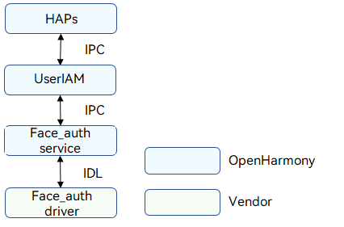
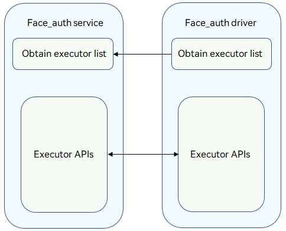

# Facial Authentication

## Overview

### Function

Facial authentication provides user authentication capabilities in identity authentication scenarios, such as device unlocking, payment, and app logins. It uses biometric recognition technologies to identify individuals based on facial characteristics. A camera is used to collect images or video streams that contain human faces, and automatically detect, track, and recognize human faces. Facial authentication is also called facial recognition. The figure below shows the architecture of facial authentication.

The face authentication (Face_auth) driver is developed based on the Hardware Driver Foundation (HDF). It shields hardware differences and provides stable facial authentication capabilities for the user authentication framework (User_auth) and Face_auth service. The facial authentication capabilities include obtaining facial recognition executor list, executor information, and template information by template ID, comparing face image template information of the executor and that of User_auth, enrolling or deleting face images, and performing facial authentication.

**Figure 1** Facial authentication architecture



### Basic Concepts

The identity authentication consists of User_auth and basic authentication services (including PIN authentication and facial authentication). It supports basic functions such as setting and deleting user credentials and performing authentication. The system supports user identity authentication and data collection, processing, storage, and comparison.
- Executor

  The executor collects, processes, stores, and compares data for authentication. Each authentication service provides the executor capabilities, which are scheduled by User_auth to implement basic capabilities.

- Executor security level

  Security level of the runtime environment when an executor provides capabilities.

- Executor role

  - Executor: independently completes the entire process of credential registration and identity authentication. The executor can collect, process, store, and compare data to complete the authentication.

  - Collector: only collects data during user authentication. It needs to work with the authenticator to complete user authentication.

  - Authenticator: only processes data, obtains the stored credential template, and compares it with the authentication information generated.

- Executor type

  The authentication algorithm varies depending on the authentication mode and device used. Different executor types are defined based on the supported algorithm type or the device in use.

- User_auth public key & executor public key

  To ensure user data security and authentication result accuracy, measures must be taken to protect the integrity of the key information exchanged between User_auth and basic authentication services. Public keys must be exchanged when the executor provided by a basic authentication service interworks with User_auth.

    The executor uses the User_auth public key to verify scheduling instructions.

    User_auth uses the executor public key to verify the authentication result accuracy and the integrity of the information exchanged with the executor.

- Authentication credential template

  Authentication credentials are generated and stored by the authentication service when users set authentication credentials. Each template has an ID to index a set of template information files. The template information needs to be compared with the authentication data generated during authentication to complete identity authentication.

- Data verification by the executor

  User_auth manages the mappings between user identities and credential IDs in a unified manner. When connecting to User_auth, the executor obtains the template ID list from User_auth and updates its template ID list based on the template ID list obtained.

- HAPs

  In a broad sense, Harmony Ability Packages (HAPs) are application packages that can be installed on OpenHarmony. In this document, the HAPs only refer to the upper-layer applications of the Face_auth driver.

- IDL interface

  An Interface Definition Language (IDL) is a language that lets a program or object written in one language communicate with another program written in an unknown language. An IDL compiler generates client stub files and server framework files. This document describes how to use the client and server generated by the IDL interface to implement communication between the Face_auth service and driver. For details, see [IDL](https://gitee.com/openharmony/ability_idl_tool/blob/master/README.md).

- IPC

  Inter-process communication (IPC) implements data exchange between two processes. For details, see [IPC](https://gitee.com/openharmony/communication_ipc/blob/master/README.md).

- HDI

  The hardware device interface (HDI) is located between the basic system service layer and the device driver layer. It provides APIs for abstracting hardware device functions, which shields underlying hardware device differences for system services. For details, see [HDI Specifications](../../design/hdi-design-specifications.md).

### Working Principles

The Face_auth driver provides basic facial authentication capabilities for the User_auth and Face_auth service to ensure successful facial authentication.
You can develop drivers to call Hardware Device Interface (HDI) APIs based on the HDF and the chip you use.

**Figure 2** Face_auth service and Face_auth driver interaction



### Constraints

- To implement facial authentication, the device must have a camera and the face image must be greater than 100 x 100 pixels.
- A Trusted Execution Environment (TEE) must be available, and facial feature information must be encrypted and stored in a TEE.
- The face matching accuracy varies with people with similar looks and children whose facial features keep changing. If you are concerned about this, consider using other authentication modes.

## Development Guidelines

### When to Use

The Face_auth driver provides basic facial authentication capabilities for the User_auth and Face_auth service to ensure successful facial authentication.

### Available APIs

The following table describes the C++ APIs generated from the Interface Definition Language (IDL) interface description. For details about the interface declaration, see the .idl file in **/drivers/interface/face_auth/**.

**Table 1** describes the HDI APIs for face credential enrollment, authentication, recognition, and deletion. **Table 2** describes the callbacks used to return the executor operation result to the framework or return the authentication tip information to upper-layer applications.

**Table 1** Available APIs

| API      | Description        |
| ----------------------------------- | ---------------------------------- |
| GetExecutorList(std::vector\<sptr\<IAllInOneExecutor>>& allInOneExecutors) | Obtains the executor list of V2_0. |
| GetExecutorInfo(ExecutorInfo& info)      | Obtains the executor information, including the executor type, executor role, authentication type, security level, and executor public key. |
| OnRegisterFinish(const std::vector\<uint64_t>& templateIdList,<br>        const std::vector\<uint8_t>& frameworkPublicKey, const std::vector\<uint8_t>& extraInfo) | Obtains the public key and template ID list from User_auth after the executor is registered successfully. |
| Enroll(uint64_t scheduleId, const std::vector\<uint8_t>& extraInfo,<br>        const sptr\<IExecutorCallback>& callbackObj) | Enrolls a face image template.            |
| Authenticate(uint64_t scheduleId, const std::vector\<uint64_t>& templateIdList,<br>        const std::vector\<uint8_t>& extraInfo, const sptr\<IExecutorCallback>& callbackObj) | Performs facial authentication.        |
| Identify(uint64_t scheduleId, const std::vector\<uint8_t>& extraInfo,<br>        const sptr\<IExecutorCallback>& callbackObj) | Performs facial identification.                                              |
| Delete(const std::vector\<uint64_t>& templateIdList)          | Deletes a face image template. |
| Cancel(uint64_t scheduleId)                                  | Cancels a face enrollment, authentication, or identification operation based on the **scheduleId**. |
| SendCommand(int32_t commandId, const std::vector\<uint8_t>& extraInfo,<br>        const sptr\<IExecutorCallback>& callbackObj) | Sends commands to the Face_auth service.             |
| SetBufferProducer(const sptr\<BufferProducerSequenceable> &bufferProducer) | Sets the preview stream buffer. |
| GetProperty(const std::vector\<uint64_t>& templateIdList,<br>const std::vector\<int32_t>& propertyTypes, Property& property) | Obtains executor property information. |
| SetCachedTemplates(const std::vector\<uint64_t> &templateIdList) | Sets a list of templates to be cached. |
| RegisterSaCommandCallback(const sptr\<ISaCommandCallback> &callbackObj) | Registers a callback to be invoked when an SA command is executed. |

**Table 2** Callbacks

| API                                                      | Description                |
| ------------------------------------------------------------ | ------------------------ |
| ExecutorCallbackService::OnResult(int32_t result, const std::vector\<uint8_t>& extraInfo) | Called to return the operation result.    |
| ExecutorCallbackService::OnTip(int32_t tip, const std::vector\<uint8_t>& extraInfo) | Called to return the interaction information about the operation process. |
| SaCommandCallbackService::OnSaCommands(const std::vector\<SaCommand>& commands) | Called to send the command list. |

### How to Develop

The following uses the Hi3516D V300 development board as an example to demonstrate how to develop the Face_auth driver. <br/>The directory structure is as follows:

```undefined
// drivers/peripheral/face_auth
├── BUILD.gn     # Build script
├── bundle.json # Component description file
└── hdi_service # Face_auth driver implementation
    ├── BUILD.gn     # Build script
    ├── include     # Header files
    └── src         # Source files
        ├── executor_impl.cpp                # Implementation of authentication and enrollment APIs
        ├── face_auth_interface_driver.cpp # Face_auth driver entry
        └── face_auth_interface_service.cpp # Implementation of the APIs for obtaining the executor list
```

The development procedure is as follows:

1. Develop the Face_auth driver based on the HDF. The **Bind()**, **Init()**, **Release()**, and **Dispatch()** functions are used. For details about the code, see [face_auth_interface_driver.cpp](https://gitee.com/openharmony/drivers_peripheral/blob/master/face_auth/hdi_service/src/face_auth_interface_driver.cpp).

   ```c++
   // Create an IRemoteObject object by using the custom HdfFaceAuthInterfaceHost object, which consists of the IoService object and HDI service.
   struct HdfFaceAuthInterfaceHost {
       struct IDeviceIoService ioService;
       OHOS::sptr<OHOS::IRemoteObject> stub;
   };

   // Enable the IPC service to call the response API.
   int32_t FaceAuthInterfaceDriverDispatch(
       struct HdfDeviceIoClient *client, int cmdId, struct HdfSBuf *data, struct HdfSBuf *reply)
   {
       IAM_LOGI("start");
       if (client == nullptr || data == nullptr || reply == nullptr || client->device == nullptr ||
           client->device->service == nullptr) {
           IAM_LOGE("invalid param");
           return HDF_ERR_INVALID_PARAM;
       }

       auto *hdfFaceAuthInterfaceHost = CONTAINER_OF(client->device->service, struct HdfFaceAuthInterfaceHost, ioService);
       if (hdfFaceAuthInterfaceHost == nullptr || hdfFaceAuthInterfaceHost->stub == nullptr) {
           IAM_LOGE("hdfFaceAuthInterfaceHost is invalid");
           return HDF_ERR_INVALID_PARAM;
       }

       OHOS::MessageParcel *dataParcel = nullptr;
       OHOS::MessageParcel *replyParcel = nullptr;
       OHOS::MessageOption option;

       if (SbufToParcel(data, &dataParcel) != HDF_SUCCESS) {
           IAM_LOGE("invalid data sbuf object to dispatch");
           return HDF_ERR_INVALID_PARAM;
       }
       if (SbufToParcel(reply, &replyParcel) != HDF_SUCCESS) {
           IAM_LOGE("invalid reply sbuf object to dispatch");
           return HDF_ERR_INVALID_PARAM;
       }

       return hdfFaceAuthInterfaceHost->stub->SendRequest(cmdId, *dataParcel, *replyParcel, option);
   }

   // Initialize the HdfFaceAuthInterfaceDriver object.
   int HdfFaceAuthInterfaceDriverInit(struct HdfDeviceObject *deviceObject)
   {
       IAM_LOGI("start");
       if (deviceObject == nullptr) {
           IAM_LOGE("deviceObject is nullptr");
           return HDF_ERR_INVALID_PARAM;
       }
       if (!HdfDeviceSetClass(deviceObject, DEVICE_CLASS_USERAUTH)) {
           IAM_LOGE("set face auth hdf class failed");
           return HDF_FAILURE;
       }
       return HDF_SUCCESS;
   }

   // Bind the service provided by the Face_auth driver to the HDF. 
   int HdfFaceAuthInterfaceDriverBind(struct HdfDeviceObject *deviceObject)
   {
       IAM_LOGI("start");
       if (deviceObject == nullptr) {
           IAM_LOGE("deviceObject is nullptr");
           return HDF_ERR_INVALID_PARAM;
       }
       auto *hdfFaceAuthInterfaceHost = new (std::nothrow) HdfFaceAuthInterfaceHost;
       if (hdfFaceAuthInterfaceHost == nullptr) {
           IAM_LOGE("failed to create HdfFaceAuthInterfaceHost object");
           return HDF_FAILURE;
       }

       hdfFaceAuthInterfaceHost->ioService.Dispatch = FaceAuthInterfaceDriverDispatch;
       hdfFaceAuthInterfaceHost->ioService.Open = NULL;
       hdfFaceAuthInterfaceHost->ioService.Release = NULL;

       auto serviceImpl = IFaceAuthInterface::Get(true);
       if (serviceImpl == nullptr) {
           IAM_LOGE("failed to get of implement service");
           delete hdfFaceAuthInterfaceHost;
           return HDF_FAILURE;
       }

       hdfFaceAuthInterfaceHost->stub =
           OHOS::HDI::ObjectCollector::GetInstance().GetOrNewObject(serviceImpl, IFaceAuthInterface::GetDescriptor());
       if (hdfFaceAuthInterfaceHost->stub == nullptr) {
           IAM_LOGE("failed to get stub object");
           delete hdfFaceAuthInterfaceHost;
           return HDF_FAILURE;
       }

       deviceObject->service = &hdfFaceAuthInterfaceHost->ioService;
       IAM_LOGI("success");
       return HDF_SUCCESS;
   }

   // Release resources of the Face_auth driver.
   void HdfFaceAuthInterfaceDriverRelease(struct HdfDeviceObject *deviceObject)
   {
       IAM_LOGI("start");
       if (deviceObject == nullptr || deviceObject->service == nullptr) {
           IAM_LOGE("deviceObject is invalid");
           return;
       }
       auto *hdfFaceAuthInterfaceHost = CONTAINER_OF(deviceObject->service, struct HdfFaceAuthInterfaceHost, ioService);
       if (hdfFaceAuthInterfaceHost == nullptr) {
           IAM_LOGE("hdfFaceAuthInterfaceHost is nullptr");
           return;
       }
       delete hdfFaceAuthInterfaceHost;
       IAM_LOGI("success");
   }

   // Register the entry data structure object of the Face_auth driver.
   struct HdfDriverEntry g_faceAuthInterfaceDriverEntry = {
       .moduleVersion = 1,
       .moduleName = "drivers_peripheral_face_auth",
       .Bind = HdfFaceAuthInterfaceDriverBind,
       .Init = HdfFaceAuthInterfaceDriverInit,
       .Release = HdfFaceAuthInterfaceDriverRelease,
   };

   // Call HDF_INIT to register the driver entry with the HDF. When loading the driver, the HDF calls the Bind() function and then the Init() function. If the Init() function fails to be called, the HDF will call Release() to release driver resources and exit the driver model.
   HDF_INIT(g_faceAuthInterfaceDriverEntry);
   ```

2. Implement the APIs for obtaining the executor list. For details about the code, see [face_auth_interface_service.cpp](https://gitee.com/openharmony/drivers_peripheral/blob/master/face_auth/hdi_service/src/face_auth_interface_service.cpp).

   ```c++
   // Executor implementation class
   class AllInOneExecutorImpl : public IAllInOneExecutor {
   public:
       AllInOneExecutorImpl(struct ExecutorInfo executorInfo);
       virtual ~AllInOneExecutorImpl() {}

   private:
       struct ExecutorInfo executorInfo_; // Executor information
   };

   static constexpr uint16_t SENSOR_ID = 123; // Executor sensor ID
   static constexpr uint32_t EXECUTOR_TYPE = 123; // Executor type
   static constexpr size_t PUBLIC_KEY_LEN = 32; //32-byte public key of the executor

   // Create an HDI service object.
   extern "C" IFaceAuthInterface *FaceAuthInterfaceImplGetInstance(void)
   {
       auto faceAuthInterfaceService = new (std::nothrow) FaceAuthInterfaceService();
       if (faceAuthInterfaceService == nullptr) {
           IAM_LOGE("faceAuthInterfaceService is nullptr");
           return nullptr;
       }
       return faceAuthInterfaceService;
   }

   // Obtain the executor list of V2_0.
   int32_t GetExecutorList(std::vector<sptr<IAllInOneExecutor>> &executorList)
   {
       IAM_LOGI("interface mock start");
       for (auto executor : executorList_) {
           executorList.push_back(executor);
       }
       IAM_LOGI("interface mock success");
       return HDF_SUCCESS;
   }
   ```

3. Implement each function of the executor. For details about the code, see [all_in_one_executor_impl.cpp](https://gitee.com/openharmony/drivers_peripheral/blob/master/face_auth/hdi_service/src/all_in_one_executor_impl.cpp).

   ```c++
   // Obtain the executor information.
   int32_t AllInOneExecutorImpl::GetExecutorInfo(ExecutorInfo &executorInfo)
   {
       IAM_LOGI("interface mock start");
       executorInfo = executorInfo_;
       IAM_LOGI("get executor information success");
       return HDF_SUCCESS;
   }

   // After the executor is successfully registered, obtain the public key and template ID list from User_auth and save the public key. The executor compares its template ID list with the template ID list obtained and updates its template ID list.
   int32_t AllInOneExecutorImpl::OnRegisterFinish(const std::vector<uint64_t> &templateIdList,
       const std::vector<uint8_t> &frameworkPublicKey, const std::vector<uint8_t> &extraInfo)
   {
       IAM_LOGI("interface mock start");
       static_cast<void>(templateIdList);
       static_cast<void>(extraInfo);
       static_cast<void>(frameworkPublicKey);
       IAM_LOGI("register finish");
       return HDF_SUCCESS;
   }

   // Enroll a face image.
   int32_t AllInOneExecutorImpl::Enroll(
       uint64_t scheduleId, const std::vector<uint8_t> &extraInfo, const sptr<IExecutorCallback> &callbackObj)
   {
       IAM_LOGI("interface mock start");
       static_cast<void>(scheduleId);
       static_cast<void>(extraInfo);
       if (callbackObj == nullptr) {
           IAM_LOGE("callbackObj is nullptr");
           return HDF_ERR_INVALID_PARAM;
       }
       IAM_LOGI("enroll, result is %{public}d", ResultCode::OPERATION_NOT_SUPPORT);
       int32_t ret = callbackObj->OnResult(ResultCode::OPERATION_NOT_SUPPORT, {});
       if (ret != HDF_SUCCESS) {
           IAM_LOGE("callback result is %{public}d", ret);
           return HDF_FAILURE;
       }
       return HDF_SUCCESS;
   }

   // Start facial authentication.
   int32_t AllInOneExecutorImpl::Authenticate(uint64_t scheduleId, const std::vector<uint64_t> &templateIdList,
       const std::vector<uint8_t> &extraInfo, const sptr<IExecutorCallback> &callbackObj)
   {
       IAM_LOGI("interface mock start");
       static_cast<void>(scheduleId);
       static_cast<void>(templateIdList);
       static_cast<void>(extraInfo);
       if (callbackObj == nullptr) {
           IAM_LOGE("callbackObj is nullptr");
           return HDF_ERR_INVALID_PARAM;
       }
       IAM_LOGI("authenticate, result is %{public}d", ResultCode::NOT_ENROLLED);
       int32_t ret = callbackObj->OnResult(ResultCode::NOT_ENROLLED, {});
       if (ret != HDF_SUCCESS) {
           IAM_LOGE("callback result is %{public}d", ret);
           return HDF_FAILURE;
       }
       return HDF_SUCCESS;
   }

   // Perform facial recognition.
   int32_t AllInOneExecutorImpl::Identify(
       uint64_t scheduleId, const std::vector<uint8_t> &extraInfo, const sptr<IExecutorCallback> &callbackObj)
   {
       IAM_LOGI("interface mock start");
       static_cast<void>(scheduleId);
       static_cast<void>(extraInfo);
       if (callbackObj == nullptr) {
           IAM_LOGE("callbackObj is nullptr");
           return HDF_ERR_INVALID_PARAM;
       }
       IAM_LOGI("identify, result is %{public}d", ResultCode::OPERATION_NOT_SUPPORT);
       int32_t ret = callbackObj->OnResult(ResultCode::OPERATION_NOT_SUPPORT, {});
       if (ret != HDF_SUCCESS) {
           IAM_LOGE("callback result is %{public}d", ret);
           return HDF_FAILURE;
       }
       return HDF_SUCCESS;
   }

   // Delete the face image template.
   int32_t AllInOneExecutorImpl::Delete(const std::vector<uint64_t> &templateIdList)
   {
       IAM_LOGI("interface mock start");
       static_cast<void>(templateIdList);
       IAM_LOGI("delete success");
       return HDF_SUCCESS;
   }

   // Cancel the operation based on the specified scheduleId.
   int32_t AllInOneExecutorImpl::Cancel(uint64_t scheduleId)
   {
       IAM_LOGI("interface mock start");
       static_cast<void>(scheduleId);
       IAM_LOGI("cancel success");
       return HDF_SUCCESS;
   }

   // Send template locking or unlocking command from the Face_auth service to the Face_auth driver.
   int32_t AllInOneExecutorImpl::SendCommand(
       int32_t commandId, const std::vector<uint8_t> &extraInfo, const sptr<IExecutorCallback> &callbackObj)
   {
       IAM_LOGI("interface mock start");
       static_cast<void>(extraInfo);
       if (callbackObj == nullptr) {
           IAM_LOGE("callbackObj is nullptr");
           return HDF_ERR_INVALID_PARAM;
       }
       int32_t ret;
       switch (commandId) {
           case DriverCommandId::LOCK_TEMPLATE:
               IAM_LOGI("lock template, result is %{public}d", ResultCode::SUCCESS);
               ret = callbackObj->OnResult(ResultCode::SUCCESS, {});
               if (ret != HDF_SUCCESS) {
                   IAM_LOGE("callback result is %{public}d", ret);
                   return HDF_FAILURE;
               }
               break;
           case DriverCommandId::UNLOCK_TEMPLATE:
               IAM_LOGI("unlock template, result is %{public}d", ResultCode::SUCCESS);
               ret = callbackObj->OnResult(ResultCode::SUCCESS, {});
               if (ret != HDF_SUCCESS) {
                   IAM_LOGE("callback result is %{public}d", ret);
                   return HDF_FAILURE;
               }
               break;
           case DriverCommandId::INIT_ALGORITHM:
               IAM_LOGI("init algorithm, result is %{public}d", ResultCode::SUCCESS);
               ret = callbackObj->OnResult(ResultCode::SUCCESS, {});
               if (ret != HDF_SUCCESS) {
                   IAM_LOGE("callback result is %{public}d", ret);
                   return HDF_FAILURE;
               }
               break;
           default:
               IAM_LOGD("not support DriverCommandId : %{public}d", commandId);
               ret = callbackObj->OnResult(ResultCode::OPERATION_NOT_SUPPORT, {});
               if (ret != HDF_SUCCESS) {
                   IAM_LOGE("callback result is %{public}d", ret);
                   return HDF_FAILURE;
               }
       }
       return HDF_SUCCESS;
   }

   // Set the preview stream buffer.
   int32_t FaceAuthInterfaceService::SetBufferProducer(const sptr<BufferProducerSequenceable> &bufferProducer)
   {
       IAM_LOGI("interface mock start set buffer producer %{public}s",
           UserIam::Common::GetPointerNullStateString(bufferProducer.GetRefPtr()).c_str());
       return HDF_SUCCESS;
   }

   // Obtaining executor properties.
   int32_t AllInOneExecutorImpl::GetProperty(
       const std::vector<uint64_t> &templateIdList, const std::vector<int32_t> &propertyTypes, Property &property)
   {
       IAM_LOGI("interface mock start");
       property = {};
       IAM_LOGI("get property success");
       return HDF_SUCCESS;
   }

   // Set a list of templates to be cached.
   int32_t AllInOneExecutorImpl::SetCachedTemplates(const std::vector<uint64_t> &templateIdList)
   {
       IAM_LOGI("interface mock start");
       IAM_LOGI("set cached templates success");
       return HDF_SUCCESS;
   }

   // Register the callback to be invoked when the SA command is executed.
   int32_t AllInOneExecutorImpl::RegisterSaCommandCallback(const sptr<ISaCommandCallback> &callbackObj)
   {
       IAM_LOGI("interface mock start");
       IAM_LOGI("register sa command callback success");
       return HDF_SUCCESS;
   }
   ```

4. Modify **serviceName2Config** in the **face_auth_service.cpp** file if you need to add a driver or modify driver information.

   ```c++
   // base/user_iam/face_auth/services/src/face_auth_service.cpp
   void FaceAuthService::StartDriverManager()
   {
       IAM_LOGI("start");
       int32_t ret = UserAuth::IDriverManager::Start(HDI_NAME_2_CONFIG);
       if (ret != FACE_AUTH_SUCCESS) {
           IAM_LOGE("start driver manager failed");
       }
   }
   ```

### Verification

Use the [User Authentication APIs](../../application-dev/reference/apis-user-authentication-kit/js-apis-useriam-userauth.md) to develop a HAP and verify the application on the RK3568 platform. The sample code for starting and canceling an authentication is as follows:

1. Initiate a request for user authentication and obtain the authentication result.

```ts
  // API version 10
  import type {BusinessError} from '@ohos.base';
  import userIAM_userAuth from '@ohos.userIAM.userAuth';
  
  // Set authentication parameters.
  const authParam: userIAM_userAuth.AuthParam = {
    challenge: new Uint8Array([49, 49, 49, 49, 49, 49]),
    authType: [userIAM_userAuth.UserAuthType.PIN, userIAM_userAuth.UserAuthType.FACE],
    authTrustLevel: userIAM_userAuth.AuthTrustLevel.ATL3,
  };

  // Set the authentication page.
  const widgetParam: userIAM_userAuth.WidgetParam = {
    title: 'Verify identity',
  };

  try {
    // Obtain an authentication object.
    let userAuthInstance = userIAM_userAuth.getUserAuthInstance(authParam, widgetParam);
    console.info('get userAuth instance success');
    // Subscribe to the authentication result.
    userAuthInstance.on('result', {
      onResult(result) {
        console.info(`userAuthInstance callback result: ${JSON.stringify(result)}`);
        // Unsubscribe from the authentication result if required.
        userAuthInstance.off('result');
      }
    });
    console.info('auth on success');
    userAuthInstance.start();
    console.info('auth start success');
  } catch (error) {
    const err: BusinessError = error as BusinessError;
    console.error(`auth catch error. Code is ${err?.code}, message is ${err?.message}`);
  }
```

2. Cancel an authentication.
```ts
  // API version 10
  import type {BusinessError} from '@ohos.base';
  import userIAM_userAuth from '@ohos.userIAM.userAuth';
  
  const authParam: userIAM_userAuth.AuthParam = {
    challenge: new Uint8Array([49, 49, 49, 49, 49, 49]),
    authType: [userIAM_userAuth.UserAuthType.PIN, userIAM_userAuth.UserAuthType.FACE],
    authTrustLevel: userIAM_userAuth.AuthTrustLevel.ATL3,
  };

  const widgetParam: userIAM_userAuth.WidgetParam = {
    title: 'Verify identity',
  };
  
  try {
    // Obtain an authentication object.
    let userAuthInstance = userIAM_userAuth.getUserAuthInstance(authParam, widgetParam);
    console.info('get userAuth instance success');
    // Start user authentication.
    userAuthInstance.start();
    console.info('auth start success');
    // Cancel the authentication.
    userAuthInstance.cancel();
    console.info('auth cancel success');
  } catch (error) {
    const err: BusinessError = error as BusinessError;
    console.error(`auth catch error. Code is ${err?.code}, message is ${err?.message}`);
  }
```
