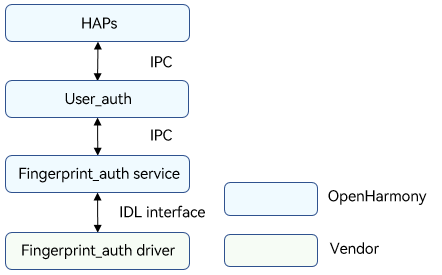
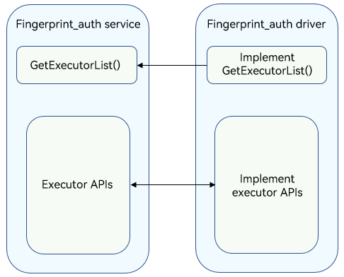

# Fingerprint Authentication

## Overview

### Function

Fingerprint authentication is indispensable in identity authentication scenarios, such as device unlocking, payment, and app logins. The fingerprint authentication (Fingerprint_auth) module provides fingerprint authentication for a device after a user enrolls a fingerprint. The figure below shows the fingerprint authentication architecture.

The Fingerprint_auth driver is developed based on the Hardware Driver Foundation (HDF). It shields hardware differences and provides stable fingerprint authentication capabilities for the upper-layer user authentication (User_auth) framework and Fingerprint_auth service. It provides APIs for obtaining the fingerprint authentication executor list, executor information, and template information by template ID, comparing fingerprint template information of the executor and that of User_auth, enrolling or deleting fingerprints, and performing fingerprint authentication.

**Figure 1** Fingerprint authentication architecture



### Basic Concepts

The identity authentication consists of the User_auth framework and basic authentication services. It supports basic functions such as setting and deleting user credentials and performing authentication. The system supports user identity authentication and data collection, processing, storage, and comparison.
- Executor

  The executor collects, processes, stores, and compares data for authentication. Each authentication service provides the executor capabilities, which are scheduled by User_auth to implement basic capabilities.

- Executor security level

  Security level of the runtime environment when an executor provides capabilities.

- Executor role

  - Executor: independently completes the entire process of credential registration and identity authentication. The executor can collect, process, store, and compare data to complete the authentication.

  - Collector: only collects data during user authentication. It needs to work with the authenticator to complete user authentication.

  - Authenticator: only processes data, obtains the stored credential template, and compares it with the authentication information generated.

- Executor type

  The authentication algorithm varies depending on the authentication mode and device used. Different executor types are defined based on the supported algorithm type or the device in use.

- User_auth public key & executor public key

  To ensure user data security and authentication result accuracy, measures must be taken to protect the integrity of the key information exchanged between User_auth and basic authentication services. Public keys must be exchanged when the executor provided by a basic authentication service interworks with User_auth.

    The executor uses the User_auth public key to verify scheduling instructions.

    User_auth uses the executor public key to verify the authentication result accuracy and the integrity of the information exchanged with the executor.

- Authentication credential

  Authentication credentials are generated and stored by the authentication service when users set authentication credentials. Each template has an ID to index a set of template information files. The template information needs to be compared with the authentication data generated during authentication to complete identity authentication.

- Data verification by the executor

  User_auth manages the mappings between user identities and credential IDs in a unified manner. When connecting to User_auth, the executor obtains the template ID list from User_auth and updates its template ID list based on the template ID list obtained.

- HAPs

  In a broad sense, Harmony Ability Packages (HAPs) are application packages that can be installed on OpenHarmony. In this document, the HAPs only refer to the upper-layer applications of the Face_auth driver.

- IDL interface

  An Interface Definition Language (IDL) is a language that lets a program or object written in one language communicate with another program written in an unknown language. An IDL compiler generates client stub files and server framework files. This document describes how to use the client and server generated by the IDL interface to implement communication between the Fingerprint_auth service and driver. For details, see [IDL](https://gitee.com/openharmony/ability_idl_tool/blob/master/README.md).

- IPC

  Inter-process communication (IPC) is a mechanism that allows processes to communicate with each other. For details, see [IPC](https://gitee.com/openharmony/communication_ipc/blob/master/README.md).

- HDI

  The hardware device interface (HDI) is located between the basic system service layer and the device driver layer. It provides APIs for abstracting hardware device functions, which shields underlying hardware device differences for system services. For details, see [HDI Specifications](../../design/hdi-design-specifications.md).

### Working Principles

The fingerprint_auth driver provides stable basic fingerprint authentication capabilities for the upper-layer User_auth framework and Fingerprint_auth service to ensure successful fingerprint authentication on devices. The figure below shows the interaction between the Fingerprint_auth service and the Fingerprint_auth driver. The Fingerprint_auth service obtains executor information by using **GetExecutorInfo()** and registers the executor with the User_auth framework. The Fingerprint_auth service exchanges information with the Fingerprint_auth driver for authentication, identification, and query through the executor APIs.
You can develop drivers to call Hardware Device Interface (HDI) APIs based on the HDF and the chip you use.

**Figure 2** Interaction between the Fingerprint_auth service and Fingerprint_auth driver



### Constraints

A Trusted Execution Environment (TEE) must be available on the device to store encrypted fingerprint feature information.

## Development Guidelines

### When to Use

The fingerprint_auth driver provides stable basic fingerprint authentication capabilities for the upper-layer User_auth framework and Fingerprint_auth service to ensure successful fingerprint authentication on devices. To implement the preceding functions, you need to develop the Fingerprint_auth driver based on the HDF, and then implement the APIs for obtaining the executor list and functional APIs such as authentication and query.

### Available APIs

The following table describes the C++ APIs generated from the Interface Definition Language (IDL) interface description. For details about the interface declaration, see the .idl file in **/drivers/interface/fingerprint_auth/**.
**Table 1** describes the HDI APIs for fingerprint credential enrollment, authentication, recognition, and deletion. **Table 2** describes the callbacks used to return the executor operation result to the framework or return the authentication tip information to upper-layer applications.

**Table 1** Available APIs

| API       | Description        |
| -------------------------------- | ----------------------------------- |
| GetExecutorList(std::vector\<sptr\<V1_0::IExecutor>>& executorList)  | Obtains the executor list (version V1_0).|
| GetExecutorListV1_1(std::vector\<sptr\<V1_1::IExecutor>>& executorList)      | Obtains the executor list (version V1_1).                        |
| GetExecutorInfo(ExecutorInfo& info)                          | Obtains the executor information, including the executor type, executor role, authentication type, security level, and executor public key.|
| GetTemplateInfo(uint64_t templateId, TemplateInfo& info)     | Obtains information about the template based on the specified ID.       |
| OnRegisterFinish(const std::vector\<uint64_t>& templateIdList,<br>        const std::vector\<uint8_t>& frameworkPublicKey, const std::vector\<uint8_t>& extraInfo) | Obtains the public key and template ID list from User_auth after the executor is registered successfully.|
| Enroll(uint64_t scheduleId, const std::vector\<uint8_t>& extraInfo,<br>        const sptr\<IExecutorCallback>& callbackObj) | Enrolls a fingerprint.                                              |
| Authenticate(uint64_t scheduleId, const std::vector\<uint64_t>& templateIdList,<br>        const std::vector\<uint8_t>& extraInfo, const sptr\<IExecutorCallback>& callbackObj) | Authenticates a fingerprint (version V1_0).        |
| AuthenticateV1_1(uint64_t scheduleId, const std::vector\<uint64_t>& templateIdList,<br>        bool endAfterFirstFail, const std::vector\<uint8_t>& extraInfo, const sptr\<IExecutorCallback>& callbackObj) | Authenticates a fingerprint (version V1_1).        |
| Identify(uint64_t scheduleId, const std::vector\<uint8_t>& extraInfo,<br>        const sptr\<IExecutorCallback>& callbackObj) | Identifies a fingerprint.          |
| Delete(const std::vector\<uint64_t>& templateIdList)          | Deletes a fingerprint.       |
| Cancel(uint64_t scheduleId)     | Cancels a fingerprint enrollment, authentication, or identification operation based on the **scheduleId**.    |
| SendCommand(int32_t commandId, const std::vector\<uint8_t>& extraInfo,<br>        const sptr\<IExecutorCallback>& callbackObj) | Sends commands to the Fingerprint_auth driver.      |
| GetProperty(const std::vector\<uint64_t>& templateIdList,<br>const std::vector\<GetPropertyType>& propertyTypes, Property& property) | Obtains executor property information.|
| SetCachedTemplates(const std::vector\<uint64_t> &templateIdList) | Sets a list of templates to be cached.|
| RegisterSaCommandCallback(const sptr\<ISaCommandCallback> &callbackObj) | Registers a callback to be invoked when an SA command is executed.|

**Table 2** Callbacks

| API                                                      | Description                |
| ------------------------------------------------------------ | ------------------------ |
| IExecutorCallback::OnResult(int32_t code, const std::vector\<uint8_t>& extraInfo) | Called to return the operation result.    |
| IExecutorCallback::OnTip(int32_t code, const std::vector\<uint8_t>& extraInfo) | Called to return the interaction information about the operation process.|
| ISaCommandCallback::OnSaCommands(const std::vector\<SaCommand>& commands) | Called to send the command list.|

### How to Develop

The following uses the Hi3516D V300 development board as an example to demonstrate how to develop the Fingerprint_auth driver. <br/>The directory structure is as follows:

```undefined
// drivers/peripheral/fingerprint_auth
├── BUILD.gn       # Build script
├── bundle.json    # Component description file
└── hdi_service    # Fingerprint_auth driver implementation
    ├── BUILD.gn   # Build script
    ├── include    # Header files
    └── src        # Source files
        ├── executor_impl.cpp                      # Implementation of authentication and enrollment APIs
        ├── fingerprint_auth_interface_driver.cpp  # Fingerprint_auth driver entry
        └── fingerprint_auth_interface_service.cpp # Implementation of the API for obtaining the executor list
```

The development procedure is as follows:

1. Develop the Fingerprint_auth driver based on the HDF using the **Bind()**, **Init()**, **Release()**, and **Dispatch()** functions. For details about the code, see [fingerprint_auth_interface_driver.cpp](https://gitee.com/openharmony/drivers_peripheral/blob/master/fingerprint_auth/hdi_service/src/fingerprint_auth_interface_driver.cpp).<br>The sample code is as follows:

   ```c++
   // Create an IRemoteObject object by using the custom HdfFingerprintAuthInterfaceHost object, which consists of the IoService object and HDI service.
   struct HdfFingerprintAuthInterfaceHost {
       struct IDeviceIoService ioService;
       OHOS::sptr<OHOS::IRemoteObject> stub;
   };

   // Enable the IPC service to call the response API.
   static int32_t FingerprintAuthInterfaceDriverDispatch(struct HdfDeviceIoClient *client, int cmdId, struct HdfSBuf *data,
       struct HdfSBuf *reply)
   {
       IAM_LOGI("start");
       auto *hdfFingerprintAuthInterfaceHost = CONTAINER_OF(client->device->service,
           struct HdfFingerprintAuthInterfaceHost, ioService);

       OHOS::MessageParcel *dataParcel = nullptr;
       OHOS::MessageParcel *replyParcel = nullptr;
       OHOS::MessageOption option;

       if (SbufToParcel(data, &dataParcel) != HDF_SUCCESS) {
           IAM_LOGE("%{public}s:invalid data sbuf object to dispatch", __func__);
           return HDF_ERR_INVALID_PARAM;
       }
       if (SbufToParcel(reply, &replyParcel) != HDF_SUCCESS) {
           IAM_LOGE("%{public}s:invalid reply sbuf object to dispatch", __func__);
           return HDF_ERR_INVALID_PARAM;
       }

       return hdfFingerprintAuthInterfaceHost->stub->SendRequest(cmdId, *dataParcel, *replyParcel, option);
   }

   // Initialize the HdfFingerprintAuthInterfaceDriver object.
   int HdfFingerprintAuthInterfaceDriverInit(struct HdfDeviceObject *deviceObject)
   {
       IAM_LOGI("start");
       if (!HdfDeviceSetClass(deviceObject, DEVICE_CLASS_USERAUTH)) {
           IAM_LOGE("set fingerprint auth hdf class failed");
           return HDF_FAILURE;
       }
       return HDF_SUCCESS;
   }

   // Bind the service provided by the Fingerprint_auth driver to the HDF.
   int HdfFingerprintAuthInterfaceDriverBind(struct HdfDeviceObject *deviceObject)
   {
       IAM_LOGI("start");
       auto *hdfFingerprintAuthInterfaceHost = new (std::nothrow) HdfFingerprintAuthInterfaceHost;
       if (hdfFingerprintAuthInterfaceHost == nullptr) {
           IAM_LOGE("%{public}s: failed to create HdfFaceAuthInterfaceHost object", __func__);
           return HDF_FAILURE;
       }

       hdfFingerprintAuthInterfaceHost->ioService.Dispatch = FingerprintAuthInterfaceDriverDispatch;
       hdfFingerprintAuthInterfaceHost->ioService.Open = NULL;
       hdfFingerprintAuthInterfaceHost->ioService.Release = NULL;

       auto serviceImpl = IFingerprintAuthInterface::Get(true);
       if (serviceImpl == nullptr) {
           IAM_LOGE("%{public}s: failed to implement service", __func__);
           return HDF_FAILURE;
       }

       hdfFingerprintAuthInterfaceHost->stub = OHOS::HDI::ObjectCollector::GetInstance().GetOrNewObject(serviceImpl,
           IFaceAuthInterface::GetDescriptor());
       if (hdfFingerprintAuthInterfaceHost->stub == nullptr) {
           IAM_LOGE("%{public}s: Failed to get stub object", __func__);
           return HDF_FAILURE;
       }

       deviceObject->service = &hdfFingerprintAuthInterfaceHost->ioService;
       IAM_LOGI("success");
       return HDF_SUCCESS;
   }

   // Release the resources used by the Fingerprint_auth driver.
   void HdfFingerprintAuthInterfaceDriverRelease(struct HdfDeviceObject *deviceObject)
   {
       IAM_LOGI("start");
       auto *hdfFingerprintAuthInterfaceHost = CONTAINER_OF(deviceObject->service,
           struct HdfFaceAuthInterfaceHost, ioService);
       delete hdfFaceAuthInterfaceHost;
       IAM_LOGI("success");
   }

   // Register the Fingerprint_auth driver entry data structure object.
   struct HdfDriverEntry g_fingerprintAuthInterfaceDriverEntry = {
       .moduleVersion = 1,
       .moduleName = "fingerprint_auth_interface_service",
       .Bind = HdfFingerprintAuthInterfaceDriverBind,
       .Init = HdfFingerprintAuthInterfaceDriverInit,
       .Release = HdfFingerprintAuthInterfaceDriverRelease,
   };

   // Call HDF_INIT to register the driver entry with the HDF. When loading the driver, the HDF calls the Bind() function and then the Init() function. If the Init() function fails to be called, the HDF will call Release() to release driver resources and exit the driver model.
   HDF_INIT(g_fingerprintAuthInterfaceDriverEntry);
   ```

2. Implement the API for obtaining the executor list. For details about the code, see [fingerprint_auth_interface_service.cpp](https://gitee.com/openharmony/drivers_peripheral/blob/master/fingerprint_auth/hdi_service/src/fingerprint_auth_interface_service.cpp).<br>The sample code is as follows:

   ```c++
   // Executor implementation class
   class ExecutorImpl : public IExecutor {
   public:
       ExecutorImpl(struct ExecutorInfo executorInfo);
       virtual ~ExecutorImpl() {}

   private:
       struct ExecutorInfo executorInfo_; // Executor information
   };

   static constexpr uint16_t SENSOR_ID = 123; // Executor sensor ID
   static constexpr uint32_t EXECUTOR_TYPE = 123; // Executor type
   static constexpr size_t PUBLIC_KEY_LEN = 32; //32-byte public key of the executor

   // Create an HDI service object.
   extern "C" IFaceAuthInterface *FingerprintAuthInterfaceImplGetInstance(void)
   {
       auto fingerprintAuthInterfaceService = new (std::nothrow) FingerprintAuthInterfaceService();
       if (fingerprintAuthInterfaceService == nullptr) {
           IAM_LOGE("faceAuthInterfaceService is nullptr");
           return nullptr;
       }
       return fingerprintAuthInterfaceService;
   }

   // Obtain the executor list and create an executor.
   int32_t GetExecutorListV1_1(std::vector<sptr<V1_1::IExecutor>>& executorList)
   {
       IAM_LOGI("interface mock start");
       executorList.clear();
       struct ExecutorInfo executorInfoExample = {
           .sensorId = SENSOR_ID,
           .executorType = EXECUTOR_TYPE,
           .executorRole = ExecutorRole::ALL_IN_ONE,
           .authType = AuthType::FINGERPRINT,
           .esl = ExecutorSecureLevel::ESL0, // Executor security level, which ranges from ESL0 to ESL3 (highest).
           .publicKey = std::vector<uint8_t>(PUBLIC_KEY_LEN, 0), // 32-byte public key, using the Ed25519 algorithm.
           .extraInfo = {},
       };
       auto executor = new (std::nothrow) ExecutorImpl(executorInfoExample);
       if (executor == nullptr) {
           IAM_LOGE("executor is nullptr");
           return HDF_FAILURE;
       }
       executorList.push_back(sptr<V1_1::IExecutor>(executor));
       IAM_LOGI("interface mock success");
       return HDF_SUCCESS;
   }

   // Obtain the executor list. The method of V1_0 is called to invoke the method of V1_1 through parameter conversion.
   int32_t GetExecutorList(std::vector<sptr<V1_0::IExecutor>> &executorList)
   {
       std::vector<sptr<V1_1::IExecutor>> executorListV1_1;
       int32_t result = GetExecutorListV1_1(executorListV1_1);
       for (auto &executor : executorListV1_1) {
           executorList.push_back(executor);
       }
       return result;
   }
   ```

3. Implement each function of the executor. For details about the code, see [executor_impl.cpp](https://gitee.com/openharmony/drivers_peripheral/blob/master/fingerprint_auth/hdi_service/src/executor_impl.cpp).<br>The sample code is as follows:

   ```c++
   // Obtain the executor information.
   int32_t GetExecutorInfo(ExecutorInfo& info)
   {
       IAM_LOGI("interface mock start");
       info = executorInfo_;
       IAM_LOGI("Executor information got successfully");
       return HDF_SUCCESS;
   }

   // Obtain template information based on templateId.
   int32_t GetTemplateInfo(uint64_t templateId, TemplateInfo& info)
   {
       IAM_LOGI("interface mock start");
       static_cast<void>(templateId);
       info = {0};
       IAM_LOGI("Template information got successfully");
       return HDF_SUCCESS;
   }

   // After the executor is successfully registered, obtain the public key and template ID list from User_auth and save the public key. The executor compares its template ID list with the template ID list obtained and updates its template ID list.
   int32_t OnRegisterFinish(const std::vector<uint64_t>& templateIdList,
       const std::vector<uint8_t>& frameworkPublicKey, const std::vector<uint8_t>& extraInfo)
   {
       IAM_LOGI("interface mock start");
       static_cast<void>(templateIdList);
       static_cast<void>(extraInfo);
       static_cast<void>(frameworkPublicKey);
       IAM_LOGI("registration finished");
       return HDF_SUCCESS;
   }

   // Enroll fingerprints.
   int32_t Enroll(uint64_t scheduleId, const std::vector<uint8_t>& extraInfo,
       const sptr<IExecutorCallback>& callbackObj)
   {
       IAM_LOGI("interface mock start");
       static_cast<void>(scheduleId);
       static_cast<void>(extraInfo);
       IAM_LOGI("enroll, result is %{public}d", ResultCode::OPERATION_NOT_SUPPORT);
       int32_t ret = callbackObj->OnResult(ResultCode::OPERATION_NOT_SUPPORT, {});
       if (ret != ResultCode::SUCCESS) {
           IAM_LOGE("callback result is %{public}d", ret);
           return HDF_FAILURE;
       }
       return HDF_SUCCESS;
   }

   // Call Authenticate() of V1_0 to invoke authenticate() of V1_1.
   int32_t Authenticate(uint64_t scheduleId, const std::vector<uint64_t> &templateIdList,
       const std::vector<uint8_t> &extraInfo, const sptr<IExecutorCallback> &callbackObj)
   {
       IAM_LOGI("interface mock start");
       return AuthenticateV1_1(scheduleId, templateIdList, true, extraInfo, callbackObj);
   }

   // Call Authenticate() of V1_1 to implement fingerprint authentication.
   int32_t AuthenticateV1_1(uint64_t scheduleId, const std::vector<uint64_t>& templateIdList, bool endAfterFirstFail,
       const std::vector<uint8_t>& extraInfo, const sptr<IExecutorCallback>& callbackObj)
   {
       IAM_LOGI("interface mock start");
       static_cast<void>(scheduleId);
       static_cast<void>(templateIdList);
       static_cast<void>(endAfterFirstFail);
       static_cast<void>(extraInfo);
       IAM_LOGI("authenticateV1_1, result is %{public}d", ResultCode::NOT_ENROLLED);
       int32_t ret = callbackObj->OnResult(ResultCode::NOT_ENROLLED, {});
       if (ret != ResultCode::SUCCESS) {
           IAM_LOGE("callback result is %{public}d", ret);
           return HDF_FAILURE;
       }
       return HDF_SUCCESS;
   }

   // Identify fingerprints.
   int32_t Identify(uint64_t scheduleId, const std::vector<uint8_t>& extraInfo,
       const sptr<IExecutorCallback>& callbackObj)
   {
       IAM_LOGI("interface mock start");
       static_cast<void>(scheduleId);
       static_cast<void>(extraInfo);
       IAM_LOGI("identify, result is %{public}d", ResultCode::OPERATION_NOT_SUPPORT);
       int32_t ret = callbackObj->OnResult(ResultCode::OPERATION_NOT_SUPPORT, {});
       if (ret != ResultCode::SUCCESS) {
           IAM_LOGE("callback result is %{public}d", ret);
           return HDF_FAILURE;
       }
       return HDF_SUCCESS;
   }

   // Delete fingerprints.
   int32_t Delete(const std::vector<uint64_t>& templateIdList)
   {
       IAM_LOGI("interface mock start");
       static_cast<void>(templateIdList);
       IAM_LOGI("delete success");
       return HDF_SUCCESS;
   }

   // Cancel the operation based on the specified scheduleId.
   int32_t Cancel(uint64_t scheduleId)
   {
       IAM_LOGI("interface mock start");
       static_cast<void>(scheduleId);
       IAM_LOGI("cancel success");
       return HDF_SUCCESS;
   }

   // Send template locking or unlocking command from the Fingerprint_auth service to the Fingerprint_auth driver.
   int32_t SendCommand(int32_t commandId, const std::vector<uint8_t>& extraInfo,
       const sptr<IExecutorCallback>& callbackObj)
   {
       IAM_LOGI("interface mock start");
       static_cast<void>(extraInfo);
       int32_t ret;
       switch (commandId) {
           case LOCK_TEMPLATE:
               IAM_LOGI("unlock template, result is %{public}d", ResultCode::SUCCESS);
               ret = callbackObj->OnResult(ResultCode::SUCCESS, {});
               if (ret != ResultCode::SUCCESS) {
                   IAM_LOGE("callback result is %{public}d", ret);
                   return HDF_FAILURE;
               }
               break;
           case UNLOCK_TEMPLATE:
               IAM_LOGI("unlock template, result is %{public}d", ResultCode::SUCCESS);
               ret = callbackObj->OnResult(ResultCode::SUCCESS, {});
               if (ret != ResultCode::SUCCESS) {
                   IAM_LOGE("callback result is %{public}d", ret);
                   return HDF_FAILURE;
               }
               break;
           default:
               IAM_LOGD("not support CommandId : %{public}d", commandId);
               ret = callbackObj->OnResult(ResultCode::GENERAL_ERROR, {});
               if (ret != ResultCode::SUCCESS) {
                   IAM_LOGE("callback result is %{public}d", ret);
                   return HDF_FAILURE;
               }
       }
       return HDF_SUCCESS;
   }

   // Obtain executor properties.
   int32_t ExecutorImpl::GetProperty(
       const std::vector<uint64_t> &templateIdList, const std::vector<GetPropertyType> &propertyTypes, Property &property)
   {
       IAM_LOGI("interface mock start");
       property = {};
       IAM_LOGI("get property success");
       return HDF_SUCCESS;
   }

   // Set a list of templates to be cached.
   int32_t ExecutorImpl::SetCachedTemplates(const std::vector<uint64_t> &templateIdList)
   {
       IAM_LOGI("interface mock start");
       IAM_LOGI("set cached templates success");
       return HDF_SUCCESS;
   }

   // Register the callback to be invoked when the SA command is executed.
   int32_t ExecutorImpl::RegisterSaCommandCallback(const sptr<ISaCommandCallback> &callbackObj)
   {
       IAM_LOGI("interface mock start");
       IAM_LOGI("register sa command callback success");
       return HDF_SUCCESS;
   }
   ```

4. Modify **serviceName2Config** in the **fingerprint_auth_service.cpp** file if you need to add a driver or modify driver information.

   ```c++
   // base/user_iam/fingerprint_auth/services/src/fingerprint_auth_service.cpp
   void FingerprintAuthService::StartDriverManager()
   {
       IAM_LOGI("start");
       // Service name and ID of the driver to add or modify. The driver service name and ID must be globally unique.
       const std::map<std::string, UserAuth::ServiceConfig> serviceName2Config = {
           {"fingerprint_auth_interface_service", {2, std::make_shared<FingerprintAuthDriverHdi>()}},
       };
       UserIAM::UserAuth::IDriverManager::GetInstance().Start(serviceName2Config);
   }
   ```

### Verification

Use the [User Authentication APIs](../../application-dev/reference/apis/js-apis-useriam-userauth.md) to develop a JavaScript application and verify the application on the Hi3516D V300 development board. The JavaScript application invokes the Fingerprint_auth driver via the Fingerprint_auth service. The sample code is as follows:

    ```js
    // API version 9
    import userIAM_userAuth from '@ohos.userIAM.userAuth';
    
    let challenge = new Uint8Array([1, 2, 3, 4, 5, 6, 7, 8]);
    let authType = userIAM_userAuth.UserAuthType.FINGERPRINT;
    let authTrustLevel = userIAM_userAuth.AuthTrustLevel.ATL1;
    
    // Obtain an authentication object.
    let auth;
    try {
        auth = userIAM_userAuth.getAuthInstance(challenge, authType, authTrustLevel);
        console.log("get auth instance success");
    } catch (error) {
        console.log("get auth instance failed" + error);
    }
    
    // Subscribe to the authentication result.
    try {
        auth.on("result", {
            callback: (result: userIAM_userAuth.AuthResultInfo) => {
                console.log("authV9 result " + result.result);
                console.log("authV9 token " + result.token);
                console.log("authV9 remainAttempts " + result.remainAttempts);
                console.log("authV9 lockoutDuration " + result.lockoutDuration);
            }
        });
        console.log("subscribe authentication event success");
    } catch (error) {
        console.log("subscribe authentication event failed " + error);
    }
    
    // Start user authentication.
    try {
        auth.start();
        console.info("authV9 start auth success");
    } catch (error) {
        console.info("authV9 start auth failed, error = " + error);
    }
    
    // Cancel the authentication.
    try {
        auth.cancel();
        console.info("cancel auth success");
    } catch (error) {
        console.info("cancel auth failed, error = " + error);
    }
    
    // Unsubscribe from the authentication result.
    try {
        auth.off("result");
        console.info("cancel subscribe authentication event success");
    } catch (error) {
        console.info("cancel subscribe authentication event failed, error = " + error);
    }
    ```
