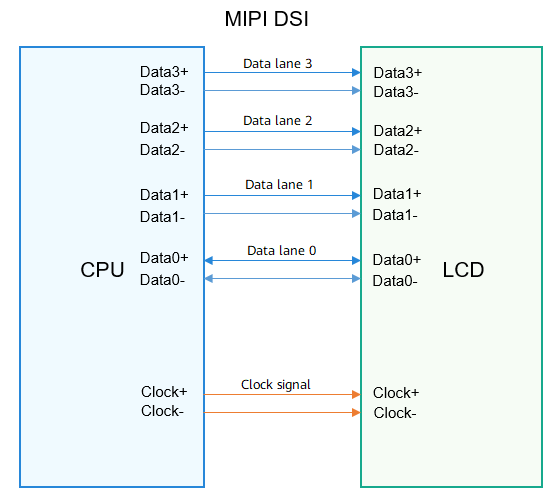
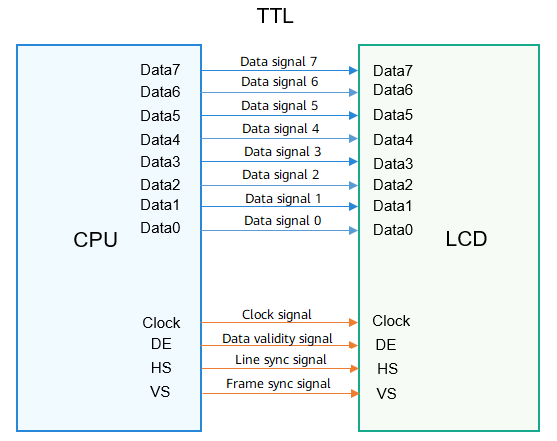

# LCD

## Overview

### Function

The Liquid Crystal Display (LCD) driver performs operations such as powering on the LCD and initializing the internal registers of the driver integrated circuits (ICs).

The display driver model based on the [Hardware Driver Foundation (HDF)](driver-overview-foundation.md) provides the following functions:

- Provides a basic framework for LCD driver development to improve development efficiency.

- Facilitates driver porting across OSs and chip platforms.

The following figure shows the HDF-based display driver model.

**Figure 1** HDF-based display driver model


The display driver model consists of the display common driver layer, SoC adapter layer, and LCD panel driver layer. The HDF-based display driver model shields the differences between kernel forms through platform and OSAL APIs so that the LCD driver can be easily ported across OSs and chip platforms. The display driver model connects to the display common Hardware Abstraction Layer (HAL), supports the implementation of the Hardware Device Interface (HDI), and provides various driver capability interfaces for graphics services through the Display-HDI.

- Display common driver layer: connects to the display common HAL through the IOService data channel provided by the HDF to receive and process various upper-layer calls in a centralized manner.

- SoC adapter layer: decouples the display driver from the SoC driver, configures parameters related to the chip platform, and passes the calls from the platform driver layer to the LCD driver layer.

- LCD panel driver layer: provides LCD-related APIs for sending the initialization sequence, powering on/off, and setting the backlight.

The display driver model leverages the capabilities and APIs provided by the platform to simplify the display driver development and improve the efficiency.

### Basic Concepts

The LCD interfaces include the Mobile Industry Processor Interface (MIPI) Display Serial Interface (DSI), Transistor-Transistor Logic (TTL) interface, and Low Voltage Differential Signaling (LVDS) interface. The MIPI DSI and TTL interfaces are commonly used. Here is a brief introduction to them.

- MIPI DSI

    **Figure 2** MIPI DSI

    

    The DSI is defined by the MIPI Alliance for the displays used in mobile devices. The MIPI DSI is used to transmit image data, in compliance with the MIPI protocol. Generally, control information is sent to the peer IC in the form of MIPI packets over the MIPI DSI, without the need of additional peripheral interfaces.

- TTL interface

    **Figure 3** TTL interface

    

    TTL level signals are generated by TTL devices, which are a major type of digital integrated circuits. TTL devices are manufactured using the bipolar process and feature high speed, low power consumption, and diversified types.

    The TTL interface is used to transmit data in parallel mode under control signals. It transmits data signals, clock signals, and control signals (such as line synchronization signals, frame synchronization signals, and data validity signals). For the LCD with the TTL, additional peripheral interfaces, such as the Serial Peripheral Interface (SPI) and Inter-Integrated Circuit (I2C), are required for the read and write of the internal registers.

### Constraints

In addition to the IC model, you must consider the LCD peripheral circuit design, LCD interface unit of the baseband chip, backlight IC control, and upper-layer software programs. All these factors affect the development of the LCD driver.

## Development Guidelines

### When to Use

Before applying your device with OpenHarmony system, you need to perform LCD driver adaption. The HDF-based display driver model provides a unified driver model for LCD adaptation regardless of the OS (LiteOS or Linux OS) and chip platform (Hi35xx, Hi38xx, or V3S).

### Available APIs

To adjust the parameters of the LCD, establish a display channel with the display, and implement the display effect, use **display::host** to register the **PanelInfo** struct and interface information and add device description.

Table 1 APIs required for LCD driver adaptation

| API                                                 | Description               |
| :------------------------------------------------------ | ------------------- |
| static int32_t MipiDsiInit(struct PanelInfo *info)      | Initializes the corresponding chip platform driver.|
| static int32_t LcdResetOn(void)                         | Sets the status of the reset pin.|
| int32_t SampleEntryInit(struct HdfDeviceObject *object) | Initializes the entry function of the device driver.   |

### How to Develop


1. Add the device configuration related to the LCD driver.

2. Adapt the driver to the chip at the SoC adapter layer.

3. Add the LCD panel driver and register the panel driver data in the driver entry function **Init**. The driver data interface implements the following features:
   - Powering on/off the LCD device

      Based on the LCD hardware connection, use the GPIO APIs provided by the platform to perform operations on the LCD pins, such as the reset pin and IOVCC pin. For details about the power-on sequence, see the SPEC provided by the LCD supplier.

   - Sending the initialization sequence

      Based on the LCD hardware interfaces, use the I2C, SPI, and MIPI interfaces provided by the platform to download the LCD initialization sequence. For details, see the SPEC provided by the LCD supplier.

4. (Optional) Implement other HDF interfaces as required.

5. (Optional) Create other device nodes for implementing service logic or debugging based on the HDF as required.

### Example

The following uses the Hi35xx series chips as an example to describe how to perform LCD driver adaptation.

1. Add device information in the **vendor/bearpi/bearpi_hm_micro/hdf_config/device_info/device_info.hcs** file.

   ```c++
   /* Configuration of the devices related to the display driver */
   display :: host {
       hostName = "display_host";
       /* Configuration of the HDF display driver */
       device_hdf_disp :: device {
           device0 :: deviceNode {
               policy = 2;
               priority = 200;
               permission = 0660;
               moduleName = "HDF_DISP";
               serviceName = "hdf_disp";
           }
       }
       /* Configuration of the driver device at the SoC adapter layer */
       device_hi35xx_disp :: device {
           device0 :: deviceNode {
               policy = 0;
               priority = 199;
               moduleName = "HI351XX_DISP";
           }
       }
       /* Configuration of the LCD driver */
       device_lcd :: device {
           device0 :: deviceNode {
               policy = 0;
               priority = 100;
               preload = 0;
               moduleName = "LCD_Sample";
           }
           device1 :: deviceNode {
               policy = 0;
               priority = 100;
               preload = 2;
               moduleName = "LCD_SampleXX";
           }
       }
   }
   ```

2. Configure the chip platform driver information in **drivers/hdf_core/framework/model/display/driver/adapter_soc/hi35xx_disp.c**.

   ```c++
   /* Configuration of the display driver to adapt to the MIPI and chip platform */
   static int32_t MipiDsiInit(struct PanelInfo *info)
   {
       int32_t ret;
       struct DevHandle *mipiHandle = NULL;
       struct MipiCfg cfg;
   
       mipiHandle = MipiDsiOpen(0);
       if (mipiHandle == NULL) {
           HDF_LOGE("%s: MipiDsiOpen failure", __func__);
           return HDF_FAILURE;
       }
       cfg.lane = info->mipi.lane;
       cfg.mode = info->mipi.mode;
       cfg.format = info->mipi.format;
       cfg.burstMode = info->mipi.burstMode;
       cfg.timing.xPixels = info->width;
       cfg.timing.hsaPixels = info->hsw;
       cfg.timing.hbpPixels = info->hbp;
       cfg.timing.hlinePixels = info->width + info->hbp + info->hfp + info->hsw;
       cfg.timing.vsaLines = info->vsw;
       cfg.timing.vbpLines = info->vbp;
       cfg.timing.vfpLines = info->vfp;
       cfg.timing.ylines = info->height;
       /* 0 : no care */
       cfg.timing.edpiCmdSize = 0;
       cfg.pixelClk = CalcPixelClk(info);
       cfg.phyDataRate = CalcDataRate(info);
       /* Configure the MIPI device. */
       ret = MipiDsiSetCfg(mipiHandle, &cfg);
       if (ret != HDF_SUCCESS) {
           HDF_LOGE("%s:MipiDsiSetCfg failure", __func__);
       }
       MipiDsiClose(mipiHandle);
       HDF_LOGI("%s:pixelClk = %d, phyDataRate = %d\n", __func__,
           cfg.pixelClk, cfg.phyDataRate);
       return ret;
   }
   ```

3. Add a device.

   - Define driver-related interfaces (**drivers/hdf_core/framework/model/display/driver/panel/mipi_icn9700.c**).

     ```c++
     #define RESET_GPIO                5
     #define MIPI_DSI0                 0
     #define BLK_PWM1                  1
     #define PWM_MAX_PERIOD            100000
     /* Set the backlight. */
     #define MIN_LEVEL                 0
     #define MAX_LEVEL                 255
     #define DEFAULT_LEVEL             100
     #define WIDTH                     480
     #define HEIGHT                    960
     #define HORIZONTAL_BACK_PORCH     20
     #define HORIZONTAL_FRONT_PORCH    20
     #define HORIZONTAL_SYNC_WIDTH     10
     #define VERTICAL_BACK_PORCH       14
     #define VERTICAL_FRONT_PORCH      16
     #define VERTICAL_SYNC_WIDTH       2
     #define FRAME_RATE                60
     ```

   - Define the **PanelInfo** struct (**drivers/hdf_core/framework/model/display/driver/hdf_disp.h**).

     ```c++
     struct PanelInfo {
         uint32_t width;	          // Width
         uint32_t height;	      // Height
         uint32_t hbp;		      // Horizontal back porch
         uint32_t hfp;		      // Horizontal front porch
         uint32_t hsw; 		      // Horizontal synchronization width
         uint32_t vbp;		      // Vertical back porch
         uint32_t vfp;		      // Vertical front porch
         uint32_t vsw;		      // Vertical synchronization width
         uint32_t frameRate;             // Frame rate
         enum LcdIntfType intfType; // LCD interface type
         enum IntfSync intfSync;    // User timing parameter
         struct MipiDsiDesc mipi;
         struct BlkDesc blk;
         struct PwmCfg pwm;
     };
     ```

   - Initialize the LCD (**drivers/hdf_core/framework/model/display/driver/panel/mipi_icn9700.c**).

     ```c++
     static uint8_t g_payLoad0[] = { 0xF0, 0x5A, 0x5A };
     static uint8_t g_payLoad1[] = { 0xF1, 0xA5, 0xA5 };
     static uint8_t g_payLoad2[] = { 0xB3, 0x03, 0x03, 0x03, 0x07, 0x05, 0x0D, 0x0F, 0x11, 0x13, 0x09, 0x0B };
     static uint8_t g_payLoad3[] = { 0xB4, 0x03, 0x03, 0x03, 0x06, 0x04, 0x0C, 0x0E, 0x10, 0x12, 0x08, 0x0A };
     static uint8_t g_payLoad4[] = { 0xB0, 0x54, 0x32, 0x23, 0x45, 0x44, 0x44, 0x44, 0x44, 0x60, 0x00, 0x60, 0x1C };
     static uint8_t g_payLoad5[] = { 0xB1, 0x32, 0x84, 0x02, 0x87, 0x12, 0x00, 0x50, 0x1C };
     static uint8_t g_payLoad6[] = { 0xB2, 0x73, 0x09, 0x08 };
     static uint8_t g_payLoad7[] = { 0xB6, 0x5C, 0x5C, 0x05 };
     static uint8_t g_payLoad8[] = { 0xB8, 0x23, 0x41, 0x32, 0x30, 0x03 };
     static uint8_t g_payLoad9[] = { 0xBC, 0xD2, 0x0E, 0x63, 0x63, 0x5A, 0x32, 0x22, 0x14, 0x22, 0x03 };
     static uint8_t g_payLoad10[] = { 0xb7, 0x41 };
     static uint8_t g_payLoad11[] = { 0xC1, 0x0c, 0x10, 0x04, 0x0c, 0x10, 0x04 };
     static uint8_t g_payLoad12[] = { 0xC2, 0x10, 0xE0 };
     static uint8_t g_payLoad13[] = { 0xC3, 0x22, 0x11 };
     static uint8_t g_payLoad14[] = { 0xD0, 0x07, 0xFF };
     static uint8_t g_payLoad15[] = { 0xD2, 0x63, 0x0B, 0x08, 0x88 };
     static uint8_t g_payLoad16[] = { 0xC6, 0x08, 0x15, 0xFF, 0x10, 0x16, 0x80, 0x60 };
     static uint8_t g_payLoad17[] = { 0xc7, 0x04 };
     static uint8_t g_payLoad18[] = {
         0xC8, 0x7C, 0x50, 0x3B, 0x2C, 0x25, 0x16, 0x1C, 0x08, 0x27, 0x2B, 0x2F, 0x52, 0x43, 0x4C, 0x40,
         0x3D, 0x30, 0x1E, 0x06, 0x7C, 0x50, 0x3B, 0x2C, 0x25, 0x16, 0x1C, 0x08, 0x27, 0x2B, 0x2F, 0x52,
         0x43, 0x4C, 0x40, 0x3D, 0x30, 0x1E, 0x06
     };
     static uint8_t g_payLoad19[] = { 0x11 };
     static uint8_t g_payLoad20[] = { 0x29 };
     static DevHandle g_mipiHandle = NULL;
     static DevHandle g_pwmHandle = NULL;
     ```

   - Set the Reset pin status (**/drivers_hdf_core/framework/model/display/driver/panel/mipi_icn9700.c**).

     ```c++
     static int32_t LcdResetOn(void)
     {
         int32_t ret;
	 /* Set the pin direction. */
         ret = GpioSetDir(RESET_GPIO, GPIO_DIR_OUT);
         if (ret != HDF_SUCCESS) {
             HDF_LOGE("GpioSetDir failure, ret:%d", ret);
             return HDF_FAILURE;
         }
	 /* Write the GPIO. */
         ret = GpioWrite(RESET_GPIO, GPIO_VAL_HIGH);
         if (ret != HDF_SUCCESS) {
             HDF_LOGE("GpioWrite failure, ret:%d", ret);
             return HDF_FAILURE;
         }
         /* Set the delay to 20 ms. */
         OsalMSleep(20);
         return HDF_SUCCESS;
     }
     ```

   - Define the device driver entry function (**/drivers_hdf_core/framework/model/display/driver/panel/mipi_icn9700.c**).

     ```c++
     /* Initialize the entry function. */
     int32_t SampleEntryInit(struct HdfDeviceObject *object)
     {
         HDF_LOGI("%s: enter", __func__);
         if (object == NULL) {
             HDF_LOGE("%s: param is null!", __func__);
             return HDF_FAILURE;
         }
         /* Register the device driver APIs with the platform driver. */
         if (PanelDataRegister(&g_panelData) != HDF_SUCCESS) {
             HDF_LOGE("%s: PanelDataRegister error!", __func__);
             return HDF_FAILURE;
         }
         return HDF_SUCCESS;
     }
     
     /* Implement the driver. */
     struct HdfDriverEntry g_sampleDevEntry = {
         .moduleVersion = 1,
         .moduleName = "LCD_SAMPLE",
         .Init = SampleEntryInit,
     };
     
     HDF_INIT(g_sampleDevEntry);
     ```
