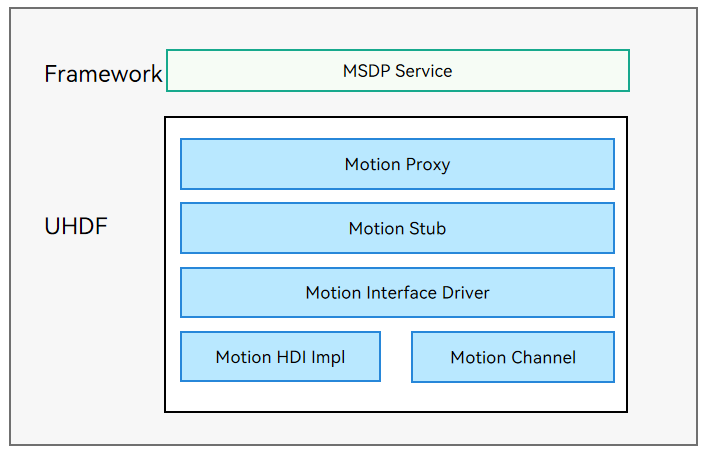

# Motion

## Overview

### Function

The motion module provides motion recognition and control capabilities. OpenHarmony supports recognition of pick-up, flip, shake, and rotation.

The motion driver is developed based on the hardware driver foundation (HDF). It shields hardware differences and provides APIs for the Multimodal Sensor Data Platform (MSDP) to implement capabilities such as enabling or disabling motion recognition, and subscribing to or unsubscribing from motion recognition data.

The following figure shows the motion driver architecture. The framework layer provides MSDP services, and interacts with the Motion Stub through the Motion Proxy in the User Hardware Driver Foundation (UHDF). The Motion Stub calls the Motion HDI Impl APIs to provide motion recognition capabilities for upper-layer services.

**Figure 1** Motion driver architecture



### Working Principles

The figure below illustrates how a motion driver works.

**Figure 2** How a motion driver works


1. MSDP: The MSDP service obtains a Motion HDI service instance from the Motion Proxy and calls the Motion HDI API.
2. IDL: The MSDP service obtains a Motion HDI service instance from the Motion Proxy and calls the Motion HDI API. The interface instance is allocated by IService Manager.  After the MSDP service calls the HDI API provided by the Motion Proxy, Motion Stub is called through Inter-Process Communication (IPC) to invoke the Motion Service API. The code is automatically generated by a tool and does not need to be developed by the component vendor.
3. HDI Service: The HDI service consists of Motion Interface Driver, Motion Service, and Motion Impl. Motion Interface Driver provides the motion driver code. A **HdfDriverEntry** structure is defined to implement the **Init**, **Bind**, and **Release** functions. The **HDF_INIT** macro is used to load the driver in the functions. Motion Service provides the motion recognition service interface class. The specific implementation is described in Motion Impl. The code of HDI Service must be developed by the component vendor.

## Development Guidelines

### When to Use

The motion driver provides capabilities for the MSDP service to enable or disable motion recognition and subscribe to or unsubscribe from motion recognition data. It can be used for motion recognition when a user picks up, flips, shakes, and rotates a device.

### Available APIs

**Table 1** Available APIs

**NOTE**<br>The following table lists the C++ function interfaces generated by the IDL interface description. For details about the interface declaration, see the IDL file [/drivers/interface/motion/v1_0/](https://gitee.com/openharmony/drivers_interface/tree/master/motion).

| API                                                      | Description                    |
| ------------------------------------------------------------ | ---------------------------- |
| int32_t EnableMotion(int32_t motionType)                     | Enables motion recognition of the specified type. The motion recognition data can be obtained only after the motion recognition is enabled.|
| int32_t DisableMotion(int32_t motionType)                    | Disables motion recognition of the specified type.            |
| int32_t Register(const sptr\<IMotionCallback\> &callbackObj)   | Registers a callback for motion recognition so that the subscriber can receive the motion recognition data.|
| int32_t Unregister(const sptr\<IMotionCallback\> &callbackObj) | Unregisters the motion recognition callback.|

### How to Develop

The development procedure is as follows:

1. Develop the user-mode driver for motion recognition based on the HDF.

2. Implement the **EnableMotion**, **DisableMotion**, **Register**, and **Unregister** APIs.

The motion recognition directory structure is as follows:

```
/drivers/peripheral/motion            // Developed by the vendor.
├── hdi_service              		 // Driver capability provided by the motion module for upper-layer services.
├── test                              // Test codes for the motion module.
   │   └── unittest\hdi               // HDI unit test code of the motion driver module.
```

The following describes how to develop a user-mode motion driver based on the HDF. For details, see [motion_if_driver.cpp](https://gitee.com/openharmony/drivers_peripheral/blob/master/motion/hdi_service/motion_if_driver.cpp).

You need to implement the **Bind()**, **Init()**, **Release()**, and **Dispatch()** functions. The **Bind()** function binds the service capability with the driver; **Init()** implements the initialization required before the driver is loaded; **Release()** reclaims resources when **Init()** fails; **Dispatch()** implements the service, which is bound in **Bind()**.

```c
/* Custom HdfMotionInterfaceHost object. */
struct HdfMotionInterfaceHost {
    struct IDeviceIoService ioService;
    OHOS::sptr<OHOS::IRemoteObject> stub;
};

/* Enable the IPC service to call the response API. */
static int32_t MotionInterfaceDriverDispatch(struct HdfDeviceIoClient *client, int cmdId, struct HdfSBuf *data,
    struct HdfSBuf *reply)
{
    auto *hdfMotionInterfaceHost = CONTAINER_OF(client->device->service, struct HdfMotionInterfaceHost, ioService);

    OHOS::MessageParcel *dataParcel = nullptr;
    OHOS::MessageParcel *replyParcel = nullptr;
    OHOS::MessageOption option;

    if (SbufToParcel(data, &dataParcel) != HDF_SUCCESS) {
        HDF_LOGE("%{public}s: invalid data sbuf object to dispatch", __func__);
        return HDF_ERR_INVALID_PARAM;
    }
    if (SbufToParcel(reply, &replyParcel) != HDF_SUCCESS) {
        HDF_LOGE("%{public}s: invalid reply sbuf object to dispatch", __func__);
        return HDF_ERR_INVALID_PARAM;
    }

    return hdfMotionInterfaceHost->stub->SendRequest(cmdId, *dataParcel, *replyParcel, option);
}

/* Initialize the HdfMotionInterface driver. */
int HdfMotionInterfaceDriverInit(struct HdfDeviceObject *deviceObject)
{
    HDF_LOGI("HdfMotionInterfaceDriverInit enter");
    return HDF_SUCCESS;
}

/* Bind the services provided by the motion driver to the HDF. */
int HdfMotionInterfaceDriverBind(struct HdfDeviceObject *deviceObject)
{
    HDF_LOGI("HdfMotionInterfaceDriverBind enter");

    auto *hdfMotionInterfaceHost = new (std::nothrow) HdfMotionInterfaceHost;
    if (hdfMotionInterfaceHost == nullptr) {
        HDF_LOGE("%{public}s: failed to create HdfMotionInterfaceHost object", __func__);
        return HDF_FAILURE;
    }

    hdfMotionInterfaceHost->ioService.Dispatch = MotionInterfaceDriverDispatch;
    hdfMotionInterfaceHost->ioService.Open = NULL;
    hdfMotionInterfaceHost->ioService.Release = NULL;

    auto serviceImpl = IMotionInterface::Get(true);
    if (serviceImpl == nullptr) {
        HDF_LOGE("%{public}s: failed to get of implement service", __func__);
        return HDF_FAILURE;
    }

    hdfMotionInterfaceHost->stub = OHOS::HDI::ObjectCollector::GetInstance().GetOrNewObject(serviceImpl,
        IMotionInterface::GetDescriptor());
    if (hdfMotionInterfaceHost->stub == nullptr) {
        HDF_LOGE("%{public}s: failed to get stub object", __func__);
        return HDF_FAILURE;
    }

    deviceObject->service = &hdfMotionInterfaceHost->ioService;
    return HDF_SUCCESS;
}

/* Release the resources used by the motion driver. */
void HdfMotionInterfaceDriverRelease(struct HdfDeviceObject *deviceObject)
{
    HDF_LOGI("HdfMotionInterfaceDriverRelease enter");
    auto *hdfMotionInterfaceHost = CONTAINER_OF(deviceObject->service, struct HdfMotionInterfaceHost, ioService);
    delete hdfMotionInterfaceHost;
    hdfMotionInterfaceHost = nullptr;
}

/* Register the HDF driver entry g_motioninterfaceDriverEntry. */
struct HdfDriverEntry g_motioninterfaceDriverEntry = {
    .moduleVersion = 1,
    .moduleName = "motion_service",
    .Bind = HdfMotionInterfaceDriverBind,
    .Init = HdfMotionInterfaceDriverInit,
    .Release = HdfMotionInterfaceDriverRelease,
};

/* Call HDF_INIT to register the driver entry with the HDF. When loading the driver, the HDF calls the Bind function and then the Init function. If the Init function fails to be called, the HDF will call Release to release driver resources and exit the driver model. */
HDF_INIT(g_userAuthInterfaceDriverEntry);
```

### Verification

The procedure is as follows:

1. Call **IMotionInterface::Get()** to obtain a motion recognition instance and assign it with the **g_motionInterface** object of the **IMotionInterface** type.

2. Call **Register()** using the **g_motionInterface** instance to register a callback. The callback needs to be designed based on service requirements.

3. Call **EnableMotion** using the **g_motionInterface** instance to enable motion recognition of the specified type. Currently, **HDF_MOTION_TYPE_PICKUP**, **HDF_MOTION_TYPE_FLIP**, **HDF_MOTION_TYPE_SHAKE**, and **HDF_MOTION_TYPE_ROTATION** are supported.

4. Call **DisableMotion** using the **g_motionInterface** instance to disable motion recognition.

5. Call **Unregister** to unregister the callback for returning the motion data. The callback must have been registered. Otherwise, the **Unregister** will fail.

   The sample code is as follows:

   ```c++
   using namespace OHOS::HDI::Motion::V1_0;
   using namespace testing::ext;
   
   namespace {
       sptr<IMotionInterface> g_motionInterface = nullptr;
       sptr<IMotionCallback> g_motionCallback = new MotionCallbackService();
       sptr<IMotionCallback> g_motionCallbackUnregistered = new MotionCallbackService();
   }
   
   class HdfMotionTest : public testing::Test {
   public:
       static void SetUpTestCase();
       static void TearDownTestCase();
       void SetUp();
       void TearDown();
   };
   
   void HdfMotionTest::SetUpTestCase()
   {
       // 1. Obtain a motion recognition instance.
       g_motionInterface = IMotionInterface::Get();
   }
   
   void HdfMotionTest::TearDownTestCase()
   {
   }
   
   void HdfMotionTest::SetUp()
   {
   }
   
   void HdfMotionTest::TearDown()
   {
   }
   
   HWTEST_F(HdfMotionTest, EnableMotion_001, TestSize.Level1)
   {
       if (g_motionInterface == nullptr) {
           ASSERT_NE(nullptr, g_motionInterface);
           return;
       }
   
       vector<int> vec;
       vec.push_back(HDF_MOTION_TYPE_PICKUP);
       vec.push_back(HDF_MOTION_TYPE_FLIP);
       vec.push_back(HDF_MOTION_TYPE_SHAKE);
       vec.push_back(HDF_MOTION_TYPE_ROTATION);
   
       // 2. Register a callback for subscribing to motion recognition data.
       int32_t ret = g_motionInterface->Register(g_motionCallback);
       EXPECT_EQ(HDF_SUCCESS, ret);
   
       for (int i = 0; i < vec.size(); i++) {
           // 3. Enable motion recognition.
           ret = g_motionInterface->EnableMotion(vec[i]);
           if (ret == HDF_SUCCESS) {
               printf("Motion %d enabled successfully\n", vec[i]);
           } else {
               printf("Motion %d enable failed\n", vec[i]);
           }
           EXPECT_EQ(HDF_SUCCESS, ret);
           OsalSleep(15);
           // 4. Disable motion recognition.
           ret = g_motionInterface->DisableMotion(vec[i]);
           if (ret == HDF_SUCCESS) {
               printf("Motion %d disabled successfully\n", vec[i]);
           } else {
               printf("Motion %d disable failed\n", vec[i]);
           }
           EXPECT_EQ(HDF_SUCCESS, ret);
           OsalSleep(2);
       }
       // 5. Unregister the callback for returning the motion recognition data.
       ret = g_motionInterface->Unregister(g_motionCallback);
       EXPECT_EQ(HDF_SUCCESS, ret);
   }
   ```
   
