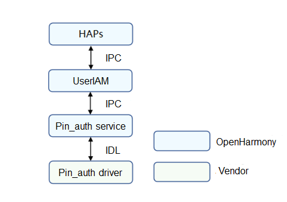
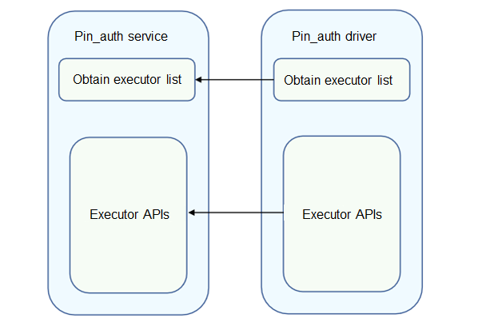

# PIN Authentication

## Overview

### Function

Personal Identification Number (PIN) authentication provides user authentication capabilities in identity authentication scenarios, such as device unlocking, payment, and app logins. After a user registers a PIN, the PIN authentication (Pin_auth) module unlocks the device only when the correct PIN is entered. The figure below shows the architecture of PIN authentication.

The Pin_auth driver is developed based on the Hardware Driver Foundation (HDF). The Pin_auth driver model shields hardware differences and provides stable PIN authentication capabilities for the user User_auth framework (User_auth) and PIN authentication system ability (SA). The PIN authentication capabilities include obtaining the PIN authentication executor list, executor information, and anti-brute force information of the specified template, comparing the template ID list of the executor and that of User_auth, enrolling or deleting PINs, and performing PIN authentication.

**Figure 1** PIN authentication architecture



### Basic Concepts
The identity authentication consists of User_auth and basic authentication services (including PIN authentication and facial recognition). It supports basic functions such as setting and deleting user credentials and performing authentication.

- Executor

  The executor collects, processes, stores, and compares data for authentication. Each authentication service provides the executor capabilities, which are scheduled by User_auth to implement basic capabilities.

- Executor security level

  Security level required for the execution environment of an executor.

- Executor role

  - Executor: independently completes the entire process of credential registration and identity authentication. The executor can collect, process, store, and compare data to complete the authentication.

  - Collector: only collects data during user authentication. It needs to work with the authenticator to complete user authentication.

  - Authenticator: only processes data, obtains the stored credential template, and compares it with the authentication information generated.

- Executor type

  The authentication algorithm varies depending on the authentication mode and device used. Different executor types are defined based on the supported algorithm type or the device in use.

- User_auth public key & executor public key

  To ensure user data security and authentication result accuracy, measures must be taken to protect the integrity of the key information exchanged between User_auth and basic authentication services. Public keys must be exchanged when the executor provided by a basic authentication service interworks with User_auth.

    - The executor uses the User_auth public key to verify scheduling instructions.

    - User_auth uses the executor public key to verify the authentication result accuracy and the integrity of the information exchanged with the executor.


- PIN authentication credential template

  Authentication credentials are generated and stored by the authentication service when users set authentication credentials. Each template has an ID to index a set of template information files. The template information needs to be compared with the authentication data generated during authentication to complete identity authentication.

- Data verification by the executor

  User_auth manages the mappings between user identities and credential IDs in a unified manner. When connecting to User_auth, the executor obtains the template ID list from User_auth and updates its template ID list based on the template ID list obtained.

### Working Principles

The Pin_auth driver provides basic PIN authentication capabilities for the upper-layer User_auth and Pin_auth service to ensure successful PIN authentication. You can develop drivers to call Hardware Device Interface (HDI) APIs based on the HDF and the chip you use.

**Figure 2** Pin_auth service and Pin_auth driver APIs



### Constraints
PIN authentication must be implemented in a Trusted Execution Environment (TEE), and the confidential information, such as PINs and credentials, must be stored in a TEE.
## Development Guidelines

### When to Use
The Pin_auth driver provides basic PIN authentication capabilities for the User_auth and Pin_auth service to ensure successful PIN authentication.

### Available APIs

**Table 1** Available APIs

| API                                                      | Description                                                    |
| ------------------------------------------------------------ | ------------------------------------------------------------ |
| GetExecutorList(std::vector<sptr<IExecutor>>& executorList)  | Obtains the executor list.                                            |
| GetExecutorInfo(ExecutorInfo& info)                          | Obtains information about an executor.                                            |
| GetTemplateInfo(uint64_t templateId, TemplateInfo& info)     | Obtains information about a template.                              |
| OnRegisterFinish(const std::vector<uint64_t>& templateIdList,<br>const std::vector<uint8_t>& frameworkPublicKey,<br>const std::vector<uint8_t>&  extraInfo) | Obtains the public key and template ID list from User_auth after the executor is registered successfully.|
| OnSetData(uint64_t scheduleId, uint64_t authSubType, <br>const std::vector<uint8_t> &data) | Called to return the subtype and anonymized data of PIN authentication.                     |
| Enroll(uint64_t scheduleId, const std::vector<uint8_t>& extraInfo,<br>const sptr<IExecutorCallback>& callbackObj) | Enrolls a PIN.                                             |
| Authenticate(uint64_t scheduleId, uint64_t templateId, const std::vector<uint8_t>& extraInfo, const sptr<IExecutorCallback>& callbackObj) | Starts PIN authentication.                                             |
| Delete(uint64_t templateId)                                  | Deletes a PIN template.                                             |
| Cancel(uint64_t scheduleId)                                  | Cancels an operation.                                |
| SendCommand(int32_t commandId, const std::vector<uint8_t>& extraInfo,<br>const sptr<IExecutorCallback>& callbackObj) | Reserved.                                             |

**Table 2** Callbacks

| API                                                      | Description            |
| ------------------------------------------------------------ | -------------------- |
| IExecutorCallback::OnResult(int32_t code, const std::vector<uint8_t>& extraInfo) | Called to return the operation result.|
| IExecutorCallback::OnGetData(uint64_t scheduleId, const std::vector<uint8_t>& salt,<br> uint64_t authSubType)| Called to return the PIN information obtained. |

### How to Develop

The following uses the RK3568 platform as an example to demonstrate how to develop the Pin_auth driver. 

The directory structure is as follows:

```text
// drivers/peripheral/pin_auth
├── BUILD.gn # Build script
├── bundle.json # Module description file
├── test # Test cases
└── hdi_service # Pin_auth driver implementation
    ├── BUILD.gn # Build script
    ├── adaptor # Implementation of related algorithms
    ├── common # Implementation of common interfaces
    ├── database # Database implementation
    ├── main # Entry for implementing PIN-related functions
    └── service # Entry for implementing the Pin_auth driver
        ├── inc # Header files
        └── src
            ├── executor_impl.cpp # Implementation of authentication and enrollment APIs
            ├── pin_auth_interface_driver.cpp # Pin_auth driver entry
            └── pin_auth_interface_service.cpp # Implementation of the APIs for obtaining the executor list
```

The development procedure is as follows:

1. Develop the Pin_auth driver based on the HDF. The **Bind()**, **Init()**, **Release()**, and **Dispatch()** functions are used. For details about the code, see [pin_auth_interface_driver.cpp](https://gitee.com/openharmony/drivers_peripheral/blob/master/pin_auth/hdi_service/service/src/pin_auth_interface_driver.cpp).

   ```c++
   // Create the PinAuthInterfaceService object by using the custom HdfPinAuthInterfaceHost object, which consists of the IoService object and HDI service.
   struct HdfPinAuthInterfaceHost {
       struct IDeviceIoService ioService;
       OHOS::sptr<OHOS::IRemoteObject> stub;
   };
   
   // Enable the IPC service to call the response API.
   static int32_t PinAuthInterfaceDriverDispatch(struct HdfDeviceIoClient *client, int cmdId, struct HdfSBuf *data,  struct HdfSBuf *reply)
   {
       IAM_LOGI("start");
       auto *hdfPinAuthInterfaceHost = CONTAINER_OF(client->device->service,
           struct HdfPinAuthInterfaceHost, ioService);
   
       OHOS::MessageParcel *dataParcel = nullptr;
       OHOS::MessageParcel *replyParcel = nullptr;
       OHOS::MessageOption option;
   
       if (SbufToParcel(data, &dataParcel) != HDF_SUCCESS) {
           IAM_LOGE("%{public}s:invalid data sbuf object to dispatch", __func__);
           return HDF_ERR_INVALID_PARAM;
       }
       if (SbufToParcel(reply, &replyParcel) != HDF_SUCCESS) {
           IAM_LOGE("%{public}s:invalid reply sbuf object to dispatch", __func__);
           return HDF_ERR_INVALID_PARAM;
       }
   
       return hdfPinAuthInterfaceHost->stub->SendRequest(cmdId, *dataParcel, *replyParcel, option);
   }
   
   // Initialize the HdfPinAuthInterfaceDriver object.
   static int HdfPinAuthInterfaceDriverInit(struct HdfDeviceObject *deviceObject)
   {
       IAM_LOGI("start");
       std::shared_ptr<OHOS::UserIAM::PinAuth::PinAuth> pinHdi =
           OHOS::UserIAM::Common::MakeShared<OHOS::UserIAM::PinAuth::PinAuth>();
       constexpr uint32_t SUCCESS = 0;
       if (pinHdi == nullptr || pinHdi->Init() != SUCCESS) {
           IAM_LOGE("PIN HAL initialization failed");
           return HDF_FAILURE;
       }
       return HDF_SUCCESS;
   }
   
   // Bind the service provided by the Pin_auth driver to the HDF.
   static int HdfPinAuthInterfaceDriverBind(struct HdfDeviceObject *deviceObject)
   {
       IAM_LOGI("start");
       auto *hdfPinAuthInterfaceHost = new (std::nothrow) HdfPinAuthInterfaceHost;
       if (hdfPinAuthInterfaceHost == nullptr) {
           IAM_LOGE("%{public}s: Failed to create HdfPinAuthInterfaceHost object", __func__);
           return HDF_FAILURE;
       }
   
       hdfPinAuthInterfaceHost->ioService.Dispatch = PinAuthInterfaceDriverDispatch;
       hdfPinAuthInterfaceHost->ioService.Open = NULL;
       hdfPinAuthInterfaceHost->ioService.Release = NULL;
   
       auto serviceImpl = IPinAuthInterface::Get(true);
       if (serviceImpl == nullptr) {
           IAM_LOGE("%{public}s: Failed to implement the service", __func__);
           return HDF_FAILURE;
       }
   
       hdfPinAuthInterfaceHost->stub = OHOS::HDI::ObjectCollector::GetInstance().GetOrNewObject(serviceImpl,
           IPinAuthInterface::GetDescriptor());
       if (hdfPinAuthInterfaceHost->stub == nullptr) {
           IAM_LOGE("%{public}s: Failed to get stub object", __func__);
           return HDF_FAILURE;
       }
   
       deviceObject->service = &hdfPinAuthInterfaceHost->ioService;
       IAM_LOGI("success");
       return HDF_SUCCESS;
   }
   
   // Release resources of the Pin_auth driver.
   static void HdfPinAuthInterfaceDriverRelease(struct HdfDeviceObject *deviceObject)
   {
       IAM_LOGI("start");
       auto *hdfPinAuthInterfaceHost = CONTAINER_OF(deviceObject->service,
           struct HdfPinAuthInterfaceHost, ioService);
       delete hdfPinAuthInterfaceHost;
       IAM_LOGI("success");
   }
   
   static struct HdfDriverEntry g_pinAuthInterfaceDriverEntry = {
       .moduleVersion = 1,
       .moduleName = "pinauth_interface_service",
       .Bind = HdfPinAuthInterfaceDriverBind,
       .Init = HdfPinAuthInterfaceDriverInit,
       .Release = HdfPinAuthInterfaceDriverRelease,
   };
   
   // Call HDF_INIT to register the driver entry with the HDF. When loading the driver, the HDF calls the Bind() function and then the Init() function. If the Init() function fails to be called, the HDF will call Release() to release driver resources and exit the driver model.
   HDF_INIT(g_pinauthinterfaceDriverEntry);
   ```

   
   
1. Obtain the executor list. For details about the code, see [pin_auth_interface_service.cpp](https://gitee.com/openharmony/drivers_peripheral/blob/master/pin_auth/hdi_service/service/src/pin_auth_interface_service.cpp).

   ```c++
   // Executor implementation class
   class ExecutorImpl : public IExecutor, public NoCopyable {
   public:
       explicit ExecutorImpl(std::shared_ptr<OHOS::UserIAM::PinAuth::PinAuth> pinHdi);
       virtual ~ExecutorImpl() {}
       int32_t GetExecutorInfo(ExecutorInfo &info) override;
       int32_t GetTemplateInfo(uint64_t templateId, TemplateInfo &info) override;
       int32_t OnRegisterFinish(const std::vector<uint64_t> &templateIdList,
           const std::vector<uint8_t> &frameworkPublicKey, const std::vector<uint8_t> &extraInfo) override;
       int32_t OnSetData(uint64_t scheduleId, uint64_t authSubType, const std::vector<uint8_t> &data) override;
       int32_t Enroll(uint64_t scheduleId, const std::vector<uint8_t> &extraInfo,
           const sptr<IExecutorCallback> &callbackObj) override;
       int32_t Authenticate(uint64_t scheduleId, uint64_t templateId, const std::vector<uint8_t> &extraInfo,
           const sptr<IExecutorCallback> &callbackObj) override;
       int32_t Delete(uint64_t templateId) override;
       int32_t Cancel(uint64_t scheduleId) override;
       int32_t SendCommand(int32_t commandId, const std::vector<uint8_t> &extraInfo,
           const sptr<IExecutorCallback> &callbackObj) override;
   
   private:
       class ScheduleMap {
       public:
           uint32_t AddScheduleInfo(const uint64_t scheduleId, const uint32_t commandId,
               const sptr<IExecutorCallback> callback, const uint64_t templateId, const std::vector<uint8_t> salt);
           uint32_t GetScheduleInfo(const uint64_t scheduleId, uint32_t &commandId, sptr<IExecutorCallback> &callback,
               uint64_t &templateId, std::vector<uint8_t> &salt);
           uint32_t DeleteScheduleId(const uint64_t scheduleId);
   
       private:
           struct ScheduleInfo {
               uint32_t commandId;
               sptr<IExecutorCallback> callback;
               uint64_t templateId;
               std::vector<uint8_t> salt;
           };
   
           std::mutex mutex_;
           std::map<uint64_t, struct ScheduleInfo> scheduleInfo_;
       };
   
   private:
       uint32_t NewSalt(std::vector<uint8_t> &salt);
       void CallError(const sptr<IExecutorCallback> &callbackObj, const uint32_t errorCode);
       std::shared_ptr<OHOS::UserIAM::PinAuth::PinAuth> pinHdi_;
       ScheduleMap scheduleMap_;
   };
   
   // Obtain the executor list and create an executor (example only).
   int32_t PinAuthInterfaceService::GetExecutorList(std::vector<sptr<IExecutor>> &executorList)
   {
       IAM_LOGI("start");
       std::shared_ptr<OHOS::UserIAM::PinAuth::PinAuth> pinHdi =
           OHOS::UserIAM::Common::MakeShared<OHOS::UserIAM::PinAuth::PinAuth>();
       if (pinHdi == nullptr) {
           IAM_LOGE("Failed to generate pinHdi");
           return HDF_FAILURE;
       }
       sptr<IExecutor> executor = new (std::nothrow) ExecutorImpl(pinHdi);
       if (executor == nullptr) {
           IAM_LOGE("Failed to generate executor");
           return HDF_FAILURE;
       }
       executorList.push_back(executor);
       IAM_LOGI("end");
       return HDF_SUCCESS;
   }
   ```
   
   
   
1. Implement each function of the executor. For details about the code, see [executor_impl.cpp](https://gitee.com/openharmony/drivers_peripheral/blob/master/pin_auth/hdi_service/service/src/executor_impl.cpp).

   ```c++
   // Obtain executor information (example only).
   int32_t ExecutorImpl::GetExecutorInfo(ExecutorInfo &info)
   {
       IAM_LOGI("start");
       constexpr unsigned short SENSOR_ID = 1;
       info.sensorId = SENSOR_ID;
       info.executorType = EXECUTOR_TYPE;
       info.executorRole = ExecutorRole::ALL_IN_ONE;
       info.authType = AuthType::PIN;
       if (pinHdi_ == nullptr) {
           IAM_LOGE("pinHdi_ is nullptr");
           return HDF_FAILURE;
       }
       uint32_t eslRet = 0;
       int32_t result = pinHdi_->GetExecutorInfo(info.publicKey, eslRet);
       if (result != SUCCESS) {
           IAM_LOGE("Failed to get ExecutorInfo, error code : %{public}d", result);
           return result;
       }
       info.esl = static_cast<ExecutorSecureLevel>(eslRet);
   
       return HDF_SUCCESS;
   }
   
   // Obtain template information based on templateId.
   int32_t ExecutorImpl::GetTemplateInfo(uint64_t templateId, TemplateInfo &info)
   {
       IAM_LOGI("start");
       if (pinHdi_ == nullptr) {
           IAM_LOGE("pinHdi_ is nullptr");
           return HDF_FAILURE;
       }
       OHOS::UserIAM::PinAuth::PinCredentialInfo infoRet = {};
       int32_t result = pinHdi_->QueryPinInfo(templateId, infoRet);
       if (result != SUCCESS) {
           IAM_LOGE("Failed to get TemplateInfo, error code : %{public}d", result);
           return result;
       }
       /* subType is stored in extraInfo. */
       info.extraInfo.resize(infoRet.subType);
       if (memcpy_s(&(info.extraInfo[0]), sizeof(infoRet.subType), &(infoRet.subType), sizeof(infoRet.subType)) != EOK) {
           IAM_LOGE("Failed to copy subType to extraInfo.");
           return HDF_FAILURE;
       }
   
       info.executorType = EXECUTOR_TYPE;
       info.remainAttempts = infoRet.remainTimes;
       info.lockoutDuration = infoRet.freezingTime;
   
       return HDF_SUCCESS;
   }
   
   // After the executor is successfully registered, obtain the public key and template ID list from User_auth and save the public key obtained. The executor compares its template ID list with the template ID list obtained and updates its template ID list.
   int32_t ExecutorImpl::OnRegisterFinish(const std::vector<uint64_t> &templateIdList,
       const std::vector<uint8_t> &frameworkPublicKey, const std::vector<uint8_t> &extraInfo)
   {
       IAM_LOGI("start");
       static_cast<void>(frameworkPublicKey);
       static_cast<void>(extraInfo);
       if (pinHdi_ == nullptr) {
           IAM_LOGE("pinHdi_ is nullptr");
           return HDF_FAILURE;
       }
       int32_t result = pinHdi_->VerifyTemplateData(templateIdList);
       if (result != SUCCESS) {
           IAM_LOGE("Failed to verify templateData");
           return result;
       }
   
       return HDF_SUCCESS;
   }
   
   // Enroll the PIN.
   int32_t ExecutorImpl::Enroll(uint64_t scheduleId, const std::vector<uint8_t> &extraInfo,
       const sptr<IExecutorCallback> &callbackObj)
   {
       IAM_LOGI("start");
       if (callbackObj == nullptr) {
           IAM_LOGE("callbackObj is nullptr");
           return HDF_FAILURE;
       }
       static_cast<void>(extraInfo);
       std::vector<uint8_t> salt;
       if (NewSalt(salt) != HDF_SUCCESS) {
           IAM_LOGE("new salt failed");
           CallError(callbackObj, HDF_FAILURE);
           return HDF_FAILURE;
       }
       int32_t result = scheduleMap_.AddScheduleInfo(scheduleId, ENROLL_PIN, callbackObj, 0, salt);
       if (result != HDF_SUCCESS) {
           IAM_LOGE("Failed to add scheduleInfo, error code : %{public}d", result);
           CallError(callbackObj, HDF_FAILURE);
           return result;
       }
       result = callbackObj->OnGetData(scheduleId, salt, 0);
       if (result != SUCCESS) {
           IAM_LOGE("Failed to enroll PIN , error code : %{public}d", result);
           // If the enrollment fails, delete scheduleId of scheduleMap.
           if (scheduleMap_.DeleteScheduleId(scheduleId) != HDF_SUCCESS) {
               IAM_LOGI("Failed to delete scheduleId");
           }
           return result;
       }
   
       return HDF_SUCCESS;
   }
   
   // Implement the callback for returning data.
   int32_t ExecutorImpl::OnSetData(uint64_t scheduleId, uint64_t authSubType, const std::vector<uint8_t> &data)
   {
       IAM_LOGI("start");
       if (pinHdi_ == nullptr) {
           IAM_LOGE("pinHdi_ is nullptr");
           return HDF_FAILURE;
       }
       std::vector<uint8_t> resultTlv;
       int32_t result = SUCCESS;
       constexpr uint32_t INVALID_ID = 2;
       uint32_t commandId = INVALID_ID;
       sptr<IExecutorCallback> callback = nullptr;
       uint64_t templateId = 0;
       std::vector<uint8_t> salt(0, 0);
       if (scheduleMap_.GetScheduleInfo(scheduleId, commandId, callback, templateId, salt) != HDF_SUCCESS) {
           IAM_LOGE("Failed to get ScheduleInfo, error code : %{public}d", result);
           return HDF_FAILURE;
       }
       switch (commandId) {
           case ENROLL_PIN:
               result = pinHdi_->EnrollPin(scheduleId, authSubType, salt, data, resultTlv);
               if (result != SUCCESS) {
                   IAM_LOGE("Failed to enroll PIN, error code : %{public}d", result);
               }
               break;
           case AUTH_PIN:
               result = pinHdi_->AuthPin(scheduleId, templateId, data, resultTlv);
               if (result != SUCCESS) {
                   IAM_LOGE("Failed to authenticate PIN, error code : %{public}d", result);
               }
               break;
           default:
               IAM_LOGE("Error commandId");
       }
   
       if (callback->OnResult(result, resultTlv) != SUCCESS) {
           IAM_LOGE("callbackObj Pin failed");
       }
       // Delete scheduleId from scheduleMap when the enrollment and authentication are successful.
       if (scheduleMap_.DeleteScheduleId(scheduleId) != HDF_SUCCESS) {
           IAM_LOGI("Failed to delete scheduleId");
       }
   
       return HDF_SUCCESS;
   }
   // Perform PIN authentication.
   int32_t ExecutorImpl::Authenticate(uint64_t scheduleId, uint64_t templateId, const std::vector<uint8_t> &extraInfo,
       const sptr<IExecutorCallback> &callbackObj)
   {
       IAM_LOGI("start");
       if (callbackObj == nullptr) {
           IAM_LOGE("callbackObj is nullptr");
           return HDF_FAILURE;
       }
       if (pinHdi_ == nullptr) {
           IAM_LOGE("pinHdi_ is nullptr");
           CallError(callbackObj, HDF_FAILURE);
           return HDF_FAILURE;
       }
       static_cast<void>(extraInfo);
       std::vector<uint8_t> salt;
       int32_t result = pinHdi_->GetSalt(templateId, salt);
       if (result  != SUCCESS) {
           IAM_LOGE("Failed to get salt, error code : %{public}d", result);
           CallError(callbackObj, HDF_FAILURE);
           return result;
       }
       result = scheduleMap_.AddScheduleInfo(scheduleId, AUTH_PIN, callbackObj, templateId, salt);
       if (result != HDF_SUCCESS) {
           IAM_LOGE("Failed to add scheduleInfo, error code : %{public}d", result);
           CallError(callbackObj, HDF_FAILURE);
           return result;
       }
       result = callbackObj->OnGetData(scheduleId, salt, 0);
       if (result != SUCCESS) {
           IAM_LOGE("Failed to authenticate PIN, error code : %{public}d", result);
           // If the authentication fails, delete scheduleId of scheduleMap.
           if (scheduleMap_.DeleteScheduleId(scheduleId) != HDF_SUCCESS) {
               IAM_LOGI("Failed to delete scheduleId");
           }
           return result;
       }
   
       return HDF_SUCCESS;
   }
   
   // Delete the PIN template.
   int32_t ExecutorImpl::Delete(uint64_t templateId)
   {
       IAM_LOGI("start");
       if (pinHdi_ == nullptr) {
           IAM_LOGE("pinHdi_ is nullptr");
           return HDF_FAILURE;
       }
       int32_t result = pinHdi_->DeleteTemplate(templateId);
       if (result != SUCCESS) {
           IAM_LOGE("Failed to verify templateData, error code : %{public}d", result);
           return result;
       }
   
       return HDF_SUCCESS;
   }
   
   // Cancel the operation based on the specified scheduleId.
   int32_t ExecutorImpl::Cancel(uint64_t scheduleId)
   {
       IAM_LOGI("start");
       if (scheduleMap_.DeleteScheduleId(scheduleId) != HDF_SUCCESS) {
           IAM_LOGE("scheduleId is not found");
           return HDF_FAILURE;
       }
       return HDF_SUCCESS;
   }
   
   // API reserved.
   int32_t ExecutorImpl::SendCommand(int32_t commandId, const std::vector<uint8_t> &extraInfo,
       const sptr<IExecutorCallback> &callbackObj)
   {
       IAM_LOGI("Extension interface, temporarily useless");
       static_cast<void>(commandId);
       static_cast<void>(extraInfo);
       static_cast<void>(callbackObj);
       return HDF_SUCCESS;
   }
   ```
   

### Verification
Verify whether PIN authentication can be successfully performed on the RK3568 platform as follows:

1. Set a PIN.
    
    Touch **Settings** > **Biometrics & passwords** > **Password**, and enter your password.
    
2. Verify PIN authentication.

    1) Press the power button to lock the screen.

    2) Press the power button again, and enter an incorrect password for five consecutive times. The device will be locked for 60 seconds.

    3) Enter the correct password. The screen is unlocked.

3. Disable PIN authentication.

    1) Touch **Settings** > **Biometrics & passwords** > **Password**.

    2) Touch **Disable lock screen password** and **Disable**.

4. Change the PIN.

    1) Touch **Settings** > **Biometrics & passwords** > **Password**.

    2) Touch **Change screen lock password** and set the new password.
