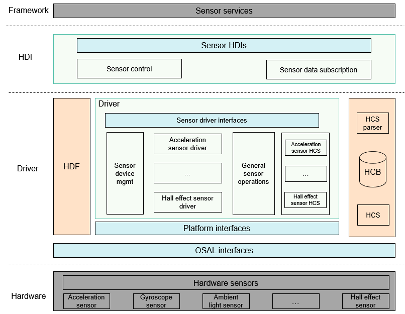

# Sensor<a name="EN-US_TOPIC_0000001078401780"></a>

-   [Overview](#section3634112111)
-   [Available APIs](#section20930112117478)
-   [How to Develop](#section1140943382)
-   [Development Example](#section257750691)
-   [Test Guidelines](#section106021256121219)

## Overview<a name="section3634112111"></a>

The sensor driver module provides APIs for upper-layer sensor services to implement basic sensor capabilities, including querying the sensor list, enabling or disabling a sensor, subscribing to or unsubscribing from sensor data, and setting sensor options. The sensor driver model is developed based on the Hardware Driver Foundation \(HDF\) and supports functions such as cross-OS migration and differentiated device configuration. The following figure shows the architecture of the sensor driver model.

**Figure  1**  Architecture of the sensor driver model<a name="fig10451455446"></a>  


The sensor driver model offers the following APIs:

-   Hardware Driver Interfaces \(HDIs\) for sensors: These HDIs facilitate service development.
-   APIs for implementing sensor driver model capabilities: These APIs implement the capabilities of registering, loading, and unregistering sensor drivers as well as detecting sensor devices depending on the HDF. The APIs include normalized APIs for sensor devices of the same type, APIs for parsing register configurations, abstract APIs for bus access, and abstract platform APIs.
-   APIs to be implemented by developers: Based on the HDF Configuration Source \(HCS\), developers can implement differentiated configuration for sensors of the same type and serialized configuration of sensor device parameters. Some sensor device operations can be abstracted as APIs to simplify sensor driver development.

## Available APIs<a name="section20930112117478"></a>

The following table lists the APIs provided by the sensor driver model.

**Table  1**  External APIs provided by the sensor driver model

<a name="table203963834718"></a>
<table><thead align="left"><tr id="row173964834716"><th class="cellrowborder" valign="top" width="8.260000000000002%" id="mcps1.2.4.1.1"><p id="p17401913133218"><a name="p17401913133218"></a><a name="p17401913133218"></a>Category</p>
</th>
<th class="cellrowborder" valign="top" width="45.4%" id="mcps1.2.4.1.2"><p id="p20921103144918"><a name="p20921103144918"></a><a name="p20921103144918"></a>API</p>
</th>
<th class="cellrowborder" valign="top" width="46.339999999999996%" id="mcps1.2.4.1.3"><p id="p109216317495"><a name="p109216317495"></a><a name="p109216317495"></a>Description</p>
</th>
</tr>
</thead>
<tbody><tr id="row4397198154712"><td class="cellrowborder" valign="top" width="8.260000000000002%" headers="mcps1.2.4.1.1 "><p id="p8437193673211"><a name="p8437193673211"></a><a name="p8437193673211"></a>Query</p>
</td>
<td class="cellrowborder" valign="top" width="45.4%" headers="mcps1.2.4.1.2 "><p id="p11001322173912"><a name="p11001322173912"></a><a name="p11001322173912"></a>int32_t <strong id="b935414557240"><a name="b935414557240"></a><a name="b935414557240"></a>GetAllSensors</strong>(struct SensorInformation **sensorInfo, int32_t *count)</p>
</td>
<td class="cellrowborder" valign="top" width="46.339999999999996%" headers="mcps1.2.4.1.3 "><p id="p199227318499"><a name="p199227318499"></a><a name="p199227318499"></a>Obtains information about all sensors in the system. The information about a sensor generally includes the sensor name, sensor vendor, firmware version, hardware version, sensor type ID, sensor ID, maximum measurement range, accuracy, and power.</p>
</td>
</tr>
<tr id="row1839716854716"><td class="cellrowborder" rowspan="5" valign="top" width="8.260000000000002%" headers="mcps1.2.4.1.1 "><p id="p06071477324"><a name="p06071477324"></a><a name="p06071477324"></a>Setting</p>
</td>
<td class="cellrowborder" valign="top" width="45.4%" headers="mcps1.2.4.1.2 "><p id="p38874252376"><a name="p38874252376"></a><a name="p38874252376"></a>int32_t <strong id="b199602219271"><a name="b199602219271"></a><a name="b199602219271"></a>Enable</strong>(int32_t sensorId)</p>
</td>
<td class="cellrowborder" valign="top" width="46.339999999999996%" headers="mcps1.2.4.1.3 "><p id="p5922331114916"><a name="p5922331114916"></a><a name="p5922331114916"></a>Enables the sensor that has been subscribed to. The subscriber can obtain the sensor data only after the sensor is enabled.</p>
</td>
</tr>
<tr id="row6397138134713"><td class="cellrowborder" valign="top" headers="mcps1.2.4.1.1 "><p id="p6923143184914"><a name="p6923143184914"></a><a name="p6923143184914"></a>int32_t <strong id="b84601875330"><a name="b84601875330"></a><a name="b84601875330"></a>Disable</strong>(int32_t sensorId)</p>
</td>
<td class="cellrowborder" valign="top" headers="mcps1.2.4.1.2 "><p id="p139231531184912"><a name="p139231531184912"></a><a name="p139231531184912"></a>Disables a sensor.</p>
</td>
</tr>
<tr id="row43981283476"><td class="cellrowborder" valign="top" headers="mcps1.2.4.1.1 "><p id="p992473112496"><a name="p992473112496"></a><a name="p992473112496"></a>int32_t <strong id="b16691194511438"><a name="b16691194511438"></a><a name="b16691194511438"></a>SetBatch</strong>(iint32_t sensorId, int64_t samplingInterval, int64_t reportInterval)</p>
</td>
<td class="cellrowborder" valign="top" headers="mcps1.2.4.1.2 "><p id="p14924203134910"><a name="p14924203134910"></a><a name="p14924203134910"></a>Sets the data sampling interval and data reporting interval for the specified sensor.</p>
</td>
</tr>
<tr id="row439813812472"><td class="cellrowborder" valign="top" headers="mcps1.2.4.1.1 "><p id="p170411511281"><a name="p170411511281"></a><a name="p170411511281"></a>int32_t <strong id="b170414153284"><a name="b170414153284"></a><a name="b170414153284"></a>SetMode</strong>(int32_t sensorTypeId, SensorUser *user, int32_t mode)</p>
</td>
<td class="cellrowborder" valign="top" headers="mcps1.2.4.1.2 "><p id="p107051159281"><a name="p107051159281"></a><a name="p107051159281"></a>Sets the data reporting mode for the specified sensor.</p>
</td>
</tr>
<tr id="row123998813470"><td class="cellrowborder" valign="top" headers="mcps1.2.4.1.1 "><p id="p492513120494"><a name="p492513120494"></a><a name="p492513120494"></a>int32_t <strong id="b7501191019330"><a name="b7501191019330"></a><a name="b7501191019330"></a>SetOption</strong>(int32_t sensorId, uint32_t option)</p>
</td>
<td class="cellrowborder" valign="top" headers="mcps1.2.4.1.2 "><p id="p5926031124914"><a name="p5926031124914"></a><a name="p5926031124914"></a>Sets options for the specified sensor, including its measurement range and accuracy.</p>
</td>
</tr>
<tr id="row939914814478"><td class="cellrowborder" rowspan="2" valign="top" width="8.260000000000002%" headers="mcps1.2.4.1.1 "><p id="p1039815743211"><a name="p1039815743211"></a><a name="p1039815743211"></a>Data subscription and unsubscription</p>
</td>
<td class="cellrowborder" valign="top" width="45.4%" headers="mcps1.2.4.1.2 "><p id="p11530101054411"><a name="p11530101054411"></a><a name="p11530101054411"></a>int32_t <strong id="b0569161217334"><a name="b0569161217334"></a><a name="b0569161217334"></a>Register</strong>(RecordDataCallback cb)</p>
</td>
<td class="cellrowborder" valign="top" width="46.339999999999996%" headers="mcps1.2.4.1.3 "><p id="p892633118493"><a name="p892633118493"></a><a name="p892633118493"></a>Registers the callback for reporting sensor data to the subscriber.</p>
</td>
</tr>
<tr id="row10716713314"><td class="cellrowborder" valign="top" headers="mcps1.2.4.1.1 "><p id="p196491214133110"><a name="p196491214133110"></a><a name="p196491214133110"></a>int32_t <strong id="b13758151483317"><a name="b13758151483317"></a><a name="b13758151483317"></a>Unregister</strong>(void)</p>
</td>
<td class="cellrowborder" valign="top" headers="mcps1.2.4.1.2 "><p id="p5817133119"><a name="p5817133119"></a><a name="p5817133119"></a>Unregisters the callback for reporting sensor data.</p>
</td>
</tr>
<tr id="row15679121655614"><td class="cellrowborder" rowspan="2" valign="top" width="8.260000000000002%" headers="mcps1.2.4.1.1 "><p id="p6596162112564"><a name="p6596162112564"></a><a name="p6596162112564"></a>Instance creation</p>
</td>
<td class="cellrowborder" valign="top" width="45.4%" headers="mcps1.2.4.1.2 "><p id="p13679191616561"><a name="p13679191616561"></a><a name="p13679191616561"></a>const struct SensorInterface *<strong id="b292451515"><a name="b292451515"></a><a name="b292451515"></a>NewSensorInterfaceInstance</strong>(void)</p>
</td>
<td class="cellrowborder" valign="top" width="46.339999999999996%" headers="mcps1.2.4.1.3 "><p id="p19679181612563"><a name="p19679181612563"></a><a name="p19679181612563"></a>Creates a <strong id="b10138658185717"><a name="b10138658185717"></a><a name="b10138658185717"></a>SensorInterface</strong> instance.</p>
</td>
</tr>
<tr id="row9680191675612"><td class="cellrowborder" valign="top" headers="mcps1.2.4.1.1 "><p id="p15680111655611"><a name="p15680111655611"></a><a name="p15680111655611"></a>int32_t <strong id="b1144297156"><a name="b1144297156"></a><a name="b1144297156"></a>FreeSensorInterfaceInstance</strong>(void)</p>
</td>
<td class="cellrowborder" valign="top" headers="mcps1.2.4.1.2 "><p id="p18680916165620"><a name="p18680916165620"></a><a name="p18680916165620"></a>Releases the <strong id="b4150124205810"><a name="b4150124205810"></a><a name="b4150124205810"></a>SensorInterface</strong> instance.</p>
</td>
</tr>
</tbody>
</table>

The following table lists the APIs provided by the sensor driver model for driver developers. You can directly call these APIs without any implementations.

**Table  2**  APIs provided by the sensor driver model for driver developers

<a name="table1156812588320"></a>
<table><thead align="left"><tr id="row756817584327"><th class="cellrowborder" valign="top" width="8.550855085508552%" id="mcps1.2.4.1.1"><p id="p7568125873219"><a name="p7568125873219"></a><a name="p7568125873219"></a>Category</p>
</th>
<th class="cellrowborder" valign="top" width="45.53455345534553%" id="mcps1.2.4.1.2"><p id="p1756812582328"><a name="p1756812582328"></a><a name="p1756812582328"></a>API</p>
</th>
<th class="cellrowborder" valign="top" width="45.91459145914592%" id="mcps1.2.4.1.3"><p id="p35681558183210"><a name="p35681558183210"></a><a name="p35681558183210"></a>Description</p>
</th>
</tr>
</thead>
<tbody><tr id="row756875811329"><td class="cellrowborder" rowspan="3" valign="top" width="8.550855085508552%" headers="mcps1.2.4.1.1 "><p id="p5974193991911"><a name="p5974193991911"></a><a name="p5974193991911"></a>Device management</p>
</td>
<td class="cellrowborder" valign="top" width="45.53455345534553%" headers="mcps1.2.4.1.2 "><p id="p18569158173210"><a name="p18569158173210"></a><a name="p18569158173210"></a>int32_t <strong id="b4994112595516"><a name="b4994112595516"></a><a name="b4994112595516"></a>AddSensorDevice</strong>(const struct SensorDeviceInfo *deviceInfo)</p>
</td>
<td class="cellrowborder" valign="top" width="45.91459145914592%" headers="mcps1.2.4.1.3 "><p id="p356935816328"><a name="p356935816328"></a><a name="p356935816328"></a>Adds a sensor of the current type to the sensor management module.</p>
</td>
</tr>
<tr id="row195691858113219"><td class="cellrowborder" valign="top" headers="mcps1.2.4.1.1 "><p id="p1156945883215"><a name="p1156945883215"></a><a name="p1156945883215"></a>int32_t <strong id="b1736762975518"><a name="b1736762975518"></a><a name="b1736762975518"></a>DeleteSensorDevice</strong>(int32_t sensorId)</p>
</td>
<td class="cellrowborder" valign="top" headers="mcps1.2.4.1.2 "><p id="p2569145833214"><a name="p2569145833214"></a><a name="p2569145833214"></a>Deletes a specified sensor from the sensor management module.</p>
</td>
</tr>
<tr id="row15699589321"><td class="cellrowborder" valign="top" headers="mcps1.2.4.1.1 "><p id="p6569105811328"><a name="p6569105811328"></a><a name="p6569105811328"></a>int32_t <strong id="b1174510321555"><a name="b1174510321555"></a><a name="b1174510321555"></a>ReportSensorEvent</strong>(const struct SensorReportEvent *events)</p>
</td>
<td class="cellrowborder" valign="top" headers="mcps1.2.4.1.2 "><p id="p15691858193220"><a name="p15691858193220"></a><a name="p15691858193220"></a>Reports data of a specified sensor type.</p>
</td>
</tr>
<tr id="row17569145814329"><td class="cellrowborder" rowspan="4" valign="top" width="8.550855085508552%" headers="mcps1.2.4.1.1 "><p id="p10589113932619"><a name="p10589113932619"></a><a name="p10589113932619"></a>Abstract bus and platform operations</p>
</td>
<td class="cellrowborder" valign="top" width="45.53455345534553%" headers="mcps1.2.4.1.2 "><p id="p145705585322"><a name="p145705585322"></a><a name="p145705585322"></a>int32_t <strong id="b15560203515558"><a name="b15560203515558"></a><a name="b15560203515558"></a>ReadSensor</strong>(struct SensorBusCfg *busCfg, uint16_t regAddr, uint8_t *data, uint16_t dataLen)</p>
</td>
<td class="cellrowborder" valign="top" width="45.91459145914592%" headers="mcps1.2.4.1.3 "><p id="p1657018586322"><a name="p1657018586322"></a><a name="p1657018586322"></a>Reads sensor configuration data from the sensor register based on the bus configuration.</p>
</td>
</tr>
<tr id="row28712021112011"><td class="cellrowborder" valign="top" headers="mcps1.2.4.1.1 "><p id="p38722218200"><a name="p38722218200"></a><a name="p38722218200"></a>int32_t <strong id="b573774595514"><a name="b573774595514"></a><a name="b573774595514"></a>WriteSensor</strong>(struct SensorBusCfg *busCfg, uint8_t *writeData, uint16_t len)</p>
</td>
<td class="cellrowborder" valign="top" headers="mcps1.2.4.1.2 "><p id="p6872112112201"><a name="p6872112112201"></a><a name="p6872112112201"></a>Writes sensor configuration data to the sensor register based on the bus configuration.</p>
</td>
</tr>
<tr id="row1667512682014"><td class="cellrowborder" valign="top" headers="mcps1.2.4.1.1 "><p id="p146751426192014"><a name="p146751426192014"></a><a name="p146751426192014"></a>int32_t <strong id="b4725135865517"><a name="b4725135865517"></a><a name="b4725135865517"></a>CreateSensorThread</strong>(struct OsalThread *thread, OsalThreadEntry threadEntry, char *name, void *entryPara)</p>
</td>
<td class="cellrowborder" valign="top" headers="mcps1.2.4.1.2 "><p id="p10676112612013"><a name="p10676112612013"></a><a name="p10676112612013"></a>Creates a scheduled thread for a specified sensor to process sensor data reporting.</p>
</td>
</tr>
<tr id="row1594017462410"><td class="cellrowborder" valign="top" headers="mcps1.2.4.1.1 "><p id="p49401442414"><a name="p49401442414"></a><a name="p49401442414"></a>void <strong id="b17586316565"><a name="b17586316565"></a><a name="b17586316565"></a>DestroySensorThread</strong>(struct OsalThread *thread, uint8_t *status);</p>
</td>
<td class="cellrowborder" valign="top" headers="mcps1.2.4.1.2 "><p id="p69406415243"><a name="p69406415243"></a><a name="p69406415243"></a>Destroys the scheduled thread created for the sensor.</p>
</td>
</tr>
<tr id="row19401042245"><td class="cellrowborder" valign="top" width="8.550855085508552%" headers="mcps1.2.4.1.1 "><p id="p694020492417"><a name="p694020492417"></a><a name="p694020492417"></a>Common configuration</p>
</td>
<td class="cellrowborder" valign="top" width="45.53455345534553%" headers="mcps1.2.4.1.2 "><p id="p1794064142418"><a name="p1794064142418"></a><a name="p1794064142418"></a>int32_t <strong id="b1740939195611"><a name="b1740939195611"></a><a name="b1740939195611"></a>SetSensorRegCfgArray</strong>(struct SensorBusCfg *busCfg, const struct SensorRegCfgGroupNode *group);</p>
</td>
<td class="cellrowborder" valign="top" width="45.91459145914592%" headers="mcps1.2.4.1.3 "><p id="p49409417249"><a name="p49409417249"></a><a name="p49409417249"></a>Sets the sensor register group configuration based on the sensor bus type.</p>
</td>
</tr>
<tr id="row1494015418246"><td class="cellrowborder" rowspan="5" valign="top" width="8.550855085508552%" headers="mcps1.2.4.1.1 "><p id="p185291624202618"><a name="p185291624202618"></a><a name="p185291624202618"></a>Configuration parsing</p>
<p id="p978482418524"><a name="p978482418524"></a><a name="p978482418524"></a></p>
</td>
<td class="cellrowborder" valign="top" width="45.53455345534553%" headers="mcps1.2.4.1.2 "><p id="p994194132410"><a name="p994194132410"></a><a name="p994194132410"></a>int32_t <strong id="b109631149171514"><a name="b109631149171514"></a><a name="b109631149171514"></a>GetSensorBaseConfigData</strong>(const struct DeviceResourceNode *node, struct SensorCfgData *config)</p>
</td>
<td class="cellrowborder" valign="top" width="45.91459145914592%" headers="mcps1.2.4.1.3 "><p id="p79411640248"><a name="p79411640248"></a><a name="p79411640248"></a>Obtains basic configuration information such as sensor, bus, and attribute configurations based on the HCS resource configuration of the sensor device, and initializes the basic configuration data structure.</p>
</td>
</tr>
<tr id="row1171817565518"><td class="cellrowborder" valign="top" headers="mcps1.2.4.1.1 "><p id="p7718165615113"><a name="p7718165615113"></a><a name="p7718165615113"></a>int32_t <strong id="b14392155271515"><a name="b14392155271515"></a><a name="b14392155271515"></a>ParseSensorRegConfig</strong>(struct SensorCfgData *config)</p>
</td>
<td class="cellrowborder" valign="top" headers="mcps1.2.4.1.2 "><p id="p171885685120"><a name="p171885685120"></a><a name="p171885685120"></a>Parses the register group information based on the HCS resource configuration of the sensor device and initializes the configuration data structure.</p>
</td>
</tr>
<tr id="row394144192414"><td class="cellrowborder" valign="top" headers="mcps1.2.4.1.1 "><p id="p99411144241"><a name="p99411144241"></a><a name="p99411144241"></a>void <strong id="b1322165619152"><a name="b1322165619152"></a><a name="b1322165619152"></a>ReleaseSensorAllRegConfig</strong>(struct SensorCfgData *config)</p>
</td>
<td class="cellrowborder" valign="top" headers="mcps1.2.4.1.2 "><p id="p17941154152419"><a name="p17941154152419"></a><a name="p17941154152419"></a>Releases the resources allocated to the sensor configuration data structure.</p>
</td>
</tr>
<tr id="row10589154102611"><td class="cellrowborder" valign="top" headers="mcps1.2.4.1.1 "><p id="p4557141217521"><a name="p4557141217521"></a><a name="p4557141217521"></a>int32_t <strong id="b1206195914157"><a name="b1206195914157"></a><a name="b1206195914157"></a>GetSensorBusHandle</strong>(struct SensorBusCfg *busCfg)</p>
</td>
<td class="cellrowborder" valign="top" headers="mcps1.2.4.1.2 "><p id="p953821245219"><a name="p953821245219"></a><a name="p953821245219"></a>Obtains the sensor bus handle information.</p>
</td>
</tr>
<tr id="row6784142455212"><td class="cellrowborder" valign="top" headers="mcps1.2.4.1.1 "><p id="p478492410522"><a name="p478492410522"></a><a name="p478492410522"></a>int32_t <strong id="b9443344101610"><a name="b9443344101610"></a><a name="b9443344101610"></a>ReleaseSensorBusHandle</strong>(struct SensorBusCfg *busCfg)</p>
</td>
<td class="cellrowborder" valign="top" headers="mcps1.2.4.1.2 "><p id="p1878422485212"><a name="p1878422485212"></a><a name="p1878422485212"></a>Releases the sensor bus handle information.</p>
</td>
</tr>
</tbody>
</table>

The following table lists the APIs that need to be implemented by driver developers.

**Table  3**  APIs that need to be implemented by driver developers

<a name="table1083014911336"></a>
<table><thead align="left"><tr id="row208301997332"><th class="cellrowborder" valign="top" width="8.41084108410841%" id="mcps1.2.4.1.1"><p id="p1777364318152"><a name="p1777364318152"></a><a name="p1777364318152"></a>Category</p>
</th>
<th class="cellrowborder" valign="top" width="45.77457745774577%" id="mcps1.2.4.1.2"><p id="p5773174317157"><a name="p5773174317157"></a><a name="p5773174317157"></a>API</p>
</th>
<th class="cellrowborder" valign="top" width="45.81458145814582%" id="mcps1.2.4.1.3"><p id="p1777319437155"><a name="p1777319437155"></a><a name="p1777319437155"></a>Description</p>
</th>
</tr>
</thead>
<tbody><tr id="row1880425111572"><td class="cellrowborder" rowspan="8" valign="top" width="8.41084108410841%" headers="mcps1.2.4.1.1 "><p id="p598171454520"><a name="p598171454520"></a><a name="p598171454520"></a>Basic functions</p>
</td>
<td class="cellrowborder" valign="top" width="45.77457745774577%" headers="mcps1.2.4.1.2 "><p id="p880485195711"><a name="p880485195711"></a><a name="p880485195711"></a>int32_t <strong id="b16497123107"><a name="b16497123107"></a><a name="b16497123107"></a>init</strong>(void)</p>
</td>
<td class="cellrowborder" valign="top" width="45.81458145814582%" headers="mcps1.2.4.1.3 "><p id="p1480465165710"><a name="p1480465165710"></a><a name="p1480465165710"></a>Initializes the configuration of a sensor device after it is detected.</p>
</td>
</tr>
<tr id="row10831296333"><td class="cellrowborder" valign="top" headers="mcps1.2.4.1.1 "><p id="p1783115910333"><a name="p1783115910333"></a><a name="p1783115910333"></a>int32_t <strong id="b146831650010"><a name="b146831650010"></a><a name="b146831650010"></a>GetInfo</strong>(struct SensorBasicInfo *info)</p>
</td>
<td class="cellrowborder" valign="top" headers="mcps1.2.4.1.2 "><p id="p4831139153316"><a name="p4831139153316"></a><a name="p4831139153316"></a>Obtains the basic information about the current sensor device from the HCS of sensor devices.</p>
</td>
</tr>
<tr id="row178311493339"><td class="cellrowborder" valign="top" headers="mcps1.2.4.1.1 "><p id="p208318963320"><a name="p208318963320"></a><a name="p208318963320"></a>int32_t <strong id="b189921571402"><a name="b189921571402"></a><a name="b189921571402"></a>Enable</strong>(void)</p>
</td>
<td class="cellrowborder" valign="top" headers="mcps1.2.4.1.2 "><p id="p68310953312"><a name="p68310953312"></a><a name="p68310953312"></a>Enables the current sensor device by delivering the register configuration in the operation group based on the HCS of the current sensor device.</p>
</td>
</tr>
<tr id="row0831129153318"><td class="cellrowborder" valign="top" headers="mcps1.2.4.1.1 "><p id="p0831169183314"><a name="p0831169183314"></a><a name="p0831169183314"></a>int32_t <strong id="b13541291106"><a name="b13541291106"></a><a name="b13541291106"></a>Disable</strong>(void)</p>
</td>
<td class="cellrowborder" valign="top" headers="mcps1.2.4.1.2 "><p id="p138314912336"><a name="p138314912336"></a><a name="p138314912336"></a>Disables the current sensor device by delivering the register configuration in the operation group based on the HCS of the current sensor device.</p>
</td>
</tr>
<tr id="row178311093334"><td class="cellrowborder" valign="top" headers="mcps1.2.4.1.1 "><p id="p583118920338"><a name="p583118920338"></a><a name="p583118920338"></a>int32_t <strong id="b111117118017"><a name="b111117118017"></a><a name="b111117118017"></a>SetBatch</strong>(int64_t samplingInterval, int64_t reportInterval)</p>
</td>
<td class="cellrowborder" valign="top" headers="mcps1.2.4.1.2 "><p id="p08311903315"><a name="p08311903315"></a><a name="p08311903315"></a>Sets the processing time of the data reporting thread for the current sensor device based on the data sampling interval and data reporting interval.</p>
</td>
</tr>
<tr id="row1356419421422"><td class="cellrowborder" valign="top" headers="mcps1.2.4.1.1 "><p id="p9565174218421"><a name="p9565174218421"></a><a name="p9565174218421"></a>int32_t <strong id="b13702551143412"><a name="b13702551143412"></a><a name="b13702551143412"></a>SetMode</strong>(int32_t mode)</p>
</td>
<td class="cellrowborder" valign="top" headers="mcps1.2.4.1.2 "><p id="p356524224213"><a name="p356524224213"></a><a name="p356524224213"></a>Sets the data reporting mode of the current sensor device.</p>
</td>
</tr>
<tr id="row12565104264215"><td class="cellrowborder" valign="top" headers="mcps1.2.4.1.1 "><p id="p17565104210429"><a name="p17565104210429"></a><a name="p17565104210429"></a>int32_t <strong id="b96811512011"><a name="b96811512011"></a><a name="b96811512011"></a>SetOption</strong>(uint32_t option)</p>
</td>
<td class="cellrowborder" valign="top" headers="mcps1.2.4.1.2 "><p id="p4565104214213"><a name="p4565104214213"></a><a name="p4565104214213"></a>Sets the register configuration such as the measurement range and accuracy based on sensor options.</p>
</td>
</tr>
<tr id="row380240111218"><td class="cellrowborder" valign="top" headers="mcps1.2.4.1.1 "><p id="p1181184016120"><a name="p1181184016120"></a><a name="p1181184016120"></a>void <strong id="b1613451717016"><a name="b1613451717016"></a><a name="b1613451717016"></a>ReadSensorData</strong>(void)</p>
</td>
<td class="cellrowborder" valign="top" headers="mcps1.2.4.1.2 "><p id="p7815401121"><a name="p7815401121"></a><a name="p7815401121"></a>Reads sensor data.</p>
</td>
</tr>
</tbody>
</table>

For details about the API implementation, see  [Development Example](#section257750691).

## How to Develop<a name="section1140943382"></a>

Regardless of the OS and system on a chip \(SoC\), the sensor driver is developed based on the HDF, platform, and OSAL APIs to provide a unified driver model for sensor devices. This section uses the acceleration sensor as an example to describe how to develop a sensor driver.

1.  Register the acceleration sensor driver. The HDF provides a unified driver management model. The HDF identifies and loads the target module driver based on the configuration of the acceleration sensor module.
2.  Initialize and deinitialize the acceleration sensor driver. Using the  **init**  function, the HDF starts loading the sensor device driver and allocating configuration resources for sensor device data, respectively. Using the  **release**  function, the HDF releases the resources and configurations loaded by the driver.
3.  Parse the configurations of the acceleration sensor register group. For different types of sensors, you must configure their respective HCS configuration files in the HCS, check whether the sensor device is in position during the device driver startup, and then load the corresponding configuration file to generate the configuration structure object.
4.  Implement APIs for acceleration sensor driver operations. The driver APIs for various types of sensors, such as  **init**,  **GetInfo**,  **Enable**,  **Disable**,  **SetBatch**,  **SetMode**,  **SetOption**, and  **ReadSensorData**, are normalized to deliver sensor driver configurations and report sensor data.

> **NOTE:** 
>The sensor driver model provides a collection of APIs to implement sensor driver capabilities, including the driver device management, abstract bus and platform operation, general configuration, and configuration parsing capabilities. For details about the APIs, see  [Table 2](#table1156812588320). You need to implement the following APIs: some operations to perform on sensors \([Table 3](#table1083014911336)\), differentiated data configuration of the sensor HCS, and verification of basic driver functions.

## Development Example<a name="section257750691"></a>

This section uses a code example to demonstrate how to load and start the acceleration sensor driver based on the HDF driver model. For details about the mechanism, see  [Driver Development](driver-hdf-development.md). This example uses the Bosch BMI160 acceleration sensor that communicates over I2C.

1.  Register the driver entry of the acceleration sensor.

-   Implementation of the entry function

```
/* Register the entry structure object of the acceleration sensor. */
struct HdfDriverEntry g_sensorAccelDevEntry = {
    .moduleVersion = 1, /* Version of the acceleration sensor module */
    .moduleName = "HDF_SENSOR_ACCEL", /* Name of the acceleration sensor module. The value must be the same as that of moduleName in the device_info.hcs file. */
    .Bind = BindAccelDriver, /* Binding function of the acceleration sensor */
    .Init = InitAccelDriver, /* Initialization function of the acceleration sensor */
    .Release = ReleaseAccelDriver, /* Resource release function of the acceleration sensor */
};

/* Call HDF_INIT to register the driver entry with the HDF. When loading the driver, the HDF calls the Bind function first and then the Init function. If the Init function fails to be called, the HDF will call Release to release the driver resource and exit.
HDF_INIT(g_sensorAccelDevEntry);
```

-   Acceleration sensor configuration

The acceleration sensor model uses the HCS as the configuration source code. For details about the HCS configuration fields, see  [Driver Configuration Management](driver-hdf-manage.md).

```
/* HCS configuration of the acceleration sensor device */
device_sensor_accel :: device {
    device0 :: deviceNode {
        policy = 1; /* Policy for providing the driver service */
        priority = 105; /* Driver startup priority (0–200). A larger value indicates a lower priority. The default value 100 is recommended. The sequence for loading devices with the same priority is random. */
        preload = 2; /* Field for specifying whether to load the driver. The value 0 means to load the driver, and 2 means the opposite. */
        permission = 0664; /* Permission for the driver to create device nodes */
        moduleName = "HDF_SENSOR_ACCEL"; /* Driver name. The value must be the same as that of moduleName in the driver entry structure. */
        serviceName = "sensor_accel"; /* Name of the service provided by the driver. The name must be unique. */
        deviceMatchAttr = "hdf_sensor_accel_driver"; /* Keyword matching the private data of the driver. The value must be the same as that of match_attr in the private data configuration table of the driver. */
    }
} 
```

1.  Initialize and deinitialize the acceleration sensor driver.

-   Initialization entry function  **init**

```
/* Bind the service provided by the acceleration sensor driver to the HDF. */
int32_t BindAccelDriver(struct HdfDeviceObject *device)
{
    CHECK_NULL_PTR_RETURN_VALUE(device, HDF_ERR_INVALID_PARAM);

    static struct IDeviceIoService service = {
        .object = {0},
        .Dispatch = DispatchAccel,
    };
    device->service = &service;

    return HDF_SUCCESS;
}
/* After detecting that the device is in position, call RegisterAccelChipOps to register the differentiation adaptation function. */
int32_t RegisterAccelChipOps(struct AccelOpsCall *ops)
{
    struct AccelDrvData *drvData = NULL;

    CHECK_NULL_PTR_RETURN_VALUE(ops, HDF_ERR_INVALID_PARAM);

    drvData = AccelGetDrvData();
    drvData->ops.Init = ops->Init;
    drvData->ops.ReadData = ops->ReadData;
    return HDF_SUCCESS;
}
/* Hook the acceleration sensor driver normalization function. */
static int32_t InitAccelOps(struct SensorDeviceInfo *deviceInfo)
{
    struct AccelDrvData *drvData = AccelGetDrvData();

    (void)memset_s((void *)deviceInfo, sizeof(*deviceInfo), 0, sizeof(*deviceInfo));
    deviceInfo->ops.GetInfo = SetAccelInfo;
    deviceInfo->ops.Enable = SetAccelEnable;
    deviceInfo->ops.Disable = SetAccelDisable;
    deviceInfo->ops.SetBatch = SetAccelBatch;
    deviceInfo->ops.SetMode = SetAccelMode;
    deviceInfo->ops.SetOption = SetAccelOption;

    if (memcpy_s(&deviceInfo->sensorInfo, sizeof(deviceInfo->sensorInfo),
        &drvData->accelCfg->sensorInfo, sizeof(drvData->accelCfg->sensorInfo)) != EOK) {
        HDF_LOGE("%s: copy sensor info failed", __func__);
        return HDF_FAILURE;
    }
    /* The sensor type ID can be configured in the HCS configuration file or here. */
    drvData->accelCfg->sensorInfo.sensorTypeId = SENSOR_TAG_ACCELEROMETER;
    drvData->accelCfg->sensorInfo.sensorId = SENSOR_TAG_ACCELEROMETER;

    return HDF_SUCCESS;
}
/* Initialize the sensor register. */
static int32_t InitAccelAfterConfig(void)
{
    struct SensorDeviceInfo deviceInfo;

    if (InitAccelConfig() != HDF_SUCCESS) {
        HDF_LOGE("%s: init accel config failed", __func__);
        return HDF_FAILURE;
    }

    if (InitAccelOps(&deviceInfo) != HDF_SUCCESS) {
        HDF_LOGE("%s: init accel ops failed", __func__);
        return HDF_FAILURE;
    }

    if (AddSensorDevice(&deviceInfo) != HDF_SUCCESS) {
        HDF_LOGE("%s: add accel device failed", __func__);
        return HDF_FAILURE;
    }

    return HDF_SUCCESS;
}
/* Call the device detection function to hook the differentiated device function. */
static int32_t DetectAccelChip(void)
{
    int32_t num;
    int32_t ret;
    int32_t loop;
    struct AccelDrvData *drvData = AccelGetDrvData();
    CHECK_NULL_PTR_RETURN_VALUE(drvData->accelCfg, HDF_ERR_INVALID_PARAM);

    num = sizeof(g_accelDetectIfList) / sizeof(g_accelDetectIfList[0]);
    for (loop = 0; loop < num; ++loop) {
        if (g_accelDetectIfList[loop].DetectChip != NULL) {
            ret = g_accelDetectIfList[loop].DetectChip(drvData->accelCfg);
            if (ret == HDF_SUCCESS) {
                drvData->detectFlag = true;
                break;
            }
        }
    }

    if (loop == num) {
        HDF_LOGE("%s: detect accel device failed", __func__);
        drvData->detectFlag = false;
        return HDF_FAILURE;
    }
    return HDF_SUCCESS;
}
/* The entry function of the acceleration sensor driver is used to initialize the structure object of the sensor private data, allocate space for the HCS data configuration object of the sensor, invoke the entry function for initializing the sensor HCS data configuration, detect whether the sensor device is in position, create the sensor data reporting timer, implement the sensor normalization API, and register the sensor device. */
int32_t InitAccelDriver(struct HdfDeviceObject *device)
{
    /* Obtain the private data structure object of the sensor. */
    struct AccelDrvData *drvData = AccelGetDrvData();

   /* When detecting sensors of the same type from different vendors, the function checks whether this type of sensors is in position. If yes, it no longer detects the other sensors of this type and directly returns the result. */
    if (drvData->detectFlag) {
        HDF_LOGE("%s: accel sensor have detected", __func__);
        return HDF_SUCCESS;
    }

    CHECK_NULL_PTR_RETURN_VALUE(device, HDF_ERR_INVALID_PARAM);
    /* Allocate space for the private data structure objects for storing sensor data configurations. The allocated space needs to be released when the driver is released. */
        drvData->accelCfg = (struct SensorCfgData *)OsalMemCalloc(sizeof(*cfg));
        if (drvData->accelCfg == NULL) {
            HDF_LOGE("%s: malloc sensor config data failed", __func__);
            return HDF_FAILURE;
        }
  
    drvData->accelCfg->regCfgGroup = &g_regCfgGroup[0];
    /* Initializing the sensor configuration data aims to parse the configuration information of the sensor communication bus, basic sensor information, sensor attributes, whether the sensor is in position, and register group information. */
    if (GetSensorBaseConfigData(device->property, drvData->accelCfg) != HDF_SUCCESS) {
        HDF_LOGE("%s: get sensor base config failed", __func__);
        goto Base_CONFIG_EXIT;
    }

    if (DetectAccelChip() != HDF_SUCCESS) {
        HDF_LOGE("%s: accel sensor detect device no exist", __func__);
        goto DETECT_CHIP_EXIT;
    }
    drvData->detectFlag = true;
    if (ParseSensorRegConfig(drvData->accelCfg) != HDF_SUCCESS) {
        HDF_LOGE("%s: detect sensor device failed", __func__);
        goto REG_CONFIG_EXIT;
    }

    if (InitAccelAfterConfig() != HDF_SUCCESS) {
        HDF_LOGE("%s: init accel after config failed", __func__);
        goto INIT_EXIT;
    }

    HDF_LOGI("%s: init accel driver success", __func__);
    return HDF_SUCCESS;

INIT_EXIT:
    DestroySensorThread(&drvData->thread, &drvData->threadStatus);
    (void)DeleteSensorDevice(SENSOR_TAG_ACCELEROMETER);
REG_CONFIG_EXIT:
    ReleaseSensorAllRegConfig(drvData->accelCfg);
    (void)ReleaseSensorBusHandle(&drvData->accelCfg->busCfg);
DETECT_CHIP_EXIT:
    drvData->detectFlag = false;
BASE_CONFIG_EXIT:
    drvData->accelCfg->root = NULL;
    drvData->accelCfg->regCfgGroup = NULL;
    OsalMemFree(drvData->accelCfg);
    drvData->accelCfg = NULL;
    return HDF_FAILURE;
}

/* Release the resources allocated during driver initialization. */
void ReleaseAccelDriver(struct HdfDeviceObject *device)
{
    (void)device;
    struct AccelDrvData *drvData = NULL;

    drvData = AccelGetDrvData();
    (void)DestroySensorThread(&drvData->thread, &drvData->threadStatus);
    (void)DeleteSensorDevice(SENSOR_TAG_ACCELEROMETER);
    drvData->detectFlag = false;

    if (drvData->accelCfg != NULL) {
        drvData->accelCfg->root = NULL;
        drvData->accelCfg->regCfgGroup = NULL;
        ReleaseSensorAllRegConfig(drvData->accelCfg);
        (void)ReleaseSensorBusHandle(&drvData->accelCfg->busCfg);
        OsalMemFree(drvData->accelCfg);
        drvData->accelCfg = NULL;
    }

    drvData->initStatus = false;
}
```

1.  Configure the acceleration sensor register group.

You only need to configure the acceleration sensor data according to the template. Template configuration parsing has been implemented via the  **InitSensorConfigData**  function and only needs to be called during initialization. If new configuration items are added, you need to modify this function accordingly.

```
Acceleration sensor data configuration template (accel_config.hcs)
root {
    sensorAccelConfig {
        accelChipConfig {
            /* Sensor information template */
            template sensorInfo {
                sensorName = "accelerometer"; /* Acceleration sensor name. The value contains a maximum of 16 bytes. */
                vendorName = "borsh_bmi160"; /* Sensor vendor name. The value contains a maximum of 16 bytes. */
                firmwareVersion = "1.0"; /* Sensor firmware version. The default value is 1.0. The value contains a maximum of 16 bytes. */
                hardwareVersion = "1.0"; /* Sensor hardware version. The default value is 1.0. The value contains a maximum of 16 bytes. */
                sensorTypeId = 1; /* Sensor type ID. For details, see SensorTypeTag. */
                sensorId = 1; /* Sensor ID, which is defined by the sensor driver developer. The SensorTypeTag enums are recommended. */
                maxRange = 8; /* Maximum measurement range of the sensor. Set this parameter based on your business requirements. */
                precision = 0; /* Sensor accuracy, which is used together with sensor data reporting. For details, see SensorEvents. */
                power = 230; /* Power consumption of the sensor */
            }
            /* Template of the bus type and configuration information used by the sensor */
            template sensorBusConfig {
                busType = 0; /* 0:i2c 1:spi */ 
                busNum = 6; /* Device ID allocated to the sensor on the chip */
                busAddr = 0; /* Address allocated to the sensor on the chip */
                regWidth = 1; /* Width of the sensor register address */
                regBigEndian = 0; /* Endian mode of the sensor register */
            }
            /* Sensor attribute template */
            template sensorAttr {
                chipName = ""; /* Sensor chip name */
                chipIdRegister = 0xf; /* Address of the register detecting whether the sensor is in position */
                chipIdValue = 0xd1; /* Value of the register detecting whether the sensor is in position */
            }
        }
    }
}

/* You can modify the template configuration based on the differences of sensor devices. If no modification is made, the default template configuration is used. */
root {
    sensorAccelConfig {
        accel_bmi160_chip_config : accelChipConfig {
            match_attr = "hdf_sensor_accel_driver"; /* The value must be the same as the match_attr field configured for the acceleration sensor. */
            accelInfo :: sensorInfo {
                vendorName = "borsh_bmi160";
                sensorTypeId = 1;
                sensorId = 1;
            }
            accelBusConfig :: sensorBusConfig {
                busType = 0; /* I2C communication mode */
                busNum = 6;
                busAddr = 0x68;
                regWidth = 1; /* 1-byte bit width */
            }
            accelAttr :: sensorAttr {
                chipName = "bmi160";
                chipIdRegister = 0x00;
                chipIdValue = 0xd1;
            }
            accelRegConfig {
                /*  regAddr: Register address
                    value: Register value
                    mask: Mask of the register value
                    len: Length (in bytes) of the register value
                    delay: Register delay (in milliseconds)
                    opsType: Operation type. The options can be 0 (no operation), 1 (read), 2 (write), 3 (read and check), and 4 (bit update).
                    calType: Calculation type. The options can be 0 (none), 1 (write), 2 (negate), 3 (XOR) 4, (left shift), and 5 (right shift).
                    shiftNum: Number of shifts
                    debug: Debugging switch. The value can be 0 (disabled) or 1 (enabled).
                    save: Data saving switch. The value can be 0 (not save data) or 1 (save data).
                */
                /* Groups of sensor register operations. Registers can be configured in sequence based on the groups. */
                /* Register address, register value, mask of the register value, data length of the register value, register delay, operation type, calculation type, number of shifts, debugging switch, data saving switch */
                /* Initialize the register groups. */
                initSeqConfig = [
                    0x7e,    0xb6, 0xff,   1,     5,       2,       0,        0,     0,    0,
                    0x7e,    0x10, 0xff,   1,     5,       2,       0,        0,     0,    0
                ];
                /* Enable the register groups. */
                enableSeqConfig = [
                    0x7e,    0x11, 0xff,   1,     5,       2,       0,        0,     0,    0,
                    0x41,    0x03, 0xff,   1,     0,       2,       0,        0,     0,    0,
                    0x40,    0x08, 0xff,   1,     0,       2,       0,        0,     0,    0
                ];
                /* Disable the register groups. */
                disableSeqConfig = [
                    0x7e,    0x10, 0xff,   1,     5,       2,       0,        0,     0,    0
                ];
            }
        }
    }
}
```

1.  Implement APIs for acceleration sensor driver operations.

You need to implement normalized APIs based on sensor types.

```
/* Leave a function empty if it is not used. */
static int32_t SetAccelInfo(struct SensorBasicInfo *info)
{
    (void)info;

    return HDF_ERR_NOT_SUPPORT;
}
/* Deliver the configuration of enabling the register groups. */
static int32_t SetAccelEnable(void)
{
    int32_t ret;
    struct AccelDrvData *drvData = AccelGetDrvData();

    CHECK_NULL_PTR_RETURN_VALUE(drvData->accelCfg, HDF_ERR_INVALID_PARAM);
    ret = SetSensorRegCfgArray(&drvData->accelCfg->busCfg, drvData->accelCfg->regCfgGroup[SENSOR_ENABLE_GROUP]);
    if (ret != HDF_SUCCESS) {
        HDF_LOGE("%s: accel sensor disable config failed", __func__);
        return HDF_FAILURE;
    }

    drvData->threadStatus = SENSOR_THREAD_RUNNING;

    return HDF_SUCCESS;
}
/* Deliver the configuration of disabling the register groups. */
static int32_t SetAccelDisable(void)
{
    int32_t ret;
    struct AccelDrvData *drvData = AccelGetDrvData();

    CHECK_NULL_PTR_RETURN_VALUE(drvData->accelCfg, HDF_ERR_INVALID_PARAM);

    ret = SetSensorRegCfgArray(&drvData->accelCfg->busCfg, drvData->accelCfg->regCfgGroup[SENSOR_DISABLE_GROUP]);
    if (ret != HDF_SUCCESS) {
        HDF_LOGE("%s: accel sensor disable config failed", __func__);
        return HDF_FAILURE;
        }

    drvData->threadStatus = SENSOR_THREAD_STOPPED;

    return HDF_SUCCESS;
}
/* Set the sampling interval and data reporting interval of the sensor. */
static int32_t SetAccelBatch(int64_t samplingInterval, int64_t interval)
{
    (void)interval;

    struct AccelDrvData *drvData = AccelGetDrvData();
    drvData->interval = samplingInterval;

    return HDF_SUCCESS;
}
/* Set the data reporting mode of the sensor. Currently, the real-time mode is supported. */
static int32_t SetAccelMode(int32_t mode)
{
    return (mode == SENSOR_WORK_MODE_REALTIME) ? HDF_SUCCESS : HDF_FAILURE;
}
/* Set the sensor options. */
static int32_t SetAccelOption(uint32_t option)
{
    (void)option;
    return HDF_ERR_NOT_SUPPORT;
}
```

-   Differentiated processing APIs 

    ```
    /* If a device is detected, register the differentiated processing function to the accel driver model. */
    int32_t DetectAccelBim160Chip(struct SensorCfgData *data)
    {
        int32_t ret;
        struct AccelOpsCall ops;
        CHECK_NULL_PTR_RETURN_VALUE(data, HDF_ERR_INVALID_PARAM);
    
        if (strcmp(ACCEL_CHIP_NAME_BMI160, data->sensorAttr.chipName) != 0) {
            return HDF_SUCCESS;
        }
        ret = InitAccelPreConfig();
        if (ret != HDF_SUCCESS) {
            HDF_LOGE("%s: init  BMI160 bus mux config", __func__);
            return HDF_FAILURE;
        }
        if (DetectSensorDevice(data) != HDF_SUCCESS) {
            return HDF_FAILURE;
        }
    
       /* Differentiated processing function */
        ops.Init = InitBmi160;
        ops.ReadData = ReadBmi160Data;
        ret = RegisterAccelChipOps(&ops);
        if (ret != HDF_SUCCESS) {
            HDF_LOGE("%s: register BMI160 accel failed", __func__);
            (void)ReleaseSensorBusHandle(&data->busCfg);
            return HDF_FAILURE;
        }
        return HDF_SUCCESS;
    }
    /* Initialization processing function */
    static int32_t InitBmi160(struct SensorCfgData *data)
    {
        int32_t ret;
    
        CHECK_NULL_PTR_RETURN_VALUE(data, HDF_ERR_INVALID_PARAM);
        ret = SetSensorRegCfgArray(&data->busCfg, data->regCfgGroup[SENSOR_INIT_GROUP]);
        if (ret != HDF_SUCCESS) {
            HDF_LOGE("%s: bmi160 sensor init config failed", __func__);
            return HDF_FAILURE;
        }
        return HDF_SUCCESS;
    }
    /* Data processing function */
    int32_t ReadBmi160Data(struct SensorCfgData *data)
    {
        int32_t ret;
        struct AccelData  rawData = { 0, 0, 0 };
        int32_t tmp[ACCEL_AXIS_NUM];
        struct SensorReportEvent event;
    
        (void)memset_s(&event, sizeof(event), 0, sizeof(event));
    
        ret = ReadBmi160RawData(data, &rawData, &event.timestamp);
        if (ret != HDF_SUCCESS) {
            return HDF_FAILURE;
        }
    
        event.sensorId = SENSOR_TAG_ACCELEROMETER;
        event.option = 0;
        event.mode = SENSOR_WORK_MODE_REALTIME;
    
        rawData.x = rawData.x * BMI160_ACC_SENSITIVITY_2G;
        rawData.y = rawData.y * BMI160_ACC_SENSITIVITY_2G;
        rawData.z = rawData.z * BMI160_ACC_SENSITIVITY_2G;
    
        tmp[ACCEL_X_AXIS] = (rawData.x * SENSOR_1K_UNIT) / SENSOR_CONVERT_UNIT;
        tmp[ACCEL_Y_AXIS] = (rawData.y * SENSOR_1K_UNIT) / SENSOR_CONVERT_UNIT;
        tmp[ACCEL_Z_AXIS] = (rawData.z * SENSOR_1K_UNIT) / SENSOR_CONVERT_UNIT;
    
        event.dataLen = sizeof(tmp);
        event.data = (uint8_t *)&tmp;
        ret = ReportSensorEvent(&event);
        return ret;
    }
    ```

-   Data processing function

Create a sensor timer to periodically sample data based on the configured sampling interval and report the data to the data subscriber.

```
/* Scheduled working thread of the sensor */
static int32_t ReadAccelDataThreadWorker(void *arg)
{
    (void)arg;
    int64_t interval;
    struct AccelDrvData *drvData = AccelGetDrvData();

    drvData->threadStatus = SENSOR_THREAD_START;
    while (true) {
        if (drvData->threadStatus == SENSOR_THREAD_RUNNING) {
            if (drvData->ops.ReadData != NULL) {
                (void)drvData->ops.ReadData(drvData->accelCfg);
            }
            interval = OsalDivS64(drvData->interval, (SENSOR_CONVERT_UNIT * SENSOR_CONVERT_UNIT));
            OsalMSleep(interval);
        } else if (drvData->threadStatus == SENSOR_THREAD_DESTROY) {
            break;
        } else {
            OsalMSleep(ACC_DEFAULT_SAMPLING_200_MS / SENSOR_CONVERT_UNIT / SENSOR_CONVERT_UNIT);
        }

        if ((!drvData->initStatus) || (drvData->interval < 0) || drvData->threadStatus != SENSOR_THREAD_RUNNING) {
            continue;
        }
    }

    return HDF_SUCCESS;
}
/* Create a sensor timer and initialize the sensor device. */
static int32_t InitAccelConfig(void)
{
    int32_t ret;
    struct AccelDrvData *drvData = AccelGetDrvData();

    if (drvData->threadStatus != SENSOR_THREAD_NONE && drvData->threadStatus != SENSOR_THREAD_DESTROY) {
        HDF_LOGE("%s: accel thread have created", __func__);
        return HDF_SUCCESS;
    }

    ret = CreateSensorThread(&drvData->thread, ReadAccelDataThreadWorker, "hdf_sensor_accel", drvData);
    if (ret != HDF_SUCCESS) {
        HDF_LOGE("%s: accel create thread failed", __func__);
        drvData->threadStatus = SENSOR_THREAD_NONE;
        return HDF_FAILURE;
    }

    CHECK_NULL_PTR_RETURN_VALUE(drvData->ops.Init, HDF_ERR_INVALID_PARAM);

    ret = drvData->ops.Init(drvData->accelCfg);
    if (ret != HDF_SUCCESS) {
        HDF_LOGE("%s: accel create thread failed", __func__);
        drvData->threadStatus = SENSOR_THREAD_NONE;
        return HDF_FAILURE;
    }
    drvData->initStatus = true;
    return HDF_SUCCESS;
}
```

-   Major data structures

```
/* Sensor conversion units */
#define SENSOR_CONVERT_UNIT             1000
#define SENSOR_1K_UNIT                  1024
/* Sensitivity conversion value of the sensor with a 2g measurement range */
#define BMI160_ACC_SENSITIVITY_2G       61
/* Address of the sensor data sampling register */
#define BMI160_ACCEL_X_LSB_ADDR              0X12
#define BMI160_ACCEL_X_MSB_ADDR              0X13
#define BMI160_ACCEL_Y_LSB_ADDR              0X14
#define BMI160_ACCEL_Y_MSB_ADDR              0X15
#define BMI160_ACCEL_Z_LSB_ADDR              0X16
#define BMI160_ACCEL_Z_MSB_ADDR              0X17
/* Data dimension of the sensor */
enum AccelAxisNum {
    ACCEL_X_AXIS   = 0,
    ACCEL_Y_AXIS   = 1,
    ACCEL_Z_AXIS   = 2,
    ACCEL_AXIS_NUM = 3,
};
/* Each dimension of the sensor */
struct AccelData {
    int32_t x;
    int32_t y;
    int32_t z;
};
/* Private data structure of the sensor */
struct AccelDrvData {
    bool detectFlag;
    uint8_t threadStatus;
    uint8_t initStatus;
    int64_t interval;
    struct SensorCfgData *accelCfg;
    struct OsalThread thread;
    struct AccelOpsCall ops;
};
/* Differentiation adaptation function */
struct AccelOpsCall {
    int32_t (*Init)(struct SensorCfgData *data);
    int32_t (*ReadData)(struct SensorCfgData *data);
};
```

## Test Guidelines<a name="section106021256121219"></a>

After the driver is developed, you can develop self-test cases in the sensor unit test to verify the basic functions of the driver. The developer self-test platform is used as the test environment.

```
/* Specify whether to report sensor data. */
static int32_t g_sensorDataFlag = 0;
/* Retain the address of the sensor interface instance. */
static const struct SensorInterface *g_sensorDev = nullptr;

/* Register the data reporting function. */
static int SensorTestDataCallback(struct SensorEvents *event)
{
    if (event == nullptr) {
        return -1;
    }
    float *data = (float*)event->data;
    printf("time [%lld] sensor id [%d] x-[%f] y-[%f] z-[%f]\n\r", event->timestamp,
        event->sensorId, (*data), *(data + 1), *(data + g_axisZ));
    if (*data > 1e-5) {
        g_sensorDataFlag = 1;
    }
    return 0;
}
/* Initialize the sensor interface instance before executing the test cases. */
void HdfSensorTest::SetUpTestCase()
{
    g_sensorDev = NewSensorInterfaceInstance();
    if (g_sensorDev == nullptr) {
        printf("test sensorHdi get Module instace failed\n\r");
    }
}
/* Release case resources. */
void HdfSensorTest::TearDownTestCase()
{
    if (g_sensorDev != nullptr) {
        FreeSensorInterfaceInstance();
        g_sensorDev = nullptr;
    }
}
/* Verify the sensor driver. */
HWTEST_F(HdfSensorTest,TestAccelDriver_001, TestSize.Level0)
{
    int32_t sensorInterval = 1000000000; /* Data sampling interval, in nanoseconds */
    int32_t pollTime = 5; /* Data sampling duration, in seconds */
    int32_t accelSensorId = 1; /* Acceleration sensor type ID, which is 1 */
    int32_t count = 0;
    int ret;
    struct SensorInformation *sensorInfo = nullptr;

    ret = g_sensorDev->Register(SensorTestDataCallback)
    EXPECT_EQ(SENSOR_NULL_PTR, ret);

    ret = g_sensorDev->GetAllSensors(&sensorInfo, &count);
    EXPECT_EQ(0, ret);
    if (sensorInfo == nullptr) {
        EXPECT_NE(nullptr, sensorInfo);
        return;
    }
    /* Print the obtained sensor list. */
    for (int i = 0; i < count; i++) {
        printf("get sensoriId[%d], info name[%s]\n\r", sensorInfo[i]->sensorId, sensorInfo[i]->sensorName);
    }
    ret = g_sensorDev->Enable(accelSensorId);
    EXPECT_EQ(0, ret);
    g_sensorDataFlag = 0;

    ret = g_sensorDev->SetBatch(accelSensorId, sensorInterval, pollTime);
    EXPECT_EQ(0, ret);
    /* Observe the printed data within the period specified by pollTime. */
    OsalSleep(pollTime);
    EXPECT_EQ(1, g_sensorDataFlag);

    ret = g_sensorDev->Disable(accelSensorId);
    g_sensorDataFlag = 0;
    EXPECT_EQ(0, ret);

    ret = g_sensorDev->Unregister();
    EXPECT_EQ(0, ret);
}
```

