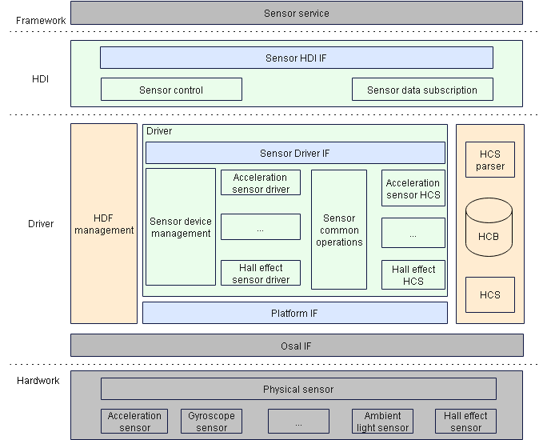
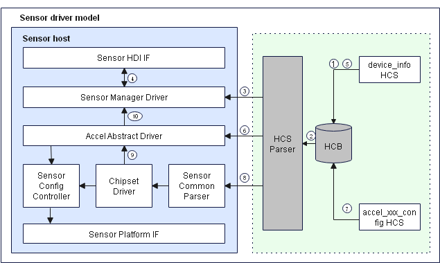

# Sensor


## Overview

### Function

The sensor driver model shields the hardware difference and provides interfaces for the upper-layer sensor service to implement basic sensor capabilities, including querying the sensor list, enabling or disabling a sensor, subscribing to or unsubscribing from sensor data changes, and setting sensor attributes. Developed based on the Hardware Driver Foundation (HDF), the sensor driver model leverages the capabilities of the OS adaptation layer (OSAL) and platform driver interfaces (such as I2C, SPI, and UART buses) to shield the difference between OSs and platform bus resources, achieving "one-time development and multi-system deployment" of the sensor driver. The figure below shows the architecture of the sensor driver model.

**Figure 1** Sensor driver model



### Basic Concepts

Currently, sensors are classified into the following types by sensor ID:

- Medical sensors: The sensor IDs range from 128 to 160.

- Traditional sensors: The sensor IDs are out of the range of 128 to 160.

### Working Principles

The following figure shows how a sensor driver works.

**Figure 2** How a sensor driver works



The following uses the acceleration sensor driver on the RK3568 development board of the standard system as an example to describe the driver loading and running process.

1. The sensor host reads the sensor device management configuration from **Sensor Host** in the **device_info.hcs** file.
2. The sensor host parses the sensor management configuration from the HCB database and associates the configuration with the sensor driver.
3. The sensor host loads and initializes the sensor manager driver.
4. The sensor manager driver publishes the sensor APIs for the hardware driver interface (HDI).
5. The sensor host reads the acceleration sensor driver configuration information from **Sensor Host** in the **device_info.hcs** configuration file.
6. The sensor host loads the acceleration sensor abstract driver and calls the initialization interface to allocate the sensor driver resources and create the data processing queue.
7. The sensor host reads the chipset driver configuration and private configuration of the acceleration sensor from the **accel_xxx_config.hcs** file.
8. The acceleration sensor chipset driver calls the common configuration parsing interface to parse the sensor attributes and registers.
9. The chipset driver detects sensors, allocates configuration resources to the acceleration sensor, and registers the acceleration sensor chipset interfaces.
10. Upon successful sensor detection, the chipset driver instructs the abstract driver to register the acceleration sensor to the sensor manager driver.

## Development Guidelines

### When to Use

- Data provided by the gravity and gyroscope sensors denotes the tilt and rotation of the device, which helps improve user experience in games.
- Data provided by the proximity sensor denotes the distance between the device and a visible object, which enables the device to automatically turn on or off its screen accordingly to prevent accidental touch on the screen. For example, when the proximity sensor detects the user face approaches the earpiece during a call, it triggers backlight of the screen to be turned off. This prevents the screen from being accidentally touched and further reduces power consumption.
- Data provided by the barometric pressure sensor helps your application accurately determine the altitude of the device.
- Data provided by the ambient light sensor helps your device automatically adjust its backlight.
- Data provided by the Hall effect sensor implements the smart cover mode of your device. When the smart cover is closed, a small window is opened on the phone to reduce power consumption. 

### Available APIs

The sensor driver model offers the following APIs:

- Sensor HDI APIs, for easier sensor service development
- APIs for implementing sensor driver model capabilities
  - APIs for loading, registering, and deregistering sensor drivers, and detecting sensors based on the HDF.
  - Unified driver API, register configuration parsing API, bus access abstract API, and platform abstract API for the same type of sensors
- APIs to be implemented by developers: Based on the HDF Configuration Source (HCS) and differentiated configuration for sensors of the same type, developers need to implement serialized configuration of sensor device parameters and some sensor device operation interfaces to simplify sensor driver development.

The sensor driver model provides APIs for the hardware service to make sensor service development easier. See the table below.

**Table 1** APIs of the sensor driver model

**NOTE**<br>The following APIs are C interfaces. For details about the interface declaration, see [/drivers/peripheral/sensor/interfaces/include](https://gitee.com/openharmony/drivers_peripheral/tree/master/sensor/interfaces/include).

| API| Description|
| ----- | -------- |
| int32_t GetAllSensors(struct SensorInformation **sensorInfo, int32_t *count) | Obtains information about all registered sensors in the system. The sensor information includes the sensor name, sensor vendor, firmware version, hardware version, sensor type ID, sensor ID, maximum range, accuracy, and power consumption.|
| int32_t Enable(int32_t sensorId) | Enables a sensor. The subscriber can obtain sensor data only after the sensor is enabled.|
| int32_t Disable(int32_t sensorId) | Disables a sensor.|
| int32_t SetBatch(int32_t sensorId, int64_t samplingInterval, int64_t reportInterval) | Sets the sampling interval and data reporting interval for a sensor.|
| int32_t SetMode(int32_t sensorId, int32_t mode) | Sets the data reporting mode for a sensor.|
| int32_t SetOption(int32_t sensorId, uint32_t option) | Sets options for a sensor, including its range and accuracy.|
| int32_t Register(int32_t groupId, RecordDataCallback cb) | Registers a sensor data callback based on the group ID.|
| int32_t Unregister(int32_t groupId, RecordDataCallback cb) | Deregisters a sensor data callback based on the group ID.|

The sensor driver model provides driver development APIs that do not require further implementation. See the table below.

 **Table 2** Sensor driver development APIs

| API| Description|
| ----- | -------- |
| int32_t AddSensorDevice(const struct SensorDeviceInfo *deviceInfo) | Adds a sensor of the current type to the sensor management module.|
| int32_t DeleteSensorDevice(const struct SensorBasicInfo *sensorBaseInfo) | Deletes a sensor from the sensor management module.|
| int32_t ReportSensorEvent(const struct SensorReportEvent *events) | Reports data of a specified sensor type.|
| int32_t ReadSensor(struct SensorBusCfg *busCfg, uint16_t regAddr, uint8_t *data, uint16_t dataLen) | Reads sensor configuration data from the sensor register based on the bus configuration.|
| int32_t WriteSensor(struct SensorBusCfg *busCfg, uint8_t *writeData, uint16_t len) | Writes sensor configuration data to the sensor register based on the bus configuration.|
| int32_t SetSensorRegCfgArray(struct SensorBusCfg *busCfg, const struct SensorRegCfgGroupNode *group); | Sets the sensor register group configuration based on the sensor bus type.|
| int32_t GetSensorBaseConfigData(const struct DeviceResourceNode *node, struct SensorCfgData *config) | Obtains basic configuration information such as sensor, bus, and attribute configurations based on the device information HCS configuration, and initializes the basic configuration data structure.|
| int32_t ParseSensorRegConfig(struct SensorCfgData *config) | Parses the register group information based on the device information HCS configuration and initializes the configuration data structure.|
| void ReleaseSensorAllRegConfig(struct SensorCfgData *config) | Releases the resources allocated to the sensor configuration data structure.|
| int32_t GetSensorBusHandle(struct SensorBusCfg *busCfg) | Obtains the sensor bus handle information.|
| int32_t ReleaseSensorBusHandle(struct SensorBusCfg *busCfg) | Releases the sensor bus handle information.|

The sensor driver model also provides certain driver development APIs that need to be implemented by driver developers. See the table below.

**Table 3** APIs to be implemented by driver developers

| API| Description|
| ----- | -------- |
| int32_t init(void) | Initializes the sensor device configuration after a sensor is detected.|
| int32_t Enable(void) | Enables the current sensor by delivering the register configuration in the enabling operation group based on the device information HCS configuration.|
| int32_t Disable(void) | Disables the current sensor by delivering the register configuration in the disabling operation group based on the device information HCS configuration.|
| int32_t SetBatch(int64_t samplingInterval, int64_t reportInterval) | Sets the processing time of the data reporting thread for the current sensor based on the sampling interval and data reporting interval.|
| int32_t SetMode(int32_t mode) | Sets the data reporting mode of the current sensor device.|
| int32_t SetOption(uint32_t option) | Sets the register configuration such as the range and accuracy based on sensor options.|
| void ReadSensorData(void) | Reads sensor data.                                            |


For details about the interface implementation, see [How to Develop](#how-to-develop).

### How to Develop
The following describes how to develop an acceleration sensor driver based on the HDF and the driver entry. Sensor driver development includes abstracted driver development and differentiated driver development. The abstracted driver development implements the common interfaces for different devices with the same sensor ID. The differentiated driver development implements device-specific interfaces.

1. Develop the abstracted driver of the acceleration sensor.

   - Configure the host information for the abstracted driver of the acceleration sensor in **vendor\hihope\rk3568\hdf_config\khdf\device_info\device_info.hcs**.

     The code is as follows:

     ```c
     /* Device information HCS configuration of the acceleration sensor. */
     device_sensor_accel :: device {
         device0 :: deviceNode {
             policy = 1;                                  // Policy for the driver to publish services.
             priority = 100;                              // Priority (0–200) for starting the driver. A larger value indicates a lower priority. The recommended value is 100. If the priorities are the same, the device loading sequence is not ensured.
             preload = 0;                                 // The value 0 means to load the driver by default during the startup of the system. The value 2 means the opposite.
             permission = 0664;                           // Permission for the device node created.
             moduleName = "HDF_SENSOR_ACCEL";             // Driver name. It must be the same as moduleName in the driver entry structure.
             serviceName = "sensor_accel";                // Name of the service published by the driver. The name must be unique.
             deviceMatchAttr = "hdf_sensor_accel_driver"; // Keyword matching the private data of the driver. The value must be the same as that of match_attr in the private data configuration table of the driver.
         }
     } 
     ```

   - Implement the abstracted driver of the acceleration sensor in **drivers\hdf_core\framework\model\sensor\driver\accel\sensor_accel_driver.c**.

     - Define the **HdfDriverEntry** object of the abstracted driver. The driver entry function is defined as follows:

       ```c
       struct HdfDriverEntry g_sensorAccelDevEntry = {
           .moduleVersion = 1,                // Version of the accelerometer sensor module.
           .moduleName = "HDF_SENSOR_ACCEL",  // Name of the acceleration sensor module. The value must be the same as that of moduleName in the device_info.hcs file.
           .Bind = BindAccelDriver,           // Function for binding an acceleration sensor.
           .Init = InitAccelDriver,           // Function for initializing an acceleration sensor.
           .Release = ReleaseAccelDriver      // Function for releasing acceleration sensor resources.
       };
       
       /* Call HDF_INIT to register the driver entry with the HDF. When loading the driver, the HDF calls Bind() and then Init() to load the driver. If Init() fails to be called, the HDF calls Release() to release resources and exit. */
       HDF_INIT(g_sensorAccelDevEntry);
       ```

     - Implement **Bind()** for the abstracted driver of the acceleration sensor.

       ```c
       int32_t AccelBindDriver(struct HdfDeviceObject *device)
       {
           CHECK_NULL_PTR_RETURN_VALUE(device, HDF_ERR_INVALID_PARAM);
       
           struct AccelDrvData *drvData = (struct AccelDrvData *)OsalMemCalloc(sizeof(*drvData));
           if (drvData == NULL) {
               HDF_LOGE("%s: Malloc accel drv data fail!", __func__);
               return HDF_ERR_MALLOC_FAIL;
           }
       
           drvData->ioService.Dispatch = DispatchAccel;
           drvData->device = device;
           device->service = &drvData->ioService;
           g_accelDrvData = drvData;
           return HDF_SUCCESS;
       }
       ```

     - Implement **Init()** for the abstracted driver of the acceleration sensor.

       ```c
       int32_t AccelInitDriver(struct HdfDeviceObject *device)
       {
           CHECK_NULL_PTR_RETURN_VALUE(device, HDF_ERR_INVALID_PARAM);
           struct AccelDrvData *drvData = (struct AccelDrvData *)device->service;
           CHECK_NULL_PTR_RETURN_VALUE(drvData, HDF_ERR_INVALID_PARAM);
       	 /* Initialize work queue resources. */
           if (InitAccelData(drvData) != HDF_SUCCESS) {
               HDF_LOGE("%s: Init accel config failed", __func__);
               return HDF_FAILURE;
           }
       	/* Allocate acceleration configuration resources. */
           drvData->accelCfg = (struct SensorCfgData            *)OsalMemCalloc(sizeof(*drvData->accelCfg));
           if (drvData->accelCfg == NULL) {
               HDF_LOGE("%s: Malloc accel config data failed", __func__);
               return HDF_FAILURE;
           }
       	/* Register the register group information. */
           drvData->accelCfg->regCfgGroup = &g_regCfgGroup[0];
           drvData->cb = NULL;
       	
           HDF_LOGI("%s: Init accel driver success", __func__);
           return HDF_SUCCESS;
       }
       ```

     - Implement **Release()** for the abstracted driver of the acceleration sensor. When the driver is unloaded or **Init()** fails, **Release()** can be used to release resources.

       ```c
       void AccelReleaseDriver(struct HdfDeviceObject *device)
       {
           CHECK_NULL_PTR_RETURN(device);
       
           struct AccelDrvData *drvData = (struct AccelDrvData *)device->service;
           CHECK_NULL_PTR_RETURN(drvData);
       	/* Release the resources if the sensor is in position. */
           if (drvData->detectFlag && drvData->accelCfg != NULL) {
               AccelReleaseCfgData(drvData->accelCfg);
           }
       
           OsalMemFree(drvData->accelCfg);
           drvData->accelCfg = NULL;
       	/* Destroy the work queue resource if the sensor is in position. */
           HdfWorkDestroy(&drvData->accelWork);
           HdfWorkQueueDestroy(&drvData->accelWorkQueue);
           OsalMemFree(drvData);
       }
       ```

     - Implement the internal interfaces for the abstracted driver of the acceleration sensor.

       - Implement the initialization interface provided for the differentiated driver. This interface parses the basic configuration information (acceleration sensor information, acceleration sensor bus configuration, and acceleration sensor detection register configuration) of the acceleration sensor, detects devices, and parses the device register. The initialization interface is implementation is as follows:

         ```c
         static int32_t InitAccelAfterDetected(struct SensorCfgData *config)
         {
             struct SensorDeviceInfo deviceInfo;
             CHECK_NULL_PTR_RETURN_VALUE(config, HDF_ERR_INVALID_PARAM);
         	/* Initialize the acceleration sensor. */
             if (InitAccelOps(config, &deviceInfo) != HDF_SUCCESS) {
                 HDF_LOGE("%s: Init accel ops failed", __func__);
                 return HDF_FAILURE;
             }
         	/* Register the accelerometer device with the sensor device management module. */
             if (AddSensorDevice(&deviceInfo) != HDF_SUCCESS) {
                 HDF_LOGE("%s: Add accel device failed", __func__);
                 return HDF_FAILURE;
             }
         	/* Parse the sensor register. */
             if (ParseSensorDirection(config) != HDF_SUCCESS) {
                 HDF_LOGE("%s: Parse accel direction failed", __func__);
                 (void)DeleteSensorDevice(&config->sensorInfo);
                 return HDF_FAILURE;
             }
         
             if (ParseSensorRegConfig(config) != HDF_SUCCESS) {
                 HDF_LOGE("%s: Parse sensor register failed", __func__);
                 (void)DeleteSensorDevice(&config->sensorInfo);
                 ReleaseSensorAllRegConfig(config);
                 ReleaseSensorDirectionConfig(config);
                 return HDF_FAILURE;
             }
             return HDF_SUCCESS;
         }
         
         struct SensorCfgData *AccelCreateCfgData(const struct DeviceResourceNode *node)
         {
             struct AccelDrvData *drvData = AccelGetDrvData();
         	/* If the device is not in position, return to detect the next device. */
             if (drvData == NULL || node == NULL) {
                 HDF_LOGE("%s: Accel node pointer NULL", __func__);
                 return NULL;
             }
         
             if (drvData->detectFlag) {
                 HDF_LOGE("%s: Accel sensor have detected", __func__);
                 return NULL;
             }
         
             if (drvData->accelCfg == NULL) {
                 HDF_LOGE("%s: Accel accelCfg pointer NULL", __func__);
                 return NULL;
             }
         	/* Parse the basic sensor configuration. */
             if (GetSensorBaseConfigData(node, drvData->accelCfg) != HDF_SUCCESS) {
                 HDF_LOGE("%s: Get sensor base config failed", __func__);
                 goto BASE_CONFIG_EXIT;
             }
         	/* If the device is not in position (the device ID exists), return to detect the next device. */
             if (DetectSensorDevice(drvData->accelCfg) != HDF_SUCCESS) {
                 HDF_LOGI("%s: Accel sensor detect device no exist", __func__);
                 drvData->detectFlag = false;
                 goto BASE_CONFIG_EXIT;
             }
         	/* Parse the sensor register. */
             drvData->detectFlag = true;
             if (InitAccelAfterDetected(drvData->accelCfg) != HDF_SUCCESS) {
                 HDF_LOGE("%s: Accel sensor detect device no exist", __func__);
                 goto INIT_EXIT;
             }
             return drvData->accelCfg;
         
         INIT_EXIT:
             (void)ReleaseSensorBusHandle(&drvData->accelCfg->busCfg);
         BASE_CONFIG_EXIT:
             drvData->accelCfg->root = NULL;
             (void)memset_s(&drvData->accelCfg->sensorInfo, sizeof(struct SensorBasicInfo), 0, sizeof(struct SensorBasicInfo));
             (void)memset_s(&drvData->accelCfg->busCfg, sizeof(struct SensorBusCfg), 0, sizeof(struct SensorBusCfg));
             (void)memset_s(&drvData->accelCfg->sensorAttr, sizeof(struct SensorAttr), 0, sizeof(struct SensorAttr));
             return drvData->accelCfg;
         }
         ```

       - Implement **Enable()** as follows.

         ```c
         static int32_t SetAccelEnable(void)
         {
             int32_t ret;
             struct AccelDrvData *drvData = AccelGetDrvData();
         
             CHECK_NULL_PTR_RETURN_VALUE(drvData, HDF_ERR_INVALID_PARAM);
             CHECK_NULL_PTR_RETURN_VALUE(drvData->accelCfg, HDF_ERR_INVALID_PARAM);
         
             if (drvData->enable) {
                 HDF_LOGE("%s: Accel sensor is enabled", __func__);
                 return HDF_SUCCESS;
             }
         	/* Set the register. */
             ret = SetSensorRegCfgArray(&drvData->accelCfg->busCfg, drvData->accelCfg->regCfgGroup[SENSOR_ENABLE_GROUP]);
             if (ret != HDF_SUCCESS) {
                 HDF_LOGE("%s: Accel sensor enable config failed", __func__);
                 return ret;
             }
         	/* Create a timer. */
             ret = OsalTimerCreate(&drvData->accelTimer, SENSOR_TIMER_MIN_TIME, AccelTimerEntry, (uintptr_t)drvData);
             if (ret != HDF_SUCCESS) {
                 HDF_LOGE("%s: Accel create timer failed[%d]", __func__, ret);
                 return ret;
             }
         	/* Start the timer to report data. */
             ret = OsalTimerStartLoop(&drvData->accelTimer);
             if (ret != HDF_SUCCESS) {
                 HDF_LOGE("%s: Accel start timer failed[%d]", __func__, ret);
                 return ret;
             }
             drvData->enable = true;
         
             return HDF_SUCCESS;
         }
         ```

       - Implement **Disable()** as follows.

         ```c
         static int32_t SetAccelDisable(void)
         {
             int32_t ret;
             struct AccelDrvData *drvData = AccelGetDrvData();
         
             CHECK_NULL_PTR_RETURN_VALUE(drvData, HDF_ERR_INVALID_PARAM);
             CHECK_NULL_PTR_RETURN_VALUE(drvData->accelCfg, HDF_ERR_INVALID_PARAM);
         
             if (!drvData->enable) {
                 HDF_LOGE("%s: Accel sensor had disable", __func__);
                 return HDF_SUCCESS;
             }
         	/* Set the register. */
             ret = SetSensorRegCfgArray(&drvData->accelCfg->busCfg, drvData->accelCfg->regCfgGroup[SENSOR_DISABLE_GROUP]);
             if (ret != HDF_SUCCESS) {
                 HDF_LOGE("%s: Accel sensor disable config failed", __func__);
                 return ret;
             }
         	/* Delete the timer. */
             ret = OsalTimerDelete(&drvData->accelTimer);
             if (ret != HDF_SUCCESS) {
                 HDF_LOGE("%s: Accel delete timer failed", __func__);
                 return ret;
             }
             drvData->enable = false;
         
             return HDF_SUCCESS;
         }
         ```

       - Implement **SetBatch()** as follows.

         ```c
         static int32_t SetAccelBatch(int64_t samplingInterval, int64_t interval)
         {
             (void)interval;
         
             struct AccelDrvData *drvData = NULL;
         
             drvData = AccelGetDrvData();
             CHECK_NULL_PTR_RETURN_VALUE(drvData, HDF_ERR_INVALID_PARAM);
         	/* Set the sampling rate for the timer. */
             drvData->interval = samplingInterval;
         
             return HDF_SUCCESS;
         }
         ```

       - Implement **SetMode()** as follows.

         ```c
         static int32_t SetAccelMode(int32_t mode)
         {
             if (mode <= SENSOR_WORK_MODE_DEFAULT || mode >= SENSOR_WORK_MODE_MAX) {
                 HDF_LOGE("%s: The current mode is not supported", __func__);
                 return HDF_FAILURE;
             }
         
             return HDF_SUCCESS;
         }
         ```

       - Implement **SetOption()** as follows.

         ```c
         static int32_t SetAccelOption(uint32_t option)
         {
             (void)option;
             return HDF_SUCCESS;
         }
         ```

2. Develop the differentiated drivers for acceleration sensors.

   - Configure the host information for the differentiated driver of the acceleration sensor in **vendor\hihope\rk3568\hdf_config\khdf\device_info\device_info.hcs**.

     The code is as follows:

     ```c
     device_sensor_mxc6655xa :: device {
         device0 :: deviceNode {
             policy = 1; 		    // Policy for publishing drive services.
             priority = 120;          // Driver startup priority (0–200). A larger value indicates a lower priority. The default value 100 is recommended. The sequence for loading devices with the same priority is random. 
             preload = 0;             // Whether to load the driver on demand. The value 0 means to load the driver on demand, and 2 means the opposite.
             permission = 0664;       // Permission for the driver to create a device node.
             moduleName = "HDF_SENSOR_ACCEL_MXC6655XA";  // Driver name, which must be the same as moduleName in the driver entry structure.
             serviceName = "hdf_accel_mxc6655xa";        // Name of the service published by acceleration mxc6655xa. It must be unique.
             deviceMatchAttr = "hdf_sensor_accel_mxc6655xa_driver"; // Keyword for matching the private data of the driver. The value must be the same as the match_attr value in the private data configuration table of the driver.
         }
     }
     ```

   - Configure the private HCS for the differentiated driver of the acceleration sensor.

     - Code path: **vendor\hihope\rk3568\hdf_config\khdf\sensor\accel\mxc6655xa_config.hcs**.

     - The code is as follows:

       ```c
       #include "../sensor_common.hcs"
       root {
           accel_mxc6655xa_chip_config : sensorConfig {
               match_attr = "hdf_sensor_accel_mxc6655xa_driver";
               sensorInfo :: sensorDeviceInfo {
                   sensorName = "accelerometer";
                   vendorName = "memsi_mxc6655xa"; // Max string length is 16 bytes
                   sensorTypeId = 1;               // enum SensorTypeTag
                   sensorId = 1;                   // User-defined sensor ID
                   power = 230;
                   minDelay = 5000000;             // Nanosecond
                   maxDelay = 200000000;           // Nanosecond
               }
               sensorBusConfig :: sensorBusInfo {
                   busType = 0;                    // 0:i2c 1:spi
                   busNum = 5;
                   busAddr = 0x15;
                   regWidth = 1;                   // 1 byte
               }
               sensorIdAttr :: sensorIdInfo {
                   chipName = "mxc6655xa";
                   chipIdRegister = 0x0f;
                   chipIdValue = 0x05;             // Read the value based on the device ID register or check the value in the related chip datasheet.
               }
               sensorDirection {
                   direction = 1;                  // chip direction range of value:0-7
                   /* <sign> 1:negative  0:positive
                      <map> 0:AXIS_X  1:AXIS_Y  2:AXIS_Z
                   */
                   /* sign[AXIS_X], sign[AXIS_Y], sign[AXIS_Z], map[AXIS_X], map[AXIS_Y], map[AXIS_Z] */
                   convert = [
                       0, 0, 0, 0, 1, 2,
                       1, 0, 0, 1, 0, 2,
                       0, 0, 1, 0, 1, 2,
                       0, 1, 0, 1, 0, 2,
                       1, 0, 1, 0, 1, 2,
                       0, 0, 1, 1, 0, 2,
                       0, 1, 1, 0, 1, 2,
                       1, 1, 1, 1, 0, 2
                   ];
               }
               sensorRegConfig {
                   /*  regAddr: register address
                       value: config register value
                       len: size of value
                       mask: mask of value
                       delay: config register delay time (ms)
                       opsType: enum SensorOpsType 0-none 1-read 2-write 3-read_check 4-update_bit
                       calType: enum SensorBitCalType 0-none 1-set 2-revert 3-xor 4-left shift 5-right shift
                       shiftNum: shift bits
                       debug: 0-no debug 1-debug
                       save: 0-no save 1-save
                   */
                   /* regAddr, value, mask, len, delay, opsType, calType, shiftNum, debug, save */
                   initSeqConfig = [
                       0x7e,    0xb6, 0xff,   1,     5,       2,       0,        0,     0,    0,
                       0x7e,    0x10, 0xff,   1,     5,       2,       0,        0,     0,    0
                   ];
                   enableSeqConfig = [
                       0x7e,    0x11, 0xff,   1,     5,       2,       0,        0,     0,    0,
                       0x41,    0x03, 0xff,   1,     0,       2,       0,        0,     0,    0,
                       0x40,    0x08, 0xff,   1,     0,       2,       0,        0,     0,    0
                   ];
                   disableSeqConfig = [
                       0x7e,    0x10, 0xff,   1,     5,       2,       0,        0,     0,    0
                   ];
               }
           }
       }
       ```

   - Implement the code for the differentiated driver in **drivers\peripheral\sensor\chipset\accel\accel_mxc6655xa.c**.

     - Define the **HdfDriverEntry** object corresponding to the acceleration sensor chipset driver. The driver entry function is defined as follows:

       ```c
       /* Register the entry struct object of the mxc6655xa acceleration sensor. */
       struct HdfDriverEntry g_accelMxc6655xaDevEntry = {
           .moduleVersion = 1,                         // Module version of the mxc6655xa acceleration sensor.
           .moduleName = "HDF_SENSOR_ACCEL_MXC6655XA", // Module name of the mxc6655xa acceleration sensor. The value must be the same as the value of moduleName of the acceleration sensor in the device_info.hcs file.
           .Bind = Mxc6655xaBindDriver,                // Bind function of the mxc6655xa acceleration sensor.
           .Init = Mxc6655xaInitDriver,                // Init function of the mxc6655xa acceleration sensor.
           .Release = Mxc6655xaReleaseDriver,          // Release function of the mxc6655xa acceleration sensor.
       };
       /* Call HDF_INIT to register the driver entry with the HDF. When loading the driver, the HDF calls Bind() and then Init() to load the driver. If Init() fails to be called, the HDF calls Release() to release resources and exit. */
       HDF_INIT(g_accelMxc6655xaDevEntry);
       ```

     - Implement **Bind()** for the differentiated driver as follows.

       ```c
       int32_t Mxc6655xaBindDriver(struct HdfDeviceObject *device)
       {
           CHECK_NULL_PTR_RETURN_VALUE(device, HDF_ERR_INVALID_PARAM);
       
           struct Mxc6655xaDrvData *drvData = (struct Mxc6655xaDrvData *)OsalMemCalloc(sizeof(*drvData));
           if (drvData == NULL) {
               HDF_LOGE("%s: Malloc MXC6655XA drv data fail", __func__);
               return HDF_ERR_MALLOC_FAIL;
           }
       
           drvData->ioService.Dispatch = DispatchMXC6655xa;
           drvData->device = device;
           device->service = &drvData->ioService;
           g_mxc6655xaDrvData = drvData;
       
           return HDF_SUCCESS;
       }
       ```

     - Implement **Init()** for the differentiated driver as follows.

       ```c
       int32_t Mxc6655xaInitDriver(struct HdfDeviceObject *device)
       {
           int32_t ret;
           struct AccelOpsCall ops;
       
           CHECK_NULL_PTR_RETURN_VALUE(device, HDF_ERR_INVALID_PARAM);
           struct Mxc6655xaDrvData *drvData = (struct Mxc6655xaDrvData *)device->service;
           CHECK_NULL_PTR_RETURN_VALUE(drvData, HDF_ERR_INVALID_PARAM);
       
           drvData->sensorCfg = AccelCreateCfgData(device->property);
           if (drvData->sensorCfg == NULL || drvData->sensorCfg->root == NULL) {
               HDF_LOGD("%s: Creating accelcfg failed because detection failed", __func__);
               return HDF_ERR_NOT_SUPPORT;
           }
       
           ops.Init = NULL;
           ops.ReadData = ReadMxc6655xaData;
           ret = AccelRegisterChipOps(&ops);
           if (ret != HDF_SUCCESS) {
               HDF_LOGE("%s: Register MXC6655XA accel failed", __func__);
               return HDF_FAILURE;
           }
       
           ret = InitMxc6655xa(drvData->sensorCfg);
           if (ret != HDF_SUCCESS) {
               HDF_LOGE("%s: Init MXC6655XA accel failed", __func__);
               return HDF_FAILURE;
           }
       
           return HDF_SUCCESS;
       }
       ```

     - Implement **Release()** for the differentiated driver as follows.

       ```c
       void Mxc6655xaReleaseDriver(struct HdfDeviceObject *device)
       {
           CHECK_NULL_PTR_RETURN(device);
       
           struct Mxc6655xaDrvData *drvData = (struct Mxc6655xaDrvData *)device->service;
           CHECK_NULL_PTR_RETURN(drvData);
       
           if (drvData->sensorCfg != NULL) {
               AccelReleaseCfgData(drvData->sensorCfg);
               drvData->sensorCfg = NULL;
           }
           OsalMemFree(drvData);
       }
       ```

     - Implement the internal interfaces of the differentiated driver of the acceleration sensor.

       You need to implement **ReadMxc6655xaData** and register it in **Mxc6655xaInitDriver**. The implementation is as follows:

       ```c
       static int32_t ReadMxc6655xaRawData(struct SensorCfgData *data, struct AccelData *rawData, uint64_t *timestamp)
       {
           uint8_t status = 0;
           uint8_t reg[ACCEL_AXIS_BUTT];
           OsalTimespec time;
           int32_t x;
           int32_t y;
           int32_t z;
       
           (void)memset_s(&time, sizeof(time), 0, sizeof(time));
           (void)memset_s(reg, sizeof(reg), 0, sizeof(reg));
       
           CHECK_NULL_PTR_RETURN_VALUE(data, HDF_ERR_INVALID_PARAM);
       
           if (OsalGetTime(&time) != HDF_SUCCESS) {
               HDF_LOGE("%s: Get time failed", __func__);
               return HDF_FAILURE;
           }
           *timestamp = time.sec * SENSOR_SECOND_CONVERT_NANOSECOND + time.usec * SENSOR_CONVERT_UNIT; /* unit nanosecond */
       
           int32_t ret = ReadSensor(&data->busCfg, MXC6655XA_STATUS_ADDR, &status, sizeof(uint8_t));
           if (ret != HDF_SUCCESS) {
               HDF_LOGE("%s: data status [%u] ret [%d]", __func__, status, ret);
               return HDF_FAILURE;
           }
       
           ret = ReadSensor(&data->busCfg, MXC6655XA_ACCEL_X_LSB_ADDR, &reg[ACCEL_X_AXIS_LSB], sizeof(uint8_t));
           CHECK_PARSER_RESULT_RETURN_VALUE(ret, "read data");
       
           ret = ReadSensor(&data->busCfg, MXC6655XA_ACCEL_X_MSB_ADDR, &reg[ACCEL_X_AXIS_MSB], sizeof(uint8_t));
           CHECK_PARSER_RESULT_RETURN_VALUE(ret, "read data");
       
           ret = ReadSensor(&data->busCfg, MXC6655XA_ACCEL_Y_LSB_ADDR, &reg[ACCEL_Y_AXIS_LSB], sizeof(uint8_t));
           CHECK_PARSER_RESULT_RETURN_VALUE(ret, "read data");
       
           ret = ReadSensor(&data->busCfg, MXC6655XA_ACCEL_Y_MSB_ADDR, &reg[ACCEL_Y_AXIS_MSB], sizeof(uint8_t));
           CHECK_PARSER_RESULT_RETURN_VALUE(ret, "read data");
       
           ret = ReadSensor(&data->busCfg, MXC6655XA_ACCEL_Z_LSB_ADDR, &reg[ACCEL_Z_AXIS_LSB], sizeof(uint8_t));
           CHECK_PARSER_RESULT_RETURN_VALUE(ret, "read data");
       
           ret = ReadSensor(&data->busCfg, MXC6655XA_ACCEL_Z_MSB_ADDR, &reg[ACCEL_Z_AXIS_MSB], sizeof(uint8_t));
           CHECK_PARSER_RESULT_RETURN_VALUE(ret, "read data");
       
           x = SensorConvertData(reg[ACCEL_X_AXIS_MSB], reg[ACCEL_X_AXIS_LSB]);
           y = SensorConvertData(reg[ACCEL_Y_AXIS_MSB], reg[ACCEL_Y_AXIS_LSB]);
           z = SensorConvertData(reg[ACCEL_Z_AXIS_MSB], reg[ACCEL_Z_AXIS_LSB]);
           rawData->x = x;
           rawData->y = y;
           rawData->z = z;
       
           return HDF_SUCCESS;
       }
       /* Read the event data of the accelerator. Register this function in Mxc6655xaInitDriver() to pass in the data to the abstracted driver of the acceleration sensor. */
       int32_t ReadMxc6655xaData(struct SensorCfgData *cfg, struct SensorReportEvent *event)
       {
           int32_t ret;
           struct AccelData rawData = { 0, 0, 0 };
           static int32_t tmp[ACCEL_AXIS_NUM];
       
           CHECK_NULL_PTR_RETURN_VALUE(cfg, HDF_ERR_INVALID_PARAM);
           CHECK_NULL_PTR_RETURN_VALUE(event, HDF_ERR_INVALID_PARAM);
       
           ret = ReadMxc6655xaRawData(cfg, &rawData, &event->timestamp);
           if (ret != HDF_SUCCESS) {
               HDF_LOGE("%s: MXC6655XA read raw data failed", __func__);
               return HDF_FAILURE;
           }
       
           event->sensorId = SENSOR_TAG_ACCELEROMETER;
           event->option = 0;
           event->mode = SENSOR_WORK_MODE_REALTIME;
       
           rawData.x = rawData.x * MXC6655XA_ACC_SENSITIVITY_2G;
           rawData.y = rawData.y * MXC6655XA_ACC_SENSITIVITY_2G;
           rawData.z = rawData.z * MXC6655XA_ACC_SENSITIVITY_2G;
       
           tmp[ACCEL_X_AXIS] = (rawData.x * SENSOR_CONVERT_UNIT) / SENSOR_CONVERT_UNIT;
           tmp[ACCEL_Y_AXIS] = (rawData.y * SENSOR_CONVERT_UNIT) / SENSOR_CONVERT_UNIT;
           tmp[ACCEL_Z_AXIS] = (rawData.z * SENSOR_CONVERT_UNIT) / SENSOR_CONVERT_UNIT;
       
           ret = SensorRawDataToRemapData(cfg->direction, tmp, sizeof(tmp) / sizeof(tmp[0]));
           if (ret != HDF_SUCCESS) {
               HDF_LOGE("%s: MXC6655XA convert raw data failed", __func__);
               return HDF_FAILURE;
           }
       
           event->dataLen = sizeof(tmp);
           event->data = (uint8_t *)&tmp;
       
           return ret;
       }
       ```

### Verification

After the driver is developed, develop test cases in the sensor unit test to verify the basic functions of the driver. Use the developer self-test platform as the test environment.

- The reference test code is as follows:

  ```c
  #include <cmath>
  #include <cstdio>
  #include <unistd.h>
  #include <gtest/gtest.h>
  #include <securec.h>
  #include "hdf_base.h"
  #include "osal_mem.h"
  #include "osal_time.h"
  #include "sensor_if.h"
  #include "sensor_type.h"
  
  using namespace testing::ext;
  const struct SensorInterface *g_sensorDev = nullptr;
  /* Create a callback. */
  static int32_t SensorDataCallback(const struct SensorEvents *event)
  {
      if (event == NULL) {
          return HDF_FAILURE;
      }
  
      float *data = (float*)event->data;
      printf("time [%lld] sensor id [%d] x-[%f] y-[%f] z-[%f]\n\r", event->timestamp,
          event->sensorId, (*data), *(data + 1), *(data + 2));
  
      return HDF_SUCCESS;
  }
  
  class HdfSensorTest : public testing::Test {
  public:
      static void SetUpTestCase();
      static void TearDownTestCase();
      void SetUp();
      void TearDown();
  };
  
  /* Initialize the sensor interface instance before executing the test cases. */
  void HdfSensorTest::SetUpTestCase()
  {
      g_sensorDev = NewSensorInterfaceInstance();
      if (g_sensorDev == nullptr) {
          printf("test sensor get module instance failed\n\r");
      }
  }
  /* Release case resources. */
  void HdfSensorTest::TearDownTestCase()
  {
      if (g_sensorDev != nullptr) {
          FreeSensorInterfaceInstance();
          g_sensorDev = nullptr;
      }
  }
  
  void HdfSensorTest::SetUp()
  {
  }
  
  void HdfSensorTest::TearDown()
  {
  }
  
  HWTEST_F(HdfSensorTest,TestAccelDriver_001, TestSize.Level0)
  {
      int ret;
      struct SensorInformation *sensorInfo = NULL;
      int32_t count = 0;
      int32_t sensorInterval = 200000000; /* Set the data sampling rate to 200000000, in the unit of nanoseconds (200 ms). */
      int32_t reportInterval = 400000000;
  
       /* 2. Register a sensor data callback. */
      ret = g_sensorDev->Register(TRADITIONAL_SENSOR_TYPE, SensorDataCallback);
      if (ret != 0) {
          return;
      }
      printf("Register success\n");
  
      /* 3. Obtain the list of sensors supported by the device. */ 
      ret = g_sensorDev->GetAllSensors(&sensorInfo, &count);
      if (ret != 0) {
          return;
      }
  
      printf("GetAllSensors count: %d\n", count);
  
      for (int i = 0; i < count; i++)
      {
          printf("sensor [%d]: sensorName: %s, vendorName: %s, sensorTypeId: %d, sensorId: %d\n", i,
                 sensorInfo[i].sensorName, sensorInfo[i].vendorName, sensorInfo[i].sensorTypeId, sensorInfo[i].sensorId);
      }
  
      for (int i = 0; i < count; i++)
      {
          /* 4. Set the sensor sampling rate. */ 
          ret = g_sensorDev->SetBatch(sensorInfo[i].sensorId, sensorInterval, reportInterval);
          if (ret != 0) {
              printf("SetBatch failed\n ,ret: %d",ret);
              continue;
          }
          printf("SetBatch success\n");
  
          /* 5. Enable the sensor. */ 
          ret = g_sensorDev->Enable(sensorInfo[i].sensorId);
          if (ret != 0) {
              continue;
          }
       printf("Enable success\n");
  
       usleep(1000 * 1000);
  
          /* 6. Disable the sensor. */ 
          ret = g_sensorDev->Disable(sensorInfo[i].sensorId);
          if (ret != 0) {
              continue;
          }
          printf("Disable success\n");
      }
  
      /* 7. Unregister the sensor data callback. */ 
      ret = g_sensorDev->Unregister(TRADITIONAL_SENSOR_TYPE, SensorDataCallback);
      if (ret != 0) {
          return;
      }
      printf("Unregister success\n");
  }
  ```

- The reference code of the .gn file is as follows: 

  ```
  import("//build/ohos.gni")
  import("//build/test.gni")
  import("//drivers/hdf_core/adapter/uhdf2/uhdf.gni")
  
  module_output_path = "drivers_peripheral_sensor/sensor"
  ohos_unittest("sensor_test") {
    module_out_path = module_output_path
    sources = [ "sensor_test.cpp" ]
    include_dirs = [
      "//drivers/peripheral/sensor/interfaces/include",
    ]
    deps = [ "//drivers/peripheral/sensor/hal:hdi_sensor" ]
  
    external_deps = [
      "c_utils:utils",
      "hdf_core:libhdf_utils",
      "hiviewdfx_hilog_native:libhilog",
    ]
  
    cflags = [
      "-Wall",
      "-Wextra",
      "-Werror",
      "-Wno-format",
      "-Wno-format-extra-args",
    ]
  
    install_enable = true
    install_images = [ "vendor" ]
    module_install_dir = "bin"
    part_name = "unionman_products"
  }
  ```
