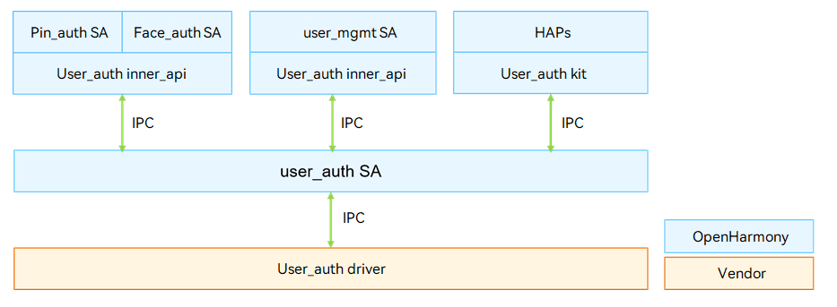
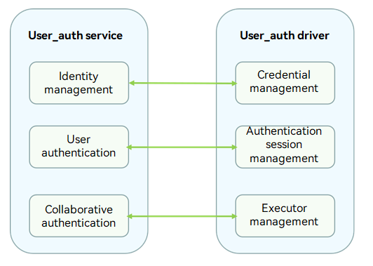

# User Authentication

## Overview

### Function

User authentication is indispensable in identity authentication scenarios, such as device unlocking, payment, and app logins. The user authentication framework (User_auth) manages the mappings between user identities and authentication credential templates in a unified manner. It schedules executors implemented by basic authentication services (including PIN authentication and facial recognition) to register user authentication credentials, delete credentials, obtain related information, and complete authentication. The figure below shows the architecture of user authentication.

The User_auth driver is developed based on the Hardware Driver Foundation (HDF). It shields hardware differences and provides stable user authentication capabilities for apps and account management system ability (SA). It supports user credential management, authentication information enrollment, authentication scheme generation, and executor information management.

**Figure 1** User authentication architecture



### Basic Concepts
The identity authentication consists of the User_auth framework and basic authentication services (including PIN authentication and facial recognition). It supports basic functions such as setting and deleting user credentials and performing authentication.

- Authentication credential information

  An authentication credential template is generated when a user sets a password or enrolls facial information. The credential information consists of the user identity information and credential template information. The authentication is successful when the credential data generated matches the credential template information.

- Authentication credential template

  The authentication credential template is generated and stored by the authentication service when a user sets the authentication credential. Each template has an ID to index a set of template information files. The template information needs to be compared with the authentication data generated during authentication to complete identity authentication.

- Executor

  The executor collects, processes, stores, and compares data for authentication. Each authentication service provides the executor capabilities, which are scheduled by User_auth to implement basic capabilities.

- Executor role

  - ​    Executor: independently completes the entire process of credential registration and identity authentication. The executor can collect, process, store, and compare data to complete the authentication.

  - ​    Collector: only collects data during user authentication. It needs to work with the authenticator to complete user authentication.

  - ​    Authenticator: processes data, obtains the stored credential template, and compares it with the authentication information generated.

- Executor type

  The authentication algorithm varies depending on the authentication mode and device used. Different executor types are defined based on the supported algorithm type or the device in use.

- Executor security level

  Security level of the runtime environment when an executor provides capabilities.

- User_auth public key & executor public key

  To ensure user data security and authentication result accuracy, measures must be taken to protect the integrity of the key information exchanged between User_auth and basic authentication services. Public keys must be exchanged when the executor provided by a basic authentication service interworks with User_auth.

    - The executor uses the User_auth public key to verify scheduling instructions. For example, if a face image template is locked, the related facial authentication capability cannot be used. The instruction for unlocking the face image template must be verified before being executed.

    - User_auth uses the executor public key to verify the authentication result accuracy and the integrity of the information exchanged with the executor.


- Authentication result trust level

  The trust level of the authentication result varies, depending on the authentication mode and the security level of the authentication execution environment.

- Authentication scheme

  An authentication scheme contains information about the authentication mode, trust level of the authentication result, executor, and credential.

- Scheduling information

  Scheduling information includes the executor information and credential template information required by the executor to process requests. User_auth schedules the executor to implement basic authentication capabilities.

- SA

  SAs are loaded by the System Ability Manager to provide basic system capabilities for OpenHarmony devices.

- Kit

  The kit provides basic APIs for third-party applications.

- Inner API

  Inner API is an API provided by OpenHarmony for system applications.

- IDL interface

  An Interface Definition Language (IDL) is a language that lets a program or object written in one language communicate with another program written in an unknown language. An IDL compiler generates client stub files and server framework files. This document describes how to use the client and server generated by the IDL interface to implement communication between the User_auth service and driver. For details, see [IDL](https://gitee.com/openharmony/ability_idl_tool/blob/master/README.md).

- IPC

  Inter-Process Communication (IPC) is a mechanism that allows processes to communicate with each other. For details, see [IPC](https://gitee.com/openharmony/communication_ipc/blob/master/README.md).

- HDI

  The hardware device interface (HDI) is located between the basic system service layer and the device driver layer. It provides APIs for abstracting hardware device functions, which shield underlying hardware device differences for system services. For details, see [HDI Specifications](../../design/hdi-design-specifications.md).

### Working Principles

The User_auth driver shields the differences of security devices and environments. It provides unified interfaces for the User_auth service to implement management of executors and credentials as well as authentication scheme generation.
You can develop drivers to call Hardware Device Interface (HDI) APIs based on the HDF and the chip you use.

**Figure 2** User_auth service and User_auth driver APIs



### Constraints

The User_auth driver must be implemented in a TEE to ensure secure storage of user credentials and trustworthiness of user authentication results.

## Development Guidelines

### When to Use

The User_auth driver provides stable user credential management, authentication session management, and executor information management for the User_auth service to ensure successful PIN authentication and biometric recognition on devices.

### Available APIs

The following table describes the C++ APIs generated from the Interface Definition Language (IDL) interface description. For details about the interface declaration, see the .idl file in **/drivers/interface/user_auth**.
**Table 1** describes the HDI APIs for executor registration, credential enrollment and deletion, user authentication, and user identification.

**Table 1** Available APIs

| API      | Description    |
| --------------------------- | --------------------------- |
| Init()           | Initializes cached information.                       |
| AddExecutor(const HdiExecutorRegisterInfo &info, uint64_t &index, std::vector<uint8_t> &publicKey, std::vector<uint64_t> &templateIds) |Adds an executor to obtain the authentication capability.|
| DeleteExecutor(uint64_t index)            | Deletes an executor.      |
| OpenSession(int32_t userId, std::vector<uint8_t> &challenge) | Opens a session for authentication credential management.     |
| CloseSession(int32_t userId)        | Closes a session for authentication credential management.           |
| BeginEnrollment(const std::vector<uint8_t> &authToken, const HdiEnrollParam &param, HdiScheduleInfo &info) | Enrolls the user authentication credential. If a user has enrolled a PIN, the old PIN will be overwritten. |
| UpdateEnrollmentResult(int32_t userId, const std::vector<uint8_t> & scheduleResult, EnrollResultInfo &info)| Updates the data to complete this enrollment.  |
| CancelEnrollment(int32_t userId)     | Cancels an enrollment.         |
| DeleteCredential(int32_t userId, uint64_t credentialId, const std::vector<uint8_t> &authToken, CredentialInfo &info) | Deletes credential information based on the specified **credentialId**.                              |
| DeleteUser(int32_t userId, const std::vector<uint8_t> &authToken, std::vector<CredentialInfo> &deletedInfos, std::vector<uint8_t> &rootSecret) | Deletes a user PIN from User_auth.                       |
| EnforceDeleteUser(int32_t userId, std::vector<CredentialInfo> &deletedInfos) | Forcibly deletes a user. This API will be called when a user is deleted from the system.              |
| GetCredential(int32_t userId, int32_t authType, std::vector<CredentialInfo> &infos) | Obtains user credential information by authentication type.            |
| BeginAuthentication(uint64_t contextId, const HdiAuthParam &param, std::vector<HdiScheduleInfo> &infos) | Starts an authentication to generate the authentication scheme and scheduling information.                          |
| UpdateAuthenticationResult(uint64_t contextId, const std::vector<uint8_t> & scheduleResult, HdiAuthResultInfo &info, HdiEnrolledState &enrolledState)| Updates the authentication result to evaluate the authentication scheme.                  |
| CancelAuthentication(uint64_t contextId)      | Cancels an authentication.            |
| BeginIdentification(uint64_t contextId, int32_t authType, const std::vector<uint8_t> &challenge, uint32_t executorSensorHint, HdiScheduleInfo &scheduleInfo) | Starts an identification to generate the identification scheme and scheduling information.                          |
| UpdateIdentificationResult(uint64_t contextId, const std::vector<uint8_t> &scheduleResult, IdentifyResultInfo &info) | Updates the identification result to evaluate the identification scheme.                  |
| CancelIdentification(uint64_t contextId)             | Cancels an identification.             |
| GetAuthTrustLevel(int32_t userId, int32_t authType, uint32_t &authTrustLevel) | Obtains the authentication trust level of the specified authentication type.    |
| GetValidSolution(int32_t userId, const std::vector<int32_t> &authTypes, uint32_t authTrustLevel, std::vector<int32_t> &validTypes) | Obtains the valid authentication scheme based on the authentication trust level for a user.                  |
| GetAllUserInfo(std::vector<UserInfo> &userInfos) | Obtains all user information (excluding **userId**). |
| GetUserInfo(int32_t userId, uint64_t &secureUid, int32_t &pinSubType, std::vector<EnrolledInfo> &infos) | Obtains user information. |
| GetAllExtUserInfo(std::vector<ExtUserInfo> &userInfos) | Obtains all user information (including **userId**). |
| GetEnrolledState(int32_t userId, int32_t authType, HdiEnrolledState &enrolledState) | Obtains enrollment information. |
| CheckReuseUnlockResult(const ReuseUnlockParam& param, ReuseUnlockInfo& info) | Checks whether the device unlocking result is reused. |
| SendMessage(uint64_t scheduleId, int32_t srcRole, const std::vector<uint8_t>& msg) | Sends messages to the executor. |
| RegisterMessageCallback(const sptr<IMessageCallback>& messageCallback) | Registers a callback for executor messages.|
| GetLocalScheduleFromMessage(const std::vector<uint8_t>& remoteDeviceId, const std::vector<uint8_t>& message, HdiScheduleInfo& scheduleInfo) | Obtains scheduling information of the local executor. |
| GetSignedExecutorInfo(const std::vector<int32_t>& authTypes, int32_t executorRole, const std::vector<uint8_t>& remoteDeviceId, std::vector<uint8_t>& signedExecutorInfo) | Obtains information about the signed executor. |

### How to Develop

The following uses the Hi3516D V300 development board as an example to demonstrate how to develop the User_auth driver. <br/>The directory structure is as follows:

```undefined
// drivers/peripheral/user_auth
├── BUILD.gn     # Build script
├── bundle.json # Component description file
└── hdi_service # User_auth driver implementation
    ├── BUILD.gn     # Build script
    ├── module # Implementation of functionalities
    └── service
        ├── user_auth_interface_driver.cpp # User_auth driver entry
        └── user_auth_interface_service.cpp # Implementation of the APIs for obtaining the executor list
```

The development procedure is as follows:

1. Develop the User_auth driver based on the HDF. The **Bind()**, **Init()**, **Release()**, and **Dispatch()** functions are used. For details about the code, see [user_auth_interface_driver.cpp](https://gitee.com/openharmony/drivers_peripheral/blob/master/user_auth/hdi_service/service/user_auth_interface_driver.cpp).

   ```c++
   // Create an IRemoteObject object by using the custom HdfUserAuthInterfaceHost object, which consists of the IoService object and HDI service.
   struct HdfUserAuthInterfaceHost {
       struct IDeviceIoService ioService;
       OHOS::sptr<OHOS::IRemoteObject> stub;
   };

   // Enable the IPC service to call the response API.
   static int32_t UserAuthInterfaceDriverDispatch(struct HdfDeviceIoClient *client, int cmdId, struct HdfSBuf *data,
       struct HdfSBuf *reply)
   {
       auto *hdfUserAuthInterfaceHost = CONTAINER_OF(client->device->service, struct HdfUserAuthInterfaceHost, ioService);

       OHOS::MessageParcel *dataParcel = nullptr;
       OHOS::MessageParcel *replyParcel = nullptr;
       OHOS::MessageOption option;

       if (SbufToParcel(data, &dataParcel) != HDF_SUCCESS) {
           HDF_LOGE("%{public}s:invalid data sbuf object to dispatch", __func__);
           return HDF_ERR_INVALID_PARAM;
       }
       if (SbufToParcel(reply, &replyParcel) != HDF_SUCCESS) {
           HDF_LOGE("%{public}s:invalid reply sbuf object to dispatch", __func__);
           return HDF_ERR_INVALID_PARAM;
       }

       return hdfUserAuthInterfaceHost->stub->SendRequest(cmdId, *dataParcel, *replyParcel, option);
   }

   // Initialize the HdfUserAuthInterfaceDriver object.
   int HdfUserAuthInterfaceDriverInit(struct HdfDeviceObject *deviceObject)
   {
       HDF_LOGI("HdfUserAuthInterfaceDriverInit enter");
       OHOS::UserIAM::Common::Init();
       return HDF_SUCCESS;
   }

   // Bind the service provided by the User_auth driver to the HDF.
   int HdfUserAuthInterfaceDriverBind(struct HdfDeviceObject *deviceObject)
   {
       HDF_LOGI("HdfUserAuthInterfaceDriverBind enter");

       auto *hdfUserAuthInterfaceHost = new (std::nothrow) HdfUserAuthInterfaceHost;
       if (hdfUserAuthInterfaceHost == nullptr) {
           HDF_LOGE("%{public}s: failed to create HdfUserAuthInterfaceHost object", __func__);
           return HDF_FAILURE;
       }

       hdfUserAuthInterfaceHost->ioService.Dispatch = UserAuthInterfaceDriverDispatch;
       hdfUserAuthInterfaceHost->ioService.Open = NULL;
       hdfUserAuthInterfaceHost->ioService.Release = NULL;

       auto serviceImpl = IUserAuthInterface::Get(true);
       if (serviceImpl == nullptr) {
           HDF_LOGE("%{public}s: failed to implement service", __func__);
           return HDF_FAILURE;
       }

       hdfUserAuthInterfaceHost->stub = OHOS::HDI::ObjectCollector::GetInstance().GetOrNewObject(serviceImpl,
           IUserAuthInterface::GetDescriptor());
       if (hdfUserAuthInterfaceHost->stub == nullptr) {
           HDF_LOGE("%{public}s: failed to get stub object", __func__);
           return HDF_FAILURE;
       }

       deviceObject->service = &hdfUserAuthInterfaceHost->ioService;
       return HDF_SUCCESS;
   }

   // Release resources of the User_auth driver.
   void HdfUserAuthInterfaceDriverRelease(struct HdfDeviceObject *deviceObject){
       HDF_LOGI("HdfUserAuthInterfaceDriverRelease enter");
       auto *hdfUserAuthInterfaceHost = CONTAINER_OF(deviceObject->service, struct HdfUserAuthInterfaceHost, ioService);
       delete hdfUserAuthInterfaceHost;
   }

   // Register the User_auth driver entry data structure object.
   struct HdfDriverEntry g_userAuthInterfaceDriverEntry = {
       .moduleVersion = 1,
       .moduleName = "user_auth_device_driver",
       .Bind = HdfUserAuthInterfaceDriverBind,
       .Init = HdfUserAuthInterfaceDriverInit,
       .Release = HdfUserAuthInterfaceDriverRelease,
   };

   // Call HDF_INIT to register the driver entry with the HDF. When loading the driver, the HDF calls the Bind() function and then the Init() function. If the Init() function fails to be called, the HDF will call Release() to release driver resources and exit the driver model.
   #ifndef __cplusplus
   extern "C" {
   #endif
   HDF_INIT(g_userAuthInterfaceDriverEntry);
   #ifndef __cplusplus
   }
   #endif
   ```

2. Register the executor. For details about the code, see [user_auth_interface_service.cpp](https://gitee.com/openharmony/drivers_peripheral/blob/master/user_auth/hdi_service/service/user_auth_interface_service.cpp).

   ```c++
   // Add an executor.
   int32_t UserAuthInterfaceService::AddExecutor(const HdiExecutorRegisterInfo &info, uint64_t &index,
    std::vector<uint8_t> &publicKey, std::vector<uint64_t> &templateIds)
   {
       GlobalLock();
       ExecutorInfoHal executorInfoHal;
       CopyExecutorInfo(info, executorInfoHal);
       int32_t ret = RegisterExecutor(&executorInfoHal, &index);
       GlobalUnLock();
       return ret;
   }

   // Delete the executor.
   int32_t UserAuthInterfaceService::DeleteExecutor(uint64_t index)
   {
       return UnRegisterExecutor(index);
   }
   ```

3. Enroll user authentication data. For details about the code, see [user_auth_interface_service.cpp](https://gitee.com/openharmony/drivers_peripheral/blob/master/user_auth/hdi_service/service/user_auth_interface_service.cpp).

   ```c++
   // Open a session for authentication credential management.
   int32_t UserAuthInterfaceService::OpenSession(int32_t userId, std::vector<uint8_t>& challenge)
   {
       GlobalLock();
       uint64_t challengeU64 = 0;
       int32_t ret = OpenEditSession(userId, &challengeU64);
       challenge.resize(sizeof(uint64_t));
       if (memcpy_s(&challenge[0], challenge.size(), &challengeU64, sizeof(uint64_t)) != EOK) {
           IAM_LOGE("failed to copy challengeU64");
           return RESULT_BAD_COPY;
       }
       GlobalUnLock();
       return ret;
   }

   // Close the session for authentication credential management.
   int32_t UserAuthInterfaceService::CloseSession(int32_t userId)
   {
       GlobalLock();
       int32_t ret = CloseEditSession();
       GlobalUnLock();
       return ret;
   }

   // Start enrollment to generate enrollment and scheduling information.
   int32_t UserAuthInterfaceService::BeginEnrollment(
    const std::vector<uint8_t> &authToken, const HdiEnrollParam &param, HdiScheduleInfo &info)
   {
       IAM_LOGI("start");
       GlobalLock();
       if (authToken.size() != sizeof(UserAuthTokenHal) && param.authType != PIN) {
           IAM_LOGE("authToken len is invalid");
           GlobalUnLock();
           return RESULT_BAD_PARAM;
       }
       PermissionCheckParam checkParam;
       if (authToken.size() == sizeof(UserAuthTokenHal) &&
           memcpy_s(checkParam.token, AUTH_TOKEN_LEN, &authToken[0], authToken.size()) != EOK) {
           GlobalUnLock();
           return RESULT_BAD_COPY;
       }
       checkParam.authType = param.authType;
       checkParam.userId = userId;
       checkParam.authSubType = (uint64_t)param.executorType;
       CoAuthSchedule scheduleInfo;
       int32_t ret = CheckEnrollPermission(checkParam, &scheduleInfo.scheduleId);
       if (ret != RESULT_SUCCESS) {
           IAM_LOGE("Failed to check permission");
           GlobalUnLock();
           return ret;
       }
       ret = GetCoAuthSchedule(&scheduleInfo);
       if (ret != RESULT_SUCCESS) {
           IAM_LOGE("Failed to get schedule info");
           GlobalUnLock();
           return ret;
       }
       if (!CopyScheduleInfo(&scheduleInfo, &info)) {
           IAM_LOGE("Failed to copy schedule info");
           ret = RESULT_BAD_COPY;
       }
       GlobalUnLock();
       return ret;
   }

   // Cancel the enrollment.
   int32_t UserAuthInterfaceService::CancelEnrollment(int32_t userId)
   {
       IAM_LOGI("start");
       BreakOffCoauthSchedule(userId);
       return RESULT_SUCCESS;
   }

   // Update the enrolled credential information.
   int32_t UserAuthInterfaceService::UpdateEnrollmentResult(int32_t userId, const std::vector<uint8_t> &scheduleResult, EnrollResultInfo &info)
   {
       IAM_LOGI("start");
       GlobalLock();
       if (scheduleResult.size() == 0) {
           IAM_LOGE("enrollToken is invalid");
           GlobalUnLock();
           return RESULT_BAD_PARAM;
       }
       Buffer *scheduleResultBuffer = CreateBufferByData(&scheduleResult[0], scheduleResult.size());
       if (scheduleResultBuffer == nullptr) {
           IAM_LOGE("scheduleTokenBuffer is null");
           GlobalUnLock();
           return RESULT_NO_MEMORY;
       }
       bool isUpdate;
       int32_t ret = GetIsUpdate(&isUpdate);
       if (ret != RESULT_SUCCESS) {
           IAM_LOGE("Failed to get isUpdate");
           return ret;
       }
       if (isUpdate) {
           CredentialInfoHal oldCredentialHal;
           ret = UpdateCredentialFunc(scheduleResultBuffer, &credentialId, &oldCredentialHal);
           oldInfo.authType = static_cast<AuthType>(oldCredentialHal.authType);
           oldInfo.credentialId = oldCredentialHal.credentialId;
           oldInfo.templateId = oldCredentialHal.templateId;
           oldInfo.executorType = static_cast<uint32_t>(oldCredentialHal.authSubType);
           oldInfo.executorId = 0;
           oldInfo.index = 0;
       } else {
           ret = AddCredentialFunc(scheduleResultBuffer, &credentialId);
       }
       DestoryBuffer(scheduleResultBuffer);
       GlobalUnLock();
       return ret;
   }
   ```

4. Perform the authentication. For details about the code, see [user_auth_interface_service.cpp](https://gitee.com/openharmony/drivers_peripheral/blob/master/user_auth/hdi_service/service/user_auth_interface_service.cpp).

   ```c++
   // Create an HDI service object.
   extern "C" IUserAuthInterface *UserAuthInterfaceImplGetInstance(void)
   {
       auto userAuthInterfaceService = new (std::nothrow) UserAuthInterfaceService();
       if (userAuthInterfaceService == nullptr) {
           IAM_LOGE("userAuthInterfaceService is nullptr");
           return nullptr;
       }
       return userAuthInterfaceService;
   }
   
   // Start an authentication to generate the authentication scheme and scheduling information.
   int32_t UserAuthInterfaceService::BeginAuthentication(uint64_t contextId, const HdiAuthParam &param,
    std::vector<HdiScheduleInfo> &infos)
   {
       IAM_LOGI("start");
       if (param.challenge.size() != sizeof(uint64_t)) {
           IAM_LOGE("Failed to copy challenge");
           return RESULT_BAD_PARAM;
       }
       GlobalLock();
       CoAuthSchedule *schedulesGet = nullptr;
       uint32_t scheduleIdNum = 0;
       AuthSolutionHal solutionIn;
       solutionIn.contextId = contextId;
       solutionIn.userId = param.userId;
       solutionIn.authType = static_cast<uint32_t>(param.authType);
       solutionIn.authTrustLevel = param.authTrustLevel;
       if (memcpy_s(&solutionIn.challenge, sizeof(uint64_t), &param.challenge[0],
           param.challenge.size()) != EOK) {
           IAM_LOGE("Failed to copy challenge");
           GlobalUnLock();
           return RESULT_BAD_COPY;
       }
       int32_t ret = GenerateSolutionFunc(solutionIn, &schedulesGet, &scheduleIdNum);
       if (ret != RESULT_SUCCESS) {
           IAM_LOGE("Failed to generate solution");
           GlobalUnLock();
           return ret;
       }
       for (uint32_t i = 0; i < scheduleIdNum; i++) {
           ScheduleInfoV1_1 temp;
           if (!CopyScheduleInfo(schedulesGet + i, &temp)) {
               infos.clear();
               ret = RESULT_GENERAL_ERROR;
               break;
           }
           infos.push_back(temp);
       }
       free(schedulesGet);
       GlobalUnLock();
       return ret;
   }
   
   // Update the authentication result to evaluate the authentication scheme.
   int32_t UserAuthInterfaceService::UpdateAuthenticationResult(uint64_t contextId,
    const std::vector<uint8_t> &scheduleResult, HdiAuthResultInfo &info, HdiEnrolledState &enrolledState)
   {
       IAM_LOGI("start");
       GlobalLock();
       if (scheduleResult.size() == 0) {
           IAM_LOGE("param is invalid");
           info.result = RESULT_BAD_PARAM;
           GlobalUnLock();
           return RESULT_BAD_PARAM;
       }
       Buffer *scheduleResultBuffer = CreateBufferByData(&scheduleResult[0], scheduleResult.size());
       if (scheduleResultBuffer == nullptr) {
           IAM_LOGE("scheduleTokenBuffer is null");
           info.result = RESULT_GENERAL_ERROR;
           GlobalUnLock();
           return RESULT_NO_MEMORY;
       }
       UserAuthTokenHal authTokenHal;
       info.result = RequestAuthResultFunc(contextId, scheduleResultBuffer, &authTokenHal);
       if (info.result != RESULT_SUCCESS) {
           IAM_LOGE("Failed to execute func");
           DestoryBuffer(scheduleResultBuffer);
           GlobalUnLock();
           return info.result;
       }
       info.token.resize(sizeof(UserAuthTokenHal));
       if (memcpy_s(&info.token[0], info.token.size(), &authTokenHal, sizeof(authTokenHal)) != EOK) {
           IAM_LOGE("Failed to copy authToken");
           DestoryBuffer(scheduleResultBuffer);
           GlobalUnLock();
           return RESULT_BAD_COPY;
       }
       DestoryBuffer(scheduleResultBuffer);
       GlobalUnLock();
       return RESULT_SUCCESS;
   }
   
   // Cancel the authentication.
   int32_t UserAuthInterfaceService::CancelAuthentication(uint64_t contextId)
   {
       IAM_LOGI("start");
       GlobalLock();
       uint32_t scheduleIdNum = 0;
       int32_t ret = CancelContextFunc(contextId, nullptr, &scheduleIdNum);
       if (ret != RESULT_SUCCESS) {
           IAM_LOGE("Failed to execute func");
           GlobalUnLock();
           return ret;
       }
       GlobalUnLock();
       return RESULT_SUCCESS;
   }
   ```

### Verification

Use the [User Authentication APIs](../../application-dev/reference/apis-user-authentication-kit/js-apis-useriam-userauth.md) to develop a HAP and verify the application on the RK3568 platform.

1. Initiate a request for user authentication and obtain the authentication result.

```ts
  // API version 10
  import type {BusinessError} from '@ohos.base';
  import userIAM_userAuth from '@ohos.userIAM.userAuth';

  // Set authentication parameters.
  const authParam: userIAM_userAuth.AuthParam = {
    challenge: new Uint8Array([49, 49, 49, 49, 49, 49]),
    authType: [userIAM_userAuth.UserAuthType.PIN, userIAM_userAuth.UserAuthType.FACE],
    authTrustLevel: userIAM_userAuth.AuthTrustLevel.ATL3,
  };
  // Set the authentication page.
  const widgetParam: userIAM_userAuth.WidgetParam = {
    title: 'Verify identity',
  };
  try {
    // Obtain an authentication object.
    let userAuthInstance = userIAM_userAuth.getUserAuthInstance(authParam, widgetParam);
    console.info('get userAuth instance success');
    // Subscribe to the authentication result.
    userAuthInstance.on('result', {
      onResult(result) {
        console.info(`userAuthInstance callback result: ${JSON.stringify(result)}`);
        // Unsubscribe from the authentication result if required.
        userAuthInstance.off('result');
      }
  });
    console.info('auth on success');
    userAuthInstance.start();
    console.info('auth start success');
  } catch (error) {
    const err: BusinessError = error as BusinessError;
    console.error(`auth catch error. Code is ${err?.code}, message is ${err?.message}`);
  }
```

2. Cancel an authentication.

```ts
  // API version 10
  import type {BusinessError} from '@ohos.base';
  import userIAM_userAuth from '@ohos.userIAM.userAuth';

  const authParam: userIAM_userAuth.AuthParam = {
    challenge: new Uint8Array([49, 49, 49, 49, 49, 49]),
    authType: [userIAM_userAuth.UserAuthType.PIN, userIAM_userAuth.UserAuthType.FACE],
    authTrustLevel: userIAM_userAuth.AuthTrustLevel.ATL3,
  };
  const widgetParam: userIAM_userAuth.WidgetParam = {
    title: 'Verify identity',
  };
  try {
    // Obtain an authentication object.
    let userAuthInstance = userIAM_userAuth.getUserAuthInstance(authParam, widgetParam);
    console.info('get userAuth instance success');
    // Start user authentication.
    userAuthInstance.start();
    console.info('auth start success');
    // Cancel the authentication.
    userAuthInstance.cancel();
    console.info('auth cancel success');
  } catch (error) {
    const err: BusinessError = error as BusinessError;
    console.error(`auth catch error. Code is ${err?.code}, message is ${err?.message}`);
  }
```
