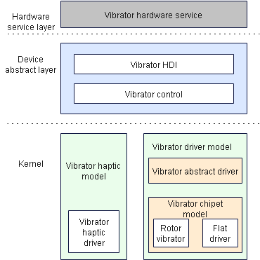
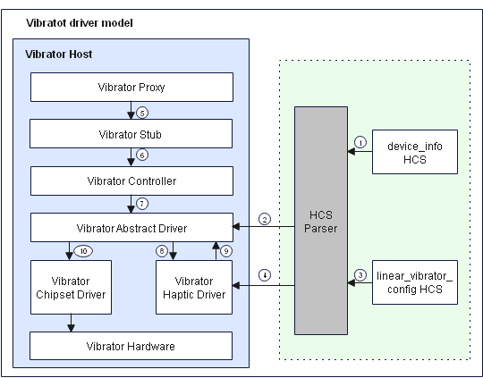

# Vibrator

## Overview

### Function

The vibrator driver model underpinned by the Hardware Driver Foundation (HDF) makes vibrator driver development easier and faster. This model shields the interaction between the device driver and the system, and provides unified and stable driver interface capabilities for the hardware service layer. It also provides open interfaces and interface parsing capabilities for developing vibrator drivers and deploying vibrators in different OSs.<br> The figure below shows the vibrator driver model.

**Figure 1** Vibrator driver model



### Basic Concepts

Vibrators can be classified into the following types based on the vibration mechanism:

- Rotor vibrator

  The rotor vibrator uses magnetic field caused by current to drive the rotor to rotate and produce vibration. Rotor vibrators include ordinary rotor vibrators and coin rotor vibrators. The rotor vibrators cannot start or stop quickly or implement multiple vibration modes. However, they have small footprint and are cost-efficient.

- Linear vibrator

  The linear vibrator drives the spring mass for linear movement and produces vibration. Linear vibrators include longitudinal and transverse linear vibrators. The linear vibrators start and stop quickly, produce different vibration inductions, and have good sense of direction.

The system calls vibrator driver interfaces to control the vibration of the device. Currently, there are two vibration modes:

- One-shot vibration

  The vibrator vibrates once for a given duration.

- Periodic vibration

  The vibrator vibrates at preset intervals. For example, if **haptic.clock.timer** is set to **[600, 600, 200, 600]**, the vibrator waits for 600 ms, vibrates for 600 ms, waits for 200 ms, and vibrates for 600 ms.

### Working Principles

The figure below shows how a vibrator driver is loaded.

**Figure 2** Vibrator driver working mechanism



The following describes how to load and start a vibrator driver on an RK35680 that runs the standard system.

1. Device Manager reads the vibrator management configuration from the **device_info.hcs** file.
2. The HDF Configuration Source (HCS) Parser parses the vibrator management configuration and loads the vibrator abstract driver.
3. Device Manager reads the vibrator data configuration from the **linear_vibrator_config.hcs** file.
4. The HCS parser parses the vibrator data configuration and loads the haptic driver.
5. The vibrator proxy obtains the vibrator HDI service instance and sends it to the vibrator stub over inter-process communication (IPC).
6. The vibrator stub processes IPC-related service logic and calls the vibrator controller after parameter deserialization.
7. The vibrator controller implements the HDI interfaces and calls the vibrator abstract driver interfaces over IPC.
8. The vibrator abstract driver starts the vibrator haptic driver.
9. The haptic driver calls **Start()** in the vibrator abstract driver.
10. The vibrator abstract driver calls **Start()** in the vibrator chipset-specific driver to control the vibrator device to vibrate with a given effect.

## Development Guidelines

### When to Use

You can set different vibration effects for your device, for example, you can set vibration effects with different intensities and durations for buttons on the device, and set one-shot or periodic vibration effects with different intensities and durations for clock alarms and incoming calls.

### Available APIs

The vibrator driver model supports static HCS and dynamic parameter configuration. The vibrator hardware service calls **StartOnce()** to trigger continuous vibration and calls **Start()** to trigger vibration with a specified effect. The following table describes the APIs provided by the vibrator driver model for the hardware service layer.

**Table 1** APIs of the vibrator driver model

**NOTE**<br>The following APIs are C interfaces. For details about the interface declaration, see [/drivers/peripheral/vibrator/interfaces/include](https://gitee.com/openharmony/drivers_peripheral/tree/master/vibrator/interfaces/include).

| API                                 | Description                                          |
| -------------------------------------- | ------------------------------------------------ |
| int32_t (*StartOnce)(uint32_t duration)                        | Triggers a one-short vibration with a given duration.<br>**duration** specifies the duration of the one-short vibration.      |
| int32_t (*Start)(const char *effectType)                        | Triggers periodic vibrations with a preset effect. <br>**effectType** indicates the pointer to the preset effect type.    |
| int32_t (*Stop)(enum VibratorMode mode)                         | Stops vibration. <br>**mode** indicates the vibration mode, which can be one-short or periodic vibration.                            |
| int32_t (*EnableVibratorModulation)(uint32_t duration, int32_t intensity, int32_t frequency) | Triggers a vibration with the given duration, frequency, and intensity.<br>**duration** indicates the duration of the vibration.<br>**intensity** indicates the vibration amplitude.<br>**frequency** indicates the vibrator frequency in the vibration period.|
| int32_t (*GetVibratorInfo)(struct VibratorInfo **vibratorInfo) | Obtains information about all vibrators whose amplitude and frequency can be set in the system. <br>**vibratorInfo** indicates the pointer to the vibrator information obtained.|
| int32_t (*EnableCompositeEffect)(struct CompositeEffect *effect); | Enables the composite effect for this vibrator.|
| int32_t (*GetEffectInfo)(const char *effectType, struct EffectInfo *effectInfo); | Obtains the vibration effect information of a specified effect type.|
| int32_t (*IsVibratorRunning)(bool state); | Checks whether the vibrator is running.|
| int32_t (*PlayHapticPattern)(const HapticPaket& pkg); | Plays haptics based on the HD haptic data in the form of a .pkg.|
| int32_t (*GetHapticCapacity)(HapticCapacity& hapticCapacity); | Obtains the haptic capabilities, including whether HD haptics is supported, whether predefined waveforms are supported, and whether delayed haptics is supported.|
| int32_t (*GetHapticStartUpTime)(int32_t mode, int32_t& startUpTime); | Obtains the haptic startup delay. **mode** indicates the vibration mode, and **startUpTime** indicates the haptic startup delay obtained.|

### How to Develop

The vibrator driver model provides interfaces for the upper-layer hardware service to trigger a one-shot vibration with a given duration, trigger vibration with a given effect, and stop vibration. This model implements functionalities such as cross-OS porting and device-specific configurations. The linear vibrator driver is used as an example to describe the driver development.

1. Develop the vibrator abstract driver.

   - Configure the vibrator host information for the vibrator abstract driver. For details, see **vendor\hihope\rk3568\hdf_config\khdf\device_info\device_info.hcs**.

     The code is as follows:

     ```c
     /* Vibrator HCS configuration. */
     vibrator :: host {
         hostName = "vibrator_host";
         device_vibrator :: device {
             device0 :: deviceNode {
              policy = 2;                                 // Policy for publishing the driver services.
                 priority = 100;                          // Priority (0–200) for starting the vibrator driver. A larger value indicates a lower priority. The recommended value is 100. For the drivers with the same priority, the device loading sequence is uncertain.
              preload = 0;                                // The value 0 means to load the driver during the system boot process. The value 2 means to dynamically load the driver after the system starts.
                 permission = 0664;                       // Permission for the device node created.
                 moduleName = "HDF_VIBRATOR";             // Vibrator driver name, which must be the same as moduleName in the driver entry structure.
                 serviceName = "hdf_misc_vibrator";       // Unique name of the service published by the vibrator driver.
                 deviceMatchAttr = "hdf_vibrator_driver"; // Keyword matching the private data of the driver. The value must be the same as that of match_attr in the private data configuration table of the driver.
            }
        }
     }
     ```

   - Create a vibrator haptic model and parse the haptic HCS. For details, see **drivers\hdf_core\framework\model\misc\vibrator\driver\src\vibrator_haptic.c**.

     The code is as follows:

     ```c
     /* Create a vibrator haptic model. */
     int32_t CreateVibratorHaptic(struct HdfDeviceObject *device)
     {
         struct VibratorHapticData *hapticData = NULL;
         CHECK_VIBRATOR_NULL_PTR_RETURN_VALUE(device, HDF_FAILURE);
     
         hapticData = (struct VibratorHapticData *)OsalMemCalloc(sizeof(*hapticData));
         CHECK_VIBRATOR_NULL_PTR_RETURN_VALUE(hapticData, HDF_ERR_MALLOC_FAIL);
         g_vibratorHapticData = hapticData;
         hapticData->supportHaptic = false;
     
         if (OsalMutexInit(&hapticData->mutex) != HDF_SUCCESS) {
             HDF_LOGE("%s: fail to init mutex", __func__);
             goto EXIT;
         }
     
         DListHeadInit(&hapticData->effectSeqHead);
     
         // Obtain the haptic HCS.
         if (ParserVibratorHapticConfig(device->property) != HDF_SUCCESS) {
             HDF_LOGE("%s: parser haptic config fail!", __func__);
             goto EXIT;
         }
     
         return HDF_SUCCESS;
     EXIT:
         OsalMemFree(hapticData);
         return HDF_FAILURE;
     }
     ```

   - Implement the vibrator abstract driver. For details, see **drivers\hdf_core\framework\model\misc\vibrator\driver\src\vibrator_driver.c**.

     - Define an **HdfDriverEntry** object, in which the driver entry function is defined as follows:

       ```c
       /* Register the entry struct of the vibrator abstract driver. */
       struct HdfDriverEntry g_vibratorDriverEntry = {
           .moduleVersion = 1,               // Vibrator module version.
           .moduleName = "HDF_VIBRATOR",     // Vibrator module name, which must be the same as moduleName in the device_info.hcs file.
           .Bind = BindVibratorDriver,       // Bind function for the vibrator driver.
           .Init = InitVibratorDriver,       // Init function for the vibrator driver.
           .Release = ReleaseVibratorDriver, // Release function for the vibrator driver.
       };
       /* Call HDF_INIT to register the driver entry with the HDF. When loading the driver, the HDF calls Bind() and then Init() to load the driver. If Init() fails to be called, the HDF calls Release() to release resources and exit the vibrator driver model. */
       HDF_INIT(g_vibratorDriverEntry);
       ```

     - Implement **Bind()** for the vibrator abstract driver as follows:

       ```c
       int32_t BindVibratorDriver(struct HdfDeviceObject *device)
       {
           struct VibratorDriverData *drvData = NULL;
           CHECK_VIBRATOR_NULL_PTR_RETURN_VALUE(device, HDF_FAILURE);
       
           drvData = (struct VibratorDriverData *)OsalMemCalloc(sizeof(*drvData));
           CHECK_VIBRATOR_NULL_PTR_RETURN_VALUE(drvData, HDF_ERR_MALLOC_FAIL);
       
           drvData->ioService.Dispatch = DispatchVibrator;
           drvData->device = device;
           device->service = &drvData->ioService;
           g_vibratorDrvData = drvData;
       
           return HDF_SUCCESS;
       }
       ```

     - Implement **Init()** for the vibrator abstract driver as follows:

       ```c
       int32_t InitVibratorDriver(struct HdfDeviceObject *device)
       {
           struct VibratorDriverData *drvData = NULL;
       
           CHECK_VIBRATOR_NULL_PTR_RETURN_VALUE(device, HDF_FAILURE);
           drvData = (struct VibratorDriverData *)device->service;
           CHECK_VIBRATOR_NULL_PTR_RETURN_VALUE(drvData, HDF_FAILURE);
       
           drvData->mode = VIBRATOR_MODE_BUTT;
           drvData->state = VIBRATOR_STATE_IDLE;
       
           if (OsalMutexInit(&drvData->mutex) != HDF_SUCCESS) {
               HDF_LOGE("%s: init mutex failed!", __func__);
               return HDF_FAILURE;
           }
       	 /* Initialize work queue resources. */
           if (HdfWorkQueueInit(&drvData->workQueue, VIBRATOR_WORK_QUEUE_NAME) != HDF_SUCCESS) {
               HDF_LOGE("%s: init workQueue failed!", __func__);
               return HDF_FAILURE;
           }
       
           if (HdfWorkInit(&drvData->work, VibratorWorkEntry, (void*)drvData) != HDF_SUCCESS) {
               HDF_LOGE("%s: init workQueue failed!", __func__);
               return HDF_FAILURE;
           }
       	/* Create the vibrator haptic model. */
           if (CreateVibratorHaptic(device) != HDF_SUCCESS) {
               HDF_LOGE("%s: create vibrator haptic failed!", __func__);
               return HDF_FAILURE;
           }
       
           return HDF_SUCCESS;
       }
       ```

     - Implement **Release()** for the vibrator abstract driver. This interface is used to release resources when the driver is unloaded or **Init()** fails to be called.

       ```c
       void ReleaseVibratorDriver(struct HdfDeviceObject *device)
       {
           struct VibratorDriverData *drvData = NULL;
       
           if (device == NULL) {
               HDF_LOGE("%s: device is null!", __func__);
               return;
           }
       
           drvData = (struct VibratorDriverData *)device->service;
           if (drvData == NULL) {
               HDF_LOGE("%s: drvData is null!", __func__);
               return;
           }
       
           (void)DestroyVibratorHaptic();
           (void)OsalMutexDestroy(&drvData->mutex);
           OsalMemFree(drvData);
           g_vibratorDrvData = NULL;
       }
       ```

     - Implement internal interfaces of the vibrator abstract driver to obtain vibrator information, set and stop the vibration mode, and create and destroy timers based on the vibration mode.

       - Implement **StartOnce()** for the vibrator abstract driver as follows:

         ```c
         /* Trigger vibration with a given duration. */
         static int32_t StartOnce(struct HdfSBuf *data, struct HdfSBuf *reply)
         {
             uint32_t duration;
             int32_t ret;
             struct VibratorEffectCfg config;
             struct VibratorDriverData *drvData = GetVibratorDrvData();
             (void)reply;
         
             CHECK_VIBRATOR_NULL_PTR_RETURN_VALUE(data, HDF_FAILURE);
             CHECK_VIBRATOR_NULL_PTR_RETURN_VALUE(drvData, HDF_FAILURE);
         
             if (!HdfSbufReadUint32(data, &duration)) {
                 HDF_LOGE("%s: sbuf read duration failed!", __func__);
                 return HDF_FAILURE;
             }
         
             if (duration == 0) {
                 HDF_LOGE("%s: vibrator duration invalid para!", __func__);
                 return HDF_ERR_INVALID_PARAM;
             }
         
             if (drvData->mode != VIBRATOR_MODE_BUTT) {
                 HDF_LOGI("%s: vibrater haptic is busy now, please stop first!", __func__);
                 return HDF_ERR_DEVICE_BUSY;
             }
         
             (void)OsalMutexLock(&drvData->mutex);
             drvData->mode = VIBRATOR_MODE_ONCE;
             (void)OsalMutexUnlock(&drvData->mutex);
         
             config.cfgMode = VIBRATOR_MODE_ONCE;
             config.duration = duration;
             config.effect = NULL;
         	/* Start haptics based on the vibration effect mode. */
             ret = StartHaptic(&config);
             if (ret != HDF_SUCCESS) {
                 HDF_LOGE("%s: start haptic failed!", __func__);
                 return ret;
             }
         
             return HDF_SUCCESS;
         }
         ```

       - Implement **StartEffect()** for the vibrator abstract driver as follows:

         ```c
         /* Trigger a vibration with a given effect. */
         static int32_t StartEffect(struct HdfSBuf *data, struct HdfSBuf *reply)
         {
             int32_t ret;
             const char *effect = NULL;
             struct VibratorEffectCfg config;
             struct VibratorDriverData *drvData = GetVibratorDrvData();
             (void)reply;
         
             CHECK_VIBRATOR_NULL_PTR_RETURN_VALUE(data, HDF_FAILURE);
             CHECK_VIBRATOR_NULL_PTR_RETURN_VALUE(drvData, HDF_FAILURE);
         	/* Read the preset vibration effect from HdfSBuf and start the vibrator. */
             effect = HdfSbufReadString(data);
             CHECK_VIBRATOR_NULL_PTR_RETURN_VALUE(effect, HDF_FAILURE);
         
             if (drvData->mode != VIBRATOR_MODE_BUTT) {
                 HDF_LOGI("%s: vibrater haptic is busy now, please stop first!", __func__);
                 return HDF_ERR_DEVICE_BUSY;
             }
         
             (void)OsalMutexLock(&drvData->mutex);
             drvData->mode = VIBRATOR_MODE_PRESET;
             (void)OsalMutexUnlock(&drvData->mutex);
         
             // Start one-shot vibration.
             config.cfgMode = VIBRATOR_MODE_PRESET;
             config.duration = 0;
             config.effect = effect;
         	/* Start haptics with the preset effect. */
             ret = StartHaptic(&config);
             if (ret != HDF_SUCCESS) {
                 HDF_LOGE("%s: start haptic failed!", __func__);
                 return ret;
             }
         
             return HDF_SUCCESS;
         }
         ```

       - Implement **Stop()** for the vibrator abstract driver as follows:

         ```c
         /* Stop vibration based on the specified vibration mode. */
         static int32_t Stop(struct HdfSBuf *data, struct HdfSBuf *reply)
         {
             int32_t ret;
             int32_t mode;
             struct VibratorDriverData *drvData = GetVibratorDrvData();
             (void)reply;
         
             CHECK_VIBRATOR_NULL_PTR_RETURN_VALUE(data, HDF_FAILURE);
             CHECK_VIBRATOR_NULL_PTR_RETURN_VALUE(drvData, HDF_FAILURE);
         	/* Read the specified vibration mode from HdfSBuf and then stop the vibration. */
             if (!HdfSbufReadInt32(data, &mode)) {
                 HDF_LOGE("%s: sbuf read mode failed!", __func__);
                 return HDF_FAILURE;
             }
         
             if ((mode != VIBRATOR_MODE_ONCE) && (mode != VIBRATOR_MODE_PRESET)) {
                 HDF_LOGE("%s: vibrator stop mode failed!", __func__);
                 return HDF_FAILURE;
             }
         
             if (drvData->mode == VIBRATOR_MODE_BUTT) {
                 HDF_LOGD("%s: vibrater haptic had stopped!", __func__);
                 return HDF_SUCCESS;
             }
         	 /* Stop haptics and destroy the timer. */
             ret = StopHaptic();
             if (ret != HDF_SUCCESS) {
                 HDF_LOGE("%s: stop haptic failed!", __func__);
                 return ret;
             }
         
             (void)OsalMutexLock(&drvData->mutex);
             drvData->mode = VIBRATOR_MODE_BUTT;
             (void)OsalMutexUnlock(&drvData->mutex);
         
             return HDF_SUCCESS;
         }
         ```

       - Implement **GetVibratorInfo** for the vibrator abstract driver as follows:

         ```c
         /* Obtain vibrator information, including whether the intensity and frequency can be set and the intensity and frequency range. */
         static int32_t GetVibratorInfo(struct HdfSBuf *data, struct HdfSBuf *reply)
         {
             (void)data;
             struct VibratorDriverData *drvData;
         
             drvData = GetVibratorDrvData();
             CHECK_VIBRATOR_NULL_PTR_RETURN_VALUE(drvData, HDF_ERR_INVALID_PARAM);
             CHECK_VIBRATOR_NULL_PTR_RETURN_VALUE(reply, HDF_ERR_INVALID_PARAM);
         
             if (!HdfSbufWriteBuffer(reply, &drvData->vibratorInfo, sizeof(drvData->vibratorInfo))) {
                 HDF_LOGE("%s: write sbuf failed!", __func__);
                 return HDF_FAILURE;
             }
         
             return HDF_SUCCESS;
         }
         ```

       - Implement **EnableModulationParameter** for the vibrator abstract driver as follows:

         ```c
         /* Trigger vibration with the given duration, frequency, and intensity. */
         static int32_t EnableModulationParameter(struct HdfSBuf *data, struct HdfSBuf *reply)
         {
             (void)reply;
             struct VibratorEffectCfg config;
             struct VibratorDriverData *drvData;
             uint32_t duration;
             uint16_t intensity;
             int16_t frequency;
             int32_t ret;
         
             drvData = GetVibratorDrvData();
             CHECK_VIBRATOR_NULL_PTR_RETURN_VALUE(drvData, HDF_ERR_INVALID_PARAM);
             CHECK_VIBRATOR_NULL_PTR_RETURN_VALUE(drvData->ops.SetParameter, HDF_ERR_INVALID_PARAM);
             CHECK_VIBRATOR_NULL_PTR_RETURN_VALUE(data, HDF_ERR_INVALID_PARAM);
         
             if (drvData->mode != VIBRATOR_MODE_BUTT) {
                 HDF_LOGE("%s: vibrater is busy now, please stop first!", __func__);
                 return HDF_ERR_DEVICE_BUSY;
             }
         
             if (!HdfSbufReadUint32(data, &duration)) {
                 HDF_LOGE("%s: sbuf read vibration period failed!", __func__);
                 return HDF_FAILURE;
             }
         
             if (!HdfSbufReadUint16(data, &intensity)) {
                 HDF_LOGE("%s: sbuf read intensity failed!", __func__);
                 return HDF_FAILURE;
             }
         
             if (!HdfSbufReadInt16(data, &frequency)) {
                 HDF_LOGE("%s: sbuf read frequency failed!", __func__);
                 return HDF_FAILURE;
             }
         
             (void)OsalMutexLock(&drvData->mutex);
             drvData->mode = VIBRATOR_MODE_ONCE;
             (void)OsalMutexUnlock(&drvData->mutex);
         
             ret = drvData->ops.SetParameter(intensity, frequency);
             if (ret != HDF_SUCCESS) {
                 HDF_LOGE("%s: set parameter failed!", __func__);
                 return HDF_FAILURE;
             }
         
             config.cfgMode = VIBRATOR_MODE_ONCE;
             config.duration = duration;
             config.effect = NULL;
         	/* Start haptics with the preset effect. */
             ret = StartHaptic(&config);
             if (ret != HDF_SUCCESS) {
                 HDF_LOGE("%s: start haptic failed!", __func__);
                 return HDF_FAILURE;
             }
         
             return HDF_SUCCESS;
         }
         ```

       - Register the chipset-specific vibrator driver interfaces when the vibrator driver is successfully initialized. The implementation is as follows:

         ```c
         /* Register the chipset-specific vibrator driver interfaces. */
         int32_t RegisterVibrator(struct VibratorOps *ops)
         {
             struct VibratorDriverData *drvData = GetVibratorDrvData();
         
             CHECK_VIBRATOR_NULL_PTR_RETURN_VALUE(ops, HDF_FAILURE);
             CHECK_VIBRATOR_NULL_PTR_RETURN_VALUE(drvData, HDF_FAILURE);
         
             (void)OsalMutexLock(&drvData->mutex);
             drvData->ops.Start = ops->Start;
             drvData->ops.StartEffect = ops->StartEffect;
             drvData->ops.Stop = ops->Stop;
             drvData->ops.SetParameter = ops->SetParameter;
             (void)OsalMutexUnlock(&drvData->mutex);
         
             return HDF_SUCCESS;
         }
         
         /* Register the VibratorInfo struct. */
         int32_t RegisterVibratorInfo(struct VibratorInfo *vibratorInfo)
         {
             struct VibratorDriverData *drvData = GetVibratorDrvData();
         
             CHECK_VIBRATOR_NULL_PTR_RETURN_VALUE(vibratorInfo, HDF_FAILURE);
             CHECK_VIBRATOR_NULL_PTR_RETURN_VALUE(drvData, HDF_FAILURE);
         
             (void)OsalMutexLock(&drvData->mutex);
             if (memcpy_s(&drvData->vibratorInfo, sizeof(drvData->vibratorInfo), vibratorInfo, sizeof(*vibratorInfo)) != EOK) {
                 HDF_LOGE("%s: Memcpy vibrator config failed", __func__);
                 return HDF_FAILURE;
             }
             (void)OsalMutexUnlock(&drvData->mutex);
         
             return HDF_SUCCESS;
         }
         ```

1. Develop chipset-specific vibrator drivers.

   - Configure the vibrator host information for the chipset-specific vibrator driver. For details, see **vendor\hihope\rk3568\hdf_config\khdf\device_info\device_info.hcs**.

     The code is as follows:

     ```c
     device_linear_vibrator :: device {
     	device0 :: deviceNode {
     		policy = 1;                                    // Policy for publishing the driver services.
     		priority = 105;                                // Priority (0–200) for starting the vibrator driver. A larger value indicates a lower priority. The recommended value is 100. For the drivers with the same priority, the device loading sequence is uncertain.
             preload = 0;                                    // The value 0 means to load the driver during the system boot process. The value 2 means to dynamically load the driver after the system starts.
             permission = 0664;                              // Permission for the DeviceNode created.
             moduleName = "HDF_LINEAR_VIBRATOR";             // Driver name, which must be the same as moduleName in the driver entry struct.
            serviceName = "hdf_misc_linear_vibrator";        // Unique name of the service released by the linear vibrator.
             deviceMatchAttr = "hdf_linear_vibrator_driver"; // Keyword for matching the private data of the chipset-specific vibrator driver. The value must be the same as that of match_attr in the private data configuration table of the driver.
         }
     }
     ```

   - Configure the private HCS configuration of the chipset-specific vibrator driver.

     - For details, see **vendor\hihope\rk3568\hdf_config\khdf\vibrator\linear_vibrator_config.hcs**.

     - The code is as follows:

       ```c
       root {
           linearVibratorConfig {
               boardConfig {
                   match_attr = "hdf_linear_vibrator_driver"; // The value must be the same as that of match_attr in the vibrator device configuration file.
                   VibratorBusConfig {
                       busType = 1;    // 0 stands for I2C; 1 for GPIO.
                       busNum = 154;
                   }
                   VibratorChipConfig {
                       isSupportIntensity = 0; // Whether vibrator intensity can be set. The value 1 means the vibrator intensity can be set; the value 0 means the opposite.
                       isSupportFrequency = 0; // Whether vibrator frequency can be set. The value 1 means the vibrator frequency can be set; the value 0 means the opposite.
                       intensityMaxValue = 0;  // Maximum vibrator intensity supported.
                       intensityMinValue = 0;  // Minimum vibrator intensity supported.
                       frequencyMaxValue = 0;  // Maximum vibrator frequency supported.
                       frequencyMinValue = 0;  // Minimum vibrator frequency supported.
                   }
               }
           }
       }
       ```

   - Implement the chipset-specific vibrator driver. For details, see **drivers\peripheral\vibrator\chipset\linear\vibrator_linear_driver.c**.

     - Define the **HdfDriverEntry** object of the chipset-specific vibrator driver. The driver entry function is defined as follows:

       ```c
       struct HdfDriverEntry g_linearVibratorDriverEntry = {
           .moduleVersion = 1,
           .moduleName = "HDF_LINEAR_VIBRATOR",
           .Bind = BindLinearVibratorDriver,
           .Init = InitLinearVibratorDriver,
           .Release = ReleaseLinearVibratorDriver,
       };
       
       HDF_INIT(g_linearVibratorDriverEntry);
       ```

     - Implement **Bind()** for the chipset-specific vibrator driver as follows:

       ```c
       int32_t BindLinearVibratorDriver(struct HdfDeviceObject *device)
       {
           struct VibratorLinearDriverData *drvData = NULL;
       
           CHECK_VIBRATOR_NULL_PTR_RETURN_VALUE(device, HDF_FAILURE);
       
           drvData = (struct VibratorLinearDriverData *)OsalMemCalloc(sizeof(*drvData));
           CHECK_VIBRATOR_NULL_PTR_RETURN_VALUE(drvData, HDF_ERR_MALLOC_FAIL);
       
           drvData->ioService.Dispatch = DispatchLinearVibrator;
           drvData->device = device;
           device->service = &drvData->ioService;
           g_linearVibratorData = drvData;
       
           return HDF_SUCCESS;
       }
       ```

     - Implement **Init()** for the chipset-specific vibrator driver as follows:

       ```c
       int32_t InitLinearVibratorDriver(struct HdfDeviceObject *device)
       {
           static struct VibratorOps ops;
           struct VibratorLinearDriverData *drvData = NULL;
       
           CHECK_VIBRATOR_NULL_PTR_RETURN_VALUE(device, HDF_FAILURE);
       
           drvData = (struct VibratorLinearDriverData *)device->service;
           CHECK_VIBRATOR_NULL_PTR_RETURN_VALUE(drvData, HDF_FAILURE);
       
           ops.Start = StartLinearVibrator;
           ops.StartEffect = StartEffectLinearVibrator;
           ops.Stop = StopLinearVibrator;
           ops.SetParameter = NULL;
       	
           if (RegisterVibratorOps(&ops) != HDF_SUCCESS) {
               HDF_LOGE("%s: register vibrator ops fail", __func__);
               return HDF_FAILURE;
           }
       
           drvData->linearCfgData = (struct VibratorCfgData *)OsalMemCalloc(sizeof(*drvData->linearCfgData));
           CHECK_VIBRATOR_NULL_PTR_RETURN_VALUE(drvData->linearCfgData, HDF_ERR_MALLOC_FAIL);
       	/* Parse the vibrator configuration in the register. */
           if (GetVibratorBaseConfigData(device->property, drvData->linearCfgData) != HDF_SUCCESS) {
               HDF_LOGE("%s: parser vibrator cfg fail", __func__);
               return HDF_FAILURE;
           }
       	/* Register the vibrator information for initialization. */
           if (RegisterVibratorInfo(&drvData->linearCfgData->vibratorInfo) != HDF_SUCCESS) {
               HDF_LOGE("%s: register vibrator info fail", __func__);
               return HDF_FAILURE;
           }
       
           if (GpioSetDir(drvData->linearCfgData->vibratorBus.GpioNum, GPIO_DIR_OUT) != HDF_SUCCESS) {
               HDF_LOGE("%s: set vibrator gpio fail", __func__);
               return HDF_FAILURE;
           }
           return HDF_SUCCESS;
       }
       ```

     - Implement **Release()** for the chipset-specific vibrator driver as follows:

       ```c
       void ReleaseLinearVibratorDriver(struct HdfDeviceObject *device)
       {
           struct VibratorLinearDriverData *drvData = NULL;
       
           if (device == NULL) {
               HDF_LOGE("%s: Device is null", __func__);
               return;
           }
           drvData = (struct VibratorLinearDriverData *)device->service;
           if (drvData == NULL) {
               HDF_LOGE("%s: DrvData pointer is null", __func__);
               return;
           }
       
           OsalMemFree(drvData->linearCfgData);
           OsalMemFree(drvData);
           g_linearVibratorData = NULL;
       }
       ```
       
     - Implement the internal interfaces of the chipset-specific vibrator driver as follows:

       ```c
       /* Start the vibrator. */
       static int32_t StartLinearVibrator(void)
       {
           int32_t ret;
           struct VibratorLinearDriverData *drvData = GetLinearVibratorData();
           CHECK_VIBRATOR_NULL_PTR_RETURN_VALUE(drvData, HDF_FAILURE);
       
           if (drvData->linearCfgData->vibratorBus.busType != VIBRATOR_BUS_GPIO) {
               HDF_LOGE("%s: vibrator bus type not gpio", __func__);
               return HDF_FAILURE;
           }
       
           ret = GpioWrite(drvData->linearCfgData->vibratorBus.GpioNum, GPIO_VAL_HIGH);
           if (ret != HDF_SUCCESS) {
               HDF_LOGE("%s: pull gpio%d to %d level failed", __func__,
                   drvData->linearCfgData->vibratorBus.GpioNum, GPIO_VAL_HIGH);
               return ret;
           }
           return HDF_SUCCESS;
       }
       /* Start the vibrator based on the specified effect. */
       static int32_t StartEffectLinearVibrator(uint32_t effectType)
       {
           (void)effectType;
           HDF_LOGE("%s: vibrator set built-in effect no support!", __func__);
           return HDF_SUCCESS;
       }
       /* Stop the vibrator. */
       static int32_t StopLinearVibrator(void)
       {
           int32_t ret;
           struct VibratorLinearDriverData *drvData = GetLinearVibratorData();
           CHECK_VIBRATOR_NULL_PTR_RETURN_VALUE(drvData, HDF_FAILURE);
       
           if (drvData->linearCfgData->vibratorBus.busType != VIBRATOR_BUS_GPIO) {
               HDF_LOGE("%s: vibrator bus type not gpio", __func__);
               return HDF_FAILURE;
           }
       
           ret = GpioWrite(drvData->linearCfgData->vibratorBus.GpioNum, GPIO_VAL_LOW);
           if (ret != HDF_SUCCESS) {
               HDF_LOGE("%s: pull gpio%d to %d level failed", __func__,
                   drvData->linearCfgData->vibratorBus.GpioNum, GPIO_VAL_LOW);
               return ret;
           }
           return HDF_SUCCESS;
       }
       ```


### Verification

After the driver is developed, develop auto-test cases in the vibrator unit test to verify the basic functionalities of the driver. Use the developer self-test platform as the test environment.

- The reference test code is as follows:

  ```c
  #include <cmath>
  #include <cstdio>
  #include <gtest/gtest.h>
  #include <securec.h>
  #include "hdf_base.h"
  #include "osal_time.h"
  #include "vibrator_if.h"
  #include "vibrator_type.h"
  
  using namespace testing::ext;
  const struct VibratorInterface *g_vibratorDev = nullptr;
  static struct VibratorInfo *g_vibratorInfo = nullptr;
  
  class HdfVibratorTest : public testing::Test {
  public:
      static void SetUpTestCase();
      static void TearDownTestCase();
      void SetUp();
      void TearDown();
  };
  /* Initialize the vibrator interface instance before executing test cases. */
  void HdfVibratorTest::SetUpTestCase()
  {
      g_vibratorDev = NewVibratorInterfaceInstance();
  }
  /* Release test case resources. */
  void HdfVibratorTest::TearDownTestCase()
  {
      if(g_vibratorDev != nullptr){
          FreeVibratorInterfaceInstance();
          g_vibratorDev = nullptr;
      }
  }
  
  void HdfVibratorTest::SetUp()
  {
  }
  
  void HdfVibratorTest::TearDown()
  {
  }
  
  /* Verify one-short vibration. */
  HWTEST_F(HdfVibratorTest, PerformOneShotVibratorDuration_001, TestSize.Level1)
  {
      uint32_t duration = 1000;
      uint32_t sleepTime = 2000;
      
      ASSERT_NE(nullptr, g_vibratorDev);
  
      int32_t startRet = g_vibratorDev->StartOnce(duration);
      EXPECT_EQ(startRet, HDF_SUCCESS);
  
      OsalMSleep(sleepTime);
  
      int32_t endRet = g_vibratorDev->Stop(VIBRATOR_MODE_ONCE);
      EXPECT_EQ(endRet, HDF_SUCCESS);
  }
  /* Verify vibration with the preset effect. */
  HWTEST_F(HdfVibratorTest, ExecuteVibratorEffect_001, TestSize.Level1)
  {
      uint32_t sleepTime = 5000;
      const char *timeSequence = "haptic.clock.timer";
  
      ASSERT_NE(nullptr, g_vibratorDev);
  
      int32_t startRet = g_vibratorDev->Start(timeSequence);
      EXPECT_EQ(startRet, HDF_SUCCESS);
  
      OsalMSleep(sleepTime);
  
      int32_t endRet = g_vibratorDev->Stop(VIBRATOR_MODE_PRESET);
      EXPECT_EQ(endRet, HDF_SUCCESS);
  }
  /* Obtain vibrator information, including whether the intensity and frequency can be set and the intensity and frequency range. */
  HWTEST_F(HdfVibratorTest, GetVibratorInfo_001, TestSize.Level1)
  {
      ASSERT_NE(nullptr, g_vibratorDev);
  
      int32_t startRet = g_vibratorDev->GetVibratorInfo(&g_vibratorInfo);
      EXPECT_EQ(startRet, HDF_SUCCESS);
      EXPECT_NE(g_vibratorInfo, nullptr);
  
      printf("intensity = %d, intensityMaxValue = %d, intensityMinValue = %d\n\t",
      g_vibratorInfo->isSupportIntensity, g_vibratorInfo->intensityMaxValue, g_vibratorInfo->intensityMinValue);
      printf("frequency = %d, frequencyMaxValue = %d, frequencyMinValue = %d\n\t",
      g_vibratorInfo->isSupportFrequency, g_vibratorInfo->frequencyMaxValue, g_vibratorInfo->frequencyMinValue);
  }
  /* Trigger vibration with the given duration, frequency, and intensity. */
  HWTEST_F(HdfVibratorTest, EnableVibratorModulation_001, TestSize.Level1)
  {
      int32_t startRet;
      int32_t intensity = 30;
      int32_t frequency = 200;
      uint32_t duration = 1000;
      uint32_t sleepTime = 2000;
   
      ASSERT_NE(nullptr, g_vibratorDev);
  
      if ((g_vibratorInfo->isSupportIntensity == 1) || (g_vibratorInfo->isSupportFrequency == 1)) {
          EXPECT_GE(intensity, g_vibratorInfo->intensityMinValue);
       EXPECT_LE(intensity, g_vibratorInfo->intensityMaxValue);
          EXPECT_GE(frequency, g_vibratorInfo->frequencyMinValue);
       EXPECT_LE(frequency, g_vibratorInfo->frequencyMaxValue);
  
          startRet = g_vibratorDev->EnableVibratorModulation(duration, intensity, duration);
          EXPECT_EQ(startRet, HDF_SUCCESS);
          OsalMSleep(sleepTime);
          startRet = g_vibratorDev->Stop(VIBRATOR_MODE_ONCE);
          EXPECT_EQ(startRet, HDF_SUCCESS);
      }
  }
  ```

- The reference code of the .gn file is as follows:

  ```c++
  import("//build/ohos.gni")
  import("//build/test.gni")
  import("//drivers/hdf_core/adapter/uhdf2/uhdf.gni")
  
  module_output_path = "drivers_peripheral_vibrator/vibrator"
  ohos_unittest("vibrator_test") {
    module_out_path = module_output_path
    sources = [ "vibrator_test.cpp" ]
    include_dirs = [
      "//drivers/peripheral/vibrator/interfaces/include",
    ]
    deps = [ "//drivers/peripheral/vibrator/hal:hdi_vibrator" ]
  
    external_deps = [
      "c_utils:utils",
      "hdf_core:libhdf_utils",
      "hiviewdfx_hilog_native:libhilog",
    ]
  
    cflags = [
   "-Wall",
      "-Wextra",
      "-Werror",
      "-Wno-format",
      "-Wno-format-extra-args",
    ]
  
    install_enable = true
    install_images = [ "vendor" ]
    module_install_dir = "bin"
    part_name = "unionman_products"
  }
  ```
