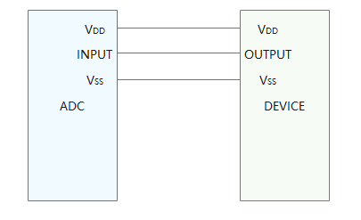
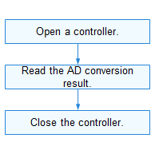

# ADC

## Overview

### Function

An analog-to-digital converter (ADC) converts analog signals into digital signals for storage and computing. In addition to the power cable and ground cable, the ADC requires only one cable to connect to the target device. The following figure shows the physical connection of the ADC.

**Figure 1** ADC physical connection



The ADC module provides a set of APIs to complete AD conversion, including:

-  Opening or closing an ADC device
-  Obtaining the analog-to-digital (AD) conversion result

### Basic Concepts

- Resolution

  The number of binary bits that can be converted by an ADC. A greater number of bits indicates a higher resolution.

- Conversion error

  Difference between the actual and theoretical digital values output by an ADC. It is expressed by a multiple of the least significant bit. Generally, the maximum output error is used.

- Transition time

  Time required by an ADC to perform a complete conversion.

### Working Principles

In the Hardware Driver Foundation (HDF), the ADC module uses the unified service mode for API adaptation. In this mode, a service is used as the ADC manager to handle external access requests in a unified manner. The unified service mode applies when the system has multiple device objects of the same type. If the independent service mode is used in this case, more device nodes need to be configured and more memory resources will be consumed.

### Constraints

The ADC module can read data only in polling mode.

## Usage Guidelines

### When to Use

ADC devices are used to convert analog voltage or current into digital parameters. For example, an ADC can be used with an NTC resistor to measure temperature, or can be used to convert the output of an analog sensor into a digital parameter.

### Available APIs

The following table describes the APIs of the ADC module. For more information, see **//drivers/hdf_core/framework/include/platform/adc_if.h**.

**Table 1** APIs of the ADC driver

| API  | Description        |
| -------- | ---------------- |
| DevHandle AdcOpen(uint32_t number)  | Opens an ADC device.     |
| void AdcClose(DevHandle handle) | Closes an ADC device.     |
| int32_t AdcRead(DevHandle handle, uint32_t channel, uint32_t \*val)  | Obtains the AD conversion result.|

### How to Develop

The following figure illustrates how to use ADC APIs.

 **Figure 2** Process of using ADC APIs




#### Opening an ADC Device

Call **AdcOpen()** to open an ADC device.

```c
DevHandle AdcOpen(int16_t number);
```

**Table 2** Description of AdcOpen

| Parameter      | Description         |
| ---------- | ----------------- |
| number     | ADC device number.        |
| **Return Value**| **Description**   |
| NULL       | The operation fails.  |
| Device handle  | The operation is successful. The handle of the ADC device opened is returned.|

Example: Open device 1 of the two ADCs (numbered 0 and 1) in the system.

```c
DevHandle adcHandle = NULL; /* ADC device handle /

/* Open ADC device 1. */
adcHandle = AdcOpen(1);
if (adcHandle == NULL) {
    HDF_LOGE("AdcOpen: fail\n");
    return;
}
```

#### Obtaining the AD Conversion Result

```c
int32_t AdcRead(DevHandle handle, uint32_t channel, uint32_t *val);
```

**Table 3** Description of AdcRead

| Parameter      | Description      |
| ---------- | -------------- |
| handle     | ADC device handle.   |
| channel    | ADC device channel number. |
| val        | Pointer to the AD conversion result.    |
| **Return Value**| **Description**|
| 0          | The operation is successful.      |
| Negative value      | The operation fails.      |

Example: Obtain the AD conversion result of channel 1.

```c
uint32_t value;
int32_t ret;

ret = AdcRead(adcHandle, 1, &value);
if (ret != 0) {
    HDF_LOGE("ADC read fail!\n");
    return;
}
```

#### Closing an ADC Device

Call **AdcClose()** to close the ADC device after the ADC communication is complete.
```c
void AdcClose(DevHandle handle); 
```
**Table 4** Description of AdcClose

| Parameter  | Description   |
| ------ | ----------- |
| handle | ADC device handle.|
| **Return Value**| **Description** |
| N/A    | N/A         |

Example:

```c
AdcClose(adcHandle); /* Close the ADC device. */
```

### Example

The following example shows how to use ADC APIs to manage an ADC device on a Hi3516D V300 board.

The hardware information is as follows:

-   SoC: hi3516dv300

-   The potentiometer is connected to channel 1 of ADC 0.

Perform continuous read operations on the ADC device to check whether the ADC is functioning.

Example:

```c
#include "adc_if.h"          /* Header file for ADC APIs */
#include "hdf_log.h"         /* Header file for log APIs */

/* Define device 0, channel 1. */
#define ADC_DEVICE_NUM  0
#define ADC_CHANNEL_NUM 1
#define ADC_TEST_NUM    30

/* Main entry of ADC routines. */
static int32_t TestCaseAdc(void)
{
    int32_t i;
    int32_t ret;
    DevHandle adcHandle = NULL;
    uint32_t readBuf[ADC_TEST_NUM] = {0};

    /* Open the ADC device. */
    adcHandle = AdcOpen(ADC_DEVICE_NUM);
    if (adcHandle == NULL) {
        HDF_LOGE("%s: Open ADC%u fail!", __func__, ADC_DEVICE_NUM);
        return -1;
    }

    /* Perform 30 times of AD conversions continuously and read the conversion results. */
    for (i = 0; i < ADC_TEST_NUM; i++) {
        ret = AdcRead(adcHandle, ADC_CHANNEL_NUM, &readBuf[i]);
        if (ret != HDF_SUCCESS) {
            HDF_LOGE("%s: ADC read fail!:%d", __func__, ret);
            AdcClose(adcHandle);
            return -1;
        }
    }
    HDF_LOGI("%s: ADC read successful!", __func__);

    /* Close the ADC device. */
    AdcClose(adcHandle);

    return 0;
}
```
