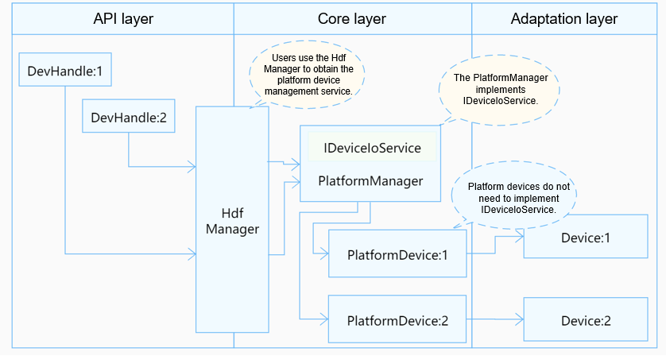

# ADC

## Overview

### Function

An analog-to-digital converter (ADC) is a device that converts analog signals into digital signals.

### Basic Concepts

- Resolution

  The number of binary bits that can be converted by an ADC. A greater number of bits indicates a higher resolution.

- Conversion error

  Difference between the actual and theoretical digital values output by an ADC. It is expressed by a multiple of the least significant bit. Generally, the maximum output error is used.

- Transition time

  Time required by an ADC to perform a complete conversion.


### Working Principles

In the Hardware Driver Foundation (HDF), the ADC module uses the unified service mode for API adaptation. In this mode, a device service is used as the ADC manager to handle access requests from the devices of the same type in a unified manner. The unified service mode applies to the scenario where there are many device objects of the same type. If the independent service mode is used in this case, more device nodes need to be configured and more memory resources will be consumed. The following figure illustrates the unified service mode of the ADC module.

The ADC module is divided into the following layers:

- Interface layer: provides the capabilities of opening a device, writing data, and closing a device.
- Core layer: binds services, initializes and releases the PlatformManager, and provides the capabilities of adding, deleting, and obtaining controllers.
- Adaptation layer: implements hardware-related functions, such as controller initialization.

In the unified service mode, the core layer manages all controllers in a unified manner and publishes a service for the interface layer. That is, the driver does not need to publish a service for each controller.

**Figure 1** Unified service mode



## Usage Guidelines

### When to Use

ADC devices are used to convert analog voltage into digital parameters. For example, an ADC can be used with an NTC resistor to measure temperature, or can be used to convert the output of an analog sensor into a digital parameter. Before using ADC devices with OpenHarmony, you need to adapt the ADC driver to OpenHarmony. The following describes how to do it.

### Available APIs

To enable the upper layer to successfully operate the hardware by calling the ADC APIs, hook functions are defined in **//drivers/hdf_core/framework/support/platform/include/adc/adc_core.h** for the core layer. You need to implement these hook functions at the adaptation layer and hook them to implement the interaction between the interface layer and the core layer.

Definitions of **AdcMethod** and **AdcLockMethod**:

```c
struct AdcMethod {
    int32_t (*read)(struct AdcDevice *device, uint32_t channel, uint32_t *val);
    int32_t (*start)(struct AdcDevice *device);
    int32_t (*stop)(struct AdcDevice *device);
};

struct AdcLockMethod {
    int32_t (*lock)(struct AdcDevice *device);
    void (*unlock)(struct AdcDevice *device);
};

```

At the adaptation layer, **AdcMethod** must be implemented, and **AdcLockMethod** can be implemented based on service requirements. The core layer provides the default **AdcLockMethod**, in which a spinlock is used to protect the critical section.

```c
static int32_t AdcDeviceLockDefault(struct AdcDevice *device)
{
    if (device == NULL) {
        return HDF_ERR_INVALID_OBJECT;
    }
    return OsalSpinLock(&device->spin);
}

static void AdcDeviceUnlockDefault(struct AdcDevice *device)
{
    if (device == NULL) {
        return;
    }
    (void)OsalSpinUnlock(&device->spin);
}

static const struct AdcLockMethod g_adcLockOpsDefault = {
    .lock = AdcDeviceLockDefault,
    .unlock = AdcDeviceUnlockDefault,
};

```

If spinlock cannot be used, you can use another type of lock to implement **AdcLockMethod**. The custom **AdcLockMethod** will replace the default **AdcLockMethod**.

  **Table 1** Hook functions in **AdcMethod**

| Function| Input Parameter| Output Parameter| Return Value| Description|
| -------- | -------- | -------- | -------- | -------- |
| read | **device**: structure pointer to the ADC controller at the core layer.<br>**channel**: channel number, which is of the uint32_t type.| **val**: pointer to the signal data to be transmitted. It is of the uint32_t type.| HDF_STATUS| Reads the signal data sampled by the ADC.|
| stop | **device**: structure pointer to the ADC controller at the core layer.| –| HDF_STATUS| Stops an ADC device.|
| start | **device**: structure pointer to the ADC controller at the core layer.| –| HDF_STATUS| Starts an ADC device.|

**Table 2** Functions in **AdcLockMethod**

| Function| Input Parameter| Output Parameter| Return Value| Description|
| -------- | -------- | -------- | -------- | -------- |
| lock | **device**: structure pointer to the ADC device object at the core layer.| –| HDF_STATUS| Acquires the critical section lock.|
| unlock | **device**: structure pointer to the ADC device object at the core layer.| –| HDF_STATUS| Releases the critical section lock.|

### How to Develop

The ADC module adaptation involves the following steps:

1. Instantiate the driver entry.
   - Instantiate the **HdfDriverEntry** structure.
   - Call **HDF_INIT** to register the **HdfDriverEntry** instance with the HDF.

2. Configure attribute files.
   - Add the **deviceNode** information to the **device_info.hcs** file.
   - (Optional) Add the **adc_config.hcs** file.

3. Instantiate the core layer APIs.
   - Initialize **AdcDevice**.
   - Instantiate **AdcMethod** in the **AdcDevice** object.
      >  **NOTE**<br>
      > For details about the functions in **AdcMethod**, see [Available APIs](#available-apis).

### Example

The following uses the Hi3516D V300 driver **//device/soc/hisilicon/common/platform/adc/adc_hi35xx.c** as an example to describe how to perform the ADC driver adaptation.

1. Instantiate the driver entry.

   The driver entry must be a global variable of the **HdfDriverEntry** type (defined in **hdf_device_desc.h**), and the value of **moduleName** must be the same as that in **device_info.hcs**. In the HDF, the start address of each **HdfDriverEntry** object of all loaded drivers is collected to form a segment address space similar to an array for the upper layer to invoke.

   Generally, the HDF calls the **Bind** function and then the **Init** function to load a driver. If **Init** fails to be called, the HDF calls **Release** to release driver resources and exit.

   ADC driver entry example:

   Multiple devices may connect to the ADC controller. In the HDF, a manager object needs to be created for this type of devices. When a device needs to be started, the manager object locates the target device based on the specified parameters.

   You do not need to implement the driver of the ADC manager, which is implemented by the core layer. However, the **AdcDeviceAdd** function of the core layer must be invoked in the **Init** function to implement the related features.

    ```c
    static struct HdfDriverEntry g_hi35xxAdcDriverEntry = {
        .moduleVersion = 1,
        .Init = Hi35xxAdcInit,
        .Release = Hi35xxAdcRelease,
        .moduleName = "hi35xx_adc_driver",        // (Mandatory) The value must be the same as the module name in the device_info.hcs file.
    };
    HDF_INIT(g_hi35xxAdcDriverEntry);             // Call HDF_INIT to register the driver entry with the HDF.
    
    /* Driver entry of the adc_core.c manager service at the core layer */
    struct HdfDriverEntry g_adcManagerEntry = {
        .moduleVersion = 1,
        .Init     = AdcManagerInit,
        .Release  = AdcManagerRelease,
        .moduleName = "HDF_PLATFORM_ADC_MANAGER", // The value must be that of device0 in the device_info.hcs file.
    };
    HDF_INIT(g_adcManagerEntry);
    ```

2. Add the **deviceNode** information to the **//vendor/hisilicon/hispark_taurus/hdf_config/device_info/device_info.hcs** file and configure the device attributes in **adc_config.hcs**.

    The **deviceNode** information is related to the driver entry registration. The device attribute values are closely related to the driver implementation and the default values or value ranges of the **AdcDevice** members at the core layer.

    In the unified service mode, the first device node in the **device_info.hcs** file must be the ADC manager. The parameters must be set as follows:

    | Parameter| Value|
    | -------- | -------- |
    | moduleName | **HDF_PLATFORM_ADC_MANAGER**|
    | serviceName | –|
    | policy | **0**, which indicates that no service is published.|
    | deviceMatchAttr | Reserved.|

    Configure ADC controller information from the second node. This node specifies a type of ADC controllers rather than an ADC controller. In this example, there is only one ADC device. If there are multiple ADC devices, add the **deviceNode** information to the **device_info.hcs** file and add the corresponding device attributes to the **adc_config** file for each device.

   - **device_info.hcs** example

      ```c
      root {
          device_info {
              platform :: host {
                  device_adc :: device {
                      device0 :: deviceNode {
                          policy = 0;
                          priority = 50;
                          permission = 0644;
                          moduleName = "HDF_PLATFORM_ADC_MANAGER";
                          serviceName = "HDF_PLATFORM_ADC_MANAGER";
                      }
                      device1 :: deviceNode {
                          policy = 0;                               // The value 0 indicates that no service is published.
                          priority = 55;                            // Driver startup priority.
                          permission = 0644;                        // Permission for the device node created.
                          moduleName = "hi35xx_adc_driver";         // (Mandatory) Driver name, which must be the same as moduleName in the driver entry.
                          serviceName = "HI35XX_ADC_DRIVER";        // (Mandatory) Unique name of the service published by the driver.
                          deviceMatchAttr = "hisilicon_hi35xx_adc"; // (Mandatory) Private data of the controller. The value must be the same as that of the controller in adc_config.hcs.
                                                                    // The specific controller information is in adc_config.hcs.
                      }
                  }
              }
          }
      }
      ```

   - **adc_config.hcs** example

      The following uses Hi3516D V300 as an example. Some fields are unique to Hi3516D V300. You can delete or add fields as required.

      ```c
      root {
          platform {
              adc_config_hi35xx {
                  match_attr = "hisilicon_hi35xx_adc";
                  template adc_device {
                      regBasePhy = 0x120e0000; // Physical base address of the register.
                      regSize = 0x34;          // Bit width of the register.
                      deviceNum = 0;           // Device number.
                      validChannel = 0x1;      // Valid channel.
                      dataWidth = 10;          // Data width after AD conversion, that is, the resolution.
                      scanMode = 1;            // Scan mode.
                      delta = 0;               // Error range of the conversion result.
                      deglitch = 0;            // Setting of the deglitch.
                      glitchSample = 5000;     // Deglitch time window.
                      rate = 20000;            // Conversion rate.
                  }
                  device_0 :: adc_device {
                      deviceNum = 0;
                      validChannel = 0x2;
                  }
              }
          }
      }
      ```

      After the **adc_config.hcs** file is configured, include the file in the **hdf.hcs** file. Otherwise, the configuration file cannot take effect.

      For example, if the **adc_config.hcs** file is in **//device/soc/hisilicon/hi3516dv300/sdk_liteos/hdf_config/adc/**, add the following statement to **hdf.hcs** of the product:

      ```c
      #include "../../../../device/soc/hisilicon/hi3516dv300/sdk_liteos/hdf_config/adc/adc_config.hcs" // Relative path of the configuration file
      ```

      This example is based on the Hi3516D V300 development board that runs the LiteOS. The corresponding **hdf.hcs** file is in **vendor/hisilicon/hispark_taurus/hdf_config/hdf.hcs** and **//device/hisilicon/hispark_taurus/sdk_liteos/hdf_config/hdf.hcs**. You can modify the file as required.

3. Initialize the **AdcDevice** object at the core layer, including defining a custom structure (to pass parameters and data) and implementing the **HdfDriverEntry** member functions (**Bind**, **Init** and **Release**) to instantiate **AdcMethod** in **AdcDevice** (so that the underlying driver functions can be called).

   - Define a custom structure.

      To the driver, the custom structure holds parameters and data. The DeviceResourceIface() function provided by the HDF reads **adc_config.hcs** to initialize the custom structure and passes some important parameters, such as the device number and bus number, to the **AdcDevice** object at the core layer.

      ```c
      struct Hi35xxAdcDevice {
          struct AdcDevice device;         // (Mandatory) Control object at the core layer. It must be the first member of the custom structure. For details, see the following description.
          volatile unsigned char *regBase; // (Mandatory) Register base address.
          volatile unsigned char *pinCtrlBase;
          uint32_t regBasePhy;             // (Mandatory) Physical base address of the register.
          uint32_t regSize;                // (Mandatory) Register bit width.
          uint32_t deviceNum;              // (Mandatory) Device number.
          uint32_t dataWidth;              // (Mandatory) Data bit width of received signals.
          uint32_t validChannel;           // (Mandatory) Valid channel.
          uint32_t scanMode;               // (Mandatory) Scan mode.
          uint32_t delta;
          uint32_t deglitch;
          uint32_t glitchSample;
          uint32_t rate;                   // (Mandatory) Sampling rate.
      };
      
      /* AdcDevice is the core layer controller structure. The **Init()** function assigns values to the members of AdcDevice. */
      struct AdcDevice {
          const struct AdcMethod *ops;
          OsalSpinlock spin;
          uint32_t devNum;
          uint32_t chanNum;
          const struct AdcLockMethod *lockOps;
          void *priv;
      };
      ```

   - Instantiate the hook function structure **AdcMethod** of **AdcDevice**.

      The **AdcLockMethod** is not implemented in this example. To instantiate the structure, refer to the I2C driver development. Other members are initialized in the **Init** function.

      ```c
      static const struct AdcMethod g_method = {
          .read = Hi35xxAdcRead,
          .stop = Hi35xxAdcStop,
          .start = Hi35xxAdcStart,
      };
      ```

   - Implement the **Init** function.

      Input parameter:

      **HdfDeviceObject**, an interface parameter provided by the driver, contains the .hcs information.

      Return value:

      **HDF_STATUS**<br/>The table below describes some status. For more information, see **HDF_STATUS** in the **//drivers/hdf_core/framework/include/utils/hdf_base.h** file.

      | Status| Description|
      | -------- | -------- |
      | HDF_ERR_INVALID_OBJECT | Invalid controller object.|
      | HDF_ERR_INVALID_PARAM | Invalid parameter.|
      | HDF_ERR_MALLOC_FAIL | Failed to allocate memory.|
      | HDF_ERR_IO | I/O error.|
      | HDF_SUCCESS | Transmission successful.|
      | HDF_FAILURE | Transmission failed.|

      Function description:

      Initializes the custom structure object and **AdcDevice**, and calls the **AdcDeviceAdd** function at the core layer.
      
      ```c
      static int32_t Hi35xxAdcInit(struct HdfDeviceObject *device)
      {
          int32_t ret;
          struct DeviceResourceNode *childNode = NULL;
          ...
          /* Traverse and parse all nodes in adc_config.hcs and call the **Hi35xxAdcParseInit** function to initialize the devices separately. */
          DEV_RES_NODE_FOR_EACH_CHILD_NODE(device->property, childNode) {
              ret = Hi35xxAdcParseInit(device, childNode); // The function definition is as follows:
              ...
          }
          return ret;
      }
      
      static int32_t Hi35xxAdcParseInit(struct HdfDeviceObject *device, struct DeviceResourceNode *node)
      {
          int32_t ret;
          struct Hi35xxAdcDevice *hi35xx = NULL;     // (Mandatory) Custom structure object.
          (void)device;
          
          hi35xx = (struct Hi35xxAdcDevice *)OsalMemCalloc(sizeof(*hi35xx));  // (Mandatory) Allocate memory.
          ...
          ret = Hi35xxAdcReadDrs(hi35xx, node);      // （Mandatory) Use the default values in the adc_config file to fill in the structure. The function definition is as follows.
          ...
          hi35xx->regBase = OsalIoRemap(hi35xx->regBasePhy, hi35xx->regSize); // (Mandatory) Address mapping.
          ...
          hi35xx->pinCtrlBase = OsalIoRemap(HI35XX_ADC_IO_CONFIG_BASE, HI35XX_ADC_IO_CONFIG_SIZE);
          ...
          Hi35xxAdcDeviceInit(hi35xx);              // (Mandatory) Initialize the ADC.
          hi35xx->device.priv = (void *)node;       // (Mandatory) Save device attributes.
          hi35xx->device.devNum = hi35xx->deviceNum;// (Mandatory) Initialize AdcDevice.
          hi35xx->device.ops = &g_method;           // (Mandatory) Attach the AdcMethod instance object.
          ret = AdcDeviceAdd(&hi35xx->device));      // (Mandatory) Call this function to set the structure at the core layer. The driver can access the platform core layer only after a success signal is returned.
          ...
          return HDF_SUCCESS;
      
      __ERR__:
          if (hi35xx != NULL) {                      // If the operation fails, deinitialize related functions.
              if (hi35xx->regBase != NULL) {
              OsalIoUnmap((void *)hi35xx->regBase);
              hi35xx->regBase = NULL;
              }
              AdcDeviceRemove(&hi35xx->device);
              OsalMemFree(hi35xx);
          }
          return ret;
      }
      
      static int32_t Hi35xxAdcReadDrs(struct Hi35xxAdcDevice *hi35xx, const struct DeviceResourceNode *node)
      {
          int32_t ret;
          struct DeviceResourceIface *drsOps = NULL;
      
          /* Obtain the drsOps method. */
          drsOps = DeviceResourceGetIfaceInstance(HDF_CONFIG_SOURCE);
          if (drsOps == NULL || drsOps->GetUint32 == NULL) {
              HDF_LOGE("%s: invalid drs ops", __func__);
              return HDF_ERR_NOT_SUPPORT;
          }
          /* Read the configuration parameters in sequence and fill them in the structure. */
          ret = drsOps->GetUint32(node, "regBasePhy", &hi35xx->regBasePhy, 0);
          if (ret != HDF_SUCCESS) {
              HDF_LOGE("%s: read regBasePhy failed", __func__);
              return ret;
          }
          ret = drsOps->GetUint32(node, "regSize", &hi35xx->regSize, 0);
          if (ret != HDF_SUCCESS) {
              HDF_LOGE("%s: read regSize failed", __func__);
              return ret;
          }
          ···
          return HDF_SUCCESS;
      }
      ```

   - Implement the **Release** function.

      Input parameter:

      **HdfDeviceObject**, an interface parameter provided by the driver, contains the .hcs information.

      Return value:

      No value is returned.

      Function description:

      Releases the memory and deletes the controller. This function assigns values to the **Release** function in the driver entry structure. If the HDF fails to call the **Init** function to initialize the driver, the **Release** function can be called to release driver resources.

      ```c
      static void Hi35xxAdcRelease(struct HdfDeviceObject *device)
      {
          const struct DeviceResourceNode *childNode = NULL;
          ...
          /* Traverse and parse all nodes in adc_config.hcs and perform the release operation on each node. */
          DEV_RES_NODE_FOR_EACH_CHILD_NODE(device->property, childNode) {
              Hi35xxAdcRemoveByNode(childNode);// The function definition is as follows:
          }
      }
      
      static void Hi35xxAdcRemoveByNode(const struct DeviceResourceNode *node)
      {
          int32_t ret;
          int32_t deviceNum;
          struct AdcDevice *device = NULL;
          struct Hi35xxAdcDevice *hi35xx = NULL;
          struct DeviceResourceIface *drsOps = NULL;
          
          drsOps = DeviceResourceGetIfaceInstance(HDF_CONFIG_SOURCE);
          ...
          ret = drsOps->GetUint32(node, "deviceNum", (uint32_t *)&deviceNum, 0);
          ...
          /* You can use AdcDeviceGet() to obtain the AdcDevice object based on deviceNum and use AdcDeviceRemove() to release the AdcDevice object. */
          device = AdcDeviceGet(deviceNum);
          if (device != NULL && device->priv == node) {
              AdcDevicePut(device);   
              AdcDeviceRemove(device);                   // (Mandatory) Remove the AdcDevice object from the driver manager.
              hi35xx = (struct Hi35xxAdcDevice *)device; // (Mandatory) Obtain the custom object through forcible conversion and perform the Release operation. To perform this operation, the device must be the first member of the custom structure.
              OsalIoUnmap((void *)hi35xx->regBase);
              OsalMemFree(hi35xx);
          }
          return;
      }
      ```
