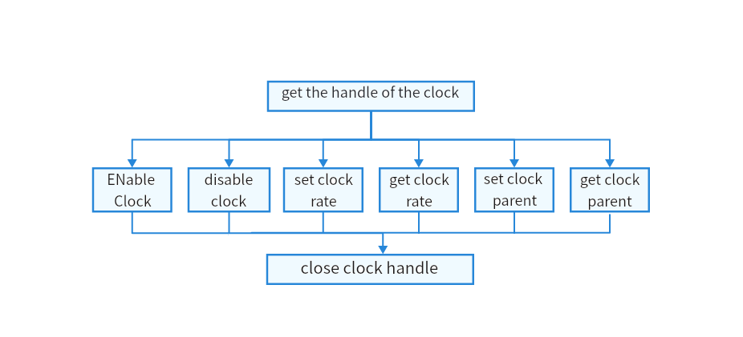

# Clock

## Overview

### Function

The clock regulates the timing and speed of all functions in a device. For example, the CPU clock is an internal time generator of the CPU. It operates in frequency and used to synchronize and control the operations within the CPU.

The **Clock** module provides APIs for clock operations, including:

-  Clock device management: enabling or disabling a clock device.
-  Clock rate modulation: obtaining or setting the clock speed.
-  Clock gating: enabling or disabling a clock.
-  Parent-clock management: obtaining or setting the parent clock.

### Basic Concepts

The clock signal is used to synchronize and control the operations of the modules or components of an electronic device. It serves as a fundamental signal reference source to ensure proper functioning and accurate data transmission.

### Working Principles

In the Hardware Driver Foundation (HDF), the **Clock** module uses the unified service mode for API adaptation. In this mode, a service is used as the clock manager to handle external access requests in a unified manner. The unified service mode applies when the system has multiple device objects of the same type. If the independent service mode is used in this case, more device nodes need to be configured and more memory resources will be consumed. The **Clock** module uses the unified service mode.

## Usage Guidelines

### When to Use

The **Clock** module provides chip-level clock management, including frequency division, frequency multiplication, clock source selection, and clock gating within the chip. Proper clock management can enhance chip efficiency while streamlining coordination and synergy among all functional components.

### Available APIs

The following table describes the common APIs of the **Clock** module. For more information, see **//drivers/hdf_core/framework/include/platform/clock_if.h**.

**Table 1** APIs of the Clock driver

| API | Description  | Return Value                          | Remarks                     |
| ---------------------------------------------------------- | ------------- | ----------------------------------- | --------------------------------------- |
| DevHandle ClockOpen(uint32_t number);                      | Opens a clock device. | NULL: The operation fails.<br/>Device handle: The operation is successful. |                                         |
| int32_t ClockClose(DevHandle handle);                      | Closes a clock device. | **0**: The operation is successful.<br>Other value: The operation fails. |                                         |
| int32_t ClockEnable(DevHandle handle);                     | Enables clock.    | **0**: The operation is successful.<br>Other value: The operation fails. |                                         |
| int32_t ClockDisable(DevHandle handle);                    | Disables clock.  | **0**: The operation is successful.<br>Other value: The operation fails. |                                         |
| int32_t ClockSetRate(DevHandle handle, uint32_t rate);     | Sets the clock rate. | **0**: The operation is successful.<br>Other value: The operation fails. | If the operation fails, check whether the specified clock rate is supported. |
| int32_t ClockGetRate(DevHandle handle, uint32_t *rate);    | Obtains the clock rate. | **0**: The operation is successful.<br>Other value: The operation fails. |                                         |
| int32_t ClockSetParent(DevHandle child, DevHandle parent); | Sets the parent clock. | **0**: The operation is successful.<br>Other value: The operation fails. | When the parent clock is set repeatedly, no error will be returned. |
| DevHandle ClockGetParent(DevHandle handle);                | Obtains the parent clock. | **0**: The operation is successful.<br>Other value: The operation fails. |                                         |

### How to Develop

The following figure illustrates how to use the APIs provided by the **Clock** module.

**Figure 2** Process of using Clock APIs

 

### Example

The following example shows how to implement read operations on a clock device of the RK3568 development board. The hardware information is as follows:

-   SOC: RK3568

Example:

```c
#include "clock_if.h"          // Header file of clock APIs
#include "hdf_log.h"           // Header file of log APIs
#define CLOCK_NUM 1

static int32_t TestCaseClock(void)
{
    int ret = 0;
    DevHandle handle = NULL;
    DevHandle parent = NULL;
    uint32_t rate = 0;

    handle = ClockOpen(CLOCK_NUM);
    if (handle == NULL) {
        HDF_LOGE("Failed to open CLOCK_NUM %d \n", CLOCK_NUM);
        return HDF_FAILURE;
    }

    ret = ClockEnable(handle);
    if (ret != HDF_SUCCESS) {
        HDF_LOGE("Failed to ClockEnable ret = %d \n",ret);
        return ret;
    }
   

    ret = ClockGetRate(handle, &rate);
    if (ret != HDF_SUCCESS) {
        HDF_LOGE("Failed to ClockGetRate ret = %d \n",ret);
        return ret;
    }
    
    ret = ClockSetRate(handle, set_rate);
    if (ret != HDF_SUCCESS) {
        HDF_LOGE("Failed to ClockSetRate ret = %d \n",ret);
        return ret;
    }

    ret = ClockDisable(handle);
    if (ret != HDF_SUCCESS) {
        HDF_LOGE("Failed to ClockDisable ret = %d \n",ret);
        return ret;
    }

    parent = ClockGetParent(handle);    
    if (parent != NULL) {
        ret = ClockSetParent(handle, parent);
        ClockClose(parent);
    } else {
        HDF_LOGE("Failed to ClockGetParent ret = %d \n",ret);
    }

    ret = ClockClose(handle);
    return ret;
}
```