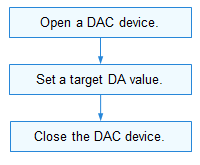

# DAC

## Overview

### Function

A digit-to-analog converter (DAC) is a device that converts a digital signal into an analog signal in electronics. DAC devices are used to:

- Provide the output channel for the process control computer system and connect to the executor to implement automatic control of the production process.
- Serve as an important module in the analog-to-digital converter using feedback technologies.

The DAC module provides a set of methods for DAC data transfer, including:
- Opening or closing a DAC device
- Setting the target digital-to-analog (DA) value

### Basic Concepts

- Resolution

  The number of binary bits that can be converted by a DAC. A greater number of bits indicates a higher resolution.

- Conversion precision

  Difference between the actual output value of the DAC and the theoretical value when the maximum value is added to the input end. The conversion precision of a DAC converter varies depending on the structure of the chip integrated on the DAC and the interface circuit configuration. The ideal conversion precision value should be as small as possible. To achieve optimal DAC conversion precision, the DAC must have high resolution. In addition, errors in the devices or power supply of the interface circuits will affect the conversion precision. When the error exceeds a certain degree, a DAC conversion error will be caused.

- Conversion speed

  The conversion speed is determined by the setup time. The setup time is the period from the time the input suddenly changes from all 0s to all 1s to the time the output voltage remains within the FSR ± ½LSB (or FSR ± x%FSR). It is the maximum response time of the DAC, and hence used to measure the conversion speed.
  
  The full scale range (FSR) is the maximum range of the output signal amplitude of a DAC. Different DACs have different FSRs, which can be limited by positive and negative currents or voltages.
  
  The least significant byte (LSB) refers to bit 0 (the least significant bit) in a binary number.

### Working Principles

In the Hardware Driver Foundation (HDF), the DAC module uses the unified service mode for API adaptation. In this mode, a service is used as the DAC manager to handle external access requests in a unified manner. The unified service mode applies when the system has multiple device objects of the same type. If the independent service mode is used, more device nodes need to be configured and memory resources will be consumed by services. The following figure illustrates the unified service mode of the DAC module.

The DAC module is divided into the following layers:

- Interface layer: provides APIs for opening or closing a device and writing data.
- Core layer: provides the capabilities of binding, initializing, and releasing devices.
- Adaptation layer: implements driver-specific functions.

**NOTE**<br/>The core layer can call the functions of the interface layer and uses the hook to call functions of the adaptation layer. In this way, the adaptation layer can indirectly call the functions of the interface layer, but the interface layer cannot call the functions of the adaptation layer.

**Figure 1** Unified service mode


### Constraints

The DAC module supports only the kernel (LiteOS-A) for mini and small systems.

## Usage Guidelines

### When to Use

The DAC module converts digital signals into analog signals in the form of current, voltage, or charge. It is mainly used in audio devices. Audio players and headsets use the DAC module as the digital-to-analog conversion channels.

### Available APIs

The following table describes the APIs of the DAC module. For more information about the APIs, see **//drivers/hdf_core/framework/include/platform/dac_if.h**.

**Table 1** DAC driver APIs

| API                                                            | Description    |
| ------------------------------------------------------------------ | ------------ |
| DevHandle DacOpen(uint32_t number)                                 | Opens a DAC device. |
| void DacClose(DevHandle handle)                                    | Closes a DAC device. |
| int32_t DacWrite(DevHandle handle, uint32_t channel, uint32_t val) | Sets a target DA value.|

### How to Develop

The following figure illustrates how to use DAC APIs.

**Figure 2** Process of using DAC APIs



#### Opening a DAC Device

Call **DacOpen()** to open a DAC device before performing the DA conversion.

```c++
DevHandle DacOpen(uint32_t number);
```

**Table 2** Description of DacOpen

| Parameter      | Description         |
| --------- | ---------------- |
| number    | DAC device number.       |
| **Return Value**| **Description**    |
| NULL      | The operation fails. |
| Device handle  | The operation is successful. The handle of the DAC device opened is returned.|

Open device 1 of the two DAC devices (numbered 0 and 1) in the system.

```c++
DevHandle dacHandle = NULL; // DAC device handle.

/* Open DAC device 1. */
dacHandle = DacOpen(1);
if (dacHandle == NULL) {
    HDF_LOGE("DacOpen: failed\n");
    return;
}
```

#### Setting a DA Value

```c++
int32_t DacWrite(DevHandle handle, uint32_t channel, uint32_t val);
```

**Table 3** Description of DacWrite

| Parameter      | Description     |
| --------- | ------------ |
| handle    | DAC device handle. |
| channel   | DAC channel number.|
| val       | DA value to set.  |
| **Return Value**| **Description**|
| 0         | The operation is successful.    |
| Negative value      | The operation fails.    |

```c++
/* Write the target DA value through the DAC_CHANNEL_NUM channel. */
ret = DacWrite(dacHandle, DAC_CHANNEL_NUM, val);
if (ret != HDF_SUCCESS) {
    HDF_LOGE("%s: tp DAC write reg fail!:%d", __func__, ret);
    DacClose(dacHandle);
    return -1;
}
```

#### Closing a DAC Device

After the DAC communication is complete, call **DacClose()** to close the DAC device.
```c++
void DacClose(DevHandle handle);
```

**Table 4** Description of DacClose

| Parameter      | Description     |
| --------- | ------------ |
| handle    | DAC device handle. |
| **Return Value**| **Description**|
| void      | -          |

Example:

```c++
DacClose(dacHandle); /* Close the DAC device. */
```

## Example

The procedure is as follows:

1. Open the DAC device based on the device number and obtain the device handle.
2. Set the DA value. If the operation fails, close the device handle.
3. Close the DAC device handle if the access to the DAC is complete.

You can obtain the operation result by printing the log information based on the **val**.

```c++
#include "dac_if.h"          /* Header file for DAC APIs. */
#include "hdf_log.h"         /* Header file for log APIs. */

/* Define device 0, channel 1. */
#define DAC_DEVICE_NUM 0
#define DAC_CHANNEL_NUM 1

/* Main entry of DAC routines. */
static int32_t TestCaseDac(void)
{
    // Set the target DA value.
    uint32_t val = 2;
    int32_t ret;
    DevHandle dacHandle;

    /* Open the DAC device. */
    dacHandle = DacOpen(DAC_DEVICE_NUM);
    if (dacHandle == NULL) {
        HDF_LOGE("%s: Open DAC%u fail!", __func__, DAC_DEVICE_NUM);
        return -1;
    }

    /* Write data. */
    ret = DacWrite(dacHandle, DAC_CHANNEL_NUM, val);
    if (ret != HDF_SUCCESS) {
        HDF_LOGE("%s: tp DAC write reg fail!:%d", __func__, ret);
        DacClose(dacHandle);
        return -1;
    }

    /* Close the DAC device. */
    DacClose(dacHandle);

    return 0;
}
```
