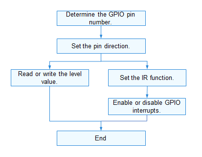

# GPIO

## Overview

### Function

A general-purpose input/output (GPIO) controller manages all GPIO pins by group. Each group of GPIO pins is associated with one or more registers. The GPIO controller manages the pins by reading data from and writing data to the registers.

The GPIO module provides APIs for performing operations on GPIO pins, including:

- Setting the pin direction, which can be input or output (high impedance is not supported currently)
- Reading and writing the pin level, which can be low or high
- Setting an interrupt service routine (ISR) function and interrupt trigger mode for a pin
- Enabling or disabling interrupts for a pin

### Basic Concepts

A GPIO can be used as an input, an output, or both, and is controllable by software.

- GPIO input

  When a GPIO is used as an input, it reads the level state (high or low) of each pin. Common input modes include analog input, floating input, pull-up input, and pull-down input.

- GPIO output

  When a GPIO is used as an output, it sets the pin level. Common output modes include open-drain output, push-pull output, multiplexed open-drain output, and multiplexed push-pull output.

### Working Principles

In the Hardware Driver Foundation (HDF), the GPIO module uses the unified service mode for API adaptation. In this mode, a device service is used as the GPIO manager to handle access requests from the devices of the same type in a unified manner. The unified service mode applies to the scenario where there are many device objects of the same type. If the independent service mode is used in this case, more device nodes need to be configured and more memory resources will be consumed. The following figure shows the unified service mode.

In the unified service mode, the core layer manages all controllers in a unified manner and publishes a service for the interface layer. That is, the driver does not need to publish a service for each controller.

The GPIO module is divided into the following layers:

- Interface layer: provides APIs for operating GPIO pins.
- Core layer: provides the capabilities of adding and removing the GPIO controller and managing GPIO pins. This layer interacts with the adaptation layer through hook functions to allow the GPIO chip drivers of different vendors to quickly access the HDF.
- Adaptation layer: instantiates hook functions to implement specific features.

**Figure 1** Unified service mode


## Usage Guidelines

### When to Use

As a concept at the software layer, GPIO is used to manage GPIO pin resources. You can use the GPIO APIs to control pins.

### Available APIs

The following table describes the APIs provided by the GPIO module.

**Table 1** GPIO driver APIs

| API                                                      | Description                          |
| ------------------------------------------------------------ | ------------------------------ |
| GpioGetByName(const char *gpioName)                          | Obtains the GPIO pin number.                |
| int32_t GpioRead(uint16_t gpio, uint16_t *val)               | Reads the level of a GPIO pin.              |
| int32_t GpioWrite(uint16_t gpio, uint16_t val)               | Writes the level of a GPIO pin.              |
| int32_t GpioGetDir(uint16_t gpio, uint16_t *dir)             | Obtains the direction of a GPIO pin.              |
| int32_t GpioSetDir(uint16_t gpio, uint16_t dir)              | Sets the direction for a GPIO pin. |
| int32_t GpioUnsetIrq(uint16_t gpio, void *arg);              | Cancels the ISR function for a GPIO pin. |
| int32_t GpioSetIrq(uint16_t gpio, uint16_t mode, GpioIrqFunc func, void *arg) | Sets an ISR function for a GPIO pin. |
| int32_t GpioEnableIrq(uint16_t gpio)                         | Enables interrupts for a GPIO pin.              |
| int32_t GpioDisableIrq(uint16_t gpio)                        | Disables interrupts for a GPIO pin.              |

> **NOTE**
>
>All GPIO APIs described in this document can be used in kernel mode and user mode.

### How to Develop

The fillowing figure shows how to use the GPIO APIs to manage pins. In the APIs, a GPIO pin is identified by the pin number.

**Figure 2** Using GPIO driver APIs



#### Determining the GPIO Pin Number

You can determine the GPIO pin number in either of the following ways:

- Calculating the pin number based on the system on chip (SoC)

  The method for determining the GPIO pin number varies depending on the GPIO controller model, parameters, and controller driver of the SoC.

  - Hi3516D V300

    A controller manages 12 groups of GPIO pins. Each group contains 8 GPIO pins. The group number ranges from 0 to 11. 

    GPIO pin number = GPIO group number x Number of GPIO pins in each group + Offset in the group

    Example: 

    GPIO pin number of GPIO10_3 = 10 x 8 + 3 = 83

  - Hi3518E V300

    A controller manages 10 groups of GPIO pins. Each group contains 10 GPIO pins. The group number ranges from 0 to 9. 

    GPIO pin number = GPIO group number x Number of GPIO pins in each group + Offset in the group

    Example: 

    GPIO pin number of GPIO7_3 = 7 x 10 + 3 = 73

- Obtaining the pin number based on the pin alias

  Use **GpioGetByName()** to obtain the pin number based on the pin alias. The global pin number is returned.

  ```c
  GpioGetByName(const char *gpioName);
  ```

#### Setting the GPIO Pin Direction

Before performing read/write operations on a GPIO pin, use **GpioSetDir()** to set the pin direction.

```c
int32_t GpioSetDir(uint16_t gpio, uint16_t dir);
```

**Table 2** Description of GpioSetDir

| **Parameter**  | **Description**      |
| ---------- | ------------------ |
| gpio       | GPIO pin number.|
| dir        | Direction to set.    |
| **Return Value**| **Description**    |
| 0          | The operation is successful.          |
| Negative value      | The operation failed.          |

Example: Set the direction of GPIO pin 3 to output.

```c
int32_t ret;

ret = GpioSetDir(3, GPIO_DIR_OUT);    // Set GPIO pin 3 as an output.
if (ret != 0) {
    HDF_LOGE("GpioSetDir: failed, ret %d\n", ret);
    return ret;
}
```

#### Obtaining the GPIO Pin Direction

Use **GpioGetDir()** to obtain the GPIO pin direction.

```c
int32_t GpioGetDir(uint16_t gpio, uint16_t *dir);
```

**Table 3** Description of GpioGetDir

| **Parameter**  | **Description**      |
| ---------- | ------------------ |
| gpio       | GPIO pin number.|
| dir        | Pointer to the direction value obtained.    |
| **Return Value**| **Description**    |
| 0          | The operation is successful.          |
| Negative value      | The operation failed.          |

Example: Obtain the direction of GPIO pin 3.

```c
int32_t ret;
uin16_t dir;

ret = GpioGetDir(3, &dir);    // Obtain the direction of GPIO pin 3.
if (ret != 0) {
    HDF_LOGE("GpioGetDir: failed, ret %d\n", ret);
    return ret;
}
```

#### Reading the GPIO Pin Level

Use **GpioRead()** to read the level of a GPIO pin.

```c
int32_t GpioRead(uint16_t gpio, uint16_t *val);
```

**Table 4** Description of GpioRead

| **Parameter**  | **Description**        |
| ---------- | -------------------- |
| gpio       | GPIO pin number.  |
| val        | Pointer to the level value read. |
| **Return Value**| **Description**      |
| 0          | The operation is successful.            |
| Negative value      | The operation failed.            |

Example: Read the level of GPIO pin 3.

```c
int32_t ret;
uint16_t val;

ret = GpioRead(3, &val);    // Read the level of GPIO pin 3.
if (ret != 0) {
    HDF_LOGE("GpioRead: failed, ret %d\n", ret);
    return ret;
}
```

#### Writing the GPIO Pin Level

Use **GpioWrite()** to write the level for a GPIO pin.

```c
int32_t GpioWrite(uint16_t gpio, uint16_t val);
```

**Table 5** Description of GpioWrite

| **Parameter**  | **Description**      |
| ---------- | ------------------ |
| gpio       | GPIO pin number.|
| val        | Level to write.    |
| **Return Value**| **Description**    |
| 0          | The operation is successful.          |
| Negative value      | The operation failed.          |

Example: Write a low level value to the register of GPIO pin 3.

```c
int32_t ret;

ret = GpioWrite(3, GPIO_VAL_LOW);    // Write a low level value to the register of GPIO pin 3.
if (ret != 0) {
    HDF_LOGE("GpioRead: failed, ret %d\n", ret);
    return ret;
}
```

#### Setting an ISR Function for a GPIO Pin

Use **GpioSetIrq（）** to set an ISR function for a GPIO pin.

```c
int32_t GpioSetIrq(uint16_t gpio, uint16_t mode, GpioIrqFunc func, void *arg);
```

**Table 6** Description of GpioSetIrq

| **Parameter**  | **Description**            |
| ---------- | ------------------------ |
| gpio       | GPIO pin number.              |
| mode       | Interrupt trigger mode.            |
| func       | ISR function to set.            |
| arg        | Pointer to the parameters passed to the ISR function.|
| **Return Value**| **Description**          |
| 0          | The operation is successful.                |
| Negative value      | The operation failed.                |

>  **CAUTION**<br/>
> Only one ISR function can be set for a GPIO pin. If **GpioSetIrq** is called repeatedly, the previous IRS function will be replaced.

#### Canceling the ISR Function for a GPIO Pin

If the ISR function is no longer required, call **GpioUnsetIrq()** to cancel it.

```c
int32_t GpioUnsetIrq(uint16_t gpio, void *arg);
```

**Table 7** Description of GpioUnsetIrq

| **Parameter**  | **Description**  |
| ---------- | -------------- |
| gpio       | GPIO pin number.    |
| arg        | Pointer to the GPIO interrupt parameters.  |
| **Return Value**| **Description**|
| 0          | The operation is successful.      |
| Negative value      | The operation failed.      |

#### Enabling Interrupts for a GPIO Pin

After the ISR function is set, call **GpioEnableIrq()** to enable interrupts for the GPIO pin.

```c
int32_t GpioEnableIrq(uint16_t gpio);
```

**Table 8** Description of GpioEnableIrq

| **Parameter**  | **Description**  |
| ---------- | -------------- |
| gpio       | GPIO pin number.    |
| **Return Value**| **Description**|
| 0          | The operation is successful.      |
| Negative value      | The operation failed.      |

>  **CAUTION**<br/>
> The configured ISR function can be responded only after interrupts are enabled for the GPIO pin.

#### Disabling Interrupts for a GPIO Pin

Use **GpioDisableIrq()** to disable interrupts for a pin.

```c
int32_t GpioDisableIrq(uint16_t gpio);
```
**Table 9** Description of GpioDisableIrq

| **Parameter**  | **Description**  |
| ---------- | -------------- |
| gpio       | GPIO pin number.    |
| **Return Value**| **Description**|
| 0          | The operation is successful.      |
| Negative value      | The operation failed.      |

Example:

```c
/* Set an ISR function. */
int32_t MyCallBackFunc(uint16_t gpio, void *data)
{
    HDF_LOGI("%s: gpio:%u interrupt service in data\n", __func__, gpio);
    return 0;
}

int32_t ret;
/* Set the ISR function to MyCallBackFunc, with input parameter of NULL and the interrupt trigger mode of rising edge. */
ret = GpioSetIrq(3, OSAL_IRQF_TRIGGER_RISING, MyCallBackFunc, NULL);
if (ret != 0) {
    HDF_LOGE("GpioSetIrq: failed, ret %d\n", ret);
    return ret;
}

/* Enable interrupts for GPIO pin 3. */
ret = GpioEnableIrq(3);
if (ret != 0) {
    HDF_LOGE("GpioEnableIrq: failed, ret %d\n", ret);
    return ret;
}

/* Disable interrupts for GPIO pin 3. */
ret = GpioDisableIrq(3);
if (ret != 0) {
    HDF_LOGE("GpioDisableIrq: failed, ret %d\n", ret);
    return ret;
}

/* Cancel the ISR function for GPIO pin 3. */
ret = GpioUnsetIrq(3, NULL);
if (ret != 0) {
    HDF_LOGE("GpioUnSetIrq: failed, ret %d\n", ret);
    return ret;
}
```

## Example

The following example shows how to trigger an interrupt for a GPIO pin. The procedure is as follows: 

1. Select an idle GPIO pin, for example, pin GPIO10_3 on a Hi3516D V300 development board. The pin number of GPIO10_3 is 83. You can select an idle GPIO pin as required.
2. Set an ISR function for the pin, with the interrupt trigger mode of rising edge and falling edge.
3. Write high and low levels to the pin alternately, and observe the execution of the ISR function.

Sample code:

```c
#include "gpio_if.h"
#include "hdf_log.h"
#include "osal_irq.h"
#include "osal_time.h"

static uint32_t g_irqCnt;

/* ISR function */
static int32_t TestCaseGpioIrqHandler(uint16_t gpio, void *data)
{
    HDF_LOGE("%s: irq triggered! on gpio:%u, in data", __func__, gpio);
    g_irqCnt++; /* If the ISR function is triggered, the global interrupt counter is incremented by 1. */
    return GpioDisableIrq(gpio);
}

/* Test case function */
static int32_t TestCaseGpioIrqEdge(void)
{
    int32_t ret;
    uint16_t valRead;
    uint16_t mode;
    uint16_t gpio = 83; /* Number of the GPIO pin to test */
    uint32_t timeout;

    /* Set the pin direction to output. */
    ret = GpioSetDir(gpio, GPIO_DIR_OUT);
    if (ret != HDF_SUCCESS) {
        HDF_LOGE("%s: set dir fail! ret:%d\n", __func__, ret);
        return ret;
    }

    /* Disable interrupts of the pin. */
    ret = GpioDisableIrq(gpio);
    if (ret != HDF_SUCCESS) {
        HDF_LOGE("%s: disable irq fail! ret:%d\n", __func__, ret);
        return ret;
    }

    /* Set the ISR function for the pin. The trigger mode is both rising edge and falling edge. */
    mode = OSAL_IRQF_TRIGGER_RISING | OSAL_IRQF_TRIGGER_FALLING;
    HDF_LOGE("%s: mode:%0x\n", __func__, mode);
    ret = GpioSetIrq(gpio, mode, TestCaseGpioIrqHandler, NULL);
    if (ret != HDF_SUCCESS) {
        HDF_LOGE("%s: set irq fail! ret:%d\n", __func__, ret);
        return ret;
    }

    /* Enable interrupts for the pin. */
    ret = GpioEnableIrq(gpio);
    if (ret != HDF_SUCCESS) {
        HDF_LOGE("%s: enable irq fail! ret:%d\n", __func__, ret);
        (void)GpioUnsetIrq(gpio, NULL);
        return ret;
    }

    g_irqCnt = 0; /* Reset the global interrupt counter. */
    timeout = 0;  /* Clear the waiting time. */
    /* Wait for the ISR function to trigger for this pin. The timeout duration is 1000 ms. */
    while (g_irqCnt <= 0 && timeout < 1000) {
        (void)GpioRead(gpio, &valRead);
        (void)GpioWrite(gpio, (valRead == GPIO_VAL_LOW) ? GPIO_VAL_HIGH : GPIO_VAL_LOW);
        HDF_LOGE("%s: wait irq timeout:%u\n", __func__, timeout);
        OsalMDelay(200); /* wait for irq trigger */
        timeout += 200;
    }
    (void)GpioUnsetIrq(gpio, NULL);
    return (g_irqCnt > 0) ? HDF_SUCCESS : HDF_FAILURE;
}
```
