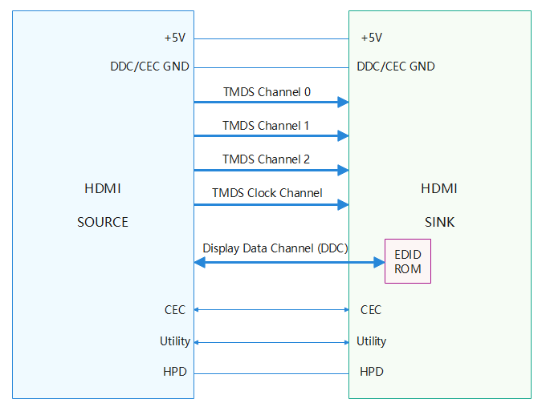
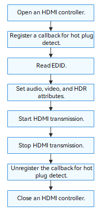

# HDMI


## Overview

### HDMI

High-definition multimedia interface (HDMI) is an interface for transmitting audio and video data from a source device, such as a DVD player or set-top box (STB), to a sink device, such as a TV or display.
HDMI usually has a source and a sink.
The HDMI APIs provide a set of common functions for HDMI transmission, including:

- Opening and closing an HDMI controller
- Starting and stopping HDMI transmission
- Setting audio, video, and High Dynamic Range (HDR) attributes, color depth, and AV mute
- Reading the raw Extended Display Identification Data (EDID) from a sink
- Registering and unregistering a callback for HDMI hot plug detect (HPD)

### Basic Concepts

HDMI is an audio and video transmission protocol released by Hitachi, Panasonic, Philips, Silicon Image, Sony, Thomson, and Toshiba. The transmission process complies with the Transition-minimized Differential Signaling (TMDS).

- TMDS is used to transmit audio, video, and various auxiliary data.
- Display data channel (DDC) allows the TX and RX ends to obtain the transmitting and receiving capabilities. However, HDMI only needs to unidirectionally obtain the capabilities of the RX end (display).
- Consumer Electronics Control (CEC) enables interaction between the HDMI TX and RX devices.
- Fixed rate link (FRL) allows the maximum TMDS bandwidth to be increased from 18 Gbit/s to 48 Gbit/s.
- High-bandwidth Digital Content Protection (HDCP) prevents copying of digital audio and video content being transmitted across devices.
- EDID, usually stored in the display firmware, provides the vendor information, EDID version, maximum image size, color settings, vendor pre-settings, frequency range limit, display name, and serial number.

### Working Principles

The HDMI source provides +5 V and GND for DDC and CEC communication. Through the DDC, the source obtains the sink parameters, such as the RX capabilities. The CEC provides an optional channel to synchronize control signals between the source and sink for better user experience. There are four TMDS channels between the HDMI source and sink. The TMDS clock channel provides clock signals for TMDS, and the other three channels transmit audio, video, and auxiliary data. HDP is the hot plug detect port. When the sink is connected, the source responds by using an interrupt service routine (ISR).

The figure below shows the HDMI physical connection.
 
**Figure 1** HDMI physical connection
  


### Constraints

Currently, the HDMI module supports only the kernels (LiteOS) of mini and small systems.

## Development Guidelines

### When to Use

HDMI features high transmission rate, wide transmission bandwidth, high compatibility, and can transmit uncompressed audio and video signals. Compared with the traditional full analog interface, HDMI simplifies connection between devices and provides HDMI-specific intelligent features, which are ideal for high-quality audio and video transmission of small-sized devices.

### Available APIs

**Table 1** HDMI driver APIs


| API                       | Description                      |
| ----------------------------- | -------------------------- |
| HdmiOpen                      | Opens an HDMI controller.            |
| HdmiClose                     | Closes an HDMI controller.            |
| HdmiStart                     | Starts HDMI transmission.              |
| HdmiStop                      | Stops HDMI transmission.              |
| HdmiAvmuteSet                 | Sets the AV mute feature.          |
| HdmiDeepColorSet              | Sets the color depth.              |
| HdmiDeepColorGet              | Obtains the color depth.              |
| HdmiSetVideoAttribute         | Sets video attributes.              |
| HdmiSetAudioAttribute         | Sets audio attributes.              |
| HdmiSetHdrAttribute           | Sets HDR attributes.               |
| HdmiReadSinkEdid              | Reads the raw EDID from a sink.    |
| HdmiRegisterHpdCallbackFunc   | Registers a callback for HDMI HPD.|
| HdmiUnregisterHpdCallbackFunc | Unregisters a callback for HDMI HPD.|

### How to Develop

The figure below illustrates the general HDMI development process.

**Figure 2** Using HDMI driver APIs
  


#### Opening an HDMI Controller

Before HDMI communication, call **HdmiOpen()** to open an HDMI controller.

```c
DevHandle HdmiOpen(int16_t number);
```

**Table 2** Description of HdmiOpen

| Parameter      | Description            |
| ---------- | -------------------- |
| number     | HDMI controller ID.        |
| **Return Value**| **Description**      |
| NULL       | The operation failed.  |
| Controller handle| Handle of the opened HDMI controller.|

For example, open controller 0 of the two HDMI controllers (numbered 0 and 1) in the system:

```c
DevHandle hdmiHandle = NULL; /* HDMI controller handle /

/* Open HDMI controller 0. */
hdmiHandle = HdmiOpen(0);
if (hdmiHandle == NULL) {
    HDF_LOGE("HdmiOpen: failed\n");
    return;
}
```

#### Registering a Callback for HPD

```c
int32_t HdmiRegisterHpdCallbackFunc(DevHandle handle, struct HdmiHpdCallbackInfo *callback);
```

**Table 3** Description of HdmiRegisterHpdCallbackFunc

| Parameter      | Description          |
| ---------- | ------------------ |
| handle     | HDMI controller handle.    |
| callback   | Pointer to the callback to be invoked to return the HPD result.|
| **Return Value**| **Description**    |
| 0          | The operation is successful.          |
| Negative value      | The operation failed.          |

The following is an example of registering a callback for HPD:

```c
/* Definition of the callback for HPD */
static void HdmiHpdHandle(void *data, bool hpd)
{
    if (data == NULL) {
        HDF_LOGE("priv data is NULL");
        return;
    }
    if (hpd == true) {
        HDF_LOGD("HdmiHpdHandle: hot plug");
        /* Add related processing if required. */
    } else {
        HDF_LOGD("HdmiHpdHandle: hot unplug");
        /* Add related processing if required. */
    }
}

/* Example of registering a callback for HPD */
···
struct HdmiHpdCallbackInfo info = {0};
info.data = handle;
info.callbackFunc = HdmiHpdHandle;
ret = HdmiRegisterHpdCallbackFunc(hdmiHandle, info);
if (ret != 0) {
    HDF_LOGE("HdmiRegisterHpdCallbackFunc: Register failed.");
}
···
```

#### Reading the Raw EDID

```c
int32_t HdmiReadSinkEdid(DevHandle handle, uint8_t *buffer, uint32_t len);
```

**Table 4** Description of HdmiReadSinkEdid

| Parameter      | Description              |
| ---------- | ---------------------- |
| handle     | HDMI controller handle.        |
| buffer     | Pointer to the data buffer.            |
| len        | Data length.              |
| **Return Value**| **Description**        |
| Positive integer    | Raw EDID read.|
| Negative number or 0   | Failed to read the EDID.              |

The following is an example of reading the raw EDID from a sink:

```c
int32_t len;
uint8_t edid[HDMI_EDID_MAX_LEN] = {0};

len = HdmiReadSinkEdid(hdmiHandle, edid, HDMI_EDID_MAX_LEN);
if (len <= 0) {
    HDF_LOGE("%s: HdmiReadSinkEdid failed len = %d.", __func__, len);
}
```

#### Setting Audio Attributes

```c
int32_t HdmiSetAudioAttribute(DevHandle handle, struct HdmiAudioAttr *attr);
```

**Table 5** Description of HdmiSetAudioAttribute


| Parameter  | Description      |
| ------ | -------------- |
| handle | HDMI controller handle.|
| attr   | Pointer to the audio attributes.      |
| **Return Value**| **Description**    |
| 0      | The operation is successful.      |
| Negative value  | The operation failed.      |

The following is an example of setting audio attributes:

```c
struct HdmiAudioAttr audioAttr = {0};
int32_t ret;

audioAttr.codingType = HDMI_AUDIO_CODING_TYPE_MP3;
audioAttr.ifType = HDMI_AUDIO_IF_TYPE_I2S;
audioAttr.bitDepth = HDMI_ADIO_BIT_DEPTH_16;
audioAttr.sampleRate = HDMI_SAMPLE_RATE_8K;
audioAttr.channels = HDMI_AUDIO_FORMAT_CHANNEL_3;
ret = HdmiSetAudioAttribute(handle, &audioAttr);
if (ret != 0) {
    HDF_LOGE("HdmiSetAudioAttribute failed.");
}
```

#### Setting Video Attributes

```c
int32_t HdmiSetVideoAttribute(DevHandle handle, struct HdmiVideoAttr *attr);
```

**Table 6** Description of HdmiSetVideoAttribute


| Parameter      | Description      |
| ---------- | -------------- |
| handle     | HDMI controller handle.|
| attr       | Pointer to the video attributes.      |
| **Return Value**| **Description**|
| 0          | The operation is successful.      |
| Negative value      | The operation failed.      |

The following is an example of setting video attributes:

```c
struct HdmiVideoAttr videoAttr = {0};
int32_t ret;

videoAttr.colorSpace = HDMI_COLOR_SPACE_YCBCR444;
videoAttr.colorimetry = HDMI_COLORIMETRY_EXTENDED;
videoAttr.extColorimetry = HDMI_EXTENDED_COLORIMETRY_BT2020_CONST_LUM;
videoAttr.quantization = HDMI_QUANTIZATION_RANGE_FULL;
ret = HdmiSetVideoAttribute(handle, &videoAttr);
if (ret != 0) {
    HDF_LOGE("HdmiSetVideoAttribute failed.");
}
```

#### Setting HDR Attributes

```c
int32_t HdmiSetHdrAttribute(DevHandle handle, struct HdmiHdrAttr *attr);
```

**Table 7** Description of HdmiSetHdrAttribute


| Parameter      | Description      |
| ---------- | -------------- |
| handle     | HDMI controller handle.|
| attr       | Pointer to the HDR attributes       |
| **Return Value**| **Description**|
| 0          | The operation is successful.      |
| Negative value      | The operation failed.      |

The following is an example of setting HDR attributes:

```c
struct HdmiHdrAttr hdrAttr = {0};
int32_t ret;

hdrAttr.mode = HDMI_HDR_MODE_CEA_861_3;
hdrAttr.userMode = HDMI_HDR_USERMODE_DOLBY;
hdrAttr.eotfType = HDMI_EOTF_SMPTE_ST_2048;
hdrAttr.metadataType = HDMI_DRM_STATIC_METADATA_TYPE_1;
hdrAttr.colorimetry = HDMI_HDR_EXTENDED_COLORIMETRY_XV_YCC_709;
ret = HdmiSetHdrAttribute(handle, &hdrAttr);
if (ret != 0) {
    HDF_LOGE("HdmiSetHdrAttribute failed.");
}
```

#### Setting HDMI AV Mute

```c
int32_t HdmiAvmuteSet(DevHandle handle, bool enable);
```

**Table 8** Description of HdmiAvmuteSet


| Parameter      | Description         |
| ---------- | ----------------- |
| handle     | HDMI controller handle.   |
| enable     | Whether to enable the AV mute feature.|
| **Return Value**| **Description**   |
| 0          | The operation is successful.         |
| Negative value      | The operation failed.         |

The following is an example of setting AV mute:

```c
int32_t ret;

ret = HdmiAvmuteSet(hdmiHandle, true);
if (ret != 0) {
    HDF_LOGE("HdmiAvmuteSet failed.");
}
```

#### Setting the Color Depth

```c
int32_t HdmiDeepColorSet(DevHandle handle, enum HdmiDeepColor color);
```

**Table 9** Description of HdmiDeepColorSet


| Parameter      | Description      |
| ---------- | -------------- |
| handle     | HDMI controller handle.|
| color      | Color depth to set.      |
| **Return Value**| **Description**|
| 0          | The operation is successful.      |
| Negative value      | The operation failed.      |

The following is an example of setting the color depth:

```c
int32_t ret;

ret = HdmiDeepColorSet(handle, HDMI_DEEP_COLOR_48BITS);
if (ret != 0) {
    HDF_LOGE("HdmiDeepColorSet failed.");
}
```

#### Obtaining the Color Depth

```c
int32_t HdmiDeepColorGet(DevHandle handle, enum HdmiDeepColor *color);
```

**Table 10** Description of HdmiDeepColorGet


| Parameter      | Description      |
| ---------- | -------------- |
| handle     | HDMI controller handle.|
| color      | Pointer to the color depth.      |
| **Return Value**| **Description**|
| 0          | The operation is successful.      |
| Negative value      | The operation failed.      |

The following is an example of obtaining the color depth:

```c
enum HdmiDeepColor color;
int32_t ret;

ret = HdmiDeepColorGet(handle, &color);
if (ret != 0) {
    HDF_LOGE("HdmiDeepColorGet failed.");
}
```

#### Starting HDMI Transmission

```c
int32_t HdmiStart(DevHandle handle);
```

**Table 11** Description of HdmiStart


| Parameter      | Description      |
| ---------- | -------------- |
| handle     | HDMI controller handle.|
| **Return Value**| **Description**|
| 0          | The operation is successful.      |
| Negative value      | The operation failed.      |

The following is an example of starting HDMI transmission:

```c
int32_t ret;

ret = HdmiStart(hdmiHandle);
if (ret != 0) {
    HDF_LOGE("Failed to start transmission.");
}
```

#### Stopping HDMI Transmission<a name="section11"></a>

```c
int32_t HdmiStop(DevHandle handle);
```

**Table 12** Description of HdmiStop


| Parameter      | Description      |
| ---------- | -------------- |
| handle     | HDMI controller handle.|
| **Return Value**| **Description**|
| 0          | The operation is successful.      |
| Negative value      | The operation failed.      |

The following is an example of stopping HDMI transmission:

```c
int32_t ret;

ret = HdmiStop(hdmiHandle);
if (ret != 0) {
    HDF_LOGE("Failed to stop transmission.");
}
```

#### Unregistering the Callback for HPD

```c
int32_t HdmiUnregisterHpdCallbackFunc(DevHandle handle);
```

**Table 13** Description of HdmiUnregisterHpdCallbackFunc


| Parameter      | Description      |
| ---------- | -------------- |
| handle     | HDMI controller handle.|
| **Return Value**| **Description**|
| 0          | The operation is successful.      |
| Negative value      | The operation failed.      |

The following is an example of unregistering the callback for HPD:

```c
int32_t ret;

ret = HdmiUnregisterHpdCallbackFunc(hdmiHandle);
if (ret != 0) {
    HDF_LOGE("unregister failed.");
}
```

#### Closing an HDMI Controller

```c
void HdmiClose(DevHandle handle);
```

**Table 14** Description of HdmiClose


| Parameter      | Description      |
| ---------- | -------------- |
| handle     | HDMI controller handle.|

The following is an example of closing an HDMI controller:

```c
HdmiClose(hdmiHandle);
```

### Example

This following example shows how to use HDMI APIs to manage an HDMI device on a Hi3516D V300 development board.

A virtual driver is used in this example. The hardware information is as follows:

-   SoC: Hi3516D V300

-   HDMI controller: HDMI controller 0


The sample code is as follows:

```c
#include "hdmi_if.h"          /* Header file for HDMI standard APIs */
#include "hdf_log.h"         /* Header file for log APIs */
#include "osal_time.h"       /* Header file for delay and sleep APIs */

/* Callback for hog plug detect */
static void HdmiHpdHandle(void *data, bool hpd)
{
    if (data == NULL) {
    HDF_LOGE("priv data is NULL");
    return;
    }

    if (hpd == true) {
        HDF_LOGD("HdmiHpdHandle: hot plug");
        /* Add related processing if required. */
    } else {
        HDF_LOGD("HdmiHpdHandle: hot unplug");
        /* Add related processing if required. */
    }
}

/* Set HDMI attributes. */
static int32_t TestHdmiSetAttr(DevHandle handle)
{
    enum HdmiDeepColor color;
    struct HdmiVideoAttr videoAttr = {0};
    struct HdmiAudioAttr audioAttr = {0};
    struct HdmiHdrAttr hdrAttr = {0};
    int32_t ret;

    ret = HdmiDeepColorSet(handle, HDMI_DEEP_COLOR_48BITS);
    
    if (ret != 0) {
        HDF_LOGE("HdmiDeepColorSet failed.");
        return ret;
    }
    ret = HdmiDeepColorGet(handle, &color);
    if (ret != 0) {
        HDF_LOGE("HdmiDeepColorGet failed.");
        return ret;
    }
    HDF_LOGE("HdmiDeepColorGet successful, color = %d.", color);
    videoAttr.colorSpace = HDMI_COLOR_SPACE_YCBCR444;
    videoAttr.colorimetry = HDMI_COLORIMETRY_EXTENDED;
    videoAttr.extColorimetry = HDMI_EXTENDED_COLORIMETRY_BT2020_CONST_LUM;
    videoAttr.quantization = HDMI_QUANTIZATION_RANGE_FULL;
    ret = HdmiSetVideoAttribute(handle, &videoAttr);
    if (ret != 0) {
        HDF_LOGE("HdmiSetVideoAttribute failed.");
        return ret;
    }
    audioAttr.codingType = HDMI_AUDIO_CODING_TYPE_MP3;
    audioAttr.ifType = HDMI_AUDIO_IF_TYPE_I2S;
    audioAttr.bitDepth = HDMI_ADIO_BIT_DEPTH_16;
    audioAttr.sampleRate = HDMI_SAMPLE_RATE_8K;
    audioAttr.channels = HDMI_AUDIO_FORMAT_CHANNEL_3;
    ret = HdmiSetAudioAttribute(handle, &audioAttr);
    if (ret != 0) {
        HDF_LOGE("HdmiSetAudioAttribute failed.");
        return ret;
    }
    hdrAttr.mode = HDMI_HDR_MODE_CEA_861_3;
    hdrAttr.userMode = HDMI_HDR_USERMODE_DOLBY;
    hdrAttr.eotfType = HDMI_EOTF_SMPTE_ST_2048;
    hdrAttr.metadataType = HDMI_DRM_STATIC_METADATA_TYPE_1;
    hdrAttr.colorimetry = HDMI_HDR_EXTENDED_COLORIMETRY_XV_YCC_709;
    ret = HdmiSetHdrAttribute(handle, &hdrAttr);
    if (ret != 0) {
        HDF_LOGE("HdmiSetHdrAttribute failed.");
        return ret;
    }

    return 0;
}

/* Main entry of HDMI routines */
static int32_t TestCaseHdmi(void)
{
    DevHandle handle = NULL;
    int32_t ret;

    struct HdmiHpdCallbackInfo info = {0};
    uint8_t data[128] = {0};

    HDF_LOGD("HdmiAdapterInit: successful.");
    handle = HdmiOpen(0);
    if (handle == NULL) {
        HDF_LOGE("HdmiOpen failed.");
        return ret;
    }
    info.data = handle;
    info.callbackFunc = HdmiHpdHandle;
    ret = HdmiRegisterHpdCallbackFunc(handle, &info);
    if (ret != 0) {
        HDF_LOGE("HdmiRegisterHpdCallbackFunc failed.");
        return ret;
    }

    ret = HdmiReadSinkEdid(handle, data, 128);
    if (ret <= 0) {
        HDF_LOGE("HdmiReadSinkEdid failed.");
        return ret;
    }
    HDF_LOGE("HdmiReadSinkEdid successful, data[6] = %d, data[8] = %d.", data[6], data[8]);

    ret = TestHdmiSetAttr(handle);
    if (ret != 0) {
        HDF_LOGE("TestHdmiSetAttr failed.");
        return ret;
    }

    ret = HdmiStart(handle);
    if (ret != 0) {
        HDF_LOGE("HdmiStart failed.");
        return ret;
    }

    OsalMSleep(1000);

    ret = HdmiStop(handle);
    if (ret != 0) {
        HDF_LOGE("HdmiStop failed.");
        return ret;
    }

    ret = HdmiUnregisterHpdCallbackFunc(handle);
    if (ret != 0) {
        HDF_LOGE("HdmiUnregisterHpdCallbackFunc failed.");
        return ret;
    }
    HdmiClose(handle);
    return 0;
}

```
