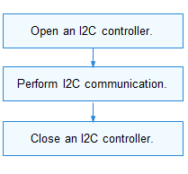

# I2C


## Overview

### Function

The Inter-Integrated Circuit (I2C) is a simple, bidirectional, and synchronous serial bus that uses merely two wires. It is widely used in short-distance communication due to simple connection and low cost.

### Working Principles

In I2C communication, one controller communicates with one or more devices through the serial data line (SDA) and serial clock line (SCL), as shown in the figure below.

I2C data transfer must begin with a **START** condition and end with a **STOP** condition. Data is transmitted byte-by-byte from the most significant bit to the least significant bit.

Each I2C node is recognized by a unique address and can serve as either a controller or a device. When the controller needs to communicate with a device, it writes the device address to the bus through broadcast. A device matching this address sends a response to set up a data transfer channel.

The I2C module provides a set of APIs for I2C data transfer, including:
- Opening or closing an I2C controller
- Performing custom transfer via a message array

    **Figure 1** I2C physical connection

    

## Usage Guidelines

### When to Use

The I2C is used in communication with the sensors, executors, and input/output devices that support the I2C protocol.

### Available APIs

The following table describes the APIs provided by the I2C module. For more information about the APIs, see **//drivers/hdf_core/framework/include/platform/i2c_if.h**.

**Table 1** I2C driver APIs

|  API | Description|
| -------- | -------- |
| DevHandle I2cOpen(int16_t number) | Opens an I2C controller.|
| void I2cClose(DevHandle handle) | Closes an I2C controller.|
| int32_t I2cTransfer(DevHandle handle, struct I2cMsg \*msgs, int16_t count) | Transfers data.|

### How to Use

The following figure illustrates how to use I2C APIs.

**Figure 2** Process of using I2C APIs




#### Opening an I2C Controller

Call **I2cOpen()** to open an I2C controller.

```c
DevHandle I2cOpen(int16_t number);
```

  **Table 2** Description of I2cOpen

| **Parameter**| **Description**|
| -------- | -------- |
| number | I2C controller number.|
| Return Value| **Description**|
| NULL | The operation fails.|
| Device handle| The operation is successful. The handle of the I2C controller opened is returned.|

Example: Open controller 3 of the eight I2C controllers (numbered 0 and 7) in the system.

```c
DevHandle i2cHandle = NULL; /* I2C controller handle. */

/* Open I2C controller 3. */
i2cHandle = I2cOpen(3);
if (i2cHandle == NULL) {
    HDF_LOGE("I2cOpen: failed\n");
    return;
}
```


#### Performing I2C Communication

Call **I2cTransfer()** to transfer data.

```c
int32_t I2cTransfer(DevHandle handle, struct I2cMsg \*msgs, int16_t count);
```

  **Table 3** Description of I2cTransfer

| **Parameter**| **Description**|
| -------- | -------- |
| handle | Handle of the I2C controller.|
| msgs | Pointer to the message array to transfer.|
| count | Number of messages in the message array to transfer.|
| Return Value| **Description**|
| Positive integer| The operation is successful. The number of messages that are successfully transferred is returned.|
| Negative value| The operation fails.|

The I2C message type is defined by **I2cMsg**. Each message structure indicates a read or write operation. A message array specifies multiple read and write operations to perform. 

Example of read and write operations:


```c
int32_t ret;
uint8_t wbuff[2] = { 0x12, 0x13 };
uint8_t rbuff[2] = { 0 };
struct I2cMsg msgs[2];        /* Custom message array to transfer. */
msgs[0].buf = wbuff;          /* Data to write. */
msgs[0].len = 2;              /* The length of the data to write is 2. */
msgs[0].addr = 0x5A;          /* The address of the device to write the data is 0x5A. */
msgs[0].flags = 0;            /* The flag 0 indicates a write operation. */
msgs[1].buf = rbuff;          /* Data to read. */
msgs[1].len = 2;              /* The length of the data to read is 2. */
msgs[1].addr = 0x5A;          /* The address of the device to read is 0x5A. */
msgs[1].flags = I2C_FLAG_READ /* I2C_FLAG_READ is set. */
/* Transfer two messages. */
ret = I2cTransfer(i2cHandle, msgs, 2);
if (ret != 2) {
    HDF_LOGE("I2cTransfer: failed, ret %d\n", ret);
    return;
}
```

>  **CAUTION**<br/>
> - The device address in the **I2cMsg** structure does not contain the read/write flag bit. The read/write information is passed by the read/write control bit in **flags**.
>
> - The I2C controller determines the maximum number of messages to be transferred at a time and the maximum length of each message to transfer.
>
> - The **I2cTransfer** function may cause the system to sleep and therefore cannot be called in the interrupt context.


#### Closing an I2C Controller

Call **I2cClose()** to close the I2C controller after the communication is complete.

```c
void I2cClose(DevHandle handle); 
```

  **Table 4** Description of I2cClose

| Parameter| Description|
| -------- | -------- |
| handle | Handle of the I2C controller to close.|

Example:

```c
I2cClose(i2cHandle); /* Close an I2C controller. */
```


### Example

The following example describes how to use I2C APIs to implement simple read/write operations on TouchPad from a Hi3516D V300 development board. 

The basic hardware information is as follows:

- SoC: Hi3516D V300

- Touch IC: The I2C address is 0x38, and the bit width of touch IC internal register is 1 byte.

- Hardware connection: The TouchPad is connected to I2C controller 3. The reset pin of the touch IC is GPIO 3.

In this example, reset the touch IC (the development board supplies power to the touch IC by default after being powered on) and perform read/write operations on the internal register to test whether the I2C channel is functioning.

>  **NOTE**<br>
> This example focuses on access to the I2C device and verifies the I2C channel, rather than the specific data read from or written to the device register and the result caused by the read and write operations on the register.

The sample code is as follows:

```c
#include "i2c_if.h"          /* Header file of I2C APIs. */
#include "gpio_if.h"         /* Header file of GPIO APIs. */
#include "hdf_log.h"         /* Header file of log APIs. */
#include "osal_io.h"         /* Header file of I/O read and write APIs. */
#include "osal_time.h"       /* Header file of delay and sleep APIs. */

/* Define a TP device structure to store I2C and GPIO hardware information. */
struct TpI2cDevice {
     uint16_t rstGpio;            /* Reset pin. */
    uint16_t busId;               /* I2C bus number. */
    uint16_t addr;                /* I2C device address. */
    uint16_t regLen;              /* Register bit width. */
    DevHandle i2cHandle;          /* I2C controller handle. */
};

/* I2C pin I/O configuration. For details, see the SoC register manual. */
#define I2C3_DATA_REG_ADDR 0x112f008c  /* Address of the SDA pin configuration register of I2C controller 3. */
#define I2C3_CLK_REG_ADDR 0x112f0090   /* Address of the SCL pin configuration register of I2C controller 3. */
#define I2C_REG_CFG 0x5f1              /* Configuration values of SDA and SCL pins of I2C controller 3. */

static void TpSocIoCfg(void)
{
    /* Set the I/O function of the two pins corresponding to I2C controller 3 to I2C. */
    OSAL_WRITEL(I2C_REG_CFG, IO_DEVICE_ADDR(I2C3_DATA_REG_ADDR));
    OSAL_WRITEL(I2C_REG_CFG, IO_DEVICE_ADDR(I2C3_CLK_REG_ADDR));
}

/* Initialize the reset pin of the TP. Pull up the pin for 20 ms, pull down the pin for 50 ms, and then pull up the pin for 20 ms to complete the reset. */
static int32_t TestCaseGpioInit(struct TpI2cDevice *tpDevice)
{
    int32_t ret;

    /* Set the output direction for the reset pin. */
    ret = GpioSetDir(tpDevice->rstGpio, GPIO_DIR_OUT);
    if (ret != HDF_SUCCESS) {
        HDF_LOGE("%s: set rst dir fail!:%d", __func__, ret);
        return ret;
    }

    ret = GpioWrite(tpDevice->rstGpio, GPIO_VAL_HIGH);
    if (ret != HDF_SUCCESS) {
        HDF_LOGE("%s: set rst hight fail!:%d", __func__, ret);
        return ret;
    }
    OsalMSleep(20);

    ret = GpioWrite(tpDevice->rstGpio, GPIO_VAL_LOW);
    if (ret != HDF_SUCCESS) {
        HDF_LOGE("%s: set rst low fail!:%d", __func__, ret);
        return ret;
    }
    OsalMSleep(50);

    ret = GpioWrite(tpDevice->rstGpio, GPIO_VAL_HIGH);
    if (ret != HDF_SUCCESS) {
        HDF_LOGE("%s: set rst high fail!:%d", __func__, ret);
        return ret;
    }
    OsalMSleep(20);

    return HDF_SUCCESS;
}

/* Use I2cTransfer to encapsulate a register read/write auxiliary function. Use flag to indicate the read or write operation. */
static int TpI2cReadWrite(struct TpI2cDevice *tpDevice, unsigned int regAddr,
    unsigned char *regData, unsigned int dataLen, uint8_t flag)
{
    int index = 0;
    unsigned char regBuf[4] = {0};
    struct I2cMsg msgs[2] = {0};

    /* Perform length adaptation for the single- or dual-byte register. */
    if (tpDevice->regLen == 1) { 
        regBuf[index++] = regAddr & 0xFF;
    } else {
        regBuf[index++] = (regAddr >> 8) & 0xFF;
        regBuf[index++] = regAddr & 0xFF;
    }

    /* Fill in the I2cMsg message structure. */
    msgs[0].addr = tpDevice->addr;
    msgs[0].flags = 0; /* The flag 0 indicates a write operation. */
    msgs[0].len = tpDevice->regLen;
    msgs[0].buf = regBuf;

    msgs[1].addr = tpDevice->addr;
    msgs[1].flags = (flag == 1)? I2C_FLAG_READ: 0; /* Add the read flag. */
    msgs[1].len = dataLen;
    msgs[1].buf = regData;

    if (I2cTransfer(tpDevice->i2cHandle, msgs, 2) != 2) {
        HDF_LOGE("%s: i2c read err", __func__);
        return HDF_FAILURE;
    }
    return HDF_SUCCESS;
}

/* TP register read function. */
static inline int TpI2cReadReg(struct TpI2cDevice *tpDevice, unsigned int regAddr,
    unsigned char *regData, unsigned int dataLen)
{
    return TpI2cReadWrite(tpDevice, regAddr, regData, dataLen, 1);
}

/* TP register write function. */
static inline int TpI2cWriteReg(struct TpI2cDevice *tpDevice, unsigned int regAddr,
    unsigned char *regData, unsigned int dataLen)
{
    return TpI2cReadWrite(tpDevice, regAddr, regData, dataLen, 0);
}

/* Main entry of I2C */
static int32_t TestCaseI2c(void)
{
    int32_t i;
    int32_t ret;
    unsigned char bufWrite[7] = { 0xFF, 0xFF, 0xFF, 0xFF, 0xA, 0xB, 0xC };
    unsigned char bufRead[7] = {0};
    static struct TpI2cDevice tpDevice;

    /* Configuration of I/O pin functions. */
    TpSocIoCfg();

    /* Initialize TP device information. */
    tpDevice.rstGpio = 3;
    tpDevice.busId = 3;
    tpDevice.addr = 0x38;
    tpDevice.regLen = 1;
    tpDevice.i2cHandle = NULL;

     /* Initialize the GPIO pin. */
    ret = TestCaseGpioInit(&tpDevice);
    if (ret != HDF_SUCCESS) {
        HDF_LOGE("%s: gpio init fail!:%d", __func__, ret);
        return ret;
    }

    /* Open an I2C controller. */
    tpDevice.i2cHandle = I2cOpen(tpDevice.busId);
    if (tpDevice.i2cHandle == NULL) {
        HDF_LOGE("%s: Open I2c:%u fail!", __func__, tpDevice.busId);
        return -1;
    }

    /* Continuously write 7-byte data to register 0xD5 of TP-IC. */
    ret = TpI2cWriteReg(&tpDevice, 0xD5, bufWrite, 7);
    if (ret != HDF_SUCCESS) {
        HDF_LOGE("%s: tp i2c write reg fail!:%d", __func__, ret);
        I2cClose(tpDevice.i2cHandle);
        return -1;
    }
    OsalMSleep(10);

    /* Continuously read 7-byte data from register 0xD5 of TP-IC. */
    ret = TpI2cReadReg(&tpDevice, 0xD5, bufRead, 7);
    if (ret != HDF_SUCCESS) {
        HDF_LOGE("%s: tp i2c read reg fail!:%d", __func__, ret);
        I2cClose(tpDevice.i2cHandle);
        return -1;
    }

    HDF_LOGE("%s: tp i2c write&read reg success!", __func__);
    for (i = 0; i < 7; i++) {
        HDF_LOGE("%s: bufRead[%d] = 0x%x", __func__, i, bufRead[i]);
    }

    /* Close the I2C controller. */
    I2cClose(tpDevice.i2cHandle);
    return ret;
}
```
