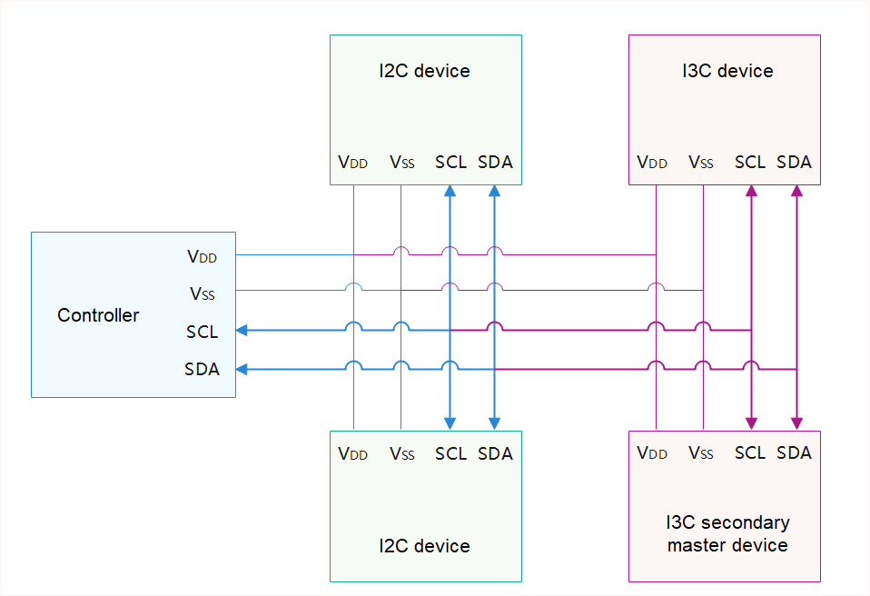
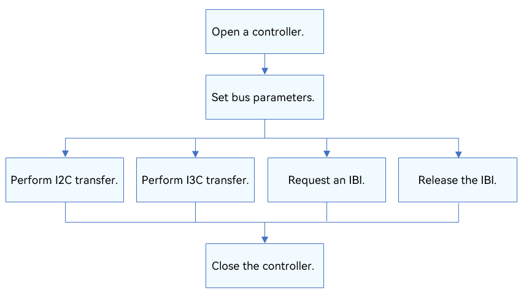

# I3C

## Introduction

### Function

Improved Inter-Integrated Circuit (I3C) is a simple and cost-efficient two-wire bidirectional synchronous serial bus protocol developed by the Mobile Industry Processor Interface (MIPI) Alliance.

I3C is a two-wire bidirectional serial bus, optimized for multiple sensor target devices and controlled by only one I3C controller at a time. It is backward compatible with Inter-Integrated circuit (I2C) target devices, but features higher speed and lower power consumption. Moreover, I3C supports in-band interrupts (IBIs), hot-joins of target devices, and controller switchover. The IBIs over the serial bus eliminates the need for an extra interrupt line to complete interrupts in I2C. I2C devices, I3C target devices, and the I3C secondary controller can co-exist on the same I3C bus.

The I3C module provides a set of common APIs for I3C transfer, including:
- Opening and closing an I3C controller
- Obtaining and setting I3C controller parameters
- Performing custom I3C message transfer by using a message array
- Requesting and releasing an IBI

### Basic Concepts

- IBI

  When there is no start signal on the serial clock (SCL) line, the I3C target device can pull down the serial data (SDA) line to make the controller send an SCL start signal, which initiates an IBI request. If multiple target devices send interrupt requests at the same time, the I3C controller arbitrates the requests based on the target device addresses. The request with a lower address is responded first.

- Dynamic Address Assignment (DAA)

  The I3C controller can dynamically allocate addresses to target devices to avoid address conflicts. Before addresses are allocated, each I3C device connected to a I3C bus must be uniquely identified in either of the following ways:
    1) The device has an I2C compliant static address that can be used by the host.
    2) The device has a 48-bit temporary ID. The host must use a 48-bit temporary ID unless the device has a static IP address. 

- Common Command Code (CCC)

  All I3C devices support CCC. The CCC can be sent to a specific I3C target device or all I3C target devices.

- Bus Characteristic Register (BCR)

  Each I3C device connected to an I3C bus has a read-only BCR, which describes the I3C compliant device's role and capabilities for use in DAA and CCC.

- Device Characteristic Register (DCR)

  Each I3C device connected to an I3C bus has a read-only DCR, which describes the I3C compliant device type (such as accelerometers, gyroscope, and others) for use in DAA and DCC.

### Working Principles

In the Hardware Driver Foundation (HDF), the I3C module uses the unified service mode for API adaptation. In this mode, a service is used as the I3C manager to handle external access requests in a unified manner. The unified service mode applies when the system has multiple device objects of the same type, for example, when there are more than 10  I3C controllers. If the independent service mode is used in this case, more device nodes need to be configured and more memory resources will be consumed.

Compared with I2C, I3C features higher speed and lower power consumption, supports IBIs, hot-joins of target devices, and controller switchover. I3C is also backward compatible with I2C target devices. Multiple devices, such as I2C target device, I3C target device, and I3C secondary controller, can be connected to an I3C bus. However, the I3C bus must have only one controller.

**Figure 1** I3C physical connection



### Constraints

The I3C module supports only the kernel (LiteOS-A) for mini and small systems and cannot be used in user mode.

## Usage Guidelines

### When to Use

I3C can connect to one or more I3C or I2C target devices. It is used to:

- Communicate with sensors, such as gyroscopes, barometers, and image sensors that support the I3C protocol.
- Communicate with devices with other ports (such as UART serial ports) through software or hardware protocols.

### Available APIs

The following table describes the APIs provided by the I3C module. For more information about the APIs, see **//drivers/hdf_core/framework/include/platform/i3c_if.h**.

**Table 1** I3C driver APIs

| API       | Description         |
| ------------- | ----------------- |
| DevHandle I3cOpen(int16_t number)       | Opens an I3C controller.    |
| void I3cClose(DevHandle handle)      | Closes an I3C controller.    |
| int32_t I3cTransfer(DevHandle handle, struct I3cMsg \*msg, int16_t count, enum TransMode mode)   | Performs custom transfer.       |
| int32_t I3cSetConfig(DevHandle handle, struct I3cConfig \*config)  | Sets the I3C controller.    |
| int32_t I3cGetConfig(DevHandle handle, struct I3cConfig \*config)  | Obtains I3C controller configuration.|
| int32_t I3cRequestIbi(DevHandle handle, uint16_t addr, I3cIbiFunc func, uint32_t payload) | Requests an IBI.     |
| int32_t I3cFreeIbi(DevHandle handle, uint16_t addr)    | Releases an IBI.     |

> **NOTE**
>
>All APIs described in this document can be called only in kernel mode.

### How to Develop

The following figure illustrates how to use the I3C APIs.

**Figure 2** Process of using I3C driver APIs



#### Opening an I3C Controller

Before I3C communication, call **I3cOpen()** to open an I3C controller.
```c
DevHandle I3cOpen(int16_t number);
```

**Table 2** Description of I3cOpen

| Name      | Description           |
| ---------- | ------------------- |
| number     | I3C controller number.        |
| **Return Value**| **Description**     |
| NULL       | The operation fails.  |
| Controller handle| The operation is successful. The handle of the I3C controller opened is returned.|

Example: Open I3C controller 1 of the eight I3C controllers numbered from 0 to 7 in the system.

```c
DevHandle i3cHandle = NULL; /* I3C controller handle. /

/* Open I3C controller 1. */
i3cHandle = I3cOpen(1);
if (i3cHandle == NULL) {
    HDF_LOGE("I3cOpen: failed\n");
    return;
}
```

#### Obtaining the I3C Controller Configuration

```c
int32_t I3cGetConfig(DevHandle handle, struct I3cConfig *config);
```

**Table 3** Description of I3cGetConfig

| Name      | Description      |
| ---------- | -------------- |
| handle     | I3C controller handle. |
| config     | Pointer to the I3C controller configuration. |
| **Return Value**| **Description**|
| 0          | The operation is successful.      |
| Negative value      | The operation fails.      |

The following is an example of obtaining the I3C controller configuration:

```c
struct I3cConfig config;

ret = I3cGetConfig(i3cHandle, &config);
if (ret != HDF_SUCCESS) {
    HDF_LOGE("%s: Get config fail!", __func__);
    return HDF_FAILURE;
}
```

#### Setting an I3C Controller

```c
int32_t I3cSetConfig(DevHandle handle, struct I3cConfig *config);
```

**Table 4** Description of I3cSetConfig

| Name      | Description      |
| ---------- | -------------- |
| handle     | I3C controller handle. |
| config     | Pointer to the I3C controller configuration. |
| **Return Value**| **Description**|
| 0          | The operation is successful.      |
| Negative value      | The operation fails.      |

The following is an example of setting an I3C controller:

```c
struct I3cConfig config;

config->busMode = I3C_BUS_HDR_MODE;
config->curMaster = NULL;
ret = I3cSetConfig(i3cHandle, &config);
if (ret != HDF_SUCCESS) {
    HDF_LOGE("%s: Set config fail!", __func__);
    return HDF_FAILURE;
}
```

#### Performing I3C Communication

Call **I3cTransfer()** to transfer messages.
```c
int32_t I3cTransfer(DevHandle handle, struct I3cMsg *msgs, int16_t count, enum TransMode mode);
```

**Table 5** Description of I3cTransfer

| Name      | Description                                    |
| ---------- | -------------------------------------------- |
| handle     | I3C controller handle.                               |
| msgs       | Pointer to the message array of the data to transfer.                  |
| count      | Length of the message array.                                |
| mode       | Transmission mode. The value **0** indicates I2C mode, **1** indicates I3C mode, and **2** indicates CCC transmission.|
| **Return Value**| **Description**                              |
| Positive integer    | The operation is successful. The number of message structures that are successfully transmitted is returned.                    |
| Negative value      | The operation fails.                                    |

The I3C messages are of the I3cMsg type. Each message structure indicates a read or write operation. A message array can be used to perform multiple read or write operations.

```c
int32_t ret;
uint8_t wbuff[2] = { 0x12, 0x13 };
uint8_t rbuff[2] = { 0 };
struct I3cMsg msgs[2];  /* Custom message array for transfer. */
msgs[0].buf = wbuff;    /* Data to write. */
msgs[0].len = 2;        /* Length of the data to write. */
msgs[0].addr = 0x3F;    /* Address of the device to which the data is written. */
msgs[0].flags = 0;      /* Transfer flag. A write operation is performed by default. */
msgs[1].buf = rbuff;    /* Data to read. */
msgs[1].len = 2;        /* Length of the data to read. */
msgs[1].addr = 0x3F;    /* Address of the device from which the data is read. */
msgs[1].flags = I3C_FLAG_READ /* I3C_FLAG_READ is set. */
/* Transfer two messages in I2C mode. */
ret = I3cTransfer(i3cHandle, msgs, 2, I2C_MODE);
if (ret != 2) {
    HDF_LOGE("I3cTransfer: failed, ret %d\n", ret);
    return;
}
```

> **Caution**<br>
>-   The device address in the **I3cMsg** structure does not contain the read/write flag bit. The read/write information is passed by the read/write control bit in **flags**.
>-   The I3C controller determines the maximum number of messages to transfer at a time and the maximum length of each message.
>-   Using **I3cTransfer()** may cause the system to sleep. Do not call it in the interrupt context.

#### Requesting an IBI

```c
int32_t I3cRequestIbi(DevHandle handle, uint16_t addr, I3cIbiFunc func, uint32_t payload);
```

**Table 6** Description of I3cRequestIbi

| Name      | Description      |
| ---------- | -------------- |
| handle     | I3C controller handle. |
| addr       | I3C device address.   |
| func       | Callback used to return the IBI.   |
| payload    | IBI payload.   |
| **Return Value**| **Description**|
| 0          | The operation is successful.      |
| Negative value      | The operation fails.      |

The following is an example:

```c
static int32_t TestI3cIbiFunc(DevHandle handle, uint16_t addr, struct I3cIbiData data)
{
    (void)handle;
    (void)addr;
    HDF_LOGD("%s: %.16s", __func__, (char *)data.buf);

    return 0;
}

int32_t I3cTestRequestIbi(void)
{
    DevHandle i3cHandle = NULL;
    int32_t ret;

    /* Open the I3C controller. */
    i3cHandle = I3cOpen(1);
    if (i3cHandle == NULL) {
        HDF_LOGE("I3cOpen: failed\n");
    return;
}
    ret = I3cRequestIbi(i3cHandle, 0x3F, TestI3cIbiFunc, 16);
    if (ret != 0) {
        HDF_LOGE("%s: Request IBI failed!", __func__);
        return -1;
    }

    I3cClose(i3cHandle);
    HDF_LOGD("%s: Done", __func__);

    return 0;
}
```

#### Releasing an IBI

```c
int32_t I3cFreeIbi(DevHandle handle, uint16_t addr);
```

**Table 7** Description of I3cFreeIbi

| Name      | Description      |
| ---------- | -------------- |
| handle     | I3C controller handle. |
| addr       | I3C device address.   |
| **Return Value**| **Description**|
| 0          | The operation is successful.      |
| Negative value      | The operation fails.      |

The following is an example:

```c
I3cFreeIbi(i3cHandle, 0x3F); /* Release an IBI. */
```

#### Closing an I3C Controller

Call **I3cClose()** to close the I3C controller after the communication is complete.
```c
void I3cClose(DevHandle handle); 
```

**Table 8** Description of I3cClose

| Name      | Description      |
| ---------- | -------------- |
| handle     | I3C controller handle. |

The following is an example:

```c
I3cClose(i3cHandle); /* Close the I3C controller. */
```

## Example

The following example presents how to use I3C APIs to manage an I3C device on a Hi3516D V300 development board. <br>The basic hardware information is as follows:

-   SoC: Hi3516D V300

-   Virtual I3C device: The I3C address is 0x3f, and the register bit width is 1 byte.

-   The virtual I3C device is connected to I3C controllers 18 and 19.

Perform simple I3C transfer to test whether the I3C channels are normal.

The sample code is as follows:

```c
#include "i3c_if.h"          /* Header file for I3C standard APIs */
#include "hdf_log.h"         /* Header file for log APIs */
##include "osal_io.h"        /* Header file for I/O read and write APIs */
#include "osal_time.h"       /* Header file for delay and sleep APIs */

/* Define a device structure to hold information. */
struct TestI3cDevice {
    uint16_t busNum;              /* I3C bus number */ 
    uint16_t addr;                /* I3C device address */ 
    uint16_t regLen;              /* Register bit width */
    DevHandle i3cHandle;          /* I3C controller handle */ 
};

/* Use I3cTransfer() to encapsulate a register read/write helper function. Use flag to indicate a read or write operation. */
static int TestI3cReadWrite(struct TestI3cDevice *testDevice, unsigned int regAddr,
    unsigned char *regData, unsigned int dataLen, uint8_t flag)
{
    int index = 0;
    unsigned char regBuf[4] = {0};
    struct I3cMsg msgs[2] = {0};

    /* Perform length adaptation for the single- or dual-byte register. */
    if (testDevice->regLen == 1) { 
        regBuf[index++] = regAddr & 0xFF;
    } else {
        regBuf[index++] = (regAddr >> 8) & 0xFF;
        regBuf[index++] = regAddr & 0xFF;
    }

    /* Fill in the I3cMsg message structure. */
    msgs[0].addr = testDevice->addr;
    msgs[0].flags = 0; /* The flag 0 indicates a write operation. */
    msgs[0].len = testDevice->regLen;
    msgs[0].buf = regBuf;

    msgs[1].addr = testDevice->addr;
    msgs[1].flags = (flag == 1) ? I3C_FLAG_READ : 0; /* Add the read flag. */
    msgs[1].len = dataLen;
    msgs[1].buf = regData;

    if (I3cTransfer(testDevice->i3cHandle, msgs, 2, I2C_MODE) != 2) {
        HDF_LOGE("%s: i3c read err", __func__);
        return HDF_FAILURE;
    }
    return HDF_SUCCESS;
}

/* Read data from the register. */
static inline int TestI3cReadReg(struct TestI3cDevice *testDevice, unsigned int regAddr,
    unsigned char *regData, unsigned int dataLen)
{
    return TestI3cReadWrite(testDevice, regAddr, regData, dataLen, 1);
}

/* Write data to the register. */
static inline int TestI3cWriteReg(struct TestI3cDevice *testDevice, unsigned int regAddr,
    unsigned char *regData, unsigned int dataLen)
{
    return TestI3cReadWrite(testDevice, regAddr, regData, dataLen, 0);
}

/* Main entry of I3C routines. */
static int32_t TestCaseI3c(void)
{
    int32_t i;
    int32_t ret;
    unsigned char bufWrite[7] = { 0xFF, 0xFF, 0xFF, 0xFF, 0xA, 0xB, 0xC };
    unsigned char bufRead[7] = {0};
    static struct TestI3cDevice testDevice;

    /* Initialize device information. */
    testDevice.busNum = 18;
    testDevice.addr = 0x3F;
    testDevice.regLen = 1;
    testDevice.i3cHandle = NULL;

    /* Open an I3C controller. */
    testDevice.i3cHandle = I3cOpen(testDevice.busNum);
    if (testDevice.i3cHandle == NULL) {
        HDF_LOGE("%s: Open I3c:%u fail!", __func__, testDevice.busNum);
        return -1;
    }

    /* Write 7-byte data continuously to the device whose address is 0x3F. */
    ret = TestI3cWriteReg(&testDevice, 0x3F, bufWrite, 7);
    if (ret != HDF_SUCCESS) {
        HDF_LOGE("%s: test i3c write reg fail!:%d", __func__, ret);
        I3cClose(testDevice.i3cHandle);
        return -1;
    }
    OsalMSleep(10);

    /* Read 7-byte data continuously from the device whose address is 0x3F. */
    ret = TestI3cReadReg(&testDevice, 0x3F, bufRead, 7);
    if (ret != HDF_SUCCESS) {
        HDF_LOGE("%s: test i3c read reg fail!:%d", __func__, ret);
        I3cClose(testDevice.i3cHandle);
        return -1;
    }
    HDF_LOGI("%s: test i3c write&read reg success!", __func__);

    /* Close the I3C controller. */
    I3cClose(testDevice.i3cHandle);

    return 0;
}
```
