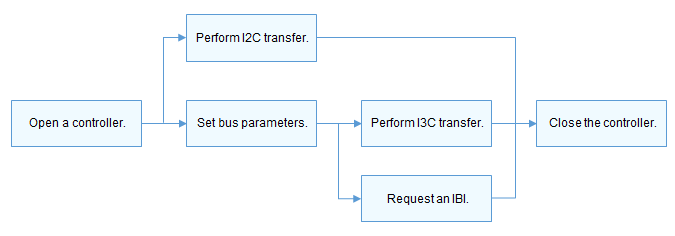

# I3C<a name="1"></a>


## Overview<a name="section1"></a>

The Improved Inter-Integrated Circuit (I3C) is a simple and cost-efficient bidirectional 2-wire synchronous serial bus protocol developed by the Mobile Industry Processor Interface (MIPI) Alliance.

I3C is backward compatible with legacy Inter-Integrated Circuit (I2C). Moreover, it provides the in-band interrupt (IBI) function and supports hot-join of I3C devices. This eliminates the need for adding an extra interrupt line to implement interrupts in I2C.

The I2C device, I3C slave device, and I3C secondary master device can coexist on the I3C bus.

The I3C APIs provide a set of common functions for I3C transfer, including:

-   Opening and closing an I3C controller
-   Obtaining and setting I3C controller parameters
-   Performing custom I3C message transfer by using a message array
-   Requesting and releasing an IBI

[Figure 1](#fig1) shows the I3C physical connection.<br/>
**Figure 1** I3C physical connection<a name="fig1"></a>


## Available APIs<a name="section2"></a>

**Table 1** I3C driver APIs

<a name="table1"></a>

<table><thead align="left"><tr><th class="cellrowborder" valign="top" width="18.63%"><p>Category</p>
</th>
<th class="cellrowborder" valign="top" width="28.03%"><p>API</p>
</th>
<th class="cellrowborder" valign="top" width="53.339999999999996%"><p>Description</p>
</th>
</tr>
</thead>
<tbody><tr><td class="cellrowborder" bgcolor="#ffffff" rowspan="2" valign="top" width="18.63%"><p>I3C controller management</p>
</td>
<td class="cellrowborder" valign="top" width="28.03%"><p>I3cOpen</p>
</td>
<td class="cellrowborder" valign="top" width="53.339999999999996%">Opens an I3C controller.</p>
</td>
</tr>
<tr><td class="cellrowborder" valign="top"><p>I3cClose</p>
</td>
<td class="cellrowborder" valign="top"><p>Closes an I3C controller.</p>
</td>
</tr>
<tr><td class="cellrowborder" bgcolor="#ffffff" valign="top" width="18.63%"><p>I3C transfer</p>
</td>
<td class="cellrowborder" valign="top" width="28.03%"><p>I3cTransfer</p>
</td>
<td class="cellrowborder" valign="top" width="53.339999999999996%"><p>Customizes an I3C transfer.</p>
</td>
</tr>
<tr><td class="cellrowborder" bgcolor=ffffff rowspan="2" valign="top" width="18.63%"><p>I3C controller configuration</p>
</td>
<td class="cellrowborder" valign="top" width="28.03%"><p>I3cSetConfig</p>
</td>
<td class="cellrowborder"valign="top" width="53.339999999999996%">Sets an I3C controller.</p>
</td>
</tr>
<tr><td class="cellrowborder" valign="top"><p>I3cGetConfig</p>
</td>
<td class="cellrowborder" valign="top"><p>Obtains the I3C controller configuration.</p>
</td>
</tr>
<tr><td class="cellrowborder" bgcolor=ffffff rowspan="2" valign="top" width="18.63%"><p>I3C IBI</p>
</td>
<td class="cellrowborder" valign="top" width="28.03%"><p>I3cRequestIbi</p>
</td>
<td class="cellrowborder" valign="top" width="53.339999999999996%">Requests an IBI.</p>
</td>
</tr>
<tr><td class="cellrowborder" valign="top"><p>I3cFreeIbi</p>
</td>
<td class="cellrowborder" valign="top"><p>Releases an IBI.</p>
</td>
</tr>
</table>


> **NOTE**<br/>
>
>All functions described in this document can be called only in the kernel space.

## Usage Guidelines<a name="section3"></a>

### How to Use<a name="section4"></a>

[Figure 2](#fig2) shows how I3C works.<br/>

**Figure 2** How I3C works<a name="fig2"></a>


### Opening an I3C Controller<a name="section5"></a>

Before I3C communication, call **I3cOpen** to open an I3C controller.
```c
DevHandle I3cOpen(int16_t number);
```

**Table 2** Description of I3cOpen

<a name="table2"></a>

<table><thead align="left"><tr><th class="cellrowborder" valign="top" width="20.66%"><p>Parameter</strong></p>
</th>
<th class="cellrowborder" valign="top" width="79.34%"><p><strong>Description</strong></p>
</th>
</tr>
</thead>
<tbody><tr><td class="cellrowborder" valign="top" width="20.66%"><p>number</p>
</td>
<td class="cellrowborder" valign="top" width="79.34%"><p>I3C controller ID.</p>
</td>
</tr>
<tr><td class="cellrowborder" valign="top" width="20.66%"><p><strong>Return Value</strong></p>
</td>
<td class="cellrowborder" valign="top" width="79.34%"><p><strong>Description</strong></p>
</td>
</tr>
<tr><td class="cellrowborder" valign="top" width="20.66%"><p>NULL</p>
</td>
<td class="cellrowborder" valign="top" width="79.34%"><p>Failed to open the I3C controller.</p>
</td>
</tr>
<tr><td class="cellrowborder" valign="top" width="20.66%"><p>Controller handle</p>
</td>
<td class="cellrowborder" valign="top" width="79.34%"><p>Handle of the I3C controller opened.</p>
</td>
</tr>
</tbody>
</table>

The following example opens I3C controller 1 of the eight I3C controllers (numbered from 0 to 7) in the system.

```c
DevHandle i3cHandle = NULL; /* I3C controller handle. /

/* Open I3C controller 1. */
i3cHandle = I3cOpen(1);
if (i3cHandle == NULL) {
    HDF_LOGE("I3cOpen: failed\n");
    return;
}
```

### Performing I3C Communication<a name="section6"></a>

Call **I3cTransfer()** to transfer messages.
```c
int32_t I3cTransfer(DevHandle handle, struct I3cMsg *msgs, int16_t count, enum TransMode mode);
```

**Table 3** Description of I3cTransfer

<a name="table3"></a>

<table><thead align="left"><tr><th class="cellrowborder" valign="top" width="50%"><p><strong> Parameter</strong></p>
</th>
<th class="cellrowborder" valign="top" width="50%"><p><strong>Description</strong></p>
</th>
</tr>
</thead>
<tbody><tr><td class="cellrowborder" valign="top" width="50%"><p>handle</p>
</td>
<td class="cellrowborder" valign="top" width="50%"><p>I3C controller handle.</p>
</td>
</tr>
<tr><td class="cellrowborder" valign="top" width="50%"><p>msgs</p>
</td>
<td class="cellrowborder" valign="top" width="50%"><p>Pointer to the message structure array of the data to be transmitted.</p>
</td>
</tr>
<tr><td class="cellrowborder" valign="top" width="50%"><p>count</p>
</td>
<td class="cellrowborder" valign="top" width="50%"><p>Length of the message array.</p>
</td>
</tr>
<tr><td class="cellrowborder" valign="top" width="50%"><p>mode</p>
</td>
<td class="cellrowborder" valign="top" width="50%"><p>Transmission mode, where the value <b>0</b> indicates the I2C mode, <b>1</b> indicates the I3C mode, and <b>2</b> indicates transmission of the Common Command Code (CCC).
</td>
</tr>
<tr><td class="cellrowborder" valign="top" width="50%"><p><strong>Return Value</strong></p>
</td>
<td class="cellrowborder" valign="top" width="50%"><p><strong>Description</strong></p>
</td>
</tr>
<tr><td class="cellrowborder" valign="top" width="50%"><p>Positive integer</p>
</td>
<td class="cellrowborder" valign="top" width="50%"><p>Number of message structures successfully transferred.</p>
</td>
</tr>
<tr><td class="cellrowborder" valign="top" width="50%"><p>Negative number</p>
</td>
<td class="cellrowborder" valign="top" width="50%"><p>The operation failed.</p>
</td>
</tr>
</tbody>
</table>

The I3C messages are of the I3cMsg type. Each message structure indicates a read or write operation. A message array is used to perform multiple read or write operations.

```c
int32_t ret;
uint8_t wbuff[2] = { 0x12, 0x13 };
uint8_t rbuff[2] = { 0 };
struct I3cMsg msgs[2]; /* Custom message array for transfer. */
msgs[0].buf = wbuff;    /* Data to write. */
msgs[0].len = 2;        /* Length of the data to write. */
msgs[0].addr = 0x3F; /* Address of the device to which the data is written. */
msgs[0].flags = 0;      /* Transfer flag. A write operation is performed by default. */
msgs[1].buf = rbuff;    /* Data to read. */
msgs[1].len = 2;        /* Length of the data to read. */
msgs[1].addr = 0x3F;    /* Address of the device from which the data is read. */
msgs[1].flags = I3C_FLAG_READ /* I3C_FLAG_READ is set. */
/* Transfer two messages in I2C mode. */
ret = I3cTransfer(i3cHandle, msgs, 2, I2C_MODE);
if (ret != 2) {
    HDF_LOGE("I3cTransfer: failed, ret %d\n", ret);
    return;
}
```

> **Caution**
>
>-   The device address in the **I3cMsg** structure does not contain the read/write flag bit. The read/write information is passed by the read/write control bit in the member variable **flags**.
>-   The **I3cTransfer()** function does not limit the number of message structures or the length of data in each message structure. The I3C controller determines these two limits.
>-   Using **I3cTransfer()** may cause the system to sleep. Do not call it in the interrupt context.

### Obtaining the I3C Controller Configuration<a name="section7"></a>

```c
int32_t I3cGetConfig(DevHandle handle, struct I3cConfig *config);
```

**Table 4** Description of I3cGetConfig

<a name="table4"></a>

<table><thead align="left"><tr><th class="cellrowborder" valign="top" width="50%"><p><strong>Parameter</strong></p>
</th>
<th class="cellrowborder" valign="top" width="50%"><p><strong>Description</strong></p>
</th>
</tr>
</thead>
<tbody><tr><td class="cellrowborder" valign="top" width="50%"><p>handle</p>
</td>
<td class="cellrowborder" valign="top" width="50%"><p>I3C controller handle.</p>
</td>
</tr>
<tr><td class="cellrowborder" valign="top" width="50%"><p>config</p>
</td>
<td class="cellrowborder" valign="top" width="50%"><p>Pointer to the I3C controller configuration.</p>
</td>
</tr>
<tr><td class="cellrowborder" valign="top" width="50%"><p><strong>Return Value</strong></p>
</td>
<td class="cellrowborder" valign="top" width="50%"><p><strong>Description</strong></p>
</td>
</tr>
<tr><td class="cellrowborder" valign="top" width="50%"><p>0</p>
</td>
<td class="cellrowborder" valign="top" width="50%"><p>The operation is successful.</p>
</td>
</tr>
<tr><td class="cellrowborder" valign="top" width="50%"><p>Negative number</p>
</td>
<td class="cellrowborder" valign="top" width="50%"><p>Failed to obtain the I3C controller configuration.</p>
</td>
</tr>
</tbody>
</table>

### Configuring an I3C Controller<a name="section8"></a>

```c
int32_t I3cSetConfig(DevHandle handle, struct I3cConfig *config);
```

**Table 5** Description of I3cSetConfig

<a name="table5"></a>

<table><thead align="left"><tr><th class="cellrowborder" valign="top" width="50%"><p><strong>Parameter</strong></p>
</th>
<th class="cellrowborder" valign="top" width="50%"><p><strong>Description</strong></p>
</th>
</tr>
</thead>
<tbody><tr><td class="cellrowborder" valign="top" width="50%"><p>handle</p>
</td>
<td class="cellrowborder" valign="top" width="50%"><p>I3C controller handle.</p>
</td>
</tr>
<tr><td class="cellrowborder" valign="top" width="50%"><p>config</p>
</td>
<td class="cellrowborder" valign="top" width="50%"><p>Pointer to the I3C controller configuration.</p>
</td>
</tr>
<tr><td class="cellrowborder" valign="top" width="50%"><p><strong>Return Value</strong></p>
</td>
<td class="cellrowborder" valign="top" width="50%"><p><strong>Description</strong></p>
</td>
</tr>
<tr><td class="cellrowborder" valign="top" width="50%"><p>0</p>
</td>
<td class="cellrowborder" valign="top" width="50%"><p>The operation is successful.</p>
</td>
</tr>
<tr><td class="cellrowborder" valign="top" width="50%"><p>Negative number</p>
</td>
<td class="cellrowborder" valign="top" width="50%"><p>Failed to configure the I3C controller.</p>
</td>
</tr>
</tbody>
</table>

### Requesting an IBI<a name="section9"></a>

```c
int32_t I3cRequestIbi(DevHandle handle, uint16_t addr, I3cIbiFunc func, uint32_t payload);
```

**Table 6** Description of I3cRequestIbi

<a name="table6"></a>

<table><thead align="left"><tr><th class="cellrowborder" valign="top" width="50%"><p><strong>Parameter</strong></p>
</th>
<th class="cellrowborder" valign="top" width="50%"><p><strong>Description</strong></p>
</th>
</tr>
</thead>
<tbody><tr><td class="cellrowborder" valign="top" width="50%"><p>handle</p>
</td>
<td class="cellrowborder" valign="top" width="50%"><p>I3C controller handle.</p>
</td>
</tr>
<tr><td class="cellrowborder" valign="top" width="50%"><p>addr</p>
</td>
<td class="cellrowborder" valign="top" width="50%"><p>I3C device address.</p>
</td>
</tr>
<tr><td class="cellrowborder" valign="top" width="50%"><p>func</p>
</td>
<td class="cellrowborder" valign="top" width="50%"><p>Callback used to return the IBI.</p>
</td>
</tr>
<tr><td class="cellrowborder" valign="top" width="50%"><p>payload</p>
</td>
<td class="cellrowborder" valign="top" width="50%"><p>IBI payload.</p>
</td>
</tr>
<tr><td class="cellrowborder" valign="top" width="50%"><p><strong>Return Value</strong></p>
</td>
<td class="cellrowborder" valign="top" width="50%"><p><strong>Description</strong></p>
</td>
</tr>
<tr><td class="cellrowborder"valign="top" width="50%"><p>0</p>
</td>
<td class="cellrowborder" valign="top" width="50%"><p>The operation is successful.</p>
</td>
</tr>
<tr><td class="cellrowborder" valign="top" width="50%"><p>Negative number</p>
</td>
<td class="cellrowborder" valign="top" width="50%"><p> Failed to request the IBI.</p>
</td>
</tr>
</tbody>
</table>

```c
static int32_t TestI3cIbiFunc(DevHandle handle, uint16_t addr, struct I3cIbiData data)
{
    (void)handle;
    (void)addr;
    HDF_LOGD("%s: %.16s", __func__, (char *)data.buf);

    return 0;
}

int32_t I3cTestRequestIbi(void)
{
    DevHandle i3cHandle = NULL;
    int32_t ret;

    /* Open an I3C controller. */
    i3cHandle = I3cOpen(1);
    if (i3cHandle == NULL) {
        HDF_LOGE("I3cOpen: failed\n");
    return;
}
    ret = I3cRequestIbi(i3cHandle, 0x3F, TestI3cIbiFunc, 16);
    if (ret != 0) {
        HDF_LOGE("%s: Requset IBI failed!", __func__);
        return -1;
    }

    I3cClose(i3cHandle);
    HDF_LOGD("%s: Done", __func__);

    return 0;
}
```

### Releasing an IBI<a name="section10"></a>

```c
int32_t I3cFreeIbi(DevHandle handle, uint16_t addr);
```

**Table 7** Description of I3cFreeIbi

<a name="table7"></a>

<table><thead align="left"><tr><th class="cellrowborder" valign="top" width="50%"><p><strong>Parameter</strong></p>
</th>
<th class="cellrowborder" valign="top" width="50%"><p><strong>Description</strong></p>
</th>
</tr>
</thead>
<tbody><tr><td class="cellrowborder" valign="top" width="50%"><p>handle</p>
</td>
<td class="cellrowborder" valign="top" width="50%"><p>I3C controller handle.</p>
</td>
</tr>
<tr><td class="cellrowborder" valign="top" width="50%"><p>addr</p>
</td>
<td class="cellrowborder" valign="top" width="50%"><p>I3C device address.</p>
</td>
</tr>
<tr><td class="cellrowborder" valign="top" width="50%"><p><strong>Return Value</strong></p>
</td>
<td class="cellrowborder" valign="top" width="50%"><p><strong>Description</strong></p>
</td>
</tr>
<tr><td class="cellrowborder" valign="top" width="50%"><p>0</p>
</td>
<td class="cellrowborder" valign="top" width="50%"><p>The operation is successful.</p>
</td>
</tr>
<tr><td class="cellrowborder" valign="top" width="50%"><p>Negative number</p>
</td>
<td class="cellrowborder" valign="top" width="50%"><p>Failed to release the IBI.</p>
</td>
</tr>
</tbody>
</table>

```c
I3cFreeIbi(i3cHandle, 0x3F); /* Release an IBI. */
```

### Closing an I3C controller<a name="section11"></a>

Call **I3cClose()** to close the I3C controller after the communication is complete.
```c
void I3cClose(DevHandle handle); 
```

**Table 8** Description of I3cClose

<a name="table4"></a>

<table><thead align="left"><tr><th class="cellrowborder" valign="top" width="50%"><p> Parameter</p>
</th>
<th class="cellrowborder" valign="top" width="50%"><p>Description</p>
</th>
</tr>
</thead>
<tbody><tr><td class="cellrowborder" valign="top" width="50%"><p>handle</p>
</td>
<td class="cellrowborder" valign="top" width="50%"><p>I3C controller handle.</p>
</td>
</tr>
</tbody>
</table>


```c
I3cClose(i3cHandle); /* Close an I3C controller. */
```

## Example<a name="section12""></a>

This following example shows how to use I3C APIs to manage an I3C device on a Hi3516D V300 development board.

Because the Hi3516D V300 SoC has no I3C controller, this example describes how to perform simple transfer operations on a virtual driver on a Hi3516D V300. The basic information is as follows:

-   SoC: Hi3516D V300

-   Virtual: The I3C address is 0x3f, and the register bit width is 1 byte.

-   The virtual I3C devices are connected to virtual I3C controllers 18 and 19.

Perform simple I3C transfer to test whether the I3C channels are normal.

The sample code is as follows:

```c
#include "i3c_if.h"          /* Header file for I3C standard APIs */
#include "i3c_ccc.h"         /* Header file for I3C CCC */
#include "hdf_log.h"         /* Header file for log APIs */
##include "osal_io.h"         /* Header file for I/O read and write APIs */
##include "osal_time.h"       /* Header file for delay and sleep APIs */

/* Define a device structure to hold information. */
struct TestI3cDevice {
    uint16_t busNum;              /* I3C bus number */ 
    uint16_t addr;                /* I3C device address */ 
    uint16_t regLen;              /* Register bit width */
    DevHandle i3cHandle;          /* I3C controller handle */ 
};

/* Use I3cTransfer to encapsulate a register read/write helper function. Use flag to indicate a read or write operation. */
static int TestI3cReadWrite(struct TestI3cDevice *testDevice, unsigned int regAddr,
    unsigned char *regData, unsigned int dataLen, uint8_t flag)
{
    int index = 0;
    unsigned char regBuf[4] = {0};
    struct I3cMsg msgs[2] = {0};

    /* Perform length adaptation for the single- or dual-byte register. */
    if (testDevice->regLen == 1) { 
        regBuf[index++] = regAddr & 0xFF;
    } else {
        regBuf[index++] = (regAddr >> 8) & 0xFF;
        regBuf[index++] = regAddr & 0xFF;
    }

    /* Fill in the I3cMsg message structure. */
    msgs[0].addr = testDevice->addr;
    msgs[0].flags = 0; /* The flag 0 indicates a write operation. */
    msgs[0].len = testDevice->regLen;
    msgs[0].buf = regBuf;

    msgs[1].addr = testDevice->addr;
    msgs[1].flags = (flag == 1) ? I3C_FLAG_READ: 0; /* Add a read flag bit to read data. */
    msgs[1].len = dataLen;
    msgs[1].buf = regData;

    if (I3cTransfer(testDevice->i3cHandle, msgs, 2, I2C_MODE) != 2) {
        HDF_LOGE("%s: i3c read err", __func__);
        return HDF_FAILURE;
    }
    return HDF_SUCCESS;
}

/* Read data from the register. */
static inline int TestI3cReadReg(struct TestI3cDevice *testDevice, unsigned int regAddr,
    unsigned char *regData, unsigned int dataLen)
{
    return TestI3cReadWrite(testDevice, regAddr, regData, dataLen, 1);
}

/* Write data to the register. */
static inline int TestI3cWriteReg(struct TestI3cDevice *testDevice, unsigned int regAddr,
    unsigned char *regData, unsigned int dataLen)
{
    return TestI3cReadWrite(testDevice, regAddr, regData, dataLen, 0);
}

/* Main entry of I3C routines. */
static int32_t TestCaseI3c(void)
{
    int32_t i;
    int32_t ret;
    unsigned char bufWrite[7] = { 0xFF, 0xFF, 0xFF, 0xFF, 0xA, 0xB, 0xC };
    unsigned char bufRead[7] = {0};
    static struct TestI3cDevice testDevice;

    /* Initialize device information. */
    testDevice.busNum = 18;
    testDevice.addr = 0x3F;
    testDevice.regLen = 1;
    testDevice.i3cHandle = NULL;

    /* Open an I3C controller. */
    testDevice.i3cHandle = I3cOpen(testDevice.busNum);
    if (testDevice.i3cHandle == NULL) {
        HDF_LOGE("%s: Open I3c:%u fail!", __func__, testDevice.busNum);
        return -1;
    }

    /* Write 7-byte data continuously to the device whose address is 0x3F. */
    ret = TestI3cWriteReg(&testDevice, 0x3F, bufWrite, 7);
    if (ret != HDF_SUCCESS) {
        HDF_LOGE("%s: test i3c write reg fail!:%d", __func__, ret);
        I3cClose(testDevice.i3cHandle);
        return -1;
    }
    OsalMSleep(10);

    /* Read 7-byte data continuously from the device whose address is 0x3F. */
    ret = TestI3cReadReg(&testDevice, 0x3F, bufRead, 7);
    if (ret != HDF_SUCCESS) {
        HDF_LOGE("%s: test i3c read reg fail!:%d", __func__, ret);
        I3cClose(testDevice.i3cHandle);
        return -1;
    }
    HDF_LOGI("%s: test i3c write&read reg success!", __func__);

    /* Close the I3C controller. */
    I3cClose(testDevice.i3cHandle);

    return 0;
}
```
