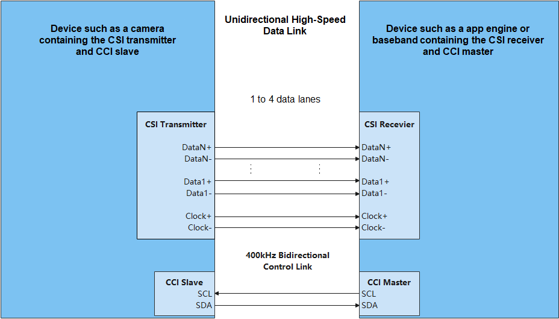

# MIPI CSI


## Overview

Defined by the Mobile Industry Processor Interface (MIPI) Alliance, the Camera Serial Interface (CSI) is a specification that allows data to be transmitted from the camera to the host processor on mobile platforms. As the second release, the MIPI CSI-2 consists of the application layer, protocol layer, and physical layer. It supports a maximum of four-lane data transmission and a single-lane transmission rate of 1 Gbit/s.

The physical layer supports the high speed (HS) and low speed (LS) modes. Using low-voltage differential signaling (LVDS), the HS mode delivers 80 Mbit/s to 1 Gbit/s transmission speed but high power consumption. The unidirectional LS mode provides lower power consumption but lower transmission speed (< 10 Mbit/s). The blend of the two modes ensures high-speed transmission of massive data (such as images) and minimized power consumption when less data is transmitted.

The figure below shows a simplified CSI. The D-PHY transmits data by using one pair of source-synchronized differential clocks and one to four pairs of differential data lanes. Data is transmitted in Double Data Rate (DDR) mode, that is, data is transmitted on both the rising and falling edges of the clock.

  **Figure 1** CSI TX and RX interfaces 
  

### ComboDevAttr Structure

**Table 1** ComboDevAttr structure

<a name="table1_MIPI_CSIDes"></a>

| Name     | Description                                                 |
| --------- | ----------------------------------------------------- |
| devno     | Device number.                                               |
| inputMode | Input mode, which can be MIPI, LVDS, sub-LVDS, HiSPI, or DC.                |
| dataRate  | Input rate of the MIPI RX scalable low voltage signaling (SLVS).                                |
| imgRect   | Crop area of the MIPI RX device (same as the size of the input image of the sensor).|
| MIPIAttr  | Attributes of the MIPI device.                                         |
| lvdsAttr  | Attributes of the LVDS, sub-LVDS, or HiSPi device.                           |

### ExtDataType Structure

**Table 2** ExtDataType structure

<a name="table2_MIPI_CSIDes"></a>

| Name           | Description                           |
| --------------- | ------------------------------- |
| devno           | Device number.                         |
| num             | Sensor number.                       |
| extDataBitWidth | Bit depth of an image.                     |
| extDataType     | Pointer to the YUV, raw data format, and bit depth.|

### Available APIs

**Table 3** MIPI CSI APIs

<a name="table3_MIPI_CSIDes"></a>

| Category| API|
| -------- | -------- |
| Opening or closing the MIPI CSI controller operation handle| **MipiCsiOpen**: opens the MIPI CSI controller operation handle.<br>**MipiCsiClose**: closes the MIPI CSI controller operation handle.|
| Setting MIPI CSI attributes | **MipiCsiSetComboDevAttr**: sets attributes of the MIPI, CMOS, or LVDS camera to the controller. The attributes include the working mode, image area, image depth, data rate, and physical channel.<br>**MipiCsiSetExtDataType** (optional): sets the YUV and RAW data formats and bit depths.<br>**MipiCsiSetHsMode**: sets the MIPI RX lane distribution. Set the mode based on the hardware connection.<br>**MipiCsiSetPhyCmvmode**: sets the common-mode voltage (CMV) mode. |
| Resetting a sensor or deasserting the reset of a sensor| **MipiCsiResetSensor**: resets a sensor.<br>**MipiCsiUnresetSensor**: deasserts the reset of a sensor.|
| Resetting the MIPI RX or deasserting the reset of the MIPI RX| **MipiCsiResetRx**: resets the MIPI&amp;nbsp;RX. The value of **enSnsType** varies depending on the value of **s32WorkingViNum**.<br>**MipiCsiUnresetRx**: deasserts the reset on the MIPI&amp;nbsp;RX.|
| Enabling or disabling the MIPI clock| **MipiCsiEnableClock**: enables the MIPI clock. The **enSnsType** passed by the upper-layer function during electrophoresis determines whether MIPI or LVDS is used.<br>**MipiCsiDisableClock**: disables the MIPI clock.|
| Enabling or disabling the MIPI sensor clock| **MipiCsiEnableSensorClock**: enables the MIPI sensor clock.<br>**MipiCsiDisableSensorClock**: disables the MIPI sensor clock.|


## Usage Guidelines

### How to Use

The figure below illustrates the general development process.

**Figure 2** Using MIPI CSI driver APIs 


### Opening a MIPI CSI Controller Operation Handle

Before starting MIPI CSI communication, call **MipiCsiOpen** to open the MIPI CSI device handle. This function returns the MIPI CSI device handle with the specified lane ID.

```c
DevHandle MipiCsiOpen(uint8_t id);
```

**Table 4** Description of MipiCsiOpen

<a name="table4_MIPI_CSIDes"></a>

| Parameter      | Description                                       |
| ---------- | ----------------------------------------------- |
| id         | MIPI CSI lane ID.                                 |
| **Return Value**| **Description**                                 |
| NULL       | The operation failed.                                       |
| Device handle  | The operation is successful. The MIPI CSI device handle with the specified lane ID is returned. The data type is **DevHandle**. |

For example, open the controller operation handle of MIPI CSI lane 0:

```c
DevHandle mipiCsiHandle = NULL;  /* Device handle */
id = 0; /* MIPI CSI lane ID */

/* Open the controller operation handle. */
MipiCsiHandle = MipiCsiOpen(id);
if (MipiCsiHandle == NULL) {
    HDF_LOGE("MipiCsiOpen: failed\n");
    return;
}
```

### Setting MIPI CSI Attributes

-   Set MIPI CSI attributes.

    ```c
    int32_t MipiCsiSetComboDevAttr(DevHandle handle, ComboDevAttr *pAttr);
    ```

    **Table 5** Description of MipiCsiSetComboDevAttr

    <a name="table5_MIPI_CSIDes"></a>

    | Parameter      | Description                  |
    | ---------- | -------------------------- |
    | handle     | Controller operation handle.            |
    | pAttr      | Pointer to the MIPI CSI structure.|
    | **Return Value**| **Description**            |
    | 0          | The operation is successful.                  |
    | Negative value      | The operation failed.                  |

    ```c
    int32_t ret;
    struct ComboDevAttr attr;

    /* The current configuration is as follows: */
    (void)memset_s(&attr, sizeof(ComboDevAttr), 0, sizeof(ComboDevAttr));
    attr.devno = 0; /* Device 0 */
    attr.inputMode = INPUT_MODE_MIPI; /* The input mode is MIPI. */
    attr.dataRate = MIPI_DATA_RATE_X1; /* The data rate is 1 pixel per clock cycle. */
    attr.imgRect.x = 0; /* The value 0 indicates the upper left position of the image sensor. */
    attr.imgRect.y = 0; /* The value 0 indicates the upper right position of the image sensor. */
    attr.imgRect.width = 2592; /* The width of the image sensor is 2592. */
    attr.imgRect.height = 1944; /* The height of the image sensor is 1944. */
    /* Write the MIPI CSI configuration. */
    ret = MipiCsiSetComboDevAttr(MipiCsiHandle, &attr);
    if (ret != 0) {
        HDF_LOGE("%s: MipiCsiSetComboDevAttr fail! ret=%d\n", __func__, ret);
        return -1;
    }
    ```

-   Set the YUV, RAW data format, and bit depth.

    ```c
    int32_t MipiCsiSetExtDataType(DevHandle handle, ExtDataType* dataType);
    ```

    **Table 6** Description of MipiCsiSetExtDataType

    <a name="table6_MIPI_CSIDes"></a>

    | Parameter      | Description                       |
    | ---------- | ------------------------------- |
    | handle     | Controller operation handle.                 |
    | dataType   | Pointer to the YUV, raw data format, and bit depth.|
    | **Return Value**| **Description**                 |
    | 0          | The operation is successful.                       |
    | Negative value      | The operation failed.                       |

    ```c
    int32_t ret;
    struct ExtDataType dataType;

    /* Set the YUV, raw data format, and bit depth. */
    dataType.devno = 0; /* Device 0 */
    dataType.num = 0;   /* sensor 0 */
    dataType.extDataBitWidth[0] = 12; /* Bit depth array element 0 */
    dataType.extDataBitWidth[1] = 12; /* Bit depth array element 1 */
    dataType.extDataBitWidth[2] = 12; /* Bit depth array element 2 */

    dataType.extDataType[0] = 0x39; /* Define YUV, raw data format, and bit depth element 0. */
    dataType.extDataType[1] = 0x39; /* Define YUV, raw data format, and bit depth element 1. */
    dataType.extDataType[2] = 0x39; /* Define YUV, raw data format, and bit depth element 2. */
    /* Set the YUV, raw data format, and bit depth. */
    ret = MipiCsiSetExtDataType(MipiCsiHandle, &dataType);
    if (ret != 0) {
        HDF_LOGE("%s: MipiCsiSetExtDataType fail! ret=%d\n", __func__, ret);
        return -1;
    }
    ```

-   Set the MIPI RX lane distribution.

    ```c
    int32_t MipiCsiSetHsMode(DevHandle handle, LaneDivideMode laneDivideMode);
    ```

    **Table 7** Description of MipiCsiSetHsMode

    <a name="table7_MIPI_CSIDes"></a>

    | Parameter          | Description      |
    | -------------- | -------------- |
    | handle         | Controller operation handle.|
    | laneDivideMode | Lane mode.  |
    | **Return Value**    | **Description**|
    | 0              | The operation is successful.      |
    | Negative value          | The operation failed.      |

    ```c
    int32_t ret;
    enum LaneDivideMode mode;

    /* Set the lane mode to 0. */
    mode = LANE_DIVIDE_MODE_0;
    /* Set the MIPI RX lane distribution. */
    ret = MipiCsiSetHsMode(MipiCsiHandle, mode);
    if (ret != 0) {
        HDF_LOGE("%s: MipiCsiSetHsMode fail! ret=%d\n", __func__, ret);
        return -1;
    }
    ```

-   Set the CMV mode.

    ```c
    int32_t MipiCsiSetPhyCmvmode(DevHandle handle, uint8_t devno, PhyCmvMode cmvMode);
    ```

    **Table 8** Description of MipiCsiSetPhyCmvmode

    <a name="table8_MIPI_CSIDes"></a>

    | Parameter      | Description        |
    | ---------- | ---------------- |
    | handle     | Controller operation handle.  |
    | cmvMode    | CMV mode.|
    | devno      | Device number.        |
    | **Return Value**| **Description**  |
    | 0          | The operation is successful.        |
    | Negative value      | The operation failed.        |

    ```c
    int32_t ret;
    enum PhyCmvMode mode;
    uint8_t devno;
    
    /* Set the CMV mode to 0. */
    mode = PHY_CMV_GE1200MV;
    /* The device number is 0. */
    devno = 0;
    /* Set the CMV mode. */
    ret = MipiCsiSetPhyCmvmode(MipiCsiHandle, devno, mode);
    if (ret != 0) {
        HDF_LOGE("%s: MipiCsiSetPhyCmvmode fail! ret=%d\n", __func__, ret);
        return -1;
    }
    ```

### Resetting a Sensor or Deasserting the Reset of a Sensor

-   Reset a sensor.

    ```c
    int32_t MipiCsiResetSensor(DevHandle handle, uint8_t snsResetSource);
    ```

    **Table 9** Description of MipiCsiResetSensor

    <a name="table9_MIPI_CSIDes"></a>

    | Parameter          | Description                                        |
    | -------------- | ------------------------------------------------ |
    | handle         | Controller operation handle.                                  |
    | snsResetSource | Sensor's reset signal cable number, which is called "sensor reset source" in software. |
    | **Return Value**    | **Description**                                  |
    | 0              | The operation is successful.                                        |
    | Negative value          | The operation failed.                                        |

    ```c
    int32_t ret;
    uint8_t snsResetSource;

    /* The sensor's reset signal cable number is 0. */
    snsResetSource = 0;
    /* Reset the sensor. */
    ret = MipiCsiResetSensor(MipiCsiHandle, snsResetSource);
    if (ret != 0) {
        HDF_LOGE("%s: MipiCsiResetSensor fail! ret=%d\n", __func__, ret);
        return -1;
    }
    ```

-   Deassert the reset of a sensor.

    ```c
    int32_t MipiCsiUnresetSensor(DevHandle handle, uint8_t snsResetSource);
    ```

    **Table 10** Description of MipiCsiUnresetSensor

    <a name="table10_MIPI_CSIDes"></a>

    | Parameter          | Description                                        |
    | -------------- | ------------------------------------------------ |
    | handle         | Controller operation handle.                                  |
    | snsResetSource | Sensor's reset signal cable number, which is called "sensor reset source" in software. |
    | **Return Value**    | **Description**                                  |
    | 0              | The operation is successful.                                    |
    | Negative value          | The operation failed.                                    |

    ```c
    int32_t ret;
    uint8_t snsResetSource;
    
    /* The sensor's reset signal cable number is 0. */
    snsResetSource = 0;
    /* Deassert the reset of the sensor. */
    ret = MipiCsiUnresetSensor(MipiCsiHandle, snsResetSource);
    if (ret != 0) {
        HDF_LOGE("%s: MipiCsiUnresetSensor fail! ret=%d\n", __func__, ret);
        return -1;
    }
    ```

### Resetting the MIPI RX or Deasserting the Reset of the MIPI RX

-   Reset the MIPI RX.

    ```c
    int32_t MipiCsiResetRx(DevHandle handle, uint8_t comboDev);
    ```

    **Table 11** Description of MipiCsiResetRx

    <a name="table11_MIPI_CSIDes"></a>

    | Parameter      | Description             |
    | ---------- | --------------------- |
    | handle     | Controller operation handle.       |
    | comboDev   | MIPI RX or LVDS channel number.|
    | **Return Value**| **Description**       |
    | 0          | The operation is successful.             |
    | Negative value      | The operation failed.             |

    ```c
    int32_t ret;
    uint8_t comboDev;

    /* The channel number is 0.*/
    comboDev = 0;
    /* Reset the MIPI RX. */
    ret = MipiCsiResetRx(MipiCsiHandle, comboDev);
    if (ret != 0) {
        HDF_LOGE("%s: MipiCsiResetRx fail! ret=%d\n", __func__, ret);
        return -1;
    }
    ```

-   Deassert the reset of the MIPI RX.

    ```c
    int32_t MipiCsiUnresetRx(DevHandle handle, uint8_t comboDev);
    ```

    **Table 12** Description of MipiCsiUnresetRx

    <a name="table12_MIPI_CSIDes"></a>

    | Parameter      | Description             |
    | ---------- | --------------------- |
    | handle     | Controller operation handle.       |
    | comboDev   | MIPI RX or LVDS channel number.|
    | **Return Value**| **Description**       |
    | 0          | The operation is successful.         |
    | Negative value      | The operation failed.         |

    ```c
    int32_t ret;
    uint8_t comboDev;
    
    /* The channel number is 0.*/
    comboDev = 0;
    /* Deassert the reset of the MIPI RX. */
    ret = MipiCsiUnresetRx(MipiCsiHandle, comboDev);
    if (ret != 0) {
        HDF_LOGE("%s: MipiCsiUnresetRx fail! ret=%d\n", __func__, ret);
        return -1;
    }
    ```

### Enabling or Disabling the MIPI Clock

-   Enable the MIPI clock.

    ```c
    int32_t MipiCsiEnableClock(DevHandle handle, uint8_t comboDev);
    ```

    **Table 13** Description of MipiCsiEnableClock

    <a name="table13_MIPI_CSIDes"></a>

    | Parameter      | Description      |
    | ---------- | -------------- |
    | handle     | Controller operation handle.|
    | comboDev   | Channel number.      |
    | **Return Value**| **Description**|
    | 0          | The operation is successful.      |
    | Negative value      | The operation failed.      |

    ```c
    int32_t ret;
    uint8_t comboDev;

    /* The channel number is 0.*/
    comboDev = 0;
    /* Enable the MIPI clock. */
    ret = MipiCsiEnableClock(MipiCsiHandle, comboDev);
    if (ret != 0) {
        HDF_LOGE("%s: MipiCsiEnableClock fail! ret=%d\n", __func__, ret);
        return -1;
    }
    ```

-   Disable the MIPI clock.

    ```c
    int32_t MipiCsiDisableClock(DevHandle handle, uint8_t comboDev);
    ```

    **Table 14** Description of MipiCsiDisableClock

    <a name="table14_MIPI_CSIDes"></a>

    | Parameter      | Description      |
    | ---------- | -------------- |
    | handle     | Controller operation handle.|
    | comboDev   | Channel number.      |
    | **Return Value**| **Description**|
    | 0          | The operation is successful.      |
    | Negative value      | The operation failed.      |

    ```c
    int32_t ret;
    uint8_t comboDev;
    
    /* The channel number is 0.*/
    comboDev = 0;
    /* Disable the MIPI clock. */
    ret = MipiCsiDisableClock(MipiCsiHandle, comboDev);
    if (ret != 0) {
        HDF_LOGE("%s: MipiCsiDisableClock fail! ret=%d\n", __func__, ret);
        return -1;
    }
    ```

### Enabling or Disabling the MIPI Sensor Clock

-   Enable the MIPI sensor clock.

    ```c
    int32_t MipiCsiEnableSensorClock(DevHandle handle, uint8_t snsClkSource);
    ```

    **Table 15** Description of MipiCsiEnableSensorClock

    <a name="table15_MIPI_CSIDes"></a>

    | Parameter        | Description                                        |
    | ------------ | ------------------------------------------------ |
    | handle       | Controller operation handle.                                  |
    | snsClkSource | Sensor's clock signal cable number, which is called clock source of the sensor in software.|
    | **Return Value**  | **Description**                                  |
    | 0            | The operation is successful.                                        |
    | Negative value        | The operation failed.                                        |

    ```c
    int32_t ret;
    uint8_t snsClkSource;

    /* The sensor's clock signal cable number is 0. */
    snsClkSource = 0;
    /* Enable the MIPI sensor clock. */
    ret = MipiCsiEnableSensorClock(MipiCsiHandle, snsClkSource);
    if (ret != 0) {
        HDF_LOGE("%s: MipiCsiEnableSensorClock fail! ret=%d\n", __func__, ret);
        return -1;
    }
    ```

-   Disable the MIPI sensor clock.

    ```c
    int32_t MipiCsiDisableSensorClock(DevHandle handle, uint8_t snsClkSource);
    ```

    **Table 16** Description of MipiCsiDisableSensorClock

    <a name="table16_MIPI_CSIDes"></a>

    | Parameter        | Description                                        |
    | ------------ | ------------------------------------------------ |
    | handle       | Controller operation handle.                                  |
    | snsClkSource | Sensor's clock signal cable number, which is called clock source of the sensor in software.|
    | **Return Value**  | **Description**                                  |
    | 0            | The operation is successful.                                        |
    | Negative value        | The operation failed.                                        |

    ```c
    int32_t ret;
    uint8_t snsClkSource;
    
    /* The sensor's clock signal cable number is 0. */
    snsClkSource = 0;
    /* Disable the MIPI sensor clock. */
    ret = MipiCsiDisableSensorClock(MipiCsiHandle, snsClkSource);
    if (ret != 0) {
        HDF_LOGE("%s: MipiCsiDisableSensorClock fail! ret=%d\n", __func__, ret);
        return -1;
    }
    ```

### Closing a MIPI CSI Controller Operation Handle

Call **MipiCsiClose()** to close the MIPI CSI controller handle after the MIPI CSI communication is complete.

```c
void MipiCsiClose(DevHandle handle);
```

This function releases the resources requested by **MipiCsiOpen**.

**Table 17** Description of MipiCsiClose

<a name="table17_MIPI_CSIDes"></a>

 | Parameter        | Description                                        |
 | ------------ | ------------------------------------------------ |
 | handle       | MIPI CSI controller operation handle.                                 |

```c
MipiCsiClose(MIPIHandle); /* Close the operation handle of the MIPI CSI controller. */
```

## Example

The sample code is as follows:

```c
#include "hdf.h"
#include "MIPI_csi_if.h"

void PalMipiCsiTestSample(void)
{
    uint8_t id;
    int32_t ret;
    uint8_t comboDev;
    uint8_t snsClkSource;
    uint8_t devno;
    enum LaneDivideMode mode;
    enum PhyCmvMode mode;
    struct ComboDevAttr attr;
    struct ExtDataType dataType;
    DevHandle MipiCsiHandle = NULL;
    
    /* Controller ID */
    id = 0; 
    /* Open the controller operation handle. */
    MipiCsiHandle = MipiCsiOpen(id);
    if (MipiCsiHandle == NULL) {
        HDF_LOGE("MipiCsiOpen: failed!\n");
        return;
    }
    
    /* Set the lane mode to 0. */
    mode = LANE_DIVIDE_MODE_0;
    /* Set the MIPI RX lane distribution. */
    ret = MipiCsiSetHsMode(MipiCsiHandle, mode);
    if (ret != 0) {
        HDF_LOGE("%s: MipiCsiSetHsMode fail! ret=%d\n", __func__, ret);
        return;
    }

    /* The channel number is 0.*/
    comboDev = 0;
    /* Enable the MIPI clock. */
    ret = MipiCsiEnableClock(MipiCsiHandle, comboDev);
    if (ret != 0) {
        HDF_LOGE("%s: MipiCsiEnableClock fail! ret=%d\n", __func__, ret);
        return;
    }
    
    /* Reset the MIPI RX. */
    ret = MipiCsiResetRx(MipiCsiHandle, comboDev);
    if (ret != 0) {
        HDF_LOGE("%s: MipiCsiResetRx fail! ret=%d\n", __func__, ret);
        return;
    }

    /* The sensor's clock signal cable number is 0. */
    snsClkSource = 0;
    /* Enable the MIPI sensor clock. */
    ret = MipiCsiEnableSensorClock(MipiCsiHandle, snsClkSource);
    if (ret != 0) {
        HDF_LOGE("%s: MipiCsiEnableSensorClock fail! ret=%d\n", __func__, ret);
        return;
    }
    
    /* Reset the sensor. */
    ret = MipiCsiResetSensor(MipiCsiHandle, snsResetSource);
    if (ret != 0) {
        HDF_LOGE("%s: MipiCsiResetSensor fail! ret=%d\n", __func__, ret);
        return;
    }
    
    /* Set MIPI parameters. */
    (void)memset_s(&attr, sizeof(ComboDevAttr), 0, sizeof(ComboDevAttr));
    attr.devno = 0; /* Device 0 */
    attr.inputMode = INPUT_MODE_MIPI; /* The input mode is MIPI. */
    attr.dataRate = MIPI_DATA_RATE_X1; /* The data rate is 1 pixel per clock cycle. */
    attr.imgRect.x = 0; /* The value 0 indicates the upper left position of the image sensor. */
    attr.imgRect.y = 0; /* The value 0 indicates the upper right position of the image sensor. */
    attr.imgRect.width = 2592; /* The width of the image sensor is 2592. */
    attr.imgRect.height = 1944; /* The height of the image sensor is 1944. */
    /* Write the MIPI CSI configuration. */
    ret = MipiCsiSetComboDevAttr(MipiCsiHandle, &attr);
    if (ret != 0) {
        HDF_LOGE("%s: MipiCsiSetComboDevAttr fail! ret=%d\n", __func__, ret);
        return;
    }
    
    /* Set the CMV mode to 0. */
    mode = PHY_CMV_GE1200MV;
    /* The device number is 0. */
    devno = 0;
    /* Set the CMV mode. */
    ret = MipiCsiSetPhyCmvmode(MipiCsiHandle, devno, mode);
    if (ret != 0) {
        HDF_LOGE("%s: MipiCsiSetPhyCmvmode fail! ret=%d\n", __func__, ret);
        return;
    }
    
    /* The channel number is 0.*/
    comboDev = 0;
    /* Deassert the reset of the MIPI RX. */
    ret = MipiCsiUnresetRx(MipiCsiHandle, comboDev);
    if (ret != 0) {
        HDF_LOGE("%s: MipiCsiUnresetRx fail! ret=%d\n", __func__, ret);
        return;
    }
    
    /* Disable the MIPI clock. */
    ret = MipiCsiDisableClock(MipiCsiHandle, comboDev);
    if (ret != 0) {
        HDF_LOGE("%s: MipiCsiDisableClock fail! ret=%d\n", __func__, ret);
        return;
    }
    
    /* The sensor's reset signal cable number is 0. */
    snsResetSource = 0;
    /* Deassert the reset of the sensor. */
    ret = MipiCsiUnresetSensor(MipiCsiHandle, snsResetSource);
    if (ret != 0) {
        HDF_LOGE("%s: MipiCsiUnresetSensor fail! ret=%d\n", __func__, ret);
        return;
    }
    
    /* Disable the MIPI sensor clock. */
    ret = MipiCsiDisableSensorClock(MipiCsiHandle, snsClkSource);
    if (ret != 0) {
        HDF_LOGE("%s: MipiCsiDisableSensorClock fail! ret=%d\n", __func__, ret);
        return;
    }
    
    /* Close the MIPI CSI device handle. */
    MipiCsiClose(MipiCsiHandle); 
}
```
