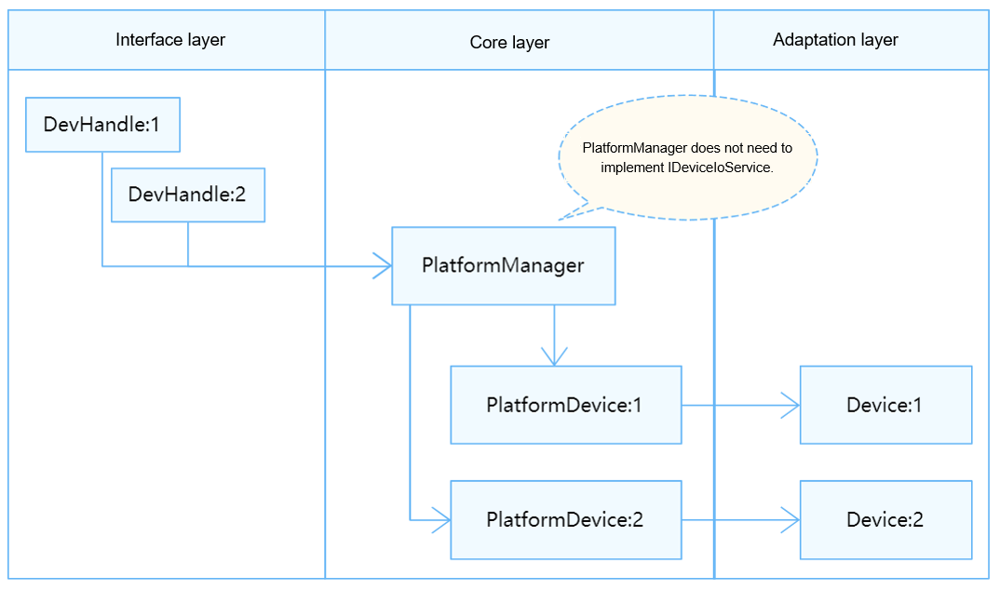

# MIPI CSI

## Overview

The Camera Serial Interface (CSI), defined by the Mobile Industry Processor Interface (MIPI) Alliance, allows data to be transmitted from the camera to the host processor on mobile platforms. In the Hardware Driver Foundation (HDF), the MIPI CSI module uses the service-free mode for API adaptation. The service-free mode applies to the devices that do not provide user-mode APIs or the operating system (OS) that does not distinguish the user mode and the kernel mode. In the service-free mode, **DevHandle** (a void pointer) directly points to the kernel-mode address of the device object.

**Figure 1** Service-free mode



## Available APIs

**MipiCsiCntlrMethod**:

```c
struct MipiCsiCntlrMethod {
    int32_t (*setComboDevAttr)(struct MipiCsiCntlr *cntlr, ComboDevAttr *pAttr);
    int32_t (*setPhyCmvmode)(struct MipiCsiCntlr *cntlr, uint8_t devno, PhyCmvMode cmvMode);
    int32_t (*setExtDataType)(struct MipiCsiCntlr *cntlr, ExtDataType* dataType);
    int32_t (*setHsMode)(struct MipiCsiCntlr *cntlr, LaneDivideMode laneDivideMode);
    int32_t (*enableClock)(struct MipiCsiCntlr *cntlr, uint8_t comboDev);
    int32_t (*disableClock)(struct MipiCsiCntlr *cntlr, uint8_t comboDev);
    int32_t (*resetRx)(struct MipiCsiCntlr *cntlr, uint8_t comboDev);
    int32_t (*unresetRx)(struct MipiCsiCntlr *cntlr, uint8_t comboDev);
    int32_t (*enableSensorClock)(struct MipiCsiCntlr *cntlr, uint8_t snsClkSource);
    int32_t (*disableSensorClock)(struct MipiCsiCntlr *cntlr, uint8_t snsClkSource);
    int32_t (*resetSensor)(struct MipiCsiCntlr *cntlr, uint8_t snsResetSource);
    int32_t (*unresetSensor)(struct MipiCsiCntlr *cntlr, uint8_t snsResetSource);
};
```
**Table 1** Description of the callback functions in the MipiCsiCntlrMethod structure
| Function          | Input Parameter                                                        | Output Parameter| Return Value          | Description                      |
| ------------------ | ------------------------------------------------------------ | ---- | ------------------ | -------------------------- |
| setComboDevAttr    | **cntlr**: structure pointer to the MIPI CSI controller.<br>**pAttr**: structure pointer to the MIPI CSI configuration.| –  | HDF_STATUS| Sets MIPI CSI attributes.          |
| setPhyCmvmode      | **cntlr**: structure pointer to the MIPI CSI controller.<br>**devno**: Device number, which is of the uint8_t type.<br>**cmvMode**: common-mode voltage (CMV) mode to set.| –  | HDF_STATUS| Sets the CMV mode.          |
| setExtDataType     | **cntlr**: structure pointer to the MIPI CSI controller.<br>**dataType**: structure pointer to the data that defines the YUV, original data formats, and bit depth.| –  | HDF_STATUS| Sets the YUV, RAW data format, and bit depth.|
| setHsMode          | **cntlr**: structure pointer to the MIPI CSI controller.<br>**laneDivideMode**: lane mode.| –  | HDF_STATUS| Sets the MIPI RX lane distribution.    |
| enableClock        | **cntlr**: structure pointer to the MIPI CSI controller.<br>**comboDev**: channel number, which is of the uint8_t type.| –  | HDF_STATUS| Enables the MIPI clock.            |
| disableClock       | **cntlr**: structure pointer to the MIPI CSI controller.<br>**comboDev**: channel number, which is of the uint8_t type.| –  | HDF_STATUS| Disables the MIPI clock.            |
| resetRx            | **cntlr**: structure pointer to the MIPI CSI controller.<br>**comboDev**: channel number, which is of the uint8_t type.| –  | HDF_STATUS| Resets the MIPI RX.               |
| unresetRx          | **cntlr**: structure pointer to the MIPI CSI controller.<br>**comboDev**: channel number, which is of the uint8_t type.| –  | HDF_STATUS| Deasserts the reset of the MIPI RX.           |
| enableSensorClock  | **cntlr**: structure pointer to the MIPI CSI controller.<br>**snsClkSource**: number of the clock signal cable of the sensor, which is of the uint8_t type.| –  | HDF_STATUS| Enables the MIPI sensor clock.    |
| disableSensorClock | **cntlr**: structure pointer to the MIPI CSI controller.<br>**snsClkSource**: number of the clock signal cable of the sensor, which is of the uint8_t type.| –  | HDF_STATUS| Disables the MIPI sensor clock.    |
| resetSensor        | **cntlr**: structure pointer to the MIPI CSI controller.<br>**snsClkSource**: number of the clock signal cable of the sensor, which is of the uint8_t type.| –  | HDF_STATUS| Resets a sensor.                |
| unresetSensor      | **cntlr**: structure pointer to the MIPI CSI controller.<br>**snsClkSource**: number of the clock signal cable of the sensor, which is of the uint8_t type.| –  | HDF_STATUS| Deasserts the reset of a sensor.     |

## How to Develop

The MIPI CSI module adaptation involves the following steps:

1. Configure attribute files.     

   - Add the **deviceNode** information to the **device_info.hcs** file.
   - (Optional) Add the **mipicsi_config.hcs** file.

2. Instantiate the driver entry. 
   
   - Instantiate the **HdfDriverEntry** structure.
   - Call **HDF_INIT** to register the **HdfDriverEntry** instance with the HDF.
   
3. Instantiate the MIPI CSI controller object.  
   
   - Initialize **MipiCsiCntlr**.
   - Instantiate **MipiCsiCntlrMethod** in the **MipiCsiCntlr** object.
     > **NOTE**<br>
     >For details about the functions in **MipiCsiCntlrMethod**, see [Available APIs](#available-apis).
   
4. Debug the driver.

   (Optional) For new drivers, verify the basic functions, for example, the data transmission and the information returned after the **MipiCsiCntlrMethod** instance is attached.

   
## Development Example

The following uses **mipi_rx_hi35xx.c** as an example to present the information required for implementing device functions.


1. Configure the device attributes in **busxx_config.hcs** and add the **deviceNode** information to the **device_info.hcs** file. 

   The device attribute values are closely related to the default values or value range of the **MipiCsiCntlr** members at the core layer. The **deviceNode** information is related to the driver entry registration.
   
    > **NOTE**<br>
    >In this example, the MIPI controller attributes are defined in the source file. If required, add the **deviceMatchAttr** information to **deviceNode** in the **device_info** file and add the **mipicsi_config.hcs** file.
   
   - **device_info.hcs** configuration example
   
     ```c
     root {
     device_info {
         match_attr = "hdf_manager";
         platform :: host {
         hostName = "platform_host";
         priority = 50;
         device_mipi_csi:: device {
         	device0 :: deviceNode {
                 policy = 0;
                 priority = 160;
                 permission = 0644;
                 moduleName = "HDF_MIPI_RX";    // (Mandatory) Driver name, which must be the same as moduleName in the driver entry.
                 serviceName = "HDF_MIPI_RX";   // (Mandatory) Unique name of the service published by the driver.
             }
         }
         }
     }
     }
     ```
     
   
2. Instantiate the driver entry.

   The driver entry must be a global variable of the **HdfDriverEntry** type (defined in **hdf_device_desc.h**), and the value of **moduleName** must be the same as that in **device_info.hcs**. The function pointer members in the **HdfDriverEntry** structure are filled by the vendors' operation functions. In the HDF, the start address of each **HdfDriverEntry** object of all loaded drivers is collected to form a segment address space similar to an array for the upper layer to invoke.
   
   Generally, the HDF calls the **Bind** function and then the **Init** function to load a driver. If **Init** fails to be called, the HDF calls **Release** to release driver resources and exit.
   
   - MIPI CSI driver entry example
   
     ```c
     struct HdfDriverEntry g_mipiCsiDriverEntry = {
         .moduleVersion = 1,
         .Init = Hi35xxMipiCsiInit,          // See the Init function.
         .Release = Hi35xxMipiCsiRelease,    // See the Release function.
         .moduleName = "HDF_MIPI_RX",        // (Mandatory) The value must be the same as that in the device_info.hcs file.
     };
     HDF_INIT(g_mipiCsiDriverEntry);         // Call HDF_INIT to register the driver entry with the HDF.
     ```
   
     

3. Initialize the **MipiCsiCntlr** object at the core layer, including defining a custom structure (to pass parameters and data) and implementing the **HdfDriverEntry** member functions (**Bind**, **Init**, and **Release**) to instantiate **MipiCsiCntlrMethod** in **MipiCsiCntlr** (so that the underlying driver functions can be called).

   - Defining a custom structure

     To the driver, the custom structure holds parameters and data. The values in the **config** file are used to initialize the structure members. In this example, the MIPI CSI attributes are defined in the source file. Therefore, the basic member structure is similar to that of **MipiCsiCntlr**.

     ```c
     typedef struct {
         /** The data type can be 8-, 10-, 12-, 14-, or 16-bit. */
         DataType inputDataType;
         /** MIPI WDM mode */
         MipiWdrMode wdrMode;
         /** laneId: -1 - disabled */
         short laneId[MIPI_LANE_NUM];
     
         union {
             /** Used for HI_MIPI_WDR_MODE_DT */
             short dataType[WDR_VC_NUM];
         };
     } MipiDevAttr;
     
     typedef struct {
         /** Device number */
         uint8_t devno;
         /** Input mode, which can be MIPI, LVDS, sub-LVDS, HiSPi, or DC. */
         InputMode inputMode;
         MipiDataRate dataRate;
         /** Crop area of the MIPI RX device (same as the size of the sensor input image) */
         ImgRect imgRect;
     
         union {
             MipiDevAttr mipiAttr;
             LvdsDevAttr lvdsAttr;
         };
     } ComboDevAttr;
     
     // MipiCsiCntlr is the core layer controller structure. The Init function assigns values to the members of MipiCsiCntlr.
     struct MipiCsiCntlr {
         /** Send the service provided by this controller when the driver is bound to the HDF. */
         struct IDeviceIoService service;
         /** Pass the pointer to the device when the driver is bound to the HDF. */
         struct HdfDeviceObject *device;
         /** Device number */
         unsigned int devNo;
         /** All APIs provided by the controller */
         struct MipiCsiCntlrMethod *ops;
         /** All APIs for controller debugging. Set it to null if the driver is not implemented. */
         struct MipiCsiCntlrDebugMethod *debugs;
         /** Controller context variable. */
         MipiDevCtx ctx;
         /** Spinlock used when the controller context variable is accessed. */
         OsalSpinlock ctxLock;
         /** Lock method when the controller is managed */
         struct OsalMutex lock;
         /** Pointer to the anonymous structure that holds the CSI device data */
         void *priv;
     };
     ```

   - Instantiating **MipiCsiCntlrMethod** in **MipiCsiCntlr**

       >
       >
       >Other members are initialized by **Init**.
     
       
        ```c
          static struct MipiCsiCntlrMethod g_method = {
                .setComboDevAttr = Hi35xxSetComboDevAttr,
                .setPhyCmvmode = Hi35xxSetPhyCmvmode,
                .setExtDataType = Hi35xxSetExtDataType,
                .setHsMode = Hi35xxSetHsMode,
                .enableClock = Hi35xxEnableClock,
                .disableClock = Hi35xxDisableClock,
                .resetRx = Hi35xxResetRx,
                .unresetRx = Hi35xxUnresetRx,
                .enableSensorClock = Hi35xxEnableSensorClock,
                .disableSensorClock = Hi35xxDisableSensorClock,
                .resetSensor = Hi35xxResetSensor,
                .unresetSensor = Hi35xxUnresetSensor
            };
        ```
       
   - **Init** function
     
     **Input parameter**:
     
     **HdfDeviceObject**, an interface parameter exposed by the driver, contains the .hcs information.
     
      **Return value**:
     
      **HDF_STATUS**<br/>The table below describes some status. For more information, see **HDF_STATUS** in the **/drivers/framework/include/utils/hdf_base.h** file.
     
     | Status                 |        Description         |
     | :--------------------- | :------------------------: |
     | HDF_ERR_INVALID_OBJECT |      Invalid object.       |
     | HDF_ERR_MALLOC_FAIL    | Failed to allocate memory. |
     | HDF_ERR_INVALID_PARAM  |     Invalid parameter.     |
     | HDF_ERR_IO             |         I/O error.         |
     | HDF_SUCCESS            |   Operation successful.    |
     | HDF_FAILURE            |     Operation failed.      |
     
     **Function description**:
     
     Attaches the **MipiCsiCntlrMethod** instance, calls **MipiCsiRegisterCntlr**, and initializes the custom structure.
     
     ```c
     static int32_t Hi35xxMipiCsiInit(struct HdfDeviceObject *device)
       {
           int32_t ret;
       
           HDF_LOGI("%s: enter!", __func__);
           g_mipiCsi.priv = NULL;       // g_mipiTx is a global variable defined.
           							// static struct MipiCsiCntlr g_mipiCsi = {
           							// .devNo = 0
       								//};
           g_mipiCsi.ops = &g_method;   // Attach the MipiCsiCntlrMethod instance.
       #ifdef CONFIG_HI_PROC_SHOW_SUPPORT
           g_mipiCsi.debugs = &g_debugMethod;
       #endif
           ret = MipiCsiRegisterCntlr(&g_mipiCsi, device);    // (Mandatory) Call the function at the core layer and g_mipiTx to initialize global variables at the core layer.
           if (ret != HDF_SUCCESS) {
               HDF_LOGE("%s: [MipiCsiRegisterCntlr] failed!", __func__);
               return ret;
           }
       
           ret = MipiRxDrvInit(); // (Mandatory) Device initialization customized by the vendor.
           if (ret != HDF_SUCCESS) {
               HDF_LOGE("%s: [MipiRxDrvInit] failed.", __func__);
               return ret;
           }
       #ifdef MIPICSI_VFS_SUPPORT
           ret = MipiCsiDevModuleInit(g_mipiCsi.devNo);
           if (ret != HDF_SUCCESS) {
               HDF_LOGE("%s: [MipiCsiDevModuleInit] failed!", __func__);
               return ret;
           }
       #endif
       
           OsalSpinInit(&g_mipiCsi.ctxLock);
           HDF_LOGI("%s: load mipi csi driver success!", __func__);
       
           return ret;
       }
       
       // mipi_csi_core.c file
       int32_t MipiCsiRegisterCntlr(struct MipiCsiCntlr *cntlr, struct HdfDeviceObject *device)
       {
       ...
       // Global variable static struct MipiCsiHandle g_mipiCsihandle[MAX_CNTLR_CNT];
           if (g_mipiCsihandle[cntlr->devNo].cntlr == NULL) {
               (void)OsalMutexInit(&g_mipiCsihandle[cntlr->devNo].lock);
               (void)OsalMutexInit(&(cntlr->lock));
       
               g_mipiCsihandle[cntlr->devNo].cntlr = cntlr;    // Initialize MipiCsiHandle.
               g_mipiCsihandle[cntlr->devNo].priv = NULL;
               cntlr->device = device;			  // Prerequisites for conversion between HdfDeviceObject and MipiCsiHandle
               device->service = &(cntlr->service);		  // Prerequisites for conversion between HdfDeviceObject and MipiCsiHandle.
               cntlr->priv = NULL;
               HDF_LOGI("%s: success.", __func__);
       
               return HDF_SUCCESS;
           }
       
           HDF_LOGE("%s: cntlr already exists.", __func__);
           return HDF_FAILURE;
       }
     ```
     
     
     ​    
     
   - **Release** function
     
     **Input parameter**:
     
     **HdfDeviceObject**, an interface parameter exposed by the driver, contains the .hcs information.
     
     **Return value**:
     
      No value is returned.
     
     **Function description**:
     
     Releases the memory and deletes the controller. This function assigns values to the **Release** API in the driver entry structure. When the HDF fails to call the **Init** function to initialize the driver, the **Release** function can be called to release driver resources. 
     
     > **NOTE**
     >
     >All forced conversion operations for obtaining the corresponding object can be successful only when the **Init** function has the value assignment operations.
     
     ```c
      static void Hi35xxMipiCsiRelease(struct HdfDeviceObject *device)
       {
           struct MipiCsiCntlr *cntlr = NULL;
       	...
           cntlr = MipiCsiCntlrFromDevice(device);    // A forced conversion from HdfDeviceObject to MipiCsiCntlr is involved.
                                                 	 // return (device == NULL) ? NULL : (struct MipiCsiCntlr *)device->service;
       	...
       
           OsalSpinDestroy(&cntlr->ctxLock);
       #ifdef MIPICSI_VFS_SUPPORT
           MipiCsiDevModuleExit(cntlr->devNo);
       #endif
           MipiRxDrvExit();				 // (Mandatory) Release the resources occupied by vendor devices.
           MipiCsiUnregisterCntlr(&g_mipiCsi);        // Null function
           g_mipiCsi.priv = NULL;
       
           HDF_LOGI("%s: unload mipi csi driver success!", __func__);
       }
     ```
     
     

 

 