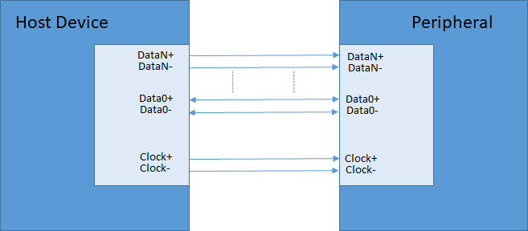
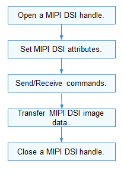

# MIPI DSI


## Overview

The Display Serial Interface (DSI) is a specification stipulated by the Mobile Industry Processor Interface (MIPI) Alliance, aiming to reduce the cost of display controllers in a mobile device. It defines a serial bus and communication protocol among the host, the source of image data, and the target device. In this way, the DSI can send pixel data or commands to peripherals (usually LCDs or similar display devices) in serial mode, or reads information such as status and pixel from the peripherals.

MIPI DSI is capable of working in both high speed (HS) mode and low power (LP) mode. All data lanes can only travel from the DSI host to a peripheral in HS mode, except the first data lane, which can also receive data such as status information and pixels from the peripheral in LP mode. The clock lane is dedicated to transmitting synchronization clock signals in HS mode.

The figure below shows a simplified DSI interface. Conceptually, a DSI-compliant interface has the same features as interfaces complying with DBI-2 and DPI-2 standards. It sends pixels or commands to a peripheral and can read status or pixel information from the peripheral. The main difference is that the DSI serializes all pixel data, commands, and events that, in traditional interfaces, are conveyed to and from the peripheral on a parallel data bus with additional control signals.

  **Figure 1** DSI TX and RX interfaces

  


## Available APIs

  **Table 1** MIPI DSI APIs

| Category| API| 
| -------- | -------- |
| MIPI DSI configuration| -&nbsp;**MipiDsiSetCfg**: sets MIPI DSI attributes.<br>-&nbsp;**MipiDsiGetCfg**: obtains the MIPI DSI configuration.| 
| MIPI DSI device handle| -&nbsp;**MipiDsiOpen**: opens a MIPI DSI device handle.<br>-&nbsp;**MipiDsiClose**: closes a MIPI DSI device handle.| 
| MIPI DSI device mode| -&nbsp;**MipiDsiSetLpMode**: sets LP mode for a device.<br>-&nbsp;**MipiDsiSetHsMode**: sets HS mode for a device.| 
| MIPI DSI commands| -&nbsp;**MipiDsiTx**: sends commands to a display device.<br>- &nbsp;**MipiDsiRx**: reads data of the specified length.| 

>  **NOTE**<br/>
> All APIs described in this document can be called only in kernel mode.


## Usage Guidelines


### How to Use

The figure below shows the general process of using the MIPI DSI driver APIs.

  **Figure 2** Using MIPI DSI driver APIs

  


### Opening a MIPI DSI Device Handle

Before performing MIPI DSI communication, open a MIPI DSI device handle by calling **MipiDsiOpen()**. This function returns the MIPI DSI device handle of the specified channel ID.

  
```
DevHandle MipiDsiOpen(uint8_t id);
```

  **Table 2** Description of MipiDsiOpen

| **Parameter**| **Description**| 
| -------- | -------- |
| id | MIPI DSI channel ID.| 
| **Return Value**| **Description**| 
| NULL | The operation failed.| 
| Device handle| The operation is successful. The MIPI DSI device handle of the specified channel ID (data type is **DevHandle**) is returned.| 

For example, open the MIPI DSI device handle of channel **0**:

  
```
DevHandle mipiDsiHandle = NULL;  /* Device handle */
chnId = 0;      /* MIPI DSI channel ID */

/* Open the MIPI DSI device handle. */
mipiDsiHandle = MipiDsiOpen(chnId);
if (mipiDsiHandle == NULL) {
    HDF_LOGE("MipiDsiOpen: failed\n");
    return;
}
```


### Setting MIPI DSI Attributes

- Call **MipiDsiSetCfg()** to set MIPI DSI attributes.
    
  ```
  int32_t MipiDsiSetCfg(DevHandle handle, struct MipiCfg *cfg);
  ```

    **Table 3** Description of MipiDsiSetCfg
  
  | **Parameter**| **Description**| 
  | -------- | -------- |
  | handle | MIPI DSI device handle.| 
  | cfg | Pointer to the buffer that stores the MIPI DSI configuration.| 
  | **Return Value**| **Description**| 
  | 0 | The operation is successful.| 
  | Negative value| The operation failed.| 

    
  ```
  int32_t ret;
  struct MipiCfg cfg = {0};
  
  /* The display device configuration is as follows: */
  cfg.lane = DSI_4_LANES;
  cfg.mode = DSI_CMD_MODE;
  cfg.burstMode = VIDEO_NON_BURST_MODE_SYNC_EVENTS;
  cfg.format = FORMAT_RGB_24_BIT;
  cfg.pixelClk = 174;
  cfg.phyDataRate = 384;
  cfg.timingInfo.hsaPixels = 50;
  cfg.timingInfo.hbpPixels = 55;
  cfg.timingInfo.hlinePixels = 1200;
  cfg.timingInfo.yResLines = 1800;
  cfg.timingInfo.vbpLines = 33;
  cfg.timingInfo.vsaLines = 76;
  cfg.timingInfo.vfpLines = 120;
  cfg.timingInfo.xResPixels = 1342;
  /* Set the display device configuration. */
  ret = MipiDsiSetCfg(mipiDsiHandle, &cfg);
  if (ret != 0) {
      HDF_LOGE("%s: SetMipiCfg fail! ret=%d\n", __func__, ret);
      return -1;
  }
  ```

- Call **MipiDsiGetCfg()** to obtain the MIPI DSI configuration.
    
  ```
  int32_t MipiDsiGetCfg(DevHandle handle, struct MipiCfg *cfg);
  ```

    **Table 4** Description of MipiDsiGetCfg
  
  | **Parameter**| **Description**| 
  | -------- | -------- |
  | handle | MIPI DSI device handle.| 
  | cfg | Pointer to the buffer that stores the MIPI DSI configuration.| 
  | **Return Value**| **Description**| 
  | 0 | The operation is successful.| 
  | Negative value| The operation failed.| 

    
  ```
  int32_t ret;
  struct MipiCfg cfg;
  memset(&cfg, 0, sizeof(struct MipiCfg));
  ret = MipiDsiGetCfg(mipiDsiHandle, &cfg);
  if (ret != HDF_SUCCESS) {
      HDF_LOGE("%s: GetMipiCfg fail!\n", __func__);
      return HDF_FAILURE;
  }
  ```


### Sending Commands or Reading Data

- Call **MipiDsiTx()** to send commands.
    
  ```
  int32_t MipiDsiTx(PalHandle handle, struct DsiCmdDesc *cmd);
  ```

    **Table 5** Description of MipiDsiTx
  
  | **Parameter**| **Description**| 
  | -------- | -------- |
  | handle | MIPI DSI device handle.| 
  | cmd | Pointer to the commands to send.| 
  | **Return Value**| **Description**| 
  | 0 | The operation is successful.| 
  | Negative value| The operation failed.| 

    
  ```
  int32_t ret;
  struct DsiCmdDesc *cmd = OsalMemCalloc(sizeof(struct DsiCmdDesc));
  if (cmd == NULL) {
      return HDF_FAILURE;
  }
  cmd->dtype = DTYPE_DCS_WRITE;
  cmd->dlen = 1;
  cmd->payload = OsalMemCalloc(sizeof(uint8_t));
  if (cmd->payload == NULL) {
      HdfFree(cmd);
      return HDF_FAILURE;
  }
  *(cmd->payload) = DTYPE_GEN_LWRITE;
  MipiDsiSetLpMode(mipiHandle);
  ret = MipiDsiTx(mipiHandle, cmd);
  MipiDsiSetHsMode(mipiHandle);
  if (ret != HDF_SUCCESS) {
      HDF_LOGE("%s: PalMipiDsiTx fail! ret=%d\n", __func__, ret);
      HdfFree(cmd->payload);
      HdfFree(cmd);
      return HDF_FAILURE;
  }
  HdfFree(cmd->payload);
  HdfFree(cmd);
  ```

- Call **MipiDsiRx()** to read data of the specified length.
    
  ```
  int32_t MipiDsiRx(DevHandle handle, struct DsiCmdDesc *cmd, uint32_t readLen, uint8_t *out);
  ```

    **Table 6** Description of MipiDsiRx
  
  | **Parameter**| **Description**| 
  | -------- | -------- |
  | handle | MIPI DSI device handle.| 
  | cmd | Pointer to the commands.| 
  | readLen | Length of the data to read.| 
  | out | Pointer to the buffer that stores the data read.| 
  | **Return Value**| **Description**| 
  | 0 | The operation is successful.| 
  | Negative value| The operation failed.| 

    
  ```
  int32_t ret;
  uint8_t readVal = 0;
  
  struct DsiCmdDesc *cmdRead = OsalMemCalloc(sizeof(struct DsiCmdDesc));
  if (cmdRead == NULL) {
      return HDF_FAILURE;
  }
  cmdRead->dtype = DTYPE_DCS_READ;
  cmdRead->dlen = 1;
  cmdRead->payload = OsalMemCalloc(sizeof(uint8_t));
  if (cmdRead->payload == NULL) {
      HdfFree(cmdRead);
      return HDF_FAILURE;
  }
  *(cmdRead->payload) = DDIC_REG_STATUS;
  MipiDsiSetLpMode(mipiDsiHandle);
  ret = MipiDsiRx(mipiDsiHandle, cmdRead, sizeof(readVal), &readVal);
  MipiDsiSetHsMode(mipiDsiHandle);
  if (ret != HDF_SUCCESS) {
      HDF_LOGE("%s: MipiDsiRx fail! ret=%d\n", __func__, ret);
      HdfFree(cmdRead->payload);
      HdfFree(cmdRead);
      return HDF_FAILURE;
  }
  HdfFree(cmdRead->payload);
  HdfFree(cmdRead);
  ```


### Closing a MIPI DSI Device Handle

Call **MipiDsiClose()** to close the MIPI DSI device handle after the operation is complete.

  
```
void MipiDsiClose(DevHandle handle);
```

This function releases the resources requested by **MipiDsiOpen**.

  **Table 7** Description of MipiDsiClose

| Parameter| Description| 
| -------- | -------- |
| handle | MIPI DSI device handle.| 

  
```
MipiDsiClose(mipiHandle); /* Close the MIPI DSI device handle. */
```


## Development Example

The following is an example of using a MIPI DSI device:

  
```
#include "hdf.h"
#include "mipi_dsi_if.h"

void PalMipiDsiTestSample(void)
{
    uint8_t chnId;
    int32_t ret;  
    DevHandle mipiDsiHandle = NULL;
    
    /* Device channel ID */
    chnId = 0; 
    /* Open the MIPI DSI device handle of the specified channel ID. */
    mipiDsiHandle = MipiDsiOpen(chnId);
    if (mipiDsiHandle == NULL) {
        HDF_LOGE("MipiDsiOpen: failed!\n");
        return;
    }
    /* Set MIPI DSI attributes. */
    struct MipiCfg cfg = {0};
    cfg.lane = DSI_4_LANES;
    cfg.mode = DSI_CMD_MODE;
    cfg.burstMode = VIDEO_NON_BURST_MODE_SYNC_EVENTS;
    cfg.format = FORMAT_RGB_24_BIT;
    cfg.pixelClk = 174;                      
    cfg.phyDataRate = 384;                 
    cfg.timingInfo.hsaPixels = 50;
    cfg.timingInfo.hbpPixels = 55;
    cfg.timingInfo.hlinePixels = 1200;
    cfg.timingInfo.yResLines = 1800;
    cfg.timingInfo.vbpLines = 33;
    cfg.timingInfo.vsaLines = 76;
    cfg.timingInfo.vfpLines = 120;
    cfg.timingInfo.xResPixels = 1342;
    /* Write the configuration. */
    ret = MipiDsiSetCfg(mipiDsiHandle, &cfg);
    if (ret != 0) {
        HDF_LOGE("%s: SetMipiCfg fail! ret=%d\n", __func__, ret);
        return;
    }
    /* Send the command for initializing the panel. */
    struct DsiCmdDesc *cmd = OsalMemCalloc(sizeof(struct DsiCmdDesc));
    if (cmd == NULL) {
        return;
    }
    cmd->dtype = DTYPE_DCS_WRITE;
    cmd->dlen = 1;
    cmd->payload = OsalMemCalloc(sizeof(uint8_t));
    if (cmd->payload == NULL) {
        HdfFree(cmd);
        return;
    }
    *(cmd->payload) = DTYPE_GEN_LWRITE;
    MipiDsiSetLpMode(mipiHandle);
    ret = MipiDsiTx(mipiHandle, cmd);
    MipiDsiSetHsMode(mipiHandle);
    if (ret != HDF_SUCCESS) {
        HDF_LOGE("%s: MipiDsiTx fail! ret=%d\n", __func__, ret);
        HdfFree(cmd->payload);
        HdfFree(cmd);
        return;
    }
    HdfFree(cmd->payload);
    HdfFree(cmd);
    /* Read data from the panel register. */
    uint8_t readVal = 0;
    struct DsiCmdDesc *cmdRead = OsalMemCalloc(sizeof(struct DsiCmdDesc));
    if (cmdRead == NULL) {
        return;
    }
    cmdRead->dtype = DTYPE_DCS_READ;
    cmdRead->dlen = 1;
    cmdRead->payload = OsalMemCalloc(sizeof(uint8_t));
    if (cmdRead->payload == NULL) {
        HdfFree(cmdRead);
        return;
    }
    *(cmdRead->payload) = DDIC_REG_STATUS;
    MipiDsiSetLpMode(mipiDsiHandle);
    ret = MipiDsiRx(mipiDsiHandle, cmdRead, sizeof(readVal), &readVal);
    MipiDsiSetHsMode(mipiDsiHandle);
    if (ret != HDF_SUCCESS) {
        HDF_LOGE("%s: MipiDsiRx fail! ret=%d\n", __func__, ret);
        HdfFree(cmdRead->payload);
        HdfFree(cmdRead);
        return;
    }
    HdfFree(cmdRead->payload);
    HdfFree(cmdRead);
    /* Close the MIPI CSI device handle. */
    MipiDsiClose(handle); 
}
```
