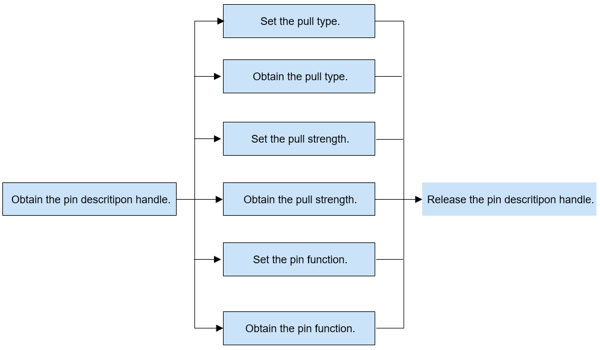

# Pin

## Overview

### Function

The pin module, also called pin controller, manages pin resources of the system on a chip (SoC) and implements the pin multiplexing function.

The pin module provides a set of APIs for pin management, including:

- Obtaining or releasing a pin description handle 
- Setting or obtaining the pull type (pull-up, pull-down, or floating) of a pin
- Setting or obtaining the pull strength of a pin
- Setting or obtaining the function of a pin to implement pin multiplexing

### Basic Concepts

Pin is a software concept designed to uniformly manage SoC pins, implement pin multiplexing, and set electrical features of pins.

- SoC

  An SoC is a chip that integrates microprocessors, analog IP cores, digital IP cores, and memory for specific purposes.

- Pin multiplexing

  When the number of pins of a chip cannot handle the increasing connection requests, you can set software registers to make the pins to work in different states.

### Working Principles

In the Hardware Driver Foundation (HDF), the pin module uses the unified service mode for API adaptation. In this mode, a device service is used as the pin manager to handle access requests from the devices of the same type in a unified manner. The unified service mode applies to the scenario where there are many device objects of the same type. If the independent service mode is used in this case, more device nodes need to be configured and more memory resources will be consumed.

In the unified service mode, the core layer manages all controllers in a unified manner and publishes a service for the interface layer. That is, the driver does not need to publish a service for each controller.

The pin module is divided into the following layers:

- Interface layer: provides APIs for obtaining a pin, setting or obtaining the pull type, pull strength, and function of a pin, and releasing a pin.
- Core layer: provides the capabilities of matching pin resources, adding and removing a pin controller, and managing pins. The core layer interacts with the adaptation layer through hook functions.
- Adaptation layer: instantiates the hook functions to implement specific features.

**Figure 1** Unified service mode


### Constraints

The pin module supports only the LiteOS-A kernel of the small system.

## Usage Guidelines

### When to Use

The pin module is a software concept used to manage pin resources. You can set the function, pull type, and pull strength of pins to implement pin multiplexing.

### Available APIs

The following table describes the APIs of the pin module.

**Table 1** Pin driver APIs

| **API**                                                  | **Description**        |
| ------------------------------------------------------------ | ---------------- |
| DevHandle PinGet(const char *pinName)                       | Obtains a pin description handle.|
| void PinPut(DevHandle handle)                               | Releases the pin description handle.|
| int32_t PinSetPull(DevHandle handle, enum PinPullType pullType) | Sets the pull type of a pin.|
| int32_t PinGetPull(DevHandle handle, enum PinPullType *pullType) | Obtains the pull type of a pin.|
| int32_t PinSetStrength(DevHandle handle, uint32_t strength) | Sets the pull strength of a pin.|
| int32_t PinGetStrength(DevHandle handle, uint32_t *strength) | Obtains the pull strength of a pin.|
| int32_t PinSetFunc(DevHandle handle, const char *funcName)  | Sets the pin function.|
| int32_t PinGetFunc(DevHandle handle, const char **funcName) | Obtains the pin function. |

> **NOTE**
>
>All the pin APIs described in this document can be used in kernel mode and user mode.

### How to Develop

The following figure illustrates how to use pin driver APIs.

 **Figure 2** Using pin driver APIs<br>


#### Obtaining a Pin Description Handle

Before performing an operation on a pin, use **PinGet()** to obtain the pin description handle based on the pin name.

```c
DevHandle PinGet(const char *pinName);
```

**Table 2** Description of PinGet

| Parameter      | Description               |
| ---------- | ----------------------- |
| pinName    | Pointer to the pin name.                 |
| **Return Value**| **Description**         |
| NULL       | The operation fails.|
| handle     | The operation is successful. The pin description handle obtained is returned.        |

Example: Obtain the pin description handle of P18.

```c
DevHandle handle = NULL;    // Pin description handle.

char pinName = "P18";       // Pin name.
handle = PinGet(pinName);
if (handle == NULL) {
    HDF_LOGE("PinGet: get handle failed!\n");
    return;
}
```

#### Setting the Pull Type of a Pin

Use **PinSetPull()** to set the pull type of a pin. 

```c
int32_t PinSetPull(DevHandle handle, enum PinPullType pullType);
```

**Table 3** Description of PinSetPull

| Parameter     | Description               |
| ---------- | ----------------------- |
| handle     | Pin description handle.        |
| pullType   | Pull type to set.        |
| **Return Value**| **Description**         |
| 0          | The operation is successful.|
| Negative value      | The operation fails.|

Example: Set the pull type to pull-up.

```c
int32_t ret;
enum PinPullType pullTypeNum;

/* Set the pull type of a pin. */
pullTypeNum = 1;
ret = PinSetPull(handle, pullTypeNum);
if (ret != HDF_SUCCESS) {
    HDF_LOGE("PinSetPull: failed, ret %d\n", ret);
    return ret;
}
```

#### Obtaining the Pull Type of a Pin

Use **PinGetPull()** to obtain the pull type of a pin.

```c
int32_t PinGetPull(DevHandle handle, enum PinPullType *pullType);
```

**Table 4** Description of PinGetPull

| Parameter      | Description                 |
| ---------- | ------------------------- |
| handle     | Pin description handle.          |
| pullType   | Pointer to the pull type obtained.|
| **Return Value**| **Description**           |
| 0          | The operation is successful.  |
| Negative value      | The operation fails.  |

Example: Obtain the pull type of a pin.

```c
int32_t ret;
enum PinPullType pullTypeNum;

/* Obtain the pull type of a pin.  */
ret = PinGetPull(handle, &pullTypeNum);
if (ret != HDF_SUCCESS) {
    HDF_LOGE("PinGetPull: failed, ret %d\n", ret);
    return ret;
}
```

#### Setting the Pull Strength of a Pin

Use **PinSetStrength()** to set the pull type of a pin.

```c
int32_t PinSetStrength(DevHandle handle, uint32_t strength);
```

**Table 5** Description of PinSetStrength

| Parameter      | Description               |
| ---------- | ----------------------- |
| handle     | Pin description handle.           |
| strength   | Pull strength to set.        |
| **Return Value**| **Description**         |
| 0          | The operation is successful.|
| Negative value      | The operation fails.|

Example: Set the pull strength of the pin to 2. 

```c
int32_t ret;
uint32_t strengthNum;
/* Set the pull strength of the pin. */
strengthNum = 2;
ret = PinSetStrength(handle, strengthNum);
if (ret != HDF_SUCCESS) {
    HDF_LOGE("PinSetStrength: failed, ret %d\n", ret);
    return ret;
}
```

#### Obtaining the Pull Strength of a Pin

Use **PinGetStrength()** to obtain the pull strength of a pin.

```c
int32_t PinGetStrength(DevHandle handle, uint32_t *strength);
```

**Table 6** Description of PinGetStrength

| Parameter      | Description                 |
| ---------- | ------------------------- |
| handle     | Pin description handle.             |
| strength   | Pointer to the pull strength obtained.|
| **Return Value**| **Description**           |
| 0          | The operation is successful.  |
| Negative value      | The operation fails.  |

Example: Obtain the pull strength of a pin.

```c
int32_t ret;
uint32_t strengthNum;

/* Obtain the pull strength of the pin. */
ret = PinGetStrength(handle, &strengthNum);
if (ret != HDF_SUCCESS) {
    HDF_LOGE("PinGetStrength: failed, ret %d\n", ret);
    return ret;
}
```

#### Setting the Pin Function

The pin function refers to the multiplexed pin function. The function of each pin is different. For details about the pin function name, see **//device/soc/hisilicon/hi3516dv300/sdk_liteos/hdf_config/pin/pin_config.hcs**.

Use **PinSetFunc()** to set the pin function.

```c
int32_t PinSetFunc(DevHandle handle, const char *funcName);
```

**Table 7** Description of PinSetFunc

| Parameter      | Description           |
| ---------- | ------------------- |
| handle     | Pin description handle.       |
| funcName   | Pointer to the pin function to set.      |
| **Return Value**| **Description**     |
| 0          | The operation is successful.|
| Negative value      | The operation fails.|

Example: Set the pin function to LSADC_CH1 (ADC channel 1).

```c
int32_t ret;
char funcName = "LSADC_CH1";

/* Sets the pin function. */
ret = PinSetFunc(handle, funcName);
if (ret != HDF_SUCCESS) {
    HDF_LOGE("PinSetFunc: failed, ret %d\n", ret);
    return ret;
}
```

#### Obtaining the Pin Function

Use **PinGetFunc()** to obtain the pin function.

```c
int32_t PinGetFunc(DevHandle handle, const char **funcName);
```

**Table 8** Description of PinGetFunc

| Parameter      | Description             |
| ---------- | --------------------- |
| handle     | Pin description handle.         |
| funcName   | Pointer to the function name obtained.|
| **Return Value**| **Description**       |
| 0          | The operation is successful.  |
| Negative value      | The operation fails.  |

Example: Obtain the pin function. 

```c
int32_t ret;
char *funcName = NULL;

/* Obtain the pin function. */
ret = PinGetFunc(handle, &funcName);
if (ret != HDF_SUCCESS) {
    HDF_LOGE("PinGetFunc: failed, ret %d\n", ret);
    return ret;
}
```

####  Releasing a Pin Description Handle

After the operations on a pin are complete, use **PinPut()** to release the pin description handle.

```c
void PinPut(DevHandle handle);
```

**Table 9** Description of PinPut

| Parameter      | Description      |
| ---------- | -------------- |
| handle     | Pin description handle.  |
| **Return Value**| **Description**|
| NA         | No value is returned.      |

Example: Release a pin description handle.

```c
PinPut(handle);
```

## Example

The following uses the Hi3516D V300 development board as an example. The procedure is as follows:

1. Pass in the pin name to obtain the pin description handle.
2. Set the pull type of the pin. If the operation fails, release the pin description handle.
3. Obtain the pull type of the pin. If the operation fails, release the pin description handle.
4. Set the pull strength of the pin. If the operation fails, release the pin description handle.
5. Obtain the pin pull strength. If the operation fails, release the pin description handle.
5. Set the pin function. If the operation fails, release the pin description handle.
6. Obtain the pin function. If the operation fails, release the pin description handle.
7. Release the pin description handle if no operation needs to be performed on the pin.

```c
#include "hdf_log.h"                     /* Header file of the HDF log APIs. */
#include "pin_if.h"                      /* Header file of standard pin APIs. */

int32_t PinTestSample(void)
{
    int32_t ret;
    uint32_t strengthNum;
    enum PinPullType pullTypeNum;
    char pinName;
    char *funName;
    DevHandle handle = NULL;

    /* Pin name. Set it to the actual pin name. */
    pinName = "P18"; 
    /* Obtain the pin description handle. */
    handle = PinGet(pinName);
    if (handle == NULL) {
        HDF_LOGE("PinGet: pin get failed!\n");
        return;
    }
    /* Set the pull type to pull-up for the pin. */
    pullTypeNum = 1;
    ret = PinSetPull(handle, pullTypeNum);
    if (ret != HDF_SUCCESS) {
        HDF_LOGE("PinSetPull: failed, ret %d\n", ret);
        goto ERR;
    }
    /* Obtain the pull type of the pin. */
    ret = PinGetPull(handle, &pullTypeNum);
    if (ret != HDF_SUCCESS) {
        HDF_LOGE("PinGetPull: failed, ret %d\n", ret);
        goto ERR;
    }
    /* Set the pull strength of the pin to 2. */
    strengthNum = 2;
    ret = PinSetStrength(handle, strengthNum);
    if (ret != HDF_SUCCESS) {
        HDF_LOGE("PinSetStrength: failed, ret %d\n", ret);
        goto ERR;
    }
    /* Obtain the pull strength of the pin. */
    ret = PinGetStrength(handle, &strengthNum);
    if (ret != HDF_SUCCESS) {
        HDF_LOGE("PinGetStrength: failed, ret %d\n", ret);
        goto ERR;
    }
    /* Set the pin function to LSADC_CH1. */
    funName = "LSADC_CH1";
    ret = PinSetFunc(handle, funName);
    if (ret != HDF_SUCCESS) {
        HDF_LOGE("PinSetFunc: failed, ret %d\n", ret);
        goto ERR;
    }
    /* Obtain the pin function. */
    ret = PinGetFunc(handle, &funcName);
    if (ret != HDF_SUCCESS) {
        HDF_LOGE("PinGetFunc: failed, ret %d\n", ret);
        goto ERR;
    }
ERR:
    /* Release the pin description handle. */
    PinPut(handle); 
    return ret;
}
```
