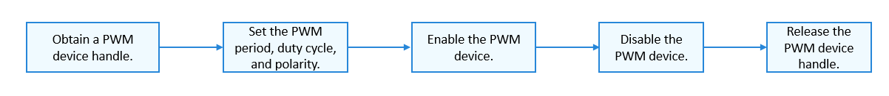

# PWM<a name="EN-US_TOPIC_0000001160812684"></a>

-   [Overview](#section1043395117296)
-   [Available APIs](#section3939192652418)
-   [Usage Guidelines](#section435718267334)
    -   [How to Use](#section113655616347)
    -   [Obtaining a PWM Device Handle](#section17816586359)
    -   [Setting the PWM Period](#section920214812397)
    -   [Setting the PWM Duty Cycle](#section519712820405)
    -   [Setting the PWM Polarity](#section12383334115)
    -   [Enabling the PWM Device](#section382684811414)
    -   [Disabling the PWM Device](#section16545114404218)
    -   [Obtaining PWM Device Configuration Parameters](#section117101243144311)
    -   [Setting PWM Device Configuration Parameters](#section13834163604414)
    -   [Releasing the PWM Device Handle](#section12987111511450)

-   [Usage Example](#section138636719469)

## Overview<a name="section1043395117296"></a>

-   Pulse width modulation \(PWM\) is a method used to digitally encode analog signal levels and convert them into pulses. It can be used for motor control and backlight brightness adjustment.

-   The PWM APIs define a set of common functions for operating a PWM device, including those for:
    -   Obtaining and releasing a PWM device handle
    -   Setting the PWM period, duty cycle, and polarity
    -   Enabling and disabling a PWM device
    -   Obtaining and setting configuration parameters


## Available APIs<a name="section3939192652418"></a>

**Table  1**  APIs available for the PWM driver

<a name="table1731550155318"></a>
<table><thead align="left"><tr id="row4419501537"><th class="cellrowborder" align="left" valign="top" width="20.857914208579142%" id="mcps1.2.4.1.1"><p id="p641050105320"><a name="p641050105320"></a><a name="p641050105320"></a>Capability</p>
</th>
<th class="cellrowborder" align="left" valign="top" width="23.36766323367663%" id="mcps1.2.4.1.2"><p id="p54150165315"><a name="p54150165315"></a><a name="p54150165315"></a>Function</p>
</th>
<th class="cellrowborder" align="left" valign="top" width="55.77442255774422%" id="mcps1.2.4.1.3"><p id="p941150145313"><a name="p941150145313"></a><a name="p941150145313"></a>Description</p>
</th>
</tr>
</thead>
<tbody><tr id="row1651292212306"><td class="cellrowborder" rowspan="2" valign="top" width="20.857914208579142%" headers="mcps1.2.4.1.1 "><p id="p1387414255305"><a name="p1387414255305"></a><a name="p1387414255305"></a>Obtaining/Releasing device handles</p>
</td>
<td class="cellrowborder" valign="top" width="23.36766323367663%" headers="mcps1.2.4.1.2 "><p id="p8874825143014"><a name="p8874825143014"></a><a name="p8874825143014"></a>PwmOpen</p>
</td>
<td class="cellrowborder" valign="top" width="55.77442255774422%" headers="mcps1.2.4.1.3 "><p id="p1087432513307"><a name="p1087432513307"></a><a name="p1087432513307"></a>Obtains a PWM device handle.</p>
</td>
</tr>
<tr id="row1429083612305"><td class="cellrowborder" valign="top" headers="mcps1.2.4.1.1 "><p id="p1956614106311"><a name="p1956614106311"></a><a name="p1956614106311"></a>PwmClose</p>
</td>
<td class="cellrowborder" valign="top" headers="mcps1.2.4.1.2 "><p id="p829111362306"><a name="p829111362306"></a><a name="p829111362306"></a>Releases a PWM device handle.</p>
</td>
</tr>
<tr id="row34145016535"><td class="cellrowborder" rowspan="3" valign="top" width="20.857914208579142%" headers="mcps1.2.4.1.1 "><p id="p229610227124"><a name="p229610227124"></a><a name="p229610227124"></a>Setting the PWM period, duty cycle, and polarity</p>
</td>
<td class="cellrowborder" valign="top" width="23.36766323367663%" headers="mcps1.2.4.1.2 "><p id="p19389143041518"><a name="p19389143041518"></a><a name="p19389143041518"></a>PwmSetPeriod</p>
</td>
<td class="cellrowborder" valign="top" width="55.77442255774422%" headers="mcps1.2.4.1.3 "><p id="p1360544321811"><a name="p1360544321811"></a><a name="p1360544321811"></a>Sets the PWM period.</p>
</td>
</tr>
<tr id="row5632152611414"><td class="cellrowborder" valign="top" headers="mcps1.2.4.1.1 "><p id="p1392810111722"><a name="p1392810111722"></a><a name="p1392810111722"></a>PwmSetDuty</p>
</td>
<td class="cellrowborder" valign="top" headers="mcps1.2.4.1.2 "><p id="p10448193611188"><a name="p10448193611188"></a><a name="p10448193611188"></a>Sets the PWM duty cycle.</p>
</td>
</tr>
<tr id="row1766145611414"><td class="cellrowborder" valign="top" headers="mcps1.2.4.1.1 "><p id="p10445141911213"><a name="p10445141911213"></a><a name="p10445141911213"></a>PwmSetPolarity</p>
</td>
<td class="cellrowborder" valign="top" headers="mcps1.2.4.1.2 "><p id="p448643019188"><a name="p448643019188"></a><a name="p448643019188"></a>Sets the PWM polarity.</p>
</td>
</tr>
<tr id="row195531331436"><td class="cellrowborder" rowspan="2" valign="top" width="20.857914208579142%" headers="mcps1.2.4.1.1 "><p id="p166091535331"><a name="p166091535331"></a><a name="p166091535331"></a>Enabling/Disabling devices</p>
</td>
<td class="cellrowborder" valign="top" width="23.36766323367663%" headers="mcps1.2.4.1.2 "><p id="p85533315315"><a name="p85533315315"></a><a name="p85533315315"></a>PwmEnable</p>
</td>
<td class="cellrowborder" valign="top" width="55.77442255774422%" headers="mcps1.2.4.1.3 "><p id="p855303118314"><a name="p855303118314"></a><a name="p855303118314"></a>Enables a PWM device.</p>
</td>
</tr>
<tr id="row96141928233"><td class="cellrowborder" valign="top" headers="mcps1.2.4.1.1 "><p id="p66151828330"><a name="p66151828330"></a><a name="p66151828330"></a>PwmDisable</p>
</td>
<td class="cellrowborder" valign="top" headers="mcps1.2.4.1.2 "><p id="p261518281139"><a name="p261518281139"></a><a name="p261518281139"></a>Disables a PWM device.</p>
</td>
</tr>
<tr id="row1020919129159"><td class="cellrowborder" rowspan="2" valign="top" width="20.857914208579142%" headers="mcps1.2.4.1.1 "><p id="p82092126154"><a name="p82092126154"></a><a name="p82092126154"></a>Obtaining/Setting configuration parameters</p>
<p id="p6794153701111"><a name="p6794153701111"></a><a name="p6794153701111"></a></p>
</td>
<td class="cellrowborder" valign="top" width="23.36766323367663%" headers="mcps1.2.4.1.2 "><p id="p1739013012154"><a name="p1739013012154"></a><a name="p1739013012154"></a>PwmSetConfig</p>
</td>
<td class="cellrowborder" valign="top" width="55.77442255774422%" headers="mcps1.2.4.1.3 "><p id="p1152912417189"><a name="p1152912417189"></a><a name="p1152912417189"></a>Sets PWM device configuration parameters.</p>
</td>
</tr>
<tr id="row379443710118"><td class="cellrowborder" valign="top" headers="mcps1.2.4.1.1 "><p id="p4333154919111"><a name="p4333154919111"></a><a name="p4333154919111"></a>PwmGetConfig</p>
</td>
<td class="cellrowborder" valign="top" headers="mcps1.2.4.1.2 "><p id="p19575195601711"><a name="p19575195601711"></a><a name="p19575195601711"></a>Obtains PWM device configuration parameters.</p>
</td>
</tr>
</tbody>
</table>

> **NOTE:** 
>All functions described in this document can be called only in kernel space.

## Usage Guidelines<a name="section435718267334"></a>

### How to Use<a name="section113655616347"></a>

[Figure 1](#fig23885455594)  shows the process of using a PWM device.

**Figure  1**  Process of using a PWM device<a name="fig23885455594"></a>  




### Obtaining a PWM Device Handle<a name="section17816586359"></a>

Before performing operations on a PWM device, obtain a PWM device handle by calling  **PwmOpen**. This function returns a PWM device handle with the specified device number.

DevHandle PwmOpen\(uint32\_t num\);

**Table  2**  Description of PwmOpen

<a name="table7603619123820"></a>
<table><tbody><tr id="row1060351914386"><td class="cellrowborder" valign="top" width="50%"><p id="p14603181917382"><a name="p14603181917382"></a><a name="p14603181917382"></a><strong id="b8660143618196"><a name="b8660143618196"></a><a name="b8660143618196"></a>Parameter</strong></p>
</td>
<td class="cellrowborder" valign="top" width="50%"><p id="p36031519183819"><a name="p36031519183819"></a><a name="p36031519183819"></a><strong id="b3425537181912"><a name="b3425537181912"></a><a name="b3425537181912"></a>Description</strong></p>
</td>
</tr>
<tr id="row1960431983813"><td class="cellrowborder" valign="top" width="50%"><p id="p1114111239269"><a name="p1114111239269"></a><a name="p1114111239269"></a>num</p>
</td>
<td class="cellrowborder" valign="top" width="50%"><p id="p1560441923818"><a name="p1560441923818"></a><a name="p1560441923818"></a>PWM device number.</p>
</td>
</tr>
<tr id="row380484160"><td class="cellrowborder" valign="top" width="50%"><p id="p460381915385"><a name="p460381915385"></a><a name="p460381915385"></a><strong id="b38961340181918"><a name="b38961340181918"></a><a name="b38961340181918"></a>Return Value</strong></p>
</td>
<td class="cellrowborder" valign="top" width="50%"><p id="p96031619153812"><a name="p96031619153812"></a><a name="p96031619153812"></a><strong id="b1273144114193"><a name="b1273144114193"></a><a name="b1273144114193"></a>Description</strong></p>
</td>
</tr>
<tr id="row5793818161"><td class="cellrowborder" valign="top" width="50%"><p id="p1060418195389"><a name="p1060418195389"></a><a name="p1060418195389"></a>NULL</p>
</td>
<td class="cellrowborder" valign="top" width="50%"><p id="p760471912388"><a name="p760471912388"></a><a name="p760471912388"></a>Failed to obtain the PWM device handle.</p>
</td>
</tr>
<tr id="row187914871618"><td class="cellrowborder" valign="top" width="50%"><p id="p5604719133811"><a name="p5604719133811"></a><a name="p5604719133811"></a>Device handle</p>
</td>
<td class="cellrowborder" valign="top" width="50%"><p id="p3604181933818"><a name="p3604181933818"></a><a name="p3604181933818"></a>PWM device handle.</p>
</td>
</tr>
</tbody>
</table>

The following example shows how to obtain a PWM device handle with the device number  **0**:

```
uint32_t num = 0;             /* PWM device number */
DevHandle pwm = NULL; /* PWM device handle */

/* Obtain the PWM device handle. */
pwm = PwmOpen(num);
if (pwm == NULL) {
    HDF_LOGE("PwmOpen: pwm%d failed", num);
    return;
}
```

### Setting the PWM Period<a name="section920214812397"></a>

int32\_t PwmSetPeriod\(DevHandle handle, uint32\_t period\);

**Table  3**  Description of PwmSetPeriod

<a name="table16124612193214"></a>
<table><tbody><tr id="row4124212123217"><td class="cellrowborder" valign="top" width="50%"><p id="p11124131243218"><a name="p11124131243218"></a><a name="p11124131243218"></a><strong id="b1857203711910"><a name="b1857203711910"></a><a name="b1857203711910"></a>Parameter</strong></p>
</td>
<td class="cellrowborder" valign="top" width="50%"><p id="p14124191263210"><a name="p14124191263210"></a><a name="p14124191263210"></a><strong id="b17874123771911"><a name="b17874123771911"></a><a name="b17874123771911"></a>Description</strong></p>
</td>
</tr>
<tr id="row111241012133210"><td class="cellrowborder" valign="top" width="50%"><p id="p18124201220324"><a name="p18124201220324"></a><a name="p18124201220324"></a>handle</p>
</td>
<td class="cellrowborder" valign="top" width="50%"><p id="p20124191210321"><a name="p20124191210321"></a><a name="p20124191210321"></a>PWM device handle.</p>
</td>
</tr>
<tr id="row151241112163216"><td class="cellrowborder" valign="top" width="50%"><p id="p712481223212"><a name="p712481223212"></a><a name="p712481223212"></a>period</p>
</td>
<td class="cellrowborder" valign="top" width="50%"><p id="p1312411126320"><a name="p1312411126320"></a><a name="p1312411126320"></a>Period, in nanoseconds.</p>
</td>
</tr>
<tr id="row712471214320"><td class="cellrowborder" valign="top" width="50%"><p id="p1612421233217"><a name="p1612421233217"></a><a name="p1612421233217"></a><strong id="b13153419197"><a name="b13153419197"></a><a name="b13153419197"></a>Return Value</strong></p>
</td>
<td class="cellrowborder" valign="top" width="50%"><p id="p1712591211327"><a name="p1712591211327"></a><a name="p1712591211327"></a><strong id="b79834217190"><a name="b79834217190"></a><a name="b79834217190"></a>Description</strong></p>
</td>
</tr>
<tr id="row812581214326"><td class="cellrowborder" valign="top" width="50%"><p id="p13125812183214"><a name="p13125812183214"></a><a name="p13125812183214"></a>0</p>
</td>
<td class="cellrowborder" valign="top" width="50%"><p id="p15125812193212"><a name="p15125812193212"></a><a name="p15125812193212"></a>Succeeded in setting the PWM period.</p>
</td>
</tr>
<tr id="row2012571273216"><td class="cellrowborder" valign="top" width="50%"><p id="p17125181215327"><a name="p17125181215327"></a><a name="p17125181215327"></a>Negative value</p>
</td>
<td class="cellrowborder" valign="top" width="50%"><p id="p81251512143217"><a name="p81251512143217"></a><a name="p81251512143217"></a>Failed to set the period.</p>
</td>
</tr>
</tbody>
</table>

```
int32_t ret;
uint32_t period = 1000;          /* Period: 1000 ns */
ret = PwmSetPeriod(pwm, period); /* Set the PWM period. */
if (ret != 0) {
    HDF_LOGE("PwmSetPeriod: failed, ret %d", ret);
}
```

### Setting the PWM Duty Cycle<a name="section519712820405"></a>

int32\_t PwmSetDuty\(DevHandle handle, uint32\_t duty\);

**Table  4**  Description of PwmSetDuty

<a name="table2010731215368"></a>
<table><tbody><tr id="row51071812163614"><td class="cellrowborder" valign="top" width="50%"><p id="p21071412123617"><a name="p21071412123617"></a><a name="p21071412123617"></a><strong id="b1459173719195"><a name="b1459173719195"></a><a name="b1459173719195"></a>Parameter</strong></p>
</td>
<td class="cellrowborder" valign="top" width="50%"><p id="p910715125363"><a name="p910715125363"></a><a name="p910715125363"></a><strong id="b16877113781915"><a name="b16877113781915"></a><a name="b16877113781915"></a>Description</strong></p>
</td>
</tr>
<tr id="row5107912193611"><td class="cellrowborder" valign="top" width="50%"><p id="p15107141223618"><a name="p15107141223618"></a><a name="p15107141223618"></a>handle</p>
</td>
<td class="cellrowborder" valign="top" width="50%"><p id="p16107151293612"><a name="p16107151293612"></a><a name="p16107151293612"></a>PWM device handle.</p>
</td>
</tr>
<tr id="row131077122364"><td class="cellrowborder" valign="top" width="50%"><p id="p4107161218361"><a name="p4107161218361"></a><a name="p4107161218361"></a>duty</p>
</td>
<td class="cellrowborder" valign="top" width="50%"><p id="p13107201263620"><a name="p13107201263620"></a><a name="p13107201263620"></a>Duty cycle, in nanoseconds.</p>
</td>
</tr>
<tr id="row161071512143618"><td class="cellrowborder" valign="top" width="50%"><p id="p01071012123617"><a name="p01071012123617"></a><a name="p01071012123617"></a><strong id="b7318164151915"><a name="b7318164151915"></a><a name="b7318164151915"></a>Return Value</strong></p>
</td>
<td class="cellrowborder" valign="top" width="50%"><p id="p10107111273619"><a name="p10107111273619"></a><a name="p10107111273619"></a><strong id="b181001442121915"><a name="b181001442121915"></a><a name="b181001442121915"></a>Description</strong></p>
</td>
</tr>
<tr id="row15108101217363"><td class="cellrowborder" valign="top" width="50%"><p id="p1110811263616"><a name="p1110811263616"></a><a name="p1110811263616"></a>0</p>
</td>
<td class="cellrowborder" valign="top" width="50%"><p id="p61081712203612"><a name="p61081712203612"></a><a name="p61081712203612"></a>Succeeded in setting the duty cycle.</p>
</td>
</tr>
<tr id="row171081012183618"><td class="cellrowborder" valign="top" width="50%"><p id="p610816120365"><a name="p610816120365"></a><a name="p610816120365"></a>Negative value</p>
</td>
<td class="cellrowborder" valign="top" width="50%"><p id="p10108012143617"><a name="p10108012143617"></a><a name="p10108012143617"></a>Failed to set the duty cycle.</p>
</td>
</tr>
</tbody>
</table>

```
int32_t ret;
uint32_t duty = 500;        /* Duty cycle: 500 ns */
ret = PwmSetDuty(pwm, duty); /* Set the PWM duty cycle. */
if (ret != 0) {
    HDF_LOGE("PwmSetDuty: failed, ret %d", ret);
}
```

### Setting the PWM Polarity<a name="section12383334115"></a>

int32\_t PwmSetPolarity\(DevHandle handle, uint8\_t polarity\);

**Table  5**  Description of PwmSetPolarity

<a name="table141853773813"></a>
<table><tbody><tr id="row6418837183810"><td class="cellrowborder" valign="top" width="50%"><p id="p14181637103817"><a name="p14181637103817"></a><a name="p14181637103817"></a><strong id="b16133714199"><a name="b16133714199"></a><a name="b16133714199"></a>Parameter</strong></p>
</td>
<td class="cellrowborder" valign="top" width="50%"><p id="p74181375386"><a name="p74181375386"></a><a name="p74181375386"></a><strong id="b1187918371191"><a name="b1187918371191"></a><a name="b1187918371191"></a>Description</strong></p>
</td>
</tr>
<tr id="row84181437163812"><td class="cellrowborder" valign="top" width="50%"><p id="p1141823715384"><a name="p1141823715384"></a><a name="p1141823715384"></a>handle</p>
</td>
<td class="cellrowborder" valign="top" width="50%"><p id="p7418143718385"><a name="p7418143718385"></a><a name="p7418143718385"></a>PWM device handle.</p>
</td>
</tr>
<tr id="row5418123711387"><td class="cellrowborder" valign="top" width="50%"><p id="p241893773817"><a name="p241893773817"></a><a name="p241893773817"></a>polarity</p>
</td>
<td class="cellrowborder" valign="top" width="50%"><p id="p184181937123811"><a name="p184181937123811"></a><a name="p184181937123811"></a>Polarity, which can be <strong id="b31772419213"><a name="b31772419213"></a><a name="b31772419213"></a>PWM_NORMAL_POLARITY</strong> or <strong id="b31771840212"><a name="b31771840212"></a><a name="b31771840212"></a>PWM_INVERTED_POLARITY</strong>.</p>
</td>
</tr>
<tr id="row841883773819"><td class="cellrowborder" valign="top" width="50%"><p id="p11418193763820"><a name="p11418193763820"></a><a name="p11418193763820"></a><strong id="b17320164117192"><a name="b17320164117192"></a><a name="b17320164117192"></a>Return Value</strong></p>
</td>
<td class="cellrowborder" valign="top" width="50%"><p id="p164185378387"><a name="p164185378387"></a><a name="p164185378387"></a><strong id="b61021427199"><a name="b61021427199"></a><a name="b61021427199"></a>Description</strong></p>
</td>
</tr>
<tr id="row1741919372382"><td class="cellrowborder" valign="top" width="50%"><p id="p2419103718389"><a name="p2419103718389"></a><a name="p2419103718389"></a>0</p>
</td>
<td class="cellrowborder" valign="top" width="50%"><p id="p241993723818"><a name="p241993723818"></a><a name="p241993723818"></a>Succeed in setting the polarity.</p>
</td>
</tr>
<tr id="row1441983711384"><td class="cellrowborder" valign="top" width="50%"><p id="p1441903793817"><a name="p1441903793817"></a><a name="p1441903793817"></a>Negative value</p>
</td>
<td class="cellrowborder" valign="top" width="50%"><p id="p84191237193817"><a name="p84191237193817"></a><a name="p84191237193817"></a>Failed to set the polarity.</p>
</td>
</tr>
</tbody>
</table>

```
int32_t ret;
uint8_t polarity = PWM_INVERTED_POLARITY; /* Inverted polarity */
ret = PwmSetPolarity(pwm, polarity);      /* Set PWM polarity to inverted polarity. */
if (ret != 0) {
    HDF_LOGE("PwmSetPolarity: failed, ret %d", ret);
}
```

### Enabling the PWM Device<a name="section382684811414"></a>

int32\_t PwmEnable\(DevHandle handle\);

**Table  6**  Description of PwmEnable

<a name="table785385210447"></a>
<table><tbody><tr id="row9853185234417"><td class="cellrowborder" valign="top" width="50%"><p id="p7853195215444"><a name="p7853195215444"></a><a name="p7853195215444"></a><strong id="b36343761918"><a name="b36343761918"></a><a name="b36343761918"></a>Parameter</strong></p>
</td>
<td class="cellrowborder" valign="top" width="50%"><p id="p4853352104417"><a name="p4853352104417"></a><a name="p4853352104417"></a><strong id="b11881837131919"><a name="b11881837131919"></a><a name="b11881837131919"></a>Description</strong></p>
</td>
</tr>
<tr id="row6853165254419"><td class="cellrowborder" valign="top" width="50%"><p id="p085313525446"><a name="p085313525446"></a><a name="p085313525446"></a>handle</p>
</td>
<td class="cellrowborder" valign="top" width="50%"><p id="p185319529444"><a name="p185319529444"></a><a name="p185319529444"></a>PWM device handle.</p>
</td>
</tr>
<tr id="row585313527443"><td class="cellrowborder" valign="top" width="50%"><p id="p15853652174416"><a name="p15853652174416"></a><a name="p15853652174416"></a><strong id="b16323144113194"><a name="b16323144113194"></a><a name="b16323144113194"></a>Return Value</strong></p>
</td>
<td class="cellrowborder" valign="top" width="50%"><p id="p1385310525444"><a name="p1385310525444"></a><a name="p1385310525444"></a><strong id="b8104184291915"><a name="b8104184291915"></a><a name="b8104184291915"></a>Description</strong></p>
</td>
</tr>
<tr id="row9854252134410"><td class="cellrowborder" valign="top" width="50%"><p id="p13854155214416"><a name="p13854155214416"></a><a name="p13854155214416"></a>0</p>
</td>
<td class="cellrowborder" valign="top" width="50%"><p id="p6854452114416"><a name="p6854452114416"></a><a name="p6854452114416"></a>Succeeded in enabling the PWM device.</p>
</td>
</tr>
<tr id="row58545526443"><td class="cellrowborder" valign="top" width="50%"><p id="p1085412522449"><a name="p1085412522449"></a><a name="p1085412522449"></a>Negative value</p>
</td>
<td class="cellrowborder" valign="top" width="50%"><p id="p2854052124416"><a name="p2854052124416"></a><a name="p2854052124416"></a>Failed to enable the PWM device.</p>
</td>
</tr>
</tbody>
</table>

```
int32_t ret;
ret = PwmEnable(pwm); /* Enable the PWM device. */
if (ret != 0) {
    HDF_LOGE("PwmEnable: failed, ret %d", ret);
}
```

### Disabling the PWM Device<a name="section16545114404218"></a>

int32\_t PwmDisable\(DevHandle handle\);

**Table  7**  Description of PwmDisable

<a name="table1354973912475"></a>
<table><tbody><tr id="row115499392478"><td class="cellrowborder" valign="top" width="50%"><p id="p1554993912474"><a name="p1554993912474"></a><a name="p1554993912474"></a><strong id="b56503721918"><a name="b56503721918"></a><a name="b56503721918"></a>Parameter</strong></p>
</td>
<td class="cellrowborder" valign="top" width="50%"><p id="p055083915471"><a name="p055083915471"></a><a name="p055083915471"></a><strong id="b088343710192"><a name="b088343710192"></a><a name="b088343710192"></a>Description</strong></p>
</td>
</tr>
<tr id="row1855093974715"><td class="cellrowborder" valign="top" width="50%"><p id="p2550739114717"><a name="p2550739114717"></a><a name="p2550739114717"></a>handle</p>
</td>
<td class="cellrowborder" valign="top" width="50%"><p id="p1755018397479"><a name="p1755018397479"></a><a name="p1755018397479"></a>PWM device handle.</p>
</td>
</tr>
<tr id="row355043910472"><td class="cellrowborder" valign="top" width="50%"><p id="p1655053984714"><a name="p1655053984714"></a><a name="p1655053984714"></a><strong id="b16327041171912"><a name="b16327041171912"></a><a name="b16327041171912"></a>Return Value</strong></p>
</td>
<td class="cellrowborder" valign="top" width="50%"><p id="p16550439154720"><a name="p16550439154720"></a><a name="p16550439154720"></a><strong id="b101057422194"><a name="b101057422194"></a><a name="b101057422194"></a>Description</strong></p>
</td>
</tr>
<tr id="row25507391479"><td class="cellrowborder" valign="top" width="50%"><p id="p1555014394473"><a name="p1555014394473"></a><a name="p1555014394473"></a>0</p>
</td>
<td class="cellrowborder" valign="top" width="50%"><p id="p15550839174713"><a name="p15550839174713"></a><a name="p15550839174713"></a>Succeeded in disabling the PWM device.</p>
</td>
</tr>
<tr id="row1155093913470"><td class="cellrowborder" valign="top" width="50%"><p id="p1655015398476"><a name="p1655015398476"></a><a name="p1655015398476"></a>Negative value</p>
</td>
<td class="cellrowborder" valign="top" width="50%"><p id="p4550143919471"><a name="p4550143919471"></a><a name="p4550143919471"></a>Failed to disable the PWM device.</p>
</td>
</tr>
</tbody>
</table>

```
int32_t ret;
ret = PwmDisable(pwm); /* Disable the PWM device. */
if (ret != 0) {
    HDF_LOGE("PwmDisable: failed, ret %d", ret);
}
```

### Obtaining PWM Device Configuration Parameters<a name="section117101243144311"></a>

int32\_t PwmGetConfig\(DevHandle handle, struct PwmConfig \*config\);

**Table  8**  Description of PwmGetConfig

<a name="table14209152141313"></a>
<table><tbody><tr id="row1420918529133"><td class="cellrowborder" valign="top" width="50%"><p id="p42091852141314"><a name="p42091852141314"></a><a name="p42091852141314"></a><strong id="b1866173710197"><a name="b1866173710197"></a><a name="b1866173710197"></a>Parameter</strong></p>
</td>
<td class="cellrowborder" valign="top" width="50%"><p id="p202099523137"><a name="p202099523137"></a><a name="p202099523137"></a><strong id="b19885123791911"><a name="b19885123791911"></a><a name="b19885123791911"></a>Description</strong></p>
</td>
</tr>
<tr id="row142091352171310"><td class="cellrowborder" valign="top" width="50%"><p id="p1520915529131"><a name="p1520915529131"></a><a name="p1520915529131"></a>handle</p>
</td>
<td class="cellrowborder" valign="top" width="50%"><p id="p720995291310"><a name="p720995291310"></a><a name="p720995291310"></a>PWM device handle.</p>
</td>
</tr>
<tr id="row6209152161314"><td class="cellrowborder" valign="top" width="50%"><p id="p720916522139"><a name="p720916522139"></a><a name="p720916522139"></a>config</p>
</td>
<td class="cellrowborder" valign="top" width="50%"><p id="p172091452131319"><a name="p172091452131319"></a><a name="p172091452131319"></a>Pointer to the <strong id="b1844333918213"><a name="b1844333918213"></a><a name="b1844333918213"></a>PwmConfig</strong> structure containing PWM device configuration parameters.</p>
</td>
</tr>
<tr id="row12092522139"><td class="cellrowborder" valign="top" width="50%"><p id="p18209125211134"><a name="p18209125211134"></a><a name="p18209125211134"></a><strong id="b4330164111912"><a name="b4330164111912"></a><a name="b4330164111912"></a>Return Value</strong></p>
</td>
<td class="cellrowborder" valign="top" width="50%"><p id="p420975231318"><a name="p420975231318"></a><a name="p420975231318"></a><strong id="b16107114241910"><a name="b16107114241910"></a><a name="b16107114241910"></a>Description</strong></p>
</td>
</tr>
<tr id="row8209155251310"><td class="cellrowborder" valign="top" width="50%"><p id="p13210145291312"><a name="p13210145291312"></a><a name="p13210145291312"></a>0</p>
</td>
<td class="cellrowborder" valign="top" width="50%"><p id="p152101952141315"><a name="p152101952141315"></a><a name="p152101952141315"></a>Succeeded in obtaining PWM device configuration parameters.</p>
</td>
</tr>
<tr id="row102101452121320"><td class="cellrowborder" valign="top" width="50%"><p id="p10210175219134"><a name="p10210175219134"></a><a name="p10210175219134"></a>Negative value</p>
</td>
<td class="cellrowborder" valign="top" width="50%"><p id="p72101252101312"><a name="p72101252101312"></a><a name="p72101252101312"></a>Failed to obtain PWM device configuration parameters.</p>
</td>
</tr>
</tbody>
</table>

```
int32_t ret;
struct PwmConfig config= {0};          /* PWM configuration parameters */
ret = PwmGetConfig(pwm, &config); /* Obtain PWM device configuration parameters. */
if (ret != 0) {
    HDF_LOGE("PwmGetConfig: failed, ret %d", ret);
}
```

### Setting PWM Device Configuration Parameters<a name="section13834163604414"></a>

int32\_t PwmSetConfig\(DevHandle handle, struct PwmConfig \*config\);

**Table  9**  Description of PwmSetConfig

<a name="table1836117542321"></a>
<table><tbody><tr id="row20361165453211"><td class="cellrowborder" valign="top" width="50%"><p id="p1736135418323"><a name="p1736135418323"></a><a name="p1736135418323"></a><strong id="b11682037161918"><a name="b11682037161918"></a><a name="b11682037161918"></a>Parameter</strong></p>
</td>
<td class="cellrowborder" valign="top" width="50%"><p id="p13361954103214"><a name="p13361954103214"></a><a name="p13361954103214"></a><strong id="b18888173791918"><a name="b18888173791918"></a><a name="b18888173791918"></a>Description</strong></p>
</td>
</tr>
<tr id="row336185416328"><td class="cellrowborder" valign="top" width="50%"><p id="p3361454153218"><a name="p3361454153218"></a><a name="p3361454153218"></a>handle</p>
</td>
<td class="cellrowborder" valign="top" width="50%"><p id="p836175418328"><a name="p836175418328"></a><a name="p836175418328"></a>PWM device handle.</p>
</td>
</tr>
<tr id="row18361135411322"><td class="cellrowborder" valign="top" width="50%"><p id="p2036175403217"><a name="p2036175403217"></a><a name="p2036175403217"></a>config</p>
</td>
<td class="cellrowborder" valign="top" width="50%"><p id="p1736120541323"><a name="p1736120541323"></a><a name="p1736120541323"></a>Pointer to the <strong id="b886814395214"><a name="b886814395214"></a><a name="b886814395214"></a>PwmConfig</strong> structure containing PWM device configuration parameters.</p>
</td>
</tr>
<tr id="row2361254133217"><td class="cellrowborder" valign="top" width="50%"><p id="p1636295463212"><a name="p1636295463212"></a><a name="p1636295463212"></a><strong id="b0333141131914"><a name="b0333141131914"></a><a name="b0333141131914"></a>Return Value</strong></p>
</td>
<td class="cellrowborder" valign="top" width="50%"><p id="p173621854153217"><a name="p173621854153217"></a><a name="p173621854153217"></a><strong id="b210914211914"><a name="b210914211914"></a><a name="b210914211914"></a>Description</strong></p>
</td>
</tr>
<tr id="row73628543328"><td class="cellrowborder" valign="top" width="50%"><p id="p15362205417325"><a name="p15362205417325"></a><a name="p15362205417325"></a>0</p>
</td>
<td class="cellrowborder" valign="top" width="50%"><p id="p436285433211"><a name="p436285433211"></a><a name="p436285433211"></a>Succeeded in setting PWM configuration parameters.</p>
</td>
</tr>
<tr id="row23621154153220"><td class="cellrowborder" valign="top" width="50%"><p id="p13362954113214"><a name="p13362954113214"></a><a name="p13362954113214"></a>Negative value</p>
</td>
<td class="cellrowborder" valign="top" width="50%"><p id="p83629546325"><a name="p83629546325"></a><a name="p83629546325"></a>Failed to set PWM configuration parameters.</p>
</td>
</tr>
</tbody>
</table>

```
int32_t ret;
struct PwmConfig config= {0};          /* PWM configuration parameters */
config.duty = 500;                     /* Duty cycle: 500 ns */
config.period = 1000;                  /* Period: 1000 ns */
config.number = 0;                     /* Continuous output of square waves */
config.polarity = PWM_NORMAL_POLARITY; /* Normal polarity */
ret = PwmSetConfig(pwm, &config);      /* Set PWM device configuration parameters. */
if (ret != 0) {
    HDF_LOGE("PwmSetConfig: failed, ret %d\n", ret);
}
```

### Releasing the PWM Device Handle<a name="section12987111511450"></a>

void PwmClose\(DevHandle handle\);

This function will release the resources obtained by calling  **PwmClose**.

**Table  10**  Description of PwmClose

<a name="table72517953115"></a>
<table><tbody><tr id="row1525793312"><td class="cellrowborder" valign="top" width="50%"><p id="p115402031153111"><a name="p115402031153111"></a><a name="p115402031153111"></a><strong id="b1669123714198"><a name="b1669123714198"></a><a name="b1669123714198"></a>Parameter</strong></p>
</td>
<td class="cellrowborder" valign="top" width="50%"><p id="p65406313319"><a name="p65406313319"></a><a name="p65406313319"></a><strong id="b8890113710195"><a name="b8890113710195"></a><a name="b8890113710195"></a>Description</strong></p>
</td>
</tr>
<tr id="row1926109193116"><td class="cellrowborder" valign="top" width="50%"><p id="p105419317318"><a name="p105419317318"></a><a name="p105419317318"></a>handle</p>
</td>
<td class="cellrowborder" valign="top" width="50%"><p id="p16541153110317"><a name="p16541153110317"></a><a name="p16541153110317"></a>PWM device handle.</p>
</td>
</tr>
</tbody>
</table>

```
PwmClose(pwm); /* Release the PWM device handle */
```

## Usage Example<a name="section138636719469"></a>

The following example shows how to obtain a PWM device handle, set the PWM configuration parameters, enable the PWM device, and finally release the PWM device handle.

```
#include "hdf_log.h"
#include "osal_time.h"
#include "pwm_if.h"

void PwmTestSample(void)
{
    int32_t ret;
    struct PwmConfig config;      /* PWM configuration parameters */
    DevHandle pwm = NULL;         /* PWM device handle */
  
    pwm = PwmOpen(0);             /* Obtain the PWM device handle. */
    if (pwm == NULL) {
        HDF_LOGE("PwmOpen: pwm0 failed");
        return;
    }
    /* Obtain the PWM device configuration parameters. */
    ret = PwmGetConfig(pwm, &config);
    if (ret != 0) {
        HDF_LOGE("PwmGetConfig: failed, ret %d\n", ret);
        goto err;
    }
    config.duty = 500;            /* Duty cycle: 500 ns */
    config.period = 1000;         /* Period: 1000 ns */
    /* Set the PWM device configuration parameters. */
    ret = PwmSetConfig(pwm, &config);
    if (ret != 0) {
        HDF_LOGE("PwmSetConfig: failed, ret %d\n", ret);
        goto err;
    }
    /* Enable the PWM device. */
    ret = PwmEnable(pwm);
    if (ret != 0) {
        HDF_LOGE("PwmEnable: failed, ret %d\n", ret);
        goto err;
    }
    /* Sleep for 10 seconds */
    OsalSleep(10);
    /* Disable the PWM device. */
    ret = PwmDisable(pwm);
    if (ret != 0) {
        HDF_LOGE("PwmDisable: failed, ret %d\n", ret);
        goto err;
    }
err:
    /* Release the PWM device handle. */
    PwmClose(pwm);
}
```

