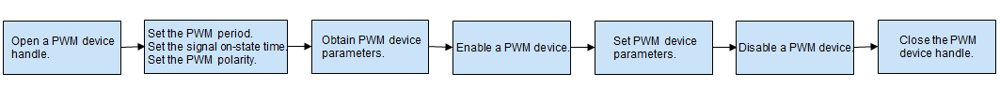

# PWM<a name="title_PWM_des"></a>

## Overview <a name="section1_PWM_des"></a>

Pulse width modulation (PWM) is a method used to digitally encode analog signal levels and convert them into pulses. It can be used for motor control and backlight brightness adjustment.

The PWM APIs provide a set of functions for operating a PWM device, including those for:
- Obtaining and releasing a PWM device handle
- Setting the PWM period, signal ON-state time, and polarity
- Enabling and disabling a PWM device
- Obtaining and setting PWM parameters

### PwmConfig Structure<a name="section1.1_PWM_des"></a>

**Table 1** PwmConfig structure

<a name="table1_PWM_des"></a>

| Parameter| Description|
| -------- | ------------------------------------------------------------ |
| duty     | Time that a signal is in the ON state, in ns.|
| period   | Time for a signal to complete an on-and-off cycle, in ns.|
| number   | Number of square waves to generate. A positive value indicates the number of square waves to generate. The value <b>0</b> means to generate square waves repeatedly.|
| polarity | PWM signal polarity, which can be **PWM\_NORMAL\_POLARITY** or **PWM\_INVERTED\_POLARITY**.|
| status   | PWM device status, which can be enabled or disabled.|

## Available APIs<a name="section2_PWM_des"></a>

**Table 2** PWM device APIs

<a name="table2_PWM_des"></a>

<table border="0" cellpadding="0" cellspacing="0" width="800" style="border-collapse:
 collapse;table-layout:fixed;width:700pt">
<tbody><tr height="19" style="height:14.25pt">
  <td height="19" class="xl66" width="300" style="height:14.25pt;width:300pt">Category</td>
  <td class="xl67" width="250" style="width:250pt">API</td>
  <td class="xl67" width="300" style="width:300pt">Description</td>
 </tr>
 <tr height="19" style="height:14.25pt">
  <td rowspan="2" height="38" class="xl65" style="height:28.5pt">Operating PWM handles</td>
  <td>PwmOpen</td>
  <td>Opens the handle of a PWM device.</td>
 </tr>
 <tr height="19" style="height:14.25pt">
  <td height="19" style="height:14.25pt">PwmClose</td>
  <td>Closes the handle of a PWM device.</td>
 </tr>
 <tr height="19" style="height:14.25pt">
  <td rowspan="2" height="38" class="xl65" style="height:28.5pt">Enabling or disabling PWM</td>
  <td>PwmEnable</td>
  <td>Enables a PWM device.</td>
 </tr>
 <tr height="19" style="height:14.25pt">
  <td height="19" style="height:14.25pt">PwmDisable</td>
  <td>Disables a PWM device.</td>
 </tr>
 <tr height="19" style="height:14.25pt">
  <td rowspan="3" height="57" class="xl65" style="height:42.75pt">Performing PWM configuration</td>
  <td>PwmSetPeriod</td>
  <td>Sets the PWM period.</td>
 </tr>
 <tr height="19" style="height:14.25pt">
  <td height="19" style="height:14.25pt">PwmSetDuty</td>
  <td>Sets the signal ON-state time.</td>
 </tr>
 <tr height="19" style="height:14.25pt">
  <td height="19" style="height:14.25pt">PwmSetPolarity</td>
  <td>Sets the PWM signal polarity.</td>
 </tr>
 <tr height="19" style="height:14.25pt">
  <td rowspan="2" height="38" class="xl65" style="height:28.5pt">Setting or obtaining the PWM configuration</td>
  <td>PwmSetConfig</td>
  <td>Sets PWM device parameters.</td>
 </tr>
 <tr height="19" style="height:14.25pt">
  <td height="19" style="height:14.25pt">PwmGetConfig</td>
  <td>Obtains PWM device parameters.</td>
 </tr>
</tbody></table>


> **NOTE:**
>The PWM module can be used in kernel mode but not in user mode.

## Usage Guidelines<a name="section3_PWM_des"></a>

### How to Use<a name="section3.1_PWM_des"></a>

During the OS startup process, the driver management module loads the PWM driver based on the configuration file. Then, the PWM driver detects the PWM device and initializes the driver.

[Figure 1](#fig1_PWM_des) shows the general process of using the PWM module.

**Figure 1** Process of using the PWM module<a name="fig1_PWM_des"></a>




### Opening a PWM Device Handle<a name="section3.2_PWM_des"></a>

Before performing operations on a PWM device, call **PwmOpen** to open the device handle.

```c
DevHandle PwmOpen(uint32_t num);
```

**Table 3** PwmOpen

<a name="table3_PWM_des"></a>

| Parameter| Description|
| ---------- | ----------------------- |
| num        | PWM device number.|
| **Return Value** | **Description**|
| handle     | Handle of the PWM device obtained.|
| NULL       | The operation fails.|


```c
uint32_t num = 0;             /* PWM device number. */
DevHandle handle = NULL;

/* Obtain the PWM device handle. */
handle = PwmOpen(num);
if (handle  == NULL) {
    /* Error handling. */
}
```

### Closing a PWM Device Handle<a name="section3.3_PWM_des"></a>

Close a PWM device to release resources.

```c
void PwmClose(DevHandle handle);
```

**Table 4** PwmClose

<a name="table4_PWM_des"></a>

| Parameter| Description|
| ------ | ----------- |
| handle | PWM device handle to close.|


```c
/* Close a PWM device handle. */
PwmClose(handle);
```

### Enabling a PWM Device<a name="section3.4_PWM_des"></a>

Enable a PWM device.

```c
int32_t PwmEnable(DevHandle handle);
```

**Table 5** PwmEnable

<a name="table5_PWM_des"></a>

| Parameter| Description|
| ---------- | -------------- |
| handle     | PWM device handle.|
| **Return Value** | **Description** |
| 0          | The operation is successful.|
| Negative number| The operation fails.|

```c
int32_t ret;

/* Enable a PWM device. */
ret = PwmEnable(handle);
if (ret != 0) {
	/* Error handling. */
}
```

### Disabling a PWM Device<a name="section3.5_PWM_des"></a>

Disable a PWM device.

```c
int32_t PwmDisable(DevHandle handle);
```

**Table 6** PwmDisable

<a name="table6_PWM_des"></a>

| Parameter| Description|
| ---------- | -------------- |
| handle     | PWM device handle.|
| **Return Value** | **Description** |
| 0          | The operation is successful.|
| Negative number| The operation fails.|

```c
int32_t ret;

/* Disable a PWM device. */
ret = PwmDisable(handle);
if (ret != 0) {
	/* Error handling. */
}
```

### Setting the PWM Period<a name="section3.6_PWM_des"></a>

Set the PWM period.

```c
int32_t PwmSetPeriod(DevHandle handle, uint32_t period);
```

**Table 7** PwmSetPeriod

<a name="table7_PWM_des"></a>

| Parameter| Description|
| ---------- | ------------------------ |
| handle     | PWM device handle.|
| period     | PWM period to set, in ns.|
| **Return Value**| **Description**|
| 0          | The operation is successful.|
| Negative number| The operation fails.|

```c
int32_t ret;

/* Set the PWM period to 50000000 ns.*/
ret = PwmSetPeriod(handle, 50000000);
if (ret != 0) {
	/* Error handling. */
}
```
### Setting the PWM Signal ON-State Time<a name="section3.7_PWM_des"></a>

Set the time that the PWM signal is in the ON state.

```c
int32_t PwmSetDuty(DevHandle handle, uint32_t duty);
```

**Table 8** PwmSetDuty

<a name="table8_PWM_des"></a>

| Parameter| Description|
| ---------- | ---------------------------- |
| handle     | PWM device handle.|
| duty       | Time that the signal is in the ON state, in ns.|
| **Return Value**| **Description**|
| 0          | The operation is successful.|
| Negative number| The operation fails.|

```c
int32_t ret;

/* Set the signal ON-state time to 25000000 ns. */
ret = PwmSetDuty(handle, 25000000);
if (ret != 0) {
	/* Error handling. */
}
```
### Setting the PWM Polarity<a name="section3.8_PWM_des"></a>

Set the signal polarity for a PWM device.

```c
int32_t PwmSetPolarity(DevHandle handle, uint8_t polarity);
```

**Table 9** PwmSetPolarity

<a name="table9_PWM_des"></a>

| Parameter| Description|
| ---------- | ------------------- |
| handle     | PWM device handle.|
| polarity   | Polarity to set, which can be **PWM\_NORMAL\_POLARITY** or **PWM\_INVERTED\_POLARITY**.|
| **Return Value**| **Description**|
| 0          | The operation is successful.|
| Negative number| The operation fails.|

```c
int32_t ret;

/* Set the PWM polarity to PWM_INVERTED_POLARITY. */
ret = PwmSetPolarity(handle, PWM_INVERTED_POLARITY);
if (ret != 0) {
	/* Error handling. */
}
```


### Setting PWM Device Parameters<a name="section3.9_PWM_des"></a>

Set PWM device parameters.

```c
int32_t PwmSetConfig(DevHandle handle, struct PwmConfig *config);
```

**Table 10** PwmSetConfig

<a name="table10_PWM_des"></a>

| Parameter| Description|
| ---------- | -------------- |
| handle     | PWM device handle.|
| *config    | Pointer to PWM parameters.|
| **Return Value**| **Description**|
| 0          | The operation is successful.|
| Negative number| The operation fails.|

```c
int32_t ret;
struct PwmConfig pcfg;
pcfg.duty = 25000000;					/* Set the signal ON-state time to 25000000 ns. */
pcfg.period = 50000000;					/* Set the PWM period to 50000000 ns. */
pcfg.number = 0;						/* Generate square waves repeatedly. */
pcfg.polarity = PWM_INVERTED_POLARITY;	/* Set the PWM polarity to PWM_INVERTED_POLARITY. */
pcfg.status = PWM_ENABLE_STATUS;		/* Set the running status to Enabled. */

/* Set PWM device parameters. */
ret = PwmSetConfig(handle, &pcfg);
if (ret != 0) {
	/* Error handling. */
}
```

### Obtaining PWM Device Parameters<a name="section3.10_PWM_des"></a>

Obtain PWM device parameters.

```c
int32_t PwmGetConfig(DevHandle handle, struct PwmConfig *config);
```

**Table 11** PwmGetConfig

<a name="table11_PWM_des"></a>

| Parameter| Description|
| ---------- | -------------- |
| handle     | PWM device handle.|
| *config    | Pointer to PWM parameters.|
| **Return Value**| **Description**|
| 0          | The operation is successful.|
| Negative number| The operation fails.|

```c
int32_t ret;
struct PwmConfig pcfg;

/* Obtain PWM device parameters. */
ret = PwmGetConfig(handle, &pcfg);
if (ret != 0) {
	/* Error handling. */
}
```

## Usage Example<a name="section4_PWM_des"></a>

The following example shows how to use the APIs to implement a PWM driver and manage the PWM device.

```
void PwmTestSample(void)
{
    int32_t ret;
    uint32_t num;
    DevHandle handle = NULL;

    struct PwmConfig pcfg;
    pcfg.duty = 20000000;					/* Set the signal ON-state time to 20000000 ns. */
    pcfg.period = 40000000;					/* Set the PWM period to 40000000 ns. */
    pcfg.number = 100;						/* Generate 100 square waves. */
    pcfg.polarity = PWM_NORMAL_POLARITY;	/* Set the polarity to PWM_NORMAL_POLARITY. */
    pcfg.status = PWM_ENABLE_STATUS;		/* Set the running status to Enabled. */
    
    /* Enter the PWM device number. */
    num = 1; 

    /* Open the PWM device handle. */
    handle = PwmOpen(num);
    if (handle == NULL) {
        HDF_LOGE("PwmOpen: failed!\n");
        return;
    }

    /* Set the PWM period to 50000000 ns.*/
    ret = PwmSetPeriod(handle, 50000000);
    if (ret != 0) {
        HDF_LOGE("PwmSetPeriod: failed, ret %d\n", ret);
        goto _ERR;
    }

    /* Set the signal ON-state time to 25000000 ns. */
    ret = PwmSetDuty(handle, 25000000);
    if (ret != 0) {
        HDF_LOGE("PwmSetDuty: failed, ret %d\n", ret);
        goto _ERR;
    }

    /* Set the PWM polarity to PWM_INVERTED_POLARITY. */
    ret = PwmSetPolarity(handle, PWM_INVERTED_POLARITY);
    if (ret != 0) {
        HDF_LOGE("PwmSetPolarity: failed, ret %d\n", ret);
        goto _ERR;
    }
    
    /* Obtain PWM device parameters. */
    ret = PwmGetConfig(handle, &pcfg);
    if (ret != 0) {
        HDF_LOGE("PwmGetConfig: failed, ret %d\n", ret);
        goto _ERR;
    }
    
    /* Enable the PWM device. */
    ret = PwmEnable(handle);
    if (ret != 0) {
	    HDF_LOGE("PwmEnable: failed, ret %d\n", ret);
        goto _ERR;
    }

    /* Set PWM device parameters. */
    ret = PwmSetConfig(handle, &pcfg);
    if (ret != 0) {
        HDF_LOGE("PwmSetConfig: failed, ret %d\n", ret);
        goto _ERR;
    }

    /* Disable the PWM device. */
    ret = PwmDisable(handle);
    if (ret != 0) {
        HDF_LOGE("PwmDisable: failed, ret %d\n", ret);
        goto _ERR;
    }
    
_ERR:
    /* Close the PWM device handle. */
    PwmClose(handle); 
}
```
