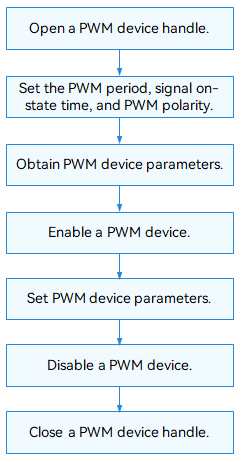

# PWM

## Overview

### Function

Pulse width modulation (PWM) is a technology that digitally encodes analog signal levels and converts them into pulses.

The PWM module provides a set of APIs for operating a PWM device, including:

- Opening or closing a PWM device
- Setting the PWM period, signal ON-state time, and polarity
- Enabling or disabling a PWM device
- Obtaining and setting PWM parameters

### Basic Concepts

A pulse (electrical pulse) is a burst of current or voltage, characterized by sudden change and discontinuity. There are many types of pulses. Common pulses include triangular, sharp, rectangular, square, trapezoidal, and zigzag pulses. Main pulse parameters include the repetition period **T** (**T** = 1/**F**, where **F** is the pulse repetition frequency), pulse amplitude **U**, rise time **ts** at the leading edge, fall time **t** at the trailing edge, and pulse width **tk**.

### Working Principles

In the Hardware Driver Foundation (HDF), the PWM uses the independent service mode (see Figure 1) for API adaptation. In this mode, each device independently publishes a service to process external access requests. When receiving an access request, the HDF DeviceManager extracts parameters from the request to call the internal APIs of the target device. In the independent service mode, the HDF DeviceManager provides service management capabilities. However, you need to configure a node for each device, which increases memory usage.

In the independent service mode, the core layer does not publish a service for the upper layer. Therefore, a service must be published for each controller. To achieve this purpose:

- You need to implement the **Bind()** function in **HdfDriverEntry** to bind services.
- The **policy** field of **deviceNode** in the **device_info.hcs** file can be **1** or **2**, but not **0**.

The PWM module is divided into the following layers:

- Interface layer: provides APIs for opening or closing a PWM device, setting the PWM period, signal ON-state time, PWM device polarity, or PWM device parameters, obtaining PWM device parameters, and enabling or disabling a PWM device
- Core layer: provides the capabilities of adding or removing a PWM controller and managing PWM devices. The core layer interacts with the adaptation layer through hook functions.
- Adaptation layer: instantiates the hook functions to implement specific features.

**Figure 1** Independent service mode


## Usage Guidelines

### When to Use

The PWM module is used for controlling vibrators and adjusting backlight brightness in smart devices.

### Available APIs

**Table 1** describes the **PwmConfig** structure, which defines the PWM device attributes. **Table 2** describes the APIs provided by the PWM module.

**Table 1** PwmConfig structure

| Parameter| Description|
| -------- | -------- |
| duty | Time that a signal is in the ON state, in ns.|
| period | Time for a signal to complete an on-and-off cycle, in ns.|
| number | Number of square waves to generate.<br>- Positive value: indicates the number of square waves to generate.<br>- **0**: indicates that square waves are generated continuously.|
| polarity | PWM signal polarity, which can be normal or reverted. <br>A signal with normal polarity starts high for the duration of the duty cycle and goes low for the remaining of the period. <br>A signal with inverted polarity starts low for the duration of the duty cycle and goes high for the remaining of the period.|
| status | PWM device status, which can be enabled or disabled.|

**Table 2** PWM driver APIs

| API                                                      |                     |
| ------------------------------------------------------------ | ------------------- |
| DevHandle PwmOpen(uint32_t num)                             | Opens a PWM device.        |
| void PwmClose(DevHandle handle)                             | Closes a PWM device.        |
| int32_t PwmSetPeriod(DevHandle handle, uint32_t period)     | Sets the PWM period.    |
| int32_t PwmSetDuty(DevHandle handle, uint32_t duty)         | Sets the signal ON-state time.|
| int32_t PwmSetPolarity(DevHandle handle, uint8_t polarity)  | Sets the PWM signal polarity.    |
| int32_t PwmEnable(DevHandle handle)                         | Enables a PWM device.        |
| int32_t PwmDisable(DevHandle handle)                        | Disables a PWM device.        |
| int32_t PwmSetConfig(DevHandle handle, struct PwmConfig *config) | Sets PWM device parameters.    |
| int32_t PwmGetConfig(DevHandle handle, struct PwmConfig *config) | Obtains PWM device parameters.    |

>  **NOTE**
>
> All the PWM APIs described in this document can be used in kernel mode and user mode.

### How to Develop

The following figure shows how to use PWM APIs.

**Figure 2** Using PWM APIs



#### Opening a PWM Device

Before performing operations on a PWM device, use **PwmOpen()** to obtain the device handle.

```c
DevHandle PwmOpen(uint32_t num);
```

**Table 3** Description of PwmOpen

| **Parameter**| **Description**|
| -------- | -------- |
| num        | PWM device number.            |
| **Return Value** | **Description**         |
| handle     | The operation is successful. The PWM device handle is returned.|
| NULL       | The operation fails.               |

Example: Open PWM device 0.

```c
uint32_t num = 0;         // PWM device number.
DevHandle handle = NULL;

handle = PwmOpen(num);    // Open PWM device 0 and obtain the device handle.
if (handle  == NULL) {
    HDF_LOGE("PwmOpen: open pwm_%u failed.\n", num);
    return;
}
```

#### Closing a PWM Device

Use **PwmClose()** to close a PWM device to release resources.

```c
void PwmClose(DevHandle handle);
```

**Table 4** Description of PwmClose

| **Parameter**| **Description**|
| -------- | -------- |
| handle   | Handle of the PWM device to close. |

```c
PwmClose(handle);    // Close the PWM device and destroy the PWM device handle.
```

#### Enabling a PWM Device

```c
int32_t PwmEnable(DevHandle handle);
```

**Table 5** Description of PwmEnable

| **Parameter**| **Description**|
| -------- | -------- |
| handle     | PWM device handle.   |
| **Return Value** | **Description**|
| HDF_SUCCESS          | The operation is successful.      |
| Negative number      | The operation fails.      |

```c
int32_t ret;

ret = PwmEnable(handle);    // Enable the PWM device.
if (ret != HDF_SUCCESS) {
    HDF_LOGE("PwmEnable: enable pwm failed, ret:%d\n", ret);
    return ret;
}
```

#### Disabling a PWM Device

```c
int32_t PwmDisable(DevHandle handle);
```

**Table 6** Description of PwmDisable

| **Parameter**| **Description**|
| -------- | -------- |
| handle     | PWM device handle.   |
| **Return Value** | **Description**|
| HDF_SUCCESS          | The operation is successful.      |
| Negative number      | The operation fails.      |

```c
int32_t ret;

ret = PwmDisable(handle);    // Disable the PWM device.
if (ret != HDF_SUCCESS) {
    HDF_LOGE("PwmDisable: disable pwm failed, ret:%d\n", ret);
    return ret;
}
```

#### Setting the PWM Period

```c
int32_t PwmSetPeriod(DevHandle handle, uint32_t period);
```

**Table 7** Description of PwmSetPeriod

| **Parameter**| **Description**|
| -------- | -------- |
| handle     | PWM device handle.             |
| period     | PWM period to set, in ns.|
| **Return Value**| **Description**          |
| HDF_SUCCESS          | The operation is successful.                |
| Negative number      | The operation fails.                |

```c
int32_t ret;

ret = PwmSetPeriod(handle, 50000000);    // Set the PWM period to 50,000,000 ns.
if (ret != HDF_SUCCESS) {
    HDF_LOGE("PwmSetPeriod: pwm set period failed, ret:%d\n", ret);
    return ret;
}
```

#### Setting the Signal ON-State Time

```c
int32_t PwmSetDuty(DevHandle handle, uint32_t duty);
```

**Table 8** Description of PwmSetDuty

| **Parameter**| **Description**|
| -------- | -------- |
| handle     | PWM device handle.                 |
| duty       | Time that a signal is in the ON state, in ns.|
| **Return Value**| **Description**              |
| HDF_SUCCESS          | The operation is successful.                    |
| Negative number      | The operation fails.                    |


```c
int32_t ret;

ret = PwmSetDuty(handle, 25000000);    // Set the signal ON-state time to 25,000,000 ns.
if (ret != HDF_SUCCESS) {
    HDF_LOGE("PwmSetDuty: pwm set duty failed, ret:%d\n", ret);
    return ret;
}
```

#### Setting the PWM Signal Polarity

```c
int32_t PwmSetPolarity(DevHandle handle, uint8_t polarity);
```

**Table 9** Description of PwmSetPolarity

| **Parameter**| **Description**|
| -------- | -------- |
| handle     | PWM device handle.        |
| polarity   | Polarity to set, which can be **PWM\_NORMAL\_POLARITY** or **PWM\_INVERTED\_POLARITY**.|
| **Return Value**| **Description**     |
| HDF_SUCCESS          | The operation is successful.           |
| Negative number      | The operation fails.           |


```c
int32_t ret;

ret = PwmSetPolarity(handle, PWM_INVERTED_POLARITY);    // Set the PWM signal polarity to inverted.
if (ret != HDF_SUCCESS) {
    HDF_LOGE("PwmSetPolarity: pwm set polarity failed, ret:%d\n", ret);
    return ret;
}
```

#### Setting PWM Device Parameters

```c
int32_t PwmSetConfig(DevHandle handle, struct PwmConfig *config);
```

**Table 10** Description of PwmSetConfig

| **Parameter**| **Description**|
| -------- | -------- |
| handle     | PWM device handle.   |
| \*config   | Pointer to the PWM parameters to set.      |
| **Return Value**| **Description**|
| HDF_SUCCESS          | The operation is successful.      |
| Negative number      | The operation fails.      |

```c
int32_t ret;
struct PwmConfig pcfg;

The pcfg.duty = 25000000;               // Set the signal ON-state time to 25,000,000 ns.
pcfg.period = 50000000;                 // Set the PWM period to 50,000,000 ns.
pcfg.number = 0;                        // Generate square waves continuously.
pcfg.polarity = PWM_INVERTED_POLARITY;  // Set the PWM signal polarity to inverted.
pcfg.status = PWM_ENABLE_STATUS;        // Enable PWM.

ret = PwmSetConfig(handle, &pcfg);      // Set PWM device parameters.
if (ret != HDF_SUCCESS) {
    HDF_LOGE("PwmSetConfig: pwm set config failed, ret:%d\n", ret);
    return ret;
}
```

#### Obtaining PWM Device Parameters

```c
int32_t PwmGetConfig(DevHandle handle, struct PwmConfig *config);
```

**Table 11** Description of PwmGetConfig

| **Parameter**| **Description**|
| -------- | -------- |
| handle     | PWM device handle.   |
| \*config   | Pointer to the PWM parameters obtained.      |
| **Return Value**| **Description**|
| HDF_SUCCESS          | The operation is successful.      |
| Negative number      | The operation fails.      |

```c
int32_t ret;
struct PwmConfig pcfg;

ret = PwmGetConfig(handle, &pcfg);    // Obtain PWM device parameters.
if (ret != HDF_SUCCESS) {
    HDF_LOGE("PwmGetConfig: pwm get config failed, ret:%d\n", ret);
    return ret;
}
```

## Example

The following uses the Hi3516D V300 development board as an example to describe how to use the PWM. The procedure is as follows: 

1. Open a PWM device and obtain the PWM device handle.
2. Set the PWM device period.
3. Set the signal ON-state time for the PWM device.
4. Set the signal polarity for the PWM device.
5. Obtain the PWM device parameters.
6. Enable the PWM device.
7. Set the PWM device parameters.
8. Disable the PWM device.
9. Close the PWM device.

```c
#include "pwm_if.h"                                              // Header file of PWM standard APIs.
#include "hdf_log.h"                                             // Header file of the HDF log APIs.

static int32_t PwmTestSample(void)
{
    int32_t ret;
    uint32_t num;
    uint32_t period
    DevHandle handle = NULL;

    struct PwmConfig pcfg;
    pcfg.duty = 20000000;                                        // Set the signal ON-state time to 20,000,000 ns.                 
    pcfg.period = 40000000;                                      // Set the PWM period to 40,000,000 ns.
    pcfg.number = 100;                                           // Generate 100 square waves continuously.
    pcfg.polarity = PWM_NORMAL_POLARITY;                         // Set the PWM signal polarity to normal.
    pcfg.status = PWM_ENABLE_STATUS;                             // Enable the PWM device.

    num = 1;                                                     // PWM device number.

    handle = PwmOpen(num);                                       // Open a PWM device.
    if (handle == NULL) {
        HDF_LOGE("PwmOpen: open pwm_%u failed!\n", num);
        return;
    }

    ret = PwmSetPeriod(handle, 50000000);                        // Set the PWM period to 50,000,000 ns.
    if (ret != HDF_SUCCESS) {
        HDF_LOGE("PwmSetPeriod: pwm set period failed, ret %d\n", ret);
        goto ERR;
    }

    ret = PwmSetDuty(handle, 25000000);                          // Set the signal ON-state time to 25,000,000 ns.
    if (ret != HDF_SUCCESS) {
        HDF_LOGE("PwmSetDuty: pwm set duty failed, ret %d\n", ret);
        goto ERR;
    }

    ret = PwmSetPolarity(handle, PWM_INVERTED_POLARITY);         // Set the PWM signal polarity to inverted.
    if (ret != HDF_SUCCESS) {
        HDF_LOGE("PwmSetPolarity: pwm set polarity failed, ret %d\n", ret);
        goto ERR;
    }

    ret = PwmGetConfig(handle, &pcfg);                           // Obtain PWM device parameters.
    if (ret != HDF_SUCCESS) {
        HDF_LOGE("PwmGetConfig: get pwm config failed, ret %d\n", ret);
        goto ERR;
    }

    ret = PwmEnable(handle);                                     // Enable the PWM device.
    if (ret != HDF_SUCCESS) {
        HDF_LOGE("PwmEnable: enable pwm failed, ret %d\n", ret);
        goto ERR;
    }

    ret = PwmSetConfig(handle, &pcfg);                           // Set PWM device parameters.
    if (ret != HDF_SUCCESS) {
        HDF_LOGE("PwmSetConfig: set pwm config failed, ret %d\n", ret);
        goto ERR;
    }

    ret = PwmDisable(handle);                                    // Disable the PWM device.
    if (ret != HDF_SUCCESS) {
        HDF_LOGE("PwmDisable: disable pwm failed, ret %d\n", ret);
        goto ERR;
    }

ERR:
    PwmClose(handle);                                            // Close the PWM device.
    return ret;
}
```
