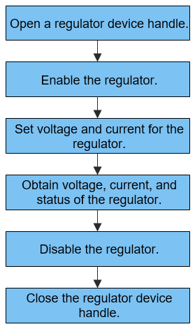

# Regulator<a name="title_REGULATOR_des"></a>

## Overview<a name="section1_REGULATOR_des"></a>

The regulator module controls the voltage and current supplies of some devices in the system. In an embedded system (especially a mobile phone), it is important to control the power consumption, which directly affects the battery endurance. You can use a regulator to shut down the power supply to an idle module in the system or reduce the voltage and current for the module.

- The regulator APIs provide a set of functions for managing a regulator, including those for:
  - Opening or closing a regulator device handle
  - Setting the output voltage and current for a regulator
  - Enabling or disabling a regulator
  - Obtaining the voltage, current, and status of a regulator

## Available APIs<a name="section2_REGULATOR_des"></a>

**Table 1** Regulator APIs

<a name="table1_REGULATOR_des"></a>

<table border="0" cellpadding="0" cellspacing="0" width="600" style="border-collapse:
 collapse;table-layout:fixed;width:855pt">
 <colgroup><col width="183" style="mso-width-source:userset;mso-width-alt:5856;width:137pt">
 <col width="159" style="mso-width-source:userset;mso-width-alt:5088;width:119pt">
 <col width="213" style="mso-width-source:userset;mso-width-alt:6816;width:160pt">
 </colgroup><tbody><tr height="19" style="height:14.25pt">
  <td height="19" width="183" style="height:14.25pt;width:137pt">Category</td>
  <td width="159" style="width:119pt">API</td>
  <td width="213" style="width:160pt">Description</td>
 </tr>
 <tr height="19" style="height:14.25pt">
  <td rowspan="2" height="38" class="xl65" style="height:28.5pt">Operating a regulator device handle</td>
  <td>RegulatorOpen</td>
  <td>Opens a regulator device handle.</td>
 </tr>
 <tr height="19" style="height:14.25pt">
  <td height="19" style="height:14.25pt">RegulatorClose</td>
  <td>Closes a regulator device handle.</td>
 </tr>
 <tr height="19" style="height:14.25pt">
  <td rowspan="3" height="57" class="xl65" style="height:42.75pt">Enabling or disable a regulator</td>
  <td>RegulatorEnable</td>
  <td>Enables a regulator.</td>
 </tr>
 <tr height="19" style="height:14.25pt">
  <td height="19" style="height:14.25pt">RegulatorDisable</td>
  <td>Disables a regulator.</td>
 </tr>
 <tr height="19" style="height:14.25pt">
  <td height="19" style="height:14.25pt">RegulatorForceDisable</td>
  <td>Forcibly disables a regulator.</td>
 </tr>
 <tr height="19" style="height:14.25pt">
  <td rowspan="2" height="38" class="xl65" style="height:28.5pt">Setting or obtaining the output voltage</td>
  <td>RegulatorSetVoltage</td>
  <td>Sets the output voltage for a regulator.</td>
 </tr>
 <tr height="19" style="height:14.25pt">
  <td height="19" style="height:14.25pt">RegulatorGetVoltage</td>
  <td>Obtains the output voltage of a regulator.</td>
 </tr>
 <tr height="19" style="height:14.25pt">
  <td rowspan="2" height="38" class="xl65" style="height:28.5pt">Setting or obtaining the output current</td>
  <td>RegulatorSetCurrent</td>
  <td>Sets the output current for a regulator.</td>
 </tr>
 <tr height="19" style="height:14.25pt">
  <td height="19" style="height:14.25pt">RegulatorGetCurrent</td>
  <td>Obtains the output current of a regulator.</td>
 </tr>
 <tr height="19" style="height:14.25pt">
  <td height="19" class="xl66" style="height:14.25pt">Querying the regulator status</td>
  <td>RegulatorGetStatus</td>
  <td>Obtains the regulator status.</td>
 </tr>
 <!--[if supportMisalignedColumns]-->
 <tr height="0" style="display:none">
  <td width="183" style="width:137pt"></td>
  <td width="159" style="width:119pt"></td>
  <td width="213" style="width:160pt"></td>
 </tr>
 <!--[endif]-->
</tbody></table>

> **NOTE**
>The regulator module can be used in kernel mode but not in user mode.

## Usage Guidelines<a name="section3_REGULATOR_des"></a>

### How to Use<a name="section3.1_REGULATOR_des"></a>

During the OS startup process, the driver management module loads the regulator driver based on the configuration file. Then, the regulator driver detects the regulator devices and initializes the driver.

The figure below shows the process of using a regulator.

**Figure 1** Process of using a regulator<a name="fig1_regulator_des"></a> 




### Opening a Regulator Device Handle<a name="section3.2_REGULATOR_des"></a>

Before operating a regulator, call **RegulatorOpen** to open the device handle of the regulator. This function returns the device handle of the regulator.

```c
DevHandle RegulatorOpen(const char *name);
```

**Table 2** Description of RegulatorOpen

<a name="table2_REGULATOR_des"></a>

| **Parameter**      | **Description**                     |
| ---------- | ----------------------------- |
| name       | Name of the target regulator.            |
| **Return Value**| **Description**               |
| handle     | The regulator device handle is returned if the operation is successful.|
| NULL       | The operation fails.                     |


```c
/* Regulator name. */
const char *name = "regulator_virtual_1";
DevHandle handle = NULL;

/* Open the regulator device handle. */
handle = RegulatorOpen(name);
if (handle  == NULL) {
    /* Error handling. */
}
```

### Closing a Regulator Device Handle<a name="section3.3_REGULATOR_des"></a>

Call **RegulatorClose** to close the regulator device handle to release resources.

```c
void RegulatorClose(DevHandle handle);
```

**Table 3** Description of RegulatorClose

<a name="table3_REGULATOR_des"></a>

| **Parameter**  | **Description**         |
| ------ | ----------------- |
| handle | Regulator device handle to close.|


```c
/* Close the regulator device handle. */
RegulatorClose(handle);
```

### Enabling a Regulator<a name="section3.4_REGULATOR_des"></a>

Call **RegulatorEnable** to enable a regulator.

```c
int32_t RegulatorEnable(DevHandle handle);
```

**Table 4** Description of RegulatorEnable

<a name="table4_REGULATOR_des"></a>

| **Parameter**      | **Description**         |
| ---------- | ----------------- |
| handle     | Device handle of the regulator to enable.|
| **Return Value**| **Description**   |
| 0          | The operation is successful.         |
| Negative value      | The operation fails.         |

```c
int32_t ret;

/* Enable the regulator. */
ret = RegulatorEnable(handle);
if (ret != 0) {
	/* Error handling. */
}
```

### Disabling a Regulator<a name="section3.5_REGULATOR_des"></a>

Call **RegulatorDisable** to disable a regulator. The operation will fail if the regulator status is set to always on or if a child node of the regulator is not disabled.

```c
int32_t RegulatorDisable(DevHandle handle);
```

**Table 5** Description of RegulatorDisable

<a name="table5_REGULATOR_des"></a>

| **Parameter**      | **Description**         |
| ---------- | ----------------- |
| handle     | Device handle of the regulator to disable.|
| **Return Value**| **Description**   |
| 0          | The operation is successful.         |
| Negative value      | The operation fails.         |

```c
int32_t ret;

/* Disable the regulator. */
ret = RegulatorDisable(handle);
if (ret != 0) {
	/* Error handling. */
}
```

### Forcibly Disabling a Regulator<a name="section3.6_REGULATOR_des"></a>

Call **RegulatorForceDisable** to forcibly disable a regulator. The regulator will be disabled event if its status is set to always on or its child node is still enabled.

```c
int32_t RegulatorForceDisable(DevHandle handle);
```

**Table 6** Description of RegulatorForceDisable

<a name="table6_REGULATOR_des"></a>

| **Parameter**      | **Description**         |
| ---------- | ----------------- |
| handle     | Device handle of the target regulator.|
| **Return Value**| **Description**   |
| 0          | The operation is successful.     |
| Negative value      | The operation fails.     |

```c
int32_t ret;

/* Forcibly disable the regulator. */
ret = RegulatorForceDisable(handle);
if (ret != 0) {
	/* Error handling. */
}
```
### Setting the Output Voltage Range for a Regulator<a name="section3.7_REGULATOR_des"></a>

Call **RegulatorSetVoltage** to set the output voltage range for a regulator.

```c
int32_t RegulatorSetVoltage(DevHandle handle, uint32_t minUv, uint32_t maxUv);
```

**Table 7** Description of RegulatorSetVoltage

<a name="table7_REGULATOR_des"></a>

| **Parameter**      | **Description**         |
| ---------- | ----------------- |
| handle     | Device handle of the target regulator.|
| minUv      | Minimum voltage to set.         |
| maxUv      | Maximum voltage to set.         |
| **Return Value**| **Description**   |
| 0          | The operation is successful.         |
| Negative value      | The operation fails.         |

```c
int32_t ret;
int32_t minUv = 0;		// Set the minimum voltage to 0 µV.
int32_t maxUv = 20000; // Set the maximum voltage to 20000 µV.

/* Set the output voltage range for the regulator. */
ret = RegulatorSetVoltage(handle, minUv, maxUv);
if (ret != 0) {
	/* Error handling. */
}
```
### Obtaining Regulator Voltage Information<a name="section3.8_REGULATOR_des"></a>

Call **RegulatorGetVoltage** to obtain voltage information of a regulator.

```c
int32_t RegulatorGetVoltage(DevHandle handle, uint32_t *voltage);
```

**Table 8** Description of RegulatorGetVoltage

<a name="table8_REGULATOR_des"></a>

| **Parameter**      | **Description**         |
| ---------- | ----------------- |
| handle     | Device handle of the target regulator.|
| *voltage   | Pointer to the regulator voltage information.         |
| **Return Value**| **Description**   |
| 0          | The operation is successful.         |
| Negative value      | The operation fails.         |

```c
int32_t ret;
uint32_t voltage;

/* Obtain the regulator voltage information. */
ret = RegulatorGetVoltage(handle, &voltage);
if (ret != 0) {
	/* Error handling. */
}
```


### Setting the Output Current Range for a Regulator<a name="section3.9_REGULATOR_des"></a>

Call **RegulatorSetCurrent** to set the output current range for a regulator.

```c
int32_t RegulatorSetCurrent(DevHandle handle, uint32_t minUa, uint32_t maxUa);
```

**Table 9** Description of RegulatorSetCurrent

<a name="table9_REGULATOR_des"></a>

| **Parameter**      | **Description**         |
| ---------- | ----------------- |
| handle     | Device handle of the target regulator.|
| minUa      | Minimum current to set.         |
| maxUa      | Maximum current to set.         |
| **Return Value**| **Description**   |
| 0          | The operation is successful.         |
| Negative value      | The operation fails.         |

```c
int32_t ret;
int32_t minUa = 0;		// Set the minimum current to 0 μA.
int32_t maxUa = 200; // Set the maximum current to 200 μA.

/* Set the output current range for the regulator. */
ret = RegulatorSetCurrent(handle, minUa, maxUa);
if (ret != 0) {
	/* Error handling. */
}
```

### Obtaining Regulator Current Information<a name="section3.10_REGULATOR_des"></a>

Call **RegulatorGetCurrent** to obtain current information of a regulator.

```c
int32_t RegulatorGetCurrent(DevHandle handle, uint32_t *regCurrent);
```

**Table 10** Description of RegulatorGetCurrent

<a name="table10_REGULATOR_des"></a>

| **Parameter**       | **Description**         |
| ----------- | ----------------- |
| handle      | Device handle of the target regulator.|
| *regCurrent | Pointer to the regulator current information.         |
| **Return Value** | **Description**   |
| 0           | The operation is successful.         |
| Negative value       | The operation fails.         |

```c
int32_t ret;
uint32_t regCurrent;

/* Obtain the regulator current information. */
ret = RegulatorGetCurrent(handle, &regCurrent);
if (ret != 0) {
	/* Error handling. */
}
```
### Obtaining Regulator Status<a name="section3.11_REGULATOR_des"></a>

Call **RegulatorGetStatus** to obtain the regulator status.

```c
int32_t RegulatorGetStatus(DevHandle handle, uint32_t *status);
```

**Table 11** Description of RegulatorGetStatus

<a name="table11_REGULATOR_des"></a>

| **Parameter**      | **Description**         |
| ---------- | ----------------- |
| handle     | Device handle of the target regulator.|
| *status    | Pointer to the regulator status information.         |
| **Return Value**| **Description**   |
| 0          | The operation is successful.         |
| Negative value      | The operation fails.         |

```c
int32_t ret;
uint32_t status;

/* Obtain the regulator status. */
ret = RegulatorGetStatus(handle, &status);
if (ret != 0) {
	/* Error handling. */
}
```

## Development Example<a name="section4_REGULATOR_des"></a>

The following is an example of using a regulator.

```c
void RegulatorTestSample(void)
{
    int32_t ret;
     
    /* Regulator name. */
	const char *name = "regulator_virtual_1";
	DevHandle handle = NULL;

	/* Open the regulator device handle. */
	handle = RegulatorOpen(name);
	if (handle  == NULL) {
    	HDF_LOGE("RegulatorOpen: failed!\n");
        return;
	}

	/* Enable the regulator. */
	ret = RegulatorEnable(handle);
	if (ret != 0) {
		HDF_LOGE("RegulatorEnable: failed, ret %d\n", ret);
        goto _ERR;
	}
    
    int32_t minUv = 0;		// Set the minimum voltage to 0 µV.
	int32_t maxUv = 20000; // Set the maximum voltage to 20000 µV.

	/* Set the output voltage range for the regulator. */
	ret = RegulatorSetVoltage(handle, minUv, maxUv);
	if (ret != 0) {
		HDF_LOGE("RegulatorSetVoltage: failed, ret %d\n", ret);
        goto _ERR;
	}
    
    uint32_t voltage;

    /* Obtain the regulator voltage information. */
    ret = RegulatorGetVoltage(handle, &voltage);
    if (ret != 0) {
        HDF_LOGE("RegulatorGetVoltage: failed, ret %d\n", ret);
        goto _ERR;
    }
    
    uint32_t status;

    /* Obtain the regulator status. */
    ret = RegulatorGetStatus(handle, &status);
    if (ret != 0) {
        HDF_LOGE("RegulatorGetStatus: failed, ret %d\n", ret);
        goto _ERR;
    }

   /* Disable the regulator. */
    ret = RegulatorDisable(handle);
    if (ret != 0) {
        HDF_LOGE("RegulatorDisable: failed, ret %d\n", ret);
        goto _ERR;
    }
    
_ERR:
    /* Close the regulator device handle. */
    RegulatorClose(handle); 
}
```
