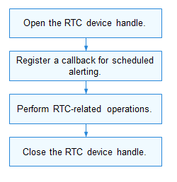

# RTC


## Overview

The real-time clock (RTC) provides precise real time for the operating system (OS) and scheduled alarming function. When the device is powered off, the RTC can accurately keep track of the system time using an auxiliary battery. The RTC regulates time with the use of a crystal oscillator.


## Available APIs

  **Table 1** RTC APIs

| Category| Description|
| -------- | -------- |
| RTC handle| **RtcOpen**: opens the RTC device to obtain its handle.<br>**RtcClose**: closes the RTC device handle.|
| RTC time| **RtcReadTime**: reads the RTC time information, which includes the year, month, day, day of week, hour, minute, second, and millisecond.<br>**RtcWriteTime**: writes the RTC time, including the year, month, day, day of week, hour, minute, second, and millisecond.|
| RTC alarm| **RtcReadAlarm**: reads the RTC alarm time.<br>**RtcWriteAlarm**: writes the RTC alarm time.<br>**RtcRegisterAlarmCallback**: registers a callback to be invoked when an alarm is not generated at the specified time.<br>**RtcAlarmInterruptEnable**: enables or disables interrupts for an RTC alarm.|
| RTC configuration| **RtcGetFreq**: obtains the frequency of the external crystal oscillator connected to the RTC driver.<br>**RtcSetFreq**: sets the frequency of the external crystal oscillator connected to the RTC driver.<br>**RtcReset**: resets the RTC.|
| Custom register| **RtcReadReg**: reads a custom register.<br>**RtcWriteReg**: writes a custom register.|

>  **NOTE**<br>
> All APIs described in this document can be called only in kernel mode.


## Usage Guidelines


### How to Use

During the OS startup, the HDF loads the RTC driver based on the configuration file. The RTC driver detects the RTC device and initializes the driver.

The figure below illustrates the general development process of an RTC device.

  **Figure 1** Using the RTC APIs

  


### Opening the RTC Device Handle

After the RTC driver is loaded, the API provided by the HDF is called to invoke the APIs of the RTC driver.

>  **NOTE**<br>
> Only one RTC device is supported in the OS.

```c
DevHandle RtcOpen(void);
```

  **Table 2** Description of RtcOpen

| **Parameter**| **Description**|
| -------- | -------- |
| void | NA |
| **Return Value**| **Description**|
| handle | The operation is successful.|
| NULL | The operation failed.|


```
DevHandle  handle = NULL;

/* Open the RTC device handle. */
handle = RtcOpen();
if (handle  == NULL) {
    /* Error handling. */
}
```


### Closing the RTC Device Handle

Call **RtcClose()** to release the resources used by the RTC device.

```c
void RtcClose(DevHandle handle);
```

  **Table 3** Description of RtcClose

| **Parameter**| **Description**|
| -------- | -------- |
| handle | RTC device handle to close.|


```
/* Close the RTC device handle. */
RtcClose(handle);
```


### Registering an Alarm Callback

Call **RtcRegisterAlarmCallback** to register a callback, which will be invoked when the specified alarm is not generated at the specified time.

```c
int32_t RtcRegisterAlarmCallback(DevHandle handle, enum RtcAlarmIndex alarmIndex, RtcAlarmCallback cb);
```

  **Table 4** Description of RtcRegisterAlarmCallback

| **Parameter**| **Description**| 
| -------- | -------- |
| handle | RTC device handle.| 
| alarmIndex | Alarm index.| 
| cb | Callback to be invoked when the alarm is not generated at the specified time.| 
| **Return Value**| **Description**| 
| 0 | The operation is successful.| 
| Negative value| The operation failed.| 

  The following is an example of registering a callback for processing alarm RTC_ALARM_INDEX_A:

```
/* Register a callback for alarm RTC_ALARM_INDEX_A. */
int32_t RtcAlarmACallback(enum RtcAlarmIndex alarmIndex)
{
    if (alarmIndex == RTC_ALARM_INDEX_A) {
        /* Processing of alarm A. */
    } else if (alarmIndex == RTC_ALARM_INDEX_B) {
        /* Processing of alarm B. */
    } else {
        /* Error handling. */
    }
    return 0;
}
int32_t ret;
/* Register a callback to be invoked when alarm A is not generated at the specified time. */
ret = RtcRegisterAlarmCallback(handle, RTC_ALARM_INDEX_A, RtcAlarmACallback);
if (ret != 0) {
    /* Error handling. */
}
```


### Performing RTC-related Operations

- Reading the RTC time

Call **RtcReadTime()** to obtain the RTC time, which includes the year, month, day, day of week, hour, minute, second, and millisecond.

```c
int32_t RtcReadTime(DevHandle handle, struct RtcTime *time);
```

  **Table 5** Description of RtcReadTime

| **Parameter**| **Description**|
| -------- | -------- |
| handle     | RTC device handle.                                            |
| time       | RTC time information, which includes the year, month, day, day of the week, hour, minute, second, and millisecond.|
| **Return Value**| **Description**                                         |
| 0          | The operation is successful.                                               |
| Negative value      | The operation failed.                                               |


```
int32_t ret;
struct RtcTime tm;

/* Read RTC time from the RTC driver. */
ret = RtcReadTime(handle, &tm);
if (ret != 0) {
    /* Error handling. */
}
```

- Setting the RTC time

Call **RtcWriteTime()** to set the RTC time.

```c
int32_t RtcWriteTime(DevHandle handle, struct RtcTime *time);
```

  **Table 6** Description of RtcWriteTime

| **Parameter**| **Description**|
| -------- | -------- |
| handle | RTC device handle.|
| time | RTC time to set, which includes the year, month, day, day of the week, hour, minute, second, and millisecond.|
| **Return Value**| **Description**|
| 0 | The operation is successful.|
| Negative value| The operation failed.|

>  **NOTE**<br>
> The RTC start time is 1970/01/01 Thursday 00:00:00 (UTC). The maximum value of **year** must be set based on the requirements specified in the manual of the device you use. You do not need to set the day of week.


```
int32_t ret;
struct RtcTime tm;

/* Set the RTC time to UTC 2020/01/01 00:59:00 .000. */
tm.year = 2020;
tm.month = 01;
tm.day = 01;
tm.hour= 00;
tm.minute = 59;
tm.second = 00;
tm.millisecond = 0;
/* Write the RTC time. */
ret = RtcWriteTime(handle, &tm);
if (ret != 0) {
    /* Error handling. */
}
```

- Reading the RTC alarm time

Call **RtcReadAlarm()** to obtain the RTC alarm time.

```c
int32_t RtcReadAlarm(DevHandle handle, enum RtcAlarmIndex alarmIndex, struct RtcTime *time);
```

  **Table 7** Description of RtcReadAlarm

| **Parameter**| **Description**|
| -------- | -------- |
| handle | RTC device handle.|
| alarmIndex | Alarm index.|
| time | RTC alarm time information, which includes the year, month, day, day of the week, hour, minute, second, and millisecond.|
| **Return Value**| **Description**|
| 0 | The operation is successful.|
| Negative value      | The operation failed.|


```
int32_t ret;
struct RtcTime alarmTime;

/* Read the RTC alarm time of alarm RTC_ALARM_INDEX_A. */
ret = RtcReadAlarm(handle, RTC_ALARM_INDEX_A, &alarmTime);
if (ret != 0) {
    /* Error handling. */
}
```

- Setting the RTC alarm time

Call **RtcWriteAlarm()** to set the RTC alarm time based on the alarm index.

```c
int32_t RtcWriteAlarm(DevHandle handle, enum RtcAlarmIndex  alarmIndex, struct RtcTime *time);
```

  **Table 8** Description of RtcWriteAlarm

| **Parameter**| **Description**|
| -------- | -------- |
| handle | RTC device handle.|
| alarmIndex | Alarm index.|
| time | RTC alarm time to set, which includes the year, month, day, day of the week, hour, minute, second, and millisecond.|
| **Return Value**| **Description**|
| 0 | The operation is successful.|
| Negative value| The operation failed.|

>  **NOTE**<br>
> The RTC start time is 1970/01/01 Thursday 00:00:00 (UTC). The maximum value of **year** must be set based on the requirements specified in the manual of the device you use. You do not need to set the day of week.


```
int32_t ret;
struct RtcTime alarmTime;

/* Set the RTC alarm time to 2020/01/01 00:59:59 .000. */
alarmTime.year = 2020;
alarmTime.month = 01;
alarmTime.day = 01;
alarmTime.hour = 00;
alarmTime.minute = 59;
alarmTime.second = 59;
alarmTime.millisecond = 0;
/* Set the alarm time of alarm RTC_ALARM_INDEX_A. */
ret = RtcWriteAlarm(handle, RTC_ALARM_INDEX_A, &alarmTime);
if (ret != 0) {
    /* Error handling. */
}
```

- Enabling or disabling alarm interrupts

Call **RtcAlarmInterruptEnable** to enable interrupts for an RTC alarm so that the registered callback can be invoked when the alarm is not generated at the specified time.

```c
int32_t RtcAlarmInterruptEnable(DevHandle handle, enum RtcAlarmIndex alarmIndex, uint8_t enable);
```

  **Table 9** Description of RtcAlarmInterruptEnable

| **Parameter**| **Description**|
| -------- | -------- |
| handle     | RTC device handle.|
| alarmIndex | Alarm index.|
| enable     | Whether to enable RTC alarm interrupts. The value **1** means to enable interrupts and **0** means to disable interrupts.|
| **Return Value**| **Description**|
| 0 | The operation is successful.|
| Negative value| The operation failed.|


```
int32_t ret;

/* Enable interrupts for an RTC alarm. */
ret = RtcAlarmInterruptEnable(handle, RTC_ALARM_INDEX_A, 1);
if (ret != 0) {
    /* Error handling. */
}
```

- Obtaining the RTC external frequency

Call **RtcGetFreq()** to obtain the frequency of the external crystal oscillator connected to the RTC driver.

```c
int32_t RtcGetFreq(DevHandle handle, uint32_t *freq);
```

  **Table 10** Description of RtcGetFreq

| **Parameter**| **Description**|
| -------- | -------- |
| handle | RTC device handle.|
| freq | Pointer to the frequency of the external crystal oscillator, in Hz.|
| **Return Value**| **Description**|
| 0 | The operation is successful.|
| Negative value| The operation failed.|


```
int32_t ret;
uint32_t freq = 0;

/* Obtain the frequency of the external crystal oscillator connected to the RTC driver. */
ret = RtcGetFreq(handle, &freq);
if (ret != 0) {
    /* Error handling. */
}
```

- Setting the RTC external frequency

Call **RtcSetFreq()** to set the frequency of the external crystal oscillator connected to the RTC driver.

```c
int32_t RtcSetFreq(DevHandle handle, uint32_t freq);
```

  **Table 11** Description of RtcSetFreq

| **Parameter**| **Description**|
| -------- | -------- |
| handle | RTC device handle.|
| freq | Pointer to the frequency to set for the external crystal oscillator, in Hz.|
| **Return Value**| **Description**|
| 0 | The operation is successful.|
| Negative value| The operation failed.|


```
int32_t ret;
uint32_t freq = 32768; /* 32768 Hz */

/* Set the frequency of the external crystal oscillator based on the requirements specified in the manual of the device you use. */
ret = RtcSetFreq(handle, freq);
if (ret != 0) {
    /* Error handling. */
}
```

- Resetting the RTC

Call **RtcReset()** to reset the RTC. After the reset, the registers are restored to default values.

```c
int32_t RtcReset(DevHandle handle);
```

  **Table 12** Description of RtcReset

| **Parameter**| **Description**|
| -------- | -------- |
| handle     | RTC device handle.|
| **Return Value**| **Description**|
| 0 | The operation is successful.|
| Negative value| The operation failed.|


```
int32_t ret;

/* Reset the RTC to restore default values of registers. */
ret = RtcReset(handle);
if (ret != 0) {
    /* Error handling. */
}
```

- Reading a custom RTC register

Call **RtcReadReg()** to read the configuration of a custom RTC register based on the register index. One index corresponds to one byte of the register value.

```c
int32_t RtcReadReg(DevHandle handle, uint8_t usrDefIndex, uint8_t *value);
```

  **Table 13** Description of RtcReadReg

| **Parameter**| **Description**|
| -------- | -------- |
| handle      | RTC device handle.|
| usrDefIndex | Index of the custom register.|
| value       | Register value.|
| **Return Value** | **Description**|
| 0 | The operation is successful.|
| Negative value| The operation failed.|


```
int32_t ret;
uint8_t usrDefIndex = 0; /* Define index 0 for the first custom register. */
uint8_t value = 0;

/* Read the value of custom RTC register 0. One index corresponds to one byte of the register value. */
ret = RtcReadReg(handle, usrDefIndex, &value);
if (ret != 0) {
    /* Error handling. */
}
```

- Setting a custom RTC register

Call **RtcWriteReg()** to set a register based on the specified register index. One index corresponds to one byte of the register value.

```c
int32_t RtcWriteReg(DevHandle handle, uint8_t usrDefIndex, uint8_t value);
```

  **Table 14** Description of RtcWriteReg

| **Parameter**| **Description**|
| -------- | -------- |
| handle | RTC device handle.|
| usrDefIndex | Index of the custom register.|
| value | Register value.|
| **Return Value** | **Description**|
| 0 | The operation is successful.|
| Negative value| The operation failed.|


```
int32_t ret;
uint8_t usrDefIndex = 0; /* Define index 0 for the first custom register. */
uint8_t value = 0x10;

/* Set a value for register 0. One index corresponds to one byte of the configuration value. */
ret = RtcWriteReg(handle, usrDefIndex, value);
if (ret != 0) {
    /* Error handling. */
}
```


## Example

The procedure is as follows:

1. During the OS startup, the HDF identifies the RTC device in the system.

2. The HDF initializes and creates the RTC device.

3. Call APIs to perform operations on the RTC device.

4. Close the RTC device handle to release resources.

The sample code is as follows:


```
#include "rtc_if.h"
int32_t RtcAlarmACallback(enum RtcAlarmIndex alarmIndex)
{
    if (alarmIndex == RTC_ALARM_INDEX_A) {
        /* Processing of alarm A. */
        printf("RTC Alarm A callback function\n\r");
    } else if (alarmIndex == RTC_ALARM_INDEX_B) {
        /* Processing of alarm B. */
        printf("RTC Alarm B callback function\n\r");
    } else {
        /* Error handling. */
    }
    return 0;
}

void RtcTestSample(void)
{
    int32_t ret;
    struct RtcTime tm;
    struct RtcTime alarmTime;
    uint32_t freq;
    DevHandle handle = NULL;

    /* Open the RTC device handle. */
    handle = RtcOpen();
    if (handle == NULL) {
        /* Error handling. */
    }
    /* Register a callback for alarm A if it is not generated at the specified time. */
    ret = RtcRegisterAlarmCallback(handle, RTC_ALARM_INDEX_A, RtcAlarmACallback);
    if (ret != 0) {
        /* Error handling. */
    }
    /* Set the frequency of the external crystal oscillator based on the requirements specified in the manual of the device you use. */
    freq = 32768; /* 32768 Hz */
    ret = RtcSetFreq(handle, freq);
    if (ret != 0) {
        /* Error handling. */
    }
    /* Enable interrupts for RTC alarm A. */
    ret = RtcAlarmInterruptEnable(handle, RTC_ALARM_INDEX_A, 1);
    if (ret != 0) {
        /* Error handling. */
    }
    /* Set the RTC time to 2020/01/01 00:00:10 .990. */
    tm.year = 2020;
    tm.month = 01;
    tm.day = 01;
    tm.hour= 0;
    tm.minute = 0;
    tm.second = 10;
    tm.millisecond = 990;
    /* Write the RTC time. */
    ret = RtcWriteTime(handle, &tm);
    if (ret != 0) {
        /* Error handling. */
    }
    /* Set the RTC alarm time to 2020/01/01 00:00:30 .100. */
    alarmTime.year = 2020;
    alarmTime.month = 01;
    alarmTime.day = 01;
    alarmTime.hour = 0;
    alarmTime.minute = 0;
    alarmTime.second = 30;
    alarmTime.millisecond = 100;
    /* Set the alarm time for RTC_ALARM_INDEX_A. When the specified time is reached, "RTC Alarm A callback function" will be printed. */
    ret = RtcWriteAlarm(handle, RTC_ALARM_INDEX_A, &alarmTime);
    if (ret != 0) {
        /* Error handling. */
    }

    /* Read the RTC time. */
    ret = RtcReadTime(handle, &tm);
    if (ret != 0) {
        /* Error handling. */
    }
    sleep(5)
    printf("RTC read time:\n\r");
    printf("year-month-date-weekday hour:minute:second .millisecond %04u-%02u-%02u-%u %02u:%02u:%02u .%03u",
        tm.year, tm.month, tm.day, tm.weekday, tm.hour, tm.minute, tm.second, tm.millisecond);
    /* Close the RTC device handle. */
    RtcClose(handle);
}
```
