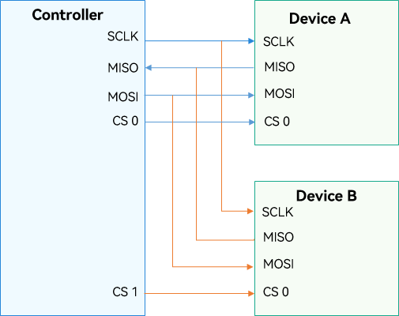
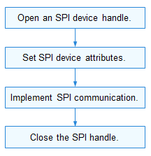

# SPI


## Overview

Serial Peripheral Interface (SPI) is a serial bus specification used for high-speed, full-duplex, and synchronous communication. SPI is developed by Motorola. It is commonly used for communication with flash memory, real-time clocks, sensors, and analog-to-digital (A/D) converters.

SPI works in controller/device mode. Generally, there is one SPI controller that controls one or more SPI devices. They are connected via four wires:
  - SCLK: clock signal output from the SPI controller
  - MOSI: data output from the SPI controller to a device
  - MISO: data output from an SPI device to the controller
  - Chip select (CS): output from the SPI controller to indicate that data is being sent. It is controlled by the SPI controller.

The figure below shows the connection between one controller and two devices (device A and device B). Device A and device B share three pins (SCLK, MISO, and MOSI) of the controller. CS 0 of device A and CS 1 of device B are connected to CS 0 and CS 1 of the controller, respectively.

  **Figure 1** Connection between the SPI controller and devices

  

- SPI communication is usually initiated by the controller and is performed as follows:
  1. The SPI controller selects a device to communicate on the select line. Only one device can be selected at a time.
  2. SCLK provides clock signals to the selected device.
  3. The SPI controller sends data to the device via MOSI, and receives data from the devices via MISO.

- SPI can work in one of the following modes according to the combination of Clock Polarity (CPOL) and Clock Phase (CPHA) of the clock signal:
  - If both CPOL and CPHA are **0**, the clock signal level is low in the idle state and data is sampled on the first clock edge.
  - If CPOL is **0** and CPHA is **1**, the clock signal level is low in the idle state and data is sampled on the second clock edge.
  - If CPOL is **1** and CPHA is **0**, the clock signal level is high in the idle state and data is sampled on the first clock edge.
  - If both CPOL and CPHA are **1**, the clock signal level is high in the idle state and data is sampled on the second clock edge.

- SPI defines a set of common functions for operating an SPI device, including those for:
  - Obtaining and releasing an SPI device handle.
  - Reading or writing data of the specified length from or into an SPI device.
  - Customizing data reading or writing via **SpiMsg**.
  - Obtaining and setting SPI device attributes.

>  **NOTE**<br>
> Currently, these functions are only applicable in the communication initiated by the SPI controller.


## Available APIs

  **Table 1** SPI driver APIs

| API| Description|
| -------- | -------- |
| SpiOpen | Opens an SPI device handle.|
| SpiClose | Closes an SPI device handle.|
| SpiRead | Reads data of the specified length from a device.|
| SpiWrite | Writes data of the specified length to a device.|
| SpiTransfer | Transfers SPI data.|
| SpiSetCfg | Sets SPI device attributes.|
| SpiGetCfg | Obtains SPI device attributes.|

>  **NOTE**<br>
> All APIs described in this document can be called only in kernel mode.


## Usage Guidelines


### How to Use

The figure below shows the general process of using SPI.

  **Figure 2** Process of using SPI APIs

  


### Opening an SPI Device Handle

Before performing SPI communication, call **SpiOpen** to open the SPI device handle. This function returns the device handle of the SPI based on the specified bus number and CS number.


```
DevHandle SpiOpen(const struct SpiDevInfo *info); 
```

  **Table 2** Description of SpiOpen

| **Parameter**| **Description**|
| -------- | -------- |
| info | Pointer to the SPI device descriptor.|
| **Return Value**| **Description**|
| NULL | The operation failed.|
| Device handle| The operation is successful. The SPI device handle obtained is returned.|

For example, open the handle of the SPI device, whose bus number and the CS number are both **0**.


```
struct SpiDevInfo spiDevinfo;       /* SPI device descriptor. */
DevHandle spiHandle = NULL;         /* SPI device handle */
spiDevinfo.busNum = 0;              /* SPI device bus number. */
spiDevinfo.csNum = 0;               /* SPI device CS number. */

/* Obtain the SPI device handle. */
spiHandle = SpiOpen(&spiDevinfo);
if (spiHandle == NULL) {
    HDF_LOGE("SpiOpen: failed\n");
    return;
}
```


### Obtaining SPI Device Attributes

After obtaining the SPI device handle, you need to configure the device attributes. Before configuring the device attributes, you can call **SpiGetCfg** to obtain the device attributes.


```
int32_t SpiGetCfg(DevHandle handle, struct SpiCfg *cfg);
```

  **Table 3** Description of SpiGetCfg

| **Parameter**| **Description**|
| -------- | -------- |
| handle     | SPI device handle.|
| cfg        | Pointer to the SPI device attributes.|
| **Return Value**| **Description**|
| 0          | The operation is successful.|
| Negative value      | The operation failed.|


```
int32_t ret;
struct SpiCfg cfg = {0};                /* SPI configuration. */
ret = SpiGetCfg(spiHandle, &cfg);       /* Obtain SPI device attributes. */
if (ret != 0) {
    HDF_LOGE("SpiGetCfg: failed, ret %d\n", ret);
}
```


### Setting SPI Device Attributes

After obtaining the SPI device handle, call **SpiSetCfg** to set SPI device attributes.


```
int32_t SpiSetCfg(DevHandle handle, struct SpiCfg *cfg);
```

  **Table 4** Description of SpiSetCfg

| **Parameter**| **Description**|
| -------- | -------- |
| handle     | SPI device handle.|
| cfg        | Pointer to the SPI device attributes.|
| **Return Value**| **Description**|
| 0          | The operation is successful.|
| Negative value      | The operation failed.|


```
int32_t ret;
struct SpiCfg cfg = {0};                     /* SPI configuration. */
cfg.mode = SPI_MODE_LOOP;                    /* Communicate in loop mode. */
cfg.transferMode = PAL_SPI_POLLING_TRANSFER; /* Communicate in polling mode. */
cfg.maxSpeedHz = 115200;                     /* Maximum transfer frequency. */
cfg.bitsPerWord = 8;                         /* The width of per word to be read or written is 8 bits. */
ret = SpiSetCfg(spiHandle, &cfg);            /* Set SPI device attributes. */
if (ret != 0) {
    HDF_LOGE("SpiSetCfg: failed, ret %d\n", ret);
}
```


### Performing SPI Communication

- Write data to an SPI device

  Call **SpiWrite()** to write data to an SPI device only once.


  ```
  int32_t SpiWrite(DevHandle handle, uint8_t *buf, uint32_t len);
  ```

  **Table 5** Description of SpiWrite

| **Parameter**| **Description**|
| -------- | -------- |
| handle     | SPI device handle.|
| buf        | Pointer to the data to write.|
| len        | Length of the data to write.|
| **Return Value**| **Description**|
| 0          | The operation is successful.|
| Negative value      | The operation failed.|


  ```
  int32_t ret;
  uint8_t wbuff[4] = {0x12, 0x34, 0x56, 0x78};
  /* Write data of the specified length to an SPI device. */
  ret = SpiWrite(spiHandle, wbuff, 4);
  if (ret != 0) {
      HDF_LOGE("SpiWrite: failed, ret %d\n", ret);
  }
  ```

- Read data from an SPI device

  Call **SpiRead()** to read data from an SPI device only once.


  ```
  int32_t SpiRead(DevHandle handle, uint8_t *buf, uint32_t len); 
  ```

  **Table 6** Description of SpiRead

| **Parameter**| **Description**|
| -------- | -------- |
| handle | SPI device handle.|
| buf | Pointer to the data to read.|
| len | Length of the data to read.|
| **Return Value**| **Description**|
| 0 | The operation is successful.|
| Negative value| The operation failed.|


  ```
  int32_t ret;
  uint8_t rbuff[4] = {0};
  /* Read data of the specified length from an SPI device. */
  ret = SpiRead(spiHandle, rbuff, 4);
  if (ret != 0) {
      HDF_LOGE("SpiRead: failed, ret %d\n", ret);
  }
  ```

- Perform a custom transfer

  Call **SpiTransfer()** to perform a custom transfer.


  ```
  int32_t SpiTransfer(DevHandle handle, struct SpiMsg *msgs, uint32_t count);
  ```

  **Table 7** Description of SpiTransfer

| **Parameter**| **Description**|
| -------- | -------- |
| handle | SPI device handle.|
| msgs | Pointer to the message array to be transferred.|
| count | Number of messages in the message array.|
| **Return Value**| **Description**|
| 0 | The operation is successful.|
| Negative value| The operation failed.|


  ```
  int32_t ret;
  uint8_t wbuff[1] = {0x12};
  uint8_t rbuff[1] = {0};
  struct SpiMsg msg;        /* Custom message to be transferred. */
  msg.wbuf = wbuff;         /* Data to write. */
  msg.rbuf = rbuff;         /* Data to read. */
  msg.len = 1;              /* The length of the data to read or write is 1 bit. */
  msg.csChange = 1;         /* Close the CS before the next transfer. */
  msg.delayUs = 0;          /* No delay before the next transfer. */
  msg.speed = 115200;       /* Transfer speed. */
  /* Perform a custom transfer. The number of messages to be transferred is 1. */
  ret = SpiTransfer(spiHandle, &msg, 1);
  if (ret != 0) {
      HDF_LOGE("SpiTransfer: failed, ret %d\n", ret);
  }
  ```


### Closing an SPI Device Handle

After the SPI communication, call **SpiClose()** to close the SPI device handle.


```
void SpiClose(DevHandle handle);
```

This function releases the resources requested by **MipiDsiOpen**.

  **Table 8** Description of SpiClose

| **Parameter**| **Description**|
| -------- | -------- |
| handle | SPI device handle.|


```
SpiClose(spiHandle); /* Close the SPI device handle. */
```


## Example

The following example shows how to obtain an SPI device handle, set device attributes, and then read or write data from or into the SPI device, and finally close the SPI device handle.

```
#include "hdf_log.h"
#include "spi_if.h"

void SpiTestSample(void)
{
    int32_t ret;
    struct SpiCfg cfg;                  /* SPI device configuration. */
    struct SpiDevInfo spiDevinfo;       /* SPI device descriptor. */
    DevHandle spiHandle = NULL; /* SPI device handle. */
    struct SpiMsg msg;                  /* Custom message to be transferred. */
    uint8_t rbuff[4] = { 0 };
    uint8_t wbuff[4] = { 0x12, 0x34, 0x56, 0x78 };
    uint8_t wbuff2[4] = { 0xa1, 0xb2, 0xc3, 0xd4 };

    spiDevinfo.busNum = 0;              /* SPI device bus number. */
    spiDevinfo.csNum = 0;               /* SPI device CS number. */
    spiHandle = SpiOpen(&spiDevinfo);   /* Open the SPI device handle based on spiDevinfo. */
    if (spiHandle == NULL) {
        HDF_LOGE("SpiOpen: failed\n");
        return;
    }
    /* Obtain SPI attributes. */
    ret = SpiGetCfg(spiHandle, &cfg);
    if (ret != 0) {
        HDF_LOGE("SpiGetCfg: failed, ret %d\n", ret);
        goto err;
    }
    cfg.maxSpeedHz = 115200;                /* Set the maximum clock frequency to 115200. */
    cfg.bitsPerWord = 8;                    /* Set the word width to 8 bits. */
    /* Set SPI attributes. */
    ret = SpiSetCfg(spiHandle, &cfg);
    if (ret != 0) {
        HDF_LOGE("SpiSetCfg: failed, ret %d\n", ret);
        goto err;
    }
    /* Write data of the specified length to an SPI device. */
    ret = SpiWrite(spiHandle, wbuff, 4);
    if (ret != 0) {
        HDF_LOGE("SpiWrite: failed, ret %d\n", ret);
        goto err;
    }
    /* Read data of the specified length from an SPI device. */
    ret = SpiRead(spiHandle, rbuff, 4);
    if (ret != 0) {
        HDF_LOGE("SpiRead: failed, ret %d\n", ret);
        goto err;
    }
    msg.wbuf = wbuff2;  /* Data to write. */
    msg.rbuf = rbuff;   /* Data to read. */
    msg.len = 4;        /* Set the length of the data to read or write to 4 bits. */
    msg.csChange = 1;   /* Close the CS before the next transfer. */
    msg.delayUs = 0;    /* No delay before the next transfer. */
    msg.speed = 115200; /* Transfer speed. */
    /* Perform a custom transfer. The number of messages to be transferred is 1. */
    ret = SpiTransfer(spiHandle, &msg, 1);
    if (ret != 0) {
        HDF_LOGE("SpiTransfer: failed, ret %d\n", ret);
        goto err;
    }
err:
    /* Close the SPI device handle. */
    SpiClose(spiHandle);
}
```
