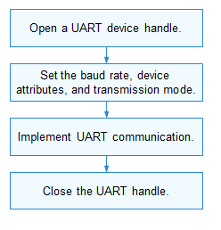

# UART

## Overview

### Function

The Universal Asynchronous Receiver/Transmitter (UART) is a universal serial data bus used for asynchronous communication. It enables bi-directional communication between devices in full-duplex mode.

A UART is connected to other modules through two wires (as shown in Figure 1) or four wires (as shown in Figure 2).

  - TX: UART transmitter. It is connected to the RX of the peer UART.
  - RX: UART receiver. It is connected to the TX of the peer UART.
  - RTS: Request to Send signal, indicating whether the local UART is ready to receive data. It is connected to the CTS of the peer UART.
  - CTS: Clear to Send signal, indicating whether the local UART is allowed to send data to the peer end. It is connected to the RTS of the peer UART.

**Figure 1** Two-wire UART communication


**Figure 2** Four-wire UART communication

 

The UART transmitter and receiver must have the same settings on particular attributes, such as the baud rate and data format (start bit, data bits, parity bit, and stop bit) before they start to communicate. A UART sends data to the peer end over the TX and receives data from the peer end over the RX. When the size of the buffer used by a UART for storing received data reaches the preset threshold, the RTS signal of the UART changes to **1** (data cannot be received), and the peer UART stops sending data to it because its CTS signal does not allow it to send data.

The UART module provides APIs for operating UART ports, including:

- Opening or closing a UART device
- Reading or writing data
- Setting or obtaining the baud rate of a UART device
- Setting or obtaining UART device attributes

### Basic Concepts

- Asynchronous communication

  In asynchronous communication, data is transmitted in frames of characters or bytes. Frames are sent and received one by one through the transmission line. The transmitter and receiver have their own clocks to control data sending and receiving. The two clock sources are independent and not synchronized with each other. 

  When data is sent one character at a time, the time interval between two characters is not fixed, but the time interval between two adjacent bits in a character frame is fixed.

- Full-duplex transmission

  A duplex communication mode allows data to be transmitted in both directions at the same time. A duplex communication channel is equivalent to two simplex communication channels operating in opposite directions at the same time. In full-duplex mode, signals can be transmitted bidirectionally at the same time.

### Working Principles

In the Hardware Driver Foundation (HDF), the UART uses the independent service mode (see Figure 3) for API adaptation. In this mode, each device independently publishes a service to process external access requests. When receiving an access request, the HDF DeviceManager extracts parameters from the request to call the internal APIs of the target device. In the independent service mode, the HDF DeviceManager provides service management capabilities. However, you need to configure a node for each device, which increases memory usage.

In the independent service mode, the core layer does not publish a service for the upper layer. Therefore, a service must be published for each controller. To achieve this purpose:

- You need to implement the **Bind()** function in **HdfDriverEntry** to bind services.
- The **policy** field of **deviceNode** in the **device_info.hcs** file can be **1** or **2**, but not **0**.

The UART module is divided into the following layers:

- Interface layer: provides APIs for opening or closing a UART device, reading or writing data of the specified length, setting or obtaining the baud rate or attributes of a UART device, and setting the transmission mode.
- Core layer: provides the capabilities of adding or removing a UART controller, and managing UART devices. The core layer interacts with the adaptation layer through hook functions.
- Adaptation layer: instantiates the hook functions to implement specific features.

**Figure 3** Independent service mode


## Usage Guidelines

### When to Use

The UART module is widely used to implement low-speed serial communication between devices, for example, output the printing information. It can also connect to a variety of external GPS and Bluetooth devices.

### Available APIs

**Table 1** UART driver APIs

| API| Description|
| -------- | -------- |
| DevHandle UartOpen(uint32_t port) | Opens a UART device.|
| void UartClose(DevHandle handle) | Closes a UART device.|
| int32_t UartRead(DevHandle handle, uint8_t *data, uint32_t size) | Reads data of the specified length from a UART device.|
| int32_t UartWrite(DevHandle handle, uint8_t *data, uint32_t size) | Writes data of the specified length to a UART device.|
| int32_t UartGetBaud(DevHandle handle, uint32_t *baudRate) | Obtains the UART baud rate.|
| int32_t UartSetBaud(DevHandle handle, uint32_t baudRate) | Sets the UART baud rate.|
| int32_t UartGetAttribute(DevHandle handle, struct UartAttribute *attribute) | Obtains UART device attributes.|
| int32_t UartSetAttribute(DevHandle handle, struct UartAttribute *attribute) | Sets UART device attributes.|
| int32_t UartSetTransMode(DevHandle handle, enum UartTransMode mode) | Sets the UART transmission mode.|

>  **NOTE**
>
> All the UART APIs described in this document can be used in kernel mode and user mode.

### How to Develop

The following figure illustrates how to use the UART APIs.

**Figure 4** Using UART driver APIs




#### Opening a UART Device

Before performing UART communication, use **UartOpen()** to obtain a UART device handle based on the port number.

```c
DevHandle UartOpen(uint32_t port);
```

**Table 2** Description of UartOpen

| Parameter| Description|
| -------- | -------- |
| port | UART port number.|
| **Return Value**| **Description**|
| NULL | The operation fails.|
| Device handle| The operation is successful. The obtained UART device handle is returned.|

Example: Obtain the device handle of UART port 1.

```c
DevHandle handle = NULL;    // UART device handle.
uint32_t port = 1;          // UART device port number.

handle = UartOpen(port);
if (handle == NULL) {
    HDF_LOGE("UartOpen: open uart_%u failed!\n", port);
    return;
}
```

#### Setting the UART Baud Rate

Use **UartSetBaud()** to set the UART baud rate.

```c
int32_t UartSetBaud(DevHandle handle, uint32_t baudRate);
```

**Table 3** Description of UartSetBaud

| Parameter| Description|
| -------- | -------- |
| handle | UART device handle.|
| baudRate | Baud rate to set.|
| **Return Value**| **Description**|
| HDF_SUCCESS | The operation is successful.|
| Negative value| The operation fails.|

Example: Set the UART baud rate to **9600**.

```c
int32_t ret;

ret = UartSetBaud(handle, 9600); // Set the UART baud rate.
if (ret != HDF_SUCCESS) {
    HDF_LOGE("UartSetBaud: failed, ret %d\n", ret);
    return ret;
}
```

#### Obtaining the UART Baud Rate

Use **UartGetBaud()** to obtain the UART baud rate.

```c
int32_t UartGetBaud(DevHandle handle, uint32_t *baudRate);
```

**Table 4** Description of UartGetBaud

| Parameter| Description|
| -------- | -------- |
| handle | UART device handle.|
| baudRate | Pointer to the UART baud rate obtained.|
| **Return Value**| **Description**|
| HDF_SUCCESS | The operation is successful.|
| Negative value| The operation fails.|

Example: Obtain the UART baud rate.

```c
int32_t ret;
uint32_t baudRate;

ret = UartGetBaud(handle, &baudRate);    // Obtain the UART baud rate.
if (ret != HDF_SUCCESS) {
    HDF_LOGE("UartGetBaud: failed, ret %d\n", ret);
    return ret;
}
```

#### Setting UART Device Attributes

Use **UartSetAttribute()** to set UART device attributes.

```c
int32_t UartSetAttribute(DevHandle handle, struct UartAttribute *attribute);
```

**Table 5** Description of UartSetAttribute

| Parameter| Description|
| -------- | -------- |
| handle | UART device handle.|
| attribute | Pointer to the UART device attributes to set.|
| **Return Value**| **Description**|
| HDF_SUCCESS | The operation is successful.|
| Negative value| The operation fails.|

Example: Set UART device attributes.

```c
int32_t ret;
struct UartAttribute attribute;

attribute.dataBits = UART_ATTR_DATABIT_7;     // Transfer 7 bits each time.
attribute.parity = UART_ATTR_PARITY_NONE;     // Disable parity check for the data to transfer.
attribute.stopBits = UART_ATTR_STOPBIT_1;     // Set the stop bit to 1.
attribute.rts = UART_ATTR_RTS_DIS;            // Disable RTS.
attribute.cts = UART_ATTR_CTS_DIS;            // Disable CTS.
attribute.fifoRxEn = UART_ATTR_RX_FIFO_EN;    // Enable RX FIFO.
attribute.fifoTxEn = UART_ATTR_TX_FIFO_EN;    // Enable TX FIFO.

ret = UartSetAttribute(handle, &attribute);   // Set UART device attributes.
if (ret != HDF_SUCCESS) {
    HDF_LOGE("UartSetAttribute: failed, ret %d\n", ret);
turn ret;
}
```

#### Obtaining UART Device Attributes

Use **UartGetAttribute()** to obtain the UART device attributes.

```c
int32_t UartGetAttribute(DevHandle handle, struct UartAttribute *attribute);
```

**Table 6** Description of UartGetAttribute

| Parameter| Description|
| -------- | -------- |
| handle | UART device handle.|
| attribute | Pointer to the UART device attributes obtained.|
| **Return Value**| **Description**|
| HDF_SUCCESS | The operation is successful.|
| Negative value| The operation fails.|

Example: Obtain UART device attributes.

```c
int32_t ret;
struct UartAttribute attribute;

ret = UartGetAttribute(handle, &attribute);    // Obtain the attributes of the UART device.
if (ret != HDF_SUCCESS) {
    HDF_LOGE("UartGetAttribute: failed, ret %d\n", ret);
    return ret;
}
```

#### Setting the UART Transmission Mode

Use **UartSetTransMode()** to set the UART transmission mode.

```c
int32_t UartSetTransMode(DevHandle handle, enum UartTransMode mode);
```

**Table 7** Description of UartSetTransMode

| Parameter| Description|
| -------- | -------- |
| handle | UART device handle.|
| mode | UART transmission mode to set.|
| **Return Value**| **Description**|
| HDF_SUCCESS | The operation is successful.|
| Negative value| The operation fails.|

Example: Set the UART transmission mode to **UART_MODE_RD_BLOCK**.

```c
int32_t ret;

ret = UartSetTransMode(handle, UART_MODE_RD_BLOCK);    // Sets the UART transmission mode.
if (ret != HDF_SUCCESS) {
    HDF_LOGE("UartSetTransMode: failed, ret %d\n", ret);
    return ret;
}
```

#### Writing Data to a UART Device

Use **UartWrite()** to write data of the specified length to a UART device.

```c
int32_t UartWrite(DevHandle handle, uint8_t *data, uint32_t size);
```

**Table 8** Description of UartWrite

| Parameter| Description|
| -------- | -------- |
| handle | UART device handle.|
| data | Pointer to the data to write.|
| size | Length of the data to write.|
| **Return Value**| **Description**|
| HDF_SUCCESS | The operation is successful.|
| Negative value| The operation fails.|

Example: Write data to a UART device.

```c
int32_t ret;
uint8_t wbuff[5] = {1, 2, 3, 4, 5};

ret = UartWrite(handle, wbuff, 5);    // Write data of the specified length to the UART device.
if (ret != HDF_SUCCESS) {
    HDF_LOGE("UartWrite: failed, ret %d\n", ret);
    return ret;
}
```

#### Reading Data from a UART Device

Use **UartRead()** to read data of the specified length from a UART device.

```c
int32_t UartRead(DevHandle handle, uint8_t *data, uint32_t size);
```

**Table 9** Description of UartRead

| Parameter| Description|
| -------- | -------- |
| handle | UART device handle.|
| data | Pointer to the buffer for receiving the data.|
| size | Length of the data to read.|
| **Return Value**| **Description**|
| Non-negative value| The operation is successful. The length of the data read is returned.|
| Negative value| The operation fails.|

Example: Read data of the specified length from a UART device.

```c
int32_t ret;
uint8_t rbuff[5] = {0};

ret = UartRead(handle, rbuff, 5);    // Read data of the specified length from the UART device.
if (ret < 0) {
    HDF_LOGE("UartRead: failed, ret %d\n", ret);
	return ret;
}
```

>  **CAUTION**<br/>
> Data is successfully read from the UART device if a non-negative value is returned. If **0** is returned, no valid data can be read from the UART device. A value greater than **0** indicates the length of the data read from the UART device. The data length must be less than or equal to the value of **size** and cannot exceed the maximum length of the data to read at a time specified by the UART controller in use.


#### Closing a UART Device

Use **UartClose()** to close a UART device.

```c
void UartClose(DevHandle handle);
```

This function releases the resources requested by **UartOpen**.

**Table 10** Description of UartClose

| Parameter| Description|
| -------- | -------- |
| handle | UART device handle to close.|

Example: Close a UART device.

```c
UartClose(handle);    // Close a UART device to release resources.
```

## Example

The following uses the Hi3516D V300 development board as an example to describe how to manage the UART device. The procedure is as follows: 

1. Open a UART device based on the port number. The handle of the UART device opened is returned.
2. Set the baud rate of the UART device.
3. Obtain the baud rate of the UART device.
4. Set the attributes of the UART device.
5. Obtain the attributes of the UART device.
6. Set the transmission mode of the UART device.
7. Transfer data of the specified length.
8. Receive data of the specified length.
9. Closes the UART device.

```c
#include "hdf_log.h"
#include "uart_if.h"

void UartTestSample(void)
{
    int32_t ret;
    uint32_t port;
    uint32_t baud;
    DevHandle handle = NULL;
    uint8_t wbuff[5] = { 1, 2, 3, 4, 5 };
    uint8_t rbuff[5] = { 0 };
    struct UartAttribute attribute;

    attribute.dataBits = UART_ATTR_DATABIT_7;                  // Transfer 7 bits each time.
    attribute.parity = UART_ATTR_PARITY_NONE;                  // Disable parity check.
    attribute.stopBits = UART_ATTR_STOPBIT_1;                  // Set the stop bit to 1.
    attribute.rts = UART_ATTR_RTS_DIS;                         // Disable RTS.
    attribute.cts = UART_ATTR_CTS_DIS;                         // Disable CTS.
    attribute.fifoRxEn = UART_ATTR_RX_FIFO_EN;                 // Enable RX FIFO.
    attribute.fifoTxEn = UART_ATTR_TX_FIFO_EN;                 // Enable TX FIFO.

    port = 1;                                                  // UART device port number.

    handle = UartOpen(port);                                   // Open a UART device.
    if (handle == NULL) {
        HDF_LOGE("UartOpen: open uart_%u failed!\n", port);
        return;
    }

    ret = UartSetBaud(handle, 9600);                           // Set the UART baud rate to 9600.
    if (ret != HDF_SUCCESS) {
        HDF_LOGE("UartSetBaud: set baud failed, ret %d\n", ret);
        goto ERR;
    }

    ret = UartGetBaud(handle, &baud);                          // Obtain the UART baud rate.
    if (ret != HDF_SUCCESS) {
        HDF_LOGE("UartGetBaud: get baud failed, ret %d\n", ret);
        goto ERR;
    }

    ret = UartSetAttribute(handle, &attribute);                // Set the attributes of the UART device.
    if (ret != HDF_SUCCESS) {
        HDF_LOGE("UartSetAttribute: set attribute failed, ret %d\n", ret);
        goto ERR;
    }

    ret = UartGetAttribute(handle, &attribute);                // Obtain the attributes of the UART device.
    if (ret != HDF_SUCCESS) {
        HDF_LOGE("UartGetAttribute: get attribute failed, ret %d\n", ret);
        goto ERR;
    }

    ret = UartSetTransMode(handle, UART_MODE_RD_NONBLOCK);     // Set the UART transmission mode to non-block mode.
    if (ret != HDF_SUCCESS) {
        HDF_LOGE("UartSetTransMode: set trans mode failed, ret %d\n", ret);
        goto ERR;
    }

    ret = UartWrite(handle, wbuff, 5);                         // Write 5-byte data to the UART device.
    if (ret != HDF_SUCCESS) {
        HDF_LOGE("UartWrite: write data failed, ret %d\n", ret);
        goto ERR;
    }

    ret = UartRead(handle, rbuff, 5);                          // Read 5-byte data from the UART device.
    if (ret < 0) {
        HDF_LOGE("UartRead: read data failed, ret %d\n", ret);
        goto ERR;
    }
ERR:
    UartClose(handle);                                         // Close the UART device.
	return ret;
}
```
