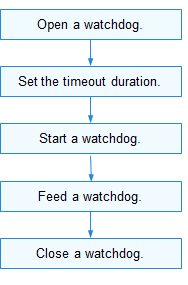

# Watchdog

## Overview

### Function

A watchdog, also called a watchdog timer, is a hardware timing device used to facilitate automatic correction of temporary hardware faults or recover from system malfunctions. Generally, it has an input to feed the watchdog and an output to the reset pin of the system. If an error occurs in the main program of the system and the watchdog timer is not cleared in time, the watchdog timer sends a reset signal to restore the system to the normal state.

The watchdog module provides APIs for watchdog operations, including:

- Opening or closing a watchdog
- Starting or stopping a watchdog
- Setting or obtaining the watchdog timeout period
- Obtaining the watchdog status
- Feeding a watchdog

### Basic Concepts

When the system works properly, a signal is output to the watchdog to prevent it from timing out. This operation is called watchdog feeding. If the watchdog is not fed within the specified time, the watchdog times out and a reset signal is sent to the system to reset the system.

### Working Principles

In the Hardware Driver Foundation (HDF), the PWM uses the independent service mode (see Figure 1) for API adaptation. In this mode, each device independently publishes a service to process external access requests. When receiving an access request, the HDF DeviceManager extracts parameters from the request to call the internal APIs of the target device. In the independent service mode, the HDF DeviceManager provides service management capabilities. However, you need to configure a node for each device, which increases memory usage.

In the independent service mode, the core layer does not publish a service for the upper layer. Therefore, a service must be published for each controller. To achieve this purpose:

- You need to implement the **Bind()** function in **HdfDriverEntry** to bind services.
- The **policy** field of **deviceNode** in the **device_info.hcs** file can be **1** or **2**, but not **0**.

The watchdog module is divided into the following layers:

- Interface layer: provides APIs for opening or closing a watchdog, starting or stopping a watchdog, setting or obtaining the watchdog timeout period, and feeding a watchdog
- Core layer: provides the capabilities of adding or removing a watchdog controller and managing watchdog devices. The core layer interacts with the adaptation layer through hook functions.
- Adaptation layer: instantiates the hook functions to implement specific features.

**Figure 1** Independent service mode


## Usage Guidelines

### When to Use

Watchdogs are used to automatically detect the software exceptions that cannot be directly observed and reset the system when an exception is detected.

### Available APIs

The following table describes the APIs provided by the watchdog module.

**Table 1** Watchdog APIs

| API| Description|
| -------- | -------- |
| int32_t WatchdogOpen(int16_t wdtId, DevHandle *handle) | Opens a watchdog.|
| void WatchdogClose(DevHandle handle) | Closes a watchdog.|
| int32_t WatchdogStart(DevHandle handle) | Starts a watchdog.|
| int32_t WatchdogStop(DevHandle handle) | Stops a watchdog.|
| int32_t WatchdogSetTimeout(DevHandle handle, uint32_t seconds) | Sets the watchdog timeout duration.|
| int32_t WatchdogGetTimeout(DevHandle handle, uint32_t *seconds) | Obtains the watchdog timeout duration.|
| int32_t WatchdogGetStatus(DevHandle handle, int32_t *status) | Obtains the watchdog status.|
| int32_t WatchdogFeed(DevHandle handle) | Feeds a watchdog or resets a watchdog timer.|

>  **NOTE**
>
> All watchdog APIs described in this document can be used in kernel mode and user mode.

### How to Develop

The following figure shows how to use the watchdog driver APIs.

**Figure 2** Using watchdog driver APIs



#### Opening a Watchdog

Before operating a watchdog, you need to use **WatchdogOpen()** to open a watchdog. A system may have multiple watchdogs. You need to specify the ID of the watchdog to open.

```c
DevHandle WatchdogOpen(int16_t wdtId, DevHandle *handle);
```

**Table 2** Description of WatchdogOpen

| **Parameter**| **Description**|
| -------- | -------- |
| wdtId | Watchdog ID.|
| handle | Pointer to the watchdog device handle obtained.|
| **Return Value**| **Description**|
| HDF_SUCCESS | The operation is successful.|
| Negative value| The operation fails.|

```c
int16_t wdtId = 0;
int32_t ret;
DevHandle *handle = NULL;

ret = WatchdogOpen(wdtId, handle); // Open watchdog 0.
if (ret != HDF_SUCCESS) {
    HDF_LOGE("WatchdogOpen: open watchdog_%hd failed, ret:%d\n", wdtId, ret);
    return ret;
}
```

#### Obtaining the Watchdog Status

```c
int32_t WatchdogGetStatus(DevHandle handle, int32_t *status); 
```

**Table 3** Description of WatchdogGetStatus

| **Parameter**| **Description**|
| -------- | -------- |
| handle | Watchdog device handle.|
| status | Pointer to the watchdog status obtained.|
| **Return Value**| **Description**|
| HDF_SUCCESS | The operation is successful.|
| Negative value| The operation fails.|

```c
int32_t ret;
int32_t status;

ret = WatchdogGetStatus(handle, &status);    // Obtain the watchdog status.
if (ret != HDF_SUCCESS) {
    HDF_LOGE("WatchdogGetStatus: watchdog get status failed, ret:%d\n", ret);
    return ret;
}
```

#### Setting the Timeout Duration


```c
int32_t WatchdogSetTimeout(DevHandle *handle, uint32_t seconds); 
```

**Table 4** Description of WatchdogSetTimeout

| **Parameter**| **Description**|
| -------- | -------- |
| handle | Pointer to the watchdog device handle.|
| seconds | Timeout duration to set, in seconds.|
| **Return Value**| **Description**|
| HDF_SUCCESS | The operation is successful.|
| Negative value| The operation fails.|

```c
int32_t ret;

ret = WatchdogSetTimeout(handle, 2);    // Set the timeout duration to 2 seconds.
if (ret != HDF_SUCCESS) {
    HDF_LOGE("WatchdogSetTimeout: watchdog set timeOut failed, ret:%d\n", ret);
    return ret;
}
```

#### Obtaining the Timeout Duration

```c
int32_t WatchdogGetTimeout(DevHandle *handle, uint32_t *seconds);
```

**Table 5** Description of WatchdogGetTimeout

| **Parameter**| **Description**|
| -------- | -------- |
| handle | Pointer to the watchdog device handle.|
| seconds | Pointer to the watchdog timeout duration obtained.|
| **Return Value**| **Description**|
| HDF_SUCCESS | The operation is successful.|
| Negative value| The operation fails.|

```c
 int32_t ret;
 uint32_t timeOut;

 ret = WatchdogGetTimeout(handle, &timeOut);     // Obtain the watchdog timeout duration.
 if (ret != HDF_SUCCESS) {
     HDF_LOGE("WatchdogGetTimeout: watchdog get timeOut failed, ret:%d\n", ret);
     return ret;
 }
```

#### Starting a Watchdog

```c
int32_t WatchdogStart(DevHandle handle);
```

**Table 6** Description of WatchdogStart

| **Parameter**| **Description**|
| -------- | -------- |
| handle | Watchdog device handle.|
| **Return Value**| **Description**|
| HDF_SUCCESS | The operation is successful.|
| Negative value| The operation fails.|

```c
int32_t ret;

ret = WatchdogStart(handle);    // Start a watchdog.
if (ret != HDF_SUCCESS) {
    HDF_LOGE("WatchdogStart: start watchdog failed, ret:%d\n", ret);
    return ret;
}
```

#### Feeding a Watchdog

```c
int32_t WatchdogFeed(DevHandle handle);
```

**Table 7** Description of WatchdogFeed

| **Parameter**| **Description**|
| -------- | -------- |
| handle | Watchdog device handle.|
| **Return Value**| **Description**|
| HDF_SUCCESS | The operation is successful.|
| Negative value| The operation fails.|

```c
int32_t ret;

ret = WatchdogFeed (handle);  // Feed a watchdog.
if (ret != HDF_SUCCESS) {
    HDF_LOGE("WatchdogFeed: feed watchdog failed, ret:%d\n", ret);
    return ret;
}
```

#### Stopping a Watchdog

```c
int32_t WatchdogStop(DevHandle handle);
```

**Table 8** Description of WatchdogStop

| **Parameter**| **Description**|
| -------- | -------- |
| handle | Watchdog device handle.|
| **Return Value**| **Description**|
| HDF_SUCCESS | The operation is successful.|
| Negative value| The operation fails.|

```c
int32_t ret;

ret = WatchdogStop(handle); // Stop a watchdog.
if (ret != HDF_SUCCESS) {
    HDF_LOGE("WatchdogStop: stop watchdog failed, ret:%d\n", ret);
    return ret;
}
```

#### Closing a Watchdog

After all operations are complete, use **WatchdogClose()** to close the watchdog.

```c
void WatchdogClose(DevHandle handle);
```

**Table 9** Description of WatchdogClose

| **Parameter**| **Description**|
| -------- | -------- |
| handle | Watchdog device handle.|

```c
WatchdogClose(handle);    // Close a watchdog.
```

## Example

The following uses the Hi3516D V300 development board as an example to describe how to operate the watchdog. The procedure is as follows: 

1. Open a watchdog. You need to pass in the watchdog ID. The device handle of the watchdog opened is returned.
2. Set the timeout duration for the watchdog.
3. Obtain the timeout duration of the watchdog.
4. Start the watchdog.
5. Feed the watchdog.
6. Stop the watchdog.
7. Close the watchdog.

```c
#include "watchdog_if.h"              /* Header file of the standard watchdog APIs. */
#include "hdf_log.h"                  /* Header file of the HDF log APIs. */
#include "osal_time.h"                /* Header file of the delay and sleep APIs. */

#define WATCHDOG_TEST_TIMEOUT     2
#define WATCHDOG_TEST_FEED_TIME   6

static int32_t TestCaseWatchdog(void)
{
    int32_t i;
    int32_t ret;
    int16_t wdtId = 0;
    int32_t status;
    uint32_t timeout;
    DevHandle *handle = NULL;

    /* Open watchdog 0. */
    ret = WatchdogOpen(wdtId, handle);
    if (ret != HDF_SUCCESS) {
        HDF_LOGE("WatchdogOpen: open watchdog_%hd failed, ret:%d\n", wdtId, ret);
        return ret;
    }

    /* Set the timeout duration. */
    ret = WatchdogSetTimeout(handle, WATCHDOG_TEST_TIMEOUT);
    if (ret != HDF_SUCCESS) {
        HDF_LOGE("%s: set timeout fail! ret:%d\n", __func__, ret);
        WatchdogClose(handle);
        return ret;
    }

    /* Obtain the timeout duration. */ 
    ret = WatchdogGetTimeout(handle, &timeout);
    if (ret != HDF_SUCCESS) {
        HDF_LOGE("%s: get timeout fail! ret:%d\n", __func__, ret);
        WatchdogClose(handle);
        return ret;
    }
    /* Check whether the timeout duration obtained is the same as the timeout duration set. */
    if (timeout != WATCHDOG_TEST_TIMEOUT) {
        HDF_LOGE("%s: set:%u, but get:%u", __func__, WATCHDOG_TEST_TIMEOUT, timeout);
        WatchdogClose(handle);
        return HDF_FAILURE;
    }
    HDF_LOGI("%s: read timeout back:%u\n", __func__, timeout);

    /* Start the watchdog. The timer starts. */
    ret = WatchdogStart(handle);
    if (ret != HDF_SUCCESS) {
        HDF_LOGE("%s: start fail! ret:%d\n", __func__, ret);
        WatchdogClose(handle);
        return ret;
    }
    /* Obtain the watchdog status and determine whether to start the watchdog. */
    status = WATCHDOG_STOP;
    ret = WatchdogGetStatus(handle, &status);
    if (ret != HDF_SUCCESS) {
        HDF_LOGE("%s: get status fail! ret:%d", __func__, ret);
        WatchdogClose(handle);
        return ret;
    }
    if (status != WATCHDOG_START) {
        HDF_LOGE("%s: status is:%d after start", __func__, status);
        WatchdogClose(handle);
        return HDF_FAILURE;
    }

    /* Feed the watchdog every other second. */
    for (i = 0; i < WATCHDOG_TEST_FEED_TIME; i++) {
        HDF_LOGI("%s: feeding watchdog %d times... \n", __func__, i);
        ret = WatchdogFeed(handle);
        if (ret != HDF_SUCCESS) {
            HDF_LOGE("%s: feed dog fail! ret:%d\n", __func__, ret);
            WatchdogClose(handle);
            return ret;
        }
        OsalSleep(1);
    }
    /* Because the interval for feeding the watchdog is shorter than the timeout duration, the system does not reset, and logs can be printed normally. */
    HDF_LOGI("%s: no reset ... feeding test OK!!!\n", __func__);

    ret = WatchdogStop(handle);
    if (ret != HDF_SUCCESS) {
        HDF_LOGE("%s: stop fail! ret:%d", __func__, ret);
        WatchdogClose(handle);
        return ret;
    }
    /* Obtain the watchdog status and determine whether to close the watchdog. */
    status = WATCHDOG_START;
    ret = WatchdogGetStatus(handle, &status);
    if (ret != HDF_SUCCESS) {
        HDF_LOGE("%s: get status fail! ret:%d", __func__, ret);
        WatchdogClose(handle);
        return ret;
    }
    if (status != WATCHDOG_STOP) {
        HDF_LOGE("%s: status is:%d after stop", __func__, status);
        WatchdogClose(handle);
        return HDF_FAILURE;
    }
    WatchdogClose(handle);
    return HDF_SUCCESS;
}
```
