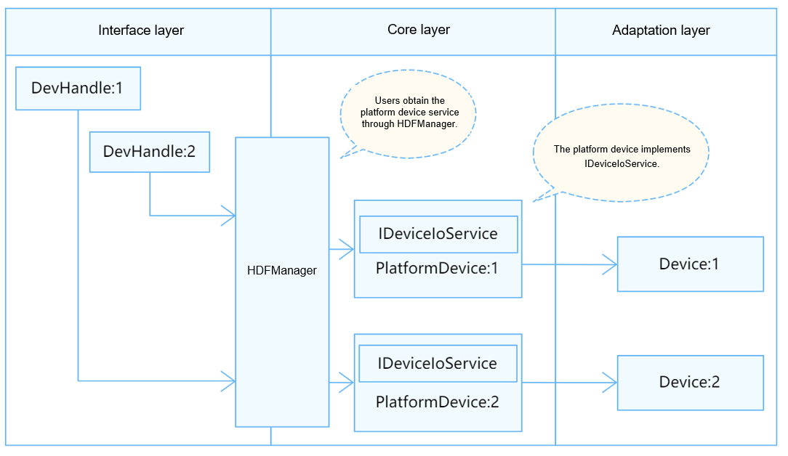

# Watchdog

## Overview

### Function

A watchdog, also called a watchdog timer, is a hardware timing device used to facilitate automatic correction of temporary hardware faults or recover from system malfunctions. Generally, it has an input to feed the watchdog and an output to the reset pin of the system. If an error occurs in the main program of the system and the watchdog timer is not cleared in time, the watchdog timer sends a reset signal to restore the system to the normal state.

### Basic Concepts

When the system works properly, a signal is output to the watchdog to prevent it from timing out. This operation is called watchdog feeding. If the watchdog is not fed within the specified time, the watchdog times out and a reset signal is sent to the system to reset the system.

### Working Principles

In the Hardware Driver Foundation (HDF), the watchdog module uses the independent service mode (see Figure 1) for API adaptation. In this mode, each device independently publishes a service to process external access requests. When receiving an access request, the HDF DeviceManager extracts parameters from the request to call the internal APIs of the target device. In the independent service mode, the HDF DeviceManager provides service management capabilities. However, you need to configure a node for each device, which increases memory usage.

In the independent service mode, the core layer does not publish a service for the upper layer. Therefore, a service must be published for each controller. To achieve this purpose:

- You need to implement the **Bind()** function in **HdfDriverEntry** to bind services.
- The **policy** field of **deviceNode** in the **device_info.hcs** file can be **1** or **2**, but not **0**.

The watchdog module is divided into the following layers:

- Interface layer: provides APIs for opening or closing a watchdog, starting or stopping a watchdog, setting or obtaining the watchdog timeout period, and feeding a watchdog
- Core layer: provides the capabilities of adding or removing a watchdog controller and managing watchdog devices. The core layer interacts with the adaptation layer through hook functions.
- Adaptation layer: instantiates the hook functions to implement specific features.

**Figure 1** Independent service mode



## Development Guidelines

### When to Use

Watchdogs are used to automatically detect the software exceptions that cannot be directly observed and reset the system when an exception is detected. Before using your watchdogs with OpenHarmony, you need to perform watchdog driver adaptation. The following describes how to do it.

### **Available APIs**

To enable the upper layer to successfully operate the watchdog controller by calling the watchdog APIs, hook functions are defined in **//drivers/hdf_core/framework/support/platform/include/watchdog/watchdog_core.h** for the core layer. You need to implement these hook functions at the adaptation layer and hook them to implement the interaction between the interface layer and the core layer.

**WatchdogMethod**:

```c
struct WatchdogMethod {
    int32_t (*getStatus)(struct WatchdogCntlr *wdt, int32_t *status);
    int32_t (*setTimeout)(struct WatchdogCntlr *wdt, uint32_t seconds);
    int32_t (*getTimeout)(struct WatchdogCntlr *wdt, uint32_t *seconds);
    int32_t (*start)(struct WatchdogCntlr *wdt);
    int32_t (*stop)(struct WatchdogCntlr *wdt);
    int32_t (*feed)(struct WatchdogCntlr *wdt);
    int32_t (*getPriv)(struct WatchdogCntlr *wdt);  // (Optional) If WatchdogCntlr has the priv member, instantiate priv.
    void (*releasePriv)(struct WatchdogCntlr *wdt); // (Optional)
};
```

**Table 1** Hook functions in WatchdogMethod

| Function| Input Parameter| Output Parameter| Return Value| Description|
| -------- | -------- | -------- | -------- | -------- |
| getStatus | **wdt**: structure pointer to the watchdog controller at the core layer.| status: pointer to the watchdog status (opened or closed) obtained. The value is of the int32_t type.| HDF_STATUS| Obtains the watchdog status.|
| setTimeout | **wdt**: structure pointer to the watchdog controller at the core layer.<br>**seconds**: watchdog timeout duration to set.| –| HDF_STATUS| Sets the watchdog timeout duration, in seconds. Ensure that the actual running time of the watchdog complies with the value set.|
| getTimeout  | **wdt**: structure pointer to the watchdog controller at the core layer.                       | **seconds**: pointer to the timeout duration obtained. The value is of the uint32_t type.               | HDF_STATUS| Obtains the watchdog timeout duration.                                          |
| start       | **wdt**: structure pointer to the watchdog controller at the core layer.                       | –                                                          | HDF_STATUS| Starts a watchdog.                                                  |
| stop        | **wdt**: structure pointer to the watchdog controller at the core layer.                       | –                                                          | HDF_STATUS| Stops a watchdog.                                                  |
| feed | **wdt**: structure pointer to the watchdog controller at the core layer.| –| HDF_STATUS| Feeds a watchdog. |
| getPriv | **wdt**: structure pointer to the watchdog controller at the core layer.| –| HDF_STATUS| Obtains the private data of the watchdog driver.|
| releasePriv | **wdt**: structure pointer to the watchdog controller at the core layer.| –| HDF_STATUS| Releases the private data of the watchdog driver.|

### How to Develop

The watchdog module adaptation procedure is as follows:

1. Instantiate the driver entry.
2. Configure attribute files.
3. Instantiate the watchdog controller object.
4. Debug the driver.

### Example

The following uses the **//device_soc_hisilicon/common/platform/watchdog/watchdog_hi35xx.c** driver of the Hi3516D V300 development board as an example to describe the watchdog driver adaptation.

1. Instantiate the driver entry.

    The driver entry must be a global variable of the **HdfDriverEntry** type (defined in **hdf_device_desc.h**), and the value of **moduleName** must be the same as that in **device_info.hcs**. In the HDF framework, the start address of each **HdfDriverEntry** object of all loaded drivers is collected to form a segment address space similar to an array for the upper layer to invoke.
    Generally, the HDF calls the **Bind** function and then the **Init** function to load a driver. If **Init** fails to be called, the HDF calls **Release** to release driver resources and exit.

    Watchdog driver entry example:

    ```c
    struct HdfDriverEntry g_watchdogDriverEntry = {
        .moduleVersion = 1,
        .Bind = Hi35xxWatchdogBind,               // See the Bind function.
        .Init = Hi35xxWatchdogInit,               // See the Init function.
        .Release = Hi35xxWatchdogRelease,         // See the Release function.
        .moduleName = "HDF_PLATFORM_WATCHDOG",    // (Mandatory) The value must be the same as that of moduleName in the .hcs file.
    };
    HDF_INIT(g_watchdogDriverEntry);              // Call HDF_INIT to register the driver entry with the HDF.
    ```

2. Configure attribute files.

   Add the deviceNode information to the **device_info.hcs** file. The deviceNode information is related to the driver entry registration. The following example uses one watchdog controller as an example. If there are more watchdog controllers, add the deviceNode information to the **device_info.hcs** file for each controller. The device attribute values configured in **watchdog_config.hcs** are closely related to default values or value ranges of the **WatchdogCntlr** members at the core layer.

   - **device_info.hcs** example:

      Add the deviceNode information to the **//vendor/hisilicon/hispark_taurus/hdf_config/device_info/device_info.hcs** file.

      ```c
      root {
          device_info {
              match_attr = "hdf_manager";
              device_watchdog :: device {                                // Device node.
                  device0 :: deviceNode {                                // DeviceNode of the driver.
                      policy = 2;                                        // The value 2 means to publish services for both kernel- and user-mode processes.
                      priority = 20;                                     // Driver startup priority.
                      permission = 0644;                                 // Permission for the device node created.
                      moduleName = "HDF_PLATFORM_WATCHDOG";              // (Mandatory) Driver name, which must be the same as that of moduleName in the driver entry structure.
                      serviceName = "HDF_PLATFORM_WATCHDOG_0";           // (Mandatory) Unique name of the service released by the driver.
                      deviceMatchAttr = "hisilicon_hi35xx_watchdog_0";   // (Mandatory) Controller private data, which must be the same as the value of match_attr in watchdog_config.hcs.
                  } 
              }
          }
      } 
      ```

   - **watchdog_config.hcs** example:

      Configure the device attributes in the **//device/soc/hisilicon/hi3516dv300/sdk_liteos/hdf_config/watchdog/watchdog_config.hcs** file. The parameters are as follows:

      ```c
      root {
          platform {
              template watchdog_controller {                     // (Mandatory) Template configuration. If the template is used to configure device node information, the default values in the template will be used for the fields that are not declared for the node.
                  id = 0;                                        // Watchdog ID.
                  match_attr = "";
                  regBase = 0x12050000;                          // (Mandatory) Physical base address used for address mapping.
                  regStep = 0x1000;                              // (Mandatory) Register offset step used for address mapping.
              }
              controller_0x12050000 :: watchdog_controller {     // (Mandatory) Keyword for matching the private data of the device driver.
                  match_attr = "hisilicon_hi35xx_watchdog_0";    // (Mandatory) The value must be the same as that of deviceMatchAttr in device_info.hcs.
              }
                                                                 // Add node information for each watchdog device.
              ...
          }
      }
      ```

      After the **watchdog_config.hcs** file is configured, include the file in the **hdf.hcs** file. Otherwise, the configuration file cannot take effect.

      ```c
      #include "../../../../device/soc/hisilicon/hi3516dv300/sdk_liteos/hdf_config/watchdog/watchdog_config.hcs" // Relative path of the file.
      ```

3. Instantiate the watchdog controller object.

   Initialize the **WatchdogCntlr** object at the core layer, including defining a custom structure (to pass parameters and data) and implementing the **HdfDriverEntry** member functions (**Bind**, **Init** and **Release**) to instantiate **WatchdogMethod** in **WatchdogCntlr** (so that the underlying driver functions can be called).

   - Define a custom structure.

      To the driver, the custom structure holds parameters and data. The **DeviceResourceIface** method provided by the HDF reads the values in the **watchdog_config.hcs** file to initialize the members in the custom structure and passes important parameters, such as the watchdog ID, to the object at the core layer.

      ```c
      struct Hi35xxWatchdog {
          struct WatchdogCntlr wdt;           // (Mandatory) Control object of the core layer. For details, see the following description.
          OsalSpinlock lock;                  // (Mandatory) You need to implement the spinlock for your watchdog.
          volatile unsigned char *regBase;    // (Mandatory) Register base address used for address mapping.
          uint32_t phyBase;                   // (Mandatory) Physical base address used for address mapping.
          uint32_t regStep;                   // (Mandatory) Register offset step used for address mapping.
      };

      struct WatchdogCntlr  {                 // WatchdogCntlr is the controller structure at the core layer. The Init function assigns values to WatchdogCntlr.
          struct IDeviceIoService service;    // Driver service.
          struct HdfDeviceObject *device;     // Driver device object.
          OsalSpinlock lock;                  // Spinlock.
          struct WatchdogMethod *ops;         // Hook functions.
          int16_t wdtId;                      // Watchdog ID.
          void *priv;                         // Private data.
      };
      ```

   - Instantiate **WatchdogMethod** in **WatchdogCntlr**.

      ```c
      static struct WatchdogMethod g_method = {     // Instantiate the hook functions.
          .getStatus = Hi35xxWatchdogGetStatus,     // Obtain the watchdog status.
          .start = Hi35xxWatchdogStart,             // Start the watchdog.
          .stop = Hi35xxWatchdogStop,               // Stop the watchdog.
          .setTimeout = Hi35xxWatchdogSetTimeout,   // Set the watchdog timeout duration.
          .getTimeout = Hi35xxWatchdogGetTimeout,   //Obtain the watchdog timeout duration.
          .feed = Hi35xxWatchdogFeed,               // Feed the watchdog.
      };
      ```

   - Implement the **Init** and **Bind** functions.

      Input parameter:

      **HdfDeviceObject**, a device object created by the HDF for each driver, holds device-related private data and service APIs.

      Return value:

      **HDF_STATUS**<br/>The table below describes some status. For more information, see **HDF_STATUS** in the **//drivers/hdf_core/framework/include/utils/hdf_base.h** file.

      **Table 2** Description of HDF_STATUS

      | Status| Description|
      | -------- | -------- |
      | HDF_ERR_INVALID_OBJECT | Invalid controller object.|
      | HDF_ERR_MALLOC_FAIL | Failed to allocate memory.|
      | HDF_ERR_IO | I/O error.|
      | HDF_SUCCESS | Initialization successful.|
      | HDF_FAILURE | Initialization failed.|

      Function description:

      Initializes the custom structure object and **WatchdogCntlr**, and calls **WatchdogCntlrAdd()** at the core layer to add the watchdog controller.

      ```c
      // Generally, the Init function initializes the members of the Hi35xxWatchdog structure based on the attribute values in **HdfDeviceObject**.
      // In watchdog_hi35xx.c, it is implemented by the Bind function.
      static int32_t Hi35xxWatchdogInit(struct HdfDeviceObject *device)
      {
          (void)device;
          return HDF_SUCCESS;
      }

      static int32_t Hi35xxWatchdogBind(struct HdfDeviceObject *device)
      {
          int32_t ret;
          struct Hi35xxWatchdog *hwdt = NULL;
          ...
          hwdt = (struct Hi35xxWatchdog *)OsalMemCalloc(sizeof(*hwdt)); // Allocate memory for the Hi35xxWatchdog structure pointer.
          ...
          hwdt->regBase = OsalIoRemap(hwdt->phyBase, hwdt->regStep);    // Address mapping.
          ...
          hwdt->wdt.priv = (void *)device->property;                    // (Mandatory) Use the device attributes to assign values to privr, but priv is not called later.
                                                                        //If the priv member is required, instantiate getPriv() and releasePriv() of WatchdogMethod.
          hwdt->wdt.ops = &g_method;                                    // (Mandatory) Hook the WatchdogMethod instance.
          hwdt->wdt.device = device;                                    // (Mandatory) Enable conversion between HdfDeviceObject and WatchdogcCntlr.
          ret = WatchdogCntlrAdd(&hwdt->wdt);                           // (Mandatory) Call this function to initialize the core layer structure. The driver can access the platform core layer only after a success signal is returned.
          if (ret != HDF_SUCCESS) {                                     // If the operation fails, remove the mapping and release the resources requested by the Init function.
              OsalIoUnmap((void *)hwdt->regBase);
              OsalMemFree(hwdt);
              return ret;
          }    
          return HDF_SUCCESS;
      }
      ```

   - Implement the **Release** function.

      Input parameter:

      **HdfDeviceObject**, a device object created by the HDF for each driver, holds device-related private data and service APIs.

      Return value:

      No value is returned.

      Function description:

      Releases driver resources. This function assigns values to **Release()** in the driver entry structure. When the HDF fails to call **Init()** to initialize the driver, **Release()** is called to release driver resources. The **Release()** function must contain the operations for releasing the memory and deleting the controller.

      ```c
      static void Hi35xxWatchdogRelease(struct HdfDeviceObject *device)
      {
          struct WatchdogCntlr *wdt = NULL;
          struct Hi35xxWatchdog *hwdt = NULL;
          ...
          wdt = WatchdogCntlrFromDevice(device);    // (Mandatory) Obtain WatchdogCntlr through device.
          ...
          if (wdt == NULL) {
              return;
          }
          WatchdogCntlrRemove(wdt);                 // (Mandatory) Call WatchdogCntlrRemove to release the WatchdogCntlr object.
          hwdt = (struct Hi35xxWatchdog *)wdt;      // Convert WatchdogCntlr to Hi35xxWatchdog.
          if (hwdt->regBase != NULL) {              // (Mandatory) Remove the address mapping.
              OsalIoUnmap((void *)hwdt->regBase);
              hwdt->regBase = NULL;
          }
          OsalMemFree(hwdt);                        // (Mandatory) Release the memory occupied by the custom object.
      }
      ```

4. Debug the driver.

   (Optional) For new drivers, verify basic functions, for example, check the information returned after the driver is attached and whether data is successfully transmitted.
