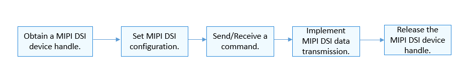

# Usage Guidelines<a name="EN-US_TOPIC_0000001063082539"></a>

-   [How to Use](#section8982671284)
-   [Obtaining a MIPI DSI Device Handle](#section57982569176)
-   [Setting MIPI DSI Configuration Parameters](#section5935410201815)
-   [Sending/Receiving the Pointer to a Command](#section611661316194)
-   [Releasing the MIPI DSI Device Handle](#section217313211199)

## How to Use<a name="section8982671284"></a>

[Figure 1](#fig99821771782)  shows the process of using a MIPI DSI device.

**Figure  1**  Process of using a MIPI DSI device<a name="fig99821771782"></a>  




## Obtaining a MIPI DSI Device Handle<a name="section57982569176"></a>

Before performing MIPI DSI communication, obtain a MIPI DSI device handle by calling  **MipiDsiOpen**. This function returns a MIPI DSI device handle with a specified channel ID.

DevHandle MipiDsiOpen\(uint8\_t id\);

**Table  1**  Description of  **MipiDsiOpen**

<a name="table7603619123820"></a>
<table><tbody><tr id="row1060351914386"><td class="cellrowborder" valign="top" width="20.66%"><p id="p14603181917382"><a name="p14603181917382"></a><a name="p14603181917382"></a><strong id="b127115222160"><a name="b127115222160"></a><a name="b127115222160"></a>Parameter</strong></p>
</td>
<td class="cellrowborder" valign="top" width="79.34%"><p id="p36031519183819"><a name="p36031519183819"></a><a name="p36031519183819"></a><strong id="b12111625171611"><a name="b12111625171611"></a><a name="b12111625171611"></a>Description</strong></p>
</td>
</tr>
<tr id="row960361918383"><td class="cellrowborder" valign="top" width="20.66%"><p id="p8603161903818"><a name="p8603161903818"></a><a name="p8603161903818"></a>id</p>
</td>
<td class="cellrowborder" valign="top" width="79.34%"><p id="p19603111916381"><a name="p19603111916381"></a><a name="p19603111916381"></a>MIPI DSI channel ID.</p>
</td>
</tr>
<tr id="row11410612183019"><td class="cellrowborder" valign="top" width="20.66%"><p id="p460381915385"><a name="p460381915385"></a><a name="p460381915385"></a><strong id="b9229153001619"><a name="b9229153001619"></a><a name="b9229153001619"></a>Return Value</strong></p>
</td>
<td class="cellrowborder" valign="top" width="79.34%"><p id="p96031619153812"><a name="p96031619153812"></a><a name="p96031619153812"></a><strong id="b43821314163"><a name="b43821314163"></a><a name="b43821314163"></a>Description</strong></p>
</td>
</tr>
<tr id="row15410111273017"><td class="cellrowborder" valign="top" width="20.66%"><p id="p1060418195389"><a name="p1060418195389"></a><a name="p1060418195389"></a>NULL</p>
</td>
<td class="cellrowborder" valign="top" width="79.34%"><p id="p760471912388"><a name="p760471912388"></a><a name="p760471912388"></a>Failed to obtain the MIPI DSI channel ID.</p>
</td>
</tr>
<tr id="row1241081213303"><td class="cellrowborder" valign="top" width="20.66%"><p id="p5604719133811"><a name="p5604719133811"></a><a name="p5604719133811"></a>Device handle</p>
</td>
<td class="cellrowborder" valign="top" width="79.34%"><p id="p3604181933818"><a name="p3604181933818"></a><a name="p3604181933818"></a>MIPI DSI device handle with a specified channel ID, whose data type is <strong id="b158631048122512"><a name="b158631048122512"></a><a name="b158631048122512"></a>DevHandle</strong>.</p>
</td>
</tr>
</tbody>
</table>

The following example shows how to obtain a MIPI DSI device handle with the channel ID  **0**:

```
DevHandle mipiDsiHandle = NULL;  /* Device handle */
chnId = 0;      /* MIPI DSI channel ID */

/* Obtain the MIPI DSI device handle based on a specified channel ID. */
mipiDsiHandle = MipiDsiOpen(chnId);
if (mipiDsiHandle == NULL) {
    HDF_LOGE("MipiDsiOpen: failed\n");
    return;
}
```

## Setting MIPI DSI Configuration Parameters<a name="section5935410201815"></a>

-   Set MIPI DSI configuration parameters by calling the following function:

int32\_t MipiDsiSetCfg\(DevHandle handle, struct MipiCfg \*cfg\);

**Table  2**  Description of  **MipiDsiSetCfg**

<a name="table10692555281"></a>
<table><tbody><tr id="row116914559288"><td class="cellrowborder" valign="top" width="50%"><p id="p1169195516288"><a name="p1169195516288"></a><a name="p1169195516288"></a><strong id="b18282183616165"><a name="b18282183616165"></a><a name="b18282183616165"></a>Parameter</strong></p>
</td>
<td class="cellrowborder" valign="top" width="50%"><p id="p769125512286"><a name="p769125512286"></a><a name="p769125512286"></a><strong id="b1770203718165"><a name="b1770203718165"></a><a name="b1770203718165"></a>Description</strong></p>
</td>
</tr>
<tr id="row4691155142812"><td class="cellrowborder" valign="top" width="50%"><p id="p66935515288"><a name="p66935515288"></a><a name="p66935515288"></a>handle</p>
</td>
<td class="cellrowborder" valign="top" width="50%"><p id="p863714348217"><a name="p863714348217"></a><a name="p863714348217"></a>MIPI DSI device handle</p>
</td>
</tr>
<tr id="row469145572817"><td class="cellrowborder" valign="top" width="50%"><p id="p46915519287"><a name="p46915519287"></a><a name="p46915519287"></a>cfg</p>
</td>
<td class="cellrowborder" valign="top" width="50%"><p id="p76995518289"><a name="p76995518289"></a><a name="p76995518289"></a>Pointer to MIPI DSI configuration parameters</p>
</td>
</tr>
<tr id="row16913554284"><td class="cellrowborder" valign="top" width="50%"><p id="p16955512812"><a name="p16955512812"></a><a name="p16955512812"></a><strong id="b9135133920167"><a name="b9135133920167"></a><a name="b9135133920167"></a>Return Value</strong></p>
</td>
<td class="cellrowborder" valign="top" width="50%"><p id="p206945502813"><a name="p206945502813"></a><a name="p206945502813"></a><strong id="b27391139191610"><a name="b27391139191610"></a><a name="b27391139191610"></a>Description</strong></p>
</td>
</tr>
<tr id="row146914556283"><td class="cellrowborder" valign="top" width="50%"><p id="p669175582818"><a name="p669175582818"></a><a name="p669175582818"></a>0</p>
</td>
<td class="cellrowborder" valign="top" width="50%"><p id="p169205511283"><a name="p169205511283"></a><a name="p169205511283"></a>Succeeded in setting MIPI DSI configuration parameters.</p>
</td>
</tr>
<tr id="row5694558283"><td class="cellrowborder" valign="top" width="50%"><p id="p269175516286"><a name="p269175516286"></a><a name="p269175516286"></a>Negative value</p>
</td>
<td class="cellrowborder" valign="top" width="50%"><p id="p11691554280"><a name="p11691554280"></a><a name="p11691554280"></a>Failed to set MIPI DSI configuration parameters.</p>
</td>
</tr>
</tbody>
</table>

```
int32_t ret;
struct MipiCfg cfg = {0};

/* Configuration parameters of the connected device are as follows: */
cfg.lane = DSI_4_LANES;
cfg.mode = DSI_CMD_MODE;
cfg.burstMode = VIDEO_NON_BURST_MODE_SYNC_EVENTS;
cfg.format = FORMAT_RGB_24_BIT;
cfg.pixelClk = 174;
cfg.phyDataRate = 384;
cfg.timingInfo.hsaPixels = 50;
cfg.timingInfo.hbpPixels = 55;
cfg.timingInfo.hlinePixels = 1200;
cfg.timingInfo.yResLines = 1800;
cfg.timingInfo.vbpLines = 33;
cfg.timingInfo.vsaLines = 76;
cfg.timingInfo.vfpLines = 120;
cfg.timingInfo.xResPixels = 1342;
/* Set MIPI DSI configuration parameters. */
ret = MipiDsiSetCfg(g_handle, &cfg);
if (ret != 0) {
    HDF_LOGE("%s: SetMipiCfg fail! ret=%d\n", __func__, ret);
    return -1;
}
```

-   Obtain MIPI DSI configuration parameters by calling the following function:

int32\_t MipiDsiGetCfg\(DevHandle handle, struct MipiCfg \*cfg\);

**Table  3**  Description of  **MipiDsiGetCfg**

<a name="table7709554280"></a>
<table><tbody><tr id="row670115515282"><td class="cellrowborder" valign="top" width="50%"><p id="p470205515287"><a name="p470205515287"></a><a name="p470205515287"></a><strong id="b61824871614"><a name="b61824871614"></a><a name="b61824871614"></a>Parameter</strong></p>
</td>
<td class="cellrowborder" valign="top" width="50%"><p id="p270755162817"><a name="p270755162817"></a><a name="p270755162817"></a><strong id="b581511487162"><a name="b581511487162"></a><a name="b581511487162"></a>Description</strong></p>
</td>
</tr>
<tr id="row57014555286"><td class="cellrowborder" valign="top" width="50%"><p id="p11701155172815"><a name="p11701155172815"></a><a name="p11701155172815"></a>handle</p>
</td>
<td class="cellrowborder" valign="top" width="50%"><p id="p57015510283"><a name="p57015510283"></a><a name="p57015510283"></a>MIPI DSI device handle</p>
</td>
</tr>
<tr id="row1870155192815"><td class="cellrowborder" valign="top" width="50%"><p id="p137115572815"><a name="p137115572815"></a><a name="p137115572815"></a>cfg</p>
</td>
<td class="cellrowborder" valign="top" width="50%"><p id="p771195522818"><a name="p771195522818"></a><a name="p771195522818"></a>Pointer to MIPI DSI configuration parameters</p>
</td>
</tr>
<tr id="row12718555283"><td class="cellrowborder" valign="top" width="50%"><p id="p1871175515289"><a name="p1871175515289"></a><a name="p1871175515289"></a><strong id="b676085015168"><a name="b676085015168"></a><a name="b676085015168"></a>Return Value</strong></p>
</td>
<td class="cellrowborder" valign="top" width="50%"><p id="p771955182813"><a name="p771955182813"></a><a name="p771955182813"></a><strong id="b1211175181616"><a name="b1211175181616"></a><a name="b1211175181616"></a>Description</strong></p>
</td>
</tr>
<tr id="row1071155582812"><td class="cellrowborder" valign="top" width="50%"><p id="p6718551282"><a name="p6718551282"></a><a name="p6718551282"></a>0</p>
</td>
<td class="cellrowborder" valign="top" width="50%"><p id="p171195516285"><a name="p171195516285"></a><a name="p171195516285"></a>Succeeded in obtaining MIPI DSI configuration parameters.</p>
</td>
</tr>
<tr id="row97135519282"><td class="cellrowborder" valign="top" width="50%"><p id="p11711355162815"><a name="p11711355162815"></a><a name="p11711355162815"></a>Negative value</p>
</td>
<td class="cellrowborder" valign="top" width="50%"><p id="p77116555286"><a name="p77116555286"></a><a name="p77116555286"></a>Failed to obtain MIPI DSI configuration parameters.</p>
</td>
</tr>
</tbody>
</table>

```
int32_t ret;
struct MipiCfg cfg;
memset(&cfg, 0, sizeof(struct MipiCfg));
ret = MipiDsiGetCfg(g_handle, &cfg);
if (ret != HDF_SUCCESS) {
    HDF_LOGE("%s: GetMipiCfg fail!\n", __func__);
    return HDF_FAILURE;
}
```

## Sending/Receiving the Pointer to a Command<a name="section611661316194"></a>

-   Send the pointer to a specified command by calling the following function:

int32\_t MipiDsiTx\(PalHandle handle, struct DsiCmdDesc \*cmd\);

**Table  4**  Description of  **MipiDsiTx**

<a name="table1018490043"></a>
<table><tbody><tr id="row31848013417"><td class="cellrowborder" valign="top" width="50%"><p id="p1415816132411"><a name="p1415816132411"></a><a name="p1415816132411"></a><strong id="b09541456151614"><a name="b09541456151614"></a><a name="b09541456151614"></a>Parameter</strong></p>
</td>
<td class="cellrowborder" valign="top" width="50%"><p id="p11158111316410"><a name="p11158111316410"></a><a name="p11158111316410"></a><strong id="b18998185701614"><a name="b18998185701614"></a><a name="b18998185701614"></a>Description</strong></p>
</td>
</tr>
<tr id="row10184701945"><td class="cellrowborder" valign="top" width="50%"><p id="p104891871157"><a name="p104891871157"></a><a name="p104891871157"></a>handle</p>
</td>
<td class="cellrowborder" valign="top" width="50%"><p id="p204891671156"><a name="p204891671156"></a><a name="p204891671156"></a>MIPI DSI device handle</p>
</td>
</tr>
<tr id="row928111518418"><td class="cellrowborder" valign="top" width="50%"><p id="p4282955412"><a name="p4282955412"></a><a name="p4282955412"></a>cmd</p>
</td>
<td class="cellrowborder" valign="top" width="50%"><p id="p7282752412"><a name="p7282752412"></a><a name="p7282752412"></a>Pointer to the command to be sent</p>
</td>
</tr>
<tr id="row17393154515328"><td class="cellrowborder" valign="top" width="50%"><p id="p8158313248"><a name="p8158313248"></a><a name="p8158313248"></a><strong id="b76771159141618"><a name="b76771159141618"></a><a name="b76771159141618"></a>Return Value</strong></p>
</td>
<td class="cellrowborder" valign="top" width="50%"><p id="p161591413741"><a name="p161591413741"></a><a name="p161591413741"></a><strong id="b124237015172"><a name="b124237015172"></a><a name="b124237015172"></a>Description</strong></p>
</td>
</tr>
<tr id="row339324593215"><td class="cellrowborder" valign="top" width="50%"><p id="p103191916578"><a name="p103191916578"></a><a name="p103191916578"></a>0</p>
</td>
<td class="cellrowborder" valign="top" width="50%"><p id="p1231981611712"><a name="p1231981611712"></a><a name="p1231981611712"></a>Succeeded in sending the specified command.</p>
</td>
</tr>
<tr id="row15393184519323"><td class="cellrowborder" valign="top" width="50%"><p id="p531916166716"><a name="p531916166716"></a><a name="p531916166716"></a>Negative value</p>
</td>
<td class="cellrowborder" valign="top" width="50%"><p id="p93191161174"><a name="p93191161174"></a><a name="p93191161174"></a>Failed to send the specified command.</p>
</td>
</tr>
</tbody>
</table>

```
int32_t ret;
struct DsiCmdDesc *cmd = OsalMemCalloc(sizeof(struct DsiCmdDesc));
if (cmd == NULL) {
    return HDF_FAILURE;
}
cmd->dtype = DTYPE_DCS_WRITE;
cmd->dlen = 1;
cmd->payload = OsalMemCalloc(sizeof(uint8_t));
if (cmd->payload == NULL) {
    HdfFree(cmd);
    return HDF_FAILURE;
}
*(cmd->payload) = DTYPE_GEN_LWRITE;
MipiDsiSetLpMode(mipiHandle);
ret = MipiDsiTx(mipiHandle, cmd);
MipiDsiSetHsMode(mipiHandle);
if (ret != HDF_SUCCESS) {
    HDF_LOGE("%s: PalMipiDsiTx fail! ret=%d\n", __func__, ret);
    HdfFree(cmd->payload);
    HdfFree(cmd);
    return HDF_FAILURE;
}
HdfFree(cmd->payload);
HdfFree(cmd);
```

-   Receive a specified command by calling the following function:

int32\_t MipiDsiRx\(DevHandle handle, struct DsiCmdDesc \*cmd, uint32\_t readLen, uint8\_t \*out\);

**Table  5**  Description of  **MipiDsiRx**

<a name="table223910318361"></a>
<table><tbody><tr id="row924033173613"><td class="cellrowborder" valign="top" width="50%"><p id="p16240143143611"><a name="p16240143143611"></a><a name="p16240143143611"></a><strong id="b1556438181718"><a name="b1556438181718"></a><a name="b1556438181718"></a>Parameter</strong></p>
</td>
<td class="cellrowborder" valign="top" width="50%"><p id="p32401031113610"><a name="p32401031113610"></a><a name="p32401031113610"></a><strong id="b18384199101716"><a name="b18384199101716"></a><a name="b18384199101716"></a>Description</strong></p>
</td>
</tr>
<tr id="row024043193619"><td class="cellrowborder" valign="top" width="50%"><p id="p16231153542520"><a name="p16231153542520"></a><a name="p16231153542520"></a>handle</p>
</td>
<td class="cellrowborder" valign="top" width="50%"><p id="p122311535122518"><a name="p122311535122518"></a><a name="p122311535122518"></a>MIPI DSI device handle</p>
</td>
</tr>
<tr id="row192401331163613"><td class="cellrowborder" valign="top" width="50%"><p id="p8706172453614"><a name="p8706172453614"></a><a name="p8706172453614"></a>cmd</p>
</td>
<td class="cellrowborder" valign="top" width="50%"><p id="p0706424183610"><a name="p0706424183610"></a><a name="p0706424183610"></a>Pointer to the command to be received</p>
</td>
</tr>
<tr id="row12646535173616"><td class="cellrowborder" valign="top" width="50%"><p id="p16465359364"><a name="p16465359364"></a><a name="p16465359364"></a>readLen</p>
</td>
<td class="cellrowborder" valign="top" width="50%"><p id="p564617356360"><a name="p564617356360"></a><a name="p564617356360"></a>Length of the data to read.</p>
</td>
</tr>
<tr id="row919916426361"><td class="cellrowborder" valign="top" width="50%"><p id="p11199942153616"><a name="p11199942153616"></a><a name="p11199942153616"></a>out</p>
</td>
<td class="cellrowborder" valign="top" width="50%"><p id="p91991042143618"><a name="p91991042143618"></a><a name="p91991042143618"></a>Pointer to the read data.</p>
</td>
</tr>
<tr id="row14240133143619"><td class="cellrowborder" valign="top" width="50%"><p id="p1723253542518"><a name="p1723253542518"></a><a name="p1723253542518"></a><strong id="b691111451711"><a name="b691111451711"></a><a name="b691111451711"></a>Return Value</strong></p>
</td>
<td class="cellrowborder" valign="top" width="50%"><p id="p223217356253"><a name="p223217356253"></a><a name="p223217356253"></a><strong id="b79702142175"><a name="b79702142175"></a><a name="b79702142175"></a>Description</strong></p>
</td>
</tr>
<tr id="row424093120369"><td class="cellrowborder" valign="top" width="50%"><p id="p1123203518257"><a name="p1123203518257"></a><a name="p1123203518257"></a>0</p>
</td>
<td class="cellrowborder" valign="top" width="50%"><p id="p62324353251"><a name="p62324353251"></a><a name="p62324353251"></a>Succeeded in receiving the specified command.</p>
</td>
</tr>
<tr id="row18241531153610"><td class="cellrowborder" valign="top" width="50%"><p id="p42321635122517"><a name="p42321635122517"></a><a name="p42321635122517"></a>Negative value</p>
</td>
<td class="cellrowborder" valign="top" width="50%"><p id="p323283510252"><a name="p323283510252"></a><a name="p323283510252"></a>Failed to receive the specified command.</p>
</td>
</tr>
</tbody>
</table>

```
int32_t ret;
uint8_t readVal = 0;

struct DsiCmdDesc *cmdRead = OsalMemCalloc(sizeof(struct DsiCmdDesc));
if (cmdRead == NULL) {
    return HDF_FAILURE;
}
cmdRead->dtype = DTYPE_DCS_READ;
cmdRead->dlen = 1;
cmdRead->payload = OsalMemCalloc(sizeof(uint8_t));
if (cmdRead->payload == NULL) {
    HdfFree(cmdRead);
    return HDF_FAILURE;
}
*(cmdRead->payload) = DDIC_REG_STATUS;
MipiDsiSetLpMode(g_handle);
ret = MipiDsiRx(g_handle, cmdRead, sizeof(readVal), &readVal);
MipiDsiSetHsMode(g_handle);
if (ret != HDF_SUCCESS) {
    HDF_LOGE("%s: MipiDsiRx fail! ret=%d\n", __func__, ret);
    HdfFree(cmdRead->payload);
    HdfFree(cmdRead);
    return HDF_FAILURE;
}
HdfFree(cmdRead->payload);
HdfFree(cmdRead);
```

## Releasing the MIPI DSI Device Handle<a name="section217313211199"></a>

After the MIPI DSI communication, release the MIPI DSI device handle by calling the following function:

void MipiDsiClose\(DevHandle handle\);

This function releases the resources requested by  **MipiDsiOpen**.

**Table  6**  Description of  **MipiDsiClose**

<a name="table72517953115"></a>
<table><thead align="left"><tr id="row1525793312"><th class="cellrowborder" valign="top" width="50%" id="mcps1.2.3.1.1"><p id="p115402031153111"><a name="p115402031153111"></a><a name="p115402031153111"></a><strong id="b1187425101719"><a name="b1187425101719"></a><a name="b1187425101719"></a>Parameter</strong></p>
</th>
<th class="cellrowborder" valign="top" width="50%" id="mcps1.2.3.1.2"><p id="p65406313319"><a name="p65406313319"></a><a name="p65406313319"></a><strong id="b1194611262170"><a name="b1194611262170"></a><a name="b1194611262170"></a>Description</strong></p>
</th>
</tr>
</thead>
<tbody><tr id="row1926109193116"><td class="cellrowborder" valign="top" width="50%" headers="mcps1.2.3.1.1 "><p id="p105419317318"><a name="p105419317318"></a><a name="p105419317318"></a>handle</p>
</td>
<td class="cellrowborder" valign="top" width="50%" headers="mcps1.2.3.1.2 "><p id="p132442255912"><a name="p132442255912"></a><a name="p132442255912"></a>MIPI DSI device handle</p>
</td>
</tr>
</tbody>
</table>

```
MipiDsiClose(mipiHandle); /* Release the MIPI DSI device handle */
```

