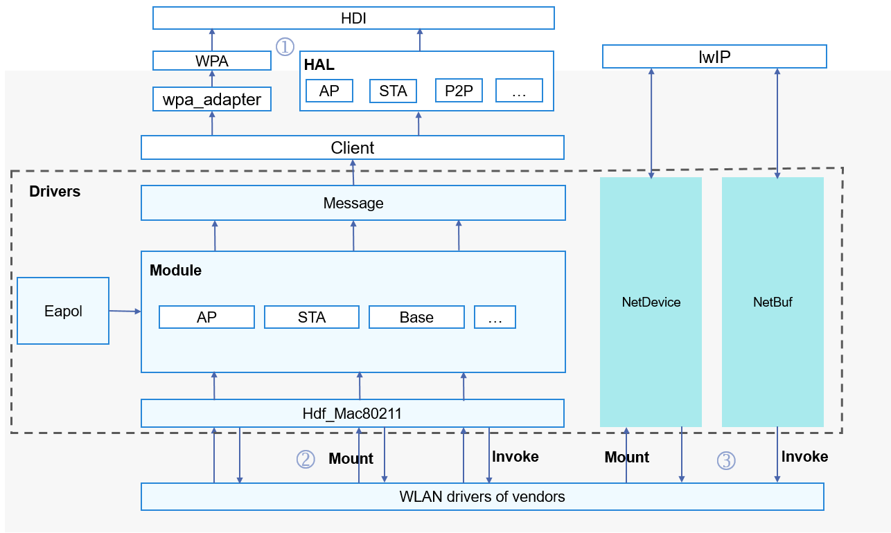

# WLAN Overview

-   [Introduction](#section23087361515)
-   [WLAN Driver API Architecture](#section1533192516212)
-   [Available APIs](#section87491484213)

## Introduction

The WLAN module is developed based on the Hardware Driver Foundation \(HDF\). It supports cross-OS migration, component adaptation, and modular assembly and compilation. Based on the unified APIs provided by the WLAN module, driver developers of WLAN vendors can adapt their driver code and are capable of creating, disabling, scanning, and connecting to WLAN hotspots. The WLAN driver provides the Hardware Driver Interface \(HDI\) layer with the capabilities of setting and obtaining the device MAC address and setting the transmit power. The following figure shows the framework of the  [WLAN module](#fig967034316227):

**Figure  1**  WLAN framework  

## WLAN Driver API Architecture

The WLAN module provides the following three types of APIs:

1. Capability APIs for the HDI layer

2. Capability APIs directly invoked by drivers

3. Capability APIs for vendors

**Figure  2**  Available APIs of the WLAN module  

## Available APIs

The WLAN driver module provides APIs that can be directly called by driver developers, such as creating/releasing a  **WifiModule**, connecting to/disconnecting from a WLAN hotspot, applying for/releasing a  **NetBuf**, and converting between the  **pbuf**  structure of Lightweight IP \(lwIP\) and a  **NetBuf**.  [Table 1](#table1521573319472)  provides some APIs.

**Table  1**  APIs that can be directly called by driver developers

<table><thead align="left"><tr id="row121519334474"><th class="cellrowborder" valign="top" width="15.079999999999998%" id="mcps1.2.4.1.1">
File

</th>
<th class="cellrowborder" valign="top" width="60.33%" id="mcps1.2.4.1.2">
Function

</th>
<th class="cellrowborder" valign="top" width="24.59%" id="mcps1.2.4.1.3">
Description

</th>
</tr>
</thead>
<tbody><tr id="row112150333476"><td class="cellrowborder" rowspan="4" valign="top" width="15.079999999999998%" headers="mcps1.2.4.1.1 ">
wifi_module.h

</td>
<td class="cellrowborder" valign="top" width="60.33%" headers="mcps1.2.4.1.2 ">
struct WifiModule *WifiModuleCreate(const struct HdfConfigWifiModuleConfig *config);

</td>
<td class="cellrowborder" valign="top" width="24.59%" headers="mcps1.2.4.1.3 ">
Creates a <strong id="b17218103820131">WifiModule</strong>.

</td>
</tr>
<tr id="row112151233194714"><td class="cellrowborder" valign="top" headers="mcps1.2.4.1.1 ">
void WifiModuleDelete(struct WifiModule *module);

</td>
<td class="cellrowborder" valign="top" headers="mcps1.2.4.1.2 ">
Deletes and releases data of a <strong id="b17674114211319">WifiModule</strong>.

</td>
</tr>
<tr id="row1121533316475"><td class="cellrowborder" valign="top" headers="mcps1.2.4.1.1 ">
int32_t DelFeature(struct WifiModule *module, uint16_t featureType);

</td>
<td class="cellrowborder" valign="top" headers="mcps1.2.4.1.2 ">
Deletes a feature from a <strong id="b12747104710136">WifiModule</strong>.

</td>
</tr>
<tr id="row172153335473"><td class="cellrowborder" valign="top" headers="mcps1.2.4.1.1 ">
int32_t AddFeature(struct WifiModule *module, uint16_t featureType, struct WifiFeature *featureData);

</td>
<td class="cellrowborder" valign="top" headers="mcps1.2.4.1.2 ">
Adds a feature to a <strong id="b61351114111410">WifiModule</strong>.

</td>
</tr>
<tr id="row451796205011"><td class="cellrowborder" rowspan="4" valign="top" width="15.079999999999998%" headers="mcps1.2.4.1.1 ">
wifi_mac80211_ops.h

</td>
<td class="cellrowborder" valign="top" width="60.33%" headers="mcps1.2.4.1.2 ">
int32_t (*startAp)(NetDevice *netDev);

</td>
<td class="cellrowborder" valign="top" width="24.59%" headers="mcps1.2.4.1.3 ">
Starts an AP.

</td>
</tr>
<tr id="row5518663503"><td class="cellrowborder" valign="top" headers="mcps1.2.4.1.1 ">
int32_t (*stopAp)(NetDevice *netDev);

</td>
<td class="cellrowborder" valign="top" headers="mcps1.2.4.1.2 ">
Stops an AP.

</td>
</tr>
<tr id="row851915617503"><td class="cellrowborder" valign="top" headers="mcps1.2.4.1.1 ">
int32_t (*connect)(NetDevice *netDev, WifiConnectParams *param);

</td>
<td class="cellrowborder" valign="top" headers="mcps1.2.4.1.2 ">
Connects to a hotspot.

</td>
</tr>
<tr id="row18519136185016"><td class="cellrowborder" valign="top" headers="mcps1.2.4.1.1 ">
int32_t (*disconnect)(NetDevice *netDev, uint16_t reasonCode);

</td>
<td class="cellrowborder" valign="top" headers="mcps1.2.4.1.2 ">
Disconnects from a hotspot.

</td>
</tr>
<tr id="row176421942125016"><td class="cellrowborder" rowspan="5" valign="top" width="15.079999999999998%" headers="mcps1.2.4.1.1 ">
hdf_netbuf.h

</td>
<td class="cellrowborder" valign="top" width="60.33%" headers="mcps1.2.4.1.2 ">
static inline void NetBufQueueInit(struct NetBufQueue *q);

</td>
<td class="cellrowborder" valign="top" width="24.59%" headers="mcps1.2.4.1.3 ">
Initializes a <strong id="b8331245144114">NetBuf</strong> queue.

</td>
</tr>
<tr id="row664264225020"><td class="cellrowborder" valign="top" headers="mcps1.2.4.1.1 ">
struct NetBuf *NetBufAlloc(uint32_t size);

</td>
<td class="cellrowborder" valign="top" headers="mcps1.2.4.1.2 ">
Applies for a <strong id="b15893135016416">NetBuf</strong>.

</td>
</tr>
<tr id="row19642134215018"><td class="cellrowborder" valign="top" headers="mcps1.2.4.1.1 ">
void NetBufFree(struct NetBuf *nb);

</td>
<td class="cellrowborder" valign="top" headers="mcps1.2.4.1.2 ">
Releases a <strong id="b87021256204112">NetBuf</strong>.

</td>
</tr>
<tr id="row7643194215013"><td class="cellrowborder" valign="top" headers="mcps1.2.4.1.1 ">
struct NetBuf *Pbuf2NetBuf(const struct NetDevice *netdev, struct pbuf *lwipBuf);

</td>
<td class="cellrowborder" valign="top" headers="mcps1.2.4.1.2 ">
Converts the <strong id="b108101241316">pbuf</strong> structure of <strong id="b148154412318">lwIP</strong> to a <strong id="b8994115217371">NetBuf</strong>.

</td>
</tr>
<tr id="row7657132317518"><td class="cellrowborder" valign="top" headers="mcps1.2.4.1.1 ">
struct pbuf *NetBuf2Pbuf(const struct NetBuf *nb);

</td>
<td class="cellrowborder" valign="top" headers="mcps1.2.4.1.2 ">
Converts a <strong id="b92856616388">NetBuf</strong> to the <strong id="b993215663110">pbuf</strong> structure of <strong id="b10933563310">lwIP</strong>.

</td>
</tr>
</tbody>
</table>

The WLAN driver module provides APIs for driver developers, such as initializing/deregistering, opening/stopping a  **NetDevice**, and obtaining the state of a  **NetDevice**.  [Table 2](#table74613501475)  provides some APIs.

**Table  2**  APIs for driver developers of WLAN vendors to implement

<table><thead align="left"><tr id="row194625016476"><th class="cellrowborder" valign="top" width="20.75%" id="mcps1.2.4.1.1">
File

</th>
<th class="cellrowborder" valign="top" width="52.75%" id="mcps1.2.4.1.2">
Function

</th>
<th class="cellrowborder" valign="top" width="26.5%" id="mcps1.2.4.1.3">
Description

</th>
</tr>
</thead>
<tbody><tr id="row04616509472"><td class="cellrowborder" rowspan="6" valign="top" width="20.75%" headers="mcps1.2.4.1.1 ">
net_device.h

</td>
<td class="cellrowborder" valign="top" width="52.75%" headers="mcps1.2.4.1.2 ">
int32_t (*init)(struct NetDevice *netDev);

</td>
<td class="cellrowborder" valign="top" width="26.5%" headers="mcps1.2.4.1.3 ">
Initializes a <strong id="b1947112374310">NetDevice</strong>.

</td>
</tr>
<tr id="row1546250114713"><td class="cellrowborder" valign="top" headers="mcps1.2.4.1.1 ">
struct NetDevStats *(*getStats)(struct NetDevice *netDev);

</td>
<td class="cellrowborder" valign="top" headers="mcps1.2.4.1.2 ">
Obtains the state of a <strong id="b4952125574216">NetDevice</strong>.

</td>
</tr>
<tr id="row1646165010470"><td class="cellrowborder" valign="top" headers="mcps1.2.4.1.1 ">
int32_t (*setMacAddr)(struct NetDevice *netDev, void *addr);

</td>
<td class="cellrowborder" valign="top" headers="mcps1.2.4.1.2 ">
Sets the MAC address.

</td>
</tr>
<tr id="row12471250184711"><td class="cellrowborder" valign="top" headers="mcps1.2.4.1.1 ">
void (*deInit)(struct NetDevice *netDev);

</td>
<td class="cellrowborder" valign="top" headers="mcps1.2.4.1.2 ">
Deinitializes a <strong id="b18383143517427">NetDevice</strong>.

</td>
</tr>
<tr id="row13471050104719"><td class="cellrowborder" valign="top" headers="mcps1.2.4.1.1 ">
int32_t (*open)(struct NetDevice *netDev);

</td>
<td class="cellrowborder" valign="top" headers="mcps1.2.4.1.2 ">
Opens a <strong id="b226313919425">NetDevice</strong>.

</td>
</tr>
<tr id="row1747125054714"><td class="cellrowborder" valign="top" headers="mcps1.2.4.1.1 ">
int32_t (*stop)(struct NetDevice *netDev);

</td>
<td class="cellrowborder" valign="top" headers="mcps1.2.4.1.2 ">
Stops a <strong id="b81039430429">NetDevice</strong>.

</td>
</tr>
</tbody>
</table>

The WLAN driver provides the HDI layer with the APIs for creating and destroying an  **IWiFi**  object and setting the MAC address.  [Table 3](#table141076311618)  provides some APIs.

**Table  3**  APIs provided by the WLAN HAL module

<table><thead align="left"><tr id="row010716312120"><th class="cellrowborder" valign="top" width="15.950000000000001%" id="mcps1.2.4.1.1">
Header File

</th>
<th class="cellrowborder" valign="top" width="59.46%" id="mcps1.2.4.1.2">
Function

</th>
<th class="cellrowborder" valign="top" width="24.59%" id="mcps1.2.4.1.3">
Description

</th>
</tr>
</thead>
<tbody><tr id="row41077311218"><td class="cellrowborder" rowspan="4" valign="top" width="15.950000000000001%" headers="mcps1.2.4.1.1 ">
wifi_hal.h

</td>
<td class="cellrowborder" valign="top" width="59.46%" headers="mcps1.2.4.1.2 ">
int32_t WifiConstruct(struct IWiFi **wifiInstance);

</td>
<td class="cellrowborder" valign="top" width="24.59%" headers="mcps1.2.4.1.3 ">
Creates an <strong id="b218481014265">IWiFi</strong> object with basic capabilities.

</td>
</tr>
<tr id="row20108183110111"><td class="cellrowborder" valign="top" headers="mcps1.2.4.1.1 ">
int32_t WifiDestruct(struct IWiFi **wifiInstance);

</td>
<td class="cellrowborder" valign="top" headers="mcps1.2.4.1.2 ">
Destroys an <strong id="b1269381514265">IWiFi</strong> object.

</td>
</tr>
<tr id="row19108131417"><td class="cellrowborder" valign="top" headers="mcps1.2.4.1.1 ">
int32_t (*start)(struct IWiFi *);

</td>
<td class="cellrowborder" valign="top" headers="mcps1.2.4.1.2 ">
Creates a channel between the HAL and the driver and obtains the NIC supported by the driver.

</td>
</tr>
<tr id="row810803112116"><td class="cellrowborder" valign="top" headers="mcps1.2.4.1.1 ">
int32_t (*stop)(struct IWiFi *);

</td>
<td class="cellrowborder" valign="top" headers="mcps1.2.4.1.2 ">
Stops the channel between the HAL and the driver.

</td>
</tr>
<tr id="row91081731717"><td class="cellrowborder" rowspan="4" valign="top" width="15.950000000000001%" headers="mcps1.2.4.1.1 ">
wifi_hal_base_feature.h

</td>
<td class="cellrowborder" valign="top" width="59.46%" headers="mcps1.2.4.1.2 ">
int32_t (*getFeatureType)(const struct IWiFiBaseFeature *);

</td>
<td class="cellrowborder" valign="top" width="24.59%" headers="mcps1.2.4.1.3 ">
Obtains the feature type.

</td>
</tr>
<tr id="row161081931318"><td class="cellrowborder" valign="top" headers="mcps1.2.4.1.1 ">
int32_t (*setMacAddress)(const struct IWiFiBaseFeature *, unsigned char *, uint8_t);

</td>
<td class="cellrowborder" valign="top" headers="mcps1.2.4.1.2 ">
Sets the MAC address.

</td>
</tr>
<tr id="row191081631318"><td class="cellrowborder" valign="top" headers="mcps1.2.4.1.1 ">
int32_t (*getDeviceMacAddress)(const struct IWiFiBaseFeature *, unsigned char *, uint8_t);

</td>
<td class="cellrowborder" valign="top" headers="mcps1.2.4.1.2 ">
Obtains the device MAC address.

</td>
</tr>
<tr id="row21080317115"><td class="cellrowborder" valign="top" headers="mcps1.2.4.1.1 ">
int32_t (*setTxPower)(const struct IWiFiBaseFeature *, int32_t);

</td>
<td class="cellrowborder" valign="top" headers="mcps1.2.4.1.2 ">
Sets the transmit power.

</td>
</tr>
</tbody>
</table>

