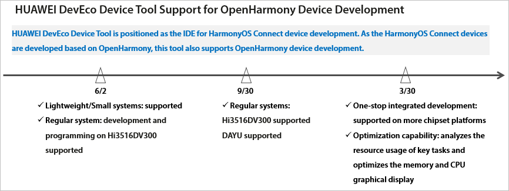

# IDE

-   [Acquiring the Device Development Tool \(HUAWEI DevEco Device Tool\)](#section2452141120244)
-   [Acquiring the Application Development Tool \(HUAWEI DevEco Studio\)](#section0904101019258)

## Acquiring the Device Development Tool \(HUAWEI DevEco Device Tool\)

HUAWEI DevEco Device Tool is a one-stop integrated development environment \(IDE\) provided to develop applications for OpenHarmony devices. It allows on-demand customization of OpenHarmony components, code editing, building, burning, and debugging, and supports C and C++ languages. This tool is installed in Visual Studio Code as a plug-in. For details, see  [HUAWEI DevEco Device Tool](https://device.harmonyos.com/en/ide)  and  [HUAWEI DevEco Device Tool User Guide](https://device.harmonyos.com/en/docs/ide/user-guides/service_introduction-0000001050166905).

The roadmap of Huawei DevEco Device Tool for supporting OpenHarmony device development is shown in the figure below.

## Acquiring the Application Development Tool \(HUAWEI DevEco Studio\)

HUAWEI DevEco Studio \(DevEco Studio for short\) is a one-stop IDE oriented to Huawei devices in all scenarios. It provides E2E OpenHarmony application development services, ranging from project template creation to development, building, debugging, and release. With DevEco Studio, you will be able to efficiently develop OpenHarmony applications with distributed capabilities while speeding up innovation. For details, see  [HUAWEI DevEco Studio](https://developer.harmonyos.com/en/develop/deveco-studio)  and  [HUAWEI DevEco Studio User Guide](https://developer.harmonyos.com/en/docs/documentation/doc-guides/tools_overview-0000001053582387).

