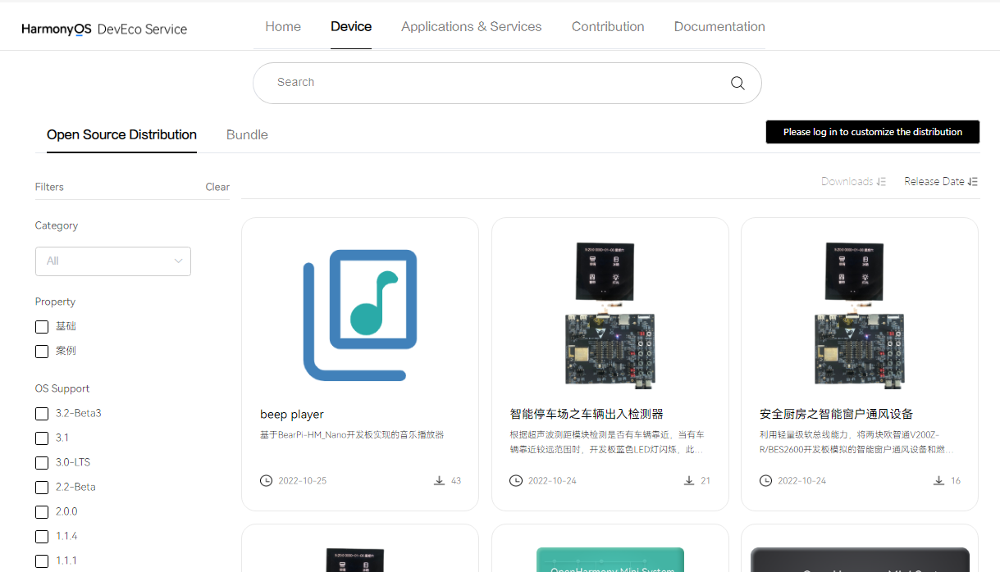
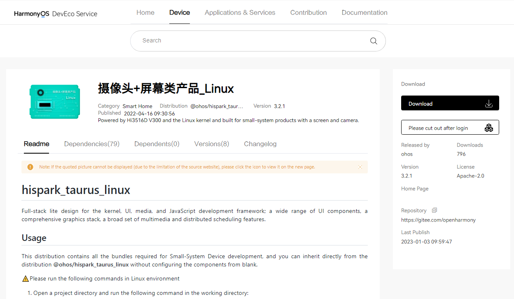
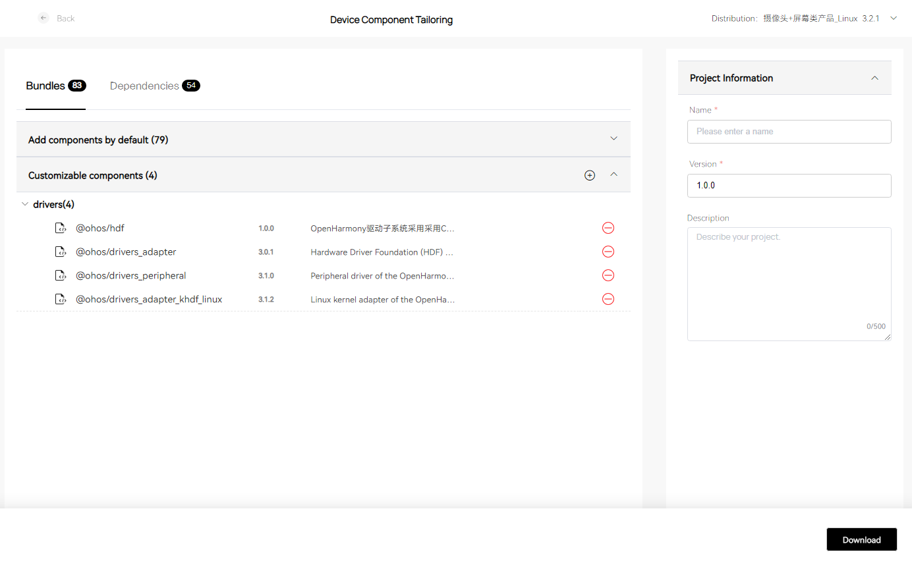

# Obtaining Source Code


## About OpenHarmony

OpenHarmony is an open source project launched by the OpenAtom Foundation. The purpose of this project is to build an open, distributed operating system (OS) framework for smart IoT devices in the full-scenario, full-connectivity, and full-intelligence era. 


The open source code repositories are available at [https://openharmony.gitee.com](https://openharmony.gitee.com).


## Overview of Source Code Acquisition

This document describes how to acquire OpenHarmony source code and provides its directory structure. The OpenHarmony source code is open to you as [HPM parts](../hpm-part/hpm-part-about.md), which can be obtained in any of the following ways:

- **Method 1**: Acquire the source code from the Gitee code repository. You can use the **repo** or **git** tool to download the latest code from the code repository.

- **Method 2**: Acquire the source code from [DevEco Marketplace](https://repo.harmonyos.com/#/en/home). Visit [DevEco Marketplace](https://repo.harmonyos.com/#/en/home), search for your desired open source distribution, and download the component list (or customize components and download the component list). Then use the **hpm-cli** tool to download and install the components and compilation toolchain on your local PC.

- **Method 3**: Download the compressed file of a distribution from a mirror site. This method provides a fast download speed, so you can also use this method for obtaining the source code of an earlier version.

- **Method 4**: Acquire the source code from the GitHub image repository. You can use the **repo** or **git** tool to download the latest code from the code repository.


## Method 1: Acquiring Source Code from the Gitee Code Repository


### When to Use

- You want to establish a baseline based on stable OpenHarmony releases and distribute the baseline to your customers.

- You have interconnected your software with OpenHarmony and need official certification from OpenHarmony.

- You want to contribute code to the OpenHarmony community after obtaining official OpenHarmony certification for chips, modules, and applications.

- You need to rectify OpenHarmony issues.

- You want to learn OpenHarmony source code.


### Prerequisites

1. Register your account with Gitee.

2. Register an SSH public key for access to Gitee.

3. Install the [Git client](https://git-scm.com/book/en/v2/Getting-Started-Installing-Git) and [git-lfs](https://gitee.com/vcs-all-in-one/git-lfs?_from=gitee_search#downloading), and configure basic user information.
  
   ```shell
   git config --global user.name "yourname"
   git config --global user.email "your-email-address"
   git config --global credential.helper store
   ```

4. Install the **repo** tool:

   In this example, **~/bin** is used as an example installation directory. You can change the directory as needed.
  
   ```shell
   mkdir ~/bin
   curl https://gitee.com/oschina/repo/raw/fork_flow/repo-py3 -o ~/bin/repo 
   chmod a+x ~/bin/repo
   pip3 install -i https://repo.huaweicloud.com/repository/pypi/simple requests
   ```

5. Add the path of the **repo** tool to environment variables.

   ```shell
   vim ~/.bashrc               # Edit environment variables.
   export PATH=~/bin:$PATH     # Add the path of the **repo** tool to the end of environment variables.
   source ~/.bashrc            # Apply environment variables.
   ```


### Procedure


> **NOTE**<br>
>
> Download the release code, which is more stable, if you want to develop commercial functionalities. Download the master code if you want to get quick access to the latest features for your development.

- **Obtaining OpenHarmony release code**

  For details about how to obtain the source code of an OpenHarmony release, see the [Release Notes](../../release-notes/Readme.md).

- **Obtaining OpenHarmony master code**
  
  Method 1 (recommended): Use the **repo** tool to download the source code over SSH. (You must have registered an SSH public key for access to Gitee.)
  
  ```shell
  repo init -u git@gitee.com:openharmony/manifest.git -b master --no-repo-verify
  repo sync -c
  repo forall -c 'git lfs pull'
  ```

  Method 2: Use the **repo** tool to download the source code over HTTPS.

  
  ```shell
  repo init -u https://gitee.com/openharmony/manifest.git -b master --no-repo-verify
  repo sync -c
  repo forall -c 'git lfs pull'
  ```


## Method 2: Acquiring Source Code from DevEco Marketplace


### When to Use

If OpenHarmony is new to you, sample solutions are helpful to your development. You can obtain an open source distribution from [DevEco Marketplace](https://repo.harmonyos.com/#/en/home), or customize a distribution by adding or deleting components of an open source distribution. Then use the **hpm-cli** tool to download and install the components and compilation toolchain on your local PC.


### Prerequisites

You must install **Node.js** and HPM on your local PC. The installation procedure is as follows:

1. Install **Node.js**.

   Download **Node.js** from its official website, and install it on your local PC.

   The [Node.js](https://nodejs.org/) version must be 12.x (including npm 6.14.4) or later. An LTS version is recommended.

2. Install the **hpm-cli** tool using **npm** delivered with **Node.js**.

   Open the CMD window, and run the following command:
     
   ```shell
   npm install -g @ohos/hpm-cli
   ```

3. Run the following command to check whether the installation is successful. If the HPM version is displayed, the installation is successful.
  
   ```shell
   hpm -V or hpm --version
   ```

4. Upgrade the HPM version as needed.
  
   ```shell
   npm update -g @ohos/hpm-cli
   ```


### Procedure

1. Search for distributions.
   1. Access [DevEco Marketplace](https://repo.harmonyos.com/#/en/home), and click **Device**. Then go to the **Open Source Distribution** page.
   2. Enter a keyword, for example, **camera**, in the search box. All matched distributions are displayed.
   3. Specify filter criteria, such as the OS, board, and kernel, to further filter the distributions.
   4. Find your desired distribution, and click it to view details.

         **Figure 1** HPM page

         

2. Learn more about the distribution.
   1. Read carefully the information about the distribution to learn its application scenarios, features, components, usage, and customization methods.
   2. Use either of the following modes to obtain the source code:
      - Click **Download** if you want to download the distribution to your local PC.
      - Click **Device component tailoring** if you want to add or delete components of the distribution.

         **Figure 2** Example distribution

         

3. Customize components.
   1. Access the **Device Component Tailoring** page.
   2. Add or delete components.
      - In the **Customizable Components** pane, click the plus sign. In the displayed dialog box, add required components.
      - In the **Customizable Components** pane, click the minus sign next to a component to delete it.
   3. Enter the basic information about your project, including the name, version, and description, on the right pane.
   4. Click **Download**. The system generates the OpenHarmony code structure file (for example, **my_cust_dist.zip**) and saves it to your local PC.

         **Figure 3** Customizing components

         

4. Install components.
   1. Decompress the downloaded code structure file using CMD on Windows (or shell in Linux).
   2. In the generated directory, run the **hpm install** command to download and install components. If the **Install successful** message is displayed, the command has been executed successfully.
   3. The downloaded components will be stored in the **ohos_bundles** folder under the project directory. (The source code of some components will be copied to a specified directory after the components are installed.)


## Method 3: Acquiring Source Code from a Mirror Site

To ensure the download performance, you are advised to download the source code or the corresponding solution from the image library of the respective site listed in the table below.

The table below provides only the sites for downloading the latest OpenHarmony LTS code. For details about how to obtain the source code of earlier versions, see the [Release Notes](../../release-notes/Readme.md).

  **Table 1** Sites for acquiring source code

| **LTS Code**| **Version**| **Site**| **SHA-256 Checksum**| **Software Package Size**|
| -------- | -------- | -------- | -------- | -------- |
| Full code base (for mini, small, and standard systems)| 3.0 | [Download](https://repo.huaweicloud.com/openharmony/os/3.0/code-v3.0-LTS.tar.gz) | [Download](https://repo.huaweicloud.com/openharmony/os/3.0/code-v3.0-LTS.tar.gz.sha256)| 7.0 GB |
| Standard system solution (binary)| 3.0 | [Download](https://repo.huaweicloud.com/openharmony/os/3.0/standard.tar.gz)| [Download](https://repo.huaweicloud.com/openharmony/os/3.0/standard.tar.gz.sha256)| 973.7 MB |
| Hi3861 solution (binary)| 3.0 | [Download](https://repo.huaweicloud.com/openharmony/os/3.0/hispark_pegasus.tar.gz)| [Download](https://repo.huaweicloud.com/openharmony/os/3.0/hispark_pegasus.tar.gz.sha256)| 16.5 MB |
| Hi3518 solution (binary)| 3.0 | [Download](https://repo.huaweicloud.com/openharmony/os/3.0/hispark_aries.tar.gz)| [Download](https://repo.huaweicloud.com/openharmony/os/3.0/hispark_aries.tar.gz.sha256)| 158.1 MB |
| Hi3516 solution-LiteOS (binary)| 3.0 | [Download](https://repo.huaweicloud.com/openharmony/os/3.0/hispark_taurus.tar.gz) | [Download](https://repo.huaweicloud.com/openharmony/os/3.0/hispark_taurus.tar.gz.sha256)| 248.9 MB |
| Hi3516 solution-Linux (binary)| 3.0 | [Download](https://repo.huaweicloud.com/openharmony/os/3.0/hispark_taurus_linux.tar.gz)| [Download](https://repo.huaweicloud.com/openharmony/os/3.0/hispark_taurus_linux.tar.gz.sha256) | 418.1 MB |
| RELEASE-NOTES | 3.0 | [Download](https://gitee.com/openharmony/docs/blob/OpenHarmony-3.0-LTS/en/release-notes/OpenHarmony-v3.0-LTS.md)| - | - |
| **Source Code of the Latest Release**| **Version**| **Site**| **SHA-256 Checksum**| **Software Package Size**|
| Full code base (for mini, small, and standard systems)       | 4.1 Release    | [Download](https://repo.huaweicloud.com/openharmony/os/4.1-Release/code-v4.1-Release.tar.gz)| [Download](https://repo.huaweicloud.com/openharmony/os/4.1-Release/code-v4.1-Release.tar.gz.sha256)| 31.6 GB |
| Hi3861 solution (binary)       | 4.1 Release    | [Download](https://repo.huaweicloud.com/openharmony/os/4.1-Release/hispark_pegasus.tar.gz)| [Download](https://repo.huaweicloud.com/openharmony/os/4.1-Release/hispark_pegasus.tar.gz.sha256)| 29.2 MB |
| Hi3516 solution-LiteOS (binary)| 4.1 Release    | [Download](https://repo.huaweicloud.com/openharmony/os/4.1-Release/hispark_taurus_LiteOS.tar.gz)| [Download](https://repo.huaweicloud.com/openharmony/os/4.1-Release/hispark_taurus_LiteOS.tar.gz.sha256) | 318.7 MB |
| Hi3516 solution-Linux (binary) | 4.1 Release    | [Download](https://repo.huaweicloud.com/openharmony/os/4.1-Release/hispark_taurus_Linux.tar.gz)| [Download](https://repo.huaweicloud.com/openharmony/os/4.1-Release/hispark_taurus_Linux.tar.gz.sha256)| 215.8 MB |
| RK3568 standard system solution (binary)       | 4.1 Release    | [Download](https://repo.huaweicloud.com/openharmony/os/4.1-Release/dayu200_standard_arm32.tar.gz)| [Download](https://repo.huaweicloud.com/openharmony/os/4.1-Release/dayu200_standard_arm32.tar.gz.sha256)| 8.4 GB |
| RELEASE-NOTES | 4.1 Release   | [Download](../../release-notes/OpenHarmony-v4.1-release.md)| - | - |
| **Compiler Toolchain**| **Version**| **Site**| **SHA-256 Checksum**| **Software Package Size**|
| Compiler toolchain| - | [Download](https://repo.huaweicloud.com/openharmony/os/2.0/tool_chain/)| - | - |


## Method 4: Acquiring Source Code from the GitHub Image Repository

> **NOTE**<br>
> The image repository is synchronized at 23:00 (UTC +8:00) every day.


Method 1 (recommended): Use the **repo** tool to download the source code over SSH. (You must have registered an SSH public key for access to GitHub. For details, see [Adding a new SSH key to your GitHub account](https://docs.github.com/en/authentication/connecting-to-github-with-ssh/adding-a-new-ssh-key-to-your-github-account).)

```shell
repo init -u git@github.com:openharmony/manifest.git -b master --no-repo-verify
repo sync -c
repo forall -c 'git lfs pull'
```

Method 2: Use the **repo** tool to download the source code over HTTPS.


```shell
repo init -u https://github.com/openharmony/manifest.git -b master --no-repo-verify
repo sync -c
repo forall -c 'git lfs pull'
```


## Source Code Directories

The following table describes the OpenHarmony source code directories.

  **Table 2** Source code directories

| **Directory**| **Description**|
| -------- | -------- |
| applications | Application samples, for example, **camera**.|
| base | Basic software service subsystem set and hardware service subsystem set.|
| build | Component-based compilation, building, and configuration scripts.|
| docs | Reference documents.|
| domains | Enhanced software service subsystem set.|
| drivers | Driver subsystem.|
| foundation | Basic system capability subsystem set.|
| kernel | Kernel subsystem.|
| prebuilts | Compiler and tool chain subsystem.|
| test | Test subsystem.|
| third_party | Open source third-party software.|
| utils | Commonly used development utilities.|
| vendor | Vendor-provided software.|
| build.py | Build script file.|

<!--no_check-->