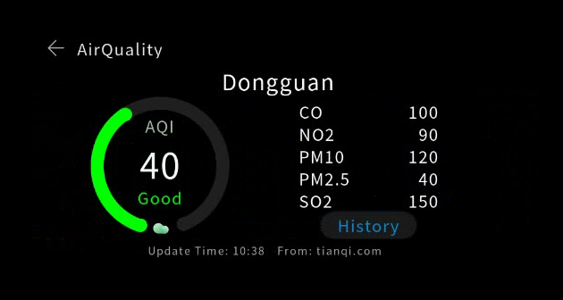
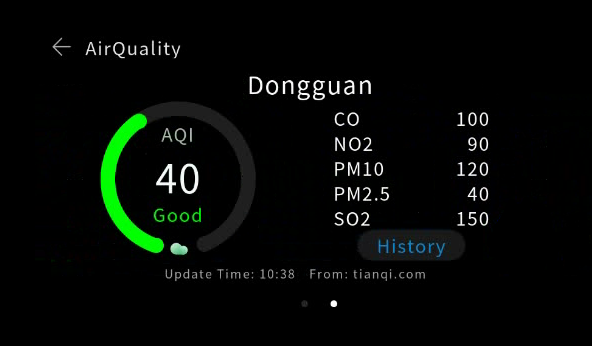

# Building the Home Page<a name="EN-US_TOPIC_0000001054927705"></a>

The application home page displays air quality information of different cities. The home page provides two screens \(for two information bars\), which can be added as required. Each screen displays the air quality information of one city, including the Air Quality Index \(AQI\), city name, pollution level, update time, and data source.

The home page of  [AirQuality](device-camera-visual-overview.md)  consists of three parts:

-   Title bar: displays the page title and provides an exit button. The title bar is fixed at the top of the page.
-   Information bar: displays air quality information. Multiple information bars can be added based on user requirements and support looping scroll.
-   Indicator bar: shows the position of the current screen among all screens. The indicator bar is fixed at the bottom of the page.

The following steps describe how to build the home page with a flexible layout that has three rows vertically arranged.

1.  Add a root  **<div\>**  to the  **.hml**  file. Note that each  **.hml**  file can contain only one root component. The sample code is as follows:

    ```
    <div class="container">
    </div>
    ```

    **class="container"**  indicates the style used by the component. The  **container**  is a style class defined in the  **index.css**  file.

    ```
    .container {    
        flex-direction: column;
        height: 480px;
        width: 960px;
    }
    ```

    The height and width of the root component  **<div\>**  are set in the style class. Note that the height and width must be explicitly specified \(except for some components, such as  **<text\>**\). Otherwise, the component may fail to display. In the  **container**  style class, the  **flex-direction**  attribute is set to  **column**, which means that child components of  **<div\>**  are vertically arranged from top to bottom for implementing the flexible page layout.

2.  Add the title bar. The title bar consists of an exit button and title text that are horizontally arranged. Add a  **<div\>**  to hold the title bar and set the  **flex-direction**  attribute to  **row**  to arrange the child components from left to right. Add an  **<image\>**  and a  **<text\>**  component in sequence. The sample code is as follows:

    ```
    <div class="container">    
        <div class="header" onclick="exitApp">        
            <image class="back" src="common/ic_back.png"></image>        
            <text class="title">            
                Air quality        
             </text>    
        </div>
    </div>
    ```

    Set component attributes, including the height, width, margin, and color.

    ```
    .header {    
        width: 960px;
        height: 72px;
    }
    .back {    
        width: 36px;
        height: 36px;
        margin-left: 39px;
        margin-top: 23px;
    }
    .title {    
        width: 296px;
        height: 40px;
        margin-top: 20px;
        margin-left: 21px;
        color: #e6e6e6;
    }
    ```

    In the  **.hml**  file,  **onclick="exitApp"**  sets the click event for the  **<div\>**  component. When the click event is triggered, the  **exitApp\(\)**  function is executed. The example definition of  **exitApp\(\)**  in  **index.js**  is as follows:

    ```
    exitApp() {  
        console.log('start exit');  
        app.terminate();  
        console.log('end exit');
    }
    ```

    The  **app.terminate\(\)**  function is used to exit the program. Before using this function, you must import the  **app**  module by adding the following code at the beginning of  **index.js**:

    ```
    import app from '@system.app'
    ```

    After the code is compiled, run the project on the simulator. The following figure shows the display effect.

    **Figure  1**  Title bar<a name="fig14273162465317"></a>  
    

3.  The  **<swiper\>**  component is required to implement the switching between screens.

    Add a  **<swiper\>**  to the root node.

    ```
    <div class="container">    
        <div class="header" onclick="exitApp">        
            <image class="back" src="common/ic_back.png"></image>        
            <text class="title">            
                Air quality        
            </text>    
        </div>    
        <swiper class="swiper" index="{{swiperPage}}" duration="500" onchange="swiperChange">
        </swiper>
    </div>
    ```

    -   Use  **class="**swiper**"**  to set the height and width of the component. The sample code is as follows:

        ```
        .swiper {
            height: 385px;
            width: 960px;
        }
        ```

    -   **index="\{\{swiperPage\}\}" duration="500" onchange="swiperChange"**  sets the component attribute and event.  **duration="500"**  indicates that the duration of the swiping animation is 500 ms.
    -   **index="\{\{swiperPage\}\}"**  specifies the index of the child component of  **<swiper\>**.  **\{\{swiperPage\}\}**  indicates that the index value is dynamically bound to the  **swiperPage**  variable in the JavaScript code. The index value changes with the  **swiperPage**  value.
    -   **onchange="swiperChange"**  binds the change event of the  **<swiper\>**  component to the  **swiperChange**  function. The JavaScript code is as follows:

        ```
        // Import the router module for page switching.
        import router from'@system.router'
        import app from '@system.app'
        
        export default {
            // Define parameters.
            data: {
              // By default, the first page is displayed.
              swiperPage: 0 
            },
            onInit () {
            },
            exitApp(){  
                console.log('start exit');  
                app.terminate();  
                console.log('end exit');
            },
            // Swiping event, which saves the index value of the current <swiper>. The index value is saved to the swiperPage variable each time a swiping occurs.
            swiperChange (e) {
                this.swiperPage = e.index;
            }
        }
        ```

4.  Set the information about a city to be displayed on a screen. On each screen, information of different types is displayed using different components.

    Add two  **<stack\>**  as child components \(directional layout\) to  **<swiper\>**. Add  **<text\>**,  **<image\>**,  **<progress\>**, and other components to each  **<stack\>**  to display the information. The following example shows the page structure:

    ```
     <swiper class="swiper" index="{{swiperPage}}" duration="500" onchange="swiperChange">
        <!-- The first screen -->
        <stack class="swiper">
             <text></text>------Air quality
            <text></text>------City name
            <progress></progress>-----Progress bar
            <image></image>-------A cloud image
            <text></text>--------AQI value
            <text>AQI</text>------AQI
            <div>--------AQI details
            </div>
            <div>--------Update time, website, and other information
            </div>
        </stack>
         <!-- The second screen -->
        <stack class="container">
            <text></text>
            <text></text>
            <progress></progress>
            <image></image>
            <text></text>
            <text></text>
            <div></div>    
        </stack>
    </swiper>
    ```

    After the code is compiled, the display effect on the simulator is as follows.

    **Figure  2**  Title bar and information bar<a name="fig177003454238"></a>  
    

5.  Add the indicator bar. Currently, the  **<swiper\>**  component does not support indicator settings. You need to implement a dots indicator by adding  **<div\>**  components and setting the style. Add a  **<div\>**  as a child component to the root node and set the style. Add two  **<div\>**  to the parent  **<div\>**, set  **border-radius**  for the two child  **<div\>**, and dynamically change the background colors of the  **<div\>**  components in the swiping event.

    ```
    <div class="images">    
        <div class="circle-div" style="background-color: {{iconcheckedColor}};"></div>    
        <div class="circle-div" style="background-color: {{iconUncheckedColor}};margin-left: 36px;"></div>
    </div>
    ```

    **Figure  3**  Indicator bar<a name="fig767374119496"></a>  
    

6.  Set the style, animation effect, and dynamic data binding for all components. The complete sample code is as follows:

    -   **index.hml**

    ```
    <div class="container">
        <div class="header" onclick="exitApp">
            <image class="back" src="common/ic_back.png"></image>
            <text class="title">
                AirQuality
            </text>
        </div>
        <swiper class="swiper" index="{{swiperPage}}" duration="500" onchange="swiperChange">
            <stack class="swiper">
                <text class="airquality" style="color:{{textColor1}};">{{airData[0].airQuality}}
                </text>
                <text class="location-text">{{airData[0].location}}
                </text>
                <progress class="circle-progress" style="color: {{textColor1}};background-Color: {{bgColor1}};" type="arc"
                        percent="{{percent1}}"></progress>
                <image class="image" src="{{src1}}"></image>
                <text class="aqi-value">{{airData[0].detailData}}
                </text>
                <text class="aqi">
                    AQI
                </text>
                <div class="detail">
                    <div class="text-wrapper">
                        <text class="gas-name">
                            CO
                        </text>
                        <text class="gas-value">
                            100
                        </text>
                    </div>
                    <div class="text-wrapper">
                        <text class="gas-name">
                            NO2
                        </text>
                        <text class="gas-value">
                            90
                        </text>
                    </div>
                    <div class="text-wrapper">
                        <text class="gas-name">
                            PM10
                        </text>
                        <text class="gas-value">
                            120
                        </text>
                    </div>
                    <div class="text-wrapper">
                        <text class="gas-name">
                            PM2.5
                        </text>
                        <text class="gas-value">
                            40
                        </text>
                    </div>
                    <div class="text-wrapper">
                        <text class="gas-name">
                            SO2
                        </text>
                        <text class="gas-value">
                            150
                        </text>
                    </div>
                    <input class="btn" type="button" onclick="openDetail" value=" History"></input>
                </div>
                <div class="footer">
                    <text class="update-time">
                        Update Time: 10:38
                    </text>
                    <text class="info-source">
                        From: tianqi.com
                    </text>
                </div>
            </stack>
            <stack class="swiper">
                <text class="airquality" style="color: {{textColor2}};">{{airData[1].airQuality}}
                </text>
                <text class="location-text">{{airData[1].location}}
                </text>
                <progress class="circle-progress" style="color: {{textColor2}};background-Color: {{bgColor2}};" type="arc"
                        percent="{{percent2}}"></progress>
                <image class="image" src="{{src2}}"></image>
                <text class="aqi-value">{{airData[1].detailData}}
                </text>
                <text class="aqi">
                    AQI
                </text>
                <div class="detail">
                    <div class="text-wrapper">
                        <text class="gas-name">
                            CO
                        </text>
                        <text class="gas-value">
                            10
                        </text>
                    </div>
                    <div class="text-wrapper">
                        <text class="gas-name">
                            NO2
                        </text>
                        <text class="gas-value">
                            50
                        </text>
                    </div>
                    <div class="text-wrapper">
                        <text class="gas-name">
                            PM10
                        </text>
                        <text class="gas-value">
                            60
                        </text>
                    </div>
                    <div class="text-wrapper">
                        <text class="gas-name">
                            PM2.5
                        </text>
                        <text class="gas-value">
                            40
                        </text>
                    </div>
                    <div class="text-wrapper">
                        <text class="gas-name">
                            SO2
                        </text>
                        <text class="gas-value">
                            150
                        </text>
                    </div>
                    <input class="btn" type="button" onclick="openDetail" value=" History"></input>
                </div>
                <div class="footer">
                    <text class="update-time">
                        Update Time: 10:38
                    </text>
                    <text class="info-source">
                        From: tianqi.com
                    </text>
                </div>
            </stack>
        </swiper>
        <div class="images">
            <div class="circle-div" style="background-color: {{iconcheckedColor}};"></div>
            <div class="circle-div" style="background-color: {{iconUncheckedColor}};margin-left: 36px;"></div>
        </div>
    </div>
    ```

    -   **index.css**

    A  **.css**  file contains many classes. Each class defines the position, size, font, color, and background color of a component. Each child component is added to its parent component, and the style file of the parent component affects how the child component will be displayed.

    ```
    .aqi-value {
        text-align: center;
        font-size: 65px;
        color: #f0ffff;
        width: 156px;
        height: 92px;
        top: 134px;
        left: 210px;
    }
    .aqi {
        text-align: center;
        color: #a2c4a2;
        width: 156px;
        height: 45px;
        top: 90px;
        left: 210px;
    }
    .airquality {
        top: 222px;
        text-align: center;
        width: 156px;
        height: 45px;
        left: 210px;
    }
    .image {
        top: 285px;
        left: 274px;
        width: 32px;
        height: 32px;
    }
    .location-text {
        text-align: center;
        color: #ffffff;
        width: 200px;
        height: 52px;
        font-size: 40px;
        left: 380px;
        top: 16px;
    }
    .container {
        flex-direction: column;
        height: 480px;
        width: 960px;
    }
    .circle-progress {
        center-x: 128px;
        center-y: 128px;
        radius: 128px;
        startAngle: 198;
        totalAngle: 320;
        strokeWidth: 24px;
        width: 256px;
        height: 256px;
        left: 160px;
        top: 58px;
    }
    .detail {
        width: 256px;
        height: 265px;
        left: 544px;
        top: 58px;
        flex-direction: column;
    }
    .text-wrapper {
        width: 256px;
        height: 35px;
        margin-top: 6px;
    }
    .gas-name {
        width: 128px;
        height: 35px;
        text-align: left;
    }
    .gas-value {
        width: 128px;
        height: 35px;
        text-align: right;
    }
    .btn {
        width: 180px;
        height: 50px;
        margin-top: 6px;
        margin-left: 38px;
        background-color: #1a1a1a;
        color: #1085CE;
    }
    .footer {
        top: 326px;
        width: 960px;
        height: 28px;
    }
    .header {
        width: 960px;
        height: 72px;
    }
    .back {
        width: 36px;
        height: 36px;
        margin-left: 39px;
        margin-top: 23px;
    }
    .title {
        width: 296px;
        height: 40px;
        margin-top: 20px;
        margin-left: 21px;
        color: #e6e6e6;
    }
    .swiper {
        height: 385px;
        width: 960px;
    }
    .images {
        width: 60px;
        height: 15px;
        margin-left: 450px;
    }
    .update-time {
        width: 480px;
        height: 28px;
        font-size: 20px;
        color: #A9A9A9;
        text-align: right;
    }
    .info-source {
        width: 450px;
        height: 28px;
        font-size: 20px;
        color: #A9A9A9;
        text-align: left;
        margin-left: 24px;
    }
    .circle-div {
        width: 12px;
        height: 12px;
        border-radius: 6px;
    }
    ```

    -   **index.js**

    A  **.js**  file is used to implement interaction logic of your application. In the  **.js**  file of the home page, implement page switching and enable text content and progress bar color to change dynamically according to AQI values.

    ```
    // Import router and app modules.
    import router from '@system.router'
    import app from '@system.app'
    
    export default {
        data: {
          // Bind data.
          textColor1: '#00ff00',
          textColor2: '#00ff00',
          bgColor1: '#669966',
          bgColor2: '#669966',
          swiperPage: 0,
          percent1: 40,
          percent2: 90,
          iconUncheckedColor: '#262626',
          iconcheckedColor: '#ffffff',
          iconcheckedBR: '6px',
          src1: 'common/cloud_green.png',
          src2: 'common/cloud_green.png',
          airData: [{
            location: 'Dongguan',
            airQuality: 'Good',
            detailData: 40
          }, {
            location: 'Shenzhen',
            airQuality: 'Polluted',
            detailData: 90
          }]
        },
        onInit () {
          // Set the font, background color, and background image for different value ranges.
          if(this.airData[0].detailData > 100){
            this.src1 = 'common/cloud_red.png';
            this.textColor1 = '#ff0000';
            this.bgColor1 = '#9d7462';
          } else if(50 < this.airData[0].detailData && this.airData[0].detailData <= 100){
            this.src1 = 'common/cloud_yellow.png';
            this.textColor1 = '#ecf19a';
            this.bgColor1 = '#9d9d62';
          }
          if(this.airData[1].detailData > 100){
            this.src2 = 'common/cloud_red.png';
            this.textColor2 = '#ff0000';
            this.bgColor2 = '#9d7462';
          } else if(50 < this.airData[1].detailData && this.airData[1].detailData <= 100){
            this.src2 = 'common/cloud_yellow.png';
            this.textColor2 = '#ecf19a';
            this.bgColor2 =  '#9d9d62';
          }
          if(this.selectedCityIndex){
            this.swiperPage = this.selectedCityIndex;
            if(this.swiperPage == 0){
              this.iconcheckedColor = '#ffffff';
              this.iconUncheckedColor = '#262626';
            }else{
              this.iconcheckedColor = '#262626';
              this.iconUncheckedColor = '#ffffff';
            }
          }
        },
        // Switch to the details page.
        openDetail () {
          router.replace({
            uri: 'pages/detail/detail',
            params: {selectedCityIndex:this.swiperPage}
          });
        },
        // Exit the application.
        exitApp(){
          console.log('start exit');
          app.terminate();
          console.log('end exit');
        },
        // Define the swiping event. Change the indicator dots when the user swipes the screen.
        swiperChange (e) {
          this.swiperPage = e.index;
          if(e.index == 0){
            this.iconcheckedColor = '#ffffff';
            this.iconUncheckedColor = '#262626';
          }else{
            this.iconcheckedColor = '#262626';
            this.iconUncheckedColor = '#ffffff';
          }
        }
    }
    ```


