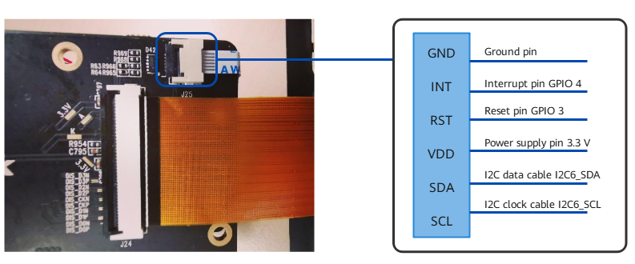

# Development Example for Peripheral Drivers<a name="EN-US_TOPIC_0000001157063303"></a>

## Overview<a name="section86753818426"></a>

This document describes how to develop a touchscreen driver on the Hi3516D V300 development board using the HDF input driver model, helping you quickly get started with OpenHarmony peripheral driver development.

### Hardware Resources<a name="section123071189431"></a>

The touchscreen integrated circuit \(IC\) provided by the Hi3516D V300 development board is GT911, which uses the standard inter-integrated circuit \(I2C\) to communicate with the development board and connects to the main board through the 6-pin flexible flat cable. The following figure shows the distribution of the 6 pins and their connection.



### Input Driver Model<a name="section53684425430"></a>

The input driver model mainly consists of the device manager, common drivers, and chip drivers.

-   Input device manager: provides various input device drivers with the APIs for registering or unregistering input devices and manages the input device list.
-   Input common driver: provides common drivers for initializing the board-level hardware, processing hardware interrupts, and registering input devices with the input device manager.
-   Input chip driver: calls differentiated APIs reserved by the input platform driver to minimize the workload for input chip driver development.

In addition, the input driver model implements functions for reporting input data and parsing input device configurations.

For details about the input driver model, see  [Touchscreen Overview](../driver/driver-peripherals-touch-des.md).

## Setting Up the Environment<a name="section661075474418"></a>

Follow the instructions in [Quick Start Overview](../quick-start/quickstart-overview.md).

> **NOTICE** 
>This development example applies to standard, small, and mini OpenHarmony systems. The following sections use the standard system as an example. You can refer to the specific guide for your system to set up the environment.

## Developing a Touchscreen Driver<a name="section15233162984520"></a>

Complete the following tasks to adapt a touchscreen IC based on the input driver model.

### Configuring Device Driver Descriptions<a name="section16761205604515"></a>

Configure the touchscreen driver description required for registering the driver with the HDF, for example, whether the driver is loaded and what is the loading priority.

You can configure the device driver description in the configuration file at **./drivers/adapter/khdf/linux/hcs/device\_info/device\_info.hcs**.

The **device\_info.hcs**  file contains all necessary information for registering drivers in the input driver model with the HDF. You do not need to make any modification for the information unless otherwise required in special scenarios. The private configuration data of each driver uses the **deviceMatchAttr**  field to match the **match\_attr**  field in the **input\_config.hcs**  file.

The input-related fields in the configuration file are as follows. For details about these fields, see  [Driver Development](../driver/driver-overview-foundation.md).

```
input :: host {
            hostName = "input_host";
            priority = 100;
            device_input_manager :: device {              // Specify the device driver description of the input device manager.
                device0 :: deviceNode {
                    policy = 2;                           // Services are released to both the kernel space and the user space.
                    priority = 100;                       // The default priority for the input device manager is 100.
                    preload = 0;                          // Load the driver.
                    permission = 0660;                    // Specify the permission for the driver to create device nodes.
                    moduleName = "HDF_INPUT_MANAGER";     // Match the moduleName in the driver entry structure.
                    serviceName = "hdf_input_host";       // Specify the device node name to be generated by the HDF.
                    deviceMatchAttr = "";                 // Leave this field empty because private configuration data is not required by the input device manager currently.
                }
            }

            device_hdf_touch :: device {                  // Specify the device driver description of the input common driver.
                device0 :: deviceNode {
                    policy = 2;                           // Services are released to both the kernel space and the user space.
                    priority = 120;                       // The default priority for the input common driver is 120.
                    preload = 0;                          // Load the driver.
                    permission = 0660;                    // Specify the permission for the driver to create device nodes.
                    moduleName = "HDF_TOUCH";             // Match the moduleName in the driver entry structure.
                    serviceName = "hdf_input_event1";     // Specify the device node name to be generated by the HDF.
                    deviceMatchAttr = "touch_device1";    // Keep this value the same as the match_attr value in the private configuration data.
                }
            }

            device_touch_chip :: device {                 // Specify the device description of the input chip driver.
                device0 :: deviceNode {
                    policy = 0;                           // Services are not released to the kernel space or the user space.
                    priority = 130;                       // The default priority for the input chip driver is 130.
                    preload = 0;                          // Load the driver.
                    permission = 0660;                    // Specify the permission for the driver to create device nodes.
                    moduleName = "HDF_TOUCH_GT911";       // Match the moduleName in the driver entry structure.
                    serviceName = "hdf_touch_gt911_service";// Specify the device node name to be generated by the HDF.
                    deviceMatchAttr = "zsj_gt911_5p5";    // Keep this value the same as the match_attr value in the private configuration data.
                }
            }
  }
```

Pay attention to the following fields in the configuration file:

**priority**: specifies the driver loading priority.

**preload**: specifies whether to load the driver.

**moduleName**: This value must be the same as the **moduleName**  value in the driver entry structure.

**serviceName**: This value is used by the HDF to create a device node name.

**deviceMatchAttr**: This value must be the same as the **match\_attr**  value in the private configuration data.

After the device descriptions are configured, the HDF matches the configuration with the code registered with the driver entry structure based on the **moduleName**  field, ensuring that drivers can be loaded properly. If multiple drivers are configured, the **priority**  field determines the loading sequence of each driver.

### Configuring the Touchscreen<a name="section156331030144617"></a>

The private data includes the power-on and power-off sequence, and the platform hardware information includes the GPIO port that connects the touchscreen to the main board.

You can configure the touchscreen in the configuration file at **./drivers/adapter/khdf/linux/hcs/input/input\_config.hcs**.

The **input\_config.hcs**  file consists of the private configuration data of both the common driver and chip driver. Information of this file is read and parsed by the driver code. The configuration in the file includes the board-level hardware information and private configuration of the touchscreen. You can tailor the configuration during your development.

```
root {                                                              
    input_config {
        touchConfig {
            touch0 {                                                 // Configure the first touchscreen.
                boardConfig {                                        // Specify the board-level hardware information.
                    match_attr = "touch_device1";                    // Keep this value the same as the match_attr field in the private configuration data of the input common driver in the device description.
                    inputAttr {
                        /* 0:touch 1:key 2:keyboard 3:mouse 4:button 5:crown 6:encoder */
                        inputType = 0;                               // Set the input type to touch.
                        solutionX = 480;                             // Set the resolution in the X-axis.
                        solutionY = 960;                             // Set the resolution in the Y-axis.
                        devName = "main_touch";                      // Set the device name.
                    }
                    busConfig {
                        /* 0:i2c 1:spi */
                        busType = 0;                                 // GT911 uses the I2C bus for communication.
                        busNum = 6;                                  // Use the sixth bus of the chip to communicate with the development board through I2C.
                        clkGpio = 86;                                // Set the SCL pin of the chip.
                        dataGpio = 87;                               // Set the SDA pin of the chip.
                        i2cClkIomux = [0x114f0048, 0x403];           // Configure the SCL pin information.
                        i2cDataIomux = [0x114f004c, 0x403];          // Configure the SDA pin information.
                    }
                    pinConfig {
                        rstGpio = 3;                                 // Set the reset pin.
                         intGpio = 4;                                 // Set the interrupt pin.
                        rstRegCfg = [0x112f0094, 0x400];             // Configure the reset pin information.
                        intRegCfg = [0x112f0098, 0x400];             // Configure the interrupt pin information.
                    }
                    powerConfig {
                        /* 0:unused 1:ldo 2:gpio 3:pmic */
                        vccType = 2;                                  // Set the VCC type. Value 2 indicates the GPIO power supply.
                        vccNum = 20;                                  // gpio20
                        vccValue = 1800;                              // Set the voltage amplitude to 1800 mV.
                        vciType = 1;                                  // Set the VCI type. Value 1 indicates the LDO power supply.
                        vciNum = 12;                                  // ldo12
                        vciValue = 3300;                              // Set the voltage amplitude to 3300 mV.
                    }

                    featureConfig {
                        capacitanceTest = 0;                          // Configure the capacitance test.
                        gestureMode = 0;                              // Configure the gesture mode.
                        gloverMode = 0;                               // Configure the gloves mode.
                        coverMode = 0;                                // Configure the cover mode.
                        chargerMode = 0;                              // Configure the charging mode.
                        knuckleMode = 0;                              // Configure the knuckle mode.
                    }
                }
                chipConfig {                                          // Configure the private data of the touchscreen chip.
                    template touchChip {                              // Set the template.
                        match_attr = "";
                        chipName = "gt911";                           // Set the touchscreen IC model.
                        vendorName = "zsj";                           // Set the vendor name.
                        chipInfo = "AAAA11222";                       // The first four characters indicate the product name. The fifth and sixth characters indicate the IC model. The last three characters indicate the chip model.
                        busType = 0;                                  // 0 indicates the I2C bus, and 1 indicates the SPI bus.
                        deviceAddr = 0x5D;                            // Set the IC communication address.
                        irqFlag = 2;                                  // Values 1 and 2 indicate that the interrupt is triggered on the rising and falling edges, respectively. Values 4 and 8 indicate that the interrupt is triggered by the high and low levels, respectively.
                        maxSpeed = 400;                               // Set the maximum communication rate to 400 Hz.
                        chipVersion = 0;                              // Set the touchscreen IC version.
                        powerSequence {
                             /* Power-on sequence is described as follows:
                               [Type, status, direction, delay]
                               <type> Value 0 indicates the power or pin is empty. Values 1 and 2 indicate the VCC (1.8 V) and VCI (3.3 V) power, respectively. Values 3 and 4 indicate the reset and interrupt pins, respectively.
                               <status> Values 0 and 1 indicate the power-off or pull-down, and the power-on or pull-up, respectively. Value 2 indicates that no operation is performed.
                               <dir> Values 0 and 1 indicate the input and output directions, respectively. Value 2 indicates that no operation is performed.
                               <delay> Delay time, in milliseconds.
                             */
                            powerOnSeq = [4, 0, 1, 0,                 // Set the output direction for the interrupt pin and pull down the pin.
                                         3, 0, 1, 10,                 // Set the output direction for the reset pin and pull down the pin, with a delay of 10 ms.
                                         3, 1, 2, 60,                 // No operation is performed on the reset pin. Pull up the pin, with a delay of 60 ms.
                                         4, 2, 0, 0];                 // Set the input direction for the interrupt pin.
                            suspendSeq = [3, 0, 2, 10];               // No operation is performed on the reset pin. Pull down the pin, with a delay of 10 ms.
                            resumeSeq = [3, 1, 2, 10];                // No operation is performed on the reset pin. Pull up the pin, with a delay of 10 ms.
                            powerOffSeq = [3, 0, 2, 10,               // No operation is performed on the reset pin. Pull down the pin, with a delay of 10 ms.
                                           1, 0, 2, 20];              // No operation is performed on the positive pin. Pull down the pin, with a delay of 20 ms.
                        }
                    }

                    chip0 :: touchChip {
                        match_attr = "zsj_gt911_5p5";                 // Keep this value the same as the match_attr field in the touchscreen private configuration data in the device description.
                        chipInfo = "ZIDN45100";                       // The chip information is composed of the product name, module number, and chip number, used to identity the current touchscreen in user space.
                        chipVersion = 0;                              // Set the IC model version.
                    }
                }
            }
        }
    }
}
```

In the example, **touchConfig**  contains the **touch0**  configuration, which describes the **boardConfig**  and **chipConfig**  configuration information. The **boardConfig**  field provides the board-level hardware information of Hi3516D V300, and the **chipConfig**  field provides the private configuration data of the touchscreen. To use another touchscreen, you can change the value of the **chipConfig**  field. You can also configure multiple touchscreens for your product. In this example, **touch0**  represents the hardware interface and chip configuration of the default touchscreen. If you need to configure a secondary touchscreen, add a **touch1**  block parallel to **touch0**.

### Adapting to the Private Drivers of the Touchscreen<a name="section17127331595"></a>

The input driver model abstracts the development process of input devices. You only need to adapt to the input chip driver without making any modifications for the input device manager and common driver.

The input driver model consists of three parts of drivers. To develop a brand-new touchscreen driver, you only need to adapt your code with the input chip driver and implement differentiated APIs. The sample code in this section illustrates how you will complete the adaptation.

1.  Implement differentiated APIs for the touchscreen to adapt to the input chip driver.

    You can obtain the sample code at **./drivers/framework/model/input/driver/touchscreen/touch\_gt911.c**.

    ```
    static struct TouchChipOps g_gt911ChipOps = {                                  // IC options of the touchscreen
        .Init = ChipInit,                                                          // Initialize the chip.
        .Detect = ChipDetect,                                                      // Detect the chip.
        .Resume = ChipResume,                                                      // Resume the chip.
        .Suspend = ChipSuspend,                                                    // Suspend the chip.
        .DataHandle = ChipDataHandle,                                              // Read the chip data.
        .UpdateFirmware = UpdateFirmware,                                          // Update the firmware.
    };
    
    /* The ICs may be different depending on the touchscreen vendors, and the corresponding register operations are also different. Therefore, the code for the input chip driver focuses only on the adaptation of differentiated APIs. The following sample code demonstrates the data parsing of GT911. */
    
    static int32_t ChipDataHandle(ChipDevice *device)
    {
        ...
        /* Read the status register before GT911 obtains coordinates. */
        reg[0] = (GT_BUF_STATE_ADDR >> ONE_BYTE_OFFSET) & ONE_BYTE_MASK; 
        reg[1] = GT_BUF_STATE_ADDR & ONE_BYTE_MASK;
        ret = InputI2cRead(i2cClient, reg, GT_ADDR_LEN, &touchStatus, 1);
        if (ret < 0 || touchStatus == GT_EVENT_INVALID) {
            return HDF_FAILURE;
        }
        ...
        /* Read data from the data register based on the value of the status register. */
        reg[0] = (GT_X_LOW_BYTE_BASE >> ONE_BYTE_OFFSET) & ONE_BYTE_MASK;
        reg[1] = GT_X_LOW_BYTE_BASE & ONE_BYTE_MASK;
        pointNum = touchStatus & GT_FINGER_NUM_MASK;
        if (pointNum == 0 || pointNum > MAX_SUPPORT_POINT) {
            HDF_LOGE("%s: pointNum is invalid, %u", __func__, pointNum);
            (void)ChipCleanBuffer(i2cClient);
            OsalMutexUnlock(&device->driver->mutex);
            return HDF_FAILURE;
        }
        frame->realPointNum = pointNum;
        frame->definedEvent = TOUCH_DOWN;
        (void)InputI2cRead(i2cClient, reg, GT_ADDR_LEN, buf, GT_POINT_SIZE * pointNum);
        /* Parse the obtained data. */
        ParsePointData(device, frame, buf, pointNum);
        ...
    }
    static void ParsePointData(ChipDevice *device, FrameData *frame, uint8_t *buf, uint8_t pointNum)
    {
        ...
        /* Each coordinate value consists of two bytes. Obtain the final coordinate value by combining the obtained single-byte data. */
        for (i = 0; i < pointNum; i++) {
                frame->fingers[i].trackId = buf[GT_POINT_SIZE * i + GT_TRACK_ID];
                frame->fingers[i].y = (buf[GT_POINT_SIZE * i + GT_X_LOW] & ONE_BYTE_MASK) |
                                      ((buf[GT_POINT_SIZE * i + GT_X_HIGH] & ONE_BYTE_MASK) << ONE_BYTE_OFFSET);
                frame->fingers[i].x = (buf[GT_POINT_SIZE * i + GT_Y_LOW] & ONE_BYTE_MASK) |
                                      ((buf[GT_POINT_SIZE * i + GT_Y_HIGH] & ONE_BYTE_MASK) << ONE_BYTE_OFFSET);
                /* Print the parsed coordinate value. */
                HDF_LOGD("%s: x = %d, y = %d", __func__, frame->fingers[i].x, frame->fingers[i].y);
         }
    }
    ```

2.  Initialize the input chip driver and register the driver with the HDF.

    You can obtain the sample code at **./drivers/framework/model/input/driver/touchscreen/touch\_gt911.c**.

    ```
    static int32_t HdfGoodixChipInit(struct HdfDeviceObject *device)
    {
        ...
        /* Use the chipCfg structure to allocate memory, parse the configuration information, and mount the parsed data. */
        chipCfg = ChipConfigInstance(device);
        ...
        /* Instantiate the touchscreen device. */
        chipDev = ChipDeviceInstance();
        ...
        /* Mount touchscreen chip configuration and private operation data. */
        chipDev->chipCfg = chipCfg;
        chipDev->ops = &g_gt911ChipOps;
        ...
        /* Register the chip driver with the platform driver. */
        RegisterChipDevice(chipDev);
        ...
    }
    struct HdfDriverEntry g_touchGoodixChipEntry = {
        .moduleVersion = 1,
         .moduleName = "HDF_TOUCH_GT911",   // The value must match the moduleName field of the chip driver in the device_info.hcs file.
        .Init = HdfGoodixChipInit,         // Initialize the touchscreen chip driver.
    };
    HDF_INIT(g_touchGoodixChipEntry);      // Register the touchscreen chip driver with the HDF.
    ```

    The private chip drivers present the major differentiations among chip vendors, such as hibernation and wakeup, data parsing, and firmware update.

    Now, you have completed the adaptation for the touchscreen driver based on the HDF and input driver model.


## Building Source Code and Burning Images<a name="section16465031164711"></a>

1.  Compile the Makefile.

    Open the file at **./drivers/adapter/khdf/linux/model/input/Makefile**.

    Add the following content:

    ```
    obj-$(CONFIG_DRIVERS_HDF_TP_5P5_GT911) += \
                  $(INPUT_ROOT_DIR)/touchscreen/touch_gt911.o
    ```

    **touch\_gt911.o** is the content added in this example.

2.  Build source code and burn images. For details, see the related sections in [Quick Start Overview](../quick-start/quickstart-overview.md).

## Debugging and Verification<a name="section62577313482"></a>

The following is part of the startup log:

```
[I/HDF_INPUT_DRV] HdfInputManagerInit: enter                            // Initialize the input device manager.
[I/HDF_INPUT_DRV] HdfInputManagerInit: exit succ                        // The initialization is successful.
[I/osal_cdev] add cdev hdf_input_host success
[I/HDF_LOG_TAG] HdfTouchDriverProbe: enter                              // Initialize the input common driver.
[I/HDF_LOG_TAG] HdfTouchDriverProbe: main_touch exit succ               // The initialization is successful.
[I/osal_cdev] add cdev hdf_input_event1 success
[I/HDF_INPUT_DRV] HdfGoodixChipInit: enter                              // Initialize the input chip driver.
[I/HDF_INPUT_DRV] ChipDetect: IC FW version is 0x1060
[I/HDF_INPUT_DRV] Product_ID: 911_1060, x_sol = 960, y_sol = 480
[I/HDF_LOG_TAG] ChipDriverInit: chipDetect succ, ret = 0
[I/HDF_LOG_TAG] InputDeviceInstance: inputDev->devName = main_touch
[I/HDF_INPUT_DRV] HdfGoodixChipInit: exit succ, chipName = gt911        // The initialization is successful.
```

## Input Driver Model Workflow Analysis<a name="section1578569154917"></a>

To help you get familiarized with the working process of the input driver model, the following sections will describe the key code loaded by the input driver model.

> **NOTICE:** 
>You do not need to perform development related to the input driver model.

### Parsing Private Configuration Data<a name="section1310113815495"></a>

You can obtain the sample code at  **./drivers/framework/model/input/driver/input\_config\_parser.c**.

The configuration parsing functions provided by the OSAL can parse the fields in the  **hcs**  file. For details, see the implementation of each function in  **input\_config\_parser.c**. If the provided template cannot meet business requirements, add required information to the  **hcs**  file and then develop parsing functions based on the added fields.

```
static int32_t ParseAttr(struct DeviceResourceIface *parser, const struct DeviceResourceNode *attrNode, BoardAttrCfg *attr)
{
    int32_t ret;
    ret = parser->GetUint8(attrNode, "inputType", &attr->devType, 0);     // Obtain the inputType field and save it in the BoardAttrCfg structure.
    CHECK_PARSER_RET(ret, "GetUint8");
    ...
    return HDF_SUCCESS;
}
```

### Initializing the Input Device Manager and Registering the Driver with the HDF<a name="section614512119500"></a>

You can obtain the sample code at  **./drivers/framework/model/input/driver/hdf\_input\_device\_manager.c**.

```
static int32_t HdfInputManagerInit(struct HdfDeviceObject *device)
{ 
    /* Allocate memory to the device manager, which will store all input devices. */
    g_inputManager = InputManagerInstance();
    ...
}
struct HdfDriverEntry g_hdfInputEntry = {
    .moduleVersion = 1,
    .moduleName = "HDF_INPUT_MANAGER",
    .Bind = HdfInputManagerBind,
    .Init = HdfInputManagerInit,
    .Release = HdfInputManagerRelease,
};

HDF_INIT(g_hdfInputEntry);                                               // Driver input entry
```

### Initializing the Input Common Driver and Registering the Driver with the HDF<a name="section16194201755019"></a>

You can obtain the sample code at  **./drivers/framework/model/input/driver/hdf\_touch.c**.

```
static int32_t HdfTouchDriverProbe(struct HdfDeviceObject *device)
{
    ...
    /* Use the boardCfg structure to allocate memory and parse the configuration information obtained from the HCS. */
    boardCfg = BoardConfigInstance(device);
    ...
    /* Allocate memory in the touchDriver structure. */
    touchDriver = TouchDriverInstance();
    ...
    /* Initialize common resources based on the parsed board-level information, such as IIC initialization. */
    ret = TouchDriverInit(touchDriver, boardCfg);
    if (ret == HDF_SUCCESS) {
        ...
        /* Add the driver to the common driver management linked list, which is used to query the driver after it is bound to the device. */
        AddTouchDriver(touchDriver);
        ...
    }
    ...
}
struct HdfDriverEntry g_hdfTouchEntry = {
    .moduleVersion = 1,
    .moduleName = "HDF_TOUCH",
    .Bind = HdfTouchDriverBind,
    .Init = HdfTouchDriverProbe,
    .Release = HdfTouchDriverRelease,
};
                               
 HDF_INIT(g_hdfTouchEntry);                                              // Driver input entry
```

### Initializing the Input Chip Driver and Registering the Driver with the HDF<a name="section1090743312505"></a>

For details, see related content in  [Adapting to the Private Drivers of the Touchscreen](#section17127331595).

### Function Invocation Logic<a name="section81801147529"></a>

The init function of the input device manager initializes the device management linked list, and the init function of the common driver allocates memory for related structures. The  **RegisterChipDevice**  function passes touchscreen chip driver information to the related structures of the input common driver and initializes hardware information \(for example, interrupt registration\). The  **RegisterInputDevice**  function registers  **inputDev**  \(binding the device and the driver\) with the device manager. The  **RegisterInputDevice**  function adds  **inputDev**  to the device management linked list. The function implementation is as follows:

```
// Code location: ./drivers/framework/model/input/driver/hdf_touch.c
int32_t RegisterChipDevice(ChipDevice *chipDev)
{
    ...
    /* Bind the device to the driver and create an inputDev instance using InputDeviceInstance. */
    DeviceBindDriver(chipDev);
    ...
    /* Implement the interrupt registration and interrupt handling functions. The interrupt handling function contains the channel for reporting data to the user space. */
    ChipDriverInit(chipDev);
    ...
    /* Allocate memory for instantiating inputDev. */
    inputDev = InputDeviceInstance(chipDev);
    ...
    /* Register inputDev with the input device manager. */
    RegisterInputDevice(inputDev);
    ...
}

// Code location: ./drivers/framework/model/input/driver/hdf_input_device_manager.c
int32_t RegisterInputDevice(InputDevice *inputDev)
{
    ...
    /* Allocate a device ID, which is unique for each input device. */
    ret = AllocDeviceID(inputDev);
    ...
    /* This function contains special processing for hid devices but does nothing for the touchscreen driver. */
    CreateDeviceNode(inputDev);
    /* Apply for the buffer for the IOService capability, which is required to transmit kernel-space data to the user space. */
    AllocPackageBuffer(inputDev);
    /* Add the input device to the global device management linked list. */
    AddInputDevice(inputDev);
    ...
}
```

