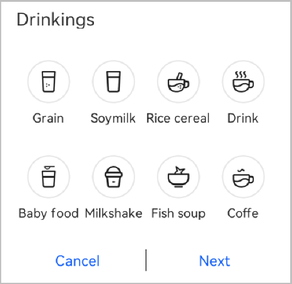
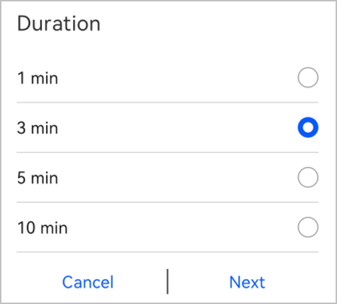
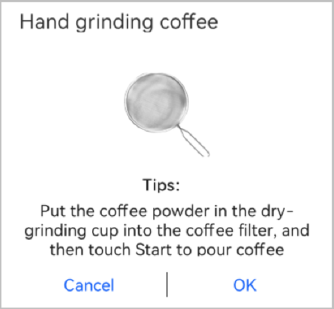
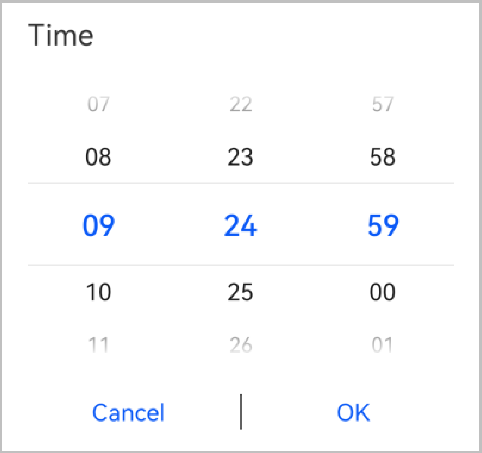
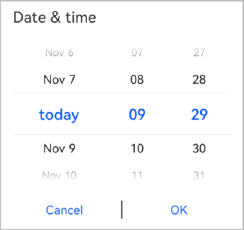
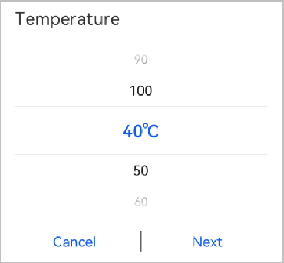
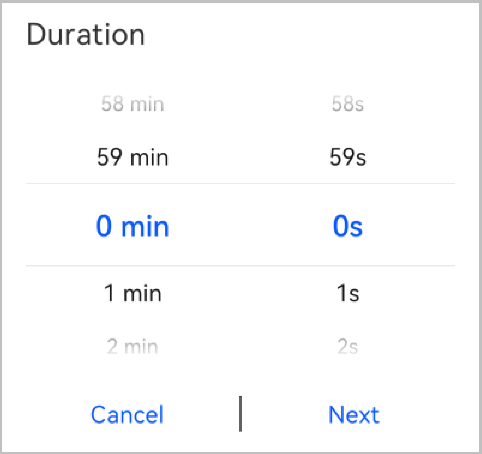

# Configuration Description of Dialog Components<a name="EN-US_TOPIC_0000001158604277"></a>

-   [Overview](#section177145394383)
-   [Enum Dialog](#section7797619153917)
-   [Radio Dialog](#section149204321448)
-   [Info Dialog](#section22496134515)
-   [Time Picker](#section13596193716458)
-   [Date Picker](#section11825192184617)
-   [Date and Time Picker](#section69732312462)
-   [Text Picker](#section1179325213461)
-   [Multi-column Picker](#section10946422184712)

## Overview<a name="section177145394383"></a>

**Dialog**  components are classified into the following types:  **Enum**,  **Radio**,  **Info**, and  **Picker**  \(time picker, date picker, date and time picker, text picker, and multi-column picker\).

## Enum Dialog<a name="section7797619153917"></a>

The  **Dialog**  component of the  **Enum**  type displays one to eight areas for user selection. Each area is clickable. After an area is clicked, a new image \(or the same image with a different color\) is displayed, indicating a status change. Only one area can be activated at a time.

The following figure shows an example.



The code for the example is as follows:

```
{
      "name": "Drinkings",
      "id": "drinkKind",
      "path": "drinkKind",
      "dialogType": "ENUM",
      "controlItems": [
        {
          "name": "Cancel",
          "type": "cancel"
        },
        {
          "name": "Next",
          "type": "submit"
        }
      ],
      "command": [
        {
          "name": "Grain",
          "icon": {
            "value": {
              "defaultTarget": "/ic_grains_nor.png",
              "target": "/ic_grains_on.png"
            },
            "valueNight": {
              "defaultTarget": "/ic_grains_nor.png",
              "target": "/ic_grains_on.png"
            }
          },
          "dialogList": ["duration", "temperature", "capacity", "speed"],
          "value": 1
        },
        {
          "name": "Soy milk",
          "icon": {
            "value": {
              "defaultTarget": "/ic_soy_milk_nor.png",
              "target": "/ic_soy_milk_on.png"
            },
            "valueNight": {
              "defaultTarget": "/ic_soy_milk_nor.png",
              "target": "/ic_soy_milk_on.png"
            }
          },
          "dialogList": ["duration", "temperature", "capacity", "speed"],
          "value": 2
        }
      ]
    }
```

The parameters are described as follows.

<a name="table15753253172413"></a>
<table><thead align="left"><tr id="row675313538243"><th class="cellrowborder" valign="top" width="20%" id="mcps1.1.6.1.1"><p id="p107531538246"><a name="p107531538246"></a><a name="p107531538246"></a>Name</p>
</th>
<th class="cellrowborder" valign="top" width="20%" id="mcps1.1.6.1.2"><p id="p147531053122419"><a name="p147531053122419"></a><a name="p147531053122419"></a>Mandatory</p>
</th>
<th class="cellrowborder" valign="top" width="20%" id="mcps1.1.6.1.3"><p id="p1775465311249"><a name="p1775465311249"></a><a name="p1775465311249"></a>Type</p>
</th>
<th class="cellrowborder" valign="top" width="20%" id="mcps1.1.6.1.4"><p id="p13754053162412"><a name="p13754053162412"></a><a name="p13754053162412"></a>Description</p>
</th>
<th class="cellrowborder" valign="top" width="20%" id="mcps1.1.6.1.5"><p id="p6754115372419"><a name="p6754115372419"></a><a name="p6754115372419"></a>Remarks</p>
</th>
</tr>
</thead>
<tbody><tr id="row3754205362419"><td class="cellrowborder" valign="top" width="20%" headers="mcps1.1.6.1.1 "><p id="p29893016259"><a name="p29893016259"></a><a name="p29893016259"></a>name</p>
</td>
<td class="cellrowborder" valign="top" width="20%" headers="mcps1.1.6.1.2 "><p id="p159891709257"><a name="p159891709257"></a><a name="p159891709257"></a>Yes</p>
</td>
<td class="cellrowborder" valign="top" width="20%" headers="mcps1.1.6.1.3 "><p id="p898912020254"><a name="p898912020254"></a><a name="p898912020254"></a>String (1-128)</p>
</td>
<td class="cellrowborder" valign="top" width="20%" headers="mcps1.1.6.1.4 "><p id="p1299020112515"><a name="p1299020112515"></a><a name="p1299020112515"></a>Display name of the dialog box.</p>
</td>
<td class="cellrowborder" valign="top" width="20%" headers="mcps1.1.6.1.5 "><p id="p119909052510"><a name="p119909052510"></a><a name="p119909052510"></a>Example: <strong id="b4431942172510"><a name="b4431942172510"></a><a name="b4431942172510"></a>Drinkings</strong>.</p>
</td>
</tr>
<tr id="row57552539247"><td class="cellrowborder" valign="top" width="20%" headers="mcps1.1.6.1.1 "><p id="p1990130182512"><a name="p1990130182512"></a><a name="p1990130182512"></a>id</p>
</td>
<td class="cellrowborder" valign="top" width="20%" headers="mcps1.1.6.1.2 "><p id="p799017013259"><a name="p799017013259"></a><a name="p799017013259"></a>Yes</p>
</td>
<td class="cellrowborder" valign="top" width="20%" headers="mcps1.1.6.1.3 "><p id="p59909062511"><a name="p59909062511"></a><a name="p59909062511"></a>String (1-128)</p>
</td>
<td class="cellrowborder" valign="top" width="20%" headers="mcps1.1.6.1.4 "><p id="p999017014258"><a name="p999017014258"></a><a name="p999017014258"></a>Unique ID of the dialog box.</p>
</td>
<td class="cellrowborder" valign="top" width="20%" headers="mcps1.1.6.1.5 "><p id="p14990190202512"><a name="p14990190202512"></a><a name="p14990190202512"></a>Example: <strong id="b1696914467259"><a name="b1696914467259"></a><a name="b1696914467259"></a>drinkKind</strong>.</p>
</td>
</tr>
<tr id="row10755953112415"><td class="cellrowborder" valign="top" width="20%" headers="mcps1.1.6.1.1 "><p id="p7990170132518"><a name="p7990170132518"></a><a name="p7990170132518"></a>path</p>
</td>
<td class="cellrowborder" valign="top" width="20%" headers="mcps1.1.6.1.2 "><p id="p14991120172519"><a name="p14991120172519"></a><a name="p14991120172519"></a>Yes</p>
</td>
<td class="cellrowborder" valign="top" width="20%" headers="mcps1.1.6.1.3 "><p id="p1699180152517"><a name="p1699180152517"></a><a name="p1699180152517"></a>String (1-128)</p>
</td>
<td class="cellrowborder" valign="top" width="20%" headers="mcps1.1.6.1.4 "><p id="p39918017255"><a name="p39918017255"></a><a name="p39918017255"></a>Dynamic content condition.</p>
</td>
<td class="cellrowborder" valign="top" width="20%" headers="mcps1.1.6.1.5 "><p id="p5991707251"><a name="p5991707251"></a><a name="p5991707251"></a>Example: <strong id="b31445020258"><a name="b31445020258"></a><a name="b31445020258"></a>drinkKind</strong>.</p>
</td>
</tr>
<tr id="row3756155320241"><td class="cellrowborder" valign="top" width="20%" headers="mcps1.1.6.1.1 "><p id="p1399118013259"><a name="p1399118013259"></a><a name="p1399118013259"></a>dialogType</p>
</td>
<td class="cellrowborder" valign="top" width="20%" headers="mcps1.1.6.1.2 "><p id="p499115012253"><a name="p499115012253"></a><a name="p499115012253"></a>Yes</p>
</td>
<td class="cellrowborder" valign="top" width="20%" headers="mcps1.1.6.1.3 "><p id="p499119042518"><a name="p499119042518"></a><a name="p499119042518"></a>String (1-128)</p>
</td>
<td class="cellrowborder" valign="top" width="20%" headers="mcps1.1.6.1.4 "><p id="p1099230142517"><a name="p1099230142517"></a><a name="p1099230142517"></a>Type of the dialog box.</p>
</td>
<td class="cellrowborder" valign="top" width="20%" headers="mcps1.1.6.1.5 "><p id="p1199215010258"><a name="p1199215010258"></a><a name="p1199215010258"></a>The value can be <strong id="b2032232572615"><a name="b2032232572615"></a><a name="b2032232572615"></a>RADIO</strong>, <strong id="b1435510283266"><a name="b1435510283266"></a><a name="b1435510283266"></a>ENUM</strong>, <strong id="b122403111269"><a name="b122403111269"></a><a name="b122403111269"></a>PICKER</strong>, or <strong id="b140583518264"><a name="b140583518264"></a><a name="b140583518264"></a>INFO</strong>.</p>
</td>
</tr>
<tr id="row1875615534241"><td class="cellrowborder" valign="top" width="20%" headers="mcps1.1.6.1.1 "><p id="p169927052511"><a name="p169927052511"></a><a name="p169927052511"></a>controlItems</p>
</td>
<td class="cellrowborder" valign="top" width="20%" headers="mcps1.1.6.1.2 "><p id="p139921909256"><a name="p139921909256"></a><a name="p139921909256"></a>Yes</p>
</td>
<td class="cellrowborder" valign="top" width="20%" headers="mcps1.1.6.1.3 "><p id="p14992190192513"><a name="p14992190192513"></a><a name="p14992190192513"></a>ControlItems[]</p>
</td>
<td class="cellrowborder" valign="top" width="20%" headers="mcps1.1.6.1.4 "><p id="p899270122510"><a name="p899270122510"></a><a name="p899270122510"></a>Control items at the bottom of the dialog box.</p>
</td>
<td class="cellrowborder" valign="top" width="20%" headers="mcps1.1.6.1.5 "><p id="p18992170192516"><a name="p18992170192516"></a><a name="p18992170192516"></a>-</p>
</td>
</tr>
<tr id="row18757165342417"><td class="cellrowborder" valign="top" width="20%" headers="mcps1.1.6.1.1 "><p id="p2992160102515"><a name="p2992160102515"></a><a name="p2992160102515"></a>command</p>
</td>
<td class="cellrowborder" valign="top" width="20%" headers="mcps1.1.6.1.2 "><p id="p18993170122517"><a name="p18993170122517"></a><a name="p18993170122517"></a>Yes</p>
</td>
<td class="cellrowborder" valign="top" width="20%" headers="mcps1.1.6.1.3 "><p id="p1599390112510"><a name="p1599390112510"></a><a name="p1599390112510"></a>Command[]</p>
</td>
<td class="cellrowborder" valign="top" width="20%" headers="mcps1.1.6.1.4 "><p id="p19935016255"><a name="p19935016255"></a><a name="p19935016255"></a>Array of commands available for the dialog box.</p>
</td>
<td class="cellrowborder" valign="top" width="20%" headers="mcps1.1.6.1.5 "><p id="p89931701252"><a name="p89931701252"></a><a name="p89931701252"></a>-</p>
</td>
</tr>
</tbody>
</table>

ControlItems

<a name="table53758122615"></a>
<table><thead align="left"><tr id="row737512115263"><th class="cellrowborder" valign="top" width="20%" id="mcps1.1.6.1.1"><p id="p203761112265"><a name="p203761112265"></a><a name="p203761112265"></a>Name</p>
</th>
<th class="cellrowborder" valign="top" width="20%" id="mcps1.1.6.1.2"><p id="p737619122614"><a name="p737619122614"></a><a name="p737619122614"></a>Mandatory</p>
</th>
<th class="cellrowborder" valign="top" width="20%" id="mcps1.1.6.1.3"><p id="p53765152613"><a name="p53765152613"></a><a name="p53765152613"></a>Type</p>
</th>
<th class="cellrowborder" valign="top" width="20%" id="mcps1.1.6.1.4"><p id="p1437691182612"><a name="p1437691182612"></a><a name="p1437691182612"></a>Description</p>
</th>
<th class="cellrowborder" valign="top" width="20%" id="mcps1.1.6.1.5"><p id="p183761618265"><a name="p183761618265"></a><a name="p183761618265"></a>Remarks</p>
</th>
</tr>
</thead>
<tbody><tr id="row13760122613"><td class="cellrowborder" valign="top" width="20%" headers="mcps1.1.6.1.1 "><p id="p691027172617"><a name="p691027172617"></a><a name="p691027172617"></a>name</p>
</td>
<td class="cellrowborder" valign="top" width="20%" headers="mcps1.1.6.1.2 "><p id="p149102792615"><a name="p149102792615"></a><a name="p149102792615"></a>Yes</p>
</td>
<td class="cellrowborder" valign="top" width="20%" headers="mcps1.1.6.1.3 "><p id="p491019715268"><a name="p491019715268"></a><a name="p491019715268"></a>String (1-128)</p>
</td>
<td class="cellrowborder" valign="top" width="20%" headers="mcps1.1.6.1.4 "><p id="p10910674263"><a name="p10910674263"></a><a name="p10910674263"></a>Display name of a control item.</p>
</td>
<td class="cellrowborder" valign="top" width="20%" headers="mcps1.1.6.1.5 "><p id="p15910372265"><a name="p15910372265"></a><a name="p15910372265"></a>Example: <strong id="b2498173710277"><a name="b2498173710277"></a><a name="b2498173710277"></a>Cancel</strong>.</p>
</td>
</tr>
<tr id="row203770118267"><td class="cellrowborder" valign="top" width="20%" headers="mcps1.1.6.1.1 "><p id="p159105772615"><a name="p159105772615"></a><a name="p159105772615"></a>type</p>
</td>
<td class="cellrowborder" valign="top" width="20%" headers="mcps1.1.6.1.2 "><p id="p1991097132620"><a name="p1991097132620"></a><a name="p1991097132620"></a>Yes</p>
</td>
<td class="cellrowborder" valign="top" width="20%" headers="mcps1.1.6.1.3 "><p id="p18911137112616"><a name="p18911137112616"></a><a name="p18911137112616"></a>String (1-128)</p>
</td>
<td class="cellrowborder" valign="top" width="20%" headers="mcps1.1.6.1.4 "><p id="p18911671264"><a name="p18911671264"></a><a name="p18911671264"></a>Type of the control item.</p>
</td>
<td class="cellrowborder" valign="top" width="20%" headers="mcps1.1.6.1.5 "><p id="p1911107182611"><a name="p1911107182611"></a><a name="p1911107182611"></a>The control item type can be <strong id="b812715575270"><a name="b812715575270"></a><a name="b812715575270"></a>submit</strong> or <strong id="b9579185972716"><a name="b9579185972716"></a><a name="b9579185972716"></a>cancel</strong>.</p>
</td>
</tr>
</tbody>
</table>

Command

<a name="table1658413156278"></a>
<table><thead align="left"><tr id="row4584191510273"><th class="cellrowborder" valign="top" width="20%" id="mcps1.1.6.1.1"><p id="p145844158275"><a name="p145844158275"></a><a name="p145844158275"></a>Name</p>
</th>
<th class="cellrowborder" valign="top" width="20%" id="mcps1.1.6.1.2"><p id="p185842154276"><a name="p185842154276"></a><a name="p185842154276"></a>Mandatory</p>
</th>
<th class="cellrowborder" valign="top" width="20%" id="mcps1.1.6.1.3"><p id="p1158515159271"><a name="p1158515159271"></a><a name="p1158515159271"></a>Type</p>
</th>
<th class="cellrowborder" valign="top" width="20%" id="mcps1.1.6.1.4"><p id="p158517155279"><a name="p158517155279"></a><a name="p158517155279"></a>Description</p>
</th>
<th class="cellrowborder" valign="top" width="20%" id="mcps1.1.6.1.5"><p id="p14585181582717"><a name="p14585181582717"></a><a name="p14585181582717"></a>Remarks</p>
</th>
</tr>
</thead>
<tbody><tr id="row558511512710"><td class="cellrowborder" valign="top" width="20%" headers="mcps1.1.6.1.1 "><p id="p1416713343278"><a name="p1416713343278"></a><a name="p1416713343278"></a>name</p>
</td>
<td class="cellrowborder" valign="top" width="20%" headers="mcps1.1.6.1.2 "><p id="p1168133413275"><a name="p1168133413275"></a><a name="p1168133413275"></a>Yes</p>
</td>
<td class="cellrowborder" valign="top" width="20%" headers="mcps1.1.6.1.3 "><p id="p7168134102711"><a name="p7168134102711"></a><a name="p7168134102711"></a>String (1-128)</p>
</td>
<td class="cellrowborder" valign="top" width="20%" headers="mcps1.1.6.1.4 "><p id="p13168434132715"><a name="p13168434132715"></a><a name="p13168434132715"></a>Display name of a command.</p>
</td>
<td class="cellrowborder" valign="top" width="20%" headers="mcps1.1.6.1.5 "><p id="p1516853462711"><a name="p1516853462711"></a><a name="p1516853462711"></a>Example: <strong id="b868216813293"><a name="b868216813293"></a><a name="b868216813293"></a>Grain</strong>.</p>
</td>
</tr>
<tr id="row15586151592714"><td class="cellrowborder" valign="top" width="20%" headers="mcps1.1.6.1.1 "><p id="p9168834162710"><a name="p9168834162710"></a><a name="p9168834162710"></a>icon.value.defaultTarget</p>
</td>
<td class="cellrowborder" valign="top" width="20%" headers="mcps1.1.6.1.2 "><p id="p71689341274"><a name="p71689341274"></a><a name="p71689341274"></a>Yes</p>
</td>
<td class="cellrowborder" valign="top" width="20%" headers="mcps1.1.6.1.3 "><p id="p116819343279"><a name="p116819343279"></a><a name="p116819343279"></a>String (1-128)</p>
</td>
<td class="cellrowborder" valign="top" width="20%" headers="mcps1.1.6.1.4 "><p id="p1416823410275"><a name="p1416823410275"></a><a name="p1416823410275"></a>URL of the default icon.</p>
</td>
<td class="cellrowborder" valign="top" width="20%" headers="mcps1.1.6.1.5 "><p id="p10169133422712"><a name="p10169133422712"></a><a name="p10169133422712"></a>Example: <strong id="b1360354655815"><a name="b1360354655815"></a><a name="b1360354655815"></a>/ic_soymilk_nor.png</strong>.</p>
</td>
</tr>
<tr id="row185861315112719"><td class="cellrowborder" valign="top" width="20%" headers="mcps1.1.6.1.1 "><p id="p1716953419272"><a name="p1716953419272"></a><a name="p1716953419272"></a>icon.value.target</p>
</td>
<td class="cellrowborder" valign="top" width="20%" headers="mcps1.1.6.1.2 "><p id="p816943413276"><a name="p816943413276"></a><a name="p816943413276"></a>Yes</p>
</td>
<td class="cellrowborder" valign="top" width="20%" headers="mcps1.1.6.1.3 "><p id="p31691534112720"><a name="p31691534112720"></a><a name="p31691534112720"></a>String (1-128)</p>
</td>
<td class="cellrowborder" valign="top" width="20%" headers="mcps1.1.6.1.4 "><p id="p6169634152715"><a name="p6169634152715"></a><a name="p6169634152715"></a>URL of the icon when being clicked.</p>
</td>
<td class="cellrowborder" valign="top" width="20%" headers="mcps1.1.6.1.5 "><p id="p12169934132710"><a name="p12169934132710"></a><a name="p12169934132710"></a>Example: <strong id="b1726114416591"><a name="b1726114416591"></a><a name="b1726114416591"></a>/ic_soymilk_on.png</strong>.</p>
</td>
</tr>
<tr id="row858851512713"><td class="cellrowborder" valign="top" width="20%" headers="mcps1.1.6.1.1 "><p id="p1016943432716"><a name="p1016943432716"></a><a name="p1016943432716"></a>icon.valueNight.defaultTarget</p>
</td>
<td class="cellrowborder" valign="top" width="20%" headers="mcps1.1.6.1.2 "><p id="p171701134202710"><a name="p171701134202710"></a><a name="p171701134202710"></a>Yes</p>
</td>
<td class="cellrowborder" valign="top" width="20%" headers="mcps1.1.6.1.3 "><p id="p111701334192712"><a name="p111701334192712"></a><a name="p111701334192712"></a>String (1-128)</p>
</td>
<td class="cellrowborder" valign="top" width="20%" headers="mcps1.1.6.1.4 "><p id="p81701634152714"><a name="p81701634152714"></a><a name="p81701634152714"></a>URL of the default icon in dark mode.</p>
</td>
<td class="cellrowborder" valign="top" width="20%" headers="mcps1.1.6.1.5 "><p id="p5170183412718"><a name="p5170183412718"></a><a name="p5170183412718"></a>Example: <strong id="b18111114775815"><a name="b18111114775815"></a><a name="b18111114775815"></a>/ic_soymilk_nor.png</strong>.</p>
</td>
</tr>
<tr id="row1658981516276"><td class="cellrowborder" valign="top" width="20%" headers="mcps1.1.6.1.1 "><p id="p2170234132717"><a name="p2170234132717"></a><a name="p2170234132717"></a>icon.valueNight.target</p>
</td>
<td class="cellrowborder" valign="top" width="20%" headers="mcps1.1.6.1.2 "><p id="p1117063411272"><a name="p1117063411272"></a><a name="p1117063411272"></a>Yes</p>
</td>
<td class="cellrowborder" valign="top" width="20%" headers="mcps1.1.6.1.3 "><p id="p11170163415272"><a name="p11170163415272"></a><a name="p11170163415272"></a>String (1-128)</p>
</td>
<td class="cellrowborder" valign="top" width="20%" headers="mcps1.1.6.1.4 "><p id="p11711834112715"><a name="p11711834112715"></a><a name="p11711834112715"></a>URL of the icon when being clicked in dark mode.</p>
</td>
<td class="cellrowborder" valign="top" width="20%" headers="mcps1.1.6.1.5 "><p id="p11171193452715"><a name="p11171193452715"></a><a name="p11171193452715"></a>Example: <strong id="b154871445918"><a name="b154871445918"></a><a name="b154871445918"></a>/ic_soymilk_on.png</strong>.</p>
</td>
</tr>
<tr id="row4884219192713"><td class="cellrowborder" valign="top" width="20%" headers="mcps1.1.6.1.1 "><p id="p6171934172715"><a name="p6171934172715"></a><a name="p6171934172715"></a>dialogList</p>
</td>
<td class="cellrowborder" valign="top" width="20%" headers="mcps1.1.6.1.2 "><p id="p12171134192713"><a name="p12171134192713"></a><a name="p12171134192713"></a>No</p>
</td>
<td class="cellrowborder" valign="top" width="20%" headers="mcps1.1.6.1.3 "><p id="p1917114344275"><a name="p1917114344275"></a><a name="p1917114344275"></a>Array</p>
</td>
<td class="cellrowborder" valign="top" width="20%" headers="mcps1.1.6.1.4 "><p id="p12171103462718"><a name="p12171103462718"></a><a name="p12171103462718"></a>Dialog box list to play.</p>
</td>
<td class="cellrowborder" valign="top" width="20%" headers="mcps1.1.6.1.5 "><p id="p191711834162716"><a name="p191711834162716"></a><a name="p191711834162716"></a>-</p>
</td>
</tr>
<tr id="row6590515172714"><td class="cellrowborder" valign="top" width="20%" headers="mcps1.1.6.1.1 "><p id="p17172123492719"><a name="p17172123492719"></a><a name="p17172123492719"></a>value</p>
</td>
<td class="cellrowborder" valign="top" width="20%" headers="mcps1.1.6.1.2 "><p id="p1172034102718"><a name="p1172034102718"></a><a name="p1172034102718"></a>Yes</p>
</td>
<td class="cellrowborder" valign="top" width="20%" headers="mcps1.1.6.1.3 "><p id="p7172934172715"><a name="p7172934172715"></a><a name="p7172934172715"></a>int</p>
</td>
<td class="cellrowborder" valign="top" width="20%" headers="mcps1.1.6.1.4 "><p id="p817263417275"><a name="p817263417275"></a><a name="p817263417275"></a>Property value in the command.</p>
</td>
<td class="cellrowborder" valign="top" width="20%" headers="mcps1.1.6.1.5 "><p id="p18172634152717"><a name="p18172634152717"></a><a name="p18172634152717"></a>For example, the value <strong id="b4428145523014"><a name="b4428145523014"></a><a name="b4428145523014"></a>1</strong> indicates that the first button is clicked.</p>
</td>
</tr>
</tbody>
</table>

## Radio Dialog<a name="section149204321448"></a>

The  **Dialog**  component of the  **Radio**  type provides a dialog box with radio buttons for user selection. The following uses the duration setting as an example.

The following figure shows an example.



The code for the example is as follows:

```
{
"name": "Duration",
    "id": "drinkTime1",
    "path": "drinkTime1",
    "dialogType": "RADIO",
    "controlItems": [
	{
	    "name": "Cancel",
	    "type": "cancel"
	},
	{
	    "name": "Next",
	    "type": "submit"
        }
    ],
    "range": ["1 min", "3 min", "5 min", "10 min"],
    "value": [1, 3, 5, 10]
    }
```

The parameters are described as follows.

<a name="table3791017103018"></a>
<table><thead align="left"><tr id="row979111743020"><th class="cellrowborder" valign="top" width="20%" id="mcps1.1.6.1.1"><p id="p87910175305"><a name="p87910175305"></a><a name="p87910175305"></a>Name</p>
</th>
<th class="cellrowborder" valign="top" width="20%" id="mcps1.1.6.1.2"><p id="p9791117173010"><a name="p9791117173010"></a><a name="p9791117173010"></a>Mandatory</p>
</th>
<th class="cellrowborder" valign="top" width="20%" id="mcps1.1.6.1.3"><p id="p20801517173016"><a name="p20801517173016"></a><a name="p20801517173016"></a>Type</p>
</th>
<th class="cellrowborder" valign="top" width="20%" id="mcps1.1.6.1.4"><p id="p680141716306"><a name="p680141716306"></a><a name="p680141716306"></a>Description</p>
</th>
<th class="cellrowborder" valign="top" width="20%" id="mcps1.1.6.1.5"><p id="p5801117133012"><a name="p5801117133012"></a><a name="p5801117133012"></a>Remarks</p>
</th>
</tr>
</thead>
<tbody><tr id="row080191713017"><td class="cellrowborder" valign="top" width="20%" headers="mcps1.1.6.1.1 "><p id="p3926112713309"><a name="p3926112713309"></a><a name="p3926112713309"></a>name</p>
</td>
<td class="cellrowborder" valign="top" width="20%" headers="mcps1.1.6.1.2 "><p id="p139279277303"><a name="p139279277303"></a><a name="p139279277303"></a>Yes</p>
</td>
<td class="cellrowborder" valign="top" width="20%" headers="mcps1.1.6.1.3 "><p id="p492762710307"><a name="p492762710307"></a><a name="p492762710307"></a>String (1-128)</p>
</td>
<td class="cellrowborder" valign="top" width="20%" headers="mcps1.1.6.1.4 "><p id="p1392716274303"><a name="p1392716274303"></a><a name="p1392716274303"></a>Display name of the dialog box.</p>
</td>
<td class="cellrowborder" valign="top" width="20%" headers="mcps1.1.6.1.5 "><p id="p892719272308"><a name="p892719272308"></a><a name="p892719272308"></a>Example: <strong id="b832332933312"><a name="b832332933312"></a><a name="b832332933312"></a>Duration</strong>.</p>
</td>
</tr>
<tr id="row481317103017"><td class="cellrowborder" valign="top" width="20%" headers="mcps1.1.6.1.1 "><p id="p179271727143010"><a name="p179271727143010"></a><a name="p179271727143010"></a>id</p>
</td>
<td class="cellrowborder" valign="top" width="20%" headers="mcps1.1.6.1.2 "><p id="p59271527193017"><a name="p59271527193017"></a><a name="p59271527193017"></a>Yes</p>
</td>
<td class="cellrowborder" valign="top" width="20%" headers="mcps1.1.6.1.3 "><p id="p1892722783013"><a name="p1892722783013"></a><a name="p1892722783013"></a>String (1-128)</p>
</td>
<td class="cellrowborder" valign="top" width="20%" headers="mcps1.1.6.1.4 "><p id="p8928132717301"><a name="p8928132717301"></a><a name="p8928132717301"></a>Unique ID of the dialog box.</p>
</td>
<td class="cellrowborder" valign="top" width="20%" headers="mcps1.1.6.1.5 "><p id="p17928202718301"><a name="p17928202718301"></a><a name="p17928202718301"></a>Example: <strong id="b1440141263312"><a name="b1440141263312"></a><a name="b1440141263312"></a>duration</strong>.</p>
</td>
</tr>
<tr id="row781181783016"><td class="cellrowborder" valign="top" width="20%" headers="mcps1.1.6.1.1 "><p id="p1092822714309"><a name="p1092822714309"></a><a name="p1092822714309"></a>path</p>
</td>
<td class="cellrowborder" valign="top" width="20%" headers="mcps1.1.6.1.2 "><p id="p592811277305"><a name="p592811277305"></a><a name="p592811277305"></a>Yes</p>
</td>
<td class="cellrowborder" valign="top" width="20%" headers="mcps1.1.6.1.3 "><p id="p79281127113014"><a name="p79281127113014"></a><a name="p79281127113014"></a>String (1-128)</p>
</td>
<td class="cellrowborder" valign="top" width="20%" headers="mcps1.1.6.1.4 "><p id="p10928142718307"><a name="p10928142718307"></a><a name="p10928142718307"></a>Dynamic content condition.</p>
</td>
<td class="cellrowborder" valign="top" width="20%" headers="mcps1.1.6.1.5 "><p id="p15928152783018"><a name="p15928152783018"></a><a name="p15928152783018"></a>Example: <strong id="b16662912193319"><a name="b16662912193319"></a><a name="b16662912193319"></a>duration</strong>.</p>
</td>
</tr>
<tr id="row1582181713020"><td class="cellrowborder" valign="top" width="20%" headers="mcps1.1.6.1.1 "><p id="p992902712308"><a name="p992902712308"></a><a name="p992902712308"></a>dialogType</p>
</td>
<td class="cellrowborder" valign="top" width="20%" headers="mcps1.1.6.1.2 "><p id="p1292912743015"><a name="p1292912743015"></a><a name="p1292912743015"></a>Yes</p>
</td>
<td class="cellrowborder" valign="top" width="20%" headers="mcps1.1.6.1.3 "><p id="p15929142710305"><a name="p15929142710305"></a><a name="p15929142710305"></a>String (1-128)</p>
</td>
<td class="cellrowborder" valign="top" width="20%" headers="mcps1.1.6.1.4 "><p id="p792952712304"><a name="p792952712304"></a><a name="p792952712304"></a>Type of the dialog box.</p>
</td>
<td class="cellrowborder" valign="top" width="20%" headers="mcps1.1.6.1.5 "><p id="p109292278304"><a name="p109292278304"></a><a name="p109292278304"></a>The value can be <strong id="b37311435182619"><a name="b37311435182619"></a><a name="b37311435182619"></a>RADIO</strong>, <strong id="b1731163522620"><a name="b1731163522620"></a><a name="b1731163522620"></a>ENUM</strong>, <strong id="b117311235112616"><a name="b117311235112616"></a><a name="b117311235112616"></a>PICKER</strong>, or <strong id="b7731173582614"><a name="b7731173582614"></a><a name="b7731173582614"></a>INFO</strong>.</p>
</td>
</tr>
<tr id="row12831317113014"><td class="cellrowborder" valign="top" width="20%" headers="mcps1.1.6.1.1 "><p id="p492911278306"><a name="p492911278306"></a><a name="p492911278306"></a>controlItems</p>
</td>
<td class="cellrowborder" valign="top" width="20%" headers="mcps1.1.6.1.2 "><p id="p992914277308"><a name="p992914277308"></a><a name="p992914277308"></a>Yes</p>
</td>
<td class="cellrowborder" valign="top" width="20%" headers="mcps1.1.6.1.3 "><p id="p1293082743015"><a name="p1293082743015"></a><a name="p1293082743015"></a>ControlItems[]</p>
</td>
<td class="cellrowborder" valign="top" width="20%" headers="mcps1.1.6.1.4 "><p id="p199309275302"><a name="p199309275302"></a><a name="p199309275302"></a>Control items at the bottom of the dialog box.</p>
</td>
<td class="cellrowborder" valign="top" width="20%" headers="mcps1.1.6.1.5 "><p id="p1293017274302"><a name="p1293017274302"></a><a name="p1293017274302"></a>-</p>
</td>
</tr>
<tr id="row483517133017"><td class="cellrowborder" valign="top" width="20%" headers="mcps1.1.6.1.1 "><p id="p5930142773013"><a name="p5930142773013"></a><a name="p5930142773013"></a>range</p>
</td>
<td class="cellrowborder" valign="top" width="20%" headers="mcps1.1.6.1.2 "><p id="p39301927193015"><a name="p39301927193015"></a><a name="p39301927193015"></a>Yes</p>
</td>
<td class="cellrowborder" valign="top" width="20%" headers="mcps1.1.6.1.3 "><p id="p10930142773013"><a name="p10930142773013"></a><a name="p10930142773013"></a>Array</p>
</td>
<td class="cellrowborder" valign="top" width="20%" headers="mcps1.1.6.1.4 "><p id="p4931827153015"><a name="p4931827153015"></a><a name="p4931827153015"></a>Array of options for selection.</p>
</td>
<td class="cellrowborder" valign="top" width="20%" headers="mcps1.1.6.1.5 "><p id="p16931727173010"><a name="p16931727173010"></a><a name="p16931727173010"></a>Example: <strong id="b12890173416341"><a name="b12890173416341"></a><a name="b12890173416341"></a>["1 min", "3 min", "5 min", "10 min"]</strong>.</p>
</td>
</tr>
<tr id="row9841817203012"><td class="cellrowborder" valign="top" width="20%" headers="mcps1.1.6.1.1 "><p id="p493122773012"><a name="p493122773012"></a><a name="p493122773012"></a>value</p>
</td>
<td class="cellrowborder" valign="top" width="20%" headers="mcps1.1.6.1.2 "><p id="p17931192711305"><a name="p17931192711305"></a><a name="p17931192711305"></a>Yes</p>
</td>
<td class="cellrowborder" valign="top" width="20%" headers="mcps1.1.6.1.3 "><p id="p11931162715302"><a name="p11931162715302"></a><a name="p11931162715302"></a>Array</p>
</td>
<td class="cellrowborder" valign="top" width="20%" headers="mcps1.1.6.1.4 "><p id="p1193142715306"><a name="p1193142715306"></a><a name="p1193142715306"></a>Array of the values corresponding to the options.</p>
</td>
<td class="cellrowborder" valign="top" width="20%" headers="mcps1.1.6.1.5 "><p id="p093282710302"><a name="p093282710302"></a><a name="p093282710302"></a>Example: <strong id="b18112195815343"><a name="b18112195815343"></a><a name="b18112195815343"></a>[1, 3, 5, 10]</strong>.</p>
</td>
</tr>
</tbody>
</table>

## Info Dialog<a name="section22496134515"></a>

The  **Dialog**  component of the  **Info**  type is used to display an image and text.

The following figure shows an example.



The code for the example is as follows:

```
{
  "name": "Hand grinding coffee",
  "id": "handGrindingCoffee",
  "dialogType": "INFO",
  "controlItems": [
    {
      "name": "Cancel",
      "type": "cancel"
    },
    {
      "name": "OK",
      "type": "submit"
    }
  ],
  "icon": "/ic_grand_coffee.png",
  "headline": "Tips",
  "desc": "Put the coffee powder in the dry-grinding cup into the coffee filter, and then touch Start to pour coffee."
    }
```

The parameters are described as follows.

<a name="table15709103663518"></a>
<table><thead align="left"><tr id="row15709736143517"><th class="cellrowborder" valign="top" width="20%" id="mcps1.1.6.1.1"><p id="p77091936193513"><a name="p77091936193513"></a><a name="p77091936193513"></a>Name</p>
</th>
<th class="cellrowborder" valign="top" width="20%" id="mcps1.1.6.1.2"><p id="p1370963653518"><a name="p1370963653518"></a><a name="p1370963653518"></a>Mandatory</p>
</th>
<th class="cellrowborder" valign="top" width="20%" id="mcps1.1.6.1.3"><p id="p1971063611359"><a name="p1971063611359"></a><a name="p1971063611359"></a>Type</p>
</th>
<th class="cellrowborder" valign="top" width="20%" id="mcps1.1.6.1.4"><p id="p071011362354"><a name="p071011362354"></a><a name="p071011362354"></a>Description</p>
</th>
<th class="cellrowborder" valign="top" width="20%" id="mcps1.1.6.1.5"><p id="p15710836173510"><a name="p15710836173510"></a><a name="p15710836173510"></a>Remarks</p>
</th>
</tr>
</thead>
<tbody><tr id="row0710203623519"><td class="cellrowborder" valign="top" width="20%" headers="mcps1.1.6.1.1 "><p id="p85560323717"><a name="p85560323717"></a><a name="p85560323717"></a>name</p>
</td>
<td class="cellrowborder" valign="top" width="20%" headers="mcps1.1.6.1.2 "><p id="p115561938373"><a name="p115561938373"></a><a name="p115561938373"></a>Yes</p>
</td>
<td class="cellrowborder" valign="top" width="20%" headers="mcps1.1.6.1.3 "><p id="p15561137375"><a name="p15561137375"></a><a name="p15561137375"></a>String (1-128)</p>
</td>
<td class="cellrowborder" valign="top" width="20%" headers="mcps1.1.6.1.4 "><p id="p855614312371"><a name="p855614312371"></a><a name="p855614312371"></a>Display name of the dialog box.</p>
</td>
<td class="cellrowborder" valign="top" width="20%" headers="mcps1.1.6.1.5 "><p id="p1855610333716"><a name="p1855610333716"></a><a name="p1855610333716"></a>Example: <strong id="b05669208391"><a name="b05669208391"></a><a name="b05669208391"></a>Hand grinding coffee</strong>.</p>
</td>
</tr>
<tr id="row157118363358"><td class="cellrowborder" valign="top" width="20%" headers="mcps1.1.6.1.1 "><p id="p1555612383720"><a name="p1555612383720"></a><a name="p1555612383720"></a>id</p>
</td>
<td class="cellrowborder" valign="top" width="20%" headers="mcps1.1.6.1.2 "><p id="p1155715315377"><a name="p1155715315377"></a><a name="p1155715315377"></a>Yes</p>
</td>
<td class="cellrowborder" valign="top" width="20%" headers="mcps1.1.6.1.3 "><p id="p135572311373"><a name="p135572311373"></a><a name="p135572311373"></a>String (1-128)</p>
</td>
<td class="cellrowborder" valign="top" width="20%" headers="mcps1.1.6.1.4 "><p id="p145571315371"><a name="p145571315371"></a><a name="p145571315371"></a>Unique ID of the dialog box.</p>
</td>
<td class="cellrowborder" valign="top" width="20%" headers="mcps1.1.6.1.5 "><p id="p2055713193713"><a name="p2055713193713"></a><a name="p2055713193713"></a>Example: <strong id="b155215253396"><a name="b155215253396"></a><a name="b155215253396"></a>handGrindingCoffee</strong>.</p>
</td>
</tr>
<tr id="row1471173617357"><td class="cellrowborder" valign="top" width="20%" headers="mcps1.1.6.1.1 "><p id="p3557133113716"><a name="p3557133113716"></a><a name="p3557133113716"></a>dialogType</p>
</td>
<td class="cellrowborder" valign="top" width="20%" headers="mcps1.1.6.1.2 "><p id="p1355720318377"><a name="p1355720318377"></a><a name="p1355720318377"></a>Yes</p>
</td>
<td class="cellrowborder" valign="top" width="20%" headers="mcps1.1.6.1.3 "><p id="p12557836374"><a name="p12557836374"></a><a name="p12557836374"></a>String (1-128)</p>
</td>
<td class="cellrowborder" valign="top" width="20%" headers="mcps1.1.6.1.4 "><p id="p155583373720"><a name="p155583373720"></a><a name="p155583373720"></a>Type of the dialog box.</p>
</td>
<td class="cellrowborder" valign="top" width="20%" headers="mcps1.1.6.1.5 "><p id="p05586393717"><a name="p05586393717"></a><a name="p05586393717"></a>The value can be <strong id="b1474614353267"><a name="b1474614353267"></a><a name="b1474614353267"></a>RADIO</strong>, <strong id="b1746123582612"><a name="b1746123582612"></a><a name="b1746123582612"></a>ENUM</strong>, <strong id="b147468352265"><a name="b147468352265"></a><a name="b147468352265"></a>PICKER</strong>, or <strong id="b15746133517265"><a name="b15746133517265"></a><a name="b15746133517265"></a>INFO</strong>.</p>
</td>
</tr>
<tr id="row157121036123517"><td class="cellrowborder" valign="top" width="20%" headers="mcps1.1.6.1.1 "><p id="p1655803183720"><a name="p1655803183720"></a><a name="p1655803183720"></a>controlItems</p>
</td>
<td class="cellrowborder" valign="top" width="20%" headers="mcps1.1.6.1.2 "><p id="p35586333711"><a name="p35586333711"></a><a name="p35586333711"></a>Yes</p>
</td>
<td class="cellrowborder" valign="top" width="20%" headers="mcps1.1.6.1.3 "><p id="p65588373713"><a name="p65588373713"></a><a name="p65588373713"></a>ControlItems[]</p>
</td>
<td class="cellrowborder" valign="top" width="20%" headers="mcps1.1.6.1.4 "><p id="p4558133153715"><a name="p4558133153715"></a><a name="p4558133153715"></a>Control items at the bottom of the dialog box.</p>
</td>
<td class="cellrowborder" valign="top" width="20%" headers="mcps1.1.6.1.5 "><p id="p175583373720"><a name="p175583373720"></a><a name="p175583373720"></a>-</p>
</td>
</tr>
<tr id="row1071314362352"><td class="cellrowborder" valign="top" width="20%" headers="mcps1.1.6.1.1 "><p id="p255993183718"><a name="p255993183718"></a><a name="p255993183718"></a>icon</p>
</td>
<td class="cellrowborder" valign="top" width="20%" headers="mcps1.1.6.1.2 "><p id="p15559203113710"><a name="p15559203113710"></a><a name="p15559203113710"></a>Yes</p>
</td>
<td class="cellrowborder" valign="top" width="20%" headers="mcps1.1.6.1.3 "><p id="p95591437370"><a name="p95591437370"></a><a name="p95591437370"></a>String (1-128)</p>
</td>
<td class="cellrowborder" valign="top" width="20%" headers="mcps1.1.6.1.4 "><p id="p755933173719"><a name="p755933173719"></a><a name="p755933173719"></a>URL of the image to display.</p>
</td>
<td class="cellrowborder" valign="top" width="20%" headers="mcps1.1.6.1.5 "><p id="p17559331371"><a name="p17559331371"></a><a name="p17559331371"></a>Example: <strong id="b121801615115912"><a name="b121801615115912"></a><a name="b121801615115912"></a>/ic_handGrindingCoffee.png</strong>.</p>
</td>
</tr>
<tr id="row671417368354"><td class="cellrowborder" valign="top" width="20%" headers="mcps1.1.6.1.1 "><p id="p13559153193710"><a name="p13559153193710"></a><a name="p13559153193710"></a>headline</p>
</td>
<td class="cellrowborder" valign="top" width="20%" headers="mcps1.1.6.1.2 "><p id="p1455913173712"><a name="p1455913173712"></a><a name="p1455913173712"></a>Yes</p>
</td>
<td class="cellrowborder" valign="top" width="20%" headers="mcps1.1.6.1.3 "><p id="p356020311374"><a name="p356020311374"></a><a name="p356020311374"></a>String (1-128)</p>
</td>
<td class="cellrowborder" valign="top" width="20%" headers="mcps1.1.6.1.4 "><p id="p856093133717"><a name="p856093133717"></a><a name="p856093133717"></a>Title.</p>
</td>
<td class="cellrowborder" valign="top" width="20%" headers="mcps1.1.6.1.5 "><p id="p1560636370"><a name="p1560636370"></a><a name="p1560636370"></a>Example: <strong id="b838365993918"><a name="b838365993918"></a><a name="b838365993918"></a>Tips</strong>"</p>
</td>
</tr>
<tr id="row271513368354"><td class="cellrowborder" valign="top" width="20%" headers="mcps1.1.6.1.1 "><p id="p1156033103710"><a name="p1156033103710"></a><a name="p1156033103710"></a>desc</p>
</td>
<td class="cellrowborder" valign="top" width="20%" headers="mcps1.1.6.1.2 "><p id="p2560113163720"><a name="p2560113163720"></a><a name="p2560113163720"></a>Yes</p>
</td>
<td class="cellrowborder" valign="top" width="20%" headers="mcps1.1.6.1.3 "><p id="p165602343714"><a name="p165602343714"></a><a name="p165602343714"></a>String (1-128)</p>
</td>
<td class="cellrowborder" valign="top" width="20%" headers="mcps1.1.6.1.4 "><p id="p175601336377"><a name="p175601336377"></a><a name="p175601336377"></a>Description.</p>
</td>
<td class="cellrowborder" valign="top" width="20%" headers="mcps1.1.6.1.5 "><p id="p15612313718"><a name="p15612313718"></a><a name="p15612313718"></a>Example: <strong id="b19579317164017"><a name="b19579317164017"></a><a name="b19579317164017"></a>Put the coffee powder in the dry grinding cup into the coffee filter, and then touch Start to pour coffee.</strong></p>
</td>
</tr>
</tbody>
</table>

## Time Picker<a name="section13596193716458"></a>

The time picker provides time selection in the form of a dialog box. You can set the  **hours**  parameter to display the time in the 12-hour or 24-hour format.

The following figure shows an example.



The code for the example is as follows:

```
{
"name": "Time",
  "id": "time",
  "path": "time",
  "dialogType": "PICKER",
  "controlItems": [
    {
      "name": "Cancel",
      "type": "cancel"
    },
    {
      "name": "OK",
      "type": "submit"
    }
  ],
  "pickerType": "time",
  "containSecond": true,
  "hours": 24
    }
```

The parameters are described as follows.

<a name="table38811018204014"></a>
<table><thead align="left"><tr id="row8881121874010"><th class="cellrowborder" valign="top" width="20%" id="mcps1.1.6.1.1"><p id="p198810185408"><a name="p198810185408"></a><a name="p198810185408"></a>Name</p>
</th>
<th class="cellrowborder" valign="top" width="20%" id="mcps1.1.6.1.2"><p id="p488281810403"><a name="p488281810403"></a><a name="p488281810403"></a>Mandatory</p>
</th>
<th class="cellrowborder" valign="top" width="20%" id="mcps1.1.6.1.3"><p id="p388241834013"><a name="p388241834013"></a><a name="p388241834013"></a>Type</p>
</th>
<th class="cellrowborder" valign="top" width="20%" id="mcps1.1.6.1.4"><p id="p108825188409"><a name="p108825188409"></a><a name="p108825188409"></a>Description</p>
</th>
<th class="cellrowborder" valign="top" width="20%" id="mcps1.1.6.1.5"><p id="p1882191811404"><a name="p1882191811404"></a><a name="p1882191811404"></a>Remarks</p>
</th>
</tr>
</thead>
<tbody><tr id="row13912181194215"><td class="cellrowborder" valign="top" width="20%" headers="mcps1.1.6.1.1 "><p id="p98781124217"><a name="p98781124217"></a><a name="p98781124217"></a>name</p>
</td>
<td class="cellrowborder" valign="top" width="20%" headers="mcps1.1.6.1.2 "><p id="p88781111423"><a name="p88781111423"></a><a name="p88781111423"></a>Yes</p>
</td>
<td class="cellrowborder" valign="top" width="20%" headers="mcps1.1.6.1.3 "><p id="p2878191114218"><a name="p2878191114218"></a><a name="p2878191114218"></a>String (1-128)</p>
</td>
<td class="cellrowborder" valign="top" width="20%" headers="mcps1.1.6.1.4 "><p id="p11878151174220"><a name="p11878151174220"></a><a name="p11878151174220"></a>Display name of the dialog box.</p>
</td>
<td class="cellrowborder" valign="top" width="20%" headers="mcps1.1.6.1.5 "><p id="p20878181164218"><a name="p20878181164218"></a><a name="p20878181164218"></a>Example: <strong id="b9359141518411"><a name="b9359141518411"></a><a name="b9359141518411"></a>Time</strong>.</p>
</td>
</tr>
<tr id="row091116117428"><td class="cellrowborder" valign="top" width="20%" headers="mcps1.1.6.1.1 "><p id="p987813154211"><a name="p987813154211"></a><a name="p987813154211"></a>id</p>
</td>
<td class="cellrowborder" valign="top" width="20%" headers="mcps1.1.6.1.2 "><p id="p1687815120429"><a name="p1687815120429"></a><a name="p1687815120429"></a>Yes</p>
</td>
<td class="cellrowborder" valign="top" width="20%" headers="mcps1.1.6.1.3 "><p id="p1587813184219"><a name="p1587813184219"></a><a name="p1587813184219"></a>String (1-128)</p>
</td>
<td class="cellrowborder" valign="top" width="20%" headers="mcps1.1.6.1.4 "><p id="p188781119420"><a name="p188781119420"></a><a name="p188781119420"></a>Unique ID of the dialog box.</p>
</td>
<td class="cellrowborder" valign="top" width="20%" headers="mcps1.1.6.1.5 "><p id="p10878171164216"><a name="p10878171164216"></a><a name="p10878171164216"></a>Example: <strong id="b115871423134112"><a name="b115871423134112"></a><a name="b115871423134112"></a>time</strong>.</p>
</td>
</tr>
<tr id="row5911141104213"><td class="cellrowborder" valign="top" width="20%" headers="mcps1.1.6.1.1 "><p id="p1087871184214"><a name="p1087871184214"></a><a name="p1087871184214"></a>path</p>
</td>
<td class="cellrowborder" valign="top" width="20%" headers="mcps1.1.6.1.2 "><p id="p58781116425"><a name="p58781116425"></a><a name="p58781116425"></a>Yes</p>
</td>
<td class="cellrowborder" valign="top" width="20%" headers="mcps1.1.6.1.3 "><p id="p19878161114219"><a name="p19878161114219"></a><a name="p19878161114219"></a>String (1-128)</p>
</td>
<td class="cellrowborder" valign="top" width="20%" headers="mcps1.1.6.1.4 "><p id="p687851204212"><a name="p687851204212"></a><a name="p687851204212"></a>Dynamic content condition.</p>
</td>
<td class="cellrowborder" valign="top" width="20%" headers="mcps1.1.6.1.5 "><p id="p18781316421"><a name="p18781316421"></a><a name="p18781316421"></a>Example: <strong id="b2088752314416"><a name="b2088752314416"></a><a name="b2088752314416"></a>time</strong>.</p>
</td>
</tr>
<tr id="row1791071144215"><td class="cellrowborder" valign="top" width="20%" headers="mcps1.1.6.1.1 "><p id="p487831164213"><a name="p487831164213"></a><a name="p487831164213"></a>dialogType</p>
</td>
<td class="cellrowborder" valign="top" width="20%" headers="mcps1.1.6.1.2 "><p id="p1887821164214"><a name="p1887821164214"></a><a name="p1887821164214"></a>Yes</p>
</td>
<td class="cellrowborder" valign="top" width="20%" headers="mcps1.1.6.1.3 "><p id="p158781134212"><a name="p158781134212"></a><a name="p158781134212"></a>String (1-128)</p>
</td>
<td class="cellrowborder" valign="top" width="20%" headers="mcps1.1.6.1.4 "><p id="p38788112428"><a name="p38788112428"></a><a name="p38788112428"></a>Type of the dialog box.</p>
</td>
<td class="cellrowborder" valign="top" width="20%" headers="mcps1.1.6.1.5 "><p id="p78781110422"><a name="p78781110422"></a><a name="p78781110422"></a>The value can be <strong id="b776113351265"><a name="b776113351265"></a><a name="b776113351265"></a>RADIO</strong>, <strong id="b17617351264"><a name="b17617351264"></a><a name="b17617351264"></a>ENUM</strong>, <strong id="b19761935192617"><a name="b19761935192617"></a><a name="b19761935192617"></a>PICKER</strong>, or <strong id="b1776116356262"><a name="b1776116356262"></a><a name="b1776116356262"></a>INFO</strong>.</p>
</td>
</tr>
<tr id="row79108117427"><td class="cellrowborder" valign="top" width="20%" headers="mcps1.1.6.1.1 "><p id="p38783117427"><a name="p38783117427"></a><a name="p38783117427"></a>controlItems</p>
</td>
<td class="cellrowborder" valign="top" width="20%" headers="mcps1.1.6.1.2 "><p id="p387891194216"><a name="p387891194216"></a><a name="p387891194216"></a>Yes</p>
</td>
<td class="cellrowborder" valign="top" width="20%" headers="mcps1.1.6.1.3 "><p id="p887816144212"><a name="p887816144212"></a><a name="p887816144212"></a>ControlItems[]</p>
</td>
<td class="cellrowborder" valign="top" width="20%" headers="mcps1.1.6.1.4 "><p id="p987813119425"><a name="p987813119425"></a><a name="p987813119425"></a>Control items at the bottom of the dialog box.</p>
</td>
<td class="cellrowborder" valign="top" width="20%" headers="mcps1.1.6.1.5 "><p id="p118781719425"><a name="p118781719425"></a><a name="p118781719425"></a>-</p>
</td>
</tr>
<tr id="row8909171184210"><td class="cellrowborder" valign="top" width="20%" headers="mcps1.1.6.1.1 "><p id="p128799124220"><a name="p128799124220"></a><a name="p128799124220"></a>pickerType</p>
</td>
<td class="cellrowborder" valign="top" width="20%" headers="mcps1.1.6.1.2 "><p id="p3879111154214"><a name="p3879111154214"></a><a name="p3879111154214"></a>Yes</p>
</td>
<td class="cellrowborder" valign="top" width="20%" headers="mcps1.1.6.1.3 "><p id="p387914194214"><a name="p387914194214"></a><a name="p387914194214"></a>String (1-128)</p>
</td>
<td class="cellrowborder" valign="top" width="20%" headers="mcps1.1.6.1.4 "><p id="p178791518421"><a name="p178791518421"></a><a name="p178791518421"></a>Type of the picker.</p>
</td>
<td class="cellrowborder" valign="top" width="20%" headers="mcps1.1.6.1.5 "><p id="p887920184211"><a name="p887920184211"></a><a name="p887920184211"></a>The value can be <strong id="b20207154984110"><a name="b20207154984110"></a><a name="b20207154984110"></a>text</strong>, <strong id="b15679125117411"><a name="b15679125117411"></a><a name="b15679125117411"></a>time</strong>, <strong id="b0970175311413"><a name="b0970175311413"></a><a name="b0970175311413"></a>date</strong>, <strong id="b1818205710418"><a name="b1818205710418"></a><a name="b1818205710418"></a>datetime</strong>, and <strong id="b1081018116420"><a name="b1081018116420"></a><a name="b1081018116420"></a>multi-text</strong>.</p>
</td>
</tr>
<tr id="row790915114211"><td class="cellrowborder" valign="top" width="20%" headers="mcps1.1.6.1.1 "><p id="p2879101164212"><a name="p2879101164212"></a><a name="p2879101164212"></a>containSecond</p>
</td>
<td class="cellrowborder" valign="top" width="20%" headers="mcps1.1.6.1.2 "><p id="p087981114218"><a name="p087981114218"></a><a name="p087981114218"></a>No</p>
</td>
<td class="cellrowborder" valign="top" width="20%" headers="mcps1.1.6.1.3 "><p id="p1879913425"><a name="p1879913425"></a><a name="p1879913425"></a>boolean</p>
</td>
<td class="cellrowborder" valign="top" width="20%" headers="mcps1.1.6.1.4 "><p id="p148797113423"><a name="p148797113423"></a><a name="p148797113423"></a>Whether seconds are contained.</p>
</td>
<td class="cellrowborder" valign="top" width="20%" headers="mcps1.1.6.1.5 "><p id="p48791111429"><a name="p48791111429"></a><a name="p48791111429"></a>Example: <strong id="b164956964210"><a name="b164956964210"></a><a name="b164956964210"></a>true</strong>.</p>
</td>
</tr>
<tr id="row1490812174213"><td class="cellrowborder" valign="top" width="20%" headers="mcps1.1.6.1.1 "><p id="p18879912426"><a name="p18879912426"></a><a name="p18879912426"></a>hours</p>
</td>
<td class="cellrowborder" valign="top" width="20%" headers="mcps1.1.6.1.2 "><p id="p18879151134211"><a name="p18879151134211"></a><a name="p18879151134211"></a>No</p>
</td>
<td class="cellrowborder" valign="top" width="20%" headers="mcps1.1.6.1.3 "><p id="p5879718429"><a name="p5879718429"></a><a name="p5879718429"></a>int</p>
</td>
<td class="cellrowborder" valign="top" width="20%" headers="mcps1.1.6.1.4 "><p id="p178793110429"><a name="p178793110429"></a><a name="p178793110429"></a>Time format used by the time picker.</p>
</td>
<td class="cellrowborder" valign="top" width="20%" headers="mcps1.1.6.1.5 "><p id="p587913114212"><a name="p587913114212"></a><a name="p587913114212"></a>The time format can be <strong id="b4287193220423"><a name="b4287193220423"></a><a name="b4287193220423"></a>12</strong> (12-hour format) or <strong id="b14499470422"><a name="b14499470422"></a><a name="b14499470422"></a>24</strong> (24-hour format).</p>
</td>
</tr>
</tbody>
</table>

## Date Picker<a name="section11825192184617"></a>

The date picker provides date selection in the form of a dialog box. You can set the  **lunar**  parameter to display the lunar calendar or Gregorian calendar.

The following figure shows an example.


The code for the example is as follows:

```
{
"name": "Date",
  "id": "date",
  "path": "date",
  "dialogType": "PICKER",
  "controlItems": [
    {
      "name": "Cancel",
      "type": "cancel"
    },
    {
      "name": "OK",
      "type": "submit"
    }
  ],
  "pickerType": "date",
  "start": "1970-1-1",
  "end": "2100-12-31",
  "lunar": false
    }
```

The parameters are described as follows.

<a name="table20291837114316"></a>
<table><thead align="left"><tr id="row122911377435"><th class="cellrowborder" valign="top" width="20%" id="mcps1.1.6.1.1"><p id="p1292123711437"><a name="p1292123711437"></a><a name="p1292123711437"></a>Name</p>
</th>
<th class="cellrowborder" valign="top" width="20%" id="mcps1.1.6.1.2"><p id="p329283794316"><a name="p329283794316"></a><a name="p329283794316"></a>Mandatory</p>
</th>
<th class="cellrowborder" valign="top" width="20%" id="mcps1.1.6.1.3"><p id="p2292173764316"><a name="p2292173764316"></a><a name="p2292173764316"></a>Type</p>
</th>
<th class="cellrowborder" valign="top" width="20%" id="mcps1.1.6.1.4"><p id="p52927379436"><a name="p52927379436"></a><a name="p52927379436"></a>Description</p>
</th>
<th class="cellrowborder" valign="top" width="20%" id="mcps1.1.6.1.5"><p id="p10292143712434"><a name="p10292143712434"></a><a name="p10292143712434"></a>Remarks</p>
</th>
</tr>
</thead>
<tbody><tr id="row99212624412"><td class="cellrowborder" valign="top" width="20%" headers="mcps1.1.6.1.1 "><p id="p587336124415"><a name="p587336124415"></a><a name="p587336124415"></a>name</p>
</td>
<td class="cellrowborder" valign="top" width="20%" headers="mcps1.1.6.1.2 "><p id="p1987312604417"><a name="p1987312604417"></a><a name="p1987312604417"></a>Yes</p>
</td>
<td class="cellrowborder" valign="top" width="20%" headers="mcps1.1.6.1.3 "><p id="p1987314619445"><a name="p1987314619445"></a><a name="p1987314619445"></a>String (1-128)</p>
</td>
<td class="cellrowborder" valign="top" width="20%" headers="mcps1.1.6.1.4 "><p id="p18731667440"><a name="p18731667440"></a><a name="p18731667440"></a>Display name of the dialog box.</p>
</td>
<td class="cellrowborder" valign="top" width="20%" headers="mcps1.1.6.1.5 "><p id="p158731562445"><a name="p158731562445"></a><a name="p158731562445"></a>Example: <strong id="b73651827144416"><a name="b73651827144416"></a><a name="b73651827144416"></a>Date</strong>.</p>
</td>
</tr>
<tr id="row1792086194419"><td class="cellrowborder" valign="top" width="20%" headers="mcps1.1.6.1.1 "><p id="p1387346184418"><a name="p1387346184418"></a><a name="p1387346184418"></a>id</p>
</td>
<td class="cellrowborder" valign="top" width="20%" headers="mcps1.1.6.1.2 "><p id="p787316194411"><a name="p787316194411"></a><a name="p787316194411"></a>Yes</p>
</td>
<td class="cellrowborder" valign="top" width="20%" headers="mcps1.1.6.1.3 "><p id="p987406154414"><a name="p987406154414"></a><a name="p987406154414"></a>String (1-128)</p>
</td>
<td class="cellrowborder" valign="top" width="20%" headers="mcps1.1.6.1.4 "><p id="p1487415634410"><a name="p1487415634410"></a><a name="p1487415634410"></a>Unique ID of the dialog box.</p>
</td>
<td class="cellrowborder" valign="top" width="20%" headers="mcps1.1.6.1.5 "><p id="p15874667446"><a name="p15874667446"></a><a name="p15874667446"></a>Example: <strong id="b650563654416"><a name="b650563654416"></a><a name="b650563654416"></a>date</strong>.</p>
</td>
</tr>
<tr id="row29206634415"><td class="cellrowborder" valign="top" width="20%" headers="mcps1.1.6.1.1 "><p id="p198748654414"><a name="p198748654414"></a><a name="p198748654414"></a>path</p>
</td>
<td class="cellrowborder" valign="top" width="20%" headers="mcps1.1.6.1.2 "><p id="p128747615443"><a name="p128747615443"></a><a name="p128747615443"></a>Yes</p>
</td>
<td class="cellrowborder" valign="top" width="20%" headers="mcps1.1.6.1.3 "><p id="p1587419634410"><a name="p1587419634410"></a><a name="p1587419634410"></a>String (1-128)</p>
</td>
<td class="cellrowborder" valign="top" width="20%" headers="mcps1.1.6.1.4 "><p id="p188743614418"><a name="p188743614418"></a><a name="p188743614418"></a>Dynamic content condition.</p>
</td>
<td class="cellrowborder" valign="top" width="20%" headers="mcps1.1.6.1.5 "><p id="p138741769448"><a name="p138741769448"></a><a name="p138741769448"></a>Example: <strong id="b1914113917442"><a name="b1914113917442"></a><a name="b1914113917442"></a>date</strong>.</p>
</td>
</tr>
<tr id="row139181263446"><td class="cellrowborder" valign="top" width="20%" headers="mcps1.1.6.1.1 "><p id="p1487410614444"><a name="p1487410614444"></a><a name="p1487410614444"></a>dialogType</p>
</td>
<td class="cellrowborder" valign="top" width="20%" headers="mcps1.1.6.1.2 "><p id="p108741660442"><a name="p108741660442"></a><a name="p108741660442"></a>Yes</p>
</td>
<td class="cellrowborder" valign="top" width="20%" headers="mcps1.1.6.1.3 "><p id="p13874068441"><a name="p13874068441"></a><a name="p13874068441"></a>String (1-128)</p>
</td>
<td class="cellrowborder" valign="top" width="20%" headers="mcps1.1.6.1.4 "><p id="p108745618440"><a name="p108745618440"></a><a name="p108745618440"></a>Type of the dialog box.</p>
</td>
<td class="cellrowborder" valign="top" width="20%" headers="mcps1.1.6.1.5 "><p id="p20874969440"><a name="p20874969440"></a><a name="p20874969440"></a>The value can be <strong id="b18775133532610"><a name="b18775133532610"></a><a name="b18775133532610"></a>RADIO</strong>, <strong id="b207751835192613"><a name="b207751835192613"></a><a name="b207751835192613"></a>ENUM</strong>, <strong id="b1777516356267"><a name="b1777516356267"></a><a name="b1777516356267"></a>PICKER</strong>, or <strong id="b1277593562618"><a name="b1277593562618"></a><a name="b1277593562618"></a>INFO</strong>.</p>
</td>
</tr>
<tr id="row8917106114419"><td class="cellrowborder" valign="top" width="20%" headers="mcps1.1.6.1.1 "><p id="p1987410674412"><a name="p1987410674412"></a><a name="p1987410674412"></a>controlItems</p>
</td>
<td class="cellrowborder" valign="top" width="20%" headers="mcps1.1.6.1.2 "><p id="p78742616445"><a name="p78742616445"></a><a name="p78742616445"></a>Yes</p>
</td>
<td class="cellrowborder" valign="top" width="20%" headers="mcps1.1.6.1.3 "><p id="p8874161448"><a name="p8874161448"></a><a name="p8874161448"></a>ControlItems[]</p>
</td>
<td class="cellrowborder" valign="top" width="20%" headers="mcps1.1.6.1.4 "><p id="p148741369441"><a name="p148741369441"></a><a name="p148741369441"></a>Control items at the bottom of the dialog box.</p>
</td>
<td class="cellrowborder" valign="top" width="20%" headers="mcps1.1.6.1.5 "><p id="p587456174417"><a name="p587456174417"></a><a name="p587456174417"></a>-</p>
</td>
</tr>
<tr id="row149171164448"><td class="cellrowborder" valign="top" width="20%" headers="mcps1.1.6.1.1 "><p id="p18874166184413"><a name="p18874166184413"></a><a name="p18874166184413"></a>pickerType</p>
</td>
<td class="cellrowborder" valign="top" width="20%" headers="mcps1.1.6.1.2 "><p id="p78742615448"><a name="p78742615448"></a><a name="p78742615448"></a>Yes</p>
</td>
<td class="cellrowborder" valign="top" width="20%" headers="mcps1.1.6.1.3 "><p id="p38749617441"><a name="p38749617441"></a><a name="p38749617441"></a>String (1-128)</p>
</td>
<td class="cellrowborder" valign="top" width="20%" headers="mcps1.1.6.1.4 "><p id="p387420611443"><a name="p387420611443"></a><a name="p387420611443"></a>Type of the picker.</p>
</td>
<td class="cellrowborder" valign="top" width="20%" headers="mcps1.1.6.1.5 "><p id="p1874461449"><a name="p1874461449"></a><a name="p1874461449"></a>The value can be <strong id="b736515212428"><a name="b736515212428"></a><a name="b736515212428"></a>text</strong>, <strong id="b436513214220"><a name="b436513214220"></a><a name="b436513214220"></a>time</strong>, <strong id="b63659224212"><a name="b63659224212"></a><a name="b63659224212"></a>date</strong>, <strong id="b63652211427"><a name="b63652211427"></a><a name="b63652211427"></a>datetime</strong>, and <strong id="b536513274217"><a name="b536513274217"></a><a name="b536513274217"></a>multi-text</strong>.</p>
</td>
</tr>
<tr id="row9916469445"><td class="cellrowborder" valign="top" width="20%" headers="mcps1.1.6.1.1 "><p id="p8874126134412"><a name="p8874126134412"></a><a name="p8874126134412"></a>start</p>
</td>
<td class="cellrowborder" valign="top" width="20%" headers="mcps1.1.6.1.2 "><p id="p1087466164420"><a name="p1087466164420"></a><a name="p1087466164420"></a>No</p>
</td>
<td class="cellrowborder" valign="top" width="20%" headers="mcps1.1.6.1.3 "><p id="p1387416114413"><a name="p1387416114413"></a><a name="p1387416114413"></a>time</p>
</td>
<td class="cellrowborder" valign="top" width="20%" headers="mcps1.1.6.1.4 "><p id="p3874364447"><a name="p3874364447"></a><a name="p3874364447"></a>Start time of the data picker.</p>
</td>
<td class="cellrowborder" valign="top" width="20%" headers="mcps1.1.6.1.5 "><p id="p6874186114416"><a name="p6874186114416"></a><a name="p6874186114416"></a>Format: YYYY-MM-DD.</p>
</td>
</tr>
<tr id="row17916186154413"><td class="cellrowborder" valign="top" width="20%" headers="mcps1.1.6.1.1 "><p id="p188754617448"><a name="p188754617448"></a><a name="p188754617448"></a>end</p>
</td>
<td class="cellrowborder" valign="top" width="20%" headers="mcps1.1.6.1.2 "><p id="p887511617444"><a name="p887511617444"></a><a name="p887511617444"></a>No</p>
</td>
<td class="cellrowborder" valign="top" width="20%" headers="mcps1.1.6.1.3 "><p id="p19875136194418"><a name="p19875136194418"></a><a name="p19875136194418"></a>time</p>
</td>
<td class="cellrowborder" valign="top" width="20%" headers="mcps1.1.6.1.4 "><p id="p1187516144412"><a name="p1187516144412"></a><a name="p1187516144412"></a>End time of the data picker.</p>
</td>
<td class="cellrowborder" valign="top" width="20%" headers="mcps1.1.6.1.5 "><p id="p20875069442"><a name="p20875069442"></a><a name="p20875069442"></a>Format: YYYY-MM-DD.</p>
</td>
</tr>
<tr id="row199157614419"><td class="cellrowborder" valign="top" width="20%" headers="mcps1.1.6.1.1 "><p id="p1787512604414"><a name="p1787512604414"></a><a name="p1787512604414"></a>lunar</p>
</td>
<td class="cellrowborder" valign="top" width="20%" headers="mcps1.1.6.1.2 "><p id="p2875176164413"><a name="p2875176164413"></a><a name="p2875176164413"></a>No</p>
</td>
<td class="cellrowborder" valign="top" width="20%" headers="mcps1.1.6.1.3 "><p id="p168752634419"><a name="p168752634419"></a><a name="p168752634419"></a>boolean</p>
</td>
<td class="cellrowborder" valign="top" width="20%" headers="mcps1.1.6.1.4 "><p id="p98755616441"><a name="p98755616441"></a><a name="p98755616441"></a>Whether the date picker is displayed in the lunar calendar.</p>
</td>
<td class="cellrowborder" valign="top" width="20%" headers="mcps1.1.6.1.5 "><p id="p78751265441"><a name="p78751265441"></a><a name="p78751265441"></a>Example: <strong id="b294699184519"><a name="b294699184519"></a><a name="b294699184519"></a>false</strong>.</p>
</td>
</tr>
</tbody>
</table>

## Date and Time Picker<a name="section69732312462"></a>

The date and time picker provides date and time selection in the form of a dialog box. You can set the  **hours**  parameter to display the time in the 12-hour or 24-hour format. You can set the  **lunar**  parameter to display the lunar calendar or Gregorian calendar.

The following figure shows an example.



The code for the example is as follows:

```
{
  "name": "Date & time",
  "id": "datetime",
  "path": "datetime",
  "dialogType": "PICKER",
  "controlItems": [
    {
      "name": "Cancel",
      "type": "cancel"
    },
    {
      "name": "OK",
      "type": "submit"
    }
  ],
  "pickerType": "datetime",
  "lunar": false,
  "hours": 24
    }
```

The parameters are described as follows.

<a name="table18376477454"></a>
<table><thead align="left"><tr id="row1537619718459"><th class="cellrowborder" valign="top" width="20%" id="mcps1.1.6.1.1"><p id="p153761871456"><a name="p153761871456"></a><a name="p153761871456"></a>Name</p>
</th>
<th class="cellrowborder" valign="top" width="20%" id="mcps1.1.6.1.2"><p id="p1737616719453"><a name="p1737616719453"></a><a name="p1737616719453"></a>Mandatory</p>
</th>
<th class="cellrowborder" valign="top" width="20%" id="mcps1.1.6.1.3"><p id="p2037712744514"><a name="p2037712744514"></a><a name="p2037712744514"></a>Type</p>
</th>
<th class="cellrowborder" valign="top" width="20%" id="mcps1.1.6.1.4"><p id="p8377117124512"><a name="p8377117124512"></a><a name="p8377117124512"></a>Description</p>
</th>
<th class="cellrowborder" valign="top" width="20%" id="mcps1.1.6.1.5"><p id="p43772718458"><a name="p43772718458"></a><a name="p43772718458"></a>Remarks</p>
</th>
</tr>
</thead>
<tbody><tr id="row031576194713"><td class="cellrowborder" valign="top" width="20%" headers="mcps1.1.6.1.1 "><p id="p172861617478"><a name="p172861617478"></a><a name="p172861617478"></a>name</p>
</td>
<td class="cellrowborder" valign="top" width="20%" headers="mcps1.1.6.1.2 "><p id="p828617616474"><a name="p828617616474"></a><a name="p828617616474"></a>Yes</p>
</td>
<td class="cellrowborder" valign="top" width="20%" headers="mcps1.1.6.1.3 "><p id="p102861062477"><a name="p102861062477"></a><a name="p102861062477"></a>String (1-128)</p>
</td>
<td class="cellrowborder" valign="top" width="20%" headers="mcps1.1.6.1.4 "><p id="p132862664715"><a name="p132862664715"></a><a name="p132862664715"></a>Display name of the dialog box.</p>
</td>
<td class="cellrowborder" valign="top" width="20%" headers="mcps1.1.6.1.5 "><p id="p22868614478"><a name="p22868614478"></a><a name="p22868614478"></a>Example: <strong id="b5881165404511"><a name="b5881165404511"></a><a name="b5881165404511"></a>Date &amp; time</strong>.</p>
</td>
</tr>
<tr id="row1031414613474"><td class="cellrowborder" valign="top" width="20%" headers="mcps1.1.6.1.1 "><p id="p182866694710"><a name="p182866694710"></a><a name="p182866694710"></a>id</p>
</td>
<td class="cellrowborder" valign="top" width="20%" headers="mcps1.1.6.1.2 "><p id="p132862613478"><a name="p132862613478"></a><a name="p132862613478"></a>Yes</p>
</td>
<td class="cellrowborder" valign="top" width="20%" headers="mcps1.1.6.1.3 "><p id="p172864604713"><a name="p172864604713"></a><a name="p172864604713"></a>String (1-128)</p>
</td>
<td class="cellrowborder" valign="top" width="20%" headers="mcps1.1.6.1.4 "><p id="p528618617476"><a name="p528618617476"></a><a name="p528618617476"></a>Unique ID of the dialog box.</p>
</td>
<td class="cellrowborder" valign="top" width="20%" headers="mcps1.1.6.1.5 "><p id="p1328619604719"><a name="p1328619604719"></a><a name="p1328619604719"></a>Example: <strong id="b124601282466"><a name="b124601282466"></a><a name="b124601282466"></a>datetime</strong>.</p>
</td>
</tr>
<tr id="row173141668472"><td class="cellrowborder" valign="top" width="20%" headers="mcps1.1.6.1.1 "><p id="p12868617474"><a name="p12868617474"></a><a name="p12868617474"></a>path</p>
</td>
<td class="cellrowborder" valign="top" width="20%" headers="mcps1.1.6.1.2 "><p id="p1428616124714"><a name="p1428616124714"></a><a name="p1428616124714"></a>Yes</p>
</td>
<td class="cellrowborder" valign="top" width="20%" headers="mcps1.1.6.1.3 "><p id="p15286136164719"><a name="p15286136164719"></a><a name="p15286136164719"></a>String (1-128)</p>
</td>
<td class="cellrowborder" valign="top" width="20%" headers="mcps1.1.6.1.4 "><p id="p1028696184714"><a name="p1028696184714"></a><a name="p1028696184714"></a>Dynamic content condition.</p>
</td>
<td class="cellrowborder" valign="top" width="20%" headers="mcps1.1.6.1.5 "><p id="p3286116114711"><a name="p3286116114711"></a><a name="p3286116114711"></a>Example: <strong id="b170928154619"><a name="b170928154619"></a><a name="b170928154619"></a>datetime</strong>.</p>
</td>
</tr>
<tr id="row331436104719"><td class="cellrowborder" valign="top" width="20%" headers="mcps1.1.6.1.1 "><p id="p6286766479"><a name="p6286766479"></a><a name="p6286766479"></a>dialogType</p>
</td>
<td class="cellrowborder" valign="top" width="20%" headers="mcps1.1.6.1.2 "><p id="p192866616477"><a name="p192866616477"></a><a name="p192866616477"></a>Yes</p>
</td>
<td class="cellrowborder" valign="top" width="20%" headers="mcps1.1.6.1.3 "><p id="p92869617476"><a name="p92869617476"></a><a name="p92869617476"></a>String (1-128)</p>
</td>
<td class="cellrowborder" valign="top" width="20%" headers="mcps1.1.6.1.4 "><p id="p22866619471"><a name="p22866619471"></a><a name="p22866619471"></a>Type of the dialog box.</p>
</td>
<td class="cellrowborder" valign="top" width="20%" headers="mcps1.1.6.1.5 "><p id="p62861965479"><a name="p62861965479"></a><a name="p62861965479"></a>The value can be <strong id="b6791435102619"><a name="b6791435102619"></a><a name="b6791435102619"></a>RADIO</strong>, <strong id="b27916359263"><a name="b27916359263"></a><a name="b27916359263"></a>ENUM</strong>, <strong id="b87913359262"><a name="b87913359262"></a><a name="b87913359262"></a>PICKER</strong>, or <strong id="b117916351263"><a name="b117916351263"></a><a name="b117916351263"></a>INFO</strong>.</p>
</td>
</tr>
<tr id="row731415684711"><td class="cellrowborder" valign="top" width="20%" headers="mcps1.1.6.1.1 "><p id="p02875654711"><a name="p02875654711"></a><a name="p02875654711"></a>controlItems</p>
</td>
<td class="cellrowborder" valign="top" width="20%" headers="mcps1.1.6.1.2 "><p id="p112871562471"><a name="p112871562471"></a><a name="p112871562471"></a>Yes</p>
</td>
<td class="cellrowborder" valign="top" width="20%" headers="mcps1.1.6.1.3 "><p id="p728766134716"><a name="p728766134716"></a><a name="p728766134716"></a>ControlItems[]</p>
</td>
<td class="cellrowborder" valign="top" width="20%" headers="mcps1.1.6.1.4 "><p id="p2028712674711"><a name="p2028712674711"></a><a name="p2028712674711"></a>Control items at the bottom of the dialog box.</p>
</td>
<td class="cellrowborder" valign="top" width="20%" headers="mcps1.1.6.1.5 "><p id="p328796154711"><a name="p328796154711"></a><a name="p328796154711"></a>-</p>
</td>
</tr>
<tr id="row103131363477"><td class="cellrowborder" valign="top" width="20%" headers="mcps1.1.6.1.1 "><p id="p6287469477"><a name="p6287469477"></a><a name="p6287469477"></a>pickerType</p>
</td>
<td class="cellrowborder" valign="top" width="20%" headers="mcps1.1.6.1.2 "><p id="p202871568475"><a name="p202871568475"></a><a name="p202871568475"></a>Yes</p>
</td>
<td class="cellrowborder" valign="top" width="20%" headers="mcps1.1.6.1.3 "><p id="p1028718612475"><a name="p1028718612475"></a><a name="p1028718612475"></a>String (1-128)</p>
</td>
<td class="cellrowborder" valign="top" width="20%" headers="mcps1.1.6.1.4 "><p id="p10287116164715"><a name="p10287116164715"></a><a name="p10287116164715"></a>Type of the picker.</p>
</td>
<td class="cellrowborder" valign="top" width="20%" headers="mcps1.1.6.1.5 "><p id="p132871066474"><a name="p132871066474"></a><a name="p132871066474"></a>The value can be <strong id="b12373162114220"><a name="b12373162114220"></a><a name="b12373162114220"></a>text</strong>, <strong id="b133738224215"><a name="b133738224215"></a><a name="b133738224215"></a>time</strong>, <strong id="b937312220423"><a name="b937312220423"></a><a name="b937312220423"></a>date</strong>, <strong id="b33731216429"><a name="b33731216429"></a><a name="b33731216429"></a>datetime</strong>, and <strong id="b43736214424"><a name="b43736214424"></a><a name="b43736214424"></a>multi-text</strong>.</p>
</td>
</tr>
<tr id="row3313562479"><td class="cellrowborder" valign="top" width="20%" headers="mcps1.1.6.1.1 "><p id="p15287206144716"><a name="p15287206144716"></a><a name="p15287206144716"></a>lunar</p>
</td>
<td class="cellrowborder" valign="top" width="20%" headers="mcps1.1.6.1.2 "><p id="p528715644715"><a name="p528715644715"></a><a name="p528715644715"></a>No</p>
</td>
<td class="cellrowborder" valign="top" width="20%" headers="mcps1.1.6.1.3 "><p id="p6287468470"><a name="p6287468470"></a><a name="p6287468470"></a>boolean</p>
</td>
<td class="cellrowborder" valign="top" width="20%" headers="mcps1.1.6.1.4 "><p id="p1828717654718"><a name="p1828717654718"></a><a name="p1828717654718"></a>Whether the date and time picker is displayed in the lunar calendar.</p>
</td>
<td class="cellrowborder" valign="top" width="20%" headers="mcps1.1.6.1.5 "><p id="p1228711624710"><a name="p1228711624710"></a><a name="p1228711624710"></a>Example: <strong id="b117110108459"><a name="b117110108459"></a><a name="b117110108459"></a>false</strong>.</p>
</td>
</tr>
<tr id="row133139624716"><td class="cellrowborder" valign="top" width="20%" headers="mcps1.1.6.1.1 "><p id="p192871674710"><a name="p192871674710"></a><a name="p192871674710"></a>hours</p>
</td>
<td class="cellrowborder" valign="top" width="20%" headers="mcps1.1.6.1.2 "><p id="p228713619476"><a name="p228713619476"></a><a name="p228713619476"></a>No</p>
</td>
<td class="cellrowborder" valign="top" width="20%" headers="mcps1.1.6.1.3 "><p id="p182872684719"><a name="p182872684719"></a><a name="p182872684719"></a>int</p>
</td>
<td class="cellrowborder" valign="top" width="20%" headers="mcps1.1.6.1.4 "><p id="p728776164712"><a name="p728776164712"></a><a name="p728776164712"></a>Time format used by the date and time selector.</p>
</td>
<td class="cellrowborder" valign="top" width="20%" headers="mcps1.1.6.1.5 "><p id="p42872615476"><a name="p42872615476"></a><a name="p42872615476"></a>The time format can be <strong id="b10787165416428"><a name="b10787165416428"></a><a name="b10787165416428"></a>12</strong> (12-hour format) or <strong id="b15787654124216"><a name="b15787654124216"></a><a name="b15787654124216"></a>24</strong> (24-hour format).</p>
</td>
</tr>
</tbody>
</table>

## Text Picker<a name="section1179325213461"></a>

The text picker is used for text selection in the form of a dialog box. The text content is configurable.

The following figure shows an example.



The code for the example is as follows:

```
{
  "name": "Temperature",
  "id": "temperature",
  "path": "temperature",
  "dialogType": "PICKER",
  "controlItems": [
    {
      "name": "Cancel",
      "type": "cancel"
    },
    {
      "name": "Next",
      "type": "submit"
    }
  ],
  "pickerType": "text",
  "range": ["40", "50", "60", "70", "80", "90", "100"],
  "value": [40, 50, 60, 70, 80, 90, 100],
  "postField": "℃"
}
```

The parameters are described as follows.

<a name="table154381529476"></a>
<table><thead align="left"><tr id="row194421752194720"><th class="cellrowborder" valign="top" width="20%" id="mcps1.1.6.1.1"><p id="p1861246485"><a name="p1861246485"></a><a name="p1861246485"></a>Name</p>
</th>
<th class="cellrowborder" valign="top" width="20%" id="mcps1.1.6.1.2"><p id="p12632420484"><a name="p12632420484"></a><a name="p12632420484"></a>Mandatory</p>
</th>
<th class="cellrowborder" valign="top" width="20%" id="mcps1.1.6.1.3"><p id="p161124154817"><a name="p161124154817"></a><a name="p161124154817"></a>Type</p>
</th>
<th class="cellrowborder" valign="top" width="20%" id="mcps1.1.6.1.4"><p id="p176152444816"><a name="p176152444816"></a><a name="p176152444816"></a>Description</p>
</th>
<th class="cellrowborder" valign="top" width="20%" id="mcps1.1.6.1.5"><p id="p1961124104810"><a name="p1961124104810"></a><a name="p1961124104810"></a>Remarks</p>
</th>
</tr>
</thead>
<tbody><tr id="row174431752164710"><td class="cellrowborder" valign="top" width="20%" headers="mcps1.1.6.1.1 "><p id="p156202474818"><a name="p156202474818"></a><a name="p156202474818"></a>name</p>
</td>
<td class="cellrowborder" valign="top" width="20%" headers="mcps1.1.6.1.2 "><p id="p116724184810"><a name="p116724184810"></a><a name="p116724184810"></a>Yes</p>
</td>
<td class="cellrowborder" valign="top" width="20%" headers="mcps1.1.6.1.3 "><p id="p3616241482"><a name="p3616241482"></a><a name="p3616241482"></a>String (1-128)</p>
</td>
<td class="cellrowborder" valign="top" width="20%" headers="mcps1.1.6.1.4 "><p id="p186192454816"><a name="p186192454816"></a><a name="p186192454816"></a>Display name of the dialog box.</p>
</td>
<td class="cellrowborder" valign="top" width="20%" headers="mcps1.1.6.1.5 "><p id="p56024174815"><a name="p56024174815"></a><a name="p56024174815"></a>Example: <strong id="b156331817134716"><a name="b156331817134716"></a><a name="b156331817134716"></a>Temperature</strong>.</p>
</td>
</tr>
<tr id="row444385204718"><td class="cellrowborder" valign="top" width="20%" headers="mcps1.1.6.1.1 "><p id="p1561524184816"><a name="p1561524184816"></a><a name="p1561524184816"></a>id</p>
</td>
<td class="cellrowborder" valign="top" width="20%" headers="mcps1.1.6.1.2 "><p id="p6611240484"><a name="p6611240484"></a><a name="p6611240484"></a>Yes</p>
</td>
<td class="cellrowborder" valign="top" width="20%" headers="mcps1.1.6.1.3 "><p id="p26152444818"><a name="p26152444818"></a><a name="p26152444818"></a>String (1-128)</p>
</td>
<td class="cellrowborder" valign="top" width="20%" headers="mcps1.1.6.1.4 "><p id="p9612416489"><a name="p9612416489"></a><a name="p9612416489"></a>Unique ID of the dialog box.</p>
</td>
<td class="cellrowborder" valign="top" width="20%" headers="mcps1.1.6.1.5 "><p id="p1961424184820"><a name="p1961424184820"></a><a name="p1961424184820"></a>Example: <strong id="b10712340104713"><a name="b10712340104713"></a><a name="b10712340104713"></a>temperature</strong>.</p>
</td>
</tr>
<tr id="row1744335244710"><td class="cellrowborder" valign="top" width="20%" headers="mcps1.1.6.1.1 "><p id="p186182494815"><a name="p186182494815"></a><a name="p186182494815"></a>path</p>
</td>
<td class="cellrowborder" valign="top" width="20%" headers="mcps1.1.6.1.2 "><p id="p4652414820"><a name="p4652414820"></a><a name="p4652414820"></a>Yes</p>
</td>
<td class="cellrowborder" valign="top" width="20%" headers="mcps1.1.6.1.3 "><p id="p2612240484"><a name="p2612240484"></a><a name="p2612240484"></a>String (1-128)</p>
</td>
<td class="cellrowborder" valign="top" width="20%" headers="mcps1.1.6.1.4 "><p id="p16102414486"><a name="p16102414486"></a><a name="p16102414486"></a>Dynamic content condition.</p>
</td>
<td class="cellrowborder" valign="top" width="20%" headers="mcps1.1.6.1.5 "><p id="p1161924114816"><a name="p1161924114816"></a><a name="p1161924114816"></a>Example: <strong id="b317815415479"><a name="b317815415479"></a><a name="b317815415479"></a>temperature</strong>.</p>
</td>
</tr>
<tr id="row9443115215476"><td class="cellrowborder" valign="top" width="20%" headers="mcps1.1.6.1.1 "><p id="p561124164815"><a name="p561124164815"></a><a name="p561124164815"></a>dialogType</p>
</td>
<td class="cellrowborder" valign="top" width="20%" headers="mcps1.1.6.1.2 "><p id="p3610242480"><a name="p3610242480"></a><a name="p3610242480"></a>Yes</p>
</td>
<td class="cellrowborder" valign="top" width="20%" headers="mcps1.1.6.1.3 "><p id="p1564245487"><a name="p1564245487"></a><a name="p1564245487"></a>String (1-128)</p>
</td>
<td class="cellrowborder" valign="top" width="20%" headers="mcps1.1.6.1.4 "><p id="p267243488"><a name="p267243488"></a><a name="p267243488"></a>Type of the dialog box.</p>
</td>
<td class="cellrowborder" valign="top" width="20%" headers="mcps1.1.6.1.5 "><p id="p176124154811"><a name="p176124154811"></a><a name="p176124154811"></a>The value can be <strong id="b88056350268"><a name="b88056350268"></a><a name="b88056350268"></a>RADIO</strong>, <strong id="b680593513263"><a name="b680593513263"></a><a name="b680593513263"></a>ENUM</strong>, <strong id="b480519353262"><a name="b480519353262"></a><a name="b480519353262"></a>PICKER</strong>, or <strong id="b8805535102619"><a name="b8805535102619"></a><a name="b8805535102619"></a>INFO</strong>.</p>
</td>
</tr>
<tr id="row6443252104718"><td class="cellrowborder" valign="top" width="20%" headers="mcps1.1.6.1.1 "><p id="p861024104814"><a name="p861024104814"></a><a name="p861024104814"></a>controlItems</p>
</td>
<td class="cellrowborder" valign="top" width="20%" headers="mcps1.1.6.1.2 "><p id="p661324124820"><a name="p661324124820"></a><a name="p661324124820"></a>Yes</p>
</td>
<td class="cellrowborder" valign="top" width="20%" headers="mcps1.1.6.1.3 "><p id="p20672410489"><a name="p20672410489"></a><a name="p20672410489"></a>ControlItems[]</p>
</td>
<td class="cellrowborder" valign="top" width="20%" headers="mcps1.1.6.1.4 "><p id="p96202424817"><a name="p96202424817"></a><a name="p96202424817"></a>Control items at the bottom of the dialog box.</p>
</td>
<td class="cellrowborder" valign="top" width="20%" headers="mcps1.1.6.1.5 "><p id="p1661624204810"><a name="p1661624204810"></a><a name="p1661624204810"></a>-</p>
</td>
</tr>
<tr id="row124431852154710"><td class="cellrowborder" valign="top" width="20%" headers="mcps1.1.6.1.1 "><p id="p7672454815"><a name="p7672454815"></a><a name="p7672454815"></a>pickerType</p>
</td>
<td class="cellrowborder" valign="top" width="20%" headers="mcps1.1.6.1.2 "><p id="p369246487"><a name="p369246487"></a><a name="p369246487"></a>Yes</p>
</td>
<td class="cellrowborder" valign="top" width="20%" headers="mcps1.1.6.1.3 "><p id="p061024174818"><a name="p061024174818"></a><a name="p061024174818"></a>String (1-128)</p>
</td>
<td class="cellrowborder" valign="top" width="20%" headers="mcps1.1.6.1.4 "><p id="p8617247484"><a name="p8617247484"></a><a name="p8617247484"></a>Type of the picker.</p>
</td>
<td class="cellrowborder" valign="top" width="20%" headers="mcps1.1.6.1.5 "><p id="p2672412489"><a name="p2672412489"></a><a name="p2672412489"></a>The value can be <strong id="b838213218421"><a name="b838213218421"></a><a name="b838213218421"></a>text</strong>, <strong id="b938202164211"><a name="b938202164211"></a><a name="b938202164211"></a>time</strong>, <strong id="b15382142114218"><a name="b15382142114218"></a><a name="b15382142114218"></a>date</strong>, <strong id="b113821284219"><a name="b113821284219"></a><a name="b113821284219"></a>datetime</strong>, and <strong id="b03821628429"><a name="b03821628429"></a><a name="b03821628429"></a>multi-text</strong>.</p>
</td>
</tr>
<tr id="row14444652164713"><td class="cellrowborder" valign="top" width="20%" headers="mcps1.1.6.1.1 "><p id="p2762414818"><a name="p2762414818"></a><a name="p2762414818"></a>range</p>
</td>
<td class="cellrowborder" valign="top" width="20%" headers="mcps1.1.6.1.2 "><p id="p571244483"><a name="p571244483"></a><a name="p571244483"></a>Yes</p>
</td>
<td class="cellrowborder" valign="top" width="20%" headers="mcps1.1.6.1.3 "><p id="p177122413486"><a name="p177122413486"></a><a name="p177122413486"></a>Array</p>
</td>
<td class="cellrowborder" valign="top" width="20%" headers="mcps1.1.6.1.4 "><p id="p6715245484"><a name="p6715245484"></a><a name="p6715245484"></a>Range of the text picker.</p>
</td>
<td class="cellrowborder" valign="top" width="20%" headers="mcps1.1.6.1.5 "><p id="p107172415486"><a name="p107172415486"></a><a name="p107172415486"></a>Example: <strong id="b1517145511476"><a name="b1517145511476"></a><a name="b1517145511476"></a>["40", "50", "60", "70", "80", "90", "100"]</strong>.</p>
</td>
</tr>
<tr id="row196431607483"><td class="cellrowborder" valign="top" width="20%" headers="mcps1.1.6.1.1 "><p id="p1671324124818"><a name="p1671324124818"></a><a name="p1671324124818"></a>value</p>
</td>
<td class="cellrowborder" valign="top" width="20%" headers="mcps1.1.6.1.2 "><p id="p12722417487"><a name="p12722417487"></a><a name="p12722417487"></a>Yes</p>
</td>
<td class="cellrowborder" valign="top" width="20%" headers="mcps1.1.6.1.3 "><p id="p37152418484"><a name="p37152418484"></a><a name="p37152418484"></a>Array</p>
</td>
<td class="cellrowborder" valign="top" width="20%" headers="mcps1.1.6.1.4 "><p id="p672245482"><a name="p672245482"></a><a name="p672245482"></a>Value range of the text picker.</p>
</td>
<td class="cellrowborder" valign="top" width="20%" headers="mcps1.1.6.1.5 "><p id="p127124154815"><a name="p127124154815"></a><a name="p127124154815"></a>Example: <strong id="b78119519481"><a name="b78119519481"></a><a name="b78119519481"></a>[40, 50, 60, 70, 80, 90, 100]</strong>.</p>
</td>
</tr>
<tr id="row2051816594820"><td class="cellrowborder" valign="top" width="20%" headers="mcps1.1.6.1.1 "><p id="p1871424144816"><a name="p1871424144816"></a><a name="p1871424144816"></a>preField</p>
</td>
<td class="cellrowborder" valign="top" width="20%" headers="mcps1.1.6.1.2 "><p id="p071524174814"><a name="p071524174814"></a><a name="p071524174814"></a>No</p>
</td>
<td class="cellrowborder" valign="top" width="20%" headers="mcps1.1.6.1.3 "><p id="p117162494810"><a name="p117162494810"></a><a name="p117162494810"></a>String (1-128)</p>
</td>
<td class="cellrowborder" valign="top" width="20%" headers="mcps1.1.6.1.4 "><p id="p271324184812"><a name="p271324184812"></a><a name="p271324184812"></a>Prefix field added when a value is selected from the text picker.</p>
</td>
<td class="cellrowborder" valign="top" width="20%" headers="mcps1.1.6.1.5 "><p id="p19702404819"><a name="p19702404819"></a><a name="p19702404819"></a>Example: <strong id="b1452862764813"><a name="b1452862764813"></a><a name="b1452862764813"></a>1</strong>.</p>
</td>
</tr>
<tr id="row24887713481"><td class="cellrowborder" valign="top" width="20%" headers="mcps1.1.6.1.1 "><p id="p27524184818"><a name="p27524184818"></a><a name="p27524184818"></a>postField</p>
</td>
<td class="cellrowborder" valign="top" width="20%" headers="mcps1.1.6.1.2 "><p id="p7702474815"><a name="p7702474815"></a><a name="p7702474815"></a>No</p>
</td>
<td class="cellrowborder" valign="top" width="20%" headers="mcps1.1.6.1.3 "><p id="p3720246489"><a name="p3720246489"></a><a name="p3720246489"></a>String (1-128)</p>
</td>
<td class="cellrowborder" valign="top" width="20%" headers="mcps1.1.6.1.4 "><p id="p971224124814"><a name="p971224124814"></a><a name="p971224124814"></a>Suffix field added when a value is selected from the text picker.</p>
</td>
<td class="cellrowborder" valign="top" width="20%" headers="mcps1.1.6.1.5 "><p id="p87524124816"><a name="p87524124816"></a><a name="p87524124816"></a>Example: <strong id="b76156461480"><a name="b76156461480"></a><a name="b76156461480"></a>℃</strong></p>
</td>
</tr>
</tbody>
</table>

## Multi-column Picker<a name="section10946422184712"></a>

The multi-column picker is used for multi-column text selection in the form of a dialog box. The text content is configurable.

The following figure shows an example.



The code for the example is as follows:

```
{
  "name": "Duration",
  "id": "duration",
  "path": "duration",
  "dialogType": "PICKER",
  "controlItems": [
    {
      "name": "Cancel",
      "type": "cancel"
    },
    {
      "name": "Next",
      "type": "submit"
    }
  ],
  "pickerType": "multi-text",
  "range": [
    ["0 min","1 min","2 min","3 min","4 min","5 min","6 min"],
    ["0s","1s","2s","3s","4s","5s","6s"]
  ]
  }
```

The parameters are described as follows.

<a name="table590882015489"></a>
<table><thead align="left"><tr id="row3909220184817"><th class="cellrowborder" valign="top" width="20%" id="mcps1.1.6.1.1"><p id="p8909182014481"><a name="p8909182014481"></a><a name="p8909182014481"></a>Name</p>
</th>
<th class="cellrowborder" valign="top" width="20%" id="mcps1.1.6.1.2"><p id="p89091320194811"><a name="p89091320194811"></a><a name="p89091320194811"></a>Mandatory</p>
</th>
<th class="cellrowborder" valign="top" width="20%" id="mcps1.1.6.1.3"><p id="p159093207482"><a name="p159093207482"></a><a name="p159093207482"></a>Type</p>
</th>
<th class="cellrowborder" valign="top" width="20%" id="mcps1.1.6.1.4"><p id="p16909920114811"><a name="p16909920114811"></a><a name="p16909920114811"></a>Description</p>
</th>
<th class="cellrowborder" valign="top" width="20%" id="mcps1.1.6.1.5"><p id="p1090915205489"><a name="p1090915205489"></a><a name="p1090915205489"></a>Remarks</p>
</th>
</tr>
</thead>
<tbody><tr id="row34961457482"><td class="cellrowborder" valign="top" width="20%" headers="mcps1.1.6.1.1 "><p id="p13464184515488"><a name="p13464184515488"></a><a name="p13464184515488"></a>name</p>
</td>
<td class="cellrowborder" valign="top" width="20%" headers="mcps1.1.6.1.2 "><p id="p1246434512486"><a name="p1246434512486"></a><a name="p1246434512486"></a>Yes</p>
</td>
<td class="cellrowborder" valign="top" width="20%" headers="mcps1.1.6.1.3 "><p id="p24647455480"><a name="p24647455480"></a><a name="p24647455480"></a>String (1-128)</p>
</td>
<td class="cellrowborder" valign="top" width="20%" headers="mcps1.1.6.1.4 "><p id="p1464345174819"><a name="p1464345174819"></a><a name="p1464345174819"></a>Display name of the dialog box.</p>
</td>
<td class="cellrowborder" valign="top" width="20%" headers="mcps1.1.6.1.5 "><p id="p1746434584817"><a name="p1746434584817"></a><a name="p1746434584817"></a>Example: <strong id="b1953173313334"><a name="b1953173313334"></a><a name="b1953173313334"></a>Duration</strong>.</p>
</td>
</tr>
<tr id="row1049694520487"><td class="cellrowborder" valign="top" width="20%" headers="mcps1.1.6.1.1 "><p id="p17464144520481"><a name="p17464144520481"></a><a name="p17464144520481"></a>id</p>
</td>
<td class="cellrowborder" valign="top" width="20%" headers="mcps1.1.6.1.2 "><p id="p18464145114814"><a name="p18464145114814"></a><a name="p18464145114814"></a>Yes</p>
</td>
<td class="cellrowborder" valign="top" width="20%" headers="mcps1.1.6.1.3 "><p id="p94641645164816"><a name="p94641645164816"></a><a name="p94641645164816"></a>String (1-128)</p>
</td>
<td class="cellrowborder" valign="top" width="20%" headers="mcps1.1.6.1.4 "><p id="p1464154511483"><a name="p1464154511483"></a><a name="p1464154511483"></a>Unique ID of the dialog box.</p>
</td>
<td class="cellrowborder" valign="top" width="20%" headers="mcps1.1.6.1.5 "><p id="p194641045164810"><a name="p194641045164810"></a><a name="p194641045164810"></a>Example: <strong id="b96651512163318"><a name="b96651512163318"></a><a name="b96651512163318"></a>duration</strong>.</p>
</td>
</tr>
<tr id="row174961345154818"><td class="cellrowborder" valign="top" width="20%" headers="mcps1.1.6.1.1 "><p id="p204641245114816"><a name="p204641245114816"></a><a name="p204641245114816"></a>path</p>
</td>
<td class="cellrowborder" valign="top" width="20%" headers="mcps1.1.6.1.2 "><p id="p34641945124813"><a name="p34641945124813"></a><a name="p34641945124813"></a>Yes</p>
</td>
<td class="cellrowborder" valign="top" width="20%" headers="mcps1.1.6.1.3 "><p id="p1746484514810"><a name="p1746484514810"></a><a name="p1746484514810"></a>String (1-128)</p>
</td>
<td class="cellrowborder" valign="top" width="20%" headers="mcps1.1.6.1.4 "><p id="p184651645124813"><a name="p184651645124813"></a><a name="p184651645124813"></a>Dynamic content condition.</p>
</td>
<td class="cellrowborder" valign="top" width="20%" headers="mcps1.1.6.1.5 "><p id="p11465194564813"><a name="p11465194564813"></a><a name="p11465194564813"></a>Example: <strong id="b11667612123312"><a name="b11667612123312"></a><a name="b11667612123312"></a>duration</strong>.</p>
</td>
</tr>
<tr id="row12495154515481"><td class="cellrowborder" valign="top" width="20%" headers="mcps1.1.6.1.1 "><p id="p11465164514489"><a name="p11465164514489"></a><a name="p11465164514489"></a>dialogType</p>
</td>
<td class="cellrowborder" valign="top" width="20%" headers="mcps1.1.6.1.2 "><p id="p74651345194818"><a name="p74651345194818"></a><a name="p74651345194818"></a>Yes</p>
</td>
<td class="cellrowborder" valign="top" width="20%" headers="mcps1.1.6.1.3 "><p id="p1846534515486"><a name="p1846534515486"></a><a name="p1846534515486"></a>String (1-128)</p>
</td>
<td class="cellrowborder" valign="top" width="20%" headers="mcps1.1.6.1.4 "><p id="p104655457482"><a name="p104655457482"></a><a name="p104655457482"></a>Type of the dialog box.</p>
</td>
<td class="cellrowborder" valign="top" width="20%" headers="mcps1.1.6.1.5 "><p id="p646514518489"><a name="p646514518489"></a><a name="p646514518489"></a>The value can be <strong id="b28205351269"><a name="b28205351269"></a><a name="b28205351269"></a>RADIO</strong>, <strong id="b782013515262"><a name="b782013515262"></a><a name="b782013515262"></a>ENUM</strong>, <strong id="b68205351265"><a name="b68205351265"></a><a name="b68205351265"></a>PICKER</strong>, or <strong id="b18201835122617"><a name="b18201835122617"></a><a name="b18201835122617"></a>INFO</strong>.</p>
</td>
</tr>
<tr id="row049512451482"><td class="cellrowborder" valign="top" width="20%" headers="mcps1.1.6.1.1 "><p id="p10465194516488"><a name="p10465194516488"></a><a name="p10465194516488"></a>controlItems</p>
</td>
<td class="cellrowborder" valign="top" width="20%" headers="mcps1.1.6.1.2 "><p id="p746564511486"><a name="p746564511486"></a><a name="p746564511486"></a>Yes</p>
</td>
<td class="cellrowborder" valign="top" width="20%" headers="mcps1.1.6.1.3 "><p id="p16465114517485"><a name="p16465114517485"></a><a name="p16465114517485"></a>ControlItems[]</p>
</td>
<td class="cellrowborder" valign="top" width="20%" headers="mcps1.1.6.1.4 "><p id="p9465154518486"><a name="p9465154518486"></a><a name="p9465154518486"></a>Control items at the bottom of the dialog box.</p>
</td>
<td class="cellrowborder" valign="top" width="20%" headers="mcps1.1.6.1.5 "><p id="p3465845174815"><a name="p3465845174815"></a><a name="p3465845174815"></a>-</p>
</td>
</tr>
<tr id="row1249434524812"><td class="cellrowborder" valign="top" width="20%" headers="mcps1.1.6.1.1 "><p id="p1546534584816"><a name="p1546534584816"></a><a name="p1546534584816"></a>pickerType</p>
</td>
<td class="cellrowborder" valign="top" width="20%" headers="mcps1.1.6.1.2 "><p id="p04651445184813"><a name="p04651445184813"></a><a name="p04651445184813"></a>Yes</p>
</td>
<td class="cellrowborder" valign="top" width="20%" headers="mcps1.1.6.1.3 "><p id="p2046517456485"><a name="p2046517456485"></a><a name="p2046517456485"></a>String (1-128)</p>
</td>
<td class="cellrowborder" valign="top" width="20%" headers="mcps1.1.6.1.4 "><p id="p3465154564817"><a name="p3465154564817"></a><a name="p3465154564817"></a>Type of the picker.</p>
</td>
<td class="cellrowborder" valign="top" width="20%" headers="mcps1.1.6.1.5 "><p id="p1846514511485"><a name="p1846514511485"></a><a name="p1846514511485"></a>The value can be <strong id="b4778131855012"><a name="b4778131855012"></a><a name="b4778131855012"></a>text</strong>, <strong id="b77845184502"><a name="b77845184502"></a><a name="b77845184502"></a>time</strong>, <strong id="b167841718205019"><a name="b167841718205019"></a><a name="b167841718205019"></a>date</strong>, <strong id="b17785141885013"><a name="b17785141885013"></a><a name="b17785141885013"></a>datetime</strong>, and <strong id="b4785418175015"><a name="b4785418175015"></a><a name="b4785418175015"></a>multi-text</strong>.</p>
</td>
</tr>
<tr id="row449417455482"><td class="cellrowborder" valign="top" width="20%" headers="mcps1.1.6.1.1 "><p id="p1146524515482"><a name="p1146524515482"></a><a name="p1146524515482"></a>range</p>
</td>
<td class="cellrowborder" valign="top" width="20%" headers="mcps1.1.6.1.2 "><p id="p8465184520488"><a name="p8465184520488"></a><a name="p8465184520488"></a>Yes</p>
</td>
<td class="cellrowborder" valign="top" width="20%" headers="mcps1.1.6.1.3 "><p id="p84651445184815"><a name="p84651445184815"></a><a name="p84651445184815"></a>Two-dimensional array.</p>
</td>
<td class="cellrowborder" valign="top" width="20%" headers="mcps1.1.6.1.4 "><p id="p104651645104812"><a name="p104651645104812"></a><a name="p104651645104812"></a>Values available for the multi-column text picker.</p>
</td>
<td class="cellrowborder" valign="top" width="20%" headers="mcps1.1.6.1.5 "><p id="p346554510486"><a name="p346554510486"></a><a name="p346554510486"></a>The array length indicates the number of columns, and each item in the array indicates the data in a column. Example: <strong id="b4619502716"><a name="b4619502716"></a><a name="b4619502716"></a>[["a","b"], ["c","d"]]</strong>.</p>
</td>
</tr>
</tbody>
</table>

