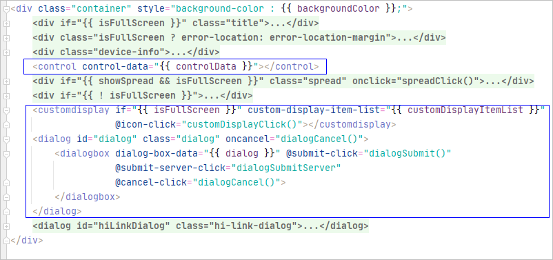
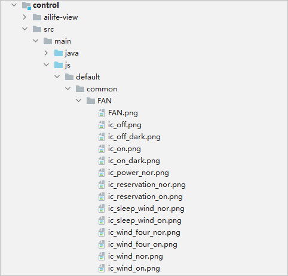

# How to Develop<a name="EN-US_TOPIC_0000001158604283"></a>

-   [Overview](#section117101122133917)
-   [Introduction to the Template](#section16117463402)
-   [Sending Messages to Devices \(NAN Channel Available\)](#section536518118361)
-   [Defining the UI of the Device Control Atomic Service](#section737418403116)

## Overview<a name="section117101122133917"></a>

The  **OneHop Device Ability \(JS\)**  template helps you implement the complete process of  **OneHop, network configuration, and device control**. By default, the template project presents the effect of an intelligent fan. You can customize the device by referring to  [Defining the UI of the Device Control Atomic Service](#section737418403116).

The template project consists of two parts:

**Network configuration atomic service \(entry module\)**

**Device control atomic service \(control module\)**

This document provides guidance on developing the device control atomic service \(control module\). For details about how to develop the network configuration atomic service \(entry module\), see  [Development Guidelines on the Network Configuration Atomic Service](guide-atomic-service-netconfig-overview.md).

## Introduction to the Template<a name="section16117463402"></a>

The directory structure of the  **control**  module in the  **OneHop Device Ability \(JS\)**  template project is as follows:

```
├─control
│  └─ailife-view // This directory does not need to be modified.
│      ├─control // Component container
│      │  ├─display // Component used for information presentation
│      │  ├─enum // Component used to present enumerations
│      │  ├─increasedecrease // Component to provide the increase and decrease operations
│      │  ├─item // Child components
│      │  ├─multifunction // Multi-function components
│      │  ├─progress // Component to present a progress bar
│      │  └─reversal // Component to provide a switch
│      ├─customdisplay // Custom display area
│      ├─dialog // Dialog box container
│      │  ├─dialogbox
│      │  ├─enumlist // Dialog box used to present enumerations
│      │  ├─info // Dialog box used for information presentation
│      │  ├─picker // Picker
│      │  └─radiolist // Dialog box used to provide radio buttons
│      ├─observed
│      └─utils
└─src
    └─main
        ├─java // For details about the content in this directory, see the class definition below.
        ├─js
        │  └─default
        │      ├─common // Local resource files, which are mainly icon resources
        │      │  └─FAN
        │      │          ic_on.png
        │      │          ic_off.png
        │      │          ...
        │      └─pages
        │          └─index
        │                  index.js // Start JS
        └─resources
            └─rawfile
                ├─FAN
                        FAN_en.json // Local template configuration file in English
                        FAN_zh.json // Local template configuration file in Chinese
```

The following table describes the classes in the source code directory  **src/main/java**.

<a name="table1763715163417"></a>
<table><thead align="left"><tr id="row1270013153413"><th class="cellrowborder" valign="top" width="28.52%" id="mcps1.1.3.1.1"><p id="p20933112381015"><a name="p20933112381015"></a><a name="p20933112381015"></a>Java</p>
</th>
<th class="cellrowborder" valign="top" width="71.48%" id="mcps1.1.3.1.2"><p id="p07009114346"><a name="p07009114346"></a><a name="p07009114346"></a>Description</p>
</th>
</tr>
</thead>
<tbody><tr id="row2070019113416"><td class="cellrowborder" valign="top" width="28.52%" headers="mcps1.1.3.1.1 "><p id="p137003123411"><a name="p137003123411"></a><a name="p137003123411"></a>MyApplication</p>
</td>
<td class="cellrowborder" valign="top" width="71.48%" headers="mcps1.1.3.1.2 "><p id="p5700131153412"><a name="p5700131153412"></a><a name="p5700131153412"></a>Application entry class.</p>
</td>
</tr>
<tr id="row1700121133420"><td class="cellrowborder" valign="top" width="28.52%" headers="mcps1.1.3.1.1 "><p id="p11700201193415"><a name="p11700201193415"></a><a name="p11700201193415"></a>ControlMainAbility</p>
</td>
<td class="cellrowborder" valign="top" width="71.48%" headers="mcps1.1.3.1.2 "><p id="p37001219341"><a name="p37001219341"></a><a name="p37001219341"></a>Entry class to start the JS page.</p>
</td>
</tr>
<tr id="row18700715343"><td class="cellrowborder" valign="top" width="28.52%" headers="mcps1.1.3.1.1 "><p id="p1670011118348"><a name="p1670011118348"></a><a name="p1670011118348"></a>BaseDeviceDataHandler</p>
</td>
<td class="cellrowborder" valign="top" width="71.48%" headers="mcps1.1.3.1.2 "><p id="p97001814349"><a name="p97001814349"></a><a name="p97001814349"></a>Abstract class for device data exchange.</p>
</td>
</tr>
<tr id="row1170019193416"><td class="cellrowborder" valign="top" width="28.52%" headers="mcps1.1.3.1.1 "><p id="p4700111343"><a name="p4700111343"></a><a name="p4700111343"></a>NetworkDeviceDataHandler</p>
</td>
<td class="cellrowborder" valign="top" width="71.48%" headers="mcps1.1.3.1.2 "><p id="p570118193413"><a name="p570118193413"></a><a name="p570118193413"></a>Inherits from the abstract class <strong id="b14468115182816"><a name="b14468115182816"></a><a name="b14468115182816"></a>BaseDeviceDataHandler</strong> to implement device data exchange in Neighbor Awareness Networking (NAN) connection mode. You can modify the code based on the device in use.</p>
</td>
</tr>
<tr id="row11701111143410"><td class="cellrowborder" valign="top" width="28.52%" headers="mcps1.1.3.1.1 "><p id="p10701218342"><a name="p10701218342"></a><a name="p10701218342"></a>SampleDeviceDataHandler</p>
</td>
<td class="cellrowborder" valign="top" width="71.48%" headers="mcps1.1.3.1.2 "><p id="p7701161173414"><a name="p7701161173414"></a><a name="p7701161173414"></a>Inherits from the abstract class <strong id="b127801919153320"><a name="b127801919153320"></a><a name="b127801919153320"></a>BaseDeviceDataHandler</strong>. This provides sample code, and you do not need to modify the code.</p>
</td>
</tr>
<tr id="row670141203410"><td class="cellrowborder" valign="top" width="28.52%" headers="mcps1.1.3.1.1 "><p id="p1970119114344"><a name="p1970119114344"></a><a name="p1970119114344"></a>DataHandlerAbility</p>
</td>
<td class="cellrowborder" valign="top" width="71.48%" headers="mcps1.1.3.1.2 "><p id="p1370113115344"><a name="p1370113115344"></a><a name="p1370113115344"></a>Implements a channel for message exchange between a Java-based system and a JS-based one.</p>
</td>
</tr>
</tbody>
</table>

<a name="table36377582916"></a>
<table><thead align="left"><tr id="row1363810581196"><th class="cellrowborder" valign="top" width="28.52%" id="mcps1.1.3.1.1"><p id="p13513164112106"><a name="p13513164112106"></a><a name="p13513164112106"></a><strong id="b251316417107"><a name="b251316417107"></a><a name="b251316417107"></a>JS</strong></p>
</th>
<th class="cellrowborder" valign="top" width="71.48%" id="mcps1.1.3.1.2"><p id="p06383581290"><a name="p06383581290"></a><a name="p06383581290"></a>Description</p>
</th>
</tr>
</thead>
<tbody><tr id="row1763835810916"><td class="cellrowborder" valign="top" width="28.52%" headers="mcps1.1.3.1.1 "><p id="p06381581496"><a name="p06381581496"></a><a name="p06381581496"></a>control/ailife-view</p>
</td>
<td class="cellrowborder" valign="top" width="71.48%" headers="mcps1.1.3.1.2 "><p id="p116381658694"><a name="p116381658694"></a><a name="p116381658694"></a>Home appliance components, which can be referenced in the JSON configuration file.</p>
</td>
</tr>
<tr id="row126381658793"><td class="cellrowborder" valign="top" width="28.52%" headers="mcps1.1.3.1.1 "><p id="p1963817584912"><a name="p1963817584912"></a><a name="p1963817584912"></a>index.js</p>
</td>
<td class="cellrowborder" valign="top" width="71.48%" headers="mcps1.1.3.1.2 "><p id="p963835816912"><a name="p963835816912"></a><a name="p963835816912"></a>Device control home page. Different components under <strong id="b15756344203518"><a name="b15756344203518"></a><a name="b15756344203518"></a>ailife-view</strong> are loaded based on the JSON configuration file.</p>
</td>
</tr>
</tbody>
</table>

## Sending Messages to Devices \(NAN Channel Available\)<a name="section536518118361"></a>

The  **OneHop Device Ability \(JS\)**  template implements delivery of messages to devices by calling Java APIs. You can invoke this template in  **NetworkDeviceDataHandler**.

**JS API: NetConfig.sendMessage\(commonInfo, message, callbackFunc\)**

-   Dependency: The  **fa-netconfig.js**  file in the template is imported.
-   Note:
    1.  Set  **commonInfo**  to the configured channel's session ID, which is obtained by the network configuration atomic service.
    2.  Set  **message**  to the message \(in a string\) to be sent to the device.
    3.  **callbackFunc**  specifies whether the message is successfully sent.


Example:

```
sendMessage: function () {
    let callbackFunc = function (value) {
	// sendMessage callback
    };
    let commonInfo = {
	sessionId: getApp(this).ConfigParams.deviceInfo.sessionId
    };
    getApp(this).Netconfig.sendMessage(commonInfo, message, callbackFunc).then(
	function (result) {
	    let ret = JSON.parse(result);
	    // sendMessage message delivery result
        });
}
```

**Java API: NetConfigApi._getInstance_\(\).sendMessage\(CommonInfo commonInfo, String message, BaseCallback<String\> callback\)**

Dependency: Add  **implementation\(group:'com.huawei.hilink',name:'ailifeability',version:'1.0.0.1',ext:'har'\)**  to  **dependencies**  in the  **build.gradle**  file.

Note:

1.  Set  **commonInfo**  to the configured channel's session ID, which is obtained by the network configuration atomic service.
2.  Set  **message**  to the message \(in a string\) to be sent to the device.
3.  **callback**  specifies whether the message is successfully sent.

Example:

```
private void sendMessage(String message, HashMap<String, Object> tmpMap) {
    CommonInfo commonInfo = new CommonInfo();
    commonInfo.setSessionId(sessionId);
    HiLog.error(LABEL_LOG, "sessionId " + sessionId);
    NetConfigApi.getInstance().sendMessage(commonInfo, message, (code, controlMessage, str) -> {
	if (code == 0) {
	    HiLog.info(LABEL_LOG, "Message sent successfully" + message);
	    dataMap.putAll(tmpMap);
	    mainHandler.postTask(() -> onDeviceDataChange(dataMap));
	} else {
	    HiLog.error(LABEL_LOG, "Failed to send the message. Code =" +
	    code + " control message = " + controlMessage);
	}
    });
}
```

## Defining the UI of the Device Control Atomic Service<a name="section737418403116"></a>

This section describes how to develop the device control UI. There are two methods:

1.  Use preset components and configure the JSON configuration file. Using this method, you can quickly create the device control UI. In addition, every component on the UI is bound with a click event and processing logic.
2.  Use native components to develop the device control UI from the scratch. This method provides more flexibility.

This section describes the procedure using the first method. The development procedure using the second method will be provided later.

The template provides a variety of UI components in  **control/ailife-view**  and defines a set of JSON configuration rules. This set of rules references custom UI components to generate a custom device control UI.

The component reference code in  **control/src/main/js/default/pages/index/index.hml**  is as follows. \(For details about the component style, see  [JSON Configuration File Description](guide-atomic-service-device-ctrl-json-intro.md).\)



**To build a device control UI by using preset components, perform the following steps:**

1.  Declare the JSON configuration file that describes the UI and save the file in the  **control/src/main/resources/rawfile/<deviceName\>**  directory.

    For details about the fields in the JSON configuration file, see  [JSON Configuration File Description](guide-atomic-service-device-ctrl-json-intro.md). The file name must be <deviceName\>\_<language\>.json.

    > **NOTE:** 
    >The template provides four samples: lamp, toothbrush, soy milk maker, and intelligent fan. The configuration files are  **LAMP.json**,  **TOOTHBRUSH.json**,  **SOYMILKMACHINE.json**, and  **FAN.json**, respectively.
    >By default,  **FAN.json**  is used.

    

2.  Use UX icon resources, which can be local or online resources.

    To use local resources, pack them to the  **control/src/main/js/default/common/_<deviceName\>_**  directory. Then you can directly reference them in the JSON configuration file.

    

    To use online resources, you must add the resource URL to the code. Specifically, in the  **getTemplate**  method of  **DataHandlerAbility.java**, set  **iconUrl**  to the resource URL. The resource referenced in the JSON configuration file is the relative path of the resource URL. The following is an example of the part in the  **getTemplate**  method that needs to be modified:

    ```
    if (result != null) {
            // iconUrl is the icon's prefix path. Here we use /common/productName in the JS module. You can change it to your URL. All icon files must be under iconUrl.
    	result.put("iconUrl", SampleDeviceDataHandler.EXAMPLE_RESOURCE_DIR + "/" + productName);
    // deviceIcon is the product icon's file name. It must be under iconUrl.
    	result.put("deviceIcon", "/" + productName + ".png");
    // logoIcon is the product logo's file name. It must be under iconUrl.
    	result.put("logoIcon", "/logo.png");
    }
    ```

3.  Set  **DEVICE\_DATA\_MODE**  in  **DataHandlerAbility.java**  to  **DEVICE\_DATA\_MODE\_NETWORK\_DEVICE**. Then, you can use  **NetworkDeviceDataHandler.java**  to process data and control devices in seconds.

    For details, see  **fanDataModel**  in  **NetworkDeviceDataHandler.java**. The template has implemented the data processing logic of the intelligent fan. This processing logic converts the data passed by the click events into instructions and sends the instructions to the device. You can add your own device processing logic by referring to the fan model.

    ```
    public class NetworkDeviceDataHandler extends BaseDeviceDataHandler {
        private static final HiLogLabel LABEL_LOG = new HiLogLabel(HiLog.DEBUG, 0, "MessageDataHandler");
        private static String sessionId = null;
        private final DeviceDataModel dataModel;
        private final EventHandler mainHandler;
        private final Map<String, Object> dataMap = new HashMap<>();
        private final DeviceDataModel fanDataModel = new DeviceDataModel() {
            @Override
            public Map<String, Object> recoverData() {
                dataMap.put("switch/on", 0);
                dataMap.put("windMode/mode", 0);
                dataMap.put("windGear/gear", 0);
                dataMap.put("shutdown/mode", 0);
                return dataMap;
            }
    	}
    }
    ```

    To learn more about the code processing flow, see  [Core Code Description](guide-atomic-service-device-ctrl-logic.md#section17354153553419).


