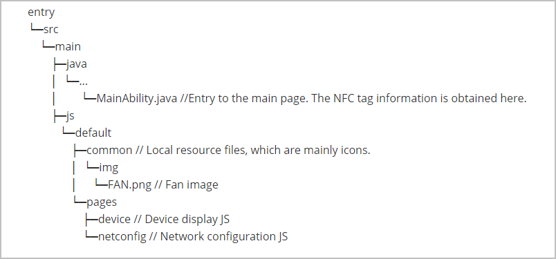
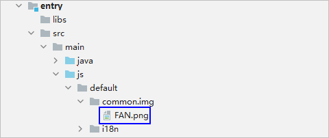

# How to Develop<a name="EN-US_TOPIC_0000001158765979"></a>

-   [Overview](#section117101122133917)
-   [Project Structure](#section163058534218)
-   [Defining the UI of the Network Configuration Atomic Service](#section129531555424)

## Overview<a name="section117101122133917"></a>

The  **OneHop Device Ability \(JS\)**  template helps you implement the complete process of  **OneHop, network configuration, and device control**. By default, the template project presents the effect of a smart fan. You can customize the device by referring to  [Defining the UI of the Network Configuration Atomic Service](#section129531555424).

The template project consists of two parts:

**Network configuration atomic service \(entry module\)**

**Device control atomic service \(control module\)**

This document provides guidance on developing the network configuration atomic service \(entry module\). For details about how to develop the device control atomic service \(control module\), see  [Development Guidelines on the Device Control Atomic Service](guide-atomic-service-device-ctrl-overview.md).

## Project Structure<a name="section163058534218"></a>

The following figure shows the directory structure of the  **entry**  module in the  **OneHop Device Ability \(JS\)**  template project.



The following table describes the classes in the source code directory.

<a name="table21156122315"></a>
<table><thead align="left"><tr id="row81671115238"><th class="cellrowborder" valign="top" width="22.36%" id="mcps1.1.3.1.1"><p id="p181670112231"><a name="p181670112231"></a><a name="p181670112231"></a>Class</p>
</th>
<th class="cellrowborder" valign="top" width="77.64%" id="mcps1.1.3.1.2"><p id="p18167111122313"><a name="p18167111122313"></a><a name="p18167111122313"></a>Description</p>
</th>
</tr>
</thead>
<tbody><tr id="row141674115231"><td class="cellrowborder" colspan="2" valign="top" headers="mcps1.1.3.1.1 mcps1.1.3.1.2 "><p id="p11679172319"><a name="p11679172319"></a><a name="p11679172319"></a><strong id="b1716713114234"><a name="b1716713114234"></a><a name="b1716713114234"></a>Java</strong></p>
</td>
</tr>
<tr id="row1516781132314"><td class="cellrowborder" valign="top" width="22.36%" headers="mcps1.1.3.1.1 "><p id="p116751132311"><a name="p116751132311"></a><a name="p116751132311"></a>MyApplication</p>
</td>
<td class="cellrowborder" valign="top" width="77.64%" headers="mcps1.1.3.1.2 "><p id="p2016719117238"><a name="p2016719117238"></a><a name="p2016719117238"></a>Application entry class.</p>
</td>
</tr>
<tr id="row101670192310"><td class="cellrowborder" valign="top" width="22.36%" headers="mcps1.1.3.1.1 "><p id="p4167121172314"><a name="p4167121172314"></a><a name="p4167121172314"></a>MainAbility</p>
</td>
<td class="cellrowborder" valign="top" width="77.64%" headers="mcps1.1.3.1.2 "><p id="p016718116235"><a name="p016718116235"></a><a name="p016718116235"></a>Entry class to start the JS page and process device information read from an NFC tag.</p>
</td>
</tr>
<tr id="row71685114234"><td class="cellrowborder" colspan="2" valign="top" headers="mcps1.1.3.1.1 mcps1.1.3.1.2 "><p id="p21681513237"><a name="p21681513237"></a><a name="p21681513237"></a><strong id="b21688112316"><a name="b21688112316"></a><a name="b21688112316"></a>JS</strong></p>
</td>
</tr>
<tr id="row5168101192316"><td class="cellrowborder" valign="top" width="22.36%" headers="mcps1.1.3.1.1 "><p id="p10168117236"><a name="p10168117236"></a><a name="p10168117236"></a>default/pages/device/device.js</p>
</td>
<td class="cellrowborder" valign="top" width="77.64%" headers="mcps1.1.3.1.2 "><p id="p181681518237"><a name="p181681518237"></a><a name="p181681518237"></a>Device introduction page, which is displayed after a OneHop operation.</p>
</td>
</tr>
<tr id="row1016814111235"><td class="cellrowborder" valign="top" width="22.36%" headers="mcps1.1.3.1.1 "><p id="p1816814112316"><a name="p1816814112316"></a><a name="p1816814112316"></a>default/pages/netconfig/netconfig.js</p>
</td>
<td class="cellrowborder" valign="top" width="77.64%" headers="mcps1.1.3.1.2 "><p id="p111681119236"><a name="p111681119236"></a><a name="p111681119236"></a>Network configuration page, which is responsible for the logic related to network configuration. This page is displayed after you click <strong id="b198725743613"><a name="b198725743613"></a><a name="b198725743613"></a>Configure network</strong> on the device introduction page.</p>
</td>
</tr>
</tbody>
</table>

## Defining the UI of the Network Configuration Atomic Service<a name="section129531555424"></a>

1.  Process the product ID read from the NFC tag in the  **onStart**  method of the  **MainAbility**.  **You can map productId to a different device type and change productName to a specific device name**. By default, a smart fan is used.

    ```
    @Override
    public void onStart(Intent intent) {
    	intent.setParam("window_modal", 3);
    	setInstanceName(JS_MODULE);
    
    	Object productInfo = Objects.requireNonNull(intent.getParams()).getParam("productInfo");
    	if (productInfo != null) {
    		productId = (String) productInfo;
    		// Modify your product name according to your product ID in the NFC tag.
    		productName = "FAN";
    	}
    }
    ```

2.  Place the product diagram in the resource directory for UI display.  **Note that the file name must be <deviceName\>.png and the device name must be the same as the value of productName.**

    

    The product diagram is displayed on the device introduction page and network configuration page.

3.  Add  **deviceType: 1**  to the  **goToControl**  method of  **entry\\src\\main\\js\\default\\pages\\netconfig\\netconfig.js**  to improve the stability of network configuration.

    ```
    goToControl() {
    	let target = {
                    bundleName: 'com.example.middleplatform.deviceoperate',
                    abilityName: 'com.example.middleplatform.ControlMainAbility',
                    deviceType: 1,
                    data: {
                            session_id: getApp(this).ConfigParams.deviceInfo.sessionId,
                            product_id: getApp(this).Product.productId,
                            product_name: getApp(this).Product.productName
                    }
            }
            FeatureAbility.startAbility(target);
            app.terminate();
    }
    ```


