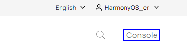
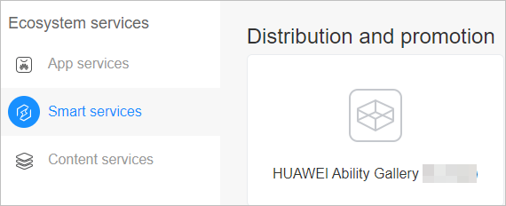
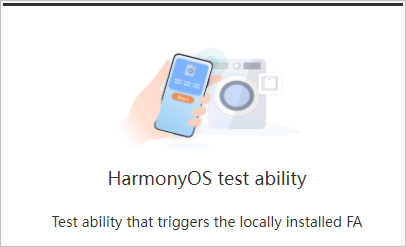
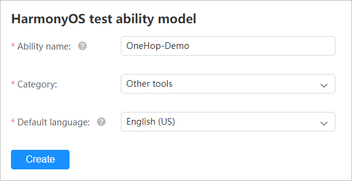
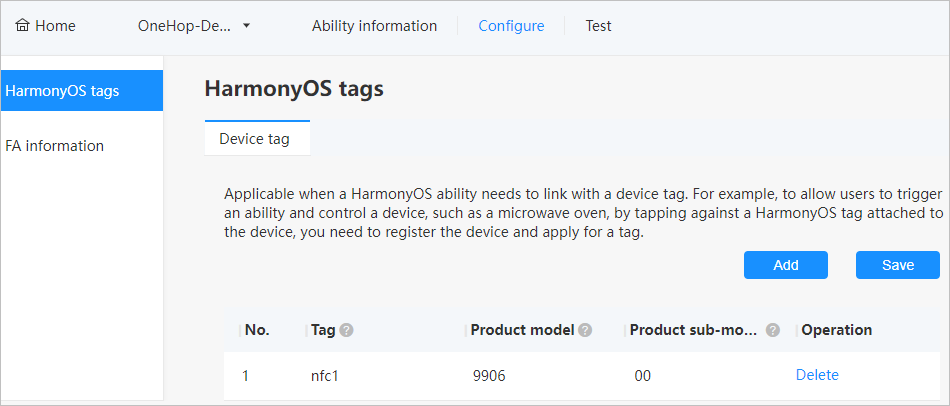
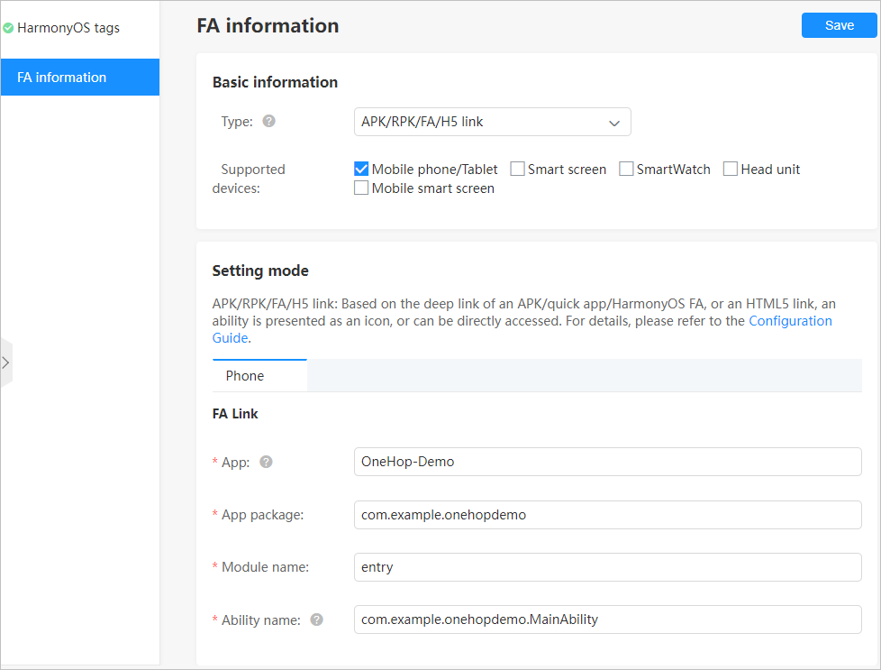
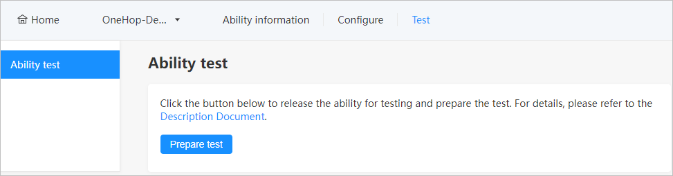

# Configuring a Service Association Intent

Configure the association intent for the atomic service on the HUAWEI Ability Gallery to match the product ID in the NFC tag. This way, users can tap their phone against the NFC tag to obtain the atomic service information and thereby launch the network configuration atomic service.

Let's see how to configure the association intent for an atomic service on the HUAWEI Ability Gallery.

1.  Use a Huawei developer account that has completed identity verification to log in to the  [HUAWEI Developers](https://developer.huawei.com/consumer/en/). Then, access the console.

    

2.  Choose  **Ecosystem services**  \>  **Smart services**  and access HUAWEI Ability Gallery. If this is the first time you use HUAWEI Ability Gallery, read and sign the  **HUAWEI Ability Gallery Service Agreement**.

    

3.  Click the  **Create ability**  button and then select  **HarmonyOS test ability**.

    

4.  Set  **Ability name**,  **Category**, and  **Default language**, and then click  **Create**.

    

5.  Configure the ability information, including the following:
    -   Basic information, such as the ability version number, version description, and ability level. When you are done, click  **Save**.
    -   Display information, such as the brief description, developer brand, and ability icon. Be sure to upload the large icon of the ability. When you are done, click  **Save**.

6.  Choose  **Configure**  \>  **HarmonyOS tags**  and click  **Add**  to add a device tag. Set  **Product model**  to the product ID you have obtained in the HUAWEI DevEco Assistant app, and  **Product sub-model**  to  **00**, and then click  **Save**.

    

7.  Choose  **Configure**  \>  **FA information**, configure the FA basic information and setting mode, and then click  **Save**.

    -   Basic information: Set  **Type**  to  **APK/RPK/FA/H5 link**.
    -   Setting mode: Configure  **FA Link**  fields.
        -   **App package**: Enter the value of  **bundleName**  in the  **config.json**  file.
        -   **Module name**: Enter the value of  **moduleName**  in the  **config.json**  file of the entry module \(network configuration module\).
        -   **Ability name**: Enter the value of  **mainAbility**  in the  **config.json**  file of the entry module \(network configuration module\).

    

8.  On the  **Test**  tab page, click  **Prepare test**  to start the test. The test is valid for one month. After the validity period expires, click  **Prepare again**.

    

