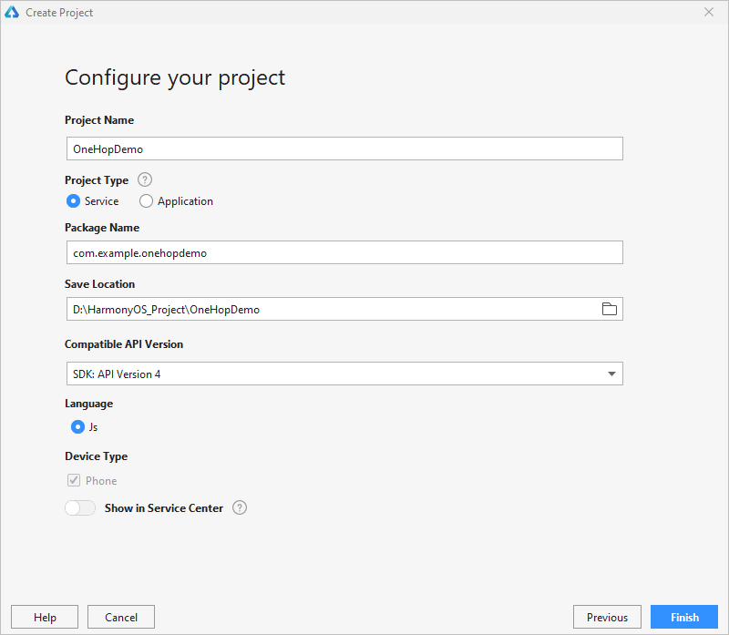
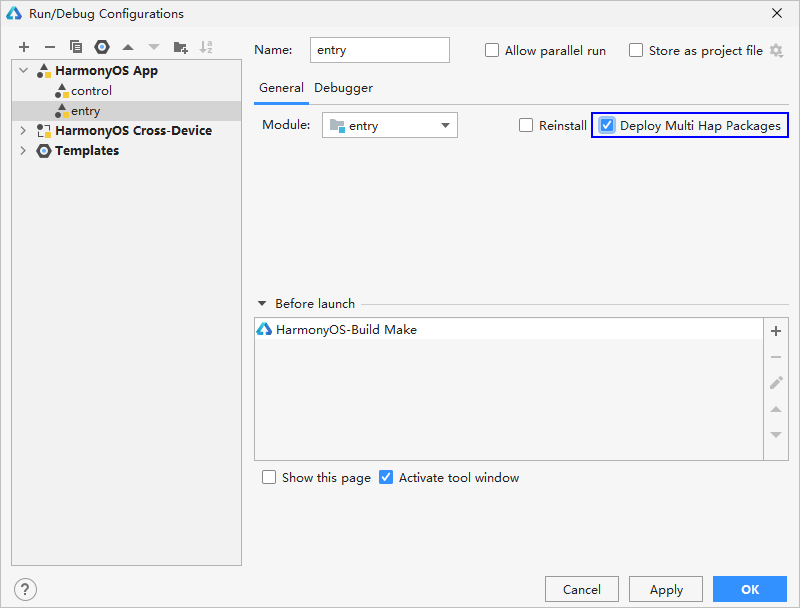
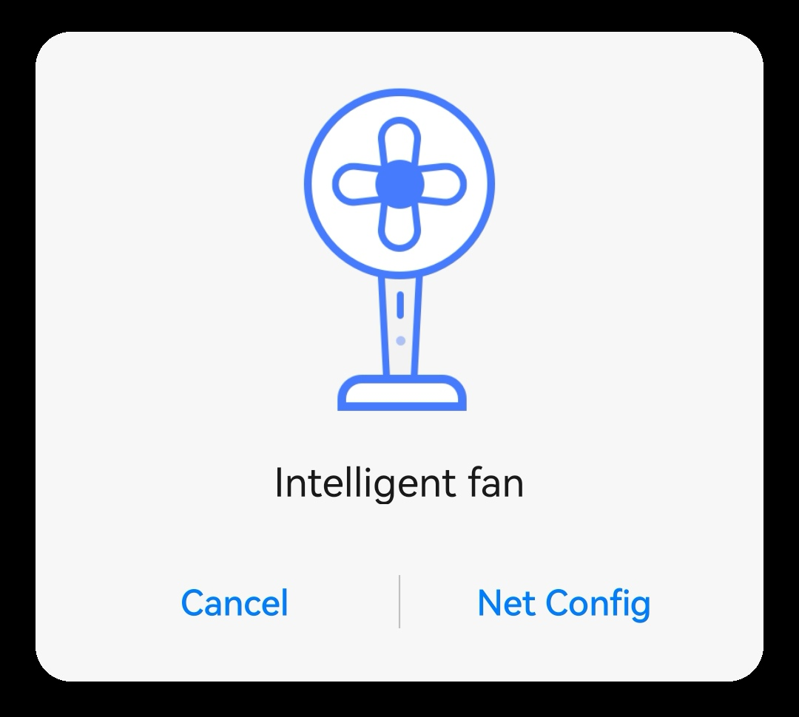

# Developing Atomic Services<a name="EN-US_TOPIC_0000001213473151"></a>

Use the  **OneHop Device Ability\(JS\)**  template to implement the process from tapping and network configuration to device control. The HarmonyOS atomic service development for OneHop involves the network configuration atomic service and the device control atomic service. Before you proceed with the following procedure, make sure you have installed  [DevEco Studio 3.0 Beta1](https://developer.harmonyos.com/cn/develop/deveco-studio#download_beta)  or later and  [built the development environment](https://developer.harmonyos.com/en/docs/documentation/doc-guides/installation_process-0000001071425528).

1.  Open the DevEco Studio project wizard using either of the following methods:
    -   If no project is open, select  **Create Project**  on the welcome page.
    -   If a project is already open, choose  **File**  \>  **New**  \>  **New Project**  from the menu bar.

2.  In the project wizard, click  **Template Market**  and download the  **OneHop Device Ability\(JS\)**  template.

    

3.  Return to the project creation page. From the template list, select the downloaded  **OneHop Device Ability**  template and click  **Next**  to configure the project.
4.  In the project configuration, set  **Project Type**  to  **Service**, select  **Show in Service Center**, and click  **Finish**.

    > **NOTE:** 
    >Generally, the device control and network configuration atomic services are started by OneHop. In the debugging phase, to start these atomic services directly by touching the respective app icon on the phone's home screen, you can change the value of the  **installationFree**  field in the project  **config.json**  file to  **false**. After the debugging is complete, change the value back to  **true**.

    

5.  In the  **entry\\src\\main\\js\\default\\pages\\netconfig\\netconfig.js**  file, add  **deviceType: 1**  to the  **goToControl**  method, so that the atomic services can be started from the local device.

    ```
    goToControl() {
    	let target = {
                    bundleName: 'com.example.middleplatform.deviceoperate',
                    abilityName: 'com.example.middleplatform.ControlMainAbility',
                    deviceType: 1,
                    data: {
                            session_id: getApp(this).ConfigParams.deviceInfo.sessionId,
                            product_id: getApp(this).Product.productId,
                            product_name: getApp(this).Product.productName
                    }
            }
            FeatureAbility.startAbility(target);
            app.terminate();
    }
    ```

    > **NOTE:** 
    >The  **OneHop Device Ability\(JS\)**  template has been preconfigured with the network configuration and device control atomic services of an intelligent fan. To modify the UI and functions of these atomic services, refer to the following:
    >-   Network configuration atomic service:  [Development Guidelines on the Network Configuration Atomic Service](guide-atomic-service-netconfig-overview.md)
    >-   Device control atomic service:  [Development Guidelines on the Device Control Atomic Service](guide-atomic-service-device-ctrl-overview.md)

6.  Sign the atomic services so they can run on Huawei phones. For detailed operations, see  [Automatically Signing Your App Using DevEco Studio](https://developer.harmonyos.com/en/docs/documentation/doc-guides/ide_debug_device-0000001053822404#section837891802519).
7.  On the DevEco Studio menu bar, choose  **Run**  \>  **Edit Configurations**. Then, select  **Deploy Multi Hap Packages**  under the  **entry**  module, so that the  **control**  module \(device control atomic service\) is automatically installed on the device when the  **entry**  module \(network configuration atomic service\) is run.

    

8.  On the toolbar, select the  **entry**  module and click  **Run**  to install the network configuration and device control atomic services on the device.

    In the  **entry\\src\\main\\resources\\base\\element\\string.json**  file,  **entry\_MainAbility**  indicates the name of the network configuration atomic service. You can change it to whatever you prefer.

    In the  **control\\src\\main\\resources\\base\\element\\string.json**  file,  **control\_ControlMainAbility**  indicates the name of the device control atomic service. You can change it to whatever you prefer.

    

9.  On the phone's home screen, click the  **Net Config**  button and check whether the device authentication atomic service is started, as shown below.

    


