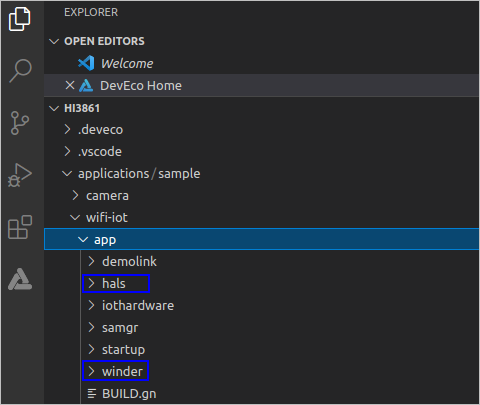
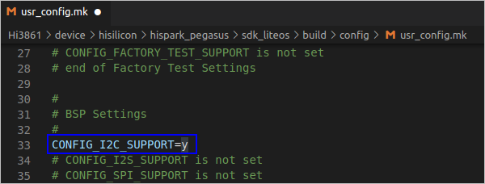
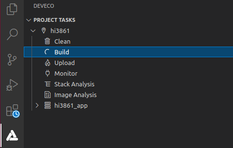
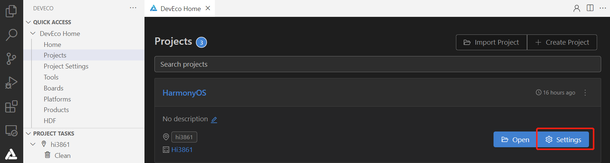
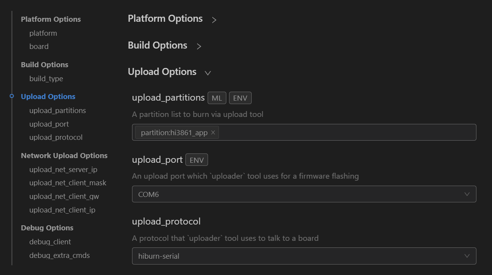
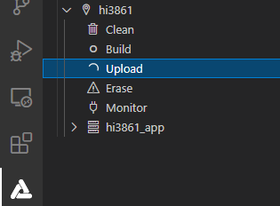

# Developing the Hi3861 Development Board<a name="EN-US_TOPIC_0000001167754794"></a>

-   [Writing Source Code](#section103951747175415)
-   [Compiling Source Code](#section188441785558)
-   [Burning Source Code](#section91141823135914)

Use the DevEco Device Tool to develop, compile, and burn the Hi3861 source code in the Ubuntu development environment. For details, see  [Ubuntu Development Environment](https://device.harmonyos.com/en/docs/ide/user-guides/install_ubuntu-0000001072959308).

## Writing Source Code<a name="section103951747175415"></a>

1.  Decompress the Hi3861 source code package. In DevEco Device Tool, click  **Import Project**  to open the source code file.

    

2.  When a message is displayed to indicate that the selected directory is not a project directory, click  **Import**  to continue.

    

3.  Set  **MCU**  to  **Hi3861**,  **Board**  to  **Hi3861**, and  **Framework**  to  **Hb**, and then click  **Import**.

    

4.  Copy the  **hals**  and  **winder**  folders in the Hi3861 demo code to the  **applications/sample/wifi-iot/app/**  directory in the source code project.

    

5.  Open the  **device/hisilicon/hispark\_pegasus/hi3861\_adapter/hals/communication/wifi\_lite/wifiservice/source/wifi\_device.c**  file and comment out the following code:

    ```
     if (LockWifiEventLock() != WIFI_SUCCESS) {
         return;
     }
    
     if (UnlockWifiEventLock() != WIFI_SUCCESS) {
         return;
     }
    ```

6.  Open the  **device/hisilicon/hispark\_pegasus/sdk\_liteos/build/config/usr\_config.mk**  file, find  **CONFIG\_I2C\_SUPPORT is not set**, uncomment it, and change it to  **CONFIG\_I2C\_SUPPORT=y**.

    

7.  Open the  **applications/sample/wifi-iot/app/BUILD.gn**  file, change  **startup**  in the  **features**  field to  **winder**, and add the index  **deps**  of the  **winder**  module. Sample code is as follows:

    ```
     import("//build/lite/config/component/lite_component.gni")
        
       lite_component("app") {
       features = [
           "winder",
       ]
       deps = [ "//applications/sample/wifi-iot/app/hals:hi3861_hals" ]
     }
    ```


## Compiling Source Code<a name="section188441785558"></a>

Use DevEco Device Tool to compile the source code.

1.  Download and decompress the tools listed below.

    <a name="table197391139175613"></a>
    <table><thead align="left"><tr id="en-us_topic_0000001192526021_row6207164803718"><th class="cellrowborder" valign="top" width="19.121912191219124%" id="mcps1.1.4.1.1"><p id="en-us_topic_0000001192526021_p1220714482376"><a name="en-us_topic_0000001192526021_p1220714482376"></a><a name="en-us_topic_0000001192526021_p1220714482376"></a>Tool</p>
    </th>
    <th class="cellrowborder" valign="top" width="55.055505550555054%" id="mcps1.1.4.1.2"><p id="en-us_topic_0000001192526021_p4207184820378"><a name="en-us_topic_0000001192526021_p4207184820378"></a><a name="en-us_topic_0000001192526021_p4207184820378"></a>How to Obtain</p>
    </th>
    <th class="cellrowborder" valign="top" width="25.82258225822582%" id="mcps1.1.4.1.3"><p id="en-us_topic_0000001192526021_p420724863714"><a name="en-us_topic_0000001192526021_p420724863714"></a><a name="en-us_topic_0000001192526021_p420724863714"></a>Path in Tools</p>
    </th>
    </tr>
    </thead>
    <tbody><tr id="en-us_topic_0000001192526021_row46755108331"><td class="cellrowborder" valign="top" width="19.121912191219124%" headers="mcps1.1.4.1.1 "><p id="en-us_topic_0000001192526021_p19675161073317"><a name="en-us_topic_0000001192526021_p19675161073317"></a><a name="en-us_topic_0000001192526021_p19675161073317"></a>GN</p>
    </td>
    <td class="cellrowborder" valign="top" width="55.055505550555054%" headers="mcps1.1.4.1.2 "><p id="en-us_topic_0000001192526021_p1857514815456"><a name="en-us_topic_0000001192526021_p1857514815456"></a><a name="en-us_topic_0000001192526021_p1857514815456"></a><a href="https://repo.huaweicloud.com/harmonyos/compiler/gn/1717/linux/gn-linux-x86-1717.tar.gz" target="_blank" rel="noopener noreferrer">https://repo.huaweicloud.com/harmonyos/compiler/gn/1717/linux/gn-linux-x86-1717.tar.gz</a></p>
    </td>
    <td class="cellrowborder" valign="top" width="25.82258225822582%" headers="mcps1.1.4.1.3 "><p id="en-us_topic_0000001192526021_p16261055122016"><a name="en-us_topic_0000001192526021_p16261055122016"></a><a name="en-us_topic_0000001192526021_p16261055122016"></a>Folder where <strong id="b18697112316348"><a name="b18697112316348"></a><a name="b18697112316348"></a>gn.exe</strong> is located.</p>
    </td>
    </tr>
    <tr id="en-us_topic_0000001192526021_row429115712472"><td class="cellrowborder" valign="top" width="19.121912191219124%" headers="mcps1.1.4.1.1 "><p id="en-us_topic_0000001192526021_p1558143018453"><a name="en-us_topic_0000001192526021_p1558143018453"></a><a name="en-us_topic_0000001192526021_p1558143018453"></a>Ninja</p>
    </td>
    <td class="cellrowborder" valign="top" width="55.055505550555054%" headers="mcps1.1.4.1.2 "><p id="en-us_topic_0000001192526021_p117021959204517"><a name="en-us_topic_0000001192526021_p117021959204517"></a><a name="en-us_topic_0000001192526021_p117021959204517"></a><a href="https://repo.huaweicloud.com/harmonyos/compiler/ninja/1.9.0/linux/ninja.1.9.0.tar" target="_blank" rel="noopener noreferrer">https://repo.huaweicloud.com/harmonyos/compiler/ninja/1.9.0/linux/ninja.1.9.0.tar</a></p>
    </td>
    <td class="cellrowborder" valign="top" width="25.82258225822582%" headers="mcps1.1.4.1.3 "><p id="en-us_topic_0000001192526021_p126125572018"><a name="en-us_topic_0000001192526021_p126125572018"></a><a name="en-us_topic_0000001192526021_p126125572018"></a>Folder where <strong id="b187123163361"><a name="b187123163361"></a><a name="b187123163361"></a>ninja.exe</strong> is located.</p>
    </td>
    </tr>
    <tr id="en-us_topic_0000001192526021_row72912072477"><td class="cellrowborder" valign="top" width="19.121912191219124%" headers="mcps1.1.4.1.1 "><p id="en-us_topic_0000001192526021_p12396121984619"><a name="en-us_topic_0000001192526021_p12396121984619"></a><a name="en-us_topic_0000001192526021_p12396121984619"></a>gcc_riscv32</p>
    </td>
    <td class="cellrowborder" valign="top" width="55.055505550555054%" headers="mcps1.1.4.1.2 "><p id="en-us_topic_0000001192526021_p42070254469"><a name="en-us_topic_0000001192526021_p42070254469"></a><a name="en-us_topic_0000001192526021_p42070254469"></a><a href="https://repo.huaweicloud.com/harmonyos/compiler/gcc_riscv32/7.3.0/linux/gcc_riscv32-linux-7.3.0.tar.gz" target="_blank" rel="noopener noreferrer">https://repo.huaweicloud.com/harmonyos/compiler/gcc_riscv32/7.3.0/linux/gcc_riscv32-linux-7.3.0.tar.gz</a></p>
    </td>
    <td class="cellrowborder" valign="top" width="25.82258225822582%" headers="mcps1.1.4.1.3 "><p id="en-us_topic_0000001192526021_p5261855182018"><a name="en-us_topic_0000001192526021_p5261855182018"></a><a name="en-us_topic_0000001192526021_p5261855182018"></a><strong id="b798284818378"><a name="b798284818378"></a><a name="b798284818378"></a>gcc_riscv32</strong> folder.</p>
    </td>
    </tr>
    </tbody>
    </table>

2.  In DevEco Device Tool, choose  **Tools**, and then click  **Add user component**  to add Gn, Ninja, and gcc\_riscv32. When adding the tools, note that the tool names cannot be changed.

    

3.  Go to    \>  **PROJECT TASKS**  \>  **Build**  to start compilation.

    

4.  Wait until  **SUCCESS**  is displayed in the  **TERMINAL**  window, indicating that the compilation is complete.

    


## Burning Source Code<a name="section91141823135914"></a>

1.  Connect the PC and the target development board through the USB port. For details, see  [Hi3861 Development Board](https://device.harmonyos.com/en/docs/start/introduce/oem_minitinier_des_3861-0000001105041324).
2.  <a name="en-us_topic_0000001056563976_li848662117291"></a>Open Device Manager, and then check and record the serial port number corresponding to the development board.

    > **NOTE:** 
    >If the serial port number is not displayed correctly, follow the steps described in  [Installing the Serial Port Driver on Hi3861 V100](https://device.harmonyos.com/en/docs/ide/user-guides/hi3861-drivers-0000001058153433).

    

3.  In DevEco Device Tool, choose  **QUICK ACCESS**  \>  **DevEco Home**  \>  **Projects**, and then click  **Settings**.

    

4.  On the  **Partition Configuration**  tab page, modify the settings. Unless otherwise required, you can leave the fields at their default settings.

    > **NOTE:** 
    >If you obtain the file to be burnt by way of copying, manually change the path of the file to be burnt: Click the tab of the file to be burnt, select  **Partition\_bin**  from the  **New Option**  drop-down list box in  **Partition Settings**, and set the path of the file to be burnt in  **Partition\_bin**.

5.  On the  **hi3861**  tab page, set the burning options.

    -   **upload\_port**: Select the serial port number obtained in  [2](#en-us_topic_0000001056563976_li848662117291).
    -   **upload\_protocol**: Select the programming protocol. For Windows, set this parameter to  **burn-serial**  or  **hiburn-serial**. For Linux, set this parameter to  **hiburn-serial**.
    -   **upload\_partitions**: Select the file to be burned.  **hi3861\_app**  is selected by default.

    

6.  Click  **Save**  on the top to save your settings.
7.  Open the project file. In the DevEco Device Tool window, go to  **PROJECT TASKS**  \>  **hi3861**  \>  **Upload**  to start burning.

    

8.  When the following information is displayed, press the RST button on the development board to restart it.

    

9.  Wait until the burning is complete. When the following message is displayed, the burning is successful.

    


