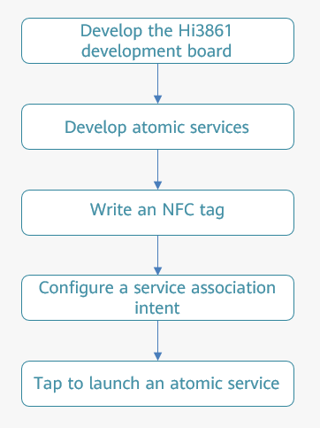

# Preparations

To develop OneHop, you need to develop the HarmonyOS atomic service and Hi3861 development board. Before you start, make the following preparations:

**Preparations for HarmonyOS atomic service development:**

-   Prepare a Huawei Mate series or P series phone that has been updated to HarmonyOS 2.0.0.168 or later.
-   Download  [DevEco Studio 3.0 Beta1](https://developer.harmonyos.com/cn/develop/deveco-studio#download_beta)  and  [build the development environment](https://developer.harmonyos.com/en/docs/documentation/doc-guides/installation_process-0000001071425528).
-   Download and install the HUAWEI DevEco Assistant app from Huawei AppGallery.
-   Prepare an NFC tag. You can tap the NFC tag with your phone to ensure that the NFC function is available.
-   Go to  **Settings**  \>  **Apps & services**  \>  **Apps**, search for  **AI Life Service**, and check whether the version of AI Life is 12.0.2.306 or later. If not, open the AI Life app on your Huawei phone, go to  **Me**  \>  **Settings**  \>  **Check for updates**, and update AI Life Service.

**Preparations for the development of the Hi3861 development board:**

-   Prepare the Hi3861 development board \(HiSpark Wi-Fi IoT Smart Home Development Kit\).
-   Download the  [HUAWEI DevEco Device Tool 3.0 Beta1](https://device.harmonyos.com/cn/ide#download_beta)  Linux version and  [build the Ubuntu development environment](https://device.harmonyos.com/en/docs/documentation/guide/install_ubuntu-0000001072959308).
-   Obtain the OpenHarmony 1.1.0 LTS source code. For details, see  [Source Code Acquisition](https://gitee.com/openharmony/docs/blob/master/en/release-notes/openharmony-1-1-0-lts.md).
-   [Obtain the Hi3861 demo code](https://gitee.com/openharmony-sig/knowledge_demo_smart_home/tree/master/dev/team_x/demo_winder)  for network configuration and reception of device control instructions.

Now, before you proceed with the development, take a look at the development process below.

