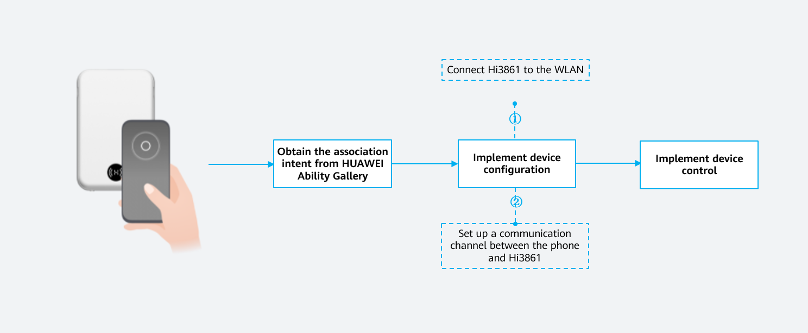
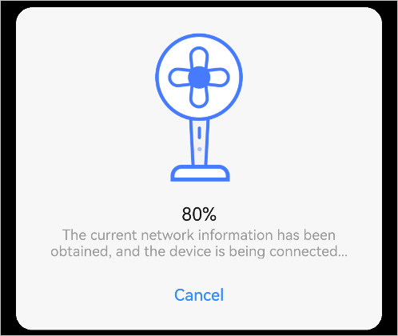
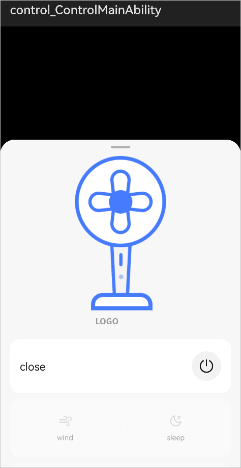
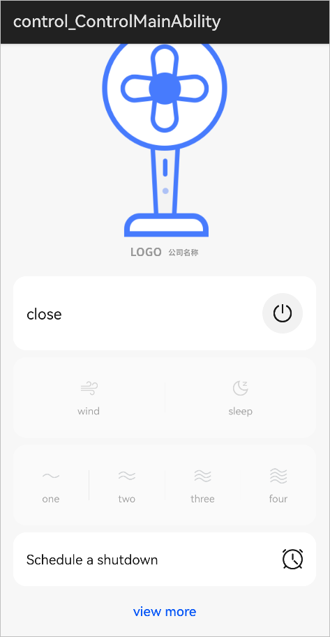

# Tapping to Launch an Atomic Service

When the phone is tapped against the NFC tag of the Hi3861 development board, the phone automatically connects to Hi3861 on the same WLAN, and launches the network configuration/device control atomic service.

Before using OneHop to launch the atomic service, you must log in to your phone with the HUAWEI ID used to request the product ID in the HUAWEI DevEco Assistant app.

1.  Enable NFC on your phone and make sure your phone is connected to a WLAN.
2.  Before tapping the NFC tag, press the  **RST**  button on the Hi3861 development board to reset it.
3.  Tap the NFC tag against the back of your phone. The screen shown below will be displayed on the phone.

    > **NOTE:** 
    >When tapping the NFC tag, keep the phone within 5 cm away from the development board. If no device is detected, tap the NFC tag again.

    

4.  Touch  **Net Config**  and wait until the device is authenticated.

    > **NOTE:** 
    >If an error message is displayed to indicate that device scanning fails, perform the following operations to troubleshoot:
    >1.  Disconnect your phone from the WLAN, and then connect your phone to the WLAN again.
    >2.  Press the  **RST**  button on the Hi3861 development board to reset it.
    >3.  Tap the NFC tag again.

    

5.  After the network configuration is complete, the device control page is automatically displayed in half-screen mode. Swipe up on the page and touch  **view more**  to switch to full-screen mode.

    

6.  Perform operations on the device control page. Then, check the LCD of the Hi3861 development board to find out whether your instructions are received properly.

    

Congratulations! You have completed the development of the Hop feature.

