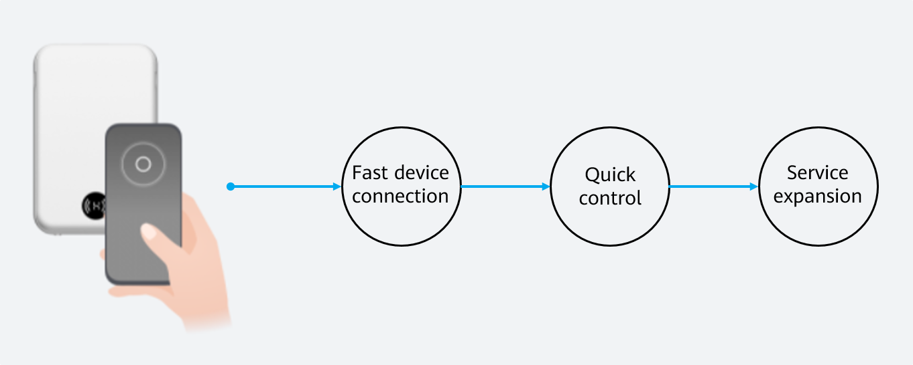

# Overview

> **NOTE:** 
>This guide is prepared for the purpose of helping individual developers to try out the HarmonyOS's OneHop feature. Do not use it to develop or release a commercial solution of OneHop. 

The OneHop feature in HarmonyOS is designed for multi-device collaboration. By leveraging the Near Field Communication \(NFC\) protocol, the feature simplifies connections between phones and other devices with a single tap. Combined with the phone's atomic service capabilities, OneHop offers seamless service hopping between devices, complete with lightning-fast device pairing and effortless remote control.

With HarmonyOS's OneHop and atomic service capabilities, your development work is so much easier, thanks to template code and APIs that span the entire process, including atomic service network configuration templates and control templates. You only need to modify the configuration items in the template code to complete the development of atomic services. Then, leverage the OneHop capability to start atomic services for lightning-fast device pairing and convenient device control. The OneHop feature provides the following functions:

-   **Fast device connection**

    OneHop initiates a device connection process. When the user taps their phone against an unconnected device, the atomic service on the phone is started to quickly complete the pairing between the phone and the device.

-   **Quick control**

    Most device control functions can be implemented through the service widgets of atomic services.

-   **Service expansion**

    To enrich the user experience and accommodate more use cases, you can develop interaction features for atomic services and provide these features through the service widget UI.

